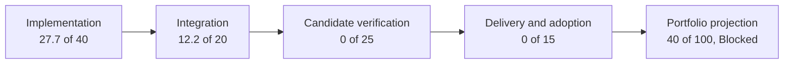

# Current Feature Readiness

**Status:** high-level readiness snapshot; orientation only, not feature acceptance or release approval

**Snapshot:** 2026-09-08 against committed `master` revision `ffe60e3a`; implementation source remains unchanged from baseline `8414b5dc`; no candidate-bound feature report was found

**Responsibility:** provide one evidence-weighted 0–100 view of what exists now, what is only partial, what is missing, and which proof or delivery layer blocks each tracked feature

**Feature authority:** the linked Architecture dossier defines each feature and its local acceptance contract; [Feature Completion Reports](FeatureCompletionReports.md) owns the tracked `FCR-*` registry and candidate result schema

**Implementation route:** [First Release Implementation Plan](../Architecture/CrossModule/FirstRelease/README.md) orders the work from this baseline and routes all 49 families to staged owner prompts; plan progress alone does not change these scores

> [!IMPORTANT]
> A readiness percentage is a navigation aid, not an acceptance verdict. It cannot average away a failed criterion. Every tracked feature remains **Blocked** until its applicable acceptance dimensions pass and its candidate report records the evidence.

## Portfolio At A Glance

| Portfolio | Tracked families | Readiness | What the number means now |
| --- | ---: | ---: | --- |
| Product, build, and delivery | 6 | **33/100** | Development products exist, but installation/package and public support operation are missing. |
| Foundation, world, and content | 11 | **49/100** | Broad source-integrated foundations exist; candidate correctness, stress, package, and adoption proof is absent. |
| RHI and GPU execution | 6 | **45/100** | D3D12/Vulkan mechanisms are substantial in source; paired native execution, failure, and release evidence is absent. |
| Renderer | 26 | **36/100** | Most established frame paths exist in source, while four admitted first-release features are absent and no candidate proof exists. |
| **All tracked `FCR-*` families** | **49** | **40/100** | **49 Blocked; 0 candidate reports; 0 release-approved features.** |

The component values are averages across the 49 tracked families; the displayed portfolio score rounds their sum to the nearest whole point. The arrows show the evidence progression, not permission to skip a failed acceptance gate.

No tracked feature currently scores above 50 because this snapshot found no candidate-bound executable evidence pack and no accepted delivery/adoption result. This does not say the source is nonfunctional; it says the repository has not retained the proof needed to claim more.

## Scoring Model

The score is the sum of four independently visible components:

| Component | Weight | What earns points |
| --- | ---: | --- |
| `I` — implementation | 40 | owned production code and build membership for the declared feature, from absent through partial to a complete source route |
| `R` — integration and reachability | 20 | a real producer/selector/caller, consumer-visible result, active-state truth, and the declared mode/backend/content route |
| `V` — verification | 25 | retained candidate-bound build, focused correctness, runtime, failure, native-validation, quality, performance, and parity evidence as applicable |
| `D` — delivery and adoption | 15 | staged/package result, clean-machine operation, documentation/support, non-author adoption, publication, and continuing ownership |

`Score = I + R + V + D`. Each component is awarded in five-point increments because finer precision would imply evidence the snapshot does not contain.

| Score | Read it as | Do not infer |
| ---: | --- | --- |
| `0` | implementation not found; architecture/plan may still exist | that the design or documentation is incomplete |
| `1–19` | adjacent foundations or isolated scaffolding only | an end-to-end feature |
| `20–39` | partial or capability-gated source route | normal product reachability or correctness |
| `40–59` | substantial integrated source route; proof/delivery remain open | that it builds, runs correctly, meets budgets, or is shippable |
| `60–79` | executable candidate with meaningful retained evidence | release acceptance |
| `80–99` | release candidate with most gates closed | publication or unconditional support |
| `100` | accepted for the explicitly declared scope and evidence snapshot | permanence; later changes can invalidate the score |

When implementation, scope, or evidence changes, update this snapshot, the owning dossier's projected score, and the candidate report together. A missing or stale component falls to the last defensible evidence level.

## Product, Build, And Delivery

| ID | Feature | Score | `I/R/V/D` | Current state | Largest missing layer |
| --- | --- | ---: | ---: | --- | --- |
| `FCR-PROD-01` | Showcase runtime product | **50** | `35/15/0/0` | Integrated source path | intentional first-use, runtime, budget, failure, and release evidence |
| `FCR-PROD-02` | source build and cook route | **40** | `30/10/0/0` | Partial development route | immutable prerequisites, clean adoption, reproducibility, and package-relative proof |
| `FCR-PROD-03` | Launcher workflow | **50** | `35/15/0/0` | Integrated developer path | clean-machine workflow, failure/cancellation truth, and distribution classification |
| `FCR-PROD-04` | Editor product | **45** | `30/15/0/0` | Integrated development path | usability, viewport/edit correctness, package classification, performance, and adoption |
| `FCR-PROD-05` | installation and release package | **0** | `0/0/0/0` | Not found | one stage/sign/verify/package/install owner and clean-machine result |
| `FCR-PROD-06` | support, crash, security, and patch operation | **15** | `10/5/0/0` | Diagnostic foundations only | public intake, privacy/consent, symbols, severity, patch/withdrawal, and operated evidence |

## Foundation, World, Content, Shaders, And Tools

| ID | Feature | Score | `I/R/V/D` | Current state | Largest missing layer |
| --- | --- | ---: | ---: | --- | --- |
| `FCR-CORE-01` | Core services | **50** | `35/15/0/0` | Broad integrated source | standard-user/package path, boundary/failure checks, and adopted evidence |
| `FCR-PLAT-01` | Windows platform, window, and input | **50** | `35/15/0/0` | Broad integrated source | DPI/focus/resize/input recovery matrix and runtime evidence |
| `FCR-TASK-01` | task runtime | **50** | `35/15/0/0` | Broad integrated source | serial/1/2/N, cancellation, pressure, failure, shutdown, and causal performance evidence |
| `FCR-WORLD-01` | level load and world lifecycle | **50** | `35/15/0/0` | Integrated cooked-world route | deterministic switch/reload, cancellation, malformed/missing input, and runtime evidence |
| `FCR-WORLD-02` | world-to-render publication | **50** | `35/15/0/0` | Integrated source path | copy/lifetime/identity, deletion/reload, concurrency, and extraction-cost evidence |
| `FCR-WORLD-03` | camera, geometry, animation, materials, lights, and sky | **45** | `30/15/0/0` | Broad but partial content route | per-class semantic, temporal, invalid-data, PBR, and release-map proof |
| `FCR-CONT-01` | source import | **50** | `35/15/0/0` | Integrated glTF/GLB/FBX source path | fidelity, determinism, provenance, malformed/oversized, and path-safety evidence |
| `FCR-CONT-02` | cooked asset publication | **50** | `35/15/0/0` | Integrated cooked-only route | transactional/deterministic, bounded-concurrency, failure, and package-relative proof |
| `FCR-CONT-03` | engine-authored assets and defaults | **45** | `30/15/0/0` | Source corpus with consumers | release allowlist, provenance, missing/corrupt behavior, cooked identity, and package proof |
| `FCR-SHDR-01` | shader compile, cook, map, library, and runtime load | **50** | `35/15/0/0` | Integrated source path | compiler/backend/ABI parity, failure, reload/retirement, cook/startup, and package evidence |
| `FCR-TOOL-01` | shared tool console products | **50** | `35/15/0/0` | Integrated tool path | script/Unicode/path/progress/failure compatibility across real tool runs |

## RHI And GPU Execution

| ID | Feature | Score | `I/R/V/D` | Current state | Largest missing layer |
| --- | --- | ---: | ---: | --- | --- |
| `FCR-RHI-01` | neutral device/resource/descriptor/pipeline services | **50** | `35/15/0/0` | Broad integrated source | boundary, invalid-use, allocation, capability, lifetime, and native evidence |
| `FCR-RHI-02` | commands, queues, synchronization, present, and completion | **50** | `35/15/0/0` | Broad integrated source | ordering/state, resize/shutdown, retirement, pacing, and native-validation evidence |
| `FCR-RHI-03` | D3D12 and Vulkan backend lowering | **50** | `35/15/0/0` | Both backend source paths present | paired build/device/runtime/validation/parity and scoped-divergence evidence |
| `FCR-RHI-04` | ray tracing and acceleration structures | **40** | `30/10/0/0` | Capability-gated partial route | device matrix, AS/SBT identity, inline/pipeline parity, failure, memory, and traversal cost |
| `FCR-RHI-05` | diagnostics, timing, memory, capture, and device facts | **35** | `25/10/0/0` | Useful partial instrumentation | bounded publication, observer cost, format truth, device-loss, and external-capture evidence |
| `FCR-RHI-06` | device lifecycle and failure boundary | **45** | `30/15/0/0` | Integrated lifecycle; no device recreation | partial-create, settlement, resize generations, loss/failure, leak, and post-loss evidence |

## Renderer

| ID | Feature | Score | `I/R/V/D` | Current state | Largest missing layer |
| --- | --- | ---: | ---: | --- | --- |
| `FCR-REN-01` | frame admission and serial/threaded coordination | **50** | `35/15/0/0` | Integrated source path | queue bounds, serial equivalence, invalidation, shutdown, and CPU-cost evidence |
| `FCR-REN-02` | scene/view preparation and GPU-scene publication | **50** | `35/15/0/0` | Integrated source path | identity/lifetime/copy/capacity, multi-view, deformation, reload, and memory evidence |
| `FCR-REN-03` | frame graph and scheduling | **50** | `35/15/0/0` | Integrated source path | graph/barrier/alias/queue correctness, rebuild/failure, backend output, and cost evidence |
| `FCR-REN-04` | raster GBuffer | **50** | `35/15/0/0` | Integrated source path | PBR semantics, content matrix, motion, backend, visual, and draw-cost evidence |
| `FCR-REN-05` | ray-traced GBuffer execution | **40** | `30/10/0/0` | Capability-gated partial route | strict/automatic selection, inline/native parity, content matrix, failure, and crossover evidence |
| `FCR-REN-06` | direct lighting | **45** | `30/15/0/0` | Integrated but ray-dependent | BRDF/light units, limits, reservoir/visibility parity, artifacts, failure, and cost evidence |
| `FCR-REN-07` | indirect lighting | **45** | `30/15/0/0` | Integrated but unproved | estimator/history, motion/disocclusion, bias/noise, sky, quality, memory, and cost evidence |
| `FCR-REN-08` | Reference Path Tracer | **20** | `15/5/0/0` | Early source route; oracle claim blocked | accepted transport scope, estimator, deterministic raw result, independence, parity, and full proof |
| `FCR-REN-09` | exposure | **45** | `30/15/0/0` | Integrated manual/automatic source path | numeric, adaptation/reset, per-view, scheduling, backend, and color-domain evidence |
| `FCR-REN-10` | reconstruction and upscaling | **40** | `30/10/0/0` | Linear plus capability-gated NVIDIA routes | requested/active/provider truth, inputs, failure, package, temporal quality, latency, and memory |
| `FCR-REN-11` | debug views and capture | **40** | `25/15/0/0` | Reachable but presentation-partial | exact signal/display semantics, unavailable state, isolation, sidecars, interpretation, and observer cost |
| `FCR-REN-12` | TLAS policy and publication | **40** | `30/10/0/0` | Capability-gated source path | selection, update/refit/PTLAS matrix, identity, bounds, memory, failure, and traversal evidence |
| `FCR-REN-13` | UI and viewport composition | **45** | `30/15/0/0` | Integrated source path | packet/texture lifetime, color/blend/DPI, stale products, resize/switch, and Shipping behavior |
| `FCR-REN-14` | tone mapping | **45** | `30/15/0/0` | Three integrated operators | numeric/colorimetric ramps, exposure interaction, exact-domain limit, backend, and visual evidence |
| `FCR-REN-15` | SDR presentation and output | **45** | `30/15/0/0` | Integrated SDR source path | encoding/format, double-map/banding, resize/DPI, capture, backend-present, and clean boundary to separate HDR ownership |
| `FCR-REN-16` | pipeline materialization and typed binding | **50** | `35/15/0/0` | Integrated source path | full-key/ABI/backend/capability checks, reload failure, all-queue retirement, and cache high-water |
| `FCR-REN-17` | mesh and texture residency | **50** | `35/15/0/0` | Integrated bounded source path | exact/over-budget, backlog, cancellation/failure, stale generation, lifetime, memory, and soak evidence |
| `FCR-REN-18` | temporal sampling and history | **45** | `30/15/0/0` | Shared integrated infrastructure | jitter/motion/reset/multi-view/provider/backend equivalence and temporal-quality evidence |
| `FCR-REN-19` | settings and persistence | **40** | `25/15/0/0` | Reachable but persistence/status-partial | malformed/unwritable/concurrent/package storage, queue pressure, and requested/active truth |
| `FCR-REN-20` | latency markers and Reflex coordination | **25** | `20/5/0/0` | D3D12/provider-gated partial route | marker identity/order, misuse/failure, package, Vulkan boundary, and measured latency benefit |
| `FCR-REN-21` | visibility and draw preparation | **45** | `30/15/0/0` | Integrated CPU frustum/batching route | oracle/failure/task evidence and explicit absent occlusion, LOD, GPU-driven, stereo, and multiview paths |
| `FCR-REN-22` | resolution, sampling, and anti-aliasing boundary | **40** | `25/15/0/0` | Output/render extent and jitter exist; AA scope partial | extent/ratio/reset/backend proof and explicit absent MSAA, standalone TAA/FXAA/SMAA, and dynamic resolution |
| `FCR-REN-23` | deferred GBuffer decals | **0** | `0/0/0/0` | First-release target; implementation not found | authored/cooked/runtime data, raster and secondary-ray composition, failure, backend, and package evidence |
| `FCR-REN-24` | color grading | **0** | `0/0/0/0` | First-release target; implementation not found | scene-referred controls/LUT route, failure, color-domain, backend, and package evidence |
| `FCR-REN-25` | chromatic aberration | **0** | `0/0/0/0` | First-release target; implementation not found | bounded output-space pass, resolution/edge/debug behavior, backend, and package evidence |
| `FCR-REN-26` | HDR display output | **0** | `0/0/0/0` | First-release HDR10 target; implementation not found | output transform, RHI activation/metadata, UI/fallback/transitions, paired-backend, and HDR-hardware evidence |

## Explicit Missing Or Not-Yet-Admitted Capabilities

These rows prevent adjacent infrastructure or a detailed target design from looking like an implemented feature. They are not included in the 49-family average unless an existing `FCR-*` row already owns them. Deferred decals, color grading, chromatic aberration, and HDR output moved into the tracked table above when admitted to the first release; their score remains zero.

| Capability | Readiness | Current state | Current owner or boundary |
| --- | ---: | --- | --- |
| release installation/package | **0/100** | Not found | [Build and Packaging](../Architecture/Modules/BuildAndPackaging/README.md) and `FCR-PROD-05` |
| native Linux product path | **0/100** | Not found | [Linux Platform Support](../Architecture/Modules/Engine/Platform/LinuxPlatformSupport.md) |
| continuous integration and regression service | **0/100** | Not found | [CI and Regression](../Architecture/Modules/BuildAndPackaging/ContinuousIntegrationAndRegression.md) |
| geometry-cache animation | **0/100** | Target only; not implemented or roadmap-admitted | [Geometry Cache Animation](../Architecture/CrossModule/GeometryCacheAnimation/README.md) |
| neural training/dataset pipeline | **0/100** | Target only; no production data/model workflow | [Neural Graphics](../Architecture/CrossModule/NeuralGraphics/README.md) |
| neural runtime model/kernel path | **0/100** | Target only; no production inference feature | [Neural Graphics](../Architecture/CrossModule/NeuralGraphics/README.md) |
| performance-diagnostics product | **20/100** | Instrumentation foundations; target UI/evidence product absent | [Performance Diagnostics](../Architecture/CrossModule/PerformanceDiagnostics/README.md) |
| reusable Python automation and analysis | **10/100** | Two project-local conversion scripts; no repository automation, binding, or editor/runtime Python product | [Python Automation and Analysis](../Architecture/Modules/Tools/PythonAutomationAndAnalysis.md) |
| volumetric lighting/media | **0/100** | Not found | [Volumetric Lighting](../Architecture/Modules/Engine/Renderer/Features/Lighting/VolumetricLighting.md) |
| frame generation | **0/100** | Not found | [Frame Generation](../Architecture/Modules/Engine/Renderer/Features/PostProcessing/ReconstructionAndGeneration/FrameGeneration.md) |
| non-ray direct/indirect lighting fallback | **0/100** | Not found | [Lighting](../Architecture/Modules/Engine/Renderer/Features/Lighting/README.md) |
| occlusion, LOD, GPU-driven/indirect drawing, stereo, and multiview | **0/100** | Not found | [Visibility and Draw Preparation](../Architecture/Modules/Engine/Renderer/Features/GeometryAndResources/VisibilityAndDrawPreparation.md) |
| Renderer MSAA, standalone TAA/FXAA/SMAA, and dynamic resolution | **0/100** | Not found | [Resolution, Sampling, and Anti-Aliasing](../Architecture/Modules/Engine/Renderer/Features/PostProcessing/ReconstructionAndGeneration/ResolutionSamplingAndAntiAliasing.md) |

## Update And Invalidation Rules

- Architecture pages may display this score as a **projected snapshot**, but this page owns the numeric value and component breakdown.
- A source-only change may move `I` or `R`; documentation or a plan alone moves neither.
- `V` moves only when a candidate-bound evidence pack records exact commands, configuration, artifacts, results, limitations, and invalidation triggers.
- `D` moves only from an actual staged/package/adoption/publication result, not from intended workflows.
- A controlled failure, backend difference, missing consumer, stale route, or invalidated artifact can lower a component immediately.
- `100` applies only to the declared scope at the named candidate/revision. Acceptance remains conjunctive and can return to Blocked after invalidation.

The next executable evidence for each tracked family remains in the [Capability Evidence Plan](../Architecture/Modules/CapabilityEvidencePlan.md); the exact pass criteria remain beside the owning Architecture feature.
