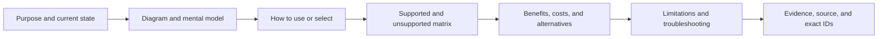

# Unreal Engine Documentation Presentation Precedent

**Status:** external documentation research; informs Sparkle presentation, not local architecture or implementation state

**Reviewed:** 2026-09-07 against the official Epic Games Unreal Engine documentation linked below

**Scope:** identify the language, information hierarchy, page structure, and visual techniques that make Unreal Engine rendering documentation navigable, then define what Sparkle should adopt without copying Epic's product taxonomy or visual branding

## Finding In One Sentence

Unreal documentation explains the user-visible purpose and decision first, then progressively reveals setup, architecture, feature coverage, performance costs, limitations, troubleshooting, and programming reference. Sparkle should use that reading order while retaining its stricter capability and evidence ledgers at the end of the route.

## Language

Epic uses plain instructional English around exact Unreal names:

- a short sentence says what the system does before introducing internal classes or console variables;
- active verbs describe the reader's task: enable, choose, configure, visualize, debug, optimize;
- exact UI labels, commands, class names, and settings are visually distinct from explanation;
- benefits are paired with performance costs, platform restrictions, unsupported features, or known issues;
- pages separate a current feature from an experimental path, a requirement, and a limitation instead of relying on a vague “supported” claim.

Sparkle should follow the same language pattern, but keep its exact states: `Implemented path`, `Partial`, `Capability-gated`, `Not found`, and `Unproved`.

## Information Structure

| Epic pattern | Why it works | Sparkle adaptation |
| --- | --- | --- |
| Goal-oriented top-level categories | A reader chooses the task or subsystem before seeing reference detail. | Root and area indexes route by reader question: understand the engine, render a frame, inspect RHI, implement a change, or assess release progress. |
| One overview page per large subsystem | Purpose, major feature families, and next routes are visible together. | `EngineAtAGlance.md` plus concise Renderer and RHI landing pages. |
| Concept page before API detail | Readers form a mental model before decoding source names. | Plain-language lead, diagram, and short execution narrative precede capability IDs and source paths. |
| Task pages for enablement and configuration | The reader can act without reverse-engineering architecture. | Feature pages name the executable, setting, CVar, editor control, or explicitly state that no user route exists. |
| Feature/path matrices | Differences between renderers, platforms, and modes are scannable. | Renderer/RHI pages compare raster, ray, D3D12, Vulkan, provider, and absent paths without implying parity. |
| Performance, limitations, and known issues | Costs and failure boundaries are part of the feature, not an appendix hidden elsewhere. | Every meaningful design decision names its benefit and drawback; limitations and failures appear before source reference. |
| On-page contents and related routes | Long pages remain usable as reference. | Descriptive headings, small family indexes, and direct next-reading tables provide the Markdown equivalent. |

## Visual Techniques

Epic combines several visual forms rather than forcing all information into prose:

| Visual | Best use in Sparkle | Misuse to avoid |
| --- | --- | --- |
| Screenshot or comparison image | UI instructions, debug-view meaning, visual artifacts, quality comparisons | A decorative image that carries no test configuration or observable distinction |
| Flow diagram | Ownership, data movement, render stages, or lifecycle | A repository tree pretending to explain runtime behavior |
| Sequence diagram | Cross-thread admission, asynchronous GPU submission, completion, and retirement | A sequence with every function call instead of the important ownership transfers |
| Support matrix | Backend, content, mode, or platform differences | A single “Yes” that hides partial coverage or missing evidence |
| Callout | Current state, prerequisite, destructive warning, or main limitation | Repeating ordinary prose in a colored box |
| Code/config example | Exact selector or programming entry point | Dumping an implementation file before explaining the task |

## Recommended Page Shape

The reader should be able to stop after any layer. Orientation does not require the audit ledger; implementation review can continue into it.

## What Sparkle Should Not Copy

- Do not reproduce Unreal's very broad product taxonomy; Sparkle's repository owners and user journeys are smaller and more direct.
- Do not use marketing language where source state or evidence is uncertain.
- Do not treat screenshots, tutorials, or source snippets as release evidence.
- Do not duplicate feature acceptance under a separate documentation tree; feature definition and feature-local proof stay together in Architecture.
- Do not convert every relationship into a diagram. A visual earns its place only when it makes ownership, order, comparison, or state easier to understand.
- Do not hide exact limitations to make a landing page appear simpler. Summarize the important gap and link to the authoritative detail.

## Local Adoption

The binding Sparkle form of these findings is [Documentation Organization](../../../Engineering/Workflow/DocumentationOrganization.md#reader-first-page-contract). New or substantially revised pages use the [Documentation Page Template](../../../Engineering/Workflow/DocumentationPageTemplate.md). The first applied routes are [SparkleEngine At A Glance](../../EngineAtAGlance.md), [Renderer](../../Modules/Engine/Renderer/README.md), and [RHI](../../Modules/Engine/RHI/README.md).

## Official Sources

- [Unreal Engine Documentation Handbook](https://dev.epicgames.com/documentation/en-us/unreal-engine/unreal-engine-documentation-handbook?application_version=4.27) — page anatomy, navigation, formatting, prerequisites, concepts, instructions, and media.
- [Unreal Engine Documentation](https://dev.epicgames.com/documentation/en-us/unreal-engine) — current goal-oriented category hierarchy.
- [Designing Visuals, Rendering, and Graphics](https://dev.epicgames.com/documentation/unreal-engine/designing-visuals-rendering-and-graphics-with-unreal-engine?lang=en-US) — subsystem overview and routes by feature, tool, performance, and graphics programming.
- [Forward Shading Renderer](https://dev.epicgames.com/documentation/unreal-engine/forward-shading-renderer-in-unreal-engine?lang=en-US) — purpose, enablement, performance, supported features, and known issues on one feature page.
- [Supported Features by Rendering Path](https://dev.epicgames.com/documentation/en-us/unreal-engine/supported-features-by-rendering-path-for-desktop-with-unreal-engine) — direct rendering-path comparison matrix.
- [Render Dependency Graph](https://dev.epicgames.com/documentation/unreal-engine/render-dependency-graph-in-unreal-engine?lang=en-US) — concept, benefits, audience, examples, and debugging/visualization.
- [Threaded Rendering](https://dev.epicgames.com/documentation/unreal-engine/threaded-rendering-in-unreal-engine?lang=en-US) — conceptual model, ownership, unsafe example, and performance implications.
- [Path Tracer](https://dev.epicgames.com/documentation/unreal-engine/path-tracer-in-unreal-engine) — use, requirements, limitations, supported-feature coverage, and troubleshooting.
