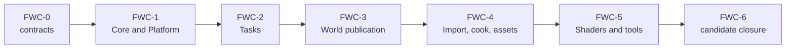

# First Release Foundation, World, And Content Plan

**Status:** implementation plan; ordered closure work, not evidence

**Snapshot:** 2026-09-08; portfolio projection **49/100**; all 11 families are `Blocked`

**Responsibility:** sequence closure of the CPU/platform substrate and the world, content, shader, and tool paths consumed by the release

**Orchestrator:** [First Release Implementation Plan](README.md)

**Primary Architecture route:** [Engine modules](../../Modules/Engine/README.md), [Tools](../../Modules/Tools/README.md), [Shader System](../ShaderSystem/README.md), and [Multithreaded Engine](../MultithreadedEngine.md)

## Outcome And Dependency Chain

Close the CPU/platform substrate, task execution, world lifecycle/publication, source-to-cooked content path, shader path, and shared tool contract that the package and Renderer consume.



| Phase | Primary families | Current state |
| --- | --- | --- |
| `FWC-0` | all 11 | source routes are described; several module-level release contracts require criterion-level reconciliation |
| `FWC-1` | `FCR-CORE-01`, `FCR-PLAT-01` | broad integrated source, no candidate matrix |
| `FWC-2` | `FCR-TASK-01` | shared executor is integrated, pressure/failure/performance proof absent |
| `FWC-3` | `FCR-WORLD-01`–`03` | cooked world and render publication exist, lifecycle/semantic proof absent |
| `FWC-4` | `FCR-CONT-01`–`03` | import/cook/assets exist, deterministic/package/failure proof absent |
| `FWC-5` | `FCR-SHDR-01`, `FCR-TOOL-01` | shader/tool routes exist, parity/ABI/transactional and CLI-contract proof absent |
| `FWC-6` | all 11 | candidate reports absent |

The phase prompts follow the [common phase contract](README.md#phase-card-contract). Reference systems supply questions, not goals: Unreal's [Tasks](https://dev.epicgames.com/documentation/unreal-engine/tasks-systems-in-unreal-engine?lang=en-US), [Asset Management](https://dev.epicgames.com/documentation/unreal-engine/asset-management-in-unreal-engine), [asynchronous loading](https://dev.epicgames.com/documentation/unreal-engine/asynchronous-asset-loading-in-unreal-engine?lang=en-US), and [Derived Data Cache](https://dev.epicgames.com/documentation/en-us/unreal-engine/using-derived-data-cache-in-unreal-engine) clarify dependency, identity, async-lifetime, and disposable-derived-data concerns. Sparkle keeps its existing owners and contracts.

## `FWC-0` — Reconcile Feature Contracts And Boundaries

**Goal:** make the 11 foundation families independently decidable and trace their real production edges before edits.

**Non-goals:** a new foundation framework, copying Renderer criteria into GameFramework, or inferring completeness from file presence.

**Required work:**

- trace every family from public producer through mutable owner, publication boundary, consumer, shutdown, and package membership;
- add/refine feature-local `AC/FM/CHK` in the owning Architecture pages where the release promise is not already binary;
- define supported path/Unicode/platform, task worker counts, level/content set, import formats, shader backends, CLI output, and package matrices;
- name copy/lifetime budgets for world-to-render and cook publication, plus which derived outputs are disposable;
- record absent/excluded behavior, especially native Linux, uncooked runtime loading, undeclared import extensions, and internal shader redesign not required by a failing criterion.

**Failure modes to control:** broad module criterion cannot be tested; producer and consumer use different identity; derived cache becomes source truth; shutdown ownership is absent; Windows-only promise is hidden.

**Phase exit criteria:** each family has an owner, end-to-end trace, matrix, binary criteria, controlled failures, mapped checks, current-state verdict, and stop decisions.

**Ready-to-use prompt:**

```text
Execute FWC-0 without implementation. Create ITER-FWC-00-01 for all 11 foundation FCRs. Inspect source, headers, CMake, consumers, tests, current docs, and dirty state for Core, Platform, Tasks, GameFramework, Assets, import, cooking, shader compilation/runtime, and ToolConsoleSupport. Produce owner/producer/consumer/lifetime/package and selector matrices. Refine missing AC/FM/CHK only in Architecture, retaining one authority. Distinguish durable source from disposable generated/cooked data and record copy budgets. Stop on an unresolved semantic or platform decision. Exit only when each family can receive a binary candidate verdict.
```

## `FWC-1` — Core And Windows Platform

**Goal:** close `FCR-CORE-01` and `FCR-PLAT-01` for standard-user Windows x64 operation and safe platform failure.

**Non-goals:** native Linux implementation, broad utility rewrites, or platform policy leaking into higher modules.

**Required work:**

- reconcile path roots, filesystem operations, logging/diagnostics, configuration, strings/Unicode, errors, and package/per-user locations;
- reconcile Win32 window/input/focus/capture, DPI/monitor changes, resize/minimize/restore, timing, handles, and shutdown;
- use typed error identity at the lowest owner and keep bounded diagnostics useful to product support;
- reject path escape, overlength/invalid input, read-only package mutation, unsupported environment, and invalid window/input transitions safely;
- preserve the explicit native-Linux negative boundary and avoid portable-looking APIs that are not supported.

**Failure modes to control:** current-directory dependence; user path truncation; config corruption destroys last good state; input remains captured after focus loss; zero-size resize reaches Renderer; handle leak; log growth is unbounded.

**Phase exit criteria:** the defined path/Unicode/config/window/input/DPI/focus/resize/shutdown matrices pass; package stays immutable; native Linux remains truthfully unavailable; candidate reports carry exact environment/results.

**Ready-to-use prompt:**

```text
Implement FWC-1 for FCR-CORE-01 and FCR-PLAT-01. Reconcile current Core and Win32 owners, Application/RHI consumers, paths, state transitions, diagnostics, and target membership. Keep platform mechanics below SparklePlatform and generic utilities below SparkleCore. Fix one vertical route at a time: standard-user paths/config/logging, then window/input/DPI/focus/resize/shutdown. Delete superseded helpers and duplicated policy. Exercise invalid/Unicode/long/read-only paths, corrupt config, monitor/DPI transitions, minimize/restore, alt-tab/focus capture, unsupported environment, and shutdown. Record exact criteria/check results; do not claim Linux support.
```

## `FWC-2` — Task Runtime And Cancellation

**Goal:** close `FCR-TASK-01` with one deterministic-enough task contract across serial and `1/2/N` worker modes.

**Non-goals:** replacing domain schedulers with one generic graph, forcing parallelism where serial wins, or adding unmeasured lock-free machinery.

**Required work:**

- identify executor, scope/event, queue, nested work, waiting, cancellation, exception/failure, destruction, and shutdown owners;
- define input/output identity, serial reference behavior, deterministic ordering requirements, exclusive writable ranges, and publication policy per consumer;
- bound queues/workers, prevent oversubscription/deadlock, and make work-in-flight shutdown settle or fail explicitly;
- preserve consumer-specific orchestration while reusing the shared execution mechanism;
- measure scheduling overhead, queue pressure, throughput, latency, and serial crossover causally.

**Failure modes to control:** nested wait deadlock; task escapes owner lifetime; canceled work publishes partially; exception disappears; queue grows unbounded; shutdown hangs; more workers regress without visibility.

**Phase exit criteria:** all owned task criteria pass for serial/1/2/N and pressure/failure/shutdown matrices; consumer parity is demonstrated; performance conclusions include raw measurements and crossover.

**Ready-to-use prompt:**

```text
Implement FWC-2 for FCR-TASK-01. Audit SparkleTasks and each direct consumer before changing the executor. Record the serial oracle, ownership/lifetime, dependency graph, cancellation and partial-publication rule, exclusive writes, queue/worker bounds, and failure propagation. Extend the current primitives; do not create a second scheduler or generic domain abstraction. Exercise serial and 1/2/N, nested dependencies, cancellation, injected task failure, queue saturation, destruction, and shutdown with work in flight. Measure causal overhead and crossover. Stop on ambiguous publication or exclusive ownership and bind evidence to the candidate.
```

## `FWC-3` — Level, World, And Render Publication

**Goal:** close `FCR-WORLD-01`, `02`, and `03` from catalog selection through deterministic activation and immutable render submission.

**Non-goals:** Renderer querying ECS state, a second scene database, or accepting `Empty` as silent recovery from a requested level failure.

**Required work:**

- make level identity, load graph, cancellation, transactional activation, switch/reload, old-world retirement, and failure UI explicit;
- keep world state GameFramework-owned and publish structural deltas, dynamic data, resource tables, and view input through one immutable boundary;
- reconcile stable/generation identity for entity, geometry, material, light, camera, animation, and sky data across deletion/reuse/reload;
- prove coordinate/units, transforms, camera controls, static/skinned/morph animation, material variants, four light kinds, bounds/history, and invalid-data policy;
- measure extraction copies/cost, memory high-water, ordering, and in-flight safety.

**Failure modes to control:** stale entity generation; new level partially visible; canceled load activates; delete/reuse aliases old GPU data; malformed asset becomes valid default silently; animation bounds/history lag; extraction races consumer.

**Phase exit criteria:** lifecycle, semantic, identity, cancellation, reload, concurrency, and cost checks pass for the admitted map/content set; Renderer consumes only published frame data; reports for all three families agree on candidate identity.

**Ready-to-use prompt:**

```text
Implement FWC-3 across the existing LevelSession, GameWorld, world systems, RenderFrameSubmissionExtractor, and direct Renderer admission edge. First map owner/producer/consumer/lifetime and copy budget. Make load publication transactional and failure explicit; preserve one stable generation model through create/update/delete/reload. Validate authored-to-runtime coordinates, camera, geometry, skin/morph animation, materials, lights, sky, bounds, and temporal inputs. Exercise missing/malformed/canceled/switch/reload/delete/reuse and concurrent extraction. Measure copies, extraction time, queue behavior, and memory high-water. Do not add Renderer ECS access or a duplicate scene authority.
```

## `FWC-4` — Import, Cook, And Engine Assets

**Goal:** close `FCR-CONT-01`, `02`, and `03` with deterministic, provenance-preserving, transactional source-to-package products.

**Non-goals:** runtime source import, retaining arbitrary author files in the runtime package, or treating cooked output as irreplaceable source truth.

**Required work:**

- inventory accepted glTF/GLB/FBX inputs, external/embedded dependencies, provenance, coordinate/tangent/material/alpha/animation semantics, and rejection limits;
- keep import normalization, cook planning, product serialization, manifest publication, and runtime loading as explicit owned stages;
- make cook publication atomic and reject stale/incompatible/incomplete dependencies; bound parallel jobs, memory, path traversal, and oversized/malformed input;
- establish release allowlists and per-file license/provenance for engine assets, semantic defaults, fixtures, shaders/includes, and sky assets;
- prove deterministic semantic identity and clean regeneration without requiring byte identity where tools legitimately differ.

**Failure modes to control:** path escape; missing external texture; malformed/oversized asset consumes unbounded resources; partial cook replaces good generation; stale schema accepted; default texture has wrong meaning; undeclared fixture/package dependency.

**Phase exit criteria:** supported inputs produce complete package-relative products; negative inputs fail without partial publication; manifests and rights are complete; clean regeneration and runtime consumption pass for the frozen content set.

**Ready-to-use prompt:**

```text
Implement FWC-4 for FCR-CONT-01/02/03. Reconcile SourceImporters, imported representations, AssetCooker and product writers, cooked-only loaders, Engine/Assets, release allowlists, and CMake/package membership. Record input/output identities, semantic normalization, dependency manifests, concurrency and memory bounds, transactional boundary, and disposable-derived-data rule. Fix current owners only. Exercise representative supported files plus missing/external/embedded textures, malformed/oversized/path-escape input, cancellation, stale/incompatible products, partial write, corrupt defaults, and clean rebuild. Compare semantic inventories and runtime results, record provenance/licenses, and stop on an unresolved format or right.
```

## `FWC-5` — Shader Route And Shared Tool Output

**Goal:** close `FCR-SHDR-01` and `FCR-TOOL-01` from registration through cooked code/reflection to runtime pipeline consumers, with truthful script-readable tool behavior.

**Non-goals:** executing the entire [Shader System target plan](../ShaderSystem/Plan.md) merely because it exists, preserving legacy shader layouts, or adding a second diagnostic schema.

**Required work:**

- reconcile registrations, build membership, job planning, include/dependency identity, DXIL/SPIR-V compile/reflection, code-library publication, runtime consumption, replacement, and retirement;
- require every selected job/parameter/domain to be represented and reject ABI/reflection mismatch before use;
- make compiler/cook replacement transactional; keep last good generation only where Architecture explicitly owns that safe state, never as a silent compatibility route;
- unify message severity, stdout/stderr, process result, progress, summary, fields, path quoting/redaction, and cancellation across every ToolConsoleSupport consumer;
- invoke a phase of the existing Shader System plan only when a failing release criterion requires that architecture; otherwise close the current route with minimal change.

**Failure modes to control:** registered shader not built; stale include identity; DXIL/SPIR-V divergence; corrupt library accepted; in-flight generation freed; tool exits zero on failure; progress floods output; private path leaks.

**Phase exit criteria:** admitted shader matrix compiles, reflects, publishes, materializes, replaces/fails safely, and packages on both backends; every tool consumer obeys the shared output/exit contract; exact reports are candidate-bound.

**Ready-to-use prompt:**

```text
Implement FWC-5 for FCR-SHDR-01 and FCR-TOOL-01. Audit shader registration, CMake/generated membership, cook planner, compiler backends, reflection/ABI, global map/code library, Renderer materialization consumers, replacement/retirement, and all ToolConsoleSupport callers. Compare the release criteria with Docs/Architecture/CrossModule/ShaderSystem/Plan.md; execute only a selected required phase, not a wholesale redesign. Close missing jobs and ABI checks through the existing owner, make publication transactional, and remove replaced paths. Exercise missing/corrupt/stale shaders, include changes, backend compiler failure, reflection mismatch, reload in flight, cancellation, Unicode paths, stdout/stderr, exit codes, and false-success summaries.
```

## `FWC-6` — Foundation Candidate Closure

**Goal:** reconcile all 11 families on the same package candidate and prove their cross-boundary invariants.

**Non-goals:** using an integration smoke to replace feature checks or changing code while preserving old evidence.

**Required work:** run the package-relative source/content/world/render journey, verify candidate hashes and evidence coverage, close all missing negative checks, and inspect for duplicate owners, stale paths, unbounded work, undeclared package inputs, or invalidated results.

**Failure modes to control:** individually passing components disagree on identity; author cache masks dependency; candidate changed after a report; unavailable check marked pass; one backend consumes a different cooked/shader generation.

**Phase exit criteria:** every foundation FCR has a complete candidate report with criteria/failures/checks, limitations, invalidation triggers, and a `PASS`, `BLOCKED`, `EXCLUDED`, or `SUPERSEDED` decision.

**Ready-to-use prompt:**

```text
Execute FWC-6 without feature expansion. Freeze the candidate and reconcile FCR-CORE-01, PLAT-01, TASK-01, WORLD-01 through 03, CONT-01 through 03, SHDR-01, and TOOL-01. Audit candidate identity and every AC/FM/CHK result, then run only missing cross-boundary package-relative journeys and controlled failures. Check clean state/cache independence, world-to-render identity, cook-to-runtime and shader-to-pipeline generation agreement, shutdown settlement, and output truth. Any implementation change creates a new candidate and invalidates affected results. File exact verdicts and blockers.
```
