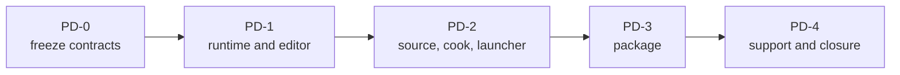

# First Release Product And Delivery Plan

**Status:** implementation plan; phase order and prompts, not feature or release evidence

**Snapshot:** 2026-09-08; portfolio projection **33/100**; all six `FCR-PROD-*` families are `Blocked`

**Responsibility:** sequence the first-release product journeys, developer workflows, runtime archive, and operated support boundary

**Orchestrator:** [First Release Implementation Plan](README.md)

**Architecture owners:** [Projects/Showcase](../../Modules/Projects/Showcase/README.md), [Application](../../Modules/Engine/Application/README.md), [Editor](../../Modules/Engine/Editor/README.md), [Launcher](../../Modules/Tools/Launcher/README.md), and [Build And Packaging](../../Modules/BuildAndPackaging/README.md)

## Outcome And Order

Deliver one understandable Showcase runtime, one reproducible source-adopter route, explicitly classified developer products, one manifest-owned release archive, and an operated support boundary.



| Phase | Primary families | Current starting point | Dependency |
| --- | --- | --- | --- |
| `PD-0` | all six | [`ITER-PROD-00-01`](#iter-prod-00-01-control-record) passed the contract freeze only; every product family remains `Blocked` for executable evidence | `FR-00` |
| `PD-1` | `FCR-PROD-01`, `FCR-PROD-04` | runtime/editor source paths are integrated; product UX and delivery evidence are open | frozen product classification |
| `PD-2` | `FCR-PROD-02`, `FCR-PROD-03` | development build/cook/launcher paths exist; independent adoption and distribution truth are open | `PD-1`, foundation build/content readiness |
| `PD-3` | `FCR-PROD-05` | no install/package authority found | `PD-2`, rights and payload allowlists |
| `PD-4` | `FCR-PROD-06` and family closure | engine diagnostics exist; public crash/support/security/patch operation is incomplete | immutable candidate/package identity |

Use the [common phase contract](README.md#phase-card-contract) for every phase. Feature acceptance remains in Architecture; if an owner lacks binary `AC/FM/CHK` for its release promise, `PD-0` adds them there before implementation.

## `PD-0` — Freeze Product Contracts

**Goal:** make every product journey and exclusion decidable before changing code.

**Non-goals:** UI redesign, packaging implementation, inventing an SDK promise, or making the launcher a shipped dependency.

**Required work:**

- trace the runtime consumer, source adopter, optional contributor, launcher, and editor journeys from entry point through failure/exit;
- classify Showcase, launcher, editor, authoring tools, source tree, runtime archive, symbols, installer, and SDK as included, developer-only, excluded, or removed;
- reconcile feature-local `AC/FM/CHK` in the Architecture owners for `FCR-PROD-01`–`06`; link rather than copy the release gates;
- name supported Windows/CPU/GPU/toolchain prerequisites, per-user state locations, public paths, budgets, and support owners;
- record exact external reference revisions and only transfer relevant invariants from Unreal Engine 5.8's [packaging pipeline](https://dev.epicgames.com/documentation/unreal-engine/packaging-your-project?application_version=5.8) and [BuildGraph](https://dev.epicgames.com/documentation/unreal-engine/buildgraph-for-unreal-engine?lang=en-US&application_version=5.8).

**Failure modes to control:** journey requires an environment variable/admin/repository path; developer console leaks into Shipping; clean/reset mutates source; missing tool is reported as success; a binary SDK or installer is implied but unowned.

**Phase exit criteria:** every family has an Architecture owner and complete criterion/failure/check mapping; product classifications and prerequisites are frozen; unresolved decisions are `BLOCKED`, not left as prose ambiguity.

**Ready-to-use prompt:**

```text
Execute PD-0 at the current revision. Create ITER-PROD-00-01 and map FCR-PROD-01 through 06, REL-00 through 03, and applicable persona requirements. Inspect actual application, Showcase, launcher, build/cook, package, diagnostics, and support entry points plus CMake membership. Trace every user journey and failure route. Add or refine binary AC/FM/CHK only in the owning Architecture documents where missing; do not implement code or copy release gates. Classify every product/output and record prerequisites, paths, budgets, ownership, and stop decisions. Exit only when a reviewer can decide each promised journey without interpreting intent.
```

### `ITER-PROD-00-01` Control Record

| Field | Record |
| --- | --- |
| Identity | `ITER-PROD-00-01`; owner: product/release delivery; status: **PASS for contract freeze only**; started 2026-09-08 at committed `master` `ffe60e3ad6647f5435458224203ad3f513bfd571`. |
| Scope | Trace and decide the runtime consumer, source adopter, optional contributor, Launcher, and Editor journeys; freeze product/output classification, supported prerequisites, paths, budgets, owners, and feature-local proof mappings. No product code, package implementation, candidate result, score change, or release-gate approval. |
| Intended decision | A reviewer can answer what is promised, what is Developer-only/Excluded, where every journey starts/stops, which owner detects each failure, and which exact check would falsify it. |
| North Star | `NS-REAL`, `NS-EVIDENCE`, `NS-OWNERSHIP`, `NS-ADOPTION`, and `NS-SIMPLIFY` **advance in contract clarity only**: false success, hidden prerequisites, duplicate product authority, and accidental shipped surface now have binary stop rules. No runtime or evidence level advances. `NS-MATH-DATA` is not applicable because no algorithm/data-semantic claim changed. |
| Complexity/copy budget | Documentation-only; no runtime state, public API, copy, target, adapter, diagnostic, or compatibility path added. One acceptance-owned release-value table, one cross-module trace owner, and one primary Architecture contract owner per FCR prevent duplicate authority. |
| Preservation | Preserve the user-owned First Release reorganization and unrelated display-pipeline/readiness changes; preserve both RHI source paths and all existing Developer-only products while separating them from the consumer archive. |
| Stop decisions | Do not start `PD-1` while Shipping console/first-run/fallback semantics are unresolved; do not call Qt optional while Launcher membership makes it configure-required; do not start `PD-3` without a single package owner; do not promise public support, installer, or SDK without their admitted owner and checks. |

The exact pre-iteration dirty state was:

```text
 M Docs/Acceptance/CurrentReadiness.md
 M Docs/Acceptance/FeatureCompletionReports.md
 M Docs/Acceptance/FirstRelease.md
 M Docs/Acceptance/README.md
 M Docs/Acceptance/Renderer/README.md
 M Docs/Architecture/Modules/Engine/Renderer/Features/PostProcessing/DisplayPipeline/ChromaticAberration.md
 M Docs/Architecture/Modules/Engine/Renderer/Features/PostProcessing/DisplayPipeline/ColorGrading.md
 M Docs/Architecture/Modules/Engine/Renderer/Features/PostProcessing/DisplayPipeline/PresentationAndOutput.md
 M Docs/Architecture/Modules/Engine/Renderer/Features/PostProcessing/DisplayPipeline/README.md
 M Docs/Architecture/Modules/CapabilityEvidencePlan.md
 M Docs/Architecture/README.md
 M Docs/Architecture/Modules/Engine/Renderer/Features/README.md
 M Docs/README.md
 M Docs/Strategy/Roadmap.md
?? Docs/Architecture/Modules/Engine/Renderer/Features/PostProcessing/DisplayPipeline/HDRDisplayOutput.md
?? Docs/Plans/FirstRelease/
```

This is a frozen pre-iteration record, not a navigation route. The recorded `Docs/Plans/FirstRelease/` tree was relocated on 2026-09-09 into the owning Architecture subjects, led by [First Release](README.md), the [Renderer first-release plans](../../Modules/Engine/Renderer/FirstRelease/README.md), and the [RHI first-release plan](../../Modules/Engine/RHI/FirstReleasePlan.md).

#### Persona And Delivery Mapping

| Target | Iteration disposition |
| --- | --- |
| `PGE-01` | **Preserve**; partner journeys and failure handoffs are explicit, but no external adoption case ran. |
| `PGE-06` | **Preserve**; crash/hang/GPU diagnostic handoff is mapped, but no incident/capture was produced. |
| `PGE-07` | **Preserve**; source/build/clean ownership and no-SDK boundary are explicit, but no clean build ran. |
| `PGE-13` | **Advance documentation only**; implementation and precedent are separated and the productization/deletion ledger is decidable. |
| `PGE-14` | **Preserve**; one exact Windows/source matrix is frozen, but D3D12/Vulkan and clean-source evidence remain blocked. |
| `PGE-15` | **Advance documentation only**; six families now have one contract owner and explicit stop decisions, with no completion claim. |
| `REL-00` | Product audiences, outputs, prerequisites, paths, budgets, and owners are frozen in [First Release](../../../Acceptance/FirstRelease.md#frozen-product-and-output-classification). Overall gate remains **Blocked** until its non-product feature/map/right/classification scope is approved. |
| `REL-01` | Exact external precedent is versioned and rejected differences are recorded. Product identity, dependency/content rights, signing, SBOM, and `ReleaseMapSet` remain **Blocked**. |
| `REL-02` | The source-adopter contract and exact supported toolchain are frozen. Cold/warm clean reproduction is unrun and runtime-only configure still requires Launcher/Qt, so the gate remains **Blocked**. |
| `REL-03` | Package products, layout, state, budgets, owner boundary, and negative checks are frozen. No install/stage/sign/verify/package implementation exists, so the gate remains **Blocked**. |

#### Feature Contract Map

| Family | Primary Architecture owner and complete local mapping | Current candidate verdict |
| --- | --- | --- |
| `FCR-PROD-01` | [Showcase runtime consumer `AC/FM/CHK`](../../Modules/Projects/Showcase/README.md#fcr-prod-01-runtime-consumer-contract), with [Application host boundary](../../Modules/Engine/Application/README.md#product-contract-boundary) | `Blocked`; no package/consumer UI, console erasure, state, or journey evidence. |
| `FCR-PROD-02` | [Build/Packaging source adopter `AC/FM/CHK`](../../Modules/BuildAndPackaging/README.md#fcr-prod-02-source-adopter-contract) | `Blocked`; no clean cold/warm result and optional Launcher membership is not separated. |
| `FCR-PROD-03` | [Launcher `AC/FM/CHK`](../../Modules/Tools/Launcher/README.md#fcr-prod-03-launcher-contract) | `Blocked`; no non-author failure/cancel/clean/handoff result. |
| `FCR-PROD-04` | [Editor `AC/FM/CHK`](../../Modules/Engine/Editor/README.md#fcr-prod-04-editor-contract), with [Application host boundary](../../Modules/Engine/Application/README.md#product-contract-boundary) | `Blocked`; Developer-only source path exists, but build/journey/package-erasure proof is absent. |
| `FCR-PROD-05` | [Packaging `AC/FM/CHK`](../../Modules/BuildAndPackaging/PackagingAndInstallation.md#fcr-prod-05-package-contract) | `Blocked`; implementation owner/product absent. |
| `FCR-PROD-06` | [Support/incident `AC/FM/CHK`](../../Modules/BuildAndPackaging/AdoptionSupportAndIncidentResponse.md#fcr-prod-06-support-and-incident-contract) | `Blocked`; public files/channels/export/operating owner/patch route absent. |

The cross-module [persona journey freeze](../ProductExecutionTraces.md#pd-0-persona-journey-freeze) owns the horizontal entry-to-failure/exit trace; it does not duplicate these local criteria.

#### Risks

| ID | Cause -> event -> consequence; likelihood/impact | Prevention and detection | Contingency, owner, and retirement evidence |
| --- | --- | --- | --- |
| `RISK-PROD-00-01` | Ambiguous product nouns -> Launcher/Editor/tool/SDK/installer surface enters consumer claims or bytes -> unowned support/security obligation. Likelihood **high** from mixed development outputs; impact **critical**. | Acceptance-owned disposition table, package allow/deny criteria, and SDK/installer wording scan. Trigger: any unmatched product, import, file, or public claim. | Reject stage/claim and return `REL-00` to Blocked. Release owner retires with approved classification plus `CHK-PKG-01`. |
| `RISK-PROD-00-02` | Environment/fallback/process-only state -> journey reports success without requested consumer result -> non-author dead end. Likelihood **high** from `SPARKLE_STARTUP_LEVEL`, built-in `Empty`, silent CVar parse, and PID-shaped Launcher boundaries; impact **high**. | Active-identity and final-consumer oracles in `CHK-PROD01-02/03`, `CHK-PROD02-02`, and `CHK-PROD03-01/02`. Trigger: missing identity/artifact or fallback. | Mark failed, preserve last accepted product, expose recovery, and rerun. Product/Application/Launcher owners retire with controlled negative evidence. |
| `RISK-PROD-00-03` | Broad reset/clean/save path -> source/package/unrelated state mutates -> data loss or unreproducible candidate. Likelihood **medium** because destructive developer operations exist; impact **critical**. | Frozen mutation table, preview/confirmation/containment, sentinels, before/after hashes. Trigger: any path outside the approved set or incomplete deletion called success. | Stop, restore disposable fixture from immutable source, quarantine result, and fix the owning operation. Launcher/Editor/package owners retire with `CHK-PROD01-02`, `CHK-PROD02-03`, and `CHK-PROD03-03`. |
| `RISK-PROD-00-04` | External precedent copied as architecture -> UAT/BuildGraph/Editor/Launcher machinery becomes a second local owner -> bloat and divergent packaging truth. Likelihood **medium**; impact **high**. | Exact Unreal 5.8 documentation revision, narrow transferred invariants, explicit rejected differences, and single local package owner. Trigger: Unreal-specific mechanism/vocabulary without a local consumer. | Delete the borrowed mechanism and return to local CMake/tool owners. Build/package owner retires through architecture review and `CHK-PKG-01`. |

#### Decision And Evidence Boundary

`ITER-PROD-00-01` is **PASS** because every requested product/output has one disposition, the Windows/source prerequisites and exact reference machine/toolchain are named, paths/budgets/support-role ownership are fixed, all five actor journeys reach an explicit success/failure/exit boundary, and each `FCR-PROD-*` family has complete owner-local criterion/failure/check coverage. The decision is invalidated by a changed product classification, prerequisite/path/budget, journey owner, or local AC/FM/CHK.

This is documentation/static source evidence only. It does not pass `REL-00`–`03`, any `FCR-PROD-*`, build, cook, package, runtime, GPU, support, or independent-adoption gate. Within Product And Delivery, `PD-1` is the next phase once the mother plan's `FR-00`/`PTD-00` prerequisites permit implementation; its first implementation stop is structural Shipping console isolation and a consumer-owned first-run/required-content failure route, not Launcher or package work.

## `PD-1` — Runtime And Editor Product Shells

**Goal:** close `FCR-PROD-01` and classify/close `FCR-PROD-04` so the first run, controls, settings, level selection, failure, reset, and exit are intentional.

**Non-goals:** turning Showcase into a general sample browser framework, shipping Editor by default, or hiding engine failures behind generic dialogs.

**Required work:**

- preserve `RuntimeApplication` as runtime host and extend the current Showcase entry/product path rather than adding a second launcher;
- make example/mode selection, loading state, controls/help, settings, reset, quit, and unsupported-state messaging discoverable;
- ensure level failure cannot silently become successful `Empty` content and settings resolve requested versus active state truthfully;
- keep Editor layering explicit; either prove its admitted journey or erase it from runtime payload/claims;
- use representative fresh-user, standard-user, resize/DPI, missing/corrupt content, unsupported-provider, and shutdown routes from the owned contracts.

**Failure modes to control:** blank first frame; trapped mouse/focus; stale settings; load failure shown as success; editor-only service required by runtime; quit leaves work or files in flight; fallback is active but hidden.

**Phase exit criteria:** the feature-local checks for `FCR-PROD-01` and the selected `FCR-PROD-04` scope pass on the exact configuration; excluded editor behavior is absent from runtime archive and user claims; results are filed in candidate FCR reports.

**Ready-to-use prompt:**

```text
Implement PD-1 as one product-journey vertical slice. Reconcile RuntimeApplication, EditorApplication, Showcase startup, level catalog/session, input/focus, settings, UI, renderer admission, shutdown, and target membership. Create the iteration record with the owning AC/FM/CHK. Extend current owners only; make requested/active state and failures visible, preserve standard-user paths, and delete replaced UI/control paths. Exercise first run, controls/help, select/load/reset/quit, malformed or missing content, resize/focus, unsupported selection, and shutdown. Use the smallest owning builds first; run broader runtime routes only when the mapped check requires them. Record exact candidate results and stop on an unresolved product choice.
```

## `PD-2` — Source Build, Cook, And Launcher

**Goal:** close `FCR-PROD-02` and `FCR-PROD-03` with one documented underlying operation model usable directly and, when selected, through the launcher.

**Non-goals:** making launcher UI the only automation API, duplicating build/cook logic in GUI code, or accepting warmed author-machine state.

**Required work:**

- pin public prerequisites and dependency identities; define supported profiles, outputs, cleanup, and source compatibility statement;
- add a fresh-checkout automation entry for the approved deterministic build/static/package gates; it invokes owner checks and reports failed, timed-out, cancelled, skipped, unavailable, and missing-artifact states without reinterpretation;
- keep sync/configure/build/cook/run/clean as typed operations with one execution authority and truthful process result;
- make launcher discovery, readiness, progress, cancellation, error detail, retry/restart, and concurrent-action exclusion explicit;
- prove cold and warm build/cook paths plus missing tool, bad path, canceled operation, failed child, locked output, stale cook, and Unicode/path quoting behavior;
- ensure direct command and launcher invoke equivalent underlying semantics and artifacts.

**Failure modes to control:** false-success summary; launcher PID mistaken for launched runtime; partial cook published; cancel leaves child processes; clean deletes unowned files; prerequisite is fetched mutably; GUI command differs from documented CLI.

**Phase exit criteria:** independent source-adopter rehearsal produces the named runtime through documented prerequisites; launcher classification is enforced; direct and GUI routes agree; exact logs/artifacts and negative results are in the FCR reports.

**Ready-to-use prompt:**

```text
Implement PD-2 for FCR-PROD-02/03. Audit root CMake presets/options, dependency acquisition, tools, cook workspace, launcher typed operations, child-process lifecycle, output parsing, runtime handoff, and any existing automation entry. Record Reuse/Extend/ReplaceAndDelete decisions. Establish one operation contract used by documentation, launcher, and approved fresh-checkout automation; do not add parallel shell semantics or redefine owner checks. Fix prerequisite identity, cancellation, process/result truth, transactional cook publication, quoting, cleanup boundaries, handoff validation, and honest failed/timed-out/cancelled/skipped/unavailable/missing-artifact aggregation. Prove cold/warm and controlled failure routes with exact commands and artifacts, then perform the required non-author rehearsal. Stop on mutable inputs, destructive ambiguity, or a second execution authority.
```

## `PD-3` — Package And Installation

**Goal:** implement the missing `FCR-PROD-05` owner and pass `REL-03` with a portable Windows x64 runtime archive.

**Non-goals:** an installer, registry integration, a binary SDK, package self-modification, or bundling developer tools/source/debug files without explicit admission.

**Required work:**

- select one existing build/delivery owner for build → cook → stage → verify → package; do not put packaging policy in renderer or application code;
- add explicit install/stage membership, component/allowlist policy, package-relative discovery, per-user writable state, manifests, notices/SBOM, provenance, hashes, and symbols handling;
- make staging fresh and transactional; reject stale, missing, extra, absolute, unlicensed, or incompatible products;
- create the archive from an immutable verified stage, then verify archive contents against `manifests/sparkle-package-manifest.json`;
- prove extract/run/remove with no source, toolchain, network, admin rights, environment variable, or author cache. CMake's [install rules](https://cmake.org/cmake/help/latest/command/install.html) are a mechanics reference, not an instruction to expose internal targets.

**Failure modes to control:** stage accumulates leftovers; runtime writes beside executable; package relies on current directory; missing redistributable/provider DLL; manifest mismatch; source/private path leak; archive emitted after verification failure.

**Phase exit criteria:** the Architecture-owned `FCR-PROD-05` criteria and `REL-03` pass for the exact archive; a clean standard-user machine route is retained; stage/package failure leaves no publishable partial artifact.

**Ready-to-use prompt:**

```text
Implement PD-3 as the single release packaging spine. First reconcile CMake targets/install rules, cooked-product publication, runtime path discovery, provider redistribution, engine assets, configuration writes, and existing launcher staging behavior. Choose and document one owner. Add explicit components and an allowlist manifest; build/cook into owned outputs, create a fresh immutable stage transactionally, verify rights/dependencies/paths/hashes, and only then archive. Exclude editor/launcher/tools/source/debug material unless the frozen scope admits a separate developer package. Exercise stale/extra/missing/corrupt payloads and clean-machine extract/run/remove. Bind every result to the archive hash and record REL-03/FCR-PROD-05 evidence.
```

## `PD-4` — Support, Incident Response, And Product Closure

**Goal:** close `FCR-PROD-06`, prove operated support/security/crash/patch paths, and leave every product family candidate-ready.

**Non-goals:** silent telemetry, collecting private state by default, promising perpetual compatibility, or calling documentation an operated process.

**Required work:**

- define public support and security intake, severity/response ownership, privacy/consent, retention, symbol handling, known-issue and workaround policy;
- connect process crash/hang and GPU/device diagnostics to a bounded user-visible collection/export route without leaking paths or content;
- define immutable patch identity, applicability, rollback/withdrawal/advisory, and evidence invalidation;
- rehearse one crash, one hang/timeout if supported, one GPU/device diagnostic route, one security intake, and one patch/withdraw decision;
- reconcile all six product FCR reports against the same candidate and package identity. Unreal's [crash-reporting architecture](https://dev.epicgames.com/documentation/en-us/unreal-engine/crash-reporting-in-unreal-engine) is a responsibility reference only; no Epic service is assumed.

**Failure modes to control:** report loses candidate identity; consent bypass; private paths or content escape; symbols cannot match build; unsupported recovery promised; patch replaces public bytes under same version; intake has no owner.

**Phase exit criteria:** support routes were operated, not merely written; failures preserve consent and identity; patch policy is reproducible; all six FCR reports have explicit candidate-bound verdicts and residual limitations.

**Ready-to-use prompt:**

```text
Implement PD-4 against the package candidate. Reconcile Core/RHI diagnostics, crash boundaries, symbol outputs, user data paths, logs, public documentation, support/security intake, release identity, and patch mechanics. Create one privacy-aware export and incident identity path; do not add always-on telemetry. Define severity clocks, ownership, retention, redaction, patch/withdraw rules, and evidence invalidation. Exercise controlled crash/hang/GPU/support/security/patch scenarios using non-sensitive fixtures. Verify report-to-symbol-to-candidate correlation and package erasure rules. Update FCR-PROD-01 through 06 with exact verdicts; stop if any intake or privacy responsibility is unowned.
```

## Plan Completion

This plan is complete only when all six product FCRs have Architecture-owned contracts, exact candidate reports, and no unresolved blocker for their admitted scope. The release is not complete until the mother plan's remaining map, native, adoption, publication, and stabilization gates pass.
