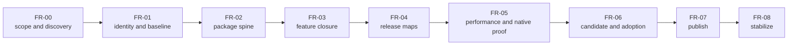

# First Release Implementation Plan

**Status:** release implementation orchestrator; ordered work, not implementation evidence or release approval

**Snapshot:** 2026-09-08 at committed `master` revision `ffe60e3a`; implementation source is unchanged from audited baseline `8414b5dc`; all 49 tracked feature families and all release gates remain `Blocked`

**Responsibility:** turn the [release roadmap](../../../Strategy/Roadmap.md) into bounded implementation iterations and route every first-release feature family to one detailed owner plan

**Acceptance authority:** [First Release Acceptance](../../../Acceptance/FirstRelease.md), [Feature Completion Reports](../../../Acceptance/FeatureCompletionReports.md), and feature-local Architecture `AC-*`/`FM-*`/`CHK-*`

**Current state:** [Current Feature Readiness](../../../Acceptance/CurrentReadiness.md)

> [!IMPORTANT]
> This plan tells an implementer **what to do next and when to stop**. It never changes a readiness score or acceptance verdict. A phase exits only through its named evidence; a release gate passes only in its acceptance owner.

## Release Control At A Glance



| Start here when... | Open |
| --- | --- |
| deciding the one next release iteration | this orchestrator and its [stage table](#ordered-release-stages) |
| closing Showcase, build, launcher, editor, package, or support | [Product And Delivery](ProductAndDelivery.md) |
| closing Core, Platform, Tasks, World, content, shader, or tool behavior | [Foundation, World, And Content](FoundationWorldAndContent.md) |
| closing neutral RHI, queues, backends, ray tracing, diagnostics, or device failure | [RHI And GPU Execution](../../Modules/Engine/RHI/FirstReleasePlan.md) |
| closing any of the 26 Renderer families | [Renderer First-Release Plans](../../Modules/Engine/Renderer/FirstRelease/README.md) |
| deciding whether a result is accepted | [First Release Acceptance](../../../Acceptance/FirstRelease.md) and the owning feature dossier |

## Authority And Working Rule

The [Roadmap](../../../Strategy/Roadmap.md) owns priority, admission, and `REL-*` gates. This plan owns execution order, prerequisites, stop conditions, and ready-to-use prompts. Architecture owns behavior and feature acceptance. The FCR registry owns report identity. Candidate artifacts own observed results. Do not copy an `AC-*`, `FM-*`, or `CHK-*` into a plan and edit it independently.

Only one release-critical implementation iteration is active at a time. A second investigation may run only when it cannot modify, invalidate, or consume the same owner, candidate, content, or evidence surface. Every iteration follows [Change Lifecycle](../../../Engineering/Workflow/ChangeLifecycle.md), begins from the current revision and dirty state, and ends `PASS`, `BLOCKED`, `EXCLUDED`, or `SUPERSEDED`.

## Reference-Implementation Rule

References are used for invariants and review questions, not copied architecture:

| Reference | What may be transferred | What must not be inferred |
| --- | --- | --- |
| Unreal Engine **5.8** documentation, retrieved 2026-09-08: [BuildGraph](https://dev.epicgames.com/documentation/unreal-engine/buildgraph-for-unreal-engine?lang=en-US&application_version=5.8), [script elements](https://dev.epicgames.com/documentation/unreal-engine/buildgraph-script-elements-reference-for-unreal-engine?lang=en-US&application_version=5.8), and [Packaging](https://dev.epicgames.com/documentation/unreal-engine/packaging-your-project?application_version=5.8) | explicit required predecessors/produced artifacts, terminal-target graph closure, and Build/Cook/Stage/Package separation; local adoption is recorded in [Packaging And Installation](../../Modules/BuildAndPackaging/PackagingAndInstallation.md#external-precedent-and-transfer-boundary) | that Sparkle needs Unreal Automation Tool, BuildGraph XML/agents/triggers, Unreal's Pak/layout, Editor-driven packaging, or a Launcher/package dependency; no Unreal source revision was inspected |
| [Unreal Render Dependency Graph](https://dev.epicgames.com/documentation/unreal-engine/render-dependency-graph-in-unreal-engine?lang=en-US) | declared dependencies, transient lifetime, barrier planning, culling, markers, validation | that a matching class name or feature exists locally |
| [NVIDIA NVRHI guide](https://github.com/NVIDIA-RTX/NVRHI/blob/8e8c36e37558acec333204619b95d9d2fcdc4a79/doc/ProgrammingGuide.md) | backend-neutral resource/state/binding/lifetime questions | NVRHI adoption or local backend parity |
| [Microsoft DirectX Graphics Samples](https://github.com/microsoft/DirectX-Graphics-Samples) and [Khronos Vulkan Samples](https://github.com/KhronosGroup/Vulkan-Samples) | small native oracles for D3D12/Vulkan behavior | production completeness, performance, or cross-backend equivalence |
| [NVIDIA RTXDI integration guide](https://github.com/NVIDIA-RTX/RTXDI/blob/main/Doc/Integration.md) and [AMD Cauldron](https://github.com/GPUOpen-LibrariesAndSDKs/Cauldron) | explicit host-owned scene/material/GBuffer integration and graphics sample structure | that vendor sample choices define Sparkle semantics |

Before using any external source, record the exact revision or documentation version, the local question it answers, the invariant adopted, the rejected differences, and license implications. Local source and Architecture remain authoritative.

## Phase Card Contract

Every implementation phase in this hierarchy uses this contract:

1. **Reconcile:** inspect the current owner, producers, consumers, lifetime, selectors, CMake membership, direct tests, docs, and dirty work. Do not trust this snapshot as current without checking.
2. **Create the iteration record:** map `NS-*`, `PGE-*`, `REL-*`, `FCR-*`, feature `AC-*`/`FM-*`/`CHK-*`, risks, and the cheapest claim-falsifying check.
3. **Bound the outcome:** state goal, non-goals, included matrix, complexity/copy budget, preservation list, deletion list, and explicit stop conditions.
4. **Implement one vertical slice:** extend the existing owner and production path; update producers, consumers, build membership, and docs; delete replaced paths in the same clean break.
5. **Challenge failures:** exercise every applicable feature-local failure mode. An unavailable check remains `BLOCKED`, never `PASS`.
6. **Prove the phase:** inspect the diff, run proportional checks, store candidate-bound artifacts where acceptance requires them, and update the applicable `FCR-*` report.

The prompts below and in child plans are starting briefs. They require repository reconciliation before edits and do not authorize broad builds, submitted test-only code, architectural substitutions, or scope expansion.

## Complete Feature Routing

Every current `FCR-*` family has exactly one primary execution owner:

| Plan | Primary families | Count |
| --- | --- | ---: |
| [Product And Delivery](ProductAndDelivery.md) | `FCR-PROD-01`–`06` | 6 |
| [Foundation, World, And Content](FoundationWorldAndContent.md) | `FCR-CORE-01`, `FCR-PLAT-01`, `FCR-TASK-01`, `FCR-WORLD-01`–`03`, `FCR-CONT-01`–`03`, `FCR-SHDR-01`, `FCR-TOOL-01` | 11 |
| [RHI And GPU Execution](../../Modules/Engine/RHI/FirstReleasePlan.md) | `FCR-RHI-01`–`06` | 6 |
| [Renderer: Frame And Scene](../../Modules/Engine/Renderer/FirstRelease/FrameAndScene.md) | `FCR-REN-01`–`03` | 3 |
| [Renderer: Geometry And Ray Tracing](../../Modules/Engine/Renderer/FirstRelease/GeometryAndRayTracing.md) | `FCR-REN-04`, `05`, `12`, `17`, `21`, `23` | 6 |
| [Renderer: Lighting](../../Modules/Engine/Renderer/FirstRelease/Lighting.md) | `FCR-REN-06`–`08` | 3 |
| [Renderer: Display And Reconstruction](../../Modules/Engine/Renderer/FirstRelease/DisplayAndReconstruction.md) | `FCR-REN-09`, `10`, `14`, `15`, `18`, `22`, `24`–`26` | 9 |
| [Renderer: Runtime And Diagnostics](../../Modules/Engine/Renderer/FirstRelease/RuntimeAndDiagnostics.md) | `FCR-REN-11`, `13`, `16`, `19`, `20` | 5 |
| **Total** | **all current families** | **49** |

Cross-plan references are dependencies, not duplicate ownership. If the FCR registry changes, update this table and exactly one child owner in the same change.

### Feature Work-Package Registry

This is the exact one-to-one execution assignment. The phase owns implementation order; the linked Architecture owner still owns behavior and acceptance.

| FCR | Primary phase | FCR | Primary phase |
| --- | --- | --- | --- |
| `FCR-PROD-01` | [`PD-1`](ProductAndDelivery.md#pd-1--runtime-and-editor-product-shells) | `FCR-PROD-02` | [`PD-2`](ProductAndDelivery.md#pd-2--source-build-cook-and-launcher) |
| `FCR-PROD-03` | [`PD-2`](ProductAndDelivery.md#pd-2--source-build-cook-and-launcher) | `FCR-PROD-04` | [`PD-1`](ProductAndDelivery.md#pd-1--runtime-and-editor-product-shells) |
| `FCR-PROD-05` | [`PD-3`](ProductAndDelivery.md#pd-3--package-and-installation) | `FCR-PROD-06` | [`PD-4`](ProductAndDelivery.md#pd-4--support-incident-response-and-product-closure) |
| `FCR-CORE-01` | [`FWC-1`](FoundationWorldAndContent.md#fwc-1--core-and-windows-platform) | `FCR-PLAT-01` | [`FWC-1`](FoundationWorldAndContent.md#fwc-1--core-and-windows-platform) |
| `FCR-TASK-01` | [`FWC-2`](FoundationWorldAndContent.md#fwc-2--task-runtime-and-cancellation) | `FCR-WORLD-01` | [`FWC-3`](FoundationWorldAndContent.md#fwc-3--level-world-and-render-publication) |
| `FCR-WORLD-02` | [`FWC-3`](FoundationWorldAndContent.md#fwc-3--level-world-and-render-publication) | `FCR-WORLD-03` | [`FWC-3`](FoundationWorldAndContent.md#fwc-3--level-world-and-render-publication) |
| `FCR-CONT-01` | [`FWC-4`](FoundationWorldAndContent.md#fwc-4--import-cook-and-engine-assets) | `FCR-CONT-02` | [`FWC-4`](FoundationWorldAndContent.md#fwc-4--import-cook-and-engine-assets) |
| `FCR-CONT-03` | [`FWC-4`](FoundationWorldAndContent.md#fwc-4--import-cook-and-engine-assets) | `FCR-SHDR-01` | [`FWC-5`](FoundationWorldAndContent.md#fwc-5--shader-route-and-shared-tool-output) |
| `FCR-TOOL-01` | [`FWC-5`](FoundationWorldAndContent.md#fwc-5--shader-route-and-shared-tool-output) | `FCR-RHI-01` | [`RHI-1`](../../Modules/Engine/RHI/FirstReleasePlan.md#rhi-1--device-resources-descriptors-and-lifetime) |
| `FCR-RHI-02` | [`RHI-2`](../../Modules/Engine/RHI/FirstReleasePlan.md#rhi-2--command-recording-synchronization-resize-and-present) | `FCR-RHI-03` | [`RHI-3`](../../Modules/Engine/RHI/FirstReleasePlan.md#rhi-3--paired-backend-lowering) |
| `FCR-RHI-04` | [`RHI-4`](../../Modules/Engine/RHI/FirstReleasePlan.md#rhi-4--ray-tracing-and-acceleration-structure-execution) | `FCR-RHI-05` | [`RHI-5`](../../Modules/Engine/RHI/FirstReleasePlan.md#rhi-5--diagnostics-capture-device-loss-and-recovery) |
| `FCR-RHI-06` | [`RHI-5`](../../Modules/Engine/RHI/FirstReleasePlan.md#rhi-5--diagnostics-capture-device-loss-and-recovery) | `FCR-REN-01` | [`FS-1`](../../Modules/Engine/Renderer/FirstRelease/FrameAndScene.md#fs-1--frame-admission-and-coordination) |
| `FCR-REN-02` | [`FS-2`](../../Modules/Engine/Renderer/FirstRelease/FrameAndScene.md#fs-2--scene-view-and-gpu-scene-preparation) | `FCR-REN-03` | [`FS-3`](../../Modules/Engine/Renderer/FirstRelease/FrameAndScene.md#fs-3--frame-graph-compile-and-execution) |
| `FCR-REN-04` | [`GR-2`](../../Modules/Engine/Renderer/FirstRelease/GeometryAndRayTracing.md#gr-2--visibility-draw-preparation-and-raster-gbuffer) | `FCR-REN-05` | [`GR-4`](../../Modules/Engine/Renderer/FirstRelease/GeometryAndRayTracing.md#gr-4--ray-traced-gbuffer) |
| `FCR-REN-06` | [`LGT-1`](../../Modules/Engine/Renderer/FirstRelease/Lighting.md#lgt-1--direct-lighting) | `FCR-REN-07` | [`LGT-2`](../../Modules/Engine/Renderer/FirstRelease/Lighting.md#lgt-2--indirect-lighting) |
| `FCR-REN-08` | [`LGT-3`](../../Modules/Engine/Renderer/FirstRelease/Lighting.md#lgt-3--execute-ptd-00-discovery), then the accepted [staged `PTD-01` plan](../../Modules/Engine/Renderer/Features/Lighting/ReferencePathTracer/Plan.md) | `FCR-REN-09` | [`DSP-2`](../../Modules/Engine/Renderer/FirstRelease/DisplayAndReconstruction.md#dsp-2--exposure) |
| `FCR-REN-10` | [`DSP-3`](../../Modules/Engine/Renderer/FirstRelease/DisplayAndReconstruction.md#dsp-3--image-reconstruction-and-provider-integration) | `FCR-REN-11` | [`RD-3`](../../Modules/Engine/Renderer/FirstRelease/RuntimeAndDiagnostics.md#rd-3--debug-views-diagnostics-products-and-capture) |
| `FCR-REN-12` | [`GR-3`](../../Modules/Engine/Renderer/FirstRelease/GeometryAndRayTracing.md#gr-3--renderer-tlas-policy-and-publication) | `FCR-REN-13` | [`RD-4`](../../Modules/Engine/Renderer/FirstRelease/RuntimeAndDiagnostics.md#rd-4--ui-and-viewport-composition) |
| `FCR-REN-14` | [`DSP-4`](../../Modules/Engine/Renderer/FirstRelease/DisplayAndReconstruction.md#dsp-4--tone-mapping-encoding-and-presentation) | `FCR-REN-15` | [`DSP-4`](../../Modules/Engine/Renderer/FirstRelease/DisplayAndReconstruction.md#dsp-4--tone-mapping-encoding-and-presentation) |
| `FCR-REN-16` | [`RD-1`](../../Modules/Engine/Renderer/FirstRelease/RuntimeAndDiagnostics.md#rd-1--pipeline-materialization-and-typed-binding) | `FCR-REN-17` | [`GR-1`](../../Modules/Engine/Renderer/FirstRelease/GeometryAndRayTracing.md#gr-1--mesh-and-texture-residency) |
| `FCR-REN-18` | [`DSP-1`](../../Modules/Engine/Renderer/FirstRelease/DisplayAndReconstruction.md#dsp-1--temporal-sampling-history-resolution-and-aa-truth) | `FCR-REN-19` | [`RD-2`](../../Modules/Engine/Renderer/FirstRelease/RuntimeAndDiagnostics.md#rd-2--settings-state-and-persistence) |
| `FCR-REN-20` | [`RD-5`](../../Modules/Engine/Renderer/FirstRelease/RuntimeAndDiagnostics.md#rd-5--latency-coordination) | `FCR-REN-21` | [`GR-2`](../../Modules/Engine/Renderer/FirstRelease/GeometryAndRayTracing.md#gr-2--visibility-draw-preparation-and-raster-gbuffer) |
| `FCR-REN-22` | [`DSP-1`](../../Modules/Engine/Renderer/FirstRelease/DisplayAndReconstruction.md#dsp-1--temporal-sampling-history-resolution-and-aa-truth) | `FCR-REN-23` | [`GR-5`](../../Modules/Engine/Renderer/FirstRelease/GeometryAndRayTracing.md#gr-5--deferred-gbuffer-decals) |
| `FCR-REN-24` | [`DSP-5`](../../Modules/Engine/Renderer/FirstRelease/DisplayAndReconstruction.md#dsp-5--color-grading) | `FCR-REN-25` | [`DSP-6`](../../Modules/Engine/Renderer/FirstRelease/DisplayAndReconstruction.md#dsp-6--chromatic-aberration) |
| `FCR-REN-26` | [`DSP-7`](../../Modules/Engine/Renderer/FirstRelease/DisplayAndReconstruction.md#dsp-7--hdr10-display-output) | — | — |

## Ordered Release Stages

| Stage | Roadmap gate | Goal | Phase exit |
| --- | --- | --- | --- |
| `FR-00` | `REL-00`, `PTD-00` | freeze first-release scope and settle the Reference Path Tracer discovery decision | scope/selector/package classifications are reviewable; `PTD-00` is `PASS` or the release is explicitly blocked/re-scoped |
| `FR-01` | `REL-01`, `REL-02` | establish identity, rights, prerequisites, and a trustworthy baseline | candidate identity, allowlists, clean baseline route, and failure records exist |
| `FR-02` | `REL-03` | implement one manifest-owned build-cook-stage-verify-package spine | immutable staged tree and clean-machine package smoke satisfy the acceptance gate |
| `FR-03` | `REL-04` | close all 49 included feature families through their owner plans | every included FCR has a candidate-bound verdict; no unclassified reachable feature remains |
| `FR-04` | `REL-05` | freeze and accept the release maps and visible quality boundary | all applicable `MAP-*` reports and artifact galleries have independent verdicts |
| `FR-05` | `REL-06`, `REL-07` | prove budgets, soak, recovery, and D3D12/Vulkan native behavior | performance/stability/backend evidence is candidate-bound and blockers are resolved |
| `FR-06` | `REL-08`, `REL-09` | freeze the candidate and prove non-author runtime/source adoption | byte identity is frozen and independent journeys pass from documented prerequisites |
| `FR-07` | `REL-10` | publish exact approved artifacts and verify the public surface | tag, archives, hashes, notices, notes, support routes, and download smoke agree |
| `FR-08` | `REL-11` | operate stabilization and close the release | stabilization window completes with no unresolved release blocker |

## Stage Prompts

### `FR-00` — Scope And Discovery

**Goal:** produce one reviewable release manifest of included, experimental, excluded, and removed behavior, then execute `PTD-00` before any Reference Path Tracer implementation plan exists.

**Non-goals:** implementation, optimistic scoring, adding target-only features, or treating the present reference path as an unbiased oracle.

**Failure modes:** unclassified selector; Architecture target mistaken for release scope; missing redistribution decision; `PTD-00` output incomplete; later work starts despite a blocked discovery gate.

**Phase exit criteria:** `REL-00` criteria are mapped to checks; every reachable option has a product classification; the release package contents are named; `PTD-00` records `PASS` or a blocking/re-scope decision.

**Ready-to-use prompt:**

```text
Execute first-release stage FR-00 at the current repository revision. Read Docs/Strategy/Roadmap.md, Docs/Acceptance/FirstRelease.md, the FCR registry, CurrentReadiness, all selector catalogs, packaging/rights owners, and the PTD-00 discovery contract. Create ITER-REL-00-01 with exact dirty state and mappings. Reconcile every reachable product, backend, provider, mode, map, and tool into Included, Experimental, Excluded, or Removed; do not implement features. Run the PTD-00 discovery gate exactly as owned by Architecture and retain its required package. Stop on an unresolved product/right/transport decision. Exit only with a reviewable scope ledger and explicit PASS/BLOCKED/EXCLUDED decisions; do not freeze the conditional PTD-01 plan or start Stage 1 unless PTD-00 passes.
```

### `FR-01` — Identity, Rights, And Baseline

**Goal:** make source, dependencies, assets, licenses, version identity, the initial build/cook/runtime baseline, and approved fresh-checkout gate automation reproducible enough to start package work.

**Non-goals:** broad feature fixes, performance tuning, or publication.

**Failure modes:** mutable dependency; unidentified asset; dirty/generated state hidden; author-machine-only prerequisite; runtime result recorded without exact revision/configuration.

**Phase exit criteria:** `REL-01` and `REL-02` candidate records pass or name blockers; one baseline path has exact commands, versions, hashes, outputs, and cleanup.

**Ready-to-use prompt:**

```text
Execute FR-01 only after FR-00 exits. Create an iteration record for REL-01/REL-02. Audit version identity, dependency locks, asset/source provenance, redistributable payloads, prerequisites, generated artifacts, current build/cook/runtime entry points, and approved fresh-checkout deterministic gates. Fix only ownership or reproducibility defects required by these gates; add automation that invokes owner checks without redefining their meaning. Use the smallest failing checks first, then the exact clean baseline required by acceptance. Record command, configuration, environment, artifacts, and unavailable checks. Stop for any unresolved right or mutable input. Exit with candidate-bound gate reports, not a prose claim.
```

### `FR-02` — Package Spine

**Goal:** implement the absent `FCR-PROD-05` route as one build → cook → stage → verify → package authority.

**Non-goals:** an installer, binary SDK, silent best-effort staging, or distributing authoring tools by accident.

**Failure modes:** source-tree mutation; stale stage contents; undeclared dependency; absolute/user path; manifest/archive mismatch; partial archive after failure; package works only with repository state.

**Phase exit criteria:** [Product phase `PD-3`](ProductAndDelivery.md#pd-3--package-and-installation) passes and `REL-03` has clean-machine runtime evidence for the exact archive.

**Ready-to-use prompt:**

```text
Execute FR-02 through ProductAndDelivery PD-3. Reconcile current CMake, cook, launcher, and runtime discovery paths; choose one current owner for stage/package orchestration. Implement a clean-break manifest-owned pipeline with immutable stage input, allowlisted outputs, checksums/provenance, transactional failure, and package-relative runtime lookup. Keep developer tools outside the runtime archive unless scope explicitly includes them. Prove the exact archive on a clean standard-user machine route. Stop if rights, payload identity, or runtime discovery are unresolved.
```

### `FR-03` — Feature Closure

**Goal:** close every included FCR family against its Architecture-owned contract in dependency order.

**Non-goals:** averaging readiness, accepting source presence, restoring superseded designs, or adding excluded capabilities.

**Failure modes:** orphan FCR; missing feature-local criterion; backend/mode/content gap; silent fallback; stale evidence reused after a change; feature passes but packaged route fails.

**Phase exit criteria:** all 49 primary owners in [Complete Feature Routing](#complete-feature-routing) have a candidate-bound result and `REL-04` passes.

**Ready-to-use prompt:**

```text
Execute one FR-03 work package at a time. Select the earliest dependency-ready child-plan phase. Reconcile its Architecture dossier, feature AC/FM/CHK, source owner, consumers, selectors, build membership, current candidate, and dirty work. If the feature-local contract is missing or ambiguous, fix the Architecture contract before code. Implement one owner-sized vertical slice using the clean-break policy, exercise positive and controlled-negative checks, and update the exact FCR report. Do not start another family while this iteration is unresolved. Stop on an unowned semantic decision, unavailable required backend/provider/content, or evidence invalidation.
```

### `FR-04` — Release Maps

**Goal:** turn the frozen `ReleaseMapSet` into representative correctness, artifact, and product-journey evidence.

**Non-goals:** choosing flattering viewpoints, using one screenshot as correctness proof, or adding map-specific renderer hacks.

**Failure modes:** missing workload coverage; reference/candidate mismatch; debug/exposure state omitted; warmed-only capture; cherry-picked output; map fix bypasses asset/renderer owner.

**Phase exit criteria:** every applicable `MAP-*` and specialist case has exact candidate identity, settings, references, artifacts, verdict, and invalidation triggers; `REL-05` passes.

**Ready-to-use prompt:**

```text
Execute FR-04 against the frozen candidate and ReleaseMapSet. Follow Docs/Acceptance/GraphicsWorkloads.md. For each applicable MAP/CASE, record input provenance, camera, settings, backend, warmup, capture, raw/reference output, numerical or visual oracle, performance context, and verdict. Route defects back to the owning feature plan; never patch a map-specific workaround. Re-run invalidated evidence only. Exit when independent review can reproduce every accepted map result and REL-05 has a recorded verdict.
```

### `FR-05` — Performance, Stability, And Native Proof

**Goal:** prove declared budgets, failure/recovery behavior, soaks, and native D3D12/Vulkan correctness for the same candidate.

**Non-goals:** installing an internal profiler product, presenting average FPS alone, or ignoring unsupported matrices.

**Failure modes:** observer changes result; no cold/steady distinction; validation warning dismissed; device loss called recovered; memory high-water omitted; backend divergence hidden.

**Phase exit criteria:** `REL-06`/`REL-07` pass with causal measurements, native diagnostics, controlled failure evidence, and exact candidate identity.

**Ready-to-use prompt:**

```text
Execute FR-05 on the frozen package candidate. Select budgets and failure matrices from the feature contracts and release acceptance, then use external tools and existing bounded diagnostics first. Capture cold, warm, steady, high-water, and soak behavior as applicable; enable native D3D12/Vulkan validation and exercise controlled resize, cancellation, allocation, provider, and device-failure routes. Attribute regressions before optimizing. Store exact tool versions/configuration/artifacts. Stop on unexplained backend divergence, validation errors, unstable identity, or measurement perturbation.
```

### `FR-06` — Candidate Freeze And Independent Adoption

**Goal:** freeze one byte-identical candidate and prove both runtime-consumer and source-adopter journeys by non-authors.

**Non-goals:** fixing the candidate in place, giving undocumented assistance, or counting the author as independent adoption.

**Failure modes:** hash drift; cached prerequisite; admin/environment dependency; private path; support instructions fail; issue causes an untracked rebuild.

**Phase exit criteria:** `REL-08` and `REL-09` pass; any fix creates a new candidate and invalidates affected evidence.

**Ready-to-use prompt:**

```text
Execute FR-06 only after all technical gates pass. Freeze and hash the candidate, evidence index, source snapshot, prerequisites, and instructions. Give the documented runtime and source-adopter journeys to independent reviewers without private guidance. Record timestamps, environment, actions, failures, artifacts, and support interaction. If code, content, configuration, archive, or instructions change, issue a new candidate and re-run the invalidated gates. Exit only with both independent PASS verdicts.
```

### `FR-07` — Publish And Verify

**Goal:** publish exactly the approved candidate and verify its public identity, downloads, documentation, and support entry points.

**Non-goals:** last-minute feature work or replacing an approved artifact after publication.

**Failure modes:** tag/archive mismatch; wrong hashes; missing notices; unavailable download; public docs describe excluded behavior; support/security route is not operated.

**Phase exit criteria:** `REL-10` passes against downloaded artifacts, not local staging outputs.

**Ready-to-use prompt:**

```text
Execute FR-07 with the approved immutable candidate. Verify tag, archive, symbols policy, manifest, SBOM/notices, checksums, release notes, known issues, prerequisites, support/security links, and compatibility statement. Publish without rebuilding. Download through the public path, verify hashes and signatures, and run the acceptance smoke as a standard user. Stop and withdraw on identity, rights, integrity, or support-route failure. Record the REL-10 verdict and artifacts.
```

### `FR-08` — Stabilize And Close

**Goal:** operate the declared stabilization window, resolve or disposition reports, and close the release without silently changing scope.

**Non-goals:** feature expansion, invisible archive replacement, or declaring success because no telemetry was collected.

**Failure modes:** untriaged blocker; no severity clock; patch lacks provenance; report cannot be reproduced; public artifact differs without a new version; support owner disappears.

**Phase exit criteria:** `REL-11` passes with operated incident/patch records, no unresolved release blocker, and a final accepted release report.

**Ready-to-use prompt:**

```text
Execute FR-08 using the published version and support policy. Monitor declared intake channels for the full stabilization window; classify every report, reproduce against exact public artifacts, and follow patch/withdraw/advisory policy. Any replacement gets a new immutable identity and proportional revalidation. Keep excluded features excluded. Exit only when REL-11 records the window, incidents, resolutions, residual limitations, ownership, and final release decision.
```

## Global Stop Conditions

Stop the current iteration when any of these is true:

- the required Architecture behavior or `AC/FM/CHK` is missing, contradictory, or no longer matches source;
- the change needs a product, rights, support, compatibility, or architecture decision outside its authority;
- an implementation would create a second mutable owner, semantic path, selector truth, or evidence truth;
- a required check is unavailable, inconclusive, or bound to a different candidate;
- the only route to passing is a silent fallback, map-specific workaround, compatibility layer, broad mutex, retry loop, or suppressed native diagnostic;
- the Reference Path Tracer work would cross from `PTD-00` discovery into implementation before the gate passes;
- the active candidate, package manifest, release map set, provider version, backend, or configuration changes without evidence invalidation.

## Explicitly Unscheduled Capabilities

The first release does not automatically schedule geometry-cache animation, neural graphics, volumetric lighting, frame generation, native Linux, a binary SDK, an installer, a full CI/regression product beyond the approved deterministic release gates, or an internal performance-dashboard product. Their Architecture dossiers remain valuable negative/target contracts. Deferred decals, color grading, chromatic aberration, and HDR10 output are explicitly scheduled release blockers through `FCR-REN-23` through `FCR-REN-26`; their current score remains zero until implementation and evidence exist. Admit any other capability only by changing scope, adding/updating its FCR and feature-local acceptance, re-evaluating dependencies and risks, and invalidating affected release evidence.
