# Neural Graphics Architecture

**Status:** target cross-module feature family; current vendor reconstruction inference is not an owned neural-graphics implementation

**Owner:** cross-module contract spanning future model/tool ownership, Assets publication, Renderer integration, RHI execution, Showcase workloads, and Build/Packaging delivery

**Snapshot:** 2026-09-07; Engine, Tools, Projects, CMake, and root build membership were searched for owned training, dataset, model-lowering, and neural-runtime paths with no match; source evidence `S` only

**Strategy sources:** [`PGE-03`, `PGE-04`, `PGE-11`, `PGE-12`](../../../Strategy/Requirements.md), [Executive Summary](../../../Strategy/ExecutiveSummary.md), [Gap Assessment](../../../Strategy/Assessments/GapAssessment.md), and [Graphics Workloads](../../../Acceptance/GraphicsWorkloads.md)

**Current readiness:** **0/100** — target only; no owned dataset/training, model publication, lowering, generated kernel, or runtime inference feature was found. See [Current Feature Readiness](../../../Acceptance/CurrentReadiness.md#explicit-missing-or-not-yet-admitted-capabilities).

## At A Glance

| Layer | Current state | Required owned result |
| --- | --- | --- |
| problem and dataset | Not found | one bounded graphics problem, licensed/provenanced data, immutable splits, and a classical/reference target |
| model and training | Not found | owned operator/model, reproducible recipe, checkpoints, metrics, and accepted artifact |
| evaluation | Not found | independent quality, temporal, robustness, cost, and distribution-shift comparison |
| export/lowering/kernel | Not found | inspectable legalization, fusion, layout/precision decisions, kernel identity, and numerical equivalence |
| Renderer/RHI runtime | Not found | typed inputs/output/history, capability selection, classical fallback, dispatch, synchronization, and retirement |
| product delivery | Not found | manifested model/kernel/runtime bytes, licenses, compatibility, clean-machine result, and support boundary |

```mermaid
flowchart LR
    Problem[Bounded graphics problem and oracle] --> Data[Provenanced dataset and frozen splits]
    Data --> Train[Owned model and reproducible training]
    Train --> Evaluate[Independent quality and cost evaluation]
    Evaluate --> Lower[Export, legalize, optimize, and generate/select kernels]
    Lower --> Runtime[Renderer/RHI typed inference with classical fallback]
    Runtime --> Package[Manifested product artifact]
    Package --> Workload[Bistro/San Miguel evidence]
```

Existing NVIDIA reconstruction providers enter at an external runtime-inference boundary only. They are valuable integrations, but they do not satisfy any owned data, training, model, lowering, kernel, or evaluation row above.

## Capability Identity

| ID family | Capability | Current state |
| --- | --- | --- |
| `NG-TRAIN-*` | dataset/provenance, owned model/operator, and reproducible training | Not found |
| `NG-EVAL-*` | independent quality, temporal, robustness, and cost evaluation | Not found |
| `NG-LOWER-*` | model export, intermediate representation, legalization, fusion, layout, and precision | Not found |
| `NG-KERNEL-*` | backend kernel generation or selection and numerical validation | Not found |
| `NG-RUNTIME-*` | owned Renderer/RHI inference, fallback, lifetime, and packaged product route | Not found |

## Feature Family

| Dossier | Owns | Current state |
| --- | --- | --- |
| [Training And Evaluation](TrainingAndEvaluation.md) | problem definition, dataset/provenance, reference target, model/operator, training, evaluation, reproducible artifact | Not found |
| [Model To Kernel And Runtime Inference](ModelToKernelAndRuntimeInference.md) | export/lowering, kernel selection/optimization, runtime ABI, scheduling, fallback, profiling, delivery | Not found |
| [Acceptance](Acceptance.md) | binary feature criteria, failures, checks, and evidence boundary | Contract only |

The current NVIDIA DLSS Super Resolution and Ray Reconstruction providers are documented under [Image Reconstruction And Upscaling](../../Modules/Engine/Renderer/Features/PostProcessing/ReconstructionAndGeneration/ImageReconstructionAndUpscaling.md). They are external vendor inference integrations. They do not satisfy owned dataset, training, model, compiler/lowering, kernel, or evaluation claims.

## Intended Vertical Slice

Frozen representative scene data and references -> deterministic dataset builder -> owned model/operator and training recipe -> evaluated versioned artifact -> explicit export/lowering and GPU-kernel plan -> Renderer feature contract and classical fallback -> RHI resources/dispatch/synchronization -> packaged artifact -> Bistro/San Miguel quality, latency, memory, and failure evidence.

No arrow in this route is implemented merely because this target dossier exists. The feature remains absent until source/build membership and a reachable product consumer prove otherwise.

## Ownership Rules

- Training data and evaluation artifacts have one provenance/version owner; runtime code does not silently generate or mutate them.
- Model/operator semantics are independent of backend kernels. Backend lowering may specialize execution without forking the feature definition or oracle.
- Renderer owns requested/active feature selection, inputs, output/history identity, fallback, and user-facing diagnostics. RHI owns neutral GPU mechanisms and backend lowering.
- Build/Packaging owns immutable model/kernel delivery and redistribution. Showcase owns only representative workload selection, not feature truth.
- Classical and neural paths share one observable output contract so quality/performance comparisons are meaningful.

## Design Decisions And Tradeoffs

| Decision | Benefit | Cost or constraint |
| --- | --- | --- |
| Start from one bounded user-visible problem | Success and non-goals can be measured | Does not create a generic ML platform |
| Keep model semantics separate from backend kernels | One oracle can validate several optimized implementations | Export/lowering ABI and numerical drift become explicit contracts |
| Require a classical fallback with one output contract | Quality, latency, memory, and failure comparisons are meaningful | Both paths must remain maintained and semantically aligned |
| Publish immutable model/kernel generations | Reproduction, rollback, and completion-safe runtime use remain possible | Artifacts, compatibility, retention, and packaging add product complexity |
