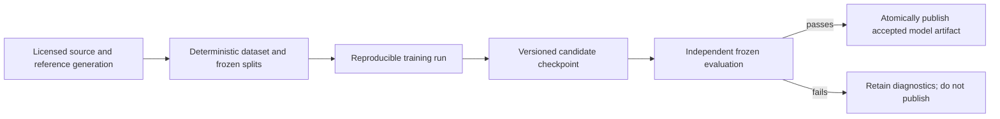

# Neural Graphics Training And Evaluation

**Status:** target capability dossier; no owned training or evaluation implementation was found

**Scope:** define the absent data, training, evaluation, reproducibility, quality, failure, and model-publication capability boundary

**Owner:** future training/evaluation tool and asset-publication path; Renderer is a consumer, not the training owner

**Snapshot:** 2026-09-07; the live non-documentation source/build tree was searched for owned training/data/model paths; source evidence `S` only

**Current readiness:** **0/100** — target only; no production dataset, training, evaluation, or accepted model-publication path was found. See [Current Feature Readiness](../../../Acceptance/CurrentReadiness.md#explicit-missing-or-not-yet-admitted-capabilities).

## At A Glance

| Contract | Required answer | Failure if omitted |
| --- | --- | --- |
| problem | exact user-visible signal, inputs, output/color domain, valid range, scenes/hardware, and non-goals | model metrics cannot be tied to a product outcome |
| data | source/license/provenance, scene/camera/frame identity, generator revision, hashes, and immutable splits | leakage or unlicensed output invalidates evaluation |
| training | model/operator, preprocessing, augmentation, seeds, precision, losses, optimizer, schedule, and checkpoints | results cannot be reproduced or attributed |
| evaluation | frozen numerical/image/sequence, temporal, robustness, and cost comparisons against classical/reference routes | a faster or prettier cherry-picked output can pass without an oracle |
| publication | immutable artifact schema, normalization, weights, metrics, provenance, compatibility, and generation | partial/corrupt work can replace the last accepted model |

The cost of this strict boundary is additional data/provenance infrastructure and slower iteration. The benefit is that a runtime result can be traced back to data, training, evaluation, and artifact identity instead of an opaque weight file.

## Problem And Output Contract

The first owned neural feature must solve one bounded graphics problem with an explicit classical/reference target. Candidate examples are reconstruction, denoising, sampling guidance, compression, or material/light approximation; choosing one is a roadmap decision, not made by this document.

The feature definition must freeze input tensors/attributes, output semantics and color domain, valid extents/ranges, temporal state, quality oracle, classical fallback, supported scenes/hardware, and non-goals before model selection. A training win without an integrated user-visible outcome does not satisfy the feature.

## Data, State, Lifetime, And Reproducibility

- Every training/evaluation sample records source/license, scene/camera/frame identity, generator/reference revision, parameters, split membership, and content hash.
- Train/validation/test splits prevent scene/camera/frame leakage and keep the final test set immutable.
- Preprocessing, augmentation, seeds, precision, loss terms, optimizer/schedule, checkpoints, and evaluation commands are versioned inputs.
- The published artifact contains model/operator schema, weights, input/output normalization, compatibility identity, metrics, and provenance. Partial or failed publication cannot replace the last accepted generation.
- Dataset volume, preprocessing/training wall time, CPU/GPU memory high-water, checkpoint size, and evaluation cost are bounded and reported.

## Quality And Failure Boundary

Evaluation includes numerical metrics appropriate to the chosen signal, frozen image/sequence comparisons, temporal behavior, distribution shifts, adversarial/degenerate inputs, NaN/Inf handling, and a quality-performance-memory frontier against the classical baseline. Vendor inference output cannot serve as the only oracle for an owned model.

Corrupt, incompatible, unlicensed, provenance-incomplete, non-finite, or unexpectedly shaped data/artifacts fail before publication. Training interruption and resource exhaustion retain diagnosable partial state but never publish it as accepted.

## Current Classification

`NG-TRAIN-01` dataset/provenance pipeline, `NG-TRAIN-02` owned model/operator, `NG-TRAIN-03` reproducible training, and `NG-EVAL-01` independent evaluation are **Not found**. The two Showcase conversion scripts and NVIDIA runtime providers are not substitutes.

Acceptance is owned by [Neural Graphics Acceptance](Acceptance.md); executable work must also follow the [Capability Evidence Plan](../../Modules/CapabilityEvidencePlan.md).
