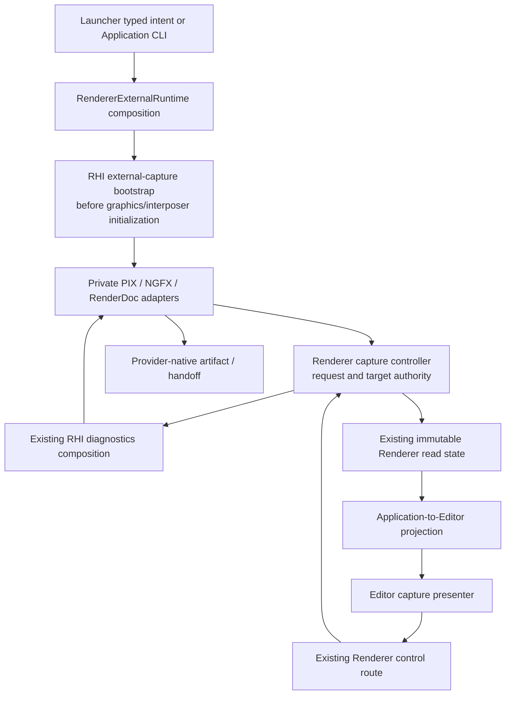

# External Capture Execution Architecture

**Status:** target architecture; source-backed responsibility decisions, pending installed-provider discovery gates

**Scope:** one external-capture lifecycle through process bootstrap, Renderer control/read state, native diagnostics lowering, and Editor/Launcher consumers.

**Authority boundary:** [Semantics](Semantics.md) owns protocol; [User Experience](UserExperience.md) owns interaction; [Plan](Plan.md) owns sequence; [Research](Research.md) owns dated current findings.

**Current readiness:** **0/100 — target only**; marker emission is an existing adjacent capability, not an external-capture provider.

The [requested-control visibility slice](Discovery.md#requested-viewport-controls-handoff) implements the Application/Editor construction and right-side presenter seam for unavailable requests. It introduces no native bootstrap/controller/adapter or capture authority; the production route below remains the target for enabled buttons.

## Implemented Editor Toolbar Composition

The viewport header widget is private `Viewport/ViewportToolbar`; its optional action-group boundary is `Public/Viewport/ViewportToolbarActions.h`. UI exposes one `SetViewportToolbarActions` installation/replacement/clear operation after construction. Optional actions no longer appear in EditorApplication/UI/Implementation constructors or workspace-initialization signatures. UI owns the toolbar and destroys it before ImGui teardown and before its borrowed collaborators.

The shared [Editor icon service](../../../Modules/Engine/Editor/Icons.md) owns image registration, pixel transfer into the atlas and current UV/texture lookup. UI composes its lifetime independently of capture; the toolbar/action draw boundary borrows it transiently. Capture owns only request flags, selected catalog assets, enabled state, order and tooltips. Declarative Editor assets replace feature-local artwork/generation; eligible per-profile catalogs contain actual tool art, Shipping/Game catalogs omit it. Existing ImGui texture packets alone publish uploads. No tool policy enters the service or generic UI/toolbar. The [shared-service handoff](Discovery.md#shared-editor-icon-service-handoff) supersedes the [initial feature-owned icon mechanism](Discovery.md#capture-application-icon-handoff).

Toolbar requires only EditorViewportSession, read-only EngineRenderingSettingsState and the existing CVarControlExecutor. UI supplies a transient level-name view when drawing; toolbar has no LevelSession, settings-controller or host-services dependency. It owns camera/view-mode/Show/statistic layout and measures the optional action group once per frame. Alignment and compact reflow are layout details, never the semantic name of a second panel.

Application `Private/Editor/ExternalCapture/ExternalCaptureLaunch.cpp` resolves requested tool intent once and creates optional actions before graphics initialization; after UI initialization, composition installs them directly. Its private eligible-profile guard contains tool policy. `Public/ExternalCapture/ExternalCaptureToolbar.h` owns the request/factory contract, while concrete `ExternalCaptureToolbarActions` and tool labels/guidance are confined to `Private/Viewport/ExternalCapture/`. No native provider state/policy enters the generic toolbar or UI. The [boundary refinement handoff](Discovery.md#viewport-toolbar-boundary-handoff) supersedes [the prior constructor-injection refactor](Discovery.md#capture-ui-decoupling-handoff); [research](Research.md#editor-injection-and-lifetime-review---2026-10-10) retains the selected precedent.

There is no registry, dependency bag, callback list, SDK-facing base class or duplicated capture authority. Adding real readiness/request state later changes capture-owned composition/actions and existing neutral Renderer authority, not UI constructors or workspace initialization.

## Production Route

Bootstrap and capture are related but have different thread lifetimes. `RendererExternalRuntime` continues to compose process integration on the application thread. It invokes a neutral RHI-owned bootstrap before any API call that an injected tool must intercept, including Streamline's affected initialization. It retains the bootstrap lifetime until render/device shutdown. `RendererBackendConfiguration` carries only the narrow immutable bootstrap value needed by device construction; no provider algorithm or native handle becomes Renderer policy.

The render owner extends existing control/read-state publication with a feature-local capture controller. That controller owns the single request ID sequence, exclusive lease, target/generation validation, deadlines, and exactly-once terminal publication. Native adapters own only SDK activity, native handles/callbacks, and native quiescence/finalization observations. Application and Editor never reproduce these state machines. No internal Performance session, joined history, stat collector, timestamp query, or benchmark exporter is required.

## Feature Homes And Integration-Hook Budget

The feature has one documented ownership envelope with three necessary private homes, because rendering intent, GPU mechanism, and presentation are existing distinct modules. This is not permission to put tool-specific state throughout those modules.

| Home / hook | Responsibility | Budget / architecture falsifier |
| --- | --- | --- |
| Renderer `Private/Diagnostics/ExternalCapture/` (proposed; search before creating) | Neutral request arbitration, scene/present identity resolution, immutable result composition. | One private subsystem; no provider APIs or runtime loading here. |
| RHI `Private/Diagnostics/ExternalCapture/` and backend `Private/{D3D12,Vulkan}/Diagnostics/ExternalCapture/` (proposed) | Shared native lifecycle policy and concrete SDK lowering; bootstrap is available before device creation. | One common owner plus backend adapters; no Renderer/Editor includes. |
| Editor `Private/Viewport/` capture presenter beside `EditorViewportSession` | Presentation of capability/results and submission of typed intent. | One presenter, no native headers or mutable capture authority. |
| RHI `Public/Diagnostics/` | Narrow neutral launch/capability/request/observation contract through existing diagnostics composition, plus pre-device bootstrap entry. | At most one cohesive contract header; no public plugin registry, SDK version structs, raw native handles, or universal native accessor. |
| Renderer public control/read-state and private coordinator composition | One request edge and one immutable provider projection. | Extend existing owners; no second mailbox, polling bus, or service locator. |
| `RendererExternalRuntime` / backend configuration | Startup ordering and lifetime composition. | Invoke bootstrap, compose Streamline, retain owner; no provider switches or loading mechanics. |
| RHI device/presentation factories and diagnostics composition | Attach a bootstrap-selected adapter and notify recording/submission/present boundaries. | One composition hook per backend and existing diagnostics owner; no feature loops in device services. |
| Renderer frame/UI presentation | Confirm scene view participation and host surface generation at existing boundary. | One semantic target-resolution hook; no provider branch in `FramePipeline`, pass bodies, or scene preparation. |
| Application startup and `SparkleApplicationEditor` composition | CLI normalization and model/request adaptation. | One startup edge and one UI composition edge; no external session owner. |
| Launcher level-run request/process producer and existing selection UI | Select and serialize launch intent, display preflight limitations. | Extend existing operation; no tool injection or duplicate compatibility policy. |
| Owning CMake/package membership | Eligible sources, SDK/header/runtime inputs, license notices, Shipping erasure. | One build integration per affected owning target; no all-module provider flags. |
| Owning docs and candidate report | Navigation, target contracts and exact evidence. | Not runtime hooks; no new global registry/reporting system. |

`CHK-EC-ARCH` records exact touched files and feature-symbol occurrences against these rows every stage. Budget is by responsibility edge, not unlimited files hidden beneath one row: discovery records the exact file allowlist and public surface delta before production. A new edge requires a defect-detecting check and updated discovery decision. Bounded removal must show that removing the private homes and listed hooks removes capture without altering material/scene/pass algorithms or screenshots. The [module ownership standard](../../../../Engineering/Foundations/ModuleOwnership.md#feature-enclosure-and-integration-hook-budget) remains binding.

The stage ledger distinguishes a shared engine repair from a capture hook; neither is exempt from review. For each changed owner record finding/Q requirement, current producer and consumer, mutable authority/thread/lifetime, proposed contract/dependency delta, boundary-copy reason/cap, replaced files/symbols, independent defect-detecting check and evidence destination. Shared repairs use neutral names and remain useful without capture. Every feature-named edit outside the private envelope still consumes a hook; relabeling feature state as generic mechanism does not reduce that budget.

## Engine Evolution Contract

**Implementation update - 2026-10-08:** the existing-consumer Q01/Q02 startup/events and Q03 queue admission repairs are implemented. [Stage 0B handoff](Discovery.md#stage-0b-implementation-handoff---2026-10-08) records the producer/consumer/lock/identity/deletion budget and scoped controls. [Stage 0C handoff](Discovery.md#stage-0c-implementation-handoff---2026-10-08) records implemented Q04: one 600-byte fixed viewport observation, monotonic independent publication sequence, migrated consumers and removal of the independent public getters/caches. Native capture/provider contracts remain target work.

The [dated absorption scan](Research.md#engine-absorption-scan--2026-10-07) identifies the existing responsibilities that must improve as this feature lands. Shared engine mechanism stays with its existing owner; capture policy stays within the feature envelope. Preparatory stages must have an existing consumer and an independently observable benefit before a capturer is added. They cannot create dormant extensibility scaffolding.

| Architecture requirement | Existing engine benefit / selected shape | Boundary and deletion obligation |
| --- | --- | --- |
| `EC-Q01` explicit graphics startup | Application normalizes graphics launch intent once using Core token/quoting primitives and RHI's pure backend-value parser. Renderer receives immutable input and composes ordered process integrations; RHI owns native loading. Backend default/environment/CLI behavior is frozen before moving it. Existing backend selection and Streamline are consumers immediately. | Remove process argv/environment parsing from the touched RHI backend-selection route after every producer/consumer is updated. Keep build-default lookup and value conversion in RHI. Preserve documented user-facing option spellings unless discovery explicitly chooses a product change. No generic application-options registry or automatic tool loading. |
| `EC-Q02` explicit event runtime | Initialize the matched official PIX event support through the D3D12 private lifetime/composition owner before recording; event emission uses official headers and data-safe label formatting. Marker-only operation remains distinct from capture. | Delete handwritten event exports and the lazy bare-name singleton path in the same prerequisite slice. Own package/module lifetime under the discovered official route; an already injected capturer is not an owned unloadable event module. No new general DLL loader unless a verified existing cross-feature consumer requires it. |
| `EC-Q03` nonblocking request admission | Add a nonblocking admission operation to the existing ordered command queue, with distinct accepted/full/closed outcomes and preserved producer/consumer sequencing. Migrate existing viewport readback request admission as the first consumer. External capture later uses this mechanism. | No second queue, capture worker thread, fallback WaitPush or dropped accepted command. Preserve intentional blocking frame/synchronous/shutdown paths. Rejection must leave existing screenshot accounting/identity and completion ownership settled. Full/closed are expected boundary results, not fatal misuse. |
| `EC-Q04` coherent viewport publication | Products and presentation texture cross the Renderer->Application boundary as one bounded viewport publication, acquired once per Editor frame at the existing publication cadence. The copy has one real thread-boundary reason and identifies its publication/generation. | Replace the touched separate acquisition route and all its consumers without aliases or a duplicate cache. Do not fold independent shader/task/memory/scene state into a universal renderer snapshot. UI-owned display data is a projection, not another writable publication authority. |
| `EC-Q05` presentation identity at its owner | Existing scene/UI owners establish contribution; existing RHI surface owners establish opaque surface identity/generation and private native mapping. Capture binds these at the actual frame boundary rather than reconstructing HWND/swapchain from UI data. | A surface change invalidates bindings. Product epoch, surface generation, request ID and SDK delimiter have distinct meanings. No viewport/window registry, public native accessor, provider branch in scene/frame algorithms, or capture-specific texture lifetime. Introduce the smallest binding only with the PIX consumer. |
| `EC-Q06` composed clients | Existing Application/UI/Launcher routes adapt neutral intent/read state; a focused capture presenter owns formatting and interaction. Provider compatibility and terminal state are read from the authority. | No per-provider callbacks spread through UI/Host services, no presenter polling native SDKs, no provider process executor beside LevelRun operations. UI composition remains bounded and unrelated panels/services are preserved. |
| `EC-Q07` configuration ownership | Owning CMake target explicitly separates optional capture/event source/dependency membership from broad private globs for eligible profiles. Use existing build-profile/package/user-state authority. | Shipping has neither optional sources/calls nor staged runtime/dependencies. No all-module provider flags, duplicate profile catalog, private dependency accidentally made PUBLIC, or global source-glob rewrite. |

`EC-D09` freezes the exact API/file/deletion deltas and invalidates this target if live source already solves a finding. Such a prerequisite closes through retained equivalent proof, not an empty new abstraction. [CHK-EC-EVOLUTION](README.md#executable-check-cards-to-freeze-before-implementation) verifies engine benefits without capture. `CHK-EC-LOCALITY` verifies the real second-provider change rather than an imagined fourth-provider framework. Neither a file count nor shorter functions is sufficient: state authority, dependency direction, failure settlement and production consumers must improve or be preserved.

### Change Locality And Responsibility Rules

Once PIX is accepted, Nsight/RenderDoc additions may change private adapter/composition/build inputs, the closed provider descriptor projection and truthful support/guidance. They must not require new provider fields or provider switches in Application, Editor widgets, RenderCoordinator, RendererHost, FramePipeline, scene/material preparation or Shader System. A new native observation required by evidence may extend the neutral contract once, with a real consumer and D07/D09 review; a vendor API shape is not by itself that justification. Record the exact delta against the PIX candidate at each provider gate.

Retain closed typed command dispatch and focused diagnostics composition; one switch at an actual composition boundary is reasonable. Reject repeated policy switches in forwarding layers, base classes/registries for a fixed three-provider set, a service bag threaded through unrelated layers, or tiny forwarding objects with no lifetime/policy/invariant. Every substantive owner declares one responsibility and who may mutate it. Extract only when a distinct responsibility exists; removing a helper and restoring direct composition must not lose an invariant.

The bounded-removal review separates shared repairs from capture: removing the capture homes/hooks should leave explicit backend startup, correct event support where eligible, queue admission and coherent viewport publication useful to their existing consumers. This is a review of the scoped diff and producer/consumer ledger, not a destructive experiment on user work. New external features cannot make normal rendering depend on a profiler installation, selected provider or polling loop.

## Data And Lifetime Inventory

| Value / mutable owner | Producer -> consumer / lifetime | Copy reason / rejected duplicate |
| --- | --- | --- |
| Immutable provider set / startup | Launcher or Application -> bootstrap; process lifetime | One tiny value at process boundary; no provider booleans in each module. |
| Bootstrap resource / RHI private | Early loader -> device adapters; outlives devices and callbacks | Owned handle, not a copied native module in Renderer. |
| Capability / native adapter | SDK/backend discovery -> controller -> read state | Fixed three-entry immutable projection; no SDK polling in UI. |
| Request / Renderer controller | Existing control message -> controller -> selected adapter | Copy at thread mailbox boundary only; no second UI request cache. |
| Target binding / Renderer and RHI existing surface owners | Scene-view token -> confirmed host surface -> private native target | Generations prevent stale reuse; no new native window ownership. |
| Native observation / adapter | Native APIs/callback -> controller safe boundary | Bounded event/result copy across callback lifetime; no callback owning Editor pointers. |
| Latest terminal results / controller | Settlement -> Renderer read state -> presenter | Fixed per-provider record, referenced or moved within owner; no ring/history. |
| Correlation sidecar / capture operation | Immutable candidate/configuration identities -> user-state artifact | One explicit publication snapshot; no scene/material/shader-library copy. |

The [single-truth/copy budget](../../../../Engineering/Foundations/DataAndMemory.md#single-truth-and-copy-budget) applies. Request IDs and generations are lifetime/correlation counters, not internal format versions.

## Provider Lowering Decisions

### PIX First

Use the official matched WinPixEventRuntime header/runtime package in eligible D3D12 builds; replace hand-declared marker exports and bare-name DLL loading in the touched owner. The existing signatures match Microsoft's documented stable manual ABI; replacement improves package ownership and official encoding rather than repairing a demonstrated ABI defect. Backend-private code uses official event macros with safe literal formatting and retains stable marker storage. Stage 0 selects the matched desktop import library and OS-loader lifetime, not a new general module manager. Resolve the GPU capturer from a validated installed PIX location, or recognize provider-native injection; never redistribute it as though it were the event runtime.

The proposed next-frame lowering is `PIXSetTargetWindow` followed by `PIXGpuCaptureNextFrames(..., 1)`. Only the containing native present window is a delimiter. Attachment/status/open facilities come from the pinned package's official headers. Stage 0 proves the installed completion signal before that signal can set Completed. If the API exposes only accepted scheduling or a saved growing file, keep finalization unconfirmed and block provider acceptance. These API constraints come from [Microsoft](https://devblogs.microsoft.com/pix/programmatic-capture/); the result contract is Sparkle's [EC-S10](Semantics.md#publication-and-artifact-truth).

PIX Timing stays a separate bounded range workflow delivered with the PIX priority group in Stage 2, initially tool-managed. Its privilege/collector requirements cannot become an implicit frame-button behavior.

**Resolved artifact boundary:** [D07 continuation](Discovery.md#prerequisite-repair-and-native-probe--2026-10-07) and the binding [RHI standard](../../../../Engineering/Modules/RHI.md#boundary-decisions-at-a-glance) distinguish destination-free pixel readback from external native-tool diagnostics. The latter may lower one bounded Application-selected absolute file destination required by the SDK. Directory/naming/retention/manifest/open policy remain above RHI; no filesystem service bag or disguised path registry is introduced. Native scheduling observations cannot declare Completed. This resolves the contract distinction; Stage 1's exact adapter delta and its lifecycle/target checks still need the PIX gate.

The installed-version probe found that `PIXIsAttachedForGpuCapture` can be false while direct programmatic GPU capture succeeds. It observes native UI attachment, not the sole activity-readiness predicate. `PIXGetCaptureState` stayed zero during the observed capture. Use native artifact-open evidence for the inspected result; never turn zero state or scheduling success into completion or quiescence. Process-lifetime capturer retention without engine callback registrations is the selected first-slice lifetime route; neither live unhook nor timeout cancellation is introduced.

### Nsight Second

Use installed NGFX Graphics Capture headers in private eligible targets, with explicit external structure-version constants and a verified loader callback. Resolve installed tool libraries without unrestricted working-directory search. Initialize one selected activity before the graphics context; injected and provider-native launches must both satisfy the activity check. Keep SDK beta status visible independently of the local workflow's accepted evidence. [SDK initialization contract](https://docs.nvidia.com/nsight-graphics/UserGuide/sdk.html).

D3D12 and Vulkan adapters resolve their own delimiter and artifact APIs from the pinned [NGFX reference](https://docs.nvidia.com/nsight-graphics/NsightGraphicsSdk/group___n_g_f_x___a_p_i___c_o_r_e.html). Baseline the capture-file count before requesting and associate only the resulting completed artifact with this request. Poll with zero timeout or perform a bounded worker-side wait; never use an indefinite wait on EditorThread/RenderThread. Handle caller-owned path buffers and target filesystem namespace explicitly. Tool/SDK documentation mismatch blocks that cell until installed-header evidence resolves it.

GPU Trace has a distinct activity, range request, host/finalization behavior, and output. Stage 4 completes its tool-managed handoff, together with Nsight Systems, using a separate launch/session; never activate it in a Graphics Capture process. Nsight Systems remains a specialist system-trace route rather than another frame button. No Perf SDK/HUD or counter ingestion is part of this capture product.

### RenderDoc Third

Use the matched MIT application header and dynamically query `RENDERDOC_GetAPI` from an already injected or explicitly requested early-loaded module. Record the negotiated API; no static RenderDoc library linkage. Validate the real root pointer/window pair, using `RENDERDOC_DEVICEPOINTER_FROM_VKINSTANCE` for Vulkan, not a cast `VkDevice`. Prefer explicit bracketing at verified production boundaries; `StartFrameCapture` is void, so it cannot itself prove success. End result, native state, and capture enumeration settle the request. [Release-tagged API contract](https://raw.githubusercontent.com/baldurk/renderdoc/v1.46/renderdoc/api/app/renderdoc_app.h).

No wildcard pair when multiple roots/windows can match. Frame key/overlay policy is explicit and restored where safe; a connected replay UI is not required for capture readiness. Capture options do not force VSync, validation, callstacks, or unsupported vendor extensions silently. Unsafe unhooking after graphics work is prohibited; relaunch is the supported recovery.

## Packaging, Symbols, And Security

Debug profiles support correctness investigation; optimized DevelopmentEditor/Game are canonical capture products. Shipping excludes capture parser, startup bootstrap, provider state/adapters, markers/strings/assets, imports and staged dependencies, using existing profile authority. Configure without installed profiler SDKs; optional capability absence must not prevent an ordinary no-provider build/run. SDK selection is one build decision at each owning composition boundary, not one flag for every UI/widget/provider field.

Development products stage only licensed event runtime/header support actually required by selected built adapters. PIX/Nsight/RenderDoc GUI/capture installations remain external prerequisites unless discovery records explicit redistribution permission. Pin external package/header hashes in executable configuration, use canonical dependency/artifact locations, and carry notices. Validate absolute installation paths; do not load an arbitrary same-named DLL from the working directory. Paths with spaces/Unicode use native API conventions. Never create repository-local captures or output-path environment escapes.

Reuse [Shader System](../../ShaderSystem/README.md) provenance: exact CPU binary/PDB and active shader/code/cook hashes plus optimized symbol-bearing analysis artifacts. Source-debug shader compilation is an explicitly different observer product; do not recook all shaders merely to enable a capture button. If exact symbols cannot be resolved, capture remains a frame/state artifact with `SymbolsUnavailable`; source-correlation acceptance remains blocked.

## Clean Break And Refinement

Replace the marker loader and handwritten ABI path in prerequisite Stage 0A; update all direct callsites, build membership, and documentation. The selected optional matched event package is default-off, privately enabled only for eligible non-Shipping D3D12 profiles, with existing dependency/artifact staging and MIT notices. Those are target build decisions, not generated-membership or Shipping proof. Preserve screenshot/readback services, existing GPU resource lifetimes, parallel recording, Streamline intent, and normal presentation. No aliases, legacy provider paths, internal schema dispatch, second stat/session truth, or deferred deletion gate.

Each stage ends with one responsibility sentence per substantive file/class/function, duplicate/switch/include audit, exact hook ledger, and `architecture_boundary_check`. Discovery may refine file placement from current source, but may not move these authorities into generic orchestrators to avoid the budget.
