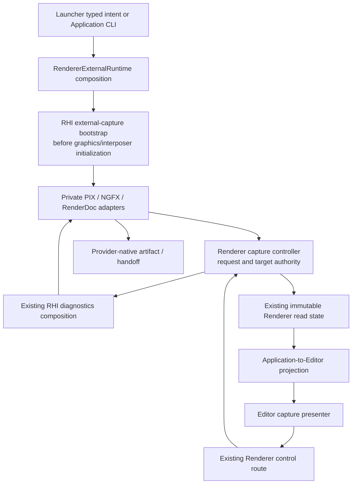

# External Capture Execution Architecture

**Status:** target architecture; source-backed responsibility decisions, pending installed-provider discovery gates

**Scope:** one external-capture lifecycle through process bootstrap, Renderer control/read state, native diagnostics lowering, and Editor/Launcher consumers.

**Authority boundary:** [Semantics](Semantics.md) owns protocol; [User Experience](UserExperience.md) owns interaction; [Plan](Plan.md) owns sequence; [Research](Research.md) owns dated current findings.

**Current readiness:** **0/100 — target only**; marker emission is an existing adjacent capability, not an external-capture provider.

## Production Route

Bootstrap and capture are related but have different thread lifetimes. `RendererExternalRuntime` continues to compose process integration on the application thread. It invokes a neutral RHI-owned bootstrap before any API call that an injected tool must intercept, including Streamline's affected initialization. It retains the bootstrap lifetime until render/device shutdown. `RendererBackendConfiguration` carries only the narrow immutable bootstrap value needed by device construction; no provider algorithm or native handle becomes Renderer policy.

The render owner extends existing control/read-state publication with a feature-local capture controller. That controller owns the single request ID sequence, exclusive lease, target/generation validation, deadlines, and exactly-once terminal publication. Native adapters own only SDK activity, native handles/callbacks, and native quiescence/finalization observations. Application and Editor never reproduce these state machines. No internal Performance session, joined history, stat collector, timestamp query, or benchmark exporter is required.

## Feature Homes And Integration-Hook Budget

The feature has one documented ownership envelope with three necessary private homes, because rendering intent, GPU mechanism, and presentation are existing distinct modules. This is not permission to put tool-specific state throughout those modules.

| Home / hook | Responsibility | Budget / architecture falsifier |
| --- | --- | --- |
| Renderer `Private/Diagnostics/ExternalCapture/` (proposed; search before creating) | Neutral request arbitration, scene/present identity resolution, immutable result composition. | One private subsystem; no provider APIs or runtime loading here. |
| RHI `Private/Diagnostics/ExternalCapture/` and backend `Private/{D3D12,Vulkan}/Diagnostics/ExternalCapture/` (proposed) | Shared native lifecycle policy and concrete SDK lowering; bootstrap is available before device creation. | One common owner plus backend adapters; no Renderer/Editor includes. |
| Editor `Private/Viewport/` capture presenter beside `EditorViewportSession` | Presentation of capability/results and submission of typed intent. | One presenter, no native headers or mutable capture authority. |
| RHI `Public/Diagnostics/` | Narrow neutral launch/capability/request/observation contract through existing diagnostics composition, plus pre-device bootstrap entry. | At most one cohesive contract header; no public plugin registry, SDK version structs, raw native handles, or universal native accessor. |
| Renderer public control/read-state and private coordinator composition | One request edge and one immutable provider projection. | Extend existing owners; no second mailbox, polling bus, or service locator. |
| `RendererExternalRuntime` / backend configuration | Startup ordering and lifetime composition. | Invoke bootstrap, compose Streamline, retain owner; no provider switches or loading mechanics. |
| RHI device/presentation factories and diagnostics composition | Attach a bootstrap-selected adapter and notify recording/submission/present boundaries. | One composition hook per backend and existing diagnostics owner; no feature loops in device services. |
| Renderer frame/UI presentation | Confirm scene view participation and host surface generation at existing boundary. | One semantic target-resolution hook; no provider branch in `FramePipeline`, pass bodies, or scene preparation. |
| Application startup and `SparkleApplicationEditor` composition | CLI normalization and model/request adaptation. | One startup edge and one UI composition edge; no external session owner. |
| Launcher level-run request/process producer and existing selection UI | Select and serialize launch intent, display preflight limitations. | Extend existing operation; no tool injection or duplicate compatibility policy. |
| Owning CMake/package membership | Eligible sources, SDK/header/runtime inputs, license notices, Shipping erasure. | One build integration per affected owning target; no all-module provider flags. |
| Owning docs and candidate report | Navigation, target contracts and exact evidence. | Not runtime hooks; no new global registry/reporting system. |

`CHK-EC-ARCH` records exact touched files and feature-symbol occurrences against these rows every stage. Budget is by responsibility edge, not unlimited files hidden beneath one row: discovery records the exact file allowlist and public surface delta before production. A new edge requires a defect-detecting check and updated discovery decision. Bounded removal must show that removing the private homes and listed hooks removes capture without altering material/scene/pass algorithms or screenshots. The [module ownership standard](../../../../Engineering/Foundations/ModuleOwnership.md#feature-enclosure-and-integration-hook-budget) remains binding.

## Data And Lifetime Inventory

| Value / mutable owner | Producer -> consumer / lifetime | Copy reason / rejected duplicate |
| --- | --- | --- |
| Immutable provider set / startup | Launcher or Application -> bootstrap; process lifetime | One tiny value at process boundary; no provider booleans in each module. |
| Bootstrap resource / RHI private | Early loader -> device adapters; outlives devices and callbacks | Owned handle, not a copied native module in Renderer. |
| Capability / native adapter | SDK/backend discovery -> controller -> read state | Fixed three-entry immutable projection; no SDK polling in UI. |
| Request / Renderer controller | Existing control message -> controller -> selected adapter | Copy at thread mailbox boundary only; no second UI request cache. |
| Target binding / Renderer and RHI existing surface owners | Scene-view token -> confirmed host surface -> private native target | Generations prevent stale reuse; no new native window ownership. |
| Native observation / adapter | Native APIs/callback -> controller safe boundary | Bounded event/result copy across callback lifetime; no callback owning Editor pointers. |
| Latest terminal results / controller | Settlement -> Renderer read state -> presenter | Fixed per-provider record, referenced or moved within owner; no ring/history. |
| Correlation sidecar / capture operation | Immutable candidate/configuration identities -> user-state artifact | One explicit publication snapshot; no scene/material/shader-library copy. |

The [single-truth/copy budget](../../../../Engineering/Foundations/DataAndMemory.md#single-truth-and-copy-budget) applies. Request IDs and generations are lifetime/correlation counters, not internal format versions.

## Provider Lowering Decisions

### PIX First

Use the official matched WinPixEventRuntime header/runtime package in eligible D3D12 builds; replace hand-declared marker exports and bare-name DLL loading in the touched owner. Backend-private code uses official event macros with safe literal formatting and retains stable marker storage. Resolve the GPU capturer from a validated installed PIX location, or recognize provider-native injection; never redistribute it as though it were the event runtime.

The proposed next-frame lowering is `PIXSetTargetWindow` followed by `PIXGpuCaptureNextFrames(..., 1)`. Only the containing native present window is a delimiter. Attachment/status/open facilities come from the pinned package's official headers. Stage 0 proves the installed completion signal before that signal can set Completed. If the API exposes only accepted scheduling or a saved growing file, keep finalization unconfirmed and block provider acceptance. These API constraints come from [Microsoft](https://devblogs.microsoft.com/pix/programmatic-capture/); the result contract is Sparkle's [EC-S10](Semantics.md#publication-and-artifact-truth).

PIX Timing stays a separate bounded range workflow in Stage 7, initially tool-managed. Its privilege/collector requirements cannot become an implicit frame-button behavior.

### Nsight Second

Use installed NGFX Graphics Capture headers in private eligible targets, with explicit external structure-version constants and a verified loader callback. Resolve installed tool libraries without unrestricted working-directory search. Initialize one selected activity before the graphics context; injected and provider-native launches must both satisfy the activity check. Keep SDK beta status visible independently of the local workflow's accepted evidence. [SDK initialization contract](https://docs.nvidia.com/nsight-graphics/UserGuide/sdk.html).

D3D12 and Vulkan adapters resolve their own delimiter and artifact APIs from the pinned [NGFX reference](https://docs.nvidia.com/nsight-graphics/NsightGraphicsSdk/group___n_g_f_x___a_p_i___c_o_r_e.html). Baseline the capture-file count before requesting and associate only the resulting completed artifact with this request. Poll with zero timeout or perform a bounded worker-side wait; never use an indefinite wait on EditorThread/RenderThread. Handle caller-owned path buffers and target filesystem namespace explicitly. Tool/SDK documentation mismatch blocks that cell until installed-header evidence resolves it.

GPU Trace has a distinct activity, range request, host/finalization behavior, and output. Stage 7 uses a separate launch/session; never activate it in a Graphics Capture process. Nsight Systems remains a specialist system-trace route rather than another frame button. No Perf SDK/HUD or counter ingestion is part of this capture product.

### RenderDoc Third

Use the matched MIT application header and dynamically query `RENDERDOC_GetAPI` from an already injected or explicitly requested early-loaded module. Record the negotiated API; no static RenderDoc library linkage. Validate the real root pointer/window pair, using `RENDERDOC_DEVICEPOINTER_FROM_VKINSTANCE` for Vulkan, not a cast `VkDevice`. Prefer explicit bracketing at verified production boundaries; `StartFrameCapture` is void, so it cannot itself prove success. End result, native state, and capture enumeration settle the request. [Release-tagged API contract](https://raw.githubusercontent.com/baldurk/renderdoc/v1.46/renderdoc/api/app/renderdoc_app.h).

No wildcard pair when multiple roots/windows can match. Frame key/overlay policy is explicit and restored where safe; a connected replay UI is not required for capture readiness. Capture options do not force VSync, validation, callstacks, or unsupported vendor extensions silently. Unsafe unhooking after graphics work is prohibited; relaunch is the supported recovery.

## Packaging, Symbols, And Security

Debug profiles support correctness investigation; optimized DevelopmentEditor/Game are canonical capture products. Shipping excludes capture parser, startup bootstrap, provider state/adapters, markers/strings/assets, imports and staged dependencies, using existing profile authority. Configure without installed profiler SDKs; optional capability absence must not prevent an ordinary no-provider build/run. SDK selection is one build decision at each owning composition boundary, not one flag for every UI/widget/provider field.

Development products stage only licensed event runtime/header support actually required by selected built adapters. PIX/Nsight/RenderDoc GUI/capture installations remain external prerequisites unless discovery records explicit redistribution permission. Pin external package/header hashes in executable configuration, use canonical dependency/artifact locations, and carry notices. Validate absolute installation paths; do not load an arbitrary same-named DLL from the working directory. Paths with spaces/Unicode use native API conventions. Never create repository-local captures or output-path environment escapes.

Reuse [Shader System](../../ShaderSystem/README.md) provenance: exact CPU binary/PDB and active shader/code/cook hashes plus optimized symbol-bearing analysis artifacts. Source-debug shader compilation is an explicitly different observer product; do not recook all shaders merely to enable a capture button. If exact symbols cannot be resolved, capture remains a frame/state artifact with `SymbolsUnavailable`; source-correlation acceptance remains blocked.

## Clean Break And Refinement

Replace the marker loader/ABI in the same PIX slice; update all direct callsites, build membership, and documentation. Preserve screenshot/readback services, existing GPU resource lifetimes, parallel recording, Streamline intent, and normal presentation. No aliases, legacy provider paths, internal schema dispatch, second stat/session truth, or deferred deletion gate.

Each stage ends with one responsibility sentence per substantive file/class/function, duplicate/switch/include audit, exact hook ledger, and `architecture_boundary_check`. Discovery may refine file placement from current source, but may not move these authorities into generic orchestrators to avoid the budget.
