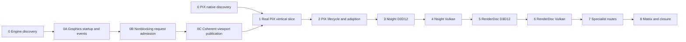

# External Capture Staged Implementation Plan

**Status:** conditional implementation plan; documentation complete enough for Stage 0, production stages require their discovery and preceding candidate gates

**Scope:** improve the engine structures that absorb external hooks, then deliver PIX first, Nsight, RenderDoc and activity-specific specialist handoff through one launch/control/publication path.

**Prepared:** 2026-10-06 at `82528cbe5edbcf729464fbefe6998435730920eb`, initially clean working tree; estimates below are assumptions, not commitments.

**Engine-quality expansion:** 2026-10-07 at `54c2206131cb6488fae26428378c0ab782c65db9`; [source scan E01–E11](Research.md#engine-absorption-scan--2026-10-07) and [architecture Q01–Q07](ExecutionArchitecture.md#engine-evolution-contract). User-owned ViewportDisplaySettings work is outside this plan's edits. The three prerequisite prompts below expand the original nine-stage delivery without renumbering provider stages.

**Authority boundary:** [dossier](README.md) owns scope/acceptance; [Discovery](Discovery.md) owns gates; [Semantics](Semantics.md) owns protocol; [Execution Architecture](ExecutionArchitecture.md) owns responsibility; [User Experience](UserExperience.md) owns interaction; [Research](Research.md) owns precedent. This page owns delivery order, stage bounds, estimates, deletions, prompts, and handoff.

**Current readiness:** **0/100 — target only** for capture integration. Capture providers remain unimplemented. Existing-consumer engine repairs and their bounded execution results are recorded in Discovery; they do not establish capture acceptance or release readiness.

## Viewport Toolbar Boundary Refinement - 2026-10-10

`ITER-EXTCAP-UI-03`, owner agent, starting at `7d342a6448031aeae36e05eb84e76d4b18d8a201` plus the dirty requested-control/refactor slices. User requests fewer forwarded parameters, precise vocabulary and coherent module edges. Preserve native readiness/PGE evidence; advance NS-OWNERSHIP/NS-SIMPLIFY and Q06 structure only. This supersedes UI-02's constructor-injection shape, retaining its underlying unique ownership and pre-ImGui destruction invariant.

Freeze before edits: rename the actual header widget to private `Viewport/ViewportToolbar`; expose only `ViewportToolbarActions` (measure/draw/owned destruction). Application creates requested capture actions before graphics initialization, then installs them through `UI::SetViewportToolbarActions` after UI construction. No optional widget parameter in EditorApplication/UI/Implementation constructors or panel-initialization stages. Installation/replacement/clear and destruction occur on the Editor thread with live ImGui; no retained intermediate ownership or additional registry. Toolbar retains exactly three required references: EditorViewportSession, read-only EngineRenderingSettingsState, and existing CVarControlExecutor. UI supplies only the current level-name view at draw; toolbar cannot load levels or commit global settings. Read-only settings refer to the stable controller member (refresh assigns in place), not a copied snapshot.

Vocabulary/placement: Application `Private/Editor/ExternalCapture/ExternalCaptureLaunch.{h,cpp}` composes `CreateRequestedCaptureToolbarActions`; Editor `Public/ExternalCapture/ExternalCaptureToolbar.h` owns the request/factory boundary; concrete `ExternalCaptureToolbarActions` is file-local under `Private/Viewport/ExternalCapture/`. Delete old Content/TopPanel/EditorViewportToolbar/EditorCaptureToolbar/presenter declarations, paths and names without aliases. Generic UI installation is a focused capability, not a public panel API. No changes to native SDK mechanics, queue/publication, screenshots, other controls or optional package requirements.

Allowlist: Application EditorApplication.{h,cpp}, old/new Editor composition files and CMake; Editor UI.h/UI.cpp/UIImplementation.{h,cpp}/UIInitialization.cpp/UIWorkspace.cpp, old/new toolbar/action/capture files and CMake. Nearest ExternalCapture architecture/README/research/discovery plus live Editor, PerformanceDiagnostics, DebugViews and ReferencePathTracer plan source references; dated candidate evidence retains old names as historical. No unrelated panel/renderer/RHI refactor.

| Control | Frozen requirement / selected check |
| --- | --- |
| AC-UI03-EDGE / CHK-UI03-ARCH | No optional contribution parameter forwarded through constructors/initialization; three real required toolbar dependencies, no LevelSession/settings-controller/UI-host dependency in toolbar. Full definition/use/lifetime audit; stale names/aliases absent from live source. |
| AC-UI03-OWN / CHK-UI03-LIFE | One owned action group, explicit install/replace/clear; replaced group and shutdown group destroyed with live ImGui on Editor thread. Disposable alternate implementation exercises replacement/clear/destruction, then removed; source restoration checked by hash. |
| AC-UI03-UX / CHK-UI03-UX | No-flag/each/all/compact requests retain exact visibility/order and level/camera/viewmode/Show toolbar. Actual DevelopmentEditor D3D12 Empty launches/screenshots, ordinary shutdown, duplicate/unknown pregraphics rejection. Owning ShowcaseEditor build. |
| AC-UI03-PROFILE / CHK-UI03-PACKAGE | Capture action implementation/private composition body only DebugEditor/DevelopmentEditor; no public feature defines/SDK dependency. Generated six-profile membership audit, narrow build, formatting/docs/diff checks. Complete Shipping/Debug-native claims remain unrun. |
| FM-UI03-LIFE / RISK-UI03-BORROW | Replacing owned controller/session or premature context teardown would dangle three references or destroy widgets unsafely; medium structural risk, UI owns stable collaborators and destroys toolbar before them/ImGui. Check actual members/refresh/destruction and disposable replacement/shutdown assertions; repair owner ordering in place. Owner agent; retire after selected lifetime checks. |

Performance classification: no renderer/frame topology change, same single width measurement/draw per UI frame, no new retained values/caches/threads. One immutable process intent copied once into action lifetime; only unique_ptr moves at the installation boundary, level-name view borrowed for the synchronous draw. No dependency bag is introduced to conceal parameter count. Record exact evidence/limits in Discovery; native capture gates remain unchanged.

## Capture UI Decoupling Iteration - 2026-10-10

`ITER-EXTCAP-UI-02`, owner agent, implementing at `7d342a6448031aeae36e05eb84e76d4b18d8a201` with the prior visibility slice and documentation dirty; preserve that behavior and unrelated changes. User explicitly requests responsibility/injection refinement. North Star: isolated feature implementation with an inspectable composition/lifetime owner; preserve graphics/PGE evidence. Q06/ARCH advance structurally, provider acceptance remains unchanged.

Scope/budget: one Editor-owned `ViewportToolbarContent` contract, two real UI operations (measure/draw) and owned destruction; one optional right-side contribution injected during UI construction. Application composes it before Runtime initialization through `EditorViewportToolbar`, with private eligible-profile policy. Capture intent, labels and disabled guidance stay in the feature factory/presenter. No registry, dynamic discovery, service locator, general application-options framework, native provider facade or new SDK/controller.

Allowlist: Application `Public/EditorApplication.h`, `Private/EditorApplication.cpp`, old `Private/Editor/EditorCaptureLaunch.{h,cpp}` replaced by `EditorViewportToolbar.{h,cpp}`, owning CMake. Editor `Public/UI.h`, new `Public/Viewport/ViewportToolbarContent.h` and `Public/Capture/EditorCaptureToolbar.h`, old `Public/Viewport/ViewportCaptureTools.h` deleted; `Private/UI.{h,cpp}` counterparts as present (`UI.cpp`, `UIImplementation.{h,cpp}`, `UIInitialization.cpp`), `Panels/ViewportTopPanel.{h,cpp}`, capture presenter moved into `Private/Viewport/ExternalCapture/`, owning CMake. RHI audit finding: narrow D3D12PixEvents.h from RenderHardwareInterface to its actual diagnostics color contract; no SDK/lifetime/API behavior changes or Renderer production changes.

| Control | Required result / falsifier |
| --- | --- |
| AC-UI02-BOUNDARY / CHK-UI02-ARCH | Generic UI/host/init/top-panel files contain no capture tool type, vendor selector or capture build guard; one move-only toolbar dependency. Source searches and scoped ownership diff. |
| AC-UI02-PRESERVE / CHK-UI02-UX | Existing no-flag/each/all flag visibility, order, right alignment and compact second row retained on actual DevelopmentEditor Empty. Duplicate/unknown fail before graphics. Owning build plus native window screenshots/exits. |
| AC-UI02-LIFETIME / CHK-UI02-LIFE | Contribution transfers ownership once into top panel and is destroyed before ImGui backend/context teardown; no Application mirror or duplicate mutable authority. Complete constructor/destructor path audit and normal shutdown. |
| AC-UI02-PROFILE / CHK-UI02-PACKAGE | Only eligible Editor profiles contain capture presenter/calls; no feature PUBLIC compile define propagates into clients. Six-profile generated membership/definition audit; complete Shipping/native provider acceptance unclaimed. |
| RISK-UI02-OWNER | Widget leaked/destroyed after context due to moved ownership: plausible across three constructors, medium workflow failure impact; UI owner moves unique_ptr and explicitly destroys toolbar owner before teardown; detect at ownership/source/shutdown checks; repair ordering rather than shared ownership. |
| RISK-UI02-SHIPPING | Removing broad guards exposes capture payload in Shipping: compiler/config-specific risk; owning targets retain eligible source membership/private composition define; detect in generated profile audits; revert erroneous membership in place, never add a fallback tool. |

Data: parse launch requests once in Application Editor composition (immutable process-local three-byte value), copy once into the presenter for UI lifetime; transit unique_ptr moves only, generic host has no provider fields. Measure width once per UI frame; one virtual draw/measure edge replaces knowledge of concrete feature types. Source refinement must justify this actual presentation boundary rather than speculative provider interfaces. Delete old request plumbing/paths/guards in the same change. Handoff records actual commands/results and primary-source precedent in Discovery/Research; no native capture readiness increase.

## Requested Viewport Controls Iteration - 2026-10-10

`ITER-EXTCAP-UI-01`: implementation owner agent; start `7d342a6448031aeae36e05eb84e76d4b18d8a201`, preserving five dirty capture/runbook documents. User requests flag-driven viewport controls in DebugEditor/DevelopmentEditor. Scope: truthful requested/unavailable presentation, Q06, preserving existing graphics/PGE evidence. No EC-G1 native acceptance or readiness increase.

| Control | Outcome / cheapest falsifier |
| --- | --- |
| AC-EC-UI-01 / CHK-EC-UI-VIS | Each corresponding flag shows its entry, fixed PIX/Nsight/RenderDoc order; no flags hides group. Actual DevelopmentEditor D3D12 Empty launch/header screenshots; compact header second-row control. |
| AC-EC-UI-02 / CHK-EC-UI-TRUTH | Unavailable controls submit no work and never claim attachment/capture success. Source audit of disabled buttons, no native loader/callback, guidance and launch warning. |
| AC-EC-UI-03 / CHK-EC-UI-PROFILE | Parser/presenter compile only in DebugEditor/DevelopmentEditor; generated membership/defines across six profiles, owning build and ordinary no-tool shutdown. |
| FM-EC-UI-01 / CHK-EC-UI-INPUT | Duplicate/misspelled attachment input fails before graphics with readable error; correct input and relaunch. Actual duplicate mixed-case and misspelled Nsight process exits/logs. |
| RISK-EC-UI-01 | Tool-managed success mistaken for button readiness: plausible due to installed names, false result impact. Capture owner prevents with disabled controls/warnings; detect any submitted request/native load/success; keep external workflow; retire only with native adapter acceptance. |
| RISK-EC-UI-02 | Narrow viewport clips controls: layout owner allocates second row before Begin; detect through compact-window screenshot; retire through visibility check. |

Architecture allowlist: Application `Private/Editor/EditorCaptureLaunch.{h,cpp}` owns CLI normalization; `EditorApplication.cpp` composes its immutable three-boolean result before Runtime initialization. Editor `Public/Viewport/ViewportCaptureTools.h` owns requested-control input, not capability/result; `Public/UI.h`, `Private/UIImplementation.{h,cpp}` and `UIInitialization.cpp` forward only during construction. `Private/Viewport/ViewportCapturePresenter.{h,cpp}` owns labels/width/unavailable guidance; `Private/Panels/ViewportTopPanel.{h,cpp}` places it beside stats and owns row height. Owning Application/Editor CMake excludes optional sources/calls from Shipping. No Renderer/RHI boundary, SDK, native loading, command queue, mutable capture authority, worker or permanent harness is added. Application retains three bytes for UI reconstruction; presenter retains an immutable three-byte lifetime projection, with no frame-hot publication/copy. Removing these composition edges removes visibility without changing rendering/readback. No replaced production path exists; forward contracts replace the unimplemented `--capture-provider` spelling, while historical discovery preserves original commands.

Results/limits: [requested-control handoff](Discovery.md#requested-viewport-controls-handoff). Provider gates remain open.

## Delivery Order And Existing Package Mapping

**Prerequisite repair — 2026-10-07:** [discovery continuation](Discovery.md#prerequisite-repair-and-native-probe--2026-10-07) closes `EC-D0-ENGINE` for the independent 0A/0B/0C repairs. Stage 0A may begin using the frozen Q01/Q02/Q07 ledger and matched official event package. PIX-only finalization/quiescence, engine target/generation, interposer-combination and native inspection acceptance stay under `EC-D0-PIX` and still precede Stage 1; they no longer block unrelated existing-consumer repair. This corrects the earlier aggregate gate dependency rather than claiming a native proof passed. `EC-G0A/0B/0C` remain implementation exits, not documentation outcomes.



| Stage | Existing package / user outcome | Gate artifact / next permission |
| --- | --- | --- |
| 0 | PIX/environment and engine-absorption discovery with remaining cells inventoried | `EC-D0-ENGINE` permits 0A; `EC-D0-PIX` permits Stage 1 after engine exits |
| 0A | Explicit graphics launch/composition and official owned event support; existing backend/Streamline/marker consumers | `EC-G0A`; no GPU capture required, Stage 0B |
| 0B | Nonblocking ordered queue admission, used by existing viewport readback | `EC-G0B`; no GPU capture required, Stage 0C |
| 0C | Coherent viewport product/texture publication, used by existing Editor frame consumer | `EC-G0C`; no GPU capture required, Stage 1 |
| 1 | `EXT-00` + minimal `EXT-01`: Launcher/CLI -> viewport -> real PIX artifact | `EC-G1`; PIX partial delivery, Stage 2 only |
| 2 | `EXT-01` lifecycle/Game/Shipping/observer proof and separate PIX Timing handoff | `EC-G2`; PIX accepted on its matrix, Stage 3 |
| 3 | `EXT-04` Nsight Graphics Capture D3D12 | `EC-G3`; Stage 4 |
| 4 | `EXT-05` Nsight Graphics Capture Vulkan plus separate GPU Trace/Systems handoff | `EC-G4`; Stage 5 |
| 5 | `EXT-02` RenderDoc D3D12 | `EC-G5`; Stage 6 |
| 6 | `EXT-03` RenderDoc Vulkan | `EC-G6`; parent Phase 1 adapter set now eligible for aggregate proof |
| 7 | Selected Windows/NVIDIA timing/system/pacing/crash handoff | `EC-G7`; no invented generic provider |
| 8 | Adoption, all-map/combination/package evidence and parent `P1-GATE` | `EC-G8` and candidate report; internal Performance Phase 2 may then start under its own plan |

Gate IDs denote required candidate artifacts, not completed reports. Keep them in the existing change/report with revision/hash and exact checks. `Accepted` or evidence-backed unsupported/rejected disposition closes a cell; missing tools, hardware, review or measurements leave it blocked. A blocked later provider does not revoke a valid PIX result. Preserve numbering of the existing `EXT-*` IDs even though execution order differs.

**Current environment delivery selection, 2026-10-10:** deliver usable operations from installed software/current hardware and skip unavailable local lanes without new investment, as requested by the user. Bounded tool-managed launch/capture/open results belong in [Discovery](Discovery.md#installed-tool-workflow-results); the [runbook](../../../../Engineering/Verification/ExternalProfiling.md#current-installed-workflow-readiness) owns ready commands. This permits independent prerequisite evidence collection, but does not waive production stage prerequisites, turn missing/unrun providers into unsupported ones, or convert native tool workflows into controller/UI/lifecycle/Shipping acceptance. AMD remains excluded by the earlier selection. `EC-G8` and parent closure still require the declared product/adopter proof.

## Estimates And Capacity Envelope

| Stage | Engineering | Review/evidence | Largest uncertainty |
| --- | --- | --- | --- |
| 0 | 8–16 h | 4–8 h | PIX PIX-only finalization/status API and current scene-to-present identity; independent engine gate does not wait for these |
| 0A | 12–24 h | 6–12 h | Graphics input ownership/precedence and official event lifetime |
| 0B | 8–16 h | 6–12 h | Admission rollback, accepted sequence and shutdown progress |
| 0C | 12–24 h | 8–16 h | Complete consumer migration and publication lifetime |
| 1 | 20–36 h | 8–16 h | Early bootstrap/interposer ordering and narrow public contract |
| 2 | 16–32 h | 12–24 h | Native drain/cancellation and Shipping erasure |
| 3 | 12–24 h | 8–16 h | Beta NGFX header/tool mismatch and target filtering |
| 4 | 12–24 h | 8–16 h | Vulkan delimiter/layer and vendor feature capture support |
| 5 | 12–24 h | 8–16 h | D3D12 feature support and hook combination constraints |
| 6 | 8–20 h | 8–16 h | Vulkan API root/window and explicit capture interval |
| 7 | 8–20 h | 8–16 h | Specialist tools/hardware access, no SDK embedding assumed |
| 8 | 8–16 h | 16–32 h | Full native-feature/map/package/adopter matrix |

Assumptions: one engineer, available Windows D3D12/Vulkan environment, licensed installed tools, NVIDIA hardware for Nsight; AMD specialist lanes are excluded by the 2026-10-09 user scope decision, existing cooked Empty/Sponza, a code reviewer and clean-environment adopter. Ranges total 136–276 engineering hours plus 100–200 review/evidence hours before external waiting. Discovery re-estimates after probes; missing hardware/tool/reviewer is separately recorded waiting time, not hidden in effort. Critical path is engine discovery -> existing-consumer startup/admission/publication repairs + PIX completion/target discovery -> shared lifecycle -> real adapter locality -> aggregate acceptance. Do not consume the upper range by inventing framework scope; split a new prerequisite when evidence exposes one.

## Universal Execution Contract

Apply this to every prompt below; each prompt is standalone when pasted with its referenced owning plan.

1. Read root/nested AGENTS, Docs entry point, this package, the parent plan, Change Integration/Lifecycle and applicable ModuleOwnership, DataAndMemory, Naming, Renderer/RHI/Editor/Tools/Tasks and ValidationAndEvidence routes. Inspect current revision/status, direct owners/producers/consumers/lifetime/build membership and exact prerequisite artifacts. Preserve unrelated and concurrent work.
2. Reconcile source drift; do not implement against this dated snapshot blindly. Verify gate artifact revision/dirty fingerprint and invalidate affected proof after a changed owner/tool/driver/configuration. An implementation request plus satisfied prerequisites authorizes only the selected stage.
3. Record one small stage control record, binary AC/FM-to-CHK coverage and risk dispositions. Before code, freeze exact file hook allowlist, capacity/deadline/budget values and oracle. Unknown SDK behavior is a discovery blocker, not an implementation assumption. Revalidate D09/E/Q findings; shared changes need existing consumers and independent exits, with an explicit replaced-path deletion ledger.
4. Extend existing launch/control/diagnostics/read-state/presentation owners. Keep mechanisms in the architecture homes and only the listed hooks outside. No internal Performance session/timestamps/history/stat/export work, no public vendor/native handles, provider registry, source-compatible aliases, internal versions or legacy paths.
5. Implement one real vertical slice, update owned producer/consumer/build/generated/docs surfaces, and delete replaced touched paths immediately. Keep screenshots/readback, scene/material ownership, queue lifetimes, Streamline intent and normal parallel rendering intact.
6. End with responsibility refinement and duplicate/copy/switch/dependency audit. Run `CHK-EC-ARCH`, relevant `CHK-EC-EVOLUTION` controls and, for real later-provider deltas, `CHK-EC-LOCALITY`; use narrow builds/checks, `architecture_boundary_check` when boundaries change, and `git diff --check`. Broader builds/maps/cooks are selected only by the claim or gate, not speculative confidence. No provider state/switches in generic clients/orchestrators; no line-count target, registry or dormant abstraction as a quality claim.
7. Temporary probes/harnesses/fault injectors are local-only, not submitted, and removed at handoff. Do not add permanent tests/fixtures/executables/CMake test entries from the plan's check IDs.
8. Retain exact candidate/tool/hardware/configuration/command/workflow/oracle/observation/artifact/hash, failed/unavailable checks and observer effect. Native artifacts use canonical user-state roots; no repository capture directories or output-root escape overrides.
9. Quote each prompt's NON-NEGOTIABLE clauses at handoff with proof or `BLOCKED`. Report changed/deleted files by responsibility, actual hook ledger, native/capture/Shipping limitations and next permitted stage. A build, launch, responsive process, icon, screenshot, marker or accepted API call alone is never a stage gate.

## Stage 0 — Freeze The PIX Discovery Cell

**Objective:** establish the exact first PIX production slice without guessing SDK completion, native target, dependency, capacity or teardown behavior.

**Prerequisites:** none beyond the requested research/planning or discovery work. Production code remains unchanged.

**Work:** close PIX-relevant `EC-D01`–`EC-D09`; inventory later tool cells; inspect official installed headers and native target chain; use a disposable local probe only when source/manual inspection cannot close a fact. Freeze thresholds and file allowlist before candidate results. Record each unresolved cell and owner, do not reject unavailable hardware as unsupported design.

**Non-goals:** product parser/controller/adapter/UI implementation, internal diagnostics, device-recreation support, permanent tests or new generic APIs.

**Exit:** `EC-D0-ENGINE` closes the applicable D01/D03/D04/D06/D07/D09 engine-repair decisions with exact package, launch, ownership, file and deletion ledgers; it does not require GPU-capturer completion or native scene correlation. `EC-D0-PIX` independently requires all nine PIX rows to have concrete decisions and artifacts; finalization, quiescence, target/generation and early interposer order are proved or the affected production stage is blocked. Review package traceability against dossier criteria and architecture budget. Documentation/static checks pass; executable provider acceptance remains unclaimed.

```text
Execute only Stage 0 of Docs/Architecture/CrossModule/PerformanceDiagnostics/ExternalCapture/Plan.md. Apply its Universal Execution Contract. Do not change production code.

Outcome: close EC-D0-PIX with exact installed PIX/event-header/runtime identities, first-graphics/interposer ordering, scene-view-to-host-present mapping, completion/quiescence/cancellation protocol, numeric bounds/deadlines/observer check cards, build/Shipping/license route, and hook allowlist. Close D09 with E01-E11 dispositions and concrete Q01-Q07 existing-consumer API/deletion/evidence decisions for Stages 0A/0B/0C. Inventory Nsight and RenderDoc cells without making their absence block PIX discovery.

Inspect first: the dated engine absorption scan and its current sources, queue admission/sequence/accounting, viewport publication/consumers, graphics launch precedence, RendererExternalRuntime, RendererBackendConfiguration, D3D12PixEvents, RhiDiagnostics/composition, device initialization, FramePipeline/UiFrameRenderer/presentation, viewport session/control/read state, Application startup, Launcher level-run/process producer, user-state paths and owning CMake. Revalidate current primary references and installed headers.

NON-NEGOTIABLE: a successful scheduling API call is not completion; an offscreen scene view is not a native swapchain; timeout does not prove native cancellation; unknown injected combinations cannot be marked supported; D09 must freeze independently useful engine repairs and their deletion/failure proof before implementation. Keep one identity/authority per boundary. Quote each clause with evidence or BLOCKED.

Do not implement adapters, UI, internal stats, compatibility shims or permanent test artifacts. Validate source ownership, docs links/anchors/UTF-8/whitespace and CHK-EC-ARCH planning card; retain disposable probe commands/results only if needed, then remove probes. Stop on unproved completion, unsafe teardown or unknown target. Handoff EC-D01-09 decisions, unresolved owners, exact artifacts and whether Stage 0A can begin. Stage 1 additionally waits for EC-G0A/0B/0C.
```

## Stage 0A — Make Graphics Startup And Event Lifetime Explicit

**Execution — 2026-10-07:** [Stage 0A handoff](Discovery.md#stage-0a-implementation-handoff--2026-10-07) closes `EC-G0A` for the selected engine controls. Stage 0B is next. The record retains additional unresolved Shipping D3D12 runtime failures; package erasure and Development lifecycle evidence do not imply Shipping runtime acceptance.

**Objective:** improve existing backend/Streamline startup and D3D12 event consumers before GPU capture, implementing Q01/Q02 and their configuration obligations from Q07.

**Prerequisites:** `EC-D0-ENGINE` including D09; frozen backend default/environment/CLI precedence and existing option spellings; exact official event package/defines/license/lifetime route; approved producer/consumer/deletion ledger and existing build-profile authority.

**Work:** move touched process policy out of RHI backend-value mechanics into the existing Application graphics launch owner; pass immutable resolved input to Renderer and ordered process integration composition. Preserve build-default/value parsing in RHI, explicit device API selection and all current consumers. Replace D3D12PixEvents manual exports/lazy bare-name load using official matched support under the private D3D12 lifetime owner, before recording. Update callsites, target membership/staging/notices and remove the replaced path immediately. No GPU capturer or provider-selection parser yet.

**Non-goals:** arbitrary application-options framework, shared DLL-loader library, Streamline rewrite, tool download/discovery/injection, other SDKs, capture UI or changes to unrelated CVar parsing.

**Exit `EC-G0A`:** relevant EVOLUTION/BOOT/PACKAGE/ARCH controls prove backend precedence/errors and normal no-tool launch unchanged, explicit startup/teardown order, official literal marker labels (including percent signs), and eligible/Shipping membership. Exercise affected existing backend/Streamline routes with the smallest selected build/runtime checks. No first-use SDK load from command recording and no old manual marker ABI remain. Provider readiness is still 0/100. Missing official package behavior must match the frozen optional-capability contract.

```text
Implement only Stage 0A of Docs/Architecture/CrossModule/PerformanceDiagnostics/ExternalCapture/Plan.md after verifying EC-D0-ENGINE and D09. Apply the Universal Execution Contract.

Outcome: existing graphics launch/backend/Streamline and D3D12 event consumers have explicit policy/lifetime ownership without introducing GPU capture.

Inspect first: Application launch/configuration, all ResolveDefaultRhiBackendApi and Renderer construction consumers, RendererExternalRuntime/backend configuration, Streamline first graphics/interposer calls, RendererFacadeState destruction order, D3D12PixEvents callers and configuration-specific CMake/package membership. Use the frozen Q01/Q02 ledger and official package, not speculative interfaces.

NON-NEGOTIABLE: normalize process graphics intent once; RHI keeps native/value mechanics; preserve frozen CLI/default/environment behavior and existing interposer ordering; official event ABI and data-safe labels replace manual exports; initialization precedes recording; owned resources outlive their users; replaced parsing/loading paths are deleted; optional support is absent from Shipping. Quote each clause with proof or BLOCKED.

Do not add provider capture adapters, provider selection, options/loader registries, unrelated CVar cleanup, Streamline refactor or permanent tests. Run frozen EVOLUTION startup/event controls, smallest affected builds and backend/no-tool runtime cases, membership/staging/ARCH checks, architecture_boundary_check where applicable and git diff --check. Stop on unknown lifetime, changed launch precedence or an unledgered dependency/hook. Remove disposable probes. Handoff EC-G0A with consumer/deletion/copy ledger, exact results/limits and Stage 0B prerequisites.
```

## Stage 0B — Admit Requests Without Blocking The Producer

**Execution - 2026-10-08:** [Stage 0B handoff](Discovery.md#stage-0b-implementation-handoff---2026-10-08) closes `EC-G0B` for its selected controls and enables the Stage 0C precheck. Typed readback admission, accounting and abandonment are implemented; the record retains contention and default long-path publication limits.

**Objective:** make bounded nonblocking request admission an existing queue capability, first consumed by viewport image readback; implement Q03 without altering deliberate frame/synchronous-control backpressure.

**Prerequisites:** `EC-G0A`; D09 freezes exact admission result, ownership/sequence, rejection rollback and return-time bound; inventory every viewport readback requester/completion owner, frame command and shutdown producer/consumer.

**Work:** extend RenderThreadCommandQueue with immediate accepted/full/closed admission; use it for existing viewport capture requests through Coordinator/Renderer and reconcile every caller. Preserve the closed typed payload, one queue and ordered consumer. Reject before leaking outstanding counts, reserved identities or completions; retain expected boundary failure rather than fatal queue-close behavior for these requests. Preserve screenshot resource/worker lifetimes and serial-mode behavior. Trace accepted readback commands through SettleAbandonedWork and the existing completion owner; settle abandonment without relying on a Completion field those commands do not have. Preserve strictly increasing accepted sequence numbers; rejected attempts need not make the sequence contiguous. Delete the replaced blocking request-admission route; do not retain a capture-specific WaitPush fallback.

**Non-goals:** rewriting synchronous shader/CVar/diagnostic controls, making every queue nonblocking, changing rendering pipeline depth, a second capture queue/thread, new task runtime primitives or GPU capturer implementation.

**Exit `EC-G0B`:** EVOLUTION fills and closes the queue, interleaves accepted requests with frame/control commands, resumes consumption, abandons accepted pending readbacks and settles shutdown; no producer capacity wait, accepted command loss/reordering, outstanding-count leak or lost completion. Existing viewport readback still completes correctly in serial/threaded mode; typed full/closed rejection is visible at its existing boundary. Keep intentional synchronous paths intact. Retain the frozen return-time measurement and source path audit; responsiveness is not inferred solely from method naming.

```text
Implement only Stage 0B of Docs/Architecture/CrossModule/PerformanceDiagnostics/ExternalCapture/Plan.md after EC-G0A and D09 admission decisions. Apply the Universal Execution Contract.

Outcome: existing viewport readback requests use bounded nonblocking admission in the one ordered render command queue, ready for later external capture without UI capacity waits.

Inspect first: RenderThreadCommandQueue, SubmitThreadCommand/DispatchControl/RequestViewportCapture and their sequence/completion/count ownership, RenderThreadCommand typed payload, RendererExecutionContext dispatch, all screenshot and reference-artifact callers, frame queue coupling and shutdown drain. Revalidate serial equivalence and exact queue-full/closed semantics before code.

NON-NEGOTIABLE: immediate accepted/full/closed outcome; no WaitPush fallback/spin/second mailbox; one identity/accounting authority with rejection rollback; accepted commands preserve existing order; normal frame/shutdown progress and deliberate synchronous operations remain valid; migrate all affected consumers and delete the replaced admission route. Quote each clause with proof or BLOCKED.

Do not add external provider state, general command bus, worker thread, permanent harness or broad synchronous-control rewrite. Run frozen EVOLUTION saturation/close/resume/order and serial/threaded readback controls, smallest owning build, ARCH and git diff --check; boundary check only when its boundary changes. Remove local fault probes. Stop on ambiguous sequence gaps, leaked completion/count, stalled shutdown or an unproved producer-return bound. Handoff EC-G0B with exact results, deletion/consumer ledger and Stage 0C prerequisites.
```

## Stage 0C — Publish One Coherent Viewport Observation

**Execution - 2026-10-08:** [Stage 0C handoff](Discovery.md#stage-0c-implementation-handoff---2026-10-08) closes `EC-G0C` for its selected publication/retirement/native Editor/output controls. All three independent engine prerequisite exits are delivered; Stage 1 still requires full native `EC-D0-PIX` proof.

**Objective:** make the existing Editor frame consume matching products and presentation texture from one publication; implement Q04 without a universal Renderer snapshot.

**Prerequisites:** `EC-G0B`; D09 freezes publication identity/capacity/copy/lifetime and exact affected consumers; current product/texture/retirement/generation paths and serial/threaded publication cadence inspected.

**Work:** publish one focused bounded viewport observation at the existing render-owner boundary. Migrate Renderer/Application/Editor consumers to acquire it once and project its products/texture together. Delete replaced independently acquired getters/caches where owned and update every affected consumer; a remaining getter is justified only by a distinct genuine consumer, never retained as an alias. Keep shader generation and screenshot completion ownership independent. No native capture target or surface registry is introduced without its PIX consumer.

**Non-goals:** copying scene/material/shader/task/memory state, changing product/resource lifetimes, redesigning all Renderer getters, adding internal diagnostics history, multi-window management or capture presenter implementation.

**Exit `EC-G0C`:** forced publication interleaving cannot mix product/texture/publication identity; stale/retired texture handling and existing frame-generation checks remain correct. Serial/threaded Editor viewport rendering and affected output consumers preserve behavior. Copy/dependency ledger shows one justified thread-boundary publication and bounded projections, with no writable duplicate truth. Narrow builds/runtime controls and ARCH pass; product generation is not mislabeled a native surface generation. PIX Stage 1 may now begin only with all engine and provider prerequisites current.

```text
Implement only Stage 0C of Docs/Architecture/CrossModule/PerformanceDiagnostics/ExternalCapture/Plan.md after EC-G0B and D09 publication decisions. Apply the Universal Execution Contract.

Outcome: the current Editor frame acquires related viewport products and presentation texture in one coherent bounded observation, improving normal operation before GPU capture exists.

Inspect first: Coordinator publication/locks/getters, Renderer facade, RuntimeApplication viewport consumers, EditorUiFrameRenderer, UI viewport setters, UiFrameRenderer generation checks/texture retirement and screenshot/reference-artifact consumers. Freeze one publication authority and explicit copy reason; migrate the full consumer set and remove replaced acquisition paths.

NON-NEGOTIABLE: one observation for related product/texture data; publication/product/native-surface identities remain distinct; no universal snapshot or duplicate mutable cache; no resource lifetime regression; all affected consumers/build/docs are updated; replaced paths are deleted without aliases. Quote each clause with proof or BLOCKED.

Do not introduce native targets, provider state, internal history, UI registry or scene/material/shader copies. Run frozen EVOLUTION interleaving/stale-retirement controls, serial/threaded existing Editor/output path, smallest builds, copy/dependency/ARCH checks, architecture_boundary_check if applicable and git diff --check. Remove local probes. Stop on mixed epochs, unbounded copies, stale native/resource ownership or an unidentified consumer. Handoff EC-G0C with exact results, consumer/deletion/copy ledger and whether Stage 1 is dependency-ready.
```

## Stage 1 — Deliver One Real PIX Capture

**Entry execution - 2026-10-09:** [native entry work](Discovery.md#stage-1-native-entry-work---2026-10-09) delivers three analyzed Sponza Editor captures and normal serial retirement, but detects an unaccepted native queue association and leaves target-generation/Busy/outstanding-shutdown proofs open. The Stage 1 stop condition applies; no adapter/presenter/Launcher implementation or `EC-G1` exit is claimed.

**Objective:** existing Launcher and direct CLI both produce a D3D12 Editor launch that captures a confirmed Sponza host interval from the requested viewport context and hands off to PIX.

**Prerequisites:** `EC-D0-PIX`, `EC-G0A/0B/0C`, an implementation request, installed PIX/pinned event package, existing ready Sponza content and exact capture finalization oracle.

**Work:** add the minimal neutral launch/capability/request/observation contract and bootstrap through existing composition; reuse verified explicit graphics/event startup and nonblocking admission/coherent publication; implement actual PIX lowering and native status/finalization; extend existing read/control routes and compose the minimal capture presenter plus Launcher selection. Reserve the three known IDs but do not implement dormant SDK facades for later providers. Confirm target/frame identity with existing markers; no internal timing queries. Exclude new optional code/dependencies from Shipping immediately.

**Non-goals:** Nsight/RenderDoc adapters, advanced workspace, automatic timing capture, whole engine cleanup, speculative multi-window architecture.

**Exit `EC-G1`:** `CHK-EC-LAUNCH/BOOT/TARGET/NATIVE/UX/ARCH` relevant PIX cases pass, including missing PIX, event-runtime-only, invalid provider intent, wrong/stale target and second-request Busy. Three finalized captures open and identify known Sponza pass/output/pipeline; narrow owning builds and configuration/source-erasure audit pass. Failure/lifetime rules needed by this slice are implemented; exhaustive stress and Game/adoption remain Stage 2.

```text
Implement only Stage 1 of Docs/Architecture/CrossModule/PerformanceDiagnostics/ExternalCapture/Plan.md after verifying EC-D0-PIX and EC-G0A/0B/0C. Apply the Universal Execution Contract.

Outcome: Launcher and -AttachPix direct launch reach a real D3D12 DevelopmentEditor PIX capture from the intended scene context, with confirmed native artifact/handoff and honest frame/target limitation.

Inspect first: current startup/interposer order, neutral diagnostics composition, capture control/read-state, scene product-to-present ownership, viewport presenter seam, Launcher process producer and profile-specific build/staging. Implement EXT-00 only as required by real EXT-01. Verify Stage 0A removed D3D12PixEvents' hand-declared ABI/lazy load; reuse that official owned route. Use Stage 0B admission and Stage 0C publication. Add the smallest real scene/present binding and composed capture presenter required by Q05/Q06; no provider policy in generic hosts/clients.

NON-NEGOTIABLE: bootstrap occurs before intercepted graphics work; marker availability cannot mean capture readiness; requested scene and containing present generation remain bound; only verified finalization/native handoff means Completed; UI owns no provider state; Shipping excludes new optional payload. Keep native APIs in private RHI adapters and feature state in the frozen homes. Shared startup, nonblocking admission and coherent publication remain owned once; no provider state/policy grows in generic orchestrators or clients; replaced touched paths are deleted. Quote each clause with proof or BLOCKED.

Do not implement other SDK adapters, internal timing/history/stat/export, device reload, fallback tool selection or new test-only submissions. Validate the predeclared PIX LAUNCH/BOOT/TARGET/NATIVE/UX checks, Busy/failure controls, narrow builds, profile membership, CHK-EC-ARCH, architecture_boundary_check and git diff --check. Stop if the SDK cannot confirm finalization or target identity, a native lifetime is unowned, or a new hook lacks authorization in the design. Handoff EC-G1 artifacts, replaced/deleted paths, exact results/limitations and Stage 2 permission.
```

## Stage 2 — Close PIX Lifecycle, Game And Delivery

**Objective:** accept PIX as a usable product on its declared matrix, with safe failure/recovery and tool-free normal/Shipping operation.

**Prerequisites:** `EC-G1`; `EC-D04` frozen lifecycle/observer values; existing Game console/control and package routes inspected.

**Work:** exercise/repair cancellation/drain/deadlines, native-hotkey Busy, target loss, device loss, callbacks and shutdown; add the smallest existing DevelopmentGame control operation over the same authority; exact CPU/shader provenance and source-symbol availability; optimized no-provider/attached-idle/capture observer comparisons; Shipping source/link/package/tool-free proof. Extend no additional scene/material APIs. Deliver the separate tool-managed PIX Timing first-use runbook/transcript with explicit collector/privilege/observer settings and native timing artifact; it never changes the frame-button activity. Update first-use/runbook and remove local probes.

**Exit `EC-G2`:** relevant `AC-EC-01`–`AC-EC-10` and `AC-EC-12` pass for PIX Editor/Game D3D12, mapped negative failures settle safely, package/observer controls pass and individual PIX acceptance is recorded in candidate report. Non-author adoption may be performed now or remain explicit aggregate Stage 8 evidence. The separate PIX Timing lane has a transcript/artifact or explicit blocked prerequisite and cannot revoke an accepted GPU Capture cell. No whole-map capture is needed for each repair; retain Empty/Sponza and defer the roster gate to Stage 8.

```text
Implement only Stage 2 of Docs/Architecture/CrossModule/PerformanceDiagnostics/ExternalCapture/Plan.md after verifying EC-G1 and frozen D04 controls. Apply the Universal Execution Contract.

Outcome: PIX is accepted for declared D3D12 DevelopmentEditor/Game, robust through native-busy, cancellation, timeout/drain, stale target, path failure, device loss and shutdown; normal and Shipping products need no PIX installation.

Inspect first: controller lease/terminal publication, adapter callback and module lifetimes, existing Game command/control, user-state artifacts, shader/binary provenance and configuration-specific package membership. Extend existing owners; finish a separate tool-managed PIX Timing handoff with actual collector/privilege/observer prerequisites and timing artifact, then remove temporary probes and any remaining replaced capture machinery; Stage 0A event ownership stays authoritative. Keep every externally visible operation on the same typed capture authority.

NON-NEGOTIABLE: exactly one terminal result; native quiescence controls lease release; late results cannot replace newer identity; no UI/render-thread blocking wait; no optional capture payload in Shipping; source correlation matches actual cooked bytecode or is explicitly unavailable. Shared startup, nonblocking admission and coherent publication remain owned once; no provider state/policy grows in generic orchestrators or clients; replaced touched paths are deleted. Quote each clause with retained proof or BLOCKED.

Do not add Nsight/RenderDoc, crash SDKs, benchmark exporter or diagnostic history. Run frozen LIFE/NATIVE/SYMBOL/OBSERVER/PACKAGE checks and relevant UX/ARCH checks, including no-tool configure/build/package audits justified by Shipping erasure and local-only fault controls. Preserve parallel queue/recording topology. Stop on unsafe native unload, invented cancellation, altered performance thresholds or symbol mismatch. Handoff EC-G2 and separate PIX acceptance, exact artifacts, missing adopter evidence and whether Stage 3 is dependency-ready.
```

## Stage 3 — Add Nsight Graphics Capture On D3D12

**Objective:** capture the same production context using the installed NVIDIA activity without a second controller or misleading beta capability.

**Prerequisites:** `EC-G2`, `EC-D0-NG-D3D12`, supported NVIDIA hardware/tool/driver and exact pinned NGFX headers/license/build membership. Close that discovery delta before editing.

**Work:** backend-private verified loading, one early Graphics Capture initialization and installed request/artifact API; confirmed delimiter/target and bounded finalization; extend provider projection and presenter using existing neutral contract. Test standalone and PIX-requested combination, interposer/validation settings and source-correlation availability. Explicitly keep untested tuples unsupported; no requirement that PIX/Nsight injection coexist.

**Exit `EC-G3`:** D3D12 Nsight cell has three opened native captures or a primary-source-and-smoke-backed unsupported disposition; missing SDK/hardware remains blocked. Relevant dossier checks and failure controls pass, Shipping/normal route remains tool-free, `Experimental SDK` is shown. Artifact APIs are verified against installed headers, not guessed from web snippets.

```text
Implement only Stage 3 of Docs/Architecture/CrossModule/PerformanceDiagnostics/ExternalCapture/Plan.md. Verify EC-G2 and close EC-D0-NG-D3D12 before editing; apply the Universal Execution Contract.

Outcome: nsight-graphics produces a verified D3D12 Graphics Capture through the existing launch/controller/target/presenter route, with experimental SDK status and actual native artifact.

Inspect first: pinned NGFX installed headers, loader/activity/finalization API, graphics/interposer startup, native-busy/target support, private D3D12 diagnostics and existing capability/result model. Add only this adapter, eligible build input and required composition hook; no sibling state machine or SDK vocabulary above RHI private.

NON-NEGOTIABLE: Graphics Capture is distinct from GPU Trace/Systems; one activity initializes before graphics context; path/finalization belongs to this request; timeout does not permit overlapping native work; untested hook combinations reject before load; accepted workflow retains beta warning. Shared startup, nonblocking admission and coherent publication remain owned once; no provider state/policy grows in generic orchestrators or clients; replaced touched paths are deleted. Retain CHK-EC-LOCALITY against accepted PIX and rerun affected shared controls for any justified neutral delta. Quote each clause with proof or BLOCKED.

Do not implement Vulkan, GPU Trace, Systems, Perf SDK, counter ingestion or framework registries. Run BOOT/TARGET/NATIVE/LIFE/SYMBOL/COMBINATION and eligible-profile PACKAGE/OBSERVER/UX checks on Empty/Sponza plus CHK-EC-ARCH, narrow builds, architecture_boundary_check and git diff --check. Stop on header/manual mismatch, unsupported target, unknown artifact completion or missing NVIDIA environment; absence is not feature rejection. Handoff EC-G3 with exact supported/blocked tuple and Stage 4 permission.
```

## Stage 4 — Complete Nsight Graphics Capture On Vulkan

**Objective:** expose the same neutral capture semantics on Vulkan without an API-specific UI/controller fork.

**Prerequisites:** `EC-G3` supported or evidence-backed disposition, `EC-D0-NG-VK`, available Vulkan/NVIDIA environment.

**Work:** prove pre-instance injection/activity order, supported native Present or procedural delimiter, exact target and submission boundary, instance/device/layer/extension requirements, artifacts and shutdown. Complete separate tool-managed Nsight GPU Trace and Systems workflows before starting RenderDoc; retain distinct activity/process, selected range, host/target artifact namespace, symbol/marker identity and observer settings. No embedded SDK trace-control service is required. If procedural/frame-boundary extension is needed, negotiate it only when supported; do not add a generic frame-boundary extension as a guessed requirement. Confirm exact marker/frame identity independently of any provider frame ID.

**Exit `EC-G4`:** relevant native/lifecycle/target/combination/symbol/observer/profile checks pass for the Vulkan tuple or evidence-backed unsupported disposition; D3D12-neutral meanings remain identical, Vulkan native validation passes on compatible validation route. GPU Trace/Systems each have a native transcript/artifact or explicit unavailable prerequisite without masquerading as Graphics Capture. Unsupported vendor features are explicit matrix cells, not silently disabled.

```text
Implement only Stage 4 of Docs/Architecture/CrossModule/PerformanceDiagnostics/ExternalCapture/Plan.md after EC-G3 and EC-D0-NG-VK. Apply the Universal Execution Contract.

Outcome: verified Nsight Graphics Capture for the supported Vulkan production route, using the same neutral request/result and experimental presentation as D3D12, plus separate tool-managed GPU Trace and Systems handoff before RenderDoc.

Inspect first: Vulkan instance/device/layer/extension initialization, NGFX delimiter requirements, real queue submit/present, debug labels and existing target generations. Add private Vulkan lowering and its narrow composition hook. Finish GPU Trace/Systems guidance and native transcripts using distinct external sessions and activity-specific artifacts; do not extend the frame adapter to impersonate them. Reuse shared capture policy; do not copy the D3D12 controller or invent frame IDs from SDK delimiter fields.

NON-NEGOTIABLE: early activity ordering is proven; selected scene contribution and native delimiter are confirmed; unavailable extensions/features reject visibly; no native pointer escapes RHI; SDK beta status and quiescence/terminal semantics remain unchanged. Shared startup, nonblocking admission and coherent publication remain owned once; no provider state/policy grows in generic orchestrators or clients; replaced touched paths are deleted. Retain CHK-EC-LOCALITY against accepted PIX and rerun affected shared controls for any justified neutral delta. Quote each clause with proof or BLOCKED.

Do not add RenderDoc, headless product support, internal timestamps or forced vendor-feature fallback. Run TARGET/BOOT/NATIVE/LIFE/SYMBOL/MATRIX/COMBINATION, compatible Vulkan validation, narrow build/profile/observer controls and CHK-EC-ARCH plus required boundary/whitespace checks. Stop on incompatible native activity or guessed delimiter. Handoff EC-G4 paired semantic comparison, actual artifacts/limits and Stage 5 permission.
```

## Stage 5 — Add RenderDoc On D3D12

**Objective:** debug the same production host interval in RenderDoc with correct device/window binding and no static tool dependency.

**Prerequisites:** `EC-G4` disposition, `EC-D0-RD-D3D12`, pinned header/API/tool and feature-support cell.

**Work:** supported early requested injection and passive detection, negotiated dynamic function table, explicit root/window capture boundary, native-busy/end/enumeration/finalization, replay open and safe process-lifetime hooks. Record options and native vendor features. Exercise PIX/Nsight/RenderDoc pairs/triple rejection or accepted tuple proof; do not assume headers make hooks compatible.

**Exit `EC-G5`:** real three-capture/native-inspection route and controlled failure/feature support matrix; dynamic linkage, no-provider/Shipping behavior and one authority verified. RenderDoc may remain unable to capture a vendor feature cell; label that cell and never change renderer settings silently.

```text
Implement only Stage 5 of Docs/Architecture/CrossModule/PerformanceDiagnostics/ExternalCapture/Plan.md after EC-G4 and EC-D0-RD-D3D12. Apply the Universal Execution Contract.

Outcome: D3D12 RenderDoc frame debugging through the existing launch/controller/viewport operation, negotiated dynamic API and actual finalized artifact.

Inspect first: official pinned application header, loaded/requested module lifecycle, D3D12 root/window, capture boundaries, native end/state/enumeration, replay launcher and exact current feature/interposer support. Extend private adapter/composition; preserve the single neutral owner and existing provider order.

NON-NEGOTIABLE: no static RenderDoc linkage; no wildcard target ambiguity; StartFrameCapture alone cannot prove success; connected UI is not capture readiness; untested injected combinations reject; unsafe live-hook removal is never recovery. Shared startup, nonblocking admission and coherent publication remain owned once; no provider state/policy grows in generic orchestrators or clients; replaced touched paths are deleted. Retain CHK-EC-LOCALITY against accepted PIX and rerun affected shared controls for any justified neutral delta. Quote each clause with proof or BLOCKED.

Do not add Vulkan adapter yet, internal inspector, unsupported-vendor-extension bypass or renderer fallback. Run BOOT/TARGET/NATIVE/LIFE/SYMBOL/COMBINATION/MATRIX and relevant UX/PACKAGE/OBSERVER controls, narrow build, CHK-EC-ARCH and boundary/whitespace checks. Stop on capture/replay unsupported native-feature cell or inability to correlate artifact to request. Handoff EC-G5 artifacts/tuple dispositions and Stage 6 permission.
```

## Stage 6 — Complete RenderDoc On Vulkan

**Objective:** preserve the same context/result truth in Vulkan and complete the selected three-provider adapter set.

**Prerequisites:** `EC-G5` disposition, `EC-D0-RD-VK`, current Vulkan API/tool support.

**Work:** private early layer/bootstrap and correct API-root conversion, explicit window/interval bracket, actual command/submit/present contribution, labels and neutral-state parity; layer/native-validation compatibility, absent tools, teardown and replay. Never pass `VkDevice` as RenderDoc's root device pointer.

**Exit `EC-G6`:** all relevant checks for Vulkan cell and artifact inspection, wrong/stale root/window negative control and compatible validation; all `EXT-00`–`EXT-05` have candidate dispositions or explicit remaining blockers. Aggregate parent P1 proof remains Stage 8.

```text
Implement only Stage 6 of Docs/Architecture/CrossModule/PerformanceDiagnostics/ExternalCapture/Plan.md after EC-G5 and EC-D0-RD-VK. Apply the Universal Execution Contract.

Outcome: verified Vulkan RenderDoc captures with the same requested scene/present/interval identity and native artifact semantics as D3D12.

Inspect first: supported injection/layer order, instance-derived RenderDoc device pointer, real window and recording/submission/present brackets, artifact enumeration and lifecycle. Keep native conversion inside the private Vulkan adapter and update owning membership and directly affected guidance together.

NON-NEGOTIABLE: correct instance-derived API root; no first-present/wildcard selection; exact contribution/identity certainty; native validation and replay are distinct evidence; no controller/UI semantic fork; no optional Shipping payload. Shared startup, nonblocking admission and coherent publication remain owned once; no provider state/policy grows in generic orchestrators or clients; replaced touched paths are deleted. Retain CHK-EC-LOCALITY against accepted PIX and rerun affected shared controls for any justified neutral delta. Quote each clause with retained proof or BLOCKED.

Do not create headless/multi-platform product support, internal GPU visualizer, compatibility adapter or duplicated Vulkan capture service. Run wrong-root/target and LIFE controls, NATIVE/SYMBOL/MATRIX/COMBINATION/UX/PACKAGE checks, compatible Vulkan validation, narrow builds, CHK-EC-ARCH and required boundary/whitespace checks. Stop on unsupported root/features or unproved lifetime. Handoff EC-G6 and provider-set dispositions, with aggregate map/Shipping/adoption limitations explicit.
```

## Stage 7 — Deliver The Remaining Specialist Routes

**Selected scope, 2026-10-09:** the user excludes AMD RGP/RMV/RRA/RGA/uProf/RGD and related hardware/tool investment. Historical research remains reference; these lanes require no implementation, installation, artifact, adoption or Stage 8 evidence. This is product exclusion, not an unsupported-hardware result. Selected specialist lanes are WPR/WPA, PresentMon, PIX Timing, Nsight GPU Trace/Systems and separate Aftermath crash guidance.

**Objective:** users can choose the correct deeper tool and reproduce its actual activity/artifact using Sparkle identities, without fictional frame-provider APIs.

**Prerequisites:** `EC-G6` disposition; named investigation questions, tools/hardware and refreshed runbook cells. If a selected lane is unavailable, keep that lane blocked; already accepted providers remain usable.

**Work:** preserve the PIX Timing and Nsight GPU Trace/Systems handoffs delivered in their priority stages; finish WPR/WPA and PresentMon workflows and NVIDIA Aftermath crash guidance with explicit SDK/handler/privacy scope outside this frame plan. Reuse exact executable/working directory/argv/env/settings, markers/thread names/symbols. Extend guidance/context action only where it serves the existing user; do not embed SDKs to make all rows look automated. Each lane records activity, setup, capture or analysis action, native artifact, question, evidence limits and support matrix. GPU Trace uses a distinct process/activity from Graphics Capture.

**Exit `EC-G7`:** one repeatable transcript/artifact per available selected lane, unavailable lanes named with prerequisites; no universal “Capture next frame” success for timing/system/crash/static analysis. Newly necessary SDK instrumentation requires separate discovery and bounded future stage, not hidden additions to this stage.

```text
Execute only Stage 7 of Docs/Architecture/CrossModule/PerformanceDiagnostics/ExternalCapture/Plan.md after EC-G6. Apply the Universal Execution Contract.

Outcome: reproducible remaining specialist handoff for WPR/WPA, PresentMon and honest NVIDIA Aftermath crash setup guidance; preserve earlier PIX Timing and Nsight GPU Trace/Systems lanes.

Inspect first: current ExternalProfiling runbook, real product launch request, marker/thread/ETW and binary/shader identities, native tool manuals/help and available hardware. Implement only small guidance/launch-composition improvements justified by a current consumer; update the owning runbook and capture context UI. Keep activity-specific output and limitations visible.

NON-NEGOTIABLE: trace, replay, crash, memory and static shader outputs are different products; GPU Trace is not initialized beside Graphics Capture; native host/target artifact namespaces remain explicit; no unsupported hardware/tool result is a pass; no embedded viewer/counter or crash SDK is smuggled into the frame adapter. Shared startup, nonblocking admission and coherent publication remain owned once; no provider state/policy grows in generic orchestrators or clients; replaced touched paths are deleted. Quote each clause with proof or BLOCKED.

Validate ADOPT/SYMBOL/OBSERVER and ARCH for actual changed boundaries, retain a transcript and native artifact or exact unavailable reason per lane. Do not run broad builds for documentation-only guidance. Do not install, integrate, capture or require evidence for the excluded AMD lanes. Stop and split discovery if the selected workflow needs new crash-handler/SDK/privacy/telemetry ownership. Handoff EC-G7 lane matrix, exact commands/artifacts, bounded changes/deletions and Stage 8 prerequisites.
```

## Stage 8 — Close Matrix, Adoption And Parent Gate

**Objective:** a reviewed candidate proves the full declared external-capture product and can be handed to an independent user.

**Prerequisites:** `EC-G0A/0B/0C` and `EC-G1`–`EC-G7` valid dispositions, retained artifacts, frozen matrix/check budgets, independent reviewer/adopter and required tool/hardware access.

**Work:** run final runtime-supported-map sweep and exact backend/profile/native-feature/interposer/validation/provider combination matrix. Reuse valid narrow proof, rerun when candidate/tool drift invalidates it. Complete ShippingEditor/Game product/import/package/optimized-callsite proof, cold no-provider control, user-state cleanliness, symbols/source mismatches, observer protocol, first-use recovery and non-author reproduction. Review shared-repair existing consumers, no-capturer EVOLUTION evidence, actual later-provider LOCALITY deltas, scoped production shape, public delta, hook budget and bounded removal; delete probes/replaced paths and reconcile docs/readiness only to actual evidence.

**Exit `EC-G8`:** all relevant dossier criteria/failures/checks have retained results, no accepted cell lacks native artifact/identity/failure/Shipping/observer evidence, independent review/adoption complete. Record candidate disposition in existing completion report. Parent `P1-GATE` closes only with all selected `EXT-*` accepted or genuinely unsupported dispositions plus parent workload/erasure gates. Internal Phase 2 is then eligible under its own discovery/selection; Stage 8 does not implement it.

```text
Execute only Stage 8 of Docs/Architecture/CrossModule/PerformanceDiagnostics/ExternalCapture/Plan.md after verifying all preceding gate revisions/dispositions. Apply the Universal Execution Contract.

Outcome: candidate-bound external-capture matrix, independent adoption/review and parent P1-GATE closure, or an exact blocked report retaining accepted individual providers.

Inspect first: final production route and diff, all gate artifacts, current runtime-supported map roster, API-feature/interposer/provider matrix, Shipping products/imports/staging, exact symbols and canonical user-state outputs. Reuse valid evidence and regenerate only invalidated cells; remove all local probes/replaced mechanisms and reconcile nearest docs/navigation.

NON-NEGOTIABLE: unsupported is evidence-backed while missing/unrun remains blocked; every success is a real finalized native artifact/handoff with confirmed target contribution; Shipping has no optional payload; no hidden fallback or native overlap; independent adopter proof is not author self-certification; docs/results never exceed actual evidence. Shared startup, nonblocking admission and coherent publication remain owned once; no provider state/policy grows in generic orchestrators or clients; replaced touched paths are deleted. Quote each clause with retained proof or BLOCKED.

Run final MATRIX/COMBINATION/PACKAGE/OBSERVER/ADOPT and remaining failure checks plus CHK-EC-ARCH, CHK-EC-EVOLUTION and CHK-EC-LOCALITY, architecture_boundary_check, applicable smallest builds/docs checks and git diff --check. Broader builds/maps are justified only by these aggregate claims. Do not implement internal profiling. Stop on stale/missing prerequisite, unjustified hook or incomplete tool/hardware/adopter matrix. Handoff exact commands/configurations/artifacts, PASS/BLOCKED/EXCLUDED/SUPERSEDED candidate disposition, accepted per-provider limits, parent P1 status and next permitted internal phase.
```

## Traceability And Closure

| Surface | Discovery | Research basis | Semantics / architecture / UX | Stage | Acceptance / failures / checks |
| --- | --- | --- | --- | --- | --- |
| Engine absorption | D07/09 | E01-E11 current-source scan | S13/14; Q01-Q07, existing-consumer ownership | 0/0A/0B/0C, then each provider | AC12/13; FM08/09; EVOLUTION/LOCALITY/ARCH |
| Launch/bootstrap | D01/03/06/09 | PIX/NGFX/RD API and engine precedence | S01–04; bootstrap + launch journey | 0/0A/1, 3–6 | AC01/02/07/08/12; FM01/03/07; LAUNCH/BOOT/COMBINATION/PACKAGE |
| Target/next frame | D02/05 | PIX target, NGFX parameters, RD root/window | S05/06; target binding + viewport context | 1, 3–6 | AC03/05; FM02/06; TARGET/NATIVE/MATRIX |
| Request/lifetime | D04/05/07/09 | Installed native status/teardown contracts | S07–10/13; controller/adapter + recovery UX | 0B, 1–6 | AC04/09/10/12; FM03/04/07; LIFE/COMBINATION/ARCH |
| Artifact/symbols | D05/06/08 | Vendor artifact and Shader System provenance | S10/11; native artifact + explicit Open | 1–8 | AC05/11; FM05/06; NATIVE/SYMBOL/UX/ADOPT |
| Markers/observer/package | D04/06/08/09 | Godot backend, official event runtime, tool limits | S12/bounds; eligible membership + observer text | 0A, 1–8 | AC08/09/10/12; FM07/08; PACKAGE/OBSERVER/EVOLUTION/ARCH |
| Specialist activities | D01/05/08 per lane | Selected Systems/NVIDIA/ETW/PresentMon sources and runbook | S04/11; separate activity/handoff UX | 2, 4, 7–8 | AC07/11; FM01/06; MATRIX/SYMBOL/ADOPT |

Abbreviated IDs refer to the complete `EC-D*`, `EC-S*`, `AC-EC-*`, `FM-EC-*`, and `CHK-EC-*` rows in their owners. Candidate report links supply result ownership; this plan is never a parallel PASS diary. Update/supersede completed transition instructions under Documentation Organization after adopted evidence, preserving research/design authorities.
