# External Capture Staged Implementation Plan

**Status:** conditional implementation plan; documentation complete enough for Stage 0, production stages require their discovery and preceding candidate gates

**Scope:** deliver PIX first, then Nsight, then RenderDoc, then activity-specific specialist handoff through one existing launch/control/publication path.

**Prepared:** 2026-10-06 at `82528cbe5edbcf729464fbefe6998435730920eb`, initially clean working tree; estimates below are assumptions, not commitments.

**Authority boundary:** [dossier](README.md) owns scope/acceptance; [Discovery](Discovery.md) owns gates; [Semantics](Semantics.md) owns protocol; [Execution Architecture](ExecutionArchitecture.md) owns responsibility; [User Experience](UserExperience.md) owns interaction; [Research](Research.md) owns precedent. This page owns delivery order, stage bounds, estimates, deletions, prompts, and handoff.

**Current readiness:** **0/100 — target only** for capture integration. No build, installed-tool, native capture, replay, performance or package result is asserted.

## Delivery Order And Existing Package Mapping

```mermaid
flowchart LR
    S0[0 PIX discovery] --> S1[1 Real PIX vertical slice]
    S1 --> S2[2 PIX lifecycle and adoption]
    S2 --> S3[3 Nsight D3D12]
    S3 --> S4[4 Nsight Vulkan]
    S4 --> S5[5 RenderDoc D3D12]
    S5 --> S6[6 RenderDoc Vulkan]
    S6 --> S7[7 Specialist routes]
    S7 --> S8[8 Matrix and closure]
```



| Stage | Existing package / user outcome | Gate artifact / next permission |
| --- | --- | --- |
| 0 | PIX/environment discovery with all remaining cells inventoried | `EC-D0-PIX`; only then Stage 1 |
| 1 | `EXT-00` + minimal `EXT-01`: Launcher/CLI -> viewport -> real PIX artifact | `EC-G1`; PIX partial delivery, Stage 2 only |
| 2 | `EXT-01` lifecycle/Game/Shipping/observer proof and separate PIX Timing handoff | `EC-G2`; PIX accepted on its matrix, Stage 3 |
| 3 | `EXT-04` Nsight Graphics Capture D3D12 | `EC-G3`; Stage 4 |
| 4 | `EXT-05` Nsight Graphics Capture Vulkan plus separate GPU Trace/Systems handoff | `EC-G4`; Stage 5 |
| 5 | `EXT-02` RenderDoc D3D12 | `EC-G5`; Stage 6 |
| 6 | `EXT-03` RenderDoc Vulkan | `EC-G6`; parent Phase 1 adapter set now eligible for aggregate proof |
| 7 | Specialist timing/system/hardware/memory/RT/shader/crash handoff | `EC-G7`; no invented generic provider |
| 8 | Adoption, all-map/combination/package evidence and parent `P1-GATE` | `EC-G8` and candidate report; internal Performance Phase 2 may then start under its own plan |

Gate IDs denote required candidate artifacts, not completed reports. Keep them in the existing change/report with revision/hash and exact checks. `Accepted` or evidence-backed unsupported/rejected disposition closes a cell; missing tools, hardware, review or measurements leave it blocked. A blocked later provider does not revoke a valid PIX result. Preserve numbering of the existing `EXT-*` IDs even though execution order differs.

## Estimates And Capacity Envelope

| Stage | Engineering | Review/evidence | Largest uncertainty |
| --- | --- | --- | --- |
| 0 | 8–16 h | 4–8 h | PIX finalization/status API and current scene-to-present identity |
| 1 | 20–36 h | 8–16 h | Early bootstrap/interposer ordering and narrow public contract |
| 2 | 16–32 h | 12–24 h | Native drain/cancellation and Shipping erasure |
| 3 | 12–24 h | 8–16 h | Beta NGFX header/tool mismatch and target filtering |
| 4 | 12–24 h | 8–16 h | Vulkan delimiter/layer and vendor feature capture support |
| 5 | 12–24 h | 8–16 h | D3D12 feature support and hook combination constraints |
| 6 | 8–20 h | 8–16 h | Vulkan API root/window and explicit capture interval |
| 7 | 8–20 h | 8–16 h | Specialist tools/hardware access, no SDK embedding assumed |
| 8 | 8–16 h | 16–32 h | Full native-feature/map/package/adopter matrix |

Assumptions: one engineer, available Windows D3D12/Vulkan environment, licensed installed tools, NVIDIA hardware for Nsight and AMD access for hardware-specific specialist proof, existing cooked Empty/Sponza, a code reviewer and clean-environment adopter. Ranges total 104–212 engineering hours plus 80–160 review/evidence hours before external waiting. Discovery re-estimates after probes; missing hardware/tool/reviewer is separately recorded waiting time, not hidden in effort. Critical path is PIX completion/target proof -> shared lifecycle -> adapter cells -> aggregate acceptance. Do not consume the upper range by inventing framework scope; split a new prerequisite when evidence exposes one.

## Universal Execution Contract

Apply this to every prompt below; each prompt is standalone when pasted with its referenced owning plan.

1. Read root/nested AGENTS, Docs entry point, this package, the parent plan, Change Integration/Lifecycle and applicable ModuleOwnership, DataAndMemory, Naming, Renderer/RHI/Editor/Tools/Tasks and ValidationAndEvidence routes. Inspect current revision/status, direct owners/producers/consumers/lifetime/build membership and exact prerequisite artifacts. Preserve unrelated and concurrent work.
2. Reconcile source drift; do not implement against this dated snapshot blindly. Verify gate artifact revision/dirty fingerprint and invalidate affected proof after a changed owner/tool/driver/configuration. An implementation request plus satisfied prerequisites authorizes only the selected stage.
3. Record one small stage control record, binary AC/FM-to-CHK coverage and risk dispositions. Before code, freeze exact file hook allowlist, capacity/deadline/budget values and oracle. Unknown SDK behavior is a discovery blocker, not an implementation assumption.
4. Extend existing launch/control/diagnostics/read-state/presentation owners. Keep mechanisms in the architecture homes and only the listed hooks outside. No internal Performance session/timestamps/history/stat/export work, no public vendor/native handles, provider registry, source-compatible aliases, internal versions or legacy paths.
5. Implement one real vertical slice, update owned producer/consumer/build/generated/docs surfaces, and delete replaced touched paths immediately. Keep screenshots/readback, scene/material ownership, queue lifetimes, Streamline intent and normal parallel rendering intact.
6. End with responsibility refinement and duplicate/copy/switch/dependency audit. Run `CHK-EC-ARCH`, relevant narrow builds/checks, `architecture_boundary_check` when boundaries change, and `git diff --check`. Broader builds/maps/cooks are selected only by the claim or gate, not speculative confidence.
7. Temporary probes/harnesses/fault injectors are local-only, not submitted, and removed at handoff. Do not add permanent tests/fixtures/executables/CMake test entries from the plan's check IDs.
8. Retain exact candidate/tool/hardware/configuration/command/workflow/oracle/observation/artifact/hash, failed/unavailable checks and observer effect. Native artifacts use canonical user-state roots; no repository capture directories or output-root escape overrides.
9. Quote each prompt's NON-NEGOTIABLE clauses at handoff with proof or `BLOCKED`. Report changed/deleted files by responsibility, actual hook ledger, native/capture/Shipping limitations and next permitted stage. A build, launch, responsive process, icon, screenshot, marker or accepted API call alone is never a stage gate.

## Stage 0 — Freeze The PIX Discovery Cell

**Objective:** establish the exact first PIX production slice without guessing SDK completion, native target, dependency, capacity or teardown behavior.

**Prerequisites:** none beyond the requested research/planning or discovery work. Production code remains unchanged.

**Work:** close PIX-relevant `EC-D01`–`EC-D08`; inventory later tool cells; inspect official installed headers and native target chain; use a disposable local probe only when source/manual inspection cannot close a fact. Freeze thresholds and file allowlist before candidate results. Record each unresolved cell and owner, do not reject unavailable hardware as unsupported design.

**Non-goals:** product parser/controller/adapter/UI implementation, internal diagnostics, device-recreation support, permanent tests or new generic APIs.

**Exit `EC-D0-PIX`:** all eight PIX rows have concrete decisions and artifacts; finalization, quiescence, target/generation and early interposer order are proved or Stage 1 is blocked. Review package traceability against dossier criteria and architecture budget. Documentation/static checks pass; executable provider acceptance remains unclaimed.

```text
Execute only Stage 0 of Docs/Architecture/CrossModule/PerformanceDiagnostics/ExternalCapture/Plan.md. Apply its Universal Execution Contract. Do not change production code.

Outcome: close EC-D0-PIX with exact installed PIX/event-header/runtime identities, first-graphics/interposer ordering, scene-view-to-host-present mapping, completion/quiescence/cancellation protocol, numeric bounds/deadlines/observer check cards, build/Shipping/license route, and hook allowlist. Inventory Nsight and RenderDoc cells without making their absence block PIX discovery.

Inspect first: RendererExternalRuntime, RendererBackendConfiguration, D3D12PixEvents, RhiDiagnostics/composition, device initialization, FramePipeline/UiFrameRenderer/presentation, viewport session/control/read state, Application startup, Launcher level-run/process producer, user-state paths and owning CMake. Revalidate current primary references and installed headers.

NON-NEGOTIABLE: a successful scheduling API call is not completion; an offscreen scene view is not a native swapchain; timeout does not prove native cancellation; unknown injected combinations cannot be marked supported. Keep one identity/authority per boundary. Quote each clause with evidence or BLOCKED.

Do not implement adapters, UI, internal stats, compatibility shims or permanent test artifacts. Validate source ownership, docs links/anchors/UTF-8/whitespace and CHK-EC-ARCH planning card; retain disposable probe commands/results only if needed, then remove probes. Stop on unproved completion, unsafe teardown or unknown target. Handoff EC-D01–08 decisions, unresolved owners, exact artifacts and whether Stage 1 can begin.
```

## Stage 1 — Deliver One Real PIX Capture

**Objective:** existing Launcher and direct CLI both produce a D3D12 Editor launch that captures a confirmed Sponza host interval from the requested viewport context and hands off to PIX.

**Prerequisites:** `EC-D0-PIX`, an implementation request, installed PIX/pinned event package, existing ready Sponza content and exact capture finalization oracle.

**Work:** add the minimal neutral launch/capability/request/observation contract and bootstrap through existing composition; replace touched hand-declared marker loading/ABI; implement actual PIX lowering and native status/finalization; extend existing read/control routes and compose the minimal capture presenter plus Launcher selection. Reserve the three known IDs but do not implement dormant SDK facades for later providers. Confirm target/frame identity with existing markers; no internal timing queries. Exclude new optional code/dependencies from Shipping immediately.

**Non-goals:** Nsight/RenderDoc adapters, advanced workspace, automatic timing capture, whole engine cleanup, speculative multi-window architecture.

**Exit `EC-G1`:** `CHK-EC-LAUNCH/BOOT/TARGET/NATIVE/UX/ARCH` relevant PIX cases pass, including missing PIX, event-runtime-only, invalid provider intent, wrong/stale target and second-request Busy. Three finalized captures open and identify known Sponza pass/output/pipeline; narrow owning builds and configuration/source-erasure audit pass. Failure/lifetime rules needed by this slice are implemented; exhaustive stress and Game/adoption remain Stage 2.

```text
Implement only Stage 1 of Docs/Architecture/CrossModule/PerformanceDiagnostics/ExternalCapture/Plan.md after verifying EC-D0-PIX. Apply the Universal Execution Contract.

Outcome: Launcher and --capture-provider pix direct launch reach a real D3D12 DevelopmentEditor PIX capture from the intended scene context, with confirmed native artifact/handoff and honest frame/target limitation.

Inspect first: current startup/interposer order, neutral diagnostics composition, capture control/read-state, scene product-to-present ownership, viewport presenter seam, Launcher process producer and profile-specific build/staging. Implement EXT-00 only as required by real EXT-01. Replace D3D12PixEvents' hand-declared marker ABI/loading with the pinned official package; reconcile its callers and membership in the same change.

NON-NEGOTIABLE: bootstrap occurs before intercepted graphics work; marker availability cannot mean capture readiness; requested scene and containing present generation remain bound; only verified finalization/native handoff means Completed; UI owns no provider state; Shipping excludes new optional payload. Keep native APIs in private RHI adapters and feature state in the frozen homes. Quote each clause with proof or BLOCKED.

Do not implement other SDK adapters, internal timing/history/stat/export, device reload, fallback tool selection or new test-only submissions. Validate the predeclared PIX LAUNCH/BOOT/TARGET/NATIVE/UX checks, Busy/failure controls, narrow builds, profile membership, CHK-EC-ARCH, architecture_boundary_check and git diff --check. Stop if the SDK cannot confirm finalization or target identity, a native lifetime is unowned, or a new hook lacks authorization in the design. Handoff EC-G1 artifacts, replaced/deleted paths, exact results/limitations and Stage 2 permission.
```

## Stage 2 — Close PIX Lifecycle, Game And Delivery

**Objective:** accept PIX as a usable product on its declared matrix, with safe failure/recovery and tool-free normal/Shipping operation.

**Prerequisites:** `EC-G1`; `EC-D04` frozen lifecycle/observer values; existing Game console/control and package routes inspected.

**Work:** exercise/repair cancellation/drain/deadlines, native-hotkey Busy, target loss, device loss, callbacks and shutdown; add the smallest existing DevelopmentGame control operation over the same authority; exact CPU/shader provenance and source-symbol availability; optimized no-provider/attached-idle/capture observer comparisons; Shipping source/link/package/tool-free proof. Extend no additional scene/material APIs. Deliver the separate tool-managed PIX Timing first-use runbook/transcript with explicit collector/privilege/observer settings and native timing artifact; it never changes the frame-button activity. Update first-use/runbook and remove local probes.

**Exit `EC-G2`:** relevant `AC-EC-01`–`AC-EC-10` pass for PIX Editor/Game D3D12, mapped negative failures settle safely, package/observer controls pass and individual PIX acceptance is recorded in candidate report. Non-author adoption may be performed now or remain explicit aggregate Stage 8 evidence. The separate PIX Timing lane has a transcript/artifact or explicit blocked prerequisite and cannot revoke an accepted GPU Capture cell. No whole-map capture is needed for each repair; retain Empty/Sponza and defer the roster gate to Stage 8.

```text
Implement only Stage 2 of Docs/Architecture/CrossModule/PerformanceDiagnostics/ExternalCapture/Plan.md after verifying EC-G1 and frozen D04 controls. Apply the Universal Execution Contract.

Outcome: PIX is accepted for declared D3D12 DevelopmentEditor/Game, robust through native-busy, cancellation, timeout/drain, stale target, path failure, device loss and shutdown; normal and Shipping products need no PIX installation.

Inspect first: controller lease/terminal publication, adapter callback and module lifetimes, existing Game command/control, user-state artifacts, shader/binary provenance and configuration-specific package membership. Extend existing owners; finish a separate tool-managed PIX Timing handoff with actual collector/privilege/observer prerequisites and timing artifact, then remove temporary probes and remaining replaced marker machinery. Keep every externally visible operation on the same typed capture authority.

NON-NEGOTIABLE: exactly one terminal result; native quiescence controls lease release; late results cannot replace newer identity; no UI/render-thread blocking wait; no optional capture payload in Shipping; source correlation matches actual cooked bytecode or is explicitly unavailable. Quote each clause with retained proof or BLOCKED.

Do not add Nsight/RenderDoc, crash SDKs, benchmark exporter or diagnostic history. Run frozen LIFE/NATIVE/SYMBOL/OBSERVER/PACKAGE checks and relevant UX/ARCH checks, including no-tool configure/build/package audits justified by Shipping erasure and local-only fault controls. Preserve parallel queue/recording topology. Stop on unsafe native unload, invented cancellation, altered performance thresholds or symbol mismatch. Handoff EC-G2 and separate PIX acceptance, exact artifacts, missing adopter evidence and whether Stage 3 is dependency-ready.
```

## Stage 3 — Add Nsight Graphics Capture On D3D12

**Objective:** capture the same production context using the installed NVIDIA activity without a second controller or misleading beta capability.

**Prerequisites:** `EC-G2`, `EC-D0-NG-D3D12`, supported NVIDIA hardware/tool/driver and exact pinned NGFX headers/license/build membership. Close that discovery delta before editing.

**Work:** backend-private verified loading, one early Graphics Capture initialization and installed request/artifact API; confirmed delimiter/target and bounded finalization; extend provider projection and presenter using existing neutral contract. Test standalone and PIX-requested combination, interposer/validation settings and source-correlation availability. Explicitly keep untested tuples unsupported; no requirement that PIX/Nsight injection coexist.

**Exit `EC-G3`:** D3D12 Nsight cell has three opened native captures or a primary-source-and-smoke-backed unsupported disposition; missing SDK/hardware remains blocked. Relevant dossier checks and failure controls pass, Shipping/normal route remains tool-free, `Experimental SDK` is shown. Artifact APIs are verified against installed headers, not guessed from web snippets.

```text
Implement only Stage 3 of Docs/Architecture/CrossModule/PerformanceDiagnostics/ExternalCapture/Plan.md. Verify EC-G2 and close EC-D0-NG-D3D12 before editing; apply the Universal Execution Contract.

Outcome: nsight-graphics produces a verified D3D12 Graphics Capture through the existing launch/controller/target/presenter route, with experimental SDK status and actual native artifact.

Inspect first: pinned NGFX installed headers, loader/activity/finalization API, graphics/interposer startup, native-busy/target support, private D3D12 diagnostics and existing capability/result model. Add only this adapter, eligible build input and required composition hook; no sibling state machine or SDK vocabulary above RHI private.

NON-NEGOTIABLE: Graphics Capture is distinct from GPU Trace/Systems; one activity initializes before graphics context; path/finalization belongs to this request; timeout does not permit overlapping native work; untested hook combinations reject before load; accepted workflow retains beta warning. Quote each clause with proof or BLOCKED.

Do not implement Vulkan, GPU Trace, Systems, Perf SDK, counter ingestion or framework registries. Run BOOT/TARGET/NATIVE/LIFE/SYMBOL/COMBINATION and eligible-profile PACKAGE/OBSERVER/UX checks on Empty/Sponza plus CHK-EC-ARCH, narrow builds, architecture_boundary_check and git diff --check. Stop on header/manual mismatch, unsupported target, unknown artifact completion or missing NVIDIA environment; absence is not feature rejection. Handoff EC-G3 with exact supported/blocked tuple and Stage 4 permission.
```

## Stage 4 — Complete Nsight Graphics Capture On Vulkan

**Objective:** expose the same neutral capture semantics on Vulkan without an API-specific UI/controller fork.

**Prerequisites:** `EC-G3` supported or evidence-backed disposition, `EC-D0-NG-VK`, available Vulkan/NVIDIA environment.

**Work:** prove pre-instance injection/activity order, supported native Present or procedural delimiter, exact target and submission boundary, instance/device/layer/extension requirements, artifacts and shutdown. Complete separate tool-managed Nsight GPU Trace and Systems workflows before starting RenderDoc; retain distinct activity/process, selected range, host/target artifact namespace, symbol/marker identity and observer settings. No embedded SDK trace-control service is required. If procedural/frame-boundary extension is needed, negotiate it only when supported; do not add a generic frame-boundary extension as a guessed requirement. Confirm exact marker/frame identity independently of any provider frame ID.

**Exit `EC-G4`:** relevant native/lifecycle/target/combination/symbol/observer/profile checks pass for the Vulkan tuple or evidence-backed unsupported disposition; D3D12-neutral meanings remain identical, Vulkan native validation passes on compatible validation route. GPU Trace/Systems each have a native transcript/artifact or explicit unavailable prerequisite without masquerading as Graphics Capture. Unsupported vendor features are explicit matrix cells, not silently disabled.

```text
Implement only Stage 4 of Docs/Architecture/CrossModule/PerformanceDiagnostics/ExternalCapture/Plan.md after EC-G3 and EC-D0-NG-VK. Apply the Universal Execution Contract.

Outcome: verified Nsight Graphics Capture for the supported Vulkan production route, using the same neutral request/result and experimental presentation as D3D12, plus separate tool-managed GPU Trace and Systems handoff before RenderDoc.

Inspect first: Vulkan instance/device/layer/extension initialization, NGFX delimiter requirements, real queue submit/present, debug labels and existing target generations. Add private Vulkan lowering and its narrow composition hook. Finish GPU Trace/Systems guidance and native transcripts using distinct external sessions and activity-specific artifacts; do not extend the frame adapter to impersonate them. Reuse shared capture policy; do not copy the D3D12 controller or invent frame IDs from SDK delimiter fields.

NON-NEGOTIABLE: early activity ordering is proven; selected scene contribution and native delimiter are confirmed; unavailable extensions/features reject visibly; no native pointer escapes RHI; SDK beta status and quiescence/terminal semantics remain unchanged. Quote each clause with proof or BLOCKED.

Do not add RenderDoc, headless product support, internal timestamps or forced vendor-feature fallback. Run TARGET/BOOT/NATIVE/LIFE/SYMBOL/MATRIX/COMBINATION, compatible Vulkan validation, narrow build/profile/observer controls and CHK-EC-ARCH plus required boundary/whitespace checks. Stop on incompatible native activity or guessed delimiter. Handoff EC-G4 paired semantic comparison, actual artifacts/limits and Stage 5 permission.
```

## Stage 5 — Add RenderDoc On D3D12

**Objective:** debug the same production host interval in RenderDoc with correct device/window binding and no static tool dependency.

**Prerequisites:** `EC-G4` disposition, `EC-D0-RD-D3D12`, pinned header/API/tool and feature-support cell.

**Work:** supported early requested injection and passive detection, negotiated dynamic function table, explicit root/window capture boundary, native-busy/end/enumeration/finalization, replay open and safe process-lifetime hooks. Record options and native vendor features. Exercise PIX/Nsight/RenderDoc pairs/triple rejection or accepted tuple proof; do not assume headers make hooks compatible.

**Exit `EC-G5`:** real three-capture/native-inspection route and controlled failure/feature support matrix; dynamic linkage, no-provider/Shipping behavior and one authority verified. RenderDoc may remain unable to capture a vendor feature cell; label that cell and never change renderer settings silently.

```text
Implement only Stage 5 of Docs/Architecture/CrossModule/PerformanceDiagnostics/ExternalCapture/Plan.md after EC-G4 and EC-D0-RD-D3D12. Apply the Universal Execution Contract.

Outcome: D3D12 RenderDoc frame debugging through the existing launch/controller/viewport operation, negotiated dynamic API and actual finalized artifact.

Inspect first: official pinned application header, loaded/requested module lifecycle, D3D12 root/window, capture boundaries, native end/state/enumeration, replay launcher and exact current feature/interposer support. Extend private adapter/composition; preserve the single neutral owner and existing provider order.

NON-NEGOTIABLE: no static RenderDoc linkage; no wildcard target ambiguity; StartFrameCapture alone cannot prove success; connected UI is not capture readiness; untested injected combinations reject; unsafe live-hook removal is never recovery. Quote each clause with proof or BLOCKED.

Do not add Vulkan adapter yet, internal inspector, unsupported-vendor-extension bypass or renderer fallback. Run BOOT/TARGET/NATIVE/LIFE/SYMBOL/COMBINATION/MATRIX and relevant UX/PACKAGE/OBSERVER controls, narrow build, CHK-EC-ARCH and boundary/whitespace checks. Stop on capture/replay unsupported native-feature cell or inability to correlate artifact to request. Handoff EC-G5 artifacts/tuple dispositions and Stage 6 permission.
```

## Stage 6 — Complete RenderDoc On Vulkan

**Objective:** preserve the same context/result truth in Vulkan and complete the selected three-provider adapter set.

**Prerequisites:** `EC-G5` disposition, `EC-D0-RD-VK`, current Vulkan API/tool support.

**Work:** private early layer/bootstrap and correct API-root conversion, explicit window/interval bracket, actual command/submit/present contribution, labels and neutral-state parity; layer/native-validation compatibility, absent tools, teardown and replay. Never pass `VkDevice` as RenderDoc's root device pointer.

**Exit `EC-G6`:** all relevant checks for Vulkan cell and artifact inspection, wrong/stale root/window negative control and compatible validation; all `EXT-00`–`EXT-05` have candidate dispositions or explicit remaining blockers. Aggregate parent P1 proof remains Stage 8.

```text
Implement only Stage 6 of Docs/Architecture/CrossModule/PerformanceDiagnostics/ExternalCapture/Plan.md after EC-G5 and EC-D0-RD-VK. Apply the Universal Execution Contract.

Outcome: verified Vulkan RenderDoc captures with the same requested scene/present/interval identity and native artifact semantics as D3D12.

Inspect first: supported injection/layer order, instance-derived RenderDoc device pointer, real window and recording/submission/present brackets, artifact enumeration and lifecycle. Keep native conversion inside the private Vulkan adapter and update owning membership and directly affected guidance together.

NON-NEGOTIABLE: correct instance-derived API root; no first-present/wildcard selection; exact contribution/identity certainty; native validation and replay are distinct evidence; no controller/UI semantic fork; no optional Shipping payload. Quote each clause with retained proof or BLOCKED.

Do not create headless/multi-platform product support, internal GPU visualizer, compatibility adapter or duplicated Vulkan capture service. Run wrong-root/target and LIFE controls, NATIVE/SYMBOL/MATRIX/COMBINATION/UX/PACKAGE checks, compatible Vulkan validation, narrow builds, CHK-EC-ARCH and required boundary/whitespace checks. Stop on unsupported root/features or unproved lifetime. Handoff EC-G6 and provider-set dispositions, with aggregate map/Shipping/adoption limitations explicit.
```

## Stage 7 — Deliver The Remaining Specialist Routes

**Objective:** users can choose the correct deeper tool and reproduce its actual activity/artifact using Sparkle identities, without fictional frame-provider APIs.

**Prerequisites:** `EC-G6` disposition; named investigation questions, tools/hardware and refreshed runbook cells. If a selected lane is unavailable, keep that lane blocked; already accepted providers remain usable.

**Work:** preserve the PIX Timing and Nsight GPU Trace/Systems handoffs delivered in their priority stages; finish WPR/WPA and PresentMon workflows; AMD RGP/RMV/RRA/RGA/uProf workflows on supported hardware; Aftermath/RGD crash guidance with explicit SDK/handler/privacy scope outside this frame plan. Reuse exact executable/working directory/argv/env/settings, markers/thread names/symbols. Extend guidance/context action only where it serves the existing user; do not embed SDKs to make all rows look automated. Each lane records activity, setup, capture or analysis action, native artifact, question, evidence limits and support matrix. GPU Trace uses a distinct process/activity from Graphics Capture.

**Exit `EC-G7`:** one repeatable transcript/artifact per available selected lane, unavailable lanes named with prerequisites; no universal “Capture next frame” success for timing/system/crash/static analysis. Newly necessary SDK instrumentation requires separate discovery and bounded future stage, not hidden additions to this stage.

```text
Execute only Stage 7 of Docs/Architecture/CrossModule/PerformanceDiagnostics/ExternalCapture/Plan.md after EC-G6. Apply the Universal Execution Contract.

Outcome: reproducible remaining specialist handoff for WPR/WPA, PresentMon and supported AMD profiling/memory/RT/shader/CPU lanes, plus honest Aftermath/RGD crash setup guidance; preserve earlier PIX Timing and Nsight GPU Trace/Systems lanes.

Inspect first: current ExternalProfiling runbook, real product launch request, marker/thread/ETW and binary/shader identities, native tool manuals/help and available hardware. Implement only small guidance/launch-composition improvements justified by a current consumer; update the owning runbook and capture context UI. Keep activity-specific output and limitations visible.

NON-NEGOTIABLE: trace, replay, crash, memory and static shader outputs are different products; GPU Trace is not initialized beside Graphics Capture; native host/target artifact namespaces remain explicit; no unsupported hardware/tool result is a pass; no embedded viewer/counter or crash SDK is smuggled into the frame adapter. Quote each clause with proof or BLOCKED.

Validate ADOPT/SYMBOL/OBSERVER and ARCH for actual changed boundaries, retain a transcript and native artifact or exact unavailable reason per lane. Do not run broad builds for documentation-only guidance. Stop and split discovery if the selected workflow needs new crash-handler/SDK/privacy/telemetry ownership. Handoff EC-G7 lane matrix, exact commands/artifacts, bounded changes/deletions and Stage 8 prerequisites.
```

## Stage 8 — Close Matrix, Adoption And Parent Gate

**Objective:** a reviewed candidate proves the full declared external-capture product and can be handed to an independent user.

**Prerequisites:** `EC-G1`–`EC-G7` valid dispositions, retained artifacts, frozen matrix/check budgets, independent reviewer/adopter and required tool/hardware access.

**Work:** run final runtime-supported-map sweep and exact backend/profile/native-feature/interposer/validation/provider combination matrix. Reuse valid narrow proof, rerun when candidate/tool drift invalidates it. Complete ShippingEditor/Game product/import/package/optimized-callsite proof, cold no-provider control, user-state cleanliness, symbols/source mismatches, observer protocol, first-use recovery and non-author reproduction. Review scoped production shape, public delta, hook budget and bounded removal; delete probes/replaced paths and reconcile docs/readiness only to actual evidence.

**Exit `EC-G8`:** all relevant dossier criteria/failures/checks have retained results, no accepted cell lacks native artifact/identity/failure/Shipping/observer evidence, independent review/adoption complete. Record candidate disposition in existing completion report. Parent `P1-GATE` closes only with all selected `EXT-*` accepted or genuinely unsupported dispositions plus parent workload/erasure gates. Internal Phase 2 is then eligible under its own discovery/selection; Stage 8 does not implement it.

```text
Execute only Stage 8 of Docs/Architecture/CrossModule/PerformanceDiagnostics/ExternalCapture/Plan.md after verifying all preceding gate revisions/dispositions. Apply the Universal Execution Contract.

Outcome: candidate-bound external-capture matrix, independent adoption/review and parent P1-GATE closure, or an exact blocked report retaining accepted individual providers.

Inspect first: final production route and diff, all gate artifacts, current runtime-supported map roster, API-feature/interposer/provider matrix, Shipping products/imports/staging, exact symbols and canonical user-state outputs. Reuse valid evidence and regenerate only invalidated cells; remove all local probes/replaced mechanisms and reconcile nearest docs/navigation.

NON-NEGOTIABLE: unsupported is evidence-backed while missing/unrun remains blocked; every success is a real finalized native artifact/handoff with confirmed target contribution; Shipping has no optional payload; no hidden fallback or native overlap; independent adopter proof is not author self-certification; docs/results never exceed actual evidence. Quote each clause with retained proof or BLOCKED.

Run final MATRIX/COMBINATION/PACKAGE/OBSERVER/ADOPT and remaining failure checks plus CHK-EC-ARCH, architecture_boundary_check, applicable smallest builds/docs checks and git diff --check. Broader builds/maps are justified only by these aggregate claims. Do not implement internal profiling. Stop on stale/missing prerequisite, unjustified hook or incomplete tool/hardware/adopter matrix. Handoff exact commands/configurations/artifacts, PASS/BLOCKED/EXCLUDED/SUPERSEDED candidate disposition, accepted per-provider limits, parent P1 status and next permitted internal phase.
```

## Traceability And Closure

| Surface | Discovery | Research basis | Semantics / architecture / UX | Stage | Acceptance / failures / checks |
| --- | --- | --- | --- | --- | --- |
| Launch/bootstrap | D01/03/06 | PIX/NGFX/RD API and engine precedence | S01–04; bootstrap + launch journey | 0–1, 3–6 | AC01/02/07/08; FM01/03/07; LAUNCH/BOOT/COMBINATION/PACKAGE |
| Target/next frame | D02/05 | PIX target, NGFX parameters, RD root/window | S05/06; target binding + viewport context | 1, 3–6 | AC03/05; FM02/06; TARGET/NATIVE/MATRIX |
| Request/lifetime | D04/05/07 | Installed native status/teardown contracts | S07–10; controller/adapter + recovery UX | 1–6 | AC04/09/10; FM03/04/07; LIFE/COMBINATION/ARCH |
| Artifact/symbols | D05/06/08 | Vendor artifact and Shader System provenance | S10/11; native artifact + explicit Open | 1–8 | AC05/11; FM05/06; NATIVE/SYMBOL/UX/ADOPT |
| Markers/observer/package | D04/06/08 | Godot backend, official event runtime, tool limits | S12/bounds; eligible membership + observer text | 1–8 | AC08/09/10; FM07; PACKAGE/OBSERVER/ARCH |
| Specialist activities | D01/05/08 per lane | Systems/AMD/ETW/PresentMon sources and runbook | S04/11; separate activity/handoff UX | 2, 4, 7–8 | AC07/11; FM01/06; MATRIX/SYMBOL/ADOPT |

Abbreviated IDs refer to the complete `EC-D*`, `EC-S*`, `AC-EC-*`, `FM-EC-*`, and `CHK-EC-*` rows in their owners. Candidate report links supply result ownership; this plan is never a parallel PASS diary. Update/supersede completed transition instructions under Documentation Organization after adopted evidence, preserving research/design authorities.
