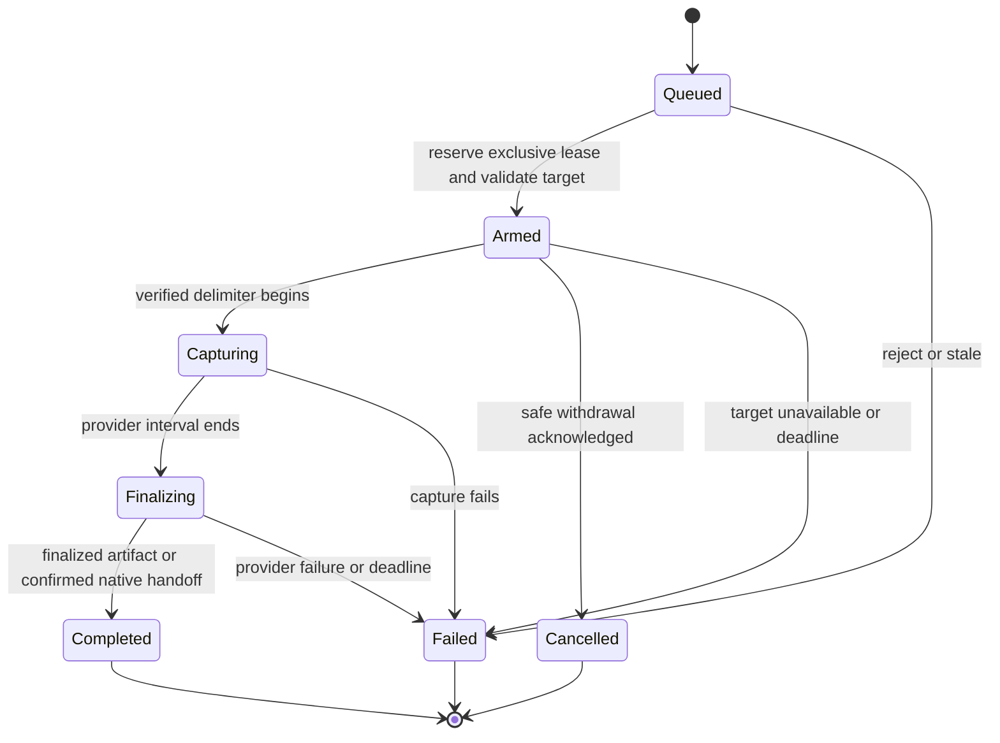

# External Capture Semantics

**Status:** target architecture; normative capture protocol, pending discovery validation

**Scope:** launch intent, capability, request identity, frame boundaries, exclusivity, result truth, and failure settlement for external tools.

**Authority boundary:** this page owns protocol rules; [Execution Architecture](ExecutionArchitecture.md) owns placement; [User Experience](UserExperience.md) owns interaction; [dossier acceptance](README.md#acceptance-and-check-contract) owns proof.

**Current readiness:** **0/100 — target only**; no external capture provider is implemented in the audited baseline.

## Launch And Capability Rules

| Rule | Accepted meaning | Smallest falsifier |
| --- | --- | --- |
| `EC-S01` Intent | One immutable bounded provider set from Launcher or `-AttachPix`, `-AttachNSight`, `-AttachRenderDoc`; identities remain `pix`, `nsight-graphics`, `renderdoc`. Native combinations require tuple proof; repeated identical or unknown attachment flags reject. The unavailable-control projection does not inject any combination. No live CVar adds injection. | Duplicate/unknown ID and equivalent GUI/CLI request comparison. |
| `EC-S02` Readiness | `Requested`, `Compiled`, `Installed`, `Attached`, `TargetSupported`, and `Ready` are distinct facts. Ready requires successful activity/API and production-target eligibility. Marker DLL, filename, launch flag, and connected UI are insufficient. | Install only event runtime; detach UI; request unavailable SDK/backend. |
| `EC-S03` Combinations | Compatibility includes process hooks, Streamline/interposer, driver/API features, validation, and activity. Untested combinations are rejected before injection; no hidden priority selects a winner. Passive unsafe attachments disable Sparkle capture and require clean relaunch. | Request every pair and triple against empty matrix. |
| `EC-S04` Activity | `pix` means GPU frame capture; `nsight-graphics` means Graphics Capture; `renderdoc` means frame debugging. Timing, GPU Trace, Systems, crash, memory, and shader analysis are distinct activities. | Request GPU Trace through the frame-capture ID; must reject rather than reinterpret. |

No-provider launch performs no capture-library search/load, capture storage allocation, polling, or artifact write. Passive detection is a bounded loaded-module/activity probe in eligible builds, never a disk scan or injection. Shipping omits these probes and parsers entirely.

## Request And Target Identity

`EC-S05`: a request carries a nonzero process-local monotonic request ID, provider, scene-view token/generation, and intent to capture its next eligible frame. The click is not an expected exact future `FrameId`. Renderer resolves the scene view to its containing present surface and generation, checks that the requested scene contributes to that frame, and records the actual delimiter interval. Native handles never enter the Editor model.

The result distinguishes request time, armed time, first/last observed delimiter, actual contributing scene `FrameId` or interval, and identity certainty (`Confirmed`, `IntervalOnly`, `Unavailable`). A host Present interval can contain pipelined frames and other windows' work. Success must never pretend that a host window is an exclusive scene capture. A reused pointer/window or changed generation rejects the stale request.

`EC-S06`: every provider's delimiter contract is explicit. PIX's Present window, RenderDoc's device/window pair or explicitly bracketed interval, and Nsight's verified Present/procedural delimiter are lowered privately. If the installed provider cannot distinguish the requested present surface, expose an honest whole-process interval only when the selected scene's contribution is confirmed and the UX declares the limit; otherwise `TargetUnsupported`. Never choose whichever window presents first.

## State, Cancellation, And Exclusivity

Provider capability and request execution are separate. A provider can be Ready while its latest request is Completed. `Busy` is a rejection of a new request, not a replacement for another provider's capability.

Native capture attachment and native GUI attachment are separate observations; `PIXIsAttachedForGpuCapture` cannot be the sole readiness predicate for direct programmatic capture. The installed-version probe produced a natively opened capture while that GUI-attachment query was false. An enabled, verified native activity is required for Ready: a disabled official wrapper returning success is not attachment or execution evidence. Shell-launch success is not confirmed native artifact handoff. [Stage 0](Discovery.md#stage-0-decision-record--2026-10-07) records the inspected API traps and unresolved completion/drain protocol; no provider may substitute these observations for finalized native proof.

`EC-S07`: initially one process-wide exclusive capture lease, spanning queued acceptance through native quiescence. Requests never queue behind another capture; they reject Busy. External tool hotkeys are outside Sparkle's arbiter, so the adapter also probes native busy state and observes externally initiated captures where supported. Unsupported native-busy detection means reduced capability, not permission to overlap.

`EC-S08`: each accepted request publishes exactly one terminal result. Capability may remain temporarily `Unavailable(Draining)` after that result until native work is known quiescent. A timeout settles Sparkle UI truth; it does not prove native cancellation. If safe withdrawal cannot be proved, keep the lease quarantined and require relaunch. Late callbacks can update quiescence privately but cannot replace a terminal result or bind to a newer request.

`EC-S09`: cancel before native submission if withdrawal is safe. Once a provider owns the interval, expose `CannotCancel` unless the pinned API acknowledges cancellation. Target loss, minimize/resize, device loss, shutdown, and path failure settle by the same owner. Do not unload injected hooks while live devices/callbacks can still use them. Shutdown stops requests, detaches publication, resolves or quarantines native work, retires devices, then releases owned bootstrap resources in the verified order.

## Admission And Coherent Observation

`EC-S13`: transport admission is bounded and never waits for queue capacity on the UI/application producer. It distinguishes submitted, full (`CapacityExceeded`) and closing (`ShuttingDown`); capture Busy remains a distinct exclusive-operation rejection. Submission is not native arming or capture completion. The one Renderer admission authority assigns identity once and settles any reservation/accounting on rejection; it does not create a backlog or a second client-side state machine. Accepted work preserves the existing control/frame ordering, and serial mode exposes equivalent outcomes. Discovery D09 freezes the exact admission/sequence/ownership protocol before code; no fallback to WaitPush, synchronous completion wait, retry spin or second mailbox is permitted for capture.

`EC-S14`: the Editor acquires related viewport products and presentation texture from one immutable publication. Product generation, publication identity and native surface generation are different lifetimes; one must not be substituted for another. Capture status may join that projection only at the same owner/cadence with bounded data. Unrelated shader/task/memory state is not forced into it. Delayed publication and stale target controls must not join one epoch's products to another epoch's texture or native binding.

## Publication And Artifact Truth

`EC-S10`: transport submission, controller acceptance/Queued and native Armed are distinct observations; none means Completed. A created or growing file, accepted SDK call, ended frame, icon animation, or active tool UI does not prove finalization. Publish Completed only with the provider's verified finalization signal and accessible finalized path, or a confirmed native-UI handoff whose path is explicitly unavailable. PIX Stage 0 must prove that latter signal rather than infer it from `PIXGpuCaptureNextFrames`.

`EC-S11`: native artifacts retain native formats. Sparkle stores one bounded correlation sidecar on explicit capture intent: revision/dirty fingerprint, product/configuration, API/GPU/driver/OS, tool and SDK/header hashes, provider activity, attachment source, target/generation, request/delimiter/frame identity certainty, stable pass markers, shader/cook/content identity, observer/validation/interposer settings, completion/error, path/hash when finalized. Capture files are not copied into live history or treated as benchmark runs. Use existing typed user-state capture roots; tool-managed remote paths remain declared in their filesystem namespace.

`EC-S12`: markers preserve semantic pass names, queue/recording boundaries, and frame correlation without adding timestamp queries or serial recording. Duration pairs remain inside one command recording lifetime. External API versions and candidate hashes are provenance; do not introduce a Sparkle marker-schema version, migration reader, alias, or dual vocabulary. Disposable evidence is regenerated under the current representation.

## Bounds And Nonfunctional Contract

Units are elapsed monotonic seconds for arm/finalization deadlines, bytes for storage, UTF-8 bytes or native path elements according to the consuming API, and request/frame/generation integers for identity. Zero request ID is invalid. Missing identity/path is explicit absence, never zero/empty success.

The initial closed set contains exactly three providers, one active request, and one latest terminal result per provider; there is no request backlog or unbounded history. Startup/artifact paths may allocate off the hot path; no per-frame string construction, directory enumeration, or capture polling when inactive. Status publication is coalesced through the existing read-state cadence. Exact record/path caps, deadlines, and idle observer thresholds are frozen by `EC-D04` before the affected production stage; overflow rejects with `CapacityExceeded` and never truncates a path into another valid target.

No new global GPU flush or worker serialization is accepted merely to help a capturer. A required provider-specific observer change is an explicit nonrepresentative mode, separately proven. GPU replay timings, trace counters, and normal workload timings retain their separate measurement meanings.

## Rule-To-Implementation Handoff

Stage handoff maps each changed `EC-S*` rule to the actual owner/function, acceptance/check ID from the dossier, and retained artifact. Missing mapping blocks that stage. Research sources inform the rule; actual captured production markers, provider signals, controlled faults, and package audits verify it.
