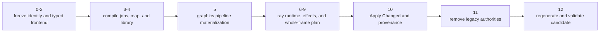

# Shader System Delivery Plan

**Status:** implementation plan; includes the migration ledger but is not architecture authority or proof of completion

**Responsibility:** own the ordered cross-module shader, graphics-pipeline, and ray-tracing migration and its clean-break validation sequence

**Architecture authority:** [Shader System Architecture](README.md)

**Feature acceptance:** [Shader System — Acceptance](Acceptance.md)

**Migration provenance:** [Shader System Migration Baseline](MigrationBaseline.md)

**Related current readiness:** **50/100.** The compile/cook/map/library/runtime route is integrated in source; compiler/backend/ABI, failure, reload, package, and adoption evidence remains open. This plan adds no credit. See [Current Feature Readiness](../../../Acceptance/CurrentReadiness.md#foundation-world-content-shaders-and-tools).

**Current-source reconciliation - 2026-10-06:** the Phase 5 draw-preparation trace now ends at `GBufferMeshPass::PreparedDraw`. Frame-graph preparation and recording share the same move-only collaborator; the separate batch-drawer shell has been removed. This reconciles source names and ownership, without changing phase verdicts or advancing Phase 12 graphics evidence. The frozen [Migration Baseline](MigrationBaseline.md) retains its historical names.

**2026-10-10 remaining-work reconciliation:** source inspection at `ec3d59be9b3089652467d857524a2f2e439275b0` confirms semantic shader directories, virtual source identities, the canonical acceleration-structure binding, and removal of the named shadow/package duplicates. Those completed changes are not instructions to repeat. Retained phase numbers identify their contracts and evidence dependencies; source-present work is revalidated only for drift or a demonstrable discrepancy. Existing Phase 2/7/8 checkpoint evidence remains bounded; Phase 12 executable closure is still open.

## Reference Use For Remaining Evidence

[Pinned source and authored-work cards](../../../Strategy/Research/RenderingReferenceExamples.md) provide study locations for the remaining ABI, native-execution, provenance and adoption obligations. `NVR-01/06/13` motivate tracing one host parameter/binding through the actual pipeline, acceleration structure, recording, execution and retirement; `NVR-18/19` motivate matching optimized executed bytecode to source before attributing a shader limiter. Keep GPU Trace and frame capture as distinct activities.

Record the exact selected source/file/assumption, current consumer, rights and falsifier in the existing phase control record. Retain compiler/version/options, source closure, cooked blob/hash, reflection/layout and native pipeline identity; a missing source correlation remains explicit. This does not authorize another compiler/RHI wrapper, replay completed migration work, change Shipping symbol policy or turn shader cooking into compiler-backend expertise. Any actual product repair still follows the existing phase/admission and boundary contracts.

## Delivery At A Glance



| Invariant | Meaning |
| --- | --- |
| ordered clean break | no phase leaves two authoring, lookup, cook, runtime, pipeline, graph, or effect-selection authorities |
| phases 0-11 are source/static checkpoints | they do not claim build, cook, runtime, backend, capture, or performance success |
| phase 12 is the executable closure | regeneration and focused-to-broad validation happen only after the legacy floor is clean |
| architecture and acceptance remain external owners | this long file owns sequence and migration bookkeeping, not system meaning or a pass verdict |

## Purpose And Authority

This document owns the ordered shader, graphics-pipeline, and ray-tracing migration phases, their clean-break boundaries, review gates, and final validation sequence. It does not redefine the enduring architecture or turn a source-consistency checkpoint into executable evidence.

## Implementation Contract

The unified shader and ray-tracing migration is an ordered clean break, not a menu. Each phase is one manually reviewed changelist-sized checkpoint on `master`; none may leave two authoring, parameter, lookup, cook, runtime, capability, pipeline, table, graph, or effect-selection authorities active together. A difficult consumer blocks its owning phase rather than justifying an alias, adapter, wrapper, disabled placeholder, or cleanup ticket.

### Common phase delivery contract

Every implementation prompt and every phase-exit-criteria list below inherits this contract. Phase-specific references are additive; they never replace the repository process or review authorities.

Mandatory references for every phase:

- [Documentation authority](../../../README.md)
- [Change Integration](../../../Engineering/Workflow/ChangeIntegration.md)
- [Change Lifecycle](../../../Engineering/Workflow/ChangeLifecycle.md)
- [SparkleEngine Code Review](../../../Engineering/Workflow/CodeReview.md)
- [Coding Style](../../../Engineering/Foundations/CodeStyle.md)
- [Repository Structure and Ownership](../../../Engineering/Foundations/ModuleOwnership.md)
- [Data-Oriented Design](../../../Engineering/Foundations/DataAndMemory.md)
- [Naming and Vocabulary](../../../Engineering/Foundations/Naming.md)
- [Renderer Engineering](../../../Engineering/Modules/Renderer.md) and [RHI Engineering](../../../Engineering/Modules/RHI.md)
- [Validation, Performance, and Evidence](../../../Engineering/Verification/ValidationAndEvidence.md)
- [Renderer/RHI boundary](../../Decisions/RendererRhiBoundary.md)
- [Whole Repository Architecture Map](../../WholeRepositoryMap.md)
- [Ray-tracing target architecture](../../Modules/Engine/Renderer/Features/RayTracing/ExecutionArchitecture.md)
- [External Renderer Repository Comparison](../../Modules/Engine/Renderer/RendererRepositoriesResearch.md)

Before editing, the implementer must record the phase outcome, current authority being replaced or extended, mutable and lifetime owners, producer-to-product-to-consumer route, build/generated-artifact membership, copy and complexity budget, performance classification, selected standards/workload gates, exact rejected-name search set, semantic-equivalent search set, and unrelated dirty-path exclusions. The inventory must walk definitions to all uses and representative uses back to their owner; a name-only list is insufficient.

During implementation, complete the real production route before calling the target present. Update every owned producer, consumer, constructor, reset/reload/retirement path, include, filename, build entry, generated schema/artifact, diagnostic, tool/frontend model, and current document in the phase that replaces the contract. Inspect the scoped diff after each coherent batch. Any old-to-new converter, legacy overload, alias, fallback reader, dual writer, feature flag, parallel registry/cache/generation, copied schema, forwarding facade, or renamed equivalent is a failed clean break, not a temporary convenience.

Every phase closes with one evidence table mapping each AC to its cheapest claim-falsifying check, exact command or inspection route, result, and any unavailable evidence. Acceptance requires all of the following:

- prove the target is reachable through the intended production owner and is consumed by the real downstream path; a new definition, isolated fixture, dead registration, or test-only route does not count;
- prove the replaced path cannot still produce, load, publish, select, execute, or present a result, using exact rejected-name searches plus semantic searches for equivalent fields, adapters, aliases, fallbacks, duplicated layouts, alternate generated formats, parallel directories, and stale build/tool/document consumers;
- classify every touched site as authority, composition, producer, consumer, or duplicate, and leave one mutable authority, one lifetime/generation authority, and one production path for each responsibility;
- account for every permanent type, wrapper, field, log, diagnostic, setting, and file added; delete temporary instrumentation, fault injection, local harnesses, reports, and unauthorized test scaffolding before handoff;
- run pinned no-write formatting where applicable, `git diff --check`, local-link and file/include/CMake inventory checks, and `architecture_boundary_check` whenever the Renderer/RHI boundary changes;
- apply the [Code Review](../../../Engineering/Workflow/CodeReview.md) procedure to the final scoped diff. A phase is `PASS` only when it has no P0-P2 finding and all evidence authorized for that phase is present; otherwise report `BLOCKED` and do not describe the phase as complete.

Phases 0-11 must not claim compile, runtime, backend, capture, or performance success. Phase 12 must include negative and corruption cases that would fail if the new authority, validation, lifetime, or selection route were bypassed; a happy-path launch alone is not proof.

### Common rules for every phase

- Work directly in the unstaged `master` worktree. Do not create or switch branches and do not stage, commit, push, or submit. The user owns every source-control action.
- Apply the [common phase delivery contract](#common-phase-delivery-contract), [Change Integration](../../../Engineering/Workflow/ChangeIntegration.md), [Change Lifecycle](../../../Engineering/Workflow/ChangeLifecycle.md), and applicable Engineering guidance. This document controls shader-specific vocabulary and ordering.
- Phase 0 is documentation-only. Phases 1 through 11 use static/source-consistency checks and do not configure, build, compile shaders, cook, launch, run tests, capture, or collect performance evidence. They update existing validation consumers and record exact deferred oracles without executing them. Phase 12 performs the single final regeneration and all focused-to-broad executable validation for the complete candidate.
- Preserve one `SparkleTasks` runtime, one out-of-process cooker, one transactional publication route, one active renderer shader generation, and all-queue `RhiSubmissionToken` retirement.
- Preserve `PassCommandContext` as command/declared-resource/diagnostic infrastructure only. Pass recording performs no file I/O, compilation, shader-map/library lookup, layout creation, pipeline creation, or hidden resource discovery.
- Do not add permutations, `ShouldPrecachePermutation`, pipeline precaching/prewarming, preload/readiness/streaming controls, native driver caches, or a universal authored shader-program layer. Full RT execution is delivered only through the focused composition, RHI, backend, graph, scene, and effect owners frozen here.
- Do not encode classic/partitioned or descriptor/device-address selection in shader class names, HLSL root filenames, authored defines, effect uniforms, or graph call-site mode parameters. One semantic AS parameter is lowered by private RHI.
- Treat every consumed render product as mandatory unless the owning architecture names a real alternate algorithm. Never add a clear/copy/no-op/dummy pass merely to satisfy graph production or make missing work look successful. Shadow visibility selects exactly one real inline-query or pipeline producer before graph construction and fails when neither is available; frame orchestration does not duplicate shader/runtime/RHI mechanism checks.
- Do not add one-field carriers, broad context/service/resource bags, a second catalog/map/runtime-generation owner, permanent migration diagnostics, per-job logging, a compiler-result browser, report generators, feature flags, compatibility formats, or submitted test scaffolding.
- Update definitions, consumers, filenames, includes, CMake/source groups, CLI/help/autocomplete, editor models, diagnostics, and current documentation in the phase that owns their replacement. Record obsolete disposable generated/cooked outputs immediately; Phase 12 is the sole phase that deletes and regenerates them after the source floor is clean.
- Preserve unrelated dirty work. Phase 0 records the path-level exclusion list and every later phase rechecks it.

### Frozen base vocabulary and navigation

| Responsibility | Target vocabulary | Canonical owner |
| --- | --- | --- |
| virtual source identity | `ShaderSourceMountTable` and canonical `/Engine`, `/Project`, `/Plugin/<Name>` paths | ShaderCompiler source/dependency capability |
| shader authoring type | `GlobalShader<Shader>` with nested `Parameters` | generic primitive in RHI public; concrete class in semantic Renderer pass/feature ownership |
| implementation registration | `IMPLEMENT_GLOBAL_SHADER(Class, VirtualSource, Entry, Stage)` | concrete shader implementation |
| immutable metadata | `ShaderTypeDesc`, `ShaderTypeId`, `GlobalShaderCatalog` | catalog built from concrete Renderer declarations and frozen before query |
| compile work | `ShaderCompileRequest`, `ShaderCompileJob`, `ShaderCompileInputHash`, `ShaderCompileResult` | ShaderCompiler compilation capability |
| cooked logical lookup | `GlobalShaderMap` | generated by ShaderCompiler; opened read-only by Renderer runtime generation |
| cooked code | `ShaderCodeRecord`, `ShaderCodeHash`, `CookedShaderLibrary` | generated cook output; neutral validation records in RHI public |
| typed runtime lookup | `ShaderRef<Shader>` | Renderer resolves through the active `GlobalShaderMap` |
| graph use | `AllocParameters<Shader>`, `Dispatch<Shader>`, typed graphics draw helpers, `TraceRays`, `RenderPassLabel` override | `FrameGraphBuilder` focused helpers over existing graph/runtime owners |
| pass-wide raster intent | `RasterPassRenderState` with granular blend/depth-stencil and dynamic stencil-reference operations | semantic mesh-pass/feature setup; never a complete pipeline or attachment description |
| graphics attachment compatibility | derived immutable attachment signature | frame graph derives it from attachment bindings and resource descriptions |
| prepared graphics work | vertex-input identity, topology, material fill/cull, streams, and draw arguments | focused mesh/material draw collaborator |
| materialized graphics pipeline identity | `GraphicsPipelineKey` -> complete internal `GraphicsPipelineDesc` | existing Renderer runtime generation assembles/retains; RHI lowers to paired backend objects |
| shader-visible scene AS | one acceleration-structure field such as `SceneTlas` and one `FrameGraphAccelerationStructureHandle` value | concrete dispatch shader declares semantics; frame graph declares access; private RHI selects classic/partitioned native descriptor representation |
| RT stage composition | `RayTracingPipelineComposition` with typed shader refs, hit groups, ray-generation-derived shared ABI, and optional bounded local data | Renderer semantic effect/shader owner; never used for one-shader compute or ordinary graphics |
| RT logical table mapping | `RayTracingShaderTablePlan` and the documented instance/geometry/ray-type formula | Renderer scene/effect owner |
| neutral/native RT mechanism | opaque `RayTracingPipeline`, `RayTracingShaderTable`, and `TraceRaysDesc` | RHI public contract and D3D12/Vulkan private implementations |
| materialized layout/pipeline/table and generation | existing `RenderPassRuntimeCache` | Renderer `Private/Pipeline`; one active/replacement/retired generation for maps, pipelines, and tables |
| frontend intent | `Apply Changed` and expert `Rebuild All` | Application routing and Editor Shader Tools presentation |

Do not introduce `ShaderProgramDesc`, `ShaderProgramId`, `TShaderProgram`, `TRayTracingProgram`, `SPARKLE_RENDER_PASS`, `ShaderSystem`, `ShaderManager`, `ShaderServices`, `ShaderContext`, `ShaderData2`, `NewShader*`, or Unreal `F*`/`T*` prefixes in new target names. Do not keep `PackageId` as a shader identity synonym. `RayTracingPipelineComposition` is the only scoped multi-stage composition and must never become a generic shader/pass registry.

### Consolidation map from the former RT delivery plan

No former RT task is deferred back to the target-state document:

| Former RT delivery slice | Unified owner | Why this placement is coherent |
| --- | --- | --- |
| freeze RT contract/current baseline | Phase 0 | one inventory and provenance authority covers shader, inline query, compiler-only metadata, RHI/backend absence, effects, and final blocked claims |
| graphics-state ownership and materialization | Phase 5 | final map-backed shader references, graph attachments, mesh/material facts, and pass state replace the caller aggregate before RT adds another pipeline kind |
| complete RT-library compiler toolchain | Phase 6 | implementing it against the Phase 4-deleted package schema would be throwaway work; final map/library records land with their first runtime consumer |
| backend-neutral RT contract | Phase 6 | a public contract with no paired backend/graph consumer would be a disabled placeholder |
| D3D12/Vulkan native pipelines and tables | Phase 6 | both backends, neutral arithmetic, and all-stage sentinels form one honest capability gate |
| frame graph/runtime cache/lifetime | Phase 6 | native execution cannot bypass graph/resource/generation ownership even temporarily |
| opaque GBuffer parity | Phase 7 | first product effect builds directly on the complete foundation while preserving the explicit raster algorithm |
| alpha hit semantics, shadow ray type, scene indexing | Phase 8 | adds one meaningful production slice and one nontrivial shared scene-to-SBT mapping |
| intersection and callable proof | Phase 6 | focused existing validation or a removed-before-handoff local harness proves legal stage support with the native foundation; product effects do not receive fake empty stages and no test-only fixture is submitted |
| eligible effects and whole-frame switch | Phase 9 | selection expands only after two accepted dual-mode effects and production indexing exist |
| Shader Tools/provenance | Phase 10 | the frontend describes the final map/pipeline/table/effect owners rather than an intermediate package/runtime model |
| legacy/compatibility eradication | Phase 11 | the final semantic floor runs after all source owners exist and before artifacts/evidence are regenerated |
| failure, capture, performance, release evidence | Phase 12 | one final candidate is regenerated and measured after every shader, graphics-state, and RT legacy path is gone |

### Phase 0 - Freeze the lean shader/map/graphics-pipeline contract and inventory

#### Implementation prompt

> Implement Phase 0 as one documentation and inventory CL directly in the unstaged `master` worktree. Apply the [common phase delivery contract](#common-phase-delivery-contract), including its pre-edit ledger, semantic-equivalent search, and mandatory Code Review `PASS`/`BLOCKED` gate. Re-run exact shader class/parameter, pass-wrapper, package, source/include, registration, compile/cache/cook, publication, runtime-generation, graph-dispatch/draw/trace, graphics-state/attachment/mesh/pipeline, editor, build-membership, generated-artifact, diagnostic, and documentation searches. Freeze the owner map and assign every old field/type/file/consumer to one later phase. Reconcile stale documentation and baseline provenance. Do not edit runtime/tool source or run executable checks.

#### Phase-specific references

- [Documentation authority](../../../README.md)
- [Change Integration clean-break policy](../../../Engineering/Workflow/ChangeIntegration.md#current-clean-break-policy)
- [Coding Style one-field types](../../../Engineering/Foundations/CodeStyle.md#one-field-types)
- [Renderer/RHI boundary](../../Decisions/RendererRhiBoundary.md)
- [Ray-tracing target architecture](../../Modules/Engine/Renderer/Features/RayTracing/ExecutionArchitecture.md)
- [Epic RDG shader/pass parameters](https://dev.epicgames.com/documentation/en-us/unreal-engine/render-dependency-graph-in-unreal-engine)
- [Epic Mesh Drawing Pipeline](https://dev.epicgames.com/documentation/en-us/unreal-engine/mesh-drawing-pipeline-in-unreal-engine)
- [Epic graphics pipeline-state initializer](https://dev.epicgames.com/documentation/en-us/unreal-engine/API/Runtime/RHI/FGraphicsPipelineStateInitialize-)

#### Required work

- Inventory every shader class, nested `FParameters`, duplicate `*PassParameters` field, pass class, `RenderPassDefinition`, `GetDefinition`, `GetParameterMetadata`, Execute body, graph dispatch/draw consumer, and focused collaborator dependency.
- Inventory every shader resource/attachment parameter kind and every `FrameGraphBuilder::Read`, `CreateSRV`, `CreateUAV`, `CreateRenderTarget`, and `CreateDepthTarget` definition and call site. Classify each as a shader view, acceleration-structure binding, raster attachment, copy/resolve operation, or deletion; do not preserve two author-facing spellings for the same view.
- Classify each pass as direct one-shader compute, multi-stage graphics, shaderless graph work, or real feature collaborator. Assign the two rejected shadow variants and their wrappers to Phase 1 deletion, the remaining forwarding wrappers to Phase 2 deletion, and justify every retained class with behavior it owns.
- Inventory every field and consumer of the graphics pipeline state, raster runtime variants, RHI pipeline description, attachment signature/actions, vertex-input/topology, mesh/material policy, dynamic command state, and backend defaults. Assign the caller aggregate/eager variants/duplicate target and topology paths to Phase 5 deletion and freeze the granular target owner map.
- Inventory package identity/generation/cache/readers/writers. Assign the two rejected shadow package identities to Phase 1 deletion and the remaining package system to Phase 4 deletion.
- Inventory every inline-ray-query effect, RT shader/stage declaration, compiler capability, cooked RT export/hit-group/local-record field, deliberate runtime rejection, RHI capability field, AS/TLAS contribution, native pipeline/SBT/trace absence, frame-graph/runtime-cache seam, automatically resolved active frontend, explicit supported alternate, mandatory-product failure, and existing test/evidence consumer. Assign compiler-only RT package scaffolding to Phase 4 deletion and the complete target RT slice to Phases 6-10.
- Inventory the direct-shadow descriptor/device-address/no-query split end to end: shader classes and HLSL roots, parameters and uniforms, feature flags, graph handles and selection, capability-report fields, provider selection, Vulkan classic/partitioned descriptor layout and writes, and mutable-descriptor bootstrap/layout scaffolding. Assign the clean break to Phase 1; preserve GPU addresses only in backend AS construction and exact native descriptor writes.
- Freeze `RayTracingGBuffer` as the first parity effect; define the effect-level portability boundary, shared scene/TLAS/material/output authority, payload/attribute/miss/ray-flag contract, requested-versus-active mode semantics, explicit raster alternative, and the instance/geometry/ray-type SBT formula. Do not treat an arbitrary compute entry point as interchangeable with an RT stage.
- Record the exact current counts for registrations, handwritten labels/package constants, duplicate parameter fields, wrapper files, HLSL files under `Passes/Deferred`, generated `.sparkshader` artifacts, graphics-state/runtime/key/attachment fields, topology setters, and typed graphics graph calls.
- Record exact baseline provenance or mark final runtime/performance claims blocked. Record unrelated dirty exclusions.

#### Positive guardrails

- Use `rg`/`rg --files` and bounded owner/consumer reads.
- Keep inventory in this document or CL description, not a runtime reporting system.
- Every rejected definition/path has exactly one deletion phase.

#### Negative guardrails

- No runtime edits, target scaffolding, renames, adapters, branches, builds, cooks, or tests.
- No permutation or precache design hidden in the inventory.

#### Phase exit criteria

- Every current shader/pass/package field and material consumer has one target owner or deletion.
- Every graphics-state field and consumer has one target authority or Phase 5 deletion; attachment, mesh/material, pass-state, dynamic-command, complete-key/descriptor, and backend responsibilities do not overlap.
- Every forwarding pass and duplicate parameter schema has one disposition: the device-address/no-query shadow roots are Phase 1 deletions and the remaining forwarding surfaces are Phase 2 deletions.
- Every package reader/writer/cache/identity/generation spelling has one disposition: the two rejected shadow identities are Phase 1 deletions and the remaining package system is Phase 4 deletion/replacement.
- Every current RT schema/capability/rejection/effect/scene/graph/runtime/evidence item has one target owner or deletion phase, and no RT task remains owned by the target-state document.
- Missing revision-pinned inline D3D12/Vulkan parity, valid-library rejection, native-feature absence, capture, and performance baselines are explicitly blocked for Phase 12 rather than implied.
- The frozen eradication floor includes exact spellings and semantic equivalents for aliases, adapters, conversion helpers, fallbacks, copied schemas, parallel registries/generations, generated formats, directories, and build/tool/frontend/document consumers; every match has exactly one later deletion phase and no item is assigned to generic cleanup.
- The common phase evidence table and documentation-only Code Review gate report `PASS`; any unowned value, unresolved standards conflict, missing exclusion, or P0-P2 finding makes Phase 0 `BLOCKED`.
- Local links, scoped documentation diff, and `git diff --check` pass; no executable claim is made.

#### CL boundary

Suggested title: `Shaders: freeze lean shader and pipeline migration contract`.

### Phase 1 - Establish virtual sources, semantic navigation, and one AS binding

#### Implementation prompt

> Reconcile only an identified remaining Phase 1 source-contract discrepancy. The semantic source layout, virtual identities, canonical AS binding and named duplicate-shadow deletion are already source-present. Apply the common phase contract to any justified delta, keep one existing authority, and retain precise unresolved oracles for Phase 12. Do not recreate delivered code or move the deleted Deferred directory again; source inspection does not close native/backend acceptance.

#### Phase-specific references

- [Repository Structure and Ownership](../../../Engineering/Foundations/ModuleOwnership.md)
- [Data-Oriented Design identity rules](../../../Engineering/Foundations/DataAndMemory.md#identity-and-references)
- [Epic shader source-path precedent](https://dev.epicgames.com/documentation/en-us/unreal-engine/API/Runtime/RenderCore/GetShaderSourceFilePath)
- [Microsoft DXR acceleration-structure resource binding](https://microsoft.github.io/DirectX-Specs/d3d/Raytracing.html)
- [NVIDIA NVRHI acceleration-structure binding model at `8e8c36e`](https://github.com/NVIDIA-RTX/NVRHI/blob/8e8c36e37558acec333204619b95d9d2fcdc4a79/doc/ProgrammingGuide.md)
- [Khronos partitioned-AS descriptor type](https://docs.vulkan.org/refpages/latest/refpages/source/VK_NV_partitioned_acceleration_structure.html)

#### Required work

- Revalidate the existing `ShaderSourceMountTable` only if changed inputs invalidate its canonicalization, mount/collision/traversal/case or late-registration contract; implementation is already present.
- Verify portable virtual dependency/hash/diagnostic identity at the real registration -> compiler -> cooked-output boundary; correct only observed discrepancies in the existing route.
- Remove project-first shadowing, absolute authored includes, basename identity/fallback, and checkout paths from portable hashes/diagnostics.
- The named `DirectShadowSignalDeviceAddressCS` and `DirectShadowSignalNoRayQueryCS` variants are absent from current Engine/Tools source. Keep them absent and check semantic equivalents on a changed candidate; do not schedule their deletion again.
- Keep one `DirectShadowSignalCS`, one root HLSL entry, and one semantic `SceneTlas` acceleration-structure parameter. Bind it through `CreateAccelerationStructureBinding(sceneTlas)`, not generic `Read` or `CreateSRV`. Remove shader/effect uniform GPU-address words, raw-address conversion helpers, `RayTracingSceneTlasShaderAccessMode`, `DeviceAddressRayQuery`, `UsesAccelerationStructureDeviceAddress`, Renderer capability-report `SupportsShaderDeviceAddress`, `SupportsShaderDeviceAddressAccess`, and equivalent frontend access-mode policy. Preserve GPU addresses only inside RHI/AS build and native descriptor-writing mechanisms that genuinely require them.
- Make classic and partitioned TLAS publish the same semantic graph AS binding. Private RHI resolves the selected provider to its exact native descriptor representation; Vulkan uses `VK_DESCRIPTOR_TYPE_ACCELERATION_STRUCTURE_KHR` or `VK_DESCRIPTOR_TYPE_PARTITIONED_ACCELERATION_STRUCTURE_NV` and the matching write structure. Provider selection is fixed before layout/pipeline materialization. Delete the current otherwise-unconsumed `VK_EXT_mutable_descriptor_type` feature/bootstrap/layout scaffold; do not require an authored define, alternate bytecode record, mutable descriptor, or effect uniform address.
- Keep PTLAS unavailable unless its complete descriptor capability, layout, write, resource resolution, and ray-query chain is valid. Phase 1 removes the dead address variant without claiming PTLAS runtime proof; Phase 6 owns complete source delivery and Phase 12 owns paired executable backend validation before the provider can be accepted.
- Delete the unconsumed no-query shader without replacement. Shadow visibility remains a mandatory product of real traversal: retain the inline-query producer, reject unavailable capability before graph construction, and delete `AddShadowVisibilityFallbackPass`, `ShadowVisibilityFallback`, `CVarRayTracedShadowsEnabled`, `r.RayTracedShadows.Enabled`, `EnableInlineRayQueryShadows`, and any semantic-equivalent clear/copy/no-op pass, default resource, enable flag, or mode boolean that would publish fabricated visibility. Do not dispatch a shader whose only distinction is compiling traversal out. Phase 8 owns the first valid alternate producer by adding the complete pipeline/RGS path and selecting exactly one real frontend.
- The broad `Engine/Assets/Shaders/Passes/Deferred` directory is already removed; current sources live under semantic owners. Revalidate include/registration/CMake membership only for a changed candidate, not another physical migration.
- Convert the existing shared inline-ray-query sources and every GBuffer/shadow/path/ReSTIR include consumer to the same virtual namespace without duplicating them under an RT-pipeline tree. Reserve semantic sibling filenames for later inline/pipeline frontends, but do not pre-create those files.
- Update every C++ registration, HLSL include, ShaderCompiler resolver/hash/dependency consumer, CMake/source group, documentation link, and generated metadata spelling.

#### Positive guardrails

- One virtual path names one source regardless of machine.
- Relative includes remain relative to the including virtual source.
- Technique names remain only where a shader specifically implements that technique.
- One shader/effect parameter describes scene-AS access; backend/provider differences stop at private RHI binding.

#### Negative guardrails

- No old/new search order, alias mount, absolute fallback, duplicate source tree, raw directory registry, or renderer-wide `Deferred` owner.
- No `*DeviceAddressShader`, `*DescriptorShader`, no-query shader, authored AS-access define, raw TLAS address in an effect uniform, access-mode branch at graph setup, or hidden backend pseudo-permutation.
- No clear/copy/no-op shadow producer, feature-disable branch, nullable shadow product, or graph-call-site mode boolean that permits direct lighting to consume fabricated visibility.

#### Phase exit criteria

- Exact searches find zero authored old physical registration paths, zero `Passes/Deferred/` paths/files, zero basename fallback, and zero portable hashes containing checkout roots.
- Exact runtime/build searches find zero `DirectShadowSignalDeviceAddress*`, `DirectShadowSignalNoRayQuery*`, `SPARKLE_RAY_TRACING_SCENE_TLAS_DEVICE_ADDRESS`, `SPARKLE_RAY_TRACED_SHADOWS_DISABLED`, `DeviceAddressRayQuery`, `UsesAccelerationStructureDeviceAddress`, `RayTracingSceneTlasShaderAccessMode`, `SupportsShaderDeviceAddress`, `SupportsShaderDeviceAddressAccess`, `SupportsMutableDescriptorType`, `EnabledMutableDescriptorType`, `VK_EXT_mutable_descriptor_type`, or shader/effect `SceneTlasGpuAddress*` definitions/uses.
- `DirectShadowSignalCS::Parameters::SceneTlas` is the sole shadow traversal AS parameter; classic/partitioned resources reach one graph binding and native representation selection is private to RHI. No second shader class, source, code record, or frontend mode exists.
- Exact graph-setup searches find zero acceleration-structure assignments through `builder.Read`; all use the one typed `CreateAccelerationStructureBinding` route.
- Shadow visibility has one real inline-query producer. Missing inline-query capability rejects graph construction before scheduling; ReSTIR schedules exactly one `DirectShadowSignalCS`, and exact runtime/build searches return zero `AddShadowVisibilityFallbackPass`, `ShadowVisibilityFallback`, `CVarRayTracedShadowsEnabled`, `r.RayTracedShadows.Enabled`, or `EnableInlineRayQueryShadows` uses.
- Same-basename files in distinct virtual directories remain distinct; project/engine ownership cannot silently shadow.
- Static bidirectional traces prove each retained registration resolves through the canonical mount/dependency route and each classic/partitioned scene AS reaches the same graph semantic before private backend lowering; old physical paths, alternate shadow roots, and access-mode policy cannot be selected by any production caller.
- The common phase evidence table and source-only Code Review gate report `PASS` with no P0-P2 finding; no compile, backend, or runtime success is claimed.
- Includes/CMake/source groups/docs reconcile and `git diff --check` passes without compilation claims.

#### CL boundary

Suggested title: `Shaders: unify source identity and acceleration-structure binding`.

### Phase 2 - Make the shader class the complete lean frontend

The implementation instructions for this recorded source slice are retired. Its [historical checkpoint and deferred proof contract](DeliveryEvidence.md#phase-2-source-checkpoint) remain available. Source delivery does not close Phase 12 or feature acceptance.

**Remaining delta:** revalidate this checkpoint only when source/candidate drift affects it; repair a demonstrated discrepancy in its existing owner. Execute its unresolved native/compiler/lifetime/parity/failure/observer/package oracles through [Phase 12](#phase-12---regenerate-validate-and-hand-off-the-complete-shader-graphics-pipeline-and-ray-tracing-candidate), without recreating the delivered frontend, map, pipeline or RT machinery.

### Phase 3 - Establish reproducible compile jobs and changed dependencies

The implementation instructions for this recorded source slice are retired. Its [historical checkpoint and deferred proof contract](DeliveryEvidence.md#phase-3-source-checkpoint) remain available. Source delivery does not close Phase 12 or feature acceptance.

**Remaining delta:** revalidate this checkpoint only when source/candidate drift affects it; repair a demonstrated discrepancy in its existing owner. Execute its unresolved native/compiler/lifetime/parity/failure/observer/package oracles through [Phase 12](#phase-12---regenerate-validate-and-hand-off-the-complete-shader-graphics-pipeline-and-ray-tracing-candidate), without recreating the delivered frontend, map, pipeline or RT machinery.

### Phase 4 - Replace cooked packages with the global shader map

The implementation instructions for this recorded source slice are retired. Its [historical checkpoint and deferred proof contract](DeliveryEvidence.md#phase-4-source-checkpoint) remain available. Source delivery does not close Phase 12 or feature acceptance.

**Remaining delta:** revalidate this checkpoint only when source/candidate drift affects it; repair a demonstrated discrepancy in its existing owner. Execute its unresolved native/compiler/lifetime/parity/failure/observer/package oracles through [Phase 12](#phase-12---regenerate-validate-and-hand-off-the-complete-shader-graphics-pipeline-and-ray-tracing-candidate), without recreating the delivered frontend, map, pipeline or RT machinery.

### Phase 5 - Split raster intent, attachment compatibility, and graphics pipeline materialization

The implementation instructions for this recorded source slice are retired. Its [historical checkpoint and deferred proof contract](DeliveryEvidence.md#phase-5-source-checkpoint) remain available. Source delivery does not close Phase 12 or feature acceptance.

**Remaining delta:** revalidate this checkpoint only when source/candidate drift affects it; repair a demonstrated discrepancy in its existing owner. Execute its unresolved native/compiler/lifetime/parity/failure/observer/package oracles through [Phase 12](#phase-12---regenerate-validate-and-hand-off-the-complete-shader-graphics-pipeline-and-ray-tracing-candidate), without recreating the delivered frontend, map, pipeline or RT machinery.

### Phase 6 - Deliver the complete paired ray-tracing runtime foundation

The implementation instructions for this recorded source slice are retired. Its [historical checkpoint and deferred proof contract](DeliveryEvidence.md#phase-6-source-checkpoint) remain available. Source delivery does not close Phase 12 or feature acceptance.

**Remaining delta:** revalidate this checkpoint only when source/candidate drift affects it; repair a demonstrated discrepancy in its existing owner. Execute its unresolved native/compiler/lifetime/parity/failure/observer/package oracles through [Phase 12](#phase-12---regenerate-validate-and-hand-off-the-complete-shader-graphics-pipeline-and-ray-tracing-candidate), without recreating the delivered frontend, map, pipeline or RT machinery.

### Phase 7 - Deliver dual-execution ray-traced GBuffer parity

The implementation instructions for this recorded source slice are retired. Its [historical checkpoint and deferred proof contract](DeliveryEvidence.md#phase-7-source-checkpoint) remain available. Source delivery does not close Phase 12 or feature acceptance.

**Remaining delta:** revalidate this checkpoint only when source/candidate drift affects it; repair a demonstrated discrepancy in its existing owner. Execute its unresolved native/compiler/lifetime/parity/failure/observer/package oracles through [Phase 12](#phase-12---regenerate-validate-and-hand-off-the-complete-shader-graphics-pipeline-and-ray-tracing-candidate), without recreating the delivered frontend, map, pipeline or RT machinery.

### Phase 8 - Add production hit semantics, shadow rays, and scene-to-SBT indexing

The implementation instructions for this recorded source slice are retired. Its [historical checkpoint and deferred proof contract](DeliveryEvidence.md#phase-8-source-checkpoint) remain available. Source delivery does not close Phase 12 or feature acceptance.

**Remaining delta:** revalidate this checkpoint only when source/candidate drift affects it; repair a demonstrated discrepancy in its existing owner. Execute its unresolved native/compiler/lifetime/parity/failure/observer/package oracles through [Phase 12](#phase-12---regenerate-validate-and-hand-off-the-complete-shader-graphics-pipeline-and-ray-tracing-candidate), without recreating the delivered frontend, map, pipeline or RT machinery.

### Phase 9 - Migrate eligible effects and deliver one whole-frame execution plan

#### Implementation prompt

> Implement Phase 9 as one whole-frame ray-tracing selection and eligible-effect migration CL directly in the unstaged `master` worktree. Apply the [common phase delivery contract](#common-phase-delivery-contract), including whole-frame selection reachability, strict-mode negative-oracle coverage, and the mandatory source-only Code Review gate. Classify every current ray-query effect, migrate only effects with a coherent pipeline design and accepted parity/quality oracle, resolve one immutable strict/automatic execution plan before graph construction, preserve all temporal and supported-alternate ownership, and delete deep feature-specific API selection. Update the Phase 12 validation route, but do not configure, build, compile shaders, cook, launch, run tests, capture, or collect performance evidence. Do not require a mega-pipeline or force unsuitable effects into pipeline mode.

#### Phase-specific references

- [Ray-tracing target selection semantics](../../Modules/Engine/Renderer/Features/RayTracing/ExecutionArchitecture.md#selection-semantics)
- [Ray-tracing target shared HLSL boundary](../../Modules/Engine/Renderer/Features/RayTracing/ExecutionArchitecture.md#shared-hlsl-boundary)
- [NVIDIA RTX Path Tracing](https://github.com/NVIDIA-RTX/RTXPT)
- [AMD Cauldron ray-tracing capability separation at `b92d559`](https://github.com/GPUOpen-LibrariesAndSDKs/Cauldron/blob/b92d559bd083f44df9f8f42a6ad149c1584ae94c/src/VK/base/ExtRayTracing.cpp)
- [Debug View Presentation Architecture](../../Modules/Engine/Renderer/Features/DebugViews/PresentationArchitecture.md)

#### Required work

- Inventory every selected ray-query GBuffer, direct/indirect/reference/ReSTIR/shadow effect and classify it `Dual`, `InlineOnly`, `PipelineOnly`, or `SupportedAlternate` with owner, reason, shared semantics, output/history contract, readiness, and accepted oracle. `SupportedAlternate` must be a real algorithm with its own contract and evidence; a dummy product is unclassifiable.
- Resolve the engine-wide automatic frontend once from shared capabilities where graph topology needs it. Pipeline is preferred, Inline is the capability fallback, and unavailable schedules no partial ray-tracing effect. Do not add a per-effect plan or selector.
- Migrate only effects with a useful typed composition and accepted parity/quality route. Share ray setup, hit/material/light/BSDF/output semantics; keep `RayQuery` and RT stage intrinsics in thin frontends; schedule exactly one frontend per effect.
- Keep algorithm selections such as Reference/ReSTIR and GBuffer method independent from execution API. Rename UI, settings, captures, and diagnostics that conflate them; keep the removed `CanUseInlineRayQueryShadows` spelling and equivalent deep capability-query policy at zero.
- Preserve each effect's existing outputs, accumulation/denoiser/history invalidation, scene/TLAS/material authority, supported alternate algorithms, and generation reload. Shadow visibility remains mandatory and has no no-ray alternate. Encode Phase 12 mode-transition and reload cases across several effects sharing map/pipeline/table generations.
- Document honestly any retained single-mode effect and why; full-pipeline availability is not a requirement to migrate an effect with no demonstrated benefit.

#### Positive guardrails

- Selection is Renderer policy, resolved once, stable for the frame, and visible in capture/evidence metadata.
- Effects may share shader code, map records, pipelines, or table generations only through their owning immutable caches and complete keys.
- Supported-alternate and temporal behavior remain effect-owned rather than copied into the execution planner.

#### Negative guardrails

- No global mega-pipeline, vendor-ID heuristic without measured evidence, hidden per-pass substitution, fabricated product, duplicated history, execution settings tree, or claim that every shader can switch invocation APIs.
- No migration merely to achieve stage/API coverage; conformance and product value remain separate claims.

#### Phase exit criteria

- Every current ray-query effect has one explicit classification and owner; every migrated effect has one paired D3D12/Vulkan correctness/quality/history/supported-alternate/reload oracle assigned to Phase 12.
- Automatic resolution is deterministic for identical capabilities and produces no partial ray-tracing scheduling when unavailable.
- Exactly one frontend is scheduled per selected effect, algorithm and execution axes are independent, and exact searches find no deep API selection, ambiguous old labels, duplicate plan/settings/history, fabricated product, or silent substitution.
- Static ownership and capture traces preserve shared pipeline/table generation lifetime across multi-effect reload and several frames in flight; Phase 12 executes the lifetime case.
- Phase 12 validation consumers inject one incompatible effect, missing mandatory producer, stale generation, and unavailable supported alternate to prove strict planning rejects atomically while `Automatic` records one deterministic real implementation; removing or bypassing the central plan must make these checks fail.
- The common phase evidence table and Code Review gate report `PASS` with no P0-P2 finding; an unclassified effect, per-pass mode branch, copied history owner, or second settings/plan tree blocks completion.
- Source-only whole-frame plan/effect/backend inspection, scoped diff, stale-name audit, and `git diff --check` pass; executable evidence is deferred to Phase 12.

#### CL boundary

Suggested title: `Renderer: deliver whole-frame ray execution planning`.

### Phase 10 - Deliver Apply Changed and one shader-to-GPU provenance trace

#### Implementation prompt

> Implement Phase 10 as one Application/Editor shader-workflow and provenance CL directly in the unstaged `master` worktree. Apply the [common phase delivery contract](#common-phase-delivery-contract), including intent-to-owner trace proof, frontend implementation-detail audit, and the mandatory source-only Code Review gate. Starting from the package-free vocabulary and complete raster/compute/RT runtime delivered by Phases 4-9, replace parallel recook/reload controls, artifact-directory scans, and the implementation-record table with one semantic `Apply Changed` workflow, immutable operation/catalog read models, automatic activation after renderer validation, contextual expert inspection, and one provenance trace from shader/effect identity through map, native pipeline/table generation, graph event, and capture. Delete manual normal-path reload, duplicate status formatting, and obsolete presentation fields. Update the Phase 12 workflow validation route, but do not configure, build, compile shaders, cook, launch, run tests, capture, or collect performance evidence. Do not add another panel, cache browser, log stream, permutation UI, backend-control surface, or executable-bypass path.

#### Phase-specific references

- [Editor intent-first workflows](../../../Engineering/Modules/Editor.md#intent-first-frontend-workflows)
- [Validation logging and instrumentation](../../../Engineering/Verification/ValidationAndEvidence.md#logging)
- [Epic Shader Development](https://dev.epicgames.com/documentation/en-us/unreal-engine/shader-development-in-unreal-engine)
- [PIX shader PDB resolution](https://devblogs.microsoft.com/pix/using-automatic-shader-pdb-resolution-in-pix/)
- [Ray-tracing target diagnostics and selection](../../Modules/Engine/Renderer/Features/RayTracing/ExecutionArchitecture.md#effect-level-dual-execution-contract)

#### Required work

- Editor submits `Apply Changed`; Application snapshots changed virtual paths and routes one request; ShaderCompiler selects/cooks/publishes; Renderer validates/activates; the operation settles once.
- Keep expert `Rebuild All` and typed shader targeting in Advanced/CLI only. Remove manual normal-path reload; package targeting must already be absent at the Phase 4 floor.
- Replace implementation-oriented editor rows and artifact scans with shader type, stage, virtual source, active status, graph consumers, and for RT only the typed composition/effect/active-mode/readiness relation from immutable owner read models.
- Present one concise result. Failure leads with source root cause, next action, and confirmation that the previous generation remains active.
- Add one trace from shader type, effect, graph/capture label, code hash, or pipeline key through declaration, dependencies, compile job/input hash/result, map entry, code record, typed graphics/RT composition, runtime map/pipeline/table generation/materialization, execution plan, consumers, SBT logical record when applicable, and symbols/capture.
- Delete duplicated coordinator/console/panel lifecycle logs/status formatting; keep one bounded result in the shader-owned coordinator while reusing only the feature-neutral private Application task lifetime/slot mechanism.

#### Positive guardrails

- Application routes without reproducing compiler/runtime policy; ShaderCompiler owns dependency/cook/publication; Renderer owns validation/activation/generation/retirement; Editor owns presentation.
- Primary UI remains shader/source/task oriented; raw hashes/reflection/disassembly/requests remain contextual.
- RT native handles, identifiers, byte strides, and backend construction remain inaccessible to the frontend; it reads bounded semantic/provenance views only.

#### Negative guardrails

- No UI compiler sessions, cache directories, publication files, mutable renderer caches, RHI objects, task executor, artifact scans, per-job dialogs/toasts, readiness/precache controls, or second operation runtime.

#### Phase exit criteria

- Normal workflow exposes one dominant `Apply Changed` action and no package/layout/hash/backend/cache mechanics.
- The Phase 4 package-eradication floor remains clean, and exact searches return zero editor artifact-directory scans or obsolete parallel-workflow fields.
- Success activates one validated map/pipeline/table generation set; failure/cancellation settles once and preserves the previous generation without partially switching RT effects.
- Trace reads authoritative state and creates no duplicate registry/cache/log.
- A bidirectional workflow trace proves the visible intent reaches the existing Application, ShaderCompiler, Renderer, and Editor owners exactly once, while frontend model inspection contains semantic status/provenance only and no compiler session, file-layout, native handle, cache, publication, or activation policy.
- Existing Phase 12 validation consumers encode success, compile failure, validation failure, cancellation, and stale-result cases that prove one terminal operation result and preservation of the accepted generation; the source-only common phase evidence table and Code Review gate report `PASS` with no P0-P2 finding.
- Includes/CMake/help/docs reconcile and `git diff --check` passes.

#### CL boundary

Suggested title: `Shader Tools: deliver Apply Changed and shader-to-GPU provenance`.

### Phase 11 - Eradicate legacy and compatibility surfaces

#### Implementation prompt

> Implement Phase 11 as one adversarial legacy-eradication and ownership-closure CL directly in the unstaged `master` worktree after Phases 0-10 are complete. Apply the [common phase delivery contract](#common-phase-delivery-contract), including repository-wide exact and semantic-equivalent searches, bidirectional owner traces, generated/build/frontend inspection, and the mandatory Code Review gate. Delete every residual legacy, compatibility, duplicate, bypass, fallback, eager-variant, diagnostic-scaffold, and renamed-equivalent surface from the shader, graphics-pipeline, ray-tracing, cook, runtime, graph, and Shader Tools migration. Fix each finding at its current owning responsibility and update all consumers in the same CL. Do not use this phase to defer deletions assigned to earlier phases, introduce a third design, or preserve an old path because final validation has not run; do not stage, commit, push, or submit.

#### Phase-specific references

- [Change Integration clean-break policy](../../../Engineering/Workflow/ChangeIntegration.md#current-clean-break-policy)
- [Code Review](../../../Engineering/Workflow/CodeReview.md)
- [Repository Structure and Ownership](../../../Engineering/Foundations/ModuleOwnership.md)
- [Renderer Engineering](../../../Engineering/Modules/Renderer.md) and [RHI Engineering](../../../Engineering/Modules/RHI.md)
- [Validation, Performance, and Evidence](../../../Engineering/Verification/ValidationAndEvidence.md)
- [Renderer/RHI boundary](../../Decisions/RendererRhiBoundary.md)

#### Required work

- Re-run the Phase 0 rejected-name floor and add exact searches for every type, field, file, path, overload, macro, generated record, diagnostic label, model property, help spelling, and semantic equivalent removed by Phases 1-10. Search definitions, uses, includes, CMake/source groups, registrations, generated/cooked artifacts, tests-as-consumers, Application/Editor/CLI models, comments, and current documentation.
- Prove one authority for shader declaration/parameters, virtual source/dependency identity, compile request/job/input hash, catalog/map/code library, runtime generation, graphics state contributions/key/materialization, graph dispatch/draw/trace, RT composition/pipeline/table, scene-to-SBT mapping, effect execution plan, and Apply Changed state. Delete any mirror, forwarding owner, alternate generation counter, copied schema, or lookup route.
- Delete residual package/program/pass-wrapper vocabulary, `_NAMED` or dual-name binding compatibility, old physical source roots, texture/buffer `Read` aliases, raw TLAS-address/access-mode variants, no-query/fabricated-product fallbacks, ambiguous capability/mode fields, compiler-only RT records, native graph bypasses, and package/artifact frontend mechanics.
- Delete residual `GraphicsShaderPipelineState`-shaped bags, caller-authored attachment signatures, one-value vertex-layout selectors, shader-pair-only graphics keys, `RasterPassPipelineRuntime` base/wireframe/two-sided bundles, generic binding-time view/material policy, duplicate target bind/clear and topology routes, backend hard-coded state that overrides a neutral descriptor, and speculative PSO construction/precache/readiness scaffolding.
- Remove compatibility aliases, conversion constructors, fallback readers/writers, dual emission, feature flags selecting old/new architecture, deprecated overloads, test-only production registrations, migration counters/reports, verbose logging, per-item diagnostic spam, and comments/docs that describe rejected behavior as current.
- Inspect touched folders, owners, functions, and dependency directions for god units or generic buckets created during migration. Split only genuine mixed responsibilities through the existing target owners; do not perform unrelated subsystem reorganization.
- Reconcile source/build/document consumers and regenerate no artifacts in this phase. Phase 12 owns the single final regeneration and executable proof after the source floor is clean.

#### Positive guardrails

- Treat an old responsibility behind a new spelling as legacy; the search floor is semantic as well as textual.
- Every finding names its current owner, producer/consumer route, deletion patch, and claim-falsifying recheck.
- Preserve concise owner-local validation and durable diagnostics needed to explain real failures.
- Earlier phases still delete their assigned old paths atomically; this phase is an adversarial final floor, not a cleanup bucket.

#### Negative guardrails

- No alias, adapter, converter, deprecated overload, compatibility reader/writer, dual registry/map/cache, hidden feature flag, fallback producer, native bypass, or `Legacy`/`V2`/`New` namespace.
- No blanket removal of useful errors, external capture markers, or validation merely to satisfy a string search; relocate or narrow only when ownership is wrong or output is excessive.
- No speculative architecture, permutation, precache, preload, driver-cache, or reporting framework.
- No build, cook, launch, capture, performance run, or claim that final executable acceptance passed.

#### Phase exit criteria

- Repository-wide exact searches return zero definitions/uses/build entries/generated records/frontend fields/current-doc endorsements for every phase-owned rejected spelling, including all package/pass-wrapper/dual-name/source-path/AS-variant/fallback/ambiguous-capability/graphics-state/eager-variant/native-bypass spellings.
- Semantic searches and bidirectional traces prove no equivalent survives under a rename: each user-authored fact has one authority, each generated fact has one derivation, and each runtime product has one materialization/publication/retirement route.
- `RasterPassRenderState` remains narrow, attachments remain authoritative, prepared mesh work owns geometry/topology, the complete graphics descriptor is internal, and exact requested pipelines are the only materialized variants. No backend default silently changes declared semantics.
- Shader and RT routes have no package/program/duplicate parameter/parallel registry or generation path; both frontend mechanisms share the intended shader/map/scene concepts and the automatic resolver schedules one real producer. Missing mandatory work fails before graph scheduling.
- Application/Editor/CLI expose semantic intent and bounded state only; package paths, artifact directories, native handles, cache controls, per-shader implementation tables, and duplicate operation truth are absent.
- Scoped structure review finds no new god owner/folder/function, forwarding-only helper, generic utility bucket, excessive diagnostic scaffolding, or duplicated validation/policy in the migration surface; any retained large unit has one cohesive documented responsibility.
- Includes/CMake/source groups/current docs reconcile, local links and no-write formatting pass, `architecture_boundary_check` passes, `git diff --check` passes, branch is `master`, and the staged diff is empty. No executable result is claimed.
- The Phase 11 Code Review report is `PASS` with no P0-P2 finding. Any unresolved legacy/equivalent owner blocks Phase 12 rather than being listed as later cleanup.

#### CL boundary

Suggested title: `Shaders: eradicate legacy shader and pipeline architecture`.

### Phase 12 - Regenerate, validate, and hand off the complete shader, graphics-pipeline, and ray-tracing candidate

#### Implementation prompt

> Implement Phase 12 directly in the unstaged `master` worktree against the complete Phase 0-11 candidate. Apply the [common phase delivery contract](#common-phase-delivery-contract) as the final whole-system gate, including rechecking the clean Phase 11 legacy floor and a mandatory Code Review `PASS`. Delete obsolete disposable shader and cooked output, regenerate the one current catalog/map/library once, then perform claim-driven formatting, architecture, compiler, cook, raster/compute/inline/RT-pipeline runtime, graphics-state, reload, lifetime, alternate-path/failure, capture, and performance validation. Fix failures at their owning responsibility without compatibility and return to Phase 11 if any old or duplicate path is exposed. Remove temporary harnesses, fault injectors, verbose logging, reports, and excessive diagnostics before handoff. Do not stage, commit, push, or submit.

#### Phase-specific references

- [Change Lifecycle review and acceptance](../../../Engineering/Workflow/ChangeLifecycle.md#review-and-acceptance)
- [Validation, Performance, and Evidence](../../../Engineering/Verification/ValidationAndEvidence.md)
- [Renderer Engineering](../../../Engineering/Modules/Renderer.md) and [RHI Engineering](../../../Engineering/Modules/RHI.md)
- [Renderer/RHI boundary enforcement](../../Decisions/RendererRhiBoundary.md#enforcement)
- [Bistro and San Miguel workloads](../../../Acceptance/GraphicsWorkloads.md)
- [Ray-tracing target completion contract](../../Modules/Engine/Renderer/Features/RayTracing/ExecutionArchitecture.md)
- [Microsoft DXR functional specification](https://microsoft.github.io/DirectX-Specs/d3d/Raytracing.html)
- [Khronos Vulkan ray tracing](https://docs.vulkan.org/spec/latest/chapters/raytracing.html)

#### Required work

- Re-run and prove the clean Phase 11 floor: zero definitions/uses of every phase-owned package/program/pass-wrapper/duplicate-parameter/old-prefix/old-path/compatibility symbol; caller-authored complete graphics-state bag, repeated attachment signature, eager variant bundle, incomplete graphics key, and recording-time pipeline creation; compiler-only RT package/rejection path; ambiguous RT capability/mode; device-address/descriptor/no-query shadow duplication; shader-visible TLAS address/access mode; graph/native bypass; duplicate map/pipeline/table/scene/effect-plan authority; and permutation/precache/preload scaffold.
- Regenerate the complete catalog, dependency records, global shader map, code library, provenance, and publication metadata once from final source.
- Run pinned no-write formatting where available, `git diff --check`, local-link validation, file/CMake/include inventory, and `architecture_boundary_check`.
- Build the smallest owning ShaderCompiler/Renderer targets, then the exact D3D12/Vulkan DevelopmentEditor product target required by the contract.
- Cook and inspect every supported raster/compute/RT shader for DXIL and SPIR-V; compare reflection/layout/type/code/export/group/payload/attribute/recursion identities and capability policy without silently skipped cells.
- Validate checkout-independent hashes, in-operation duplicate fan-out, repeated-operation recompilation, changed dependency closure, cancellation, failed-job replay, transactional publication, stale rejection, invalid replacement rollback, delayed GPU completion, and generation retirement.
- Run paired D3D12/Vulkan correctness and clean native-validation routes for raster graphics-state contribution/materialization, attachment compatibility/actions, real GBuffer material variants, compute/inline-ray-query, forced classic/partitioned TLAS through the same semantic AS parameter, all-six-stage RT conformance, opaque/alpha GBuffer dual execution, shadow ray type, procedural/callable fixtures, every migrated whole-frame effect, exposure, presentation, debug, strict/automatic selection, device-recreation/reload, explicit supported alternate algorithms, and mandatory shadow-production failure.
- Execute the frozen Phase 7 oracle below by constructing the Inline and Pipeline graphs from one immutable prepared scene/view/frame identity, retaining both output sets for comparison in that same frame, and then running the explicit Rasterized algorithm as a separate supported-route check. The validation owner may retain comparison resources locally; production graph construction must still schedule exactly one selected ray-tracing frontend and must not gain a dual-output mode.
- The all-six-stage RT conformance route must use one registered ray-generation class with global parameters, at least one miss and callable record, one triangle group with closest-hit and any-hit, and one procedural group with closest-hit, any-hit, and intersection. The same logical composition, record indices, bounded local POD, dispatch dimensions, and exact sentinels run on D3D12 and Vulkan. Independent invalid cases must reject duplicate/missing/wrong-stage exports, illegal triangle/procedural groups, root-layout mismatch, local size/signature mismatch, malformed record bytes, payload/attribute/recursion excess, unsupported compiler/backend target, overflow/misalignment/out-of-range table regions, illegal queue, stale pipeline/table generation, and a dispatch whose exact pipeline was not bound. Each oracle must demonstrably reach its intended owner rather than failing earlier for an unrelated reason.
- Run graphics-key perturbation and corruption checks that independently vary generation, each shader code hash, binding-layout signature, every blend/color-write, raster, depth/stencil, topology, vertex-input, color/depth format, attachment count, and sample fact; prove each pipeline-affecting mutation changes equality/hash and exact materialization, while labels, viewport/scissor, attachment actions/access, streams, and draw arguments do not. Force a hash collision, missing pre-materialized key, stale generation, incompatible attachment access/sample, unsupported backend mapping, solid/two-sided/wireframe request set, repeated compatible draws, and reload with delayed queue completion.
- Freeze hardware, adapter, driver, API, build, scene, camera, settings, warm-up, sample count, percentile, comparison tolerance, and failure protocol before collection. Force unsupported capability, missing target/export/group, pipeline creation, SBT allocation/alignment/index, stale generation, device loss/recreation, shader reload, unavailable supported alternatives, and missing mandatory producers.
- Capture identical inline/pipeline inputs in PIX where applicable, RenderDoc where supported, and Nsight/vendor tooling when it supplies causal evidence. Mark effect, active mode/reason, shader/code identity, native pipeline generation, table generation, logical record counts/bytes, and dispatch dimensions without per-ray logging.
- Measure compile queue/wall/CPU time, compiler-session memory, selected/compiled job counts, generated/cooked bytes, map/library open time, graphics/compute/RT pipeline creation, table build/update/bytes, TLAS/BLAS work, cold/warm frame impact, CPU/GPU effect time, p50/p95/p99 frame time, memory high-water, reload overlap, explicit alternate selections, mandatory-producer failures, and generation retirement. Do not add precache/readiness metrics for a system not implemented.
- Perform a final diagnostic/code-structure audit: no migration log stream, per-job spam, default report files, cache browser, submitted test scaffold, god orchestrator/folder/function, forwarding wrapper, or duplicated validation/policy remains.
- Recheck `master`, empty staged diff, unrelated dirty exclusions, generated/cooked source-control policy, and exact diff boundaries. Leave all work unstaged.

#### Frozen Phase 7 same-frame GBuffer oracle

The oracle is fixed before images are collected. It runs on D3D12 and Vulkan with identical source revision, cooked generation, scene, camera matrices/jitter/history, render extent, TLAS, instance/geometry/material buffers, texture table, and output formats. It includes sky-only miss pixels, front-facing and back-facing opaque triangles, near-plane/TMin boundary cases on either side of `0.001`, non-square and non-multiple-of-eight extents, indexed geometry, rigid motion, skinned deformation, and morph deformation. The Phase 8 extension below adds alpha/cutout and shadow consumers of the shared Surface hit contract without weakening these comparisons.

| Compared field | Frozen comparison |
| --- | --- |
| hit/miss, instance id, primitive id, face/cull result, resolution bounds and untouched guard texels | exact integer/identity equality; any out-of-bounds write fails |
| miss BaseColor, Normal, Material, Emissive, Subsurface, DeviceZ, MotionVector | exact stored-value equality to the shared `GBufferPacking::PackSky*` values and zero motion |
| BaseColor, Material, Subsurface (`R8G8B8A8_UNorm`) | each stored channel differs by at most one 8-bit code value (`1/255`) |
| Normal (`R16G16B16A16_Float`) | decoded unit-vector angular error at most `0.1` degree; alpha is exactly zero |
| Emissive (`R16G16B16A16_Float`) | per-channel absolute error at most `0.002 * max(1, abs(reference))`; alpha is exactly zero |
| DeviceZ (`R32_Float`) | absolute error at most `1e-5`; sky is exactly zero |
| MotionVector (`R16G16_Float`) | per-component absolute error at most `0.02` viewport pixel; invalid-history and miss cases are exactly zero |

A fault-sensitive check temporarily perturbs one shared hit-store result and proves both frontends fail the oracle in the same field; it then restores the source and reruns. Independent temporary perturbations bypass the shared store from each frontend and must be detected, proving the oracle does not pass merely because both paths miss or compare an untouched target. Phase 12 removes every perturbation and temporary comparison resource before handoff.

#### Positive guardrails

- Use the cheapest claim-falsifying check first and report exact commands/configurations/results/unavailable evidence.
- Temporary local harnesses are removed before handoff; no submitted test-only code without separate authorization.
- Preserve concise owner-local failures and external capture/profiler integration while deleting migration diagnostics.
- Report both wins and regressions per effect/device/API; separate compiler/cold-start cost from steady state and do not infer architecture causes from timing alone.

#### Negative guardrails

- No speculative broad build before focused owners, simulated backend/capture result, performance claim without complete provenance, nonmatching inline/pipeline frames, summed GPU queues, one-mean conclusion, retry loop, compatibility reader, old/new cook, fallback catalog, device-idle reload, or miscellaneous final-fix bucket.

#### Phase exit criteria

- Every applicable criterion in the [feature acceptance contract](Acceptance.md) has exact evidence or is explicitly blocked; no unrun or static-only check is called passed.
- Shader class/catalog/job/map/library/runtime/graph/frontend, graphics state contributions/key/descriptor/materialization, and RT composition/pipeline/table/scene mapping/effect plan each have one authority and no legacy/compatibility/bypass path.
- Required generated artifacts match final source; no obsolete output, report, debug artifact, capture, log, or temporary proof file is unintentionally included.
- Diagnostics are bounded, orchestration reads as named stages, and no owner/folder/function mixes unrelated responsibilities.
- D3D12/Vulkan evidence proves attachment-derived graphics compatibility, granular pass state, exact-only pipeline variants, all six RT stages, GBuffer and shadow dual-mode parity, strict/automatic selection, explicit supported alternate algorithms, mandatory-product failure, table indexing/bounds, reload/device recreation, and submission-token retirement; every unsupported effect or unavailable claim is named precisely.
- Repository-wide exact and semantic searches plus bidirectional owner traces prove every rejected responsibility is absent from runtime, tools, build membership, generated/cooked artifacts, frontend models, and current documentation—not merely renamed—and that shader authoring, metadata, map/library lookup, generation, graphics-state contribution/materialization, RT composition, native pipeline/table, scene mapping, graph execution, effect planning, and frontend intent each have one non-overlapping authority.
- The final Code Review report classifies every touched site, records the complexity and performance result, contains no P0-P2 finding, and resolves every earlier `BLOCKED` claim with exact evidence or leaves the whole migration `BLOCKED`; partial acceptance is not allowed.
- Branch is `master`, staged diff is empty, scoped checks pass where available, and the user receives the unstaged changelist for manual review.

#### CL boundary

Suggested title: `Shaders: validate unified shader and pipeline architecture`.

Typed permutations and PSO precaching remain separate future proposals after this unified migration is accepted.

### Unified per-CL implementation record

Every Phase 0-12 CL description must contain the applicable subset of this record. Phase 0 records its documentation-only inventory and blocked executable claims; later phases update the applicable evidence. Keep the record in the CL description or this document; do not add a runtime report system.

```text
Unified phase and selected slice:
Intended production outcome and phase non-goals:
Selected standards, architecture routes, PGE/workload gates:
Current owner extended:
Authority replaced and exact deletion obligation:
Producer -> owned product -> consumer:
Mutable owner, lifetime owner, publication, retirement:
Definition -> all uses and representative use -> owner trace:
Exact rejected names and semantic-equivalent search set:
Shader classes/stages and nested parameters:
Map/library entries and compile targets:
Raster pass state, attachment signature, mesh/material facts, graphics key/descriptor (if applicable):
RT composition, payload/attribute/recursion/local data (if applicable):
Scene/TLAS/SBT logical mapping (if applicable):
Requested/active execution, supported alternate, and mandatory failure (if applicable):
Frame-graph resources, queue, and captured generations:
Build/CMake/include/generated-artifact reconciliation:
Copy budget, permanent concepts added, and complexity removed:
Performance classification and expected cost movement:

Positive and negative/corruption checks:
D3D12/Vulkan parity checks:
Reload/lifetime/failure checks:
AC -> claim-falsifying check -> exact result/evidence:
Exact commands, configurations, results, and evidence paths:
Measured overhead and limits:
Unavailable evidence and blocked claims:
Unrelated dirty path exclusions:
Legacy-eradication searches:
Code Review P0/P1/P2 findings and final PASS/BLOCKED verdict:
```

### Unified verification matrix

| Layer | Required verification |
| --- | --- |
| authoring and parameters | one typed class/schema authority; explicit SRV/UAV/AS/attachment vocabulary; direct compute/graphics use; typed RT exports/groups; duplicate/missing/illegal relationships; no forwarding schema |
| source and compilation | virtual source identity; dependency closure; portable input hash; compile-every-selected-input; in-operation fan-out; cancellation; DXIL/SPIR-V stage capability truth |
| map and code library | deterministic catalog/map/library; code/hash/layout/export/group integrity; transactional publication; zero package reader/writer/identity compatibility |
| neutral RHI | independent AS/inline/pipeline capabilities; one semantic AS binding; immutable descriptors; checked SBT arithmetic; queue/resource/state legality; opaque generations; no native leakage |
| backend GPU | exact classic/partitioned AS descriptor layout/write; D3D12 state objects/identifiers/tables/dispatch; Vulkan RT pipelines/group handles/device-address tables/dispatch; all stage sentinels; clean native validation |
| frame graph/runtime | typed compute/draw/trace; declared resources/transitions/dependencies/culling; pre-execute materialization; exact generation capture; stale rejection; submission-token retirement |
| renderer scene/SBT | one classic/partitioned logical contribution plan; instance/geometry/ray-type formula; bounds; dirty generation; table bytes/update; no material duplication |
| effect selection/parity | one automatic engine-wide resolver; exactly one frontend per dual effect; same-frame GBuffer/shadow/migrated-effect parity; algorithm/API separation; supported alternates/history; mandatory-product failure |
| tooling/provenance | one `Apply Changed` operation; source-located failure; shader/effect-to-code/map/pipeline/table/graph/capture trace; bounded semantic frontend; no artifact scan or backend control |
| lifetime/failure | invalid replacement rollback; several frames in flight; reload/device recreation; table/pipeline generation match; no device-idle shortcut; previous accepted generation preserved |
| performance/evidence | fixed provenance; p50/p95/p99 CPU/GPU; compiler/map/pipeline/table/TLAS/BLAS/memory/bytes; cold/warm separation; paired captures; both wins and regressions |

### Unified review checklist

- Does the change extend one existing owner and delete every replaced authority in the same CL?
- Is every direct-binding shader-visible field declared once on its dispatch shader and used by graph/binding from the same metadata? Does every local-record field have one distinct group/stage owner rather than a mirror?
- Does every texture/buffer shader binding say SRV or UAV explicitly, every scene AS use its semantic binding, and every raster/depth output remain an attachment rather than a pretend shader view?
- Is a multi-stage composition present only where graphics draw state or an RT export/hit-group set genuinely requires it?
- Do catalog, compile job, map, code library, runtime generation, native pipeline, and table each own a distinct responsibility?
- Are effect/algorithm selection and inline/pipeline execution selection independent and resolved before pass creation?
- Are shared semantics actually shared, with `RayQuery` and RT stage intrinsics confined to thin frontends?
- Are acceleration-structure, inline-query, and RT-pipeline capabilities independent and truthful?
- Does classic/partitioned provider selection preserve one shader/map/graph identity, with exact descriptor lowering confined to private RHI and no speculative mutable-descriptor machinery?
- Are every export, group, layout, payload, attribute, recursion, local record, table region, and index validated before unsafe execution?
- Are native identifiers/group handles backend-private and tied to the exact pipeline generation?
- Does one Renderer scene plan own classic/partitioned TLAS contribution and SBT record meaning without duplicating material/geometry data?
- Does the frame graph own every resource, transition, dependency, queue rule, and pass generation reference?
- Does reload publish map/library/pipeline/table state atomically and retire old state by all-queue submission tokens?
- Do strict requests name every incompatible selected effect and schedule no partial frame? Are automatic choices inspectable?
- Are explicit supported alternate algorithms, temporal histories, and unchanged downstream outputs still owned and tested where they belong? Does every mandatory product reject a missing producer before scheduling?
- Do D3D12 and Vulkan evidence cover every claimed stage/effect and use matching inputs/provenance?
- Are temporary logs, reports, fault injectors, fixtures not authorized for submission, god units, wrappers, and duplicate policy removed before handoff?

### Unified implementation reference map

Local authority and workloads:

- [Ray-tracing target architecture](../../Modules/Engine/Renderer/Features/RayTracing/ExecutionArchitecture.md)
- [Renderer/RHI boundary](../../Decisions/RendererRhiBoundary.md)
- [External Renderer Repository Comparison](../../Modules/Engine/Renderer/RendererRepositoriesResearch.md)
- [Strategy Requirements](../../../Strategy/Requirements.md)
- [Renderer Engineering](../../../Engineering/Modules/Renderer.md) and [RHI Engineering](../../../Engineering/Modules/RHI.md)
- [Validation, Performance, and Evidence](../../../Engineering/Verification/ValidationAndEvidence.md)
- [Bistro and San Miguel workloads](../../../Acceptance/GraphicsWorkloads.md)

Primary ray-tracing implementation references:

- [Microsoft DirectX Raytracing functional specification](https://microsoft.github.io/DirectX-Specs/d3d/Raytracing.html)
- [Khronos Vulkan ray-tracing chapter](https://docs.vulkan.org/spec/latest/chapters/raytracing.html)
- [NVIDIA NVRHI programming guide at `8e8c36e`](https://github.com/NVIDIA-RTX/NVRHI/blob/8e8c36e37558acec333204619b95d9d2fcdc4a79/doc/ProgrammingGuide.md)
- [NVIDIA NVRHI tutorial at `8e8c36e`](https://github.com/NVIDIA-RTX/NVRHI/blob/8e8c36e37558acec333204619b95d9d2fcdc4a79/doc/Tutorial.md)
- [NVIDIA RTX Path Tracing](https://github.com/NVIDIA-RTX/RTXPT)
- [NVIDIA DXR shader binding table tutorial](https://developer.nvidia.com/rtx/raytracing/dxr/DX12-Raytracing-tutorial-Part-2)
- [NVIDIA SBT data-layout optimization](https://developer.nvidia.com/blog/efficient-ray-tracing-with-nvidia-optix-shader-binding-table-optimization/)
- [AMD FidelityFX inline ray-tracing helper at `60f4ea8`](https://github.com/GPUOpen-LibrariesAndSDKs/FidelityFX-SDK/blob/60f4ea81909200d8542eca14dccb2628b763a9a3/Samples/Denoisers/FidelityFX_Denoiser/dx12/shaders/raytracing_common.hlsl)
- [AMD Cauldron ray-tracing capability separation at `b92d559`](https://github.com/GPUOpen-LibrariesAndSDKs/Cauldron/blob/b92d559bd083f44df9f8f42a6ad149c1584ae94c/src/VK/base/ExtRayTracing.cpp)
- [Unreal Engine hardware ray tracing](https://dev.epicgames.com/documentation/unreal-engine/hardware-ray-tracing-in-unreal-engine)
- [Unreal Engine `RHISupportsInlineRayTracing`](https://dev.epicgames.com/documentation/unreal-engine/API/Runtime/RHI/RHISupportsInlineRayTracing)
- [Unreal Engine `FRayTracingPipelineStateInitializer`](https://dev.epicgames.com/documentation/en-us/unreal-engine/API/Runtime/RHI/FRayTracingPipelineStateInitiali-)
- [Unreal Engine `FRayTracingShaderBindingTableInitializer`](https://dev.epicgames.com/documentation/unreal-engine/API/Runtime/RHI/FRayTracingShaderBindingTableIni-)
- [Unreal Engine `RayTraceDispatch`](https://dev.epicgames.com/documentation/unreal-engine/API/Runtime/RHI/FRHIComputeCommandList/RayTraceDispatch)

## Feature Acceptance Handoff

Final acceptance is owned by the [Shader System — Acceptance](Acceptance.md) contract. This plan is complete only when every phase exit is closed and the candidate report links the exact evidence required there.

## Delivery Outcome

A successful execution leaves the [Shader System Architecture](README.md) as the sole enduring design authority, the adjacent feature acceptance contract as the sole definition of done, and current code/build configuration as implementation truth. Deferred permutations, precaching, preload/streaming, and native driver-cache work require a new measured plan rather than extending this migration diary.


