# SparkleEngine At A Glance

**Status:** orientation; current source and documentation summary, not executable or release evidence

**Scope:** explain the engine's product shape, major owners, current capability families, explicit gaps, design tradeoffs, and first-release blockers before the reader enters detailed ledgers

**Summary basis:** Architecture inventories reviewed 2026-09-07; their individual snapshot revisions and evidence limits remain authoritative

**Current readiness:** **40/100** across 49 tracked feature families; all remain Blocked and none has candidate-bound verification or delivery credit. See [Current Feature Readiness](../Acceptance/CurrentReadiness.md).

SparkleEngine is a compact, renderer-first C++ engine built around a cooked-content runtime, a multithreaded Renderer, and backend-neutral GPU services with D3D12 and Vulkan implementations.

> [!IMPORTANT]
> **Current state:** Broad implementation paths exist in source, but the first release is blocked.
>
> **Readiness:** **40/100** — source implementation and integration account for the score; four newly admitted absent Renderer features add no points, and candidate verification and delivery/adoption are both still `0`.
>
> **Biggest gaps:** No accepted clean build/run record, formal package, automated regression/CI, clean-machine proof, or release approval.
>
> **Evidence:** This page summarizes the current Architecture inventories. It is not build, runtime, image-quality, performance, or release evidence.

## At A Glance

| You have in the source tree | You do not have yet |
| --- | --- |
| Runtime and editor applications, Launcher, Showcase project, importers, cookers, and shader compiler | A formal installed or portable release package |
| Windows platform layer with D3D12 and Vulkan RHI implementations | Native Linux/macOS platform products |
| Deferred GBuffer rendering, ray-traced visibility, ReSTIR direct/indirect lighting, exposure, upscaling, tone mapping, debug views, and presentation | Volumetric lighting, deferred decals, color grading, chromatic aberration, frame generation, or HDR display output |
| Serial and render-thread coordination, frame graph, GPU-scene publication, residency, shader generations, diagnostics, and capture mechanisms | Executed parity, correctness, stability, memory, performance, and clean native-validation proof for the release matrix |
| NVIDIA DLSS Super Resolution, Ray Reconstruction, PCL, and Reflex integration paths where capability-gated | An owned neural dataset, training, model-to-kernel, or inference runtime |
| Detailed feature contracts and high-level release/workload acceptance gates | Candidate-bound evidence and an approved feature/release disposition |

## How The Engine Fits Together

The main path separates offline asset production, runtime world ownership, Renderer policy, and low-level GPU execution.

```mermaid
flowchart LR
    subgraph Offline[Offline content production]
        Source[Source assets and shaders] --> Import[Importers]
        Import --> Cook[Asset and shader cooking]
        Cook --> Products[Cooked products]
    end

    subgraph Runtime[Runtime and editor]
        Products --> World[GameFramework world]
        World --> Submit[Immutable render submission]
        Submit --> Renderer[Renderer scene, view, and frame policy]
        Renderer --> Graph[Frame graph and render passes]
    end

    subgraph GPU[GPU execution]
        Graph --> RHI[Backend-neutral RHI]
        RHI --> D3D12[D3D12]
        RHI --> Vulkan[Vulkan]
        D3D12 --> Present[Presented frame]
        Vulkan --> Present
    end

    Launcher[Launcher] -. configures, cooks, and starts .-> Offline
    Launcher -. starts .-> Runtime
    Editor[Editor UI and diagnostics] -. controls and observes .-> Runtime
```

The important boundary is that GameFramework publishes immutable scene/view input, Renderer decides what the frame means, and RHI lowers neutral GPU work to one active backend.

## System Status

| System | Readiness | Current state | What exists | Main missing or unproved result |
| --- | ---: | --- | --- | --- |
| Build and delivery | **33/100** | Partial | Six build profiles, dependency acquisition, module/product targets, development artifacts | Formal stage/sign/verify/package/install, CI/tests, clean-source and clean-machine evidence |
| Core and Tasks | **50/100** | Implemented path; unproved | paths, files, diagnostics, process support, task graphs, lanes, cancellation vocabulary | Stress, failure, shutdown, capacity, and package-location proof |
| Platform and Application | **50/100** | Partial | Win32 window/input/DPI, runtime/editor hosts, serial/threaded frame loop | Non-Windows host, broad lifecycle tests, packaged standard-user behavior |
| Assets, import, and cooking | **49/100** | Implemented path; unproved | glTF/GLB/FBX subsets, textures, meshes, materials, scenes, animation, shader products | Full fidelity, deterministic publication, malformed-input, license, and package completeness evidence |
| GameFramework | **48/100** | Implemented path; unproved | levels, cooked loading, ECS/world updates, editing, render extraction | Cancellation/reload, malformed content, numerical and cross-worker determinism evidence |
| Renderer | **36/100** | Broad established path plus four absent mandatory targets | raster/ray GBuffer, direct/indirect lighting, frame graph, post processing, diagnostics | Deferred decals, grading, chromatic aberration, HDR10, feature correctness, visual/temporal quality, backend parity, and performance |
| RHI | **45/100** | Broad implemented path; capability-gated | D3D12/Vulkan resources, descriptors, pipelines, commands, ray tracing, presentation, diagnostics | Native validation, device/queue/lifetime faults, parity, performance, device-recovery scope |
| Tools and products | **45/100** | Partial | Launcher, cookers, ShaderCompiler, editor, Showcase runtime/editor | polished first use, public support route, independent adoption, packaged operation |

`Implemented path` means source and build membership contain the route. `Unproved` means its required executable evidence has not been retained and accepted.

## Rendering Pipeline

One frame moves left to right. Dashed branches are optional or diagnostic routes.

For the detailed lifecycle, read [Rendering A Sparkle Frame](Modules/Engine/Renderer/RenderingASparkleFrame.md). For exact capability rows, use the [Renderer](Modules/Engine/Renderer/CapabilityInventory.md) and [RHI](Modules/Engine/RHI/CapabilityInventory.md) inventories.

## Graphics Feature Snapshot

| Feature family | Readiness | State | Important boundary |
| --- | ---: | --- | --- |
| Scene/view preparation and GPU scene | **50/100** | Implemented path; unproved | Persistent scene data and view-local state are separate; capacity and lifetime checks remain open. |
| Visibility and draw preparation | **45/100** | Partial | CPU frustum classification/sort/batch exists; occlusion, LOD, indirect/GPU-driven draw, stereo, and multiview are absent. |
| Raster GBuffer | **50/100** | Implemented path; unproved | Static/instanced/skinned/morphed opaque and masked geometry; transparent blending and broad material models are absent. |
| Ray GBuffer and shadows | **40/100** | Capability-gated; unproved | Inline and native pipeline frontends exist; supported semantics and backend parity remain unproved. |
| Direct and indirect lighting | **45/100** | Implemented path; unproved | ReSTIR/reference surface-lighting paths currently require ray tracing; no shadow-map or non-ray fallback exists. |
| Offline path-tracing reference | **20/100** | Defined but blocked | Discovery must establish estimator/oracle credibility before it can approve other lighting. |
| Exposure, reconstruction, and upscaling | **40/100** | Partial/capability-gated | Manual/automatic exposure and Linear/DLSS routes exist; provider availability and temporal behavior need proof. |
| Tone mapping and SDR output | **45/100** | Implemented path; unproved | Three tone-map choices feed display encoding; no public bypass or HDR display contract exists. |
| Debug views and capture | **40/100** | Implemented path; unproved | Intermediate products are selectable/capturable; semantic display correctness and attribution remain open. |
| Volumetrics, decals, grading, chromatic aberration, frame generation | **0/100** | Not found | Explicit negative dossiers prevent adjacent features or SDK presence from being mistaken for support. |

See [Renderer Features](Modules/Engine/Renderer/Features/README.md) for the complete feature map and local proof contracts.

## Design Decisions And Tradeoffs

| Decision | Why it exists | Benefit | Cost or drawback |
| --- | --- | --- | --- |
| Renderer policy is separate from RHI mechanisms | Keep scene/render meaning out of backend code | One semantic feature can lower to D3D12 or Vulkan | Every backend path still needs parity and native-validation evidence |
| Runtime consumes cooked products | Avoid source-format and compiler complexity in the shipped loop | More predictable runtime data and smaller product boundary | Source changes require working tools/cook; missing products are a hard dependency |
| World-to-render publication is immutable | Keep GameFramework and Renderer ownership/threading explicit | Safer serial/threaded execution and stable frame identity | Publication, copies, queueing, cancellation, and latency require careful control |
| Frame graph declares pass/resource dependencies | Centralize barriers, lifetime, culling, and scheduling | Easier reasoning about transient resources and queue order | Graph construction/materialization is additional complexity and must be observable |
| Raster and ray frontends share material/lighting semantics | Prevent two different definitions of the same effect | Meaningful raster/inline/pipeline comparisons | SBT, acceleration-structure, capability, and lifetime complexity remains substantial |
| Optional NVIDIA providers stay outside core feature semantics | Use specialized reconstruction/latency features without making them universal | Better quality/latency options on eligible systems | Vendor, D3D12, DLL, redistribution, fallback, and support restrictions |
| Missing familiar features receive negative dossiers | Prevent documentation vocabulary from implying implementation | Honest scope and a clear future owner | More documents exist, so landing pages must summarize instead of exposing every ledger first |

## What Blocks A First Release

1. Freeze the actual audience, platform/backend matrix, maps, features, non-goals, and support promise.
2. Produce reproducible clean build/cook/check evidence.
3. Implement and verify one manifest-owned package/install path.
4. Close each included feature’s correctness, failure, lifetime, backend, and requested-versus-active contract.
5. Run map-quality, native-validation, performance, memory, stability, and clean-machine gates.
6. Complete independent adoption, publication, support, and stabilization.

Current gate state lives in [First Release Acceptance](../Acceptance/FirstRelease.md), not on this overview page.

## Where To Go Next

| If you want to... | Read next |
| --- | --- |
| Understand one rendered frame | [Renderer overview](Modules/Engine/Renderer/README.md) |
| Understand GPU/backend responsibilities | [RHI overview](Modules/Engine/RHI/README.md) |
| See exact current/missing capability rows | [Module Capability Inventory](Modules/README.md) |
| Compare D3D12, Vulkan, raster, inline, and native ray paths | [Graphics Feature Coverage](CrossModule/GraphicsCoverageMatrix.md) |
| Follow a request through execution and retirement | [Feature Execution Traces](CrossModule/FeatureExecutionTraces.md) |
| See what remains to prove | [Capability Evidence Plan](../Plans/CapabilityEvidence.md) |
| Compare 0–100 readiness across all tracked features | [Current Feature Readiness](../Acceptance/CurrentReadiness.md) |
| See release progress | [Acceptance](../Acceptance/README.md) |
