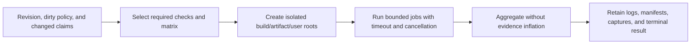

# Continuous Integration And Regression

**Status:** target capability dossier; no tracked CI workflow or CMake test registration was found

**Scope:** define reproducible check selection, isolated matrix execution, cancellation, aggregation, artifact retention, and regression-reporting boundaries

**Owner:** repository build/verification automation, with checks implemented by their owning modules

**Snapshot:** 2026-09-07; tracked CI entry points and all CMake files were searched for CI definitions, `enable_testing()`, and `add_test()` with no match; source evidence `S` only

**Strategy and acceptance sources:** `NS-EVIDENCE`, `NS-ADOPTION`, and `NS-OWNERSHIP` in the [Engineer Persona](../../../Strategy/EngineerPersona.md); [`PGE-01`, `PGE-05`, `PGE-06`, `PGE-13`](../../../Strategy/Requirements.md); [First Release](../../../Acceptance/FirstRelease.md)

**Current readiness:** **0/100** — target only; no tracked CI workflow or registered CMake test service was found. See [Current Feature Readiness](../../../Acceptance/CurrentReadiness.md#explicit-missing-or-not-yet-admitted-capabilities).

## At A Glance

| Capability | Current state | Target behavior |
| --- | --- | --- |
| automation entry point | Not found | clean, reproducible invocation from frozen revision/toolchain/dependencies |
| check selection | documented manual principle only | change and claim select the cheapest falsifying checks plus required escalation |
| execution matrix | Not found | isolated profile/backend/module jobs with bounded concurrency and cancellation |
| aggregation | Not found | pass, fail, unavailable, skipped, flaky, timeout, and inconclusive remain distinct |
| retained evidence | Not found | machine-readable result plus attributable logs/artifacts and expiry policy |

CI is not a new test authority: each module owns what its check means, while automation owns reproducible selection, isolation, scheduling, failure propagation, and retention.

## Capability Identity

| ID | Capability | Current state |
| --- | --- | --- |
| `CI-01` | Clean reproducible automation entry point | Not found |
| `CI-02` | Change- and release-claim-driven check selection | Not found |
| `CI-03` | Isolated matrix execution, cancellation, and honest aggregation | Not found |
| `CI-04` | Attributable machine-readable results and retained artifacts | Not found |

## Capability Boundary

Current custom checks, manual workloads, and documented evidence plans are useful inputs but do not form an automated regression product. The target is a reproducible automation layer that selects the cheapest claim-falsifying checks, reports unavailable gates honestly, retains attributable artifacts, and escalates only when a changed claim requires broader build/runtime/native/performance/package evidence.

## Contract

- Inputs: exact revision, dirty-state policy, toolchain/profile/backend matrix, dependency lock state, changed ownership boundaries, selected checks, workload identity, machine/driver identity, and secrets policy.
- Outputs: machine-readable check results, logs, diagnostics, manifests, captures/metrics when required, retention links, flaky/inconclusive classification, and one terminal job result.
- Each module owns its assertions and fixtures. Automation owns selection, isolation, scheduling, timeout/cancellation, artifact retention, and aggregation; it must not reinterpret a failing owner check as success.
- Parallel jobs must use isolated build/artifact/user-state roots and bounded concurrency. Cancellation settles child processes and publishes an incomplete result rather than a pass.

## Current State And Missing Surface

The inspected tree has no `.github` workflow and no CMake `enable_testing()`/`add_test()` registration. Therefore there is no current active CI matrix, automated regression baseline, flaky-test policy, protected-gate result, or retained automated release artifact. Manual source checks remain source evidence only.

## Acceptance Handoff

- `AC-CI-01`: a clean revision can run the documented baseline without private machine state and produces attributable retained results.
- `AC-CI-02`: required profile/backend/module matrices are explicit; skipped, unavailable, flaky, timed-out, and inconclusive checks cannot appear as passed.
- `AC-CI-03`: changed ownership boundaries select architecture/link/style checks, and release candidates select their frozen build/runtime/native/package gates.
- `AC-CI-04`: concurrency, cancellation, failure propagation, artifact retention, credential redaction, and result expiry are bounded and observable.
- `FM-CI-01`: dependency/toolchain acquisition is mutable or unavailable; the job stops with an acquisition failure.
- `FM-CI-02`: a child check crashes, hangs, or is cancelled; the aggregate remains failed or inconclusive and retains diagnostics.
- `FM-CI-03`: a required matrix leg or artifact is missing; the candidate is incomplete.
- `CHK-CI-01`: run the baseline from clean bytes twice and compare selected work, outcomes, manifests, and retained-artifact identity.
- `CHK-CI-02`: inject failing, timed-out, cancelled, unavailable, and missing-artifact cases and verify terminal aggregation.

No automated result is claimed here. [`BUILD-E04`](../CapabilityEvidencePlan.md#product-workflow-and-delivery-evidence) is the central evidence destination; check design follows [Validation And Evidence](../../../Engineering/Verification/ValidationAndEvidence.md).
