# Build And Packaging Capability Inventory

**Status:** capability snapshot; current build-system inventory, not a successful-build or release-package record

**Snapshot:** 2026-09-08 at committed `master` revision `ffe60e3a`; root/module CMake, profile/artifact contracts, dependency fetches, project discovery, tool/product membership, and install/test/CI searches inspected; evidence `S` only

**Scope:** build profiles, toolchains, options, dependency acquisition, targets, artifact layout, runtime staging, project discovery, checks, automation, tests, installation, and packaging

**Owner:** root/module `CMakeLists.txt` and `CMake/`; Launcher is the user-facing workspace orchestrator

**Evidence and disposition:** [Capability Evidence Plan](../CapabilityEvidencePlan.md) and [First Release Acceptance Contract](../../../Acceptance/FirstRelease.md)

**Current readiness:** **25/100** across build-to-release delivery — development build/staging foundations exist, but CI, package/install, verification, and operated delivery are absent. See [Current Feature Readiness](../../../Acceptance/CurrentReadiness.md#product-build-and-delivery).

## At A Glance

| Outcome | Current state | What is still missing |
| --- | --- | --- |
| configure and build developer profiles | six Editor/Game profiles, modular targets, dependency/toolchain options, and development artifact layout exist | a clean reproducible build result is not retained by this snapshot |
| prepare runnable development products | declared runtime support is copied beside Launcher/Showcase targets | development staging still depends on workspace conventions |
| inspect architecture/style | custom boundary and code-style targets exist | no general automated regression runner or CI gate |
| stage and distribute a release | not found | immutable manifest, licenses/SBOM, signing, archive/installer, relocation, and clean-machine proof |
| operate a released product | partial developer onboarding only | public first-use, support/security intake, incident, patch, and withdrawal operation |

```mermaid
flowchart LR
    Source[Frozen source and dependency identities] --> Configure[Configure profile, toolchain, and features]
    Configure --> Build[Build engine, tools, and product targets]
    Build --> Dev[Publish development artifacts]
    Dev -. missing owner .-> Stage[Immutable release stage and manifest]
    Stage -. missing owner .-> Package[Sign, package, install, and verify]
    Package -. missing owner .-> Support[Operate support and incident response]
```

The current build graph is useful engineering infrastructure, not yet a product-delivery system. The dossiers below separate those outcomes so a successful local executable cannot be mistaken for a distributable, supportable release.

## Capability Dossiers

| Surface | Owner and current boundary |
| --- | --- |
| Build graph, profiles, dependencies, development artifacts | This inventory |
| Public stage, package, signing, installation, and clean-machine operation | [Packaging And Installation](PackagingAndInstallation.md) |
| Continuous integration, automated regression, and retained results | [Continuous Integration And Regression](ContinuousIntegrationAndRegression.md) |
| First-run adoption, support, crash/security intake, patching, and withdrawal | [Adoption Support And Incident Response](AdoptionSupportAndIncidentResponse.md) |

## Build Contract

| ID | Capability | State | Exact current coverage and limit | Evidence |
| --- | --- | --- | --- | --- |
| `BUILD-001` | CMake baseline | Implemented path | CMake 3.20+, C/C++, C++20 required, compile commands exported. Current owned platform/backend sources make Windows the effective target. | `S` |
| `BUILD-002` | Six profiles | Implemented path | DebugEditor, DebugGame, DevelopmentEditor, DevelopmentGame, ShippingEditor, ShippingGame; DevelopmentEditor is default. State and target macros are emitted globally. | `S` |
| `BUILD-003` | Profile optimization/debug policy | Implemented path | MSVC Debug `/Od /Ob0 /Zi /RTC1`; Development `/O2 /Ob2 /Zi /DNDEBUG` plus full PDB/link optimization; Shipping `/O2 /Ob2 /DNDEBUG`. Clang-family Debug `-O0 -g`, Development `-O2 -g`, Shipping `-O3`. | `S` |
| `BUILD-004` | Compiler routes | Partial | CMake has MSVC and Clang/GNU flag branches; Launcher explicitly models MSVC and clang-cl on Windows. No current Linux/macOS platform product path exists. | `S` |
| `BUILD-005` | Static/shared engine modules | Implemented path | `SPARKLE_BUILD_SHARED` selects static default or engine DLLs; product targets copy declared runtime DLL owners beside executables in shared mode. | `S` |
| `BUILD-006` | Optional tool/features | Implemented path | Content pipeline ON, shader compiler ON, KTX support OFF, NVIDIA Streamline ON by default; strict warnings and sanitizer instrumentation are opt-in. RHI owns D3D12/Vulkan/NVAPI switches. | `S` |
| `BUILD-007` | Project discovery | Implemented path | Direct children of `Projects` with `.sparkle-project` are added; TemplateProject is skipped; editor/runtime target convention is supported. Showcase is the only current marked product. | `S` |
| `BUILD-008` | Target layering | Implemented path | Separate Core, Tasks, Platform, RHI common/backends/facade, Renderer, GameFramework, Editor, runtime/editor Application, Launcher core/GUI, import/cook/shader tools, and Showcase products. | `S` |
| `BUILD-009` | Host-tool exclusion | Implemented path | Launcher and cook/shader tool targets are excluded from default Game-profile builds; runtime Application source membership excludes editor/import/cook paths. | `S` |
| `BUILD-010` | Dependency acquisition | Capability-gated | FetchContent owns pinned/tagged ImGui, spdlog, Font Awesome, NVAPI/Streamline, cgltf, MikkTSpace, stb, tinyexr, zlib, Assimp, Compressonator, optional KTX, and SPIRV-Reflect; DXC/Slang/Vulkan/Qt discovery has separate host/SDK routes. | `S` |
| `BUILD-011` | Selective dependency sync | Implemented path | `SPARKLE_SYNC_SOURCE_DEPENDENCY` configures one cache and returns before workspace generation, enabling Launcher dependency repair. | `S` |

## Artifact And Delivery Surface

| ID | Capability | State | Exact current coverage and limit | Evidence |
| --- | --- | --- | --- | --- |
| `BUILD-012` | Development artifact contract | Implemented path | Runnable outputs go to `artifacts/dev`: launcher, tools, projects, runtime-support, libraries; diagnostics and symbols have separate roots; optional validated artifact variant namespaces alternate build trees. | `S` |
| `BUILD-013` | Product layout | Implemented path | Showcase products emit to `artifacts/dev/projects/Showcase/editor/<Profile>` or `artifacts/dev/projects/Showcase/runtime/<Profile>`; Windows manifest is attached; project working directory is set for VS debugging. | `S` |
| `BUILD-014` | Runtime support staging | Implemented path | Shared Sparkle DLL owners and enabled NVIDIA Streamline DLLs copy beside project products; Launcher runs `windeployqt` and copies visual resources plus repository-root marker. | `S` |
| `BUILD-015` | Tool bundles | Implemented path | Tool executables/libraries/symbols have target-owned locations and declared runtime DLL ownership; Launcher preflights required support files/directories before cooking. | `S` |
| `BUILD-016` | Architecture check | Implemented path | `architecture_boundary_check` runs the repository CMake boundary script; required after Renderer/RHI boundary changes. | `S` |
| `BUILD-017` | Code-style targets | Implemented path | `code_style_check` and `code_style_format` route through PowerShell and require clang-format/clang-tidy 22.1.3 policy. | `S` |
| `BUILD-018` | Install/stage/package | Not found | No CMake `install(...)`, CPack, package manifest generator, archive/installer, signing, or clean-machine staged product target was found. Development artifact copying is not release packaging. | `S` |
| `BUILD-019` | Automated tests | Not found | No `enable_testing()` or `add_test()` occurs in current CMake. Existing validation is custom checks/manual evidence, not CTest coverage. | `S` |
| `BUILD-020` | CI | Not found | No tracked `.github` workflow or other inspected CI configuration exists. | `S` |
| `BUILD-021` | Root onboarding | Partial | Root has `LICENSE.txt`, AGENTS routing, and deep Docs, but no root `README.md` in this snapshot. Clean-user entry remains incomplete. | `S` |

## `FCR-PROD-02` Source-Adopter Contract

This section owns the build-side source-adopter verdict. [Adoption](AdoptionSupportAndIncidentResponse.md) owns public recovery/support after a failure; [First Release](../../../Acceptance/FirstRelease.md#frozen-platform-and-toolchain-prerequisites) owns the frozen prerequisite values.

| ID | Binary acceptance criterion |
| --- | --- |
| `AC-PROD02-01` | From the immutable public tag/archive and root `README.md`, a non-author can identify the exact supported toolchain, network/cache/disk effects, unstable source API/no-binary-SDK boundary, and one minimal `ShippingGame` runtime route before running commands. |
| `AC-PROD02-02` | On the supported source machine with empty dependency/build/cook caches, the documented commands sync immutable inputs, configure, build `ShowcaseRuntime` and required cook tools, cook the included products, and launch the requested example within the frozen source budget. Every step has an attributable exit and artifact identity. |
| `AC-PROD02-03` | The same source/revision/toolchain replays from the declared warm cache without network, produces logically identical manifests/products, and does not depend on an author path, private cache, environment-only selection, or repository dirt. |
| `AC-PROD02-04` | Launcher, Editor, import/cook tools, providers, alternate generators/compilers, and contributor checks are separately classified; omitting an optional Developer-only surface either removes its prerequisite at configure time or fails before work with one actionable reason. |
| `AC-PROD02-05` | Clean/reset operations enumerate and require confirmation for owned generated roots, preserve tracked/untracked source and user-declared preserved paths, and report missing/locked/partial deletion as failure. |

| ID | Cause/injection, safe result, and affected criterion |
| --- | --- |
| `FM-PROD02-01` | Remove or downgrade CMake, Git, MSVC/Windows SDK, Qt, Vulkan SDK/DXC/Slang, or a selected optional tool. Configure/preflight must identify the exact missing/unsupported prerequisite and exit nonzero; a skipped action or missing artifact cannot be summarized as success (`AC-PROD02-01`, `AC-PROD02-02`, `AC-PROD02-04`). |
| `FM-PROD02-02` | Block network with an empty cache, corrupt a dependency checkout/archive, or replace a locked revision. Cold acquisition fails without partial acceptance; warm replay either uses verified cache or says network is required (`AC-PROD02-02`, `AC-PROD02-03`). |
| `FM-PROD02-03` | Run from a Unicode/spaced clone and remove all `SPARKLE_*` path overrides. Any private path, author cache, or environment-only requirement fails the source route (`AC-PROD02-02`, `AC-PROD02-03`). |
| `FM-PROD02-04` | At this revision `Tools/CMakeLists.txt` adds Launcher unconditionally and Launcher requires Qt 6.8, so even a runtime-focused configure requires Qt. Until membership makes Developer-only surfaces separately selectable, `AC-PROD02-04` is `BLOCKED`; instructions may not call Qt optional. |
| `FM-PROD02-05` | Place sentinels and preserved paths beside every clean target, inject a locked file, and cancel. Any source/sentinel removal or false-success aggregate fails `AC-PROD02-05`. |
| `FM-PROD02-06` | Inspect public wording and delivered files for SDK/install/ABI claims. Any binary SDK implication without installed headers/libraries/samples/version policy fails `AC-PROD02-01` and must be removed, not softened. |

| Check | Claims falsified | Smallest route and fixed oracle |
| --- | --- | --- |
| `CHK-PROD02-01` | `AC-PROD02-01`, `AC-PROD02-04`; `FM-PROD02-04`, `FM-PROD02-06` | Static audit of root onboarding, CMake option/subdirectory/target membership, public headers, archive disposition, and exact configure prerequisites. Every advertised optional product must be omittable and no SDK claim may exist. |
| `CHK-PROD02-02` | `AC-PROD02-02`, `AC-PROD02-03`; `FM-PROD02-01`–`03` | Two isolated clones on the supported source toolchain: empty-cache online cold route followed by network-blocked warm replay, with one missing-tool and one corrupt-input injection. Compare commands, exits, manifests/hashes, paths, created files, duration, and final active map. |
| `CHK-PROD02-03` | `AC-PROD02-05`; `FM-PROD02-05` | Dry-run/preview then confirmed clean against a disposable clone containing source/sentinel/preserved/locked fixtures. Only enumerated generated roots may change, and any incomplete deletion must be a failed result. |

Every source-adopter criterion/failure maps to a check. No configure, build, cook, clean, or launch was run in this documentation pass, so `FCR-PROD-02` remains `Blocked`.

## Vertical Build-To-Product Trace

CMake selects profile/options -> dependency owner resolves/fetches host and source requirements -> engine/tool/project targets are added -> profile target builds into private build tree while declared artifacts publish to `artifacts/dev` -> runtime DLL/vendor/Qt support is copied to target-owned directories -> Launcher checks freshness/readiness and launches from the project workspace. The trace currently stops before a formal Stage/Package/Install product.

## Explicit Non-Capabilities And Risks

- There is no current release package, installer, signed manifest, binary provenance/SBOM, CI gate, or automated test runner.
- FetchContent refs are not uniformly immutable commit hashes (some use tags/branches such as `master`); “pinned” must be verified per dependency before reproducibility claims.
- Sanitizer options exist but the current Windows/MSVC product route does not make all sanitizer modes usable.
- Development artifact staging can still rely on repository/project roots and does not prove redistributable clean-machine execution.
- This inventory did not configure or build any target; current build health remains unknown in this pass.
