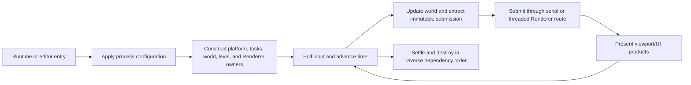

# Application Capability Inventory

**Status:** capability snapshot; current, but not release approval or executable evidence

**Snapshot:** 2026-09-08 at committed `master` revision `ffe60e3a`; `Engine/Application` runtime/editor hosts, command-line/configuration, task ownership, console, shader-recook, CMake split, and shutdown inspected; evidence `S` only

**Scope:** process entry, runtime loop, host composition, input/world/render sequencing, threaded-render selection, runtime console, editor composition, shader recook, capture coordination, startup/shutdown

**Owner:** `Engine/Application` / `SparkleApplication` and `SparkleApplicationEditor`

**Evidence and disposition:** [Capability Evidence Plan](../../CapabilityEvidencePlan.md) and [First Release Acceptance Contract](../../../../Acceptance/FirstRelease.md)

**Current readiness:** **45/100** — runtime/editor host integration exists in source; candidate lifecycle, failure, performance, package, and adoption evidence is absent. See [Current Feature Readiness](../../../../Acceptance/CurrentReadiness.md#product-build-and-delivery).

## At A Glance

| Responsibility | Current route | Important limit |
| --- | --- | --- |
| product composition | separate runtime and editor hosts share one application lifecycle | editor-only code is build-separated, but final package isolation remains unproved |
| frame loop | input -> window -> time -> level/world simulation -> render submission -> Renderer | shutdown, minimize, and failure behavior need executable evidence |
| render execution | serial or dedicated render-thread coordination; pipeline depth 0..2 under frames-in-flight bound | equivalence, backpressure, and long-run settlement unproved |
| developer interaction | command-line CVars, optional runtime console, editor operations, shader recook, viewport capture | malformed command-line assignments are currently ignored by the adapter |
| ownership | Application constructs and destroys platform, tasks, world, level, Renderer, and UI hosts in explicit order | it coordinates modules but must not become their implementation authority |

The module is a composition root. Its quality depends on preserving the boundaries below rather than absorbing world, rendering, tool, or editor policy into the host loop.

## Product Split

| ID | Capability | State | Exact current coverage and limit | Evidence |
| --- | --- | --- | --- | --- |
| `APP-001` | Shared application lifecycle | Implemented path | `Application::Run` drives virtual Initialize/Tick/Shutdown; process configuration applies registered CVars from command line before host creation. | `S` |
| `APP-002` | Cooked runtime host | Implemented path | `RuntimeApplication` composes Timer, Window, InputSystem, Tasks, GameWorld, LevelSession, Renderer, camera input, and optional runtime console. It links no source importer or cooker. | `S` |
| `APP-003` | Editor host | Implemented path | `EditorApplication` embeds the runtime host with runtime console disabled and UI render packets enabled, then adds editor UI, operations, shader recook, and viewport capture coordination. | `S` |
| `APP-004` | Build-time editor erasure | Implemented path | `SparkleApplication` excludes editor, shader-recook, capture, and editor-operation sources; `SparkleApplicationEditor` owns them and privately links `SparkleEditor`. Game products link only the runtime target. Package inspection is still required. | `S` |

## Runtime Loop And Ownership

| ID | Capability | State | Exact current coverage and limit | Evidence |
| --- | --- | --- | --- | --- |
| `APP-005` | Frame pump | Implemented path | Input begin -> window poll -> deferred input -> timer tick -> close/minimize decision -> pending level change -> simulation begin/update/end -> render submission -> render. Minimized/zero-size windows wait for an event and skip rendering. | `S` |
| `APP-006` | Task ownership | Implemented path | Application owns the executor and root Application scope and passes them to GameWorld, level loads, Renderer asset work, editor/tool operations. Shutdown destroys consumers before task runtime. | `S` |
| `APP-007` | Renderer execution selection | Capability-gated | `r.ThreadedRenderer` selects threaded Renderer ownership when options allow it; otherwise serial. `r.RenderPipelineDepth` accepts 0..2 and must remain below `r.MaximumFramesInFlight`, otherwise startup fatals. | `S` |
| `APP-008` | Camera input bridge | Implemented path | Keyboard/mouse input becomes a `CameraInputIntent`; runtime applies it to the active world camera. Editor supplies its viewport camera as view-only override without mutating world camera each frame. | `S` |
| `APP-009` | Viewport request/products | Implemented path | Host forwards viewport extent/mode/exposure requests and returns Renderer products for ImGui presentation. Runtime console can request UI packets too. | `S` |
| `APP-010` | Ordered shutdown | Implemented path | Console -> Renderer -> LevelSession -> input collector -> GameWorld -> Tasks -> Input -> Window -> Timer are released in an explicit order. Repeated/device-loss shutdown remains unrun. | `S` |

## Configuration And Tools

| ID | Capability | State | Exact current coverage and limit | Evidence |
| --- | --- | --- | --- | --- |
| `APP-011` | Command-line CVar assignment | Implemented path | `--cvar=name=value`, `--cvar name=value`, and `--set-cvar name=value` are case-insensitive switches. Unknown names, malformed assignments, and failed parses are silently ignored by this adapter. | `S` |
| `APP-012` | Runtime console | Implemented path | Optional tilde-driven ImGui overlay registers Core built-ins for help/list/get/set, with filtering, bounded session output, history, and autocomplete, then submits a UI packet through Renderer. No level, shader-recook, or Renderer-specific command registration was found in the runtime host. | `S` |
| `APP-013` | Editor shader recook | Capability-gated | Editor-only coordinator tracks changed sources, launches `ShaderCompiler`, supports all/selected/changed requests and cancellation, reads the publication signal, then requests Renderer generation reload. Requires tool/source workspace state. | `S` |
| `APP-014` | Editor operation service | Implemented path | Serializes/updates long-running editor operations and exposes progress/result to UI, currently including shader recook. It is not a generic plugin task framework. | `S` |
| `APP-015` | Viewport capture | Implemented path | Editor capture coordinator turns a UI request into Renderer capture work and reports completion/failure through the editor host. File correctness and UX evidence remain open. | `S` |

## Vertical Runtime Trace

Project `main` calls the editor or runtime launch function -> command-line CVars are applied -> host constructs native/application/world/render owners -> `LevelSession` begins startup activation -> each ready frame advances world systems and extracts one frame submission -> Renderer returns viewport/UI products -> close request exits Tick -> explicit shutdown unwinds owners in dependency order.

## Product Contract Boundary

Application is the host contributor, not a second product-journey authority. [`FCR-PROD-01`](../../Projects/Showcase/README.md#fcr-prod-01-runtime-consumer-contract) owns the consumer AC/FM/CHK and [`FCR-PROD-04`](../Editor/README.md#fcr-prod-04-editor-contract) owns the Editor AC/FM/CHK. Application must make those results possible through one shared lifecycle while preserving these source-backed facts:

- `RunRuntimeApplication()` constructs default `RuntimeApplicationOptions`, whose runtime console is currently enabled; that state violates the frozen `ShippingGame` contract until the build/product route makes console erasure structural.
- `RunEditorApplication()` layers `SparkleApplicationEditor` over the runtime host and explicitly disables the runtime console in favor of Editor UI; Editor-only shader recook/capture/operation sources are excluded from `SparkleApplication` membership.
- close requests are observed in `BeginFrame()` and owners are reset in an explicit order, but `RunRuntimeApplication()` currently returns `0` after `Application::Run()` without a product-specific failure result. Runtime/init/device/content failures therefore need a single exit-status contract before candidate evidence.
- host initialization currently creates the window, tasks/world/level, Renderer, and optional console before any consumer prerequisite screen. Unsupported OS/CPU/GPU/content must be rejected at the earliest owning boundary rather than appearing as an Application success.

## Explicit Non-Capabilities And Risks

- No service mode, headless executable, multi-window host, suspend/resume lifecycle, crash recovery, telemetry upload, or platform abstraction beyond Windows was found.
- The CVar command-line adapter does not surface invalid/unknown assignments, so a typo can look accepted.
- Shader recook is editor/workspace tooling and must not be advertised in packaged game products.
- Source-level editor erasure is implemented, but final binary/import/file inspection has not proved a clean ShippingGame package.
