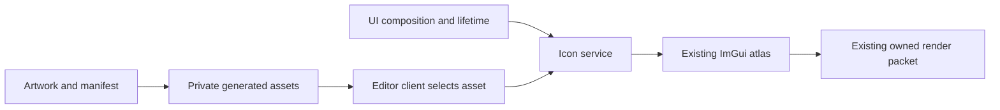

# Editor Icon Assets And Service

**Status:** implemented path; bounded DevelopmentEditor validation recorded in the [handoff](../../../CrossModule/PerformanceDiagnostics/ExternalCapture/Discovery.md#shared-editor-icon-service-handoff)

Editor clients select immutable artwork and ask a UI-owned icon service to draw it. Clients do not register atlas rectangles, copy pixels or retain texture coordinates. The first consumer is the external-capture viewport overlay; the service contains no capture/tool policy.

| Responsibility | Owner |
| --- | --- |
| Artwork, identity, extent, eligible profiles | `Engine/Editor/Assets/Icons/<collection>/Icons.json` and RGBA source files |
| Validate/embed per-configuration catalog | `Engine/Editor/EditorIconAssets.cmake`; private generated `Icons/<configuration>/EditorIconAssets.h` |
| Immutable borrowed descriptor / drawing contract | `Public/Icons/EditorIconAsset.h`, `Public/Icons/EditorIconService.h` |
| Registration, deduplication, coordinates, lifetime | Private `Icons/EditorIconService.cpp` |
| Create after typography, destroy after clients/before ImGui | `UI::Implementation` |
| Selection, interaction, tooltip, layout | Individual Editor clients, currently ExternalCaptureOverlay |



The resource service is shared; client selection and enabled state remain local. Public contracts expose no ImGui/native handle and no provider IDs. The generic viewport overlay boundary borrows the service during drawing; it does not retain it or forward it through Application startup constructors. There is no singleton or callback/loader registry.

## Add An Icon

1. Add a square top-down unpremultiplied RGBA8 source under an owning `Assets/Icons/<collection>/` folder, retaining provenance and usage attribution. Extent is an integer from 1 through 512; byte count is exactly `extent * extent * 4`.
2. Add an entry to that collection's `Icons.json`. Collection namespace and asset names use UpperCamelCase identifiers. Declare the exact existing build profiles that may contain the collection. A new collection needs no generator or service edit.
3. Include the private generated catalog at the selecting client and call `icons.DrawButton(EditorIconAssets::<collection>::<name>, id)`. The client owns stable widget identity, disabled scope, tooltip and layout. The button defaults to current font size; clients may pass an explicit image size for larger square buttons.

Example manifest:

```json
{
  "namespace": "ExternalTools",
  "profiles": ["DebugEditor", "DevelopmentEditor"],
  "icons": [{"name": "Pix", "extent": 32, "file": "pix.rgba"}]
}
```

The generic CMake path rejects unknown/duplicate profiles, invalid/duplicate names, out-of-range extents, missing/out-of-collection files and wrong byte counts. Missing required artwork is a configure error. An excluded collection has no descriptor or pixel bytes in that profile's generated catalog; its clients must have matching build membership. This does not prove a complete packaged Shipping product.

## Ownership And Cost

The descriptor and pixels are immutable and borrowed for the service lifetime. Generated inline static assets provide stable addresses and bytes across clients. The service caches one descriptor address/rectangle identity per used asset, with no copied catalog or mirrored client state. A first draw registers one rectangle and copies its exact pixel bytes into the shared atlas. Repeated draws perform a small linear lookup over used assets and reacquire current packed coordinates/texture; they do not copy pixels or allocate a second registration. This keeps the implementation small for the current three assets; a larger measured working set may justify changing private lookup storage without changing clients.

All calls and cleanup run on the creating Editor thread and ImGui context. UI creates the service after typography has configured/cleared the atlas. UI destroys action clients, then the service's rectangles, then the backend/context. A client's replacement/removal does not destroy shared resources still used by another client; resources remain cached until UI teardown. Invalid context/thread/asset/allocation contracts fail at the service owner through existing fatal diagnostics. Atlas growth is supported by fresh rectangle/texture lookup; replacing the context/atlas or clearing typography while clients are live is not a supported operation.

Existing ImGuiRenderPacketBuilder remains the only cross-thread texture upload/publication route. No live atlas pointer escapes the Editor thread. Font glyphs embedded in textual labels remain typography through the existing `UiUtil::EditorIcon` mapping; they are not converted into redundant image descriptors. Runtime image loading/decoding, SVGs, arbitrary hot reload and resolution variants are outside this implemented service.

## Validation Limits

The [shared-service handoff](../../../CrossModule/PerformanceDiagnostics/ExternalCapture/Discovery.md#shared-editor-icon-service-handoff) records exact build, serial/threaded UI, shared-client/deduplication, atlas growth, manifest failures, configuration membership and cleanup results. Those checks do not establish native GPU capture, Debug/Vulkan execution, full Shipping product/import/package erasure, accessibility/scaling matrix or independent adoption.
