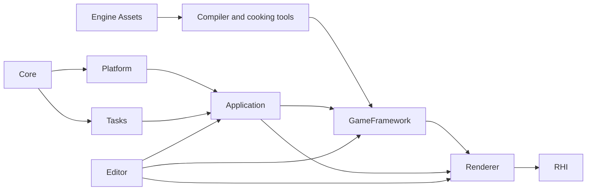

# Engine Module Architecture

**Status:** Engine module index

This index mirrors the durable modules under `Engine`. Open the owning module first; use hyperlinks to follow producer/consumer relationships without relocating that knowledge into a mixed folder.

## At A Glance

Read the graph as responsibility flow rather than exact link visibility. Core and Tasks provide mechanisms; Platform/Application host the process; GameFramework publishes immutable world state; Renderer defines the frame; RHI executes GPU mechanisms; Editor composes authoring/inspection workflows without becoming a runtime dependency.

## Module Routes

| Module | Owns | Module documentation |
| --- | --- | --- |
| Application | runtime/editor host composition, configuration, loop, startup, and shutdown | [Application](Application/README.md) |
| Assets | engine-authored shaders, defaults, environments, and fixtures | [Assets](Assets/README.md) |
| Core | common infrastructure, diagnostics, files, processes, serialization, math, input, and time | [Core](Core/README.md) |
| Editor | workspace, viewport sessions, editing UX, settings, and editor tool entry points | [Editor](Editor/README.md) |
| GameFramework | levels, worlds, ECS, editing, publication, and render extraction | [GameFramework](GameFramework/README.md) |
| Platform | Windows application, window, DPI, message, input, cursor, and capture integration | [Platform](Platform/README.md) |
| Renderer | whole-frame production plus explicit scene/view, geometry/GBuffer, ray tracing, Direct/Indirect/Volumetric Lighting, Post Processing subfeatures, presentation/UI, scheduling, shader-program, and diagnostic boundaries | [Renderer](Renderer/README.md) |
| RHI | backend-neutral GPU contracts and D3D12/Vulkan implementations | [RHI](RHI/README.md) |
| Tasks | task graphs, lanes, parallel ranges, cancellation, events, failure, and shutdown | [Tasks](Tasks/README.md) |

Rules that apply while changing these modules live in [Engineering Modules](../../../Engineering/Modules/README.md). Cross-owner system designs live in [CrossModule](../../CrossModule/README.md).
