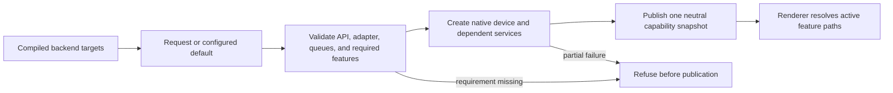

# RHI Backend Selection and Device Capabilities

**Status:** current feature dossier; source-backed, not build, device, parity, or release evidence

**Verified:** 2026-09-06 at committed `master` revision `8414b5dc`

**Scope:** `RHI-BACK-*` and `RHI-DEV-*`; compiled backend availability, request/default selection, adapter/device bootstrap, queue topology, and neutral capability reporting

**Current readiness:** **50/100** — both backend selection/device source routes and neutral capability publication exist; build/device/native-query/parity/failure evidence does not. See [Current Feature Readiness](../../../../../../Acceptance/CurrentReadiness.md#rhi-and-gpu-execution).

## At A Glance

| Reader question | Current answer |
| --- | --- |
| What selects the backend? | Build membership defines what can exist; startup request/default policy chooses exactly one compiled D3D12 or Vulkan route. |
| What does success produce? | One complete device-service aggregate and one immutable capability snapshot derived from the selected native adapter/device. |
| What can Renderer rely on? | Neutral queue, format, descriptor, ray-tracing, presentation, and provider-capability fields—not the backend or vendor name. |
| What happens when requirements are missing? | Selection or creation fails before publishing usable services; it must not silently substitute another backend. |
| What remains unknown? | Real adapter coverage, native-query correlation, backend parity, partial-create cleanup, and release-supported hardware. |

## Selection And Publication Flow

The important boundary is between a *requested API* and a *published capability set*. Feature policy begins only after publication.

This design makes feature decisions portable and inspectable. Its cost is that the capability record becomes startup-critical: an omitted or optimistic field can activate an invalid path on every higher-level consumer.

## Feature Promise

A valid request selects one compiled backend, creates one device/adapter topology, and reports capabilities from that active device. Unavailable backends and unsupported requirements fail before Renderer schedules work; backend names are never a substitute for capability queries.

## Ownership And Current Boundary

- `RhiBackendSelection` owns parsing and availability; `RenderDeviceServices` owns the neutral service facade and active capability snapshot.
- CMake owns whether D3D12 and Vulkan targets exist and which backend is the default. Runtime cannot activate a backend omitted from the build.
- D3D12 requests feature level 12_1; Vulkan selection requires Vulkan 1.3 and scores eligible physical devices.
- The capability record owns API identity, shader target, queue kinds/independence, descriptor indexing, ray tracing, presentation, format/use support, and optional external-feature readiness.
- Renderer may select policy from neutral fields only. Adapter/vendor-specific branches remain backend/private or provider-owned.

## Design Decisions And Tradeoffs

| Decision | Benefit | Cost or risk |
| --- | --- | --- |
| Compile backends as separate targets | Missing SDKs and unsupported platforms fail at configuration/build time | A runtime request cannot recover a backend omitted from the build |
| Select one backend for one process/device aggregate | Ownership and native lifetime stay unambiguous | Cross-backend comparison requires separate runs and evidence |
| Publish capability facts instead of backend-name policy | Renderer features can gate on what the device actually exposes | Capability discovery and reporting must be exhaustively validated |
| Reject unmet requirements before publication | No half-created RHI leaks into Renderer startup | Startup failure is intentionally strict and needs clear diagnostics |

## Acceptance Criteria

- `AC-RHI-BACK-01` — every compiled/default/requested combination either creates exactly the requested backend or rejects it with the unavailable prerequisite; no different backend silently activates.
- `AC-RHI-BACK-02` — capability and queue reports match the selected native device and remain stable for its lifetime across both backends.
- `AC-RHI-BACK-03` — missing SDK, API version, feature, queue, adapter, or device creation fails before partial RHI publication and names the rejecting boundary.
- `AC-RHI-BACK-04` — Renderer decisions use neutral capability fields, while optional vendor/provider capability is reported separately from core backend support.

## Controlled Failures And Checks

| Failure | Safe result | Check |
| --- | --- | --- |
| `FM-RHI-BACK-01` unavailable or uncompiled backend requested | device services remain unpublished; exact availability error is returned | `CHK-RHI-BACK-01` configure/build/runtime selection matrix |
| `FM-RHI-BACK-02` required adapter feature or queue missing | candidate adapter is rejected without partially active services | `CHK-RHI-BACK-02` capability/queue fault matrix |
| `FM-RHI-BACK-03` capability report differs from native query | startup validation fails and no Renderer feature consumes the false claim | `CHK-RHI-BACK-02` native query correlation on named adapters |

Check coverage: `CHK-RHI-BACK-01` covers `AC-RHI-BACK-01`, `AC-RHI-BACK-03`, and `FM-RHI-BACK-01`; `CHK-RHI-BACK-02` covers `AC-RHI-BACK-02` through `AC-RHI-BACK-04`, `FM-RHI-BACK-02`, and `FM-RHI-BACK-03`.

Definition of done: both backend target shapes, runtime selection/failure cases, native capability correlation, and candidate evidence pass; source inspection establishes none of those results.

## Primary Source Routes

- `Engine/RHI/CMakeLists.txt`
- `Engine/RHI/Public/Core`, `Engine/RHI/Public/Device`, and `Engine/RHI/Public/Commands/RhiQueueCapabilities.h`
- `Engine/RHI/Private/Device`, `Engine/RHI/Private/D3D12/Device`, and `Engine/RHI/Private/Vulkan/Device`
