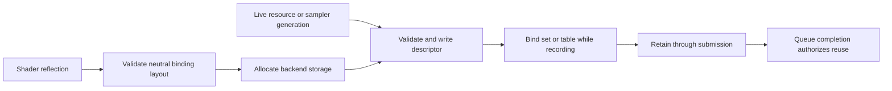

# RHI Descriptor Binding

**Status:** current feature dossier; source-backed, not binding correctness, capacity, or backend-parity evidence

**Verified:** 2026-09-06 at committed `master` revision `8414b5dc`

**Scope:** `RHI-BIND-*`; descriptor layouts, handles, allocation, resource/sampler writes, binding sets/tables, arrays, indexing capabilities, recording lifetime, and bounded Renderer material-table consumption

**Current readiness:** **50/100** — neutral and backend descriptor source routes exist; capacity, invalid-use, lifetime, native-validation, parity, and pressure evidence does not. See [Current Feature Readiness](../../../../../../Acceptance/CurrentReadiness.md#rhi-and-gpu-execution).

## At A Glance

| Concern | Current contract | Important limit |
| --- | --- | --- |
| ABI | Reflected shader bindings and the neutral layout must agree before a set/table is usable | A registered shader or allocated descriptor alone is not ABI compatibility |
| Writes | Resource, view, sampler, type, index, and array count are validated together | Missing, stale, mismatched, and out-of-range writes must reject before recording |
| Arrays/indexing | Fixed arrays and capability-gated non-uniform indexing are represented | This is not an unbounded, engine-wide bindless model |
| Lifetime | Recording and submission retain every referenced descriptor and resource | CPU handle destruction cannot authorize native-slot reuse in flight |
| Backends | D3D12 heaps/tables and Vulkan pools/sets lower one neutral contract | Capacity and semantic parity remain unproved |

## Binding Lifecycle

The shader ABI, resource generation, descriptor allocation, and recording lifetime meet here. Treating any one of them as sufficient creates the classic failure where a syntactically valid slot points at the wrong object or is recycled before the GPU finishes.

## Feature Promise

A complete neutral binding layout plus type-correct writes becomes backend descriptor state that matches shader reflection and remains valid through every recording/submission consumer. Fixed arrays and capability-gated non-uniform indexing are explicit; they do not imply an unbounded engine-wide bindless model.

## Ownership And Boundary

- RHI owns layout/set/table mechanics, handle validity, descriptor allocation/write rules, array counts, native heaps/pools, and device capability reporting.
- Shader reflection and pipeline validation define the expected ABI; Renderer owns which semantic resources occupy the bindings.
- D3D12 heaps/tables and Vulkan pools/sets are backend lowerings of the neutral contract. Recording-local allocations cannot escape their completion lifetime.
- The current Renderer material table is fixed-capacity and ray-path-specific; raster materials remain bindful. Exact reachability stays in the Renderer dossier and inventory.

## Design Decisions And Tradeoffs

| Decision | Benefit | Cost or risk |
| --- | --- | --- |
| Keep semantic resource choice in Renderer | RHI remains reusable and does not learn material meaning | Higher layers must maintain exact reflected binding identity |
| Validate through one neutral layout | Backend behavior can be compared against one contract | Native APIs expose different pool/heap pressure and update restrictions |
| Make indexed binding capability-gated | Unsupported devices never enter a path they cannot execute | Feature availability varies by adapter and needs requested-versus-active reporting |
| Retain descriptors by GPU completion | Prevents stale native references | Delayed work can retain heap/pool capacity and must remain bounded |

## Acceptance Criteria

- `AC-RHI-BIND-01` — layouts and writes preserve binding index, type, array count, visibility, resource/view/sampler identity, and shader-reflection compatibility on both backends.
- `AC-RHI-BIND-02` — invalid, missing, mismatched, stale, duplicate, or out-of-range writes reject before draw/dispatch.
- `AC-RHI-BIND-03` — descriptor heap/pool/table lifetime extends through the last recording/submission consumer and is reclaimed without premature reuse.
- `AC-RHI-BIND-04` — indexed/partially-bound arrays activate only when their exact device capabilities and capacity requirements are satisfied; requested-versus-active state is observable.
- `AC-RHI-BIND-05` — exact capacity and capacity-plus-one cases are deterministic; no path advertises runtime-sized bindless support.

## Controlled Failures And Checks

| Failure | Safe result | Check |
| --- | --- | --- |
| `FM-RHI-BIND-01` layout/write/reflection mismatch | reject before pipeline use and identify binding/type | `CHK-RHI-BIND-01` generated valid/invalid ABI matrix |
| `FM-RHI-BIND-02` stale descriptor or destroyed resource | handle/generation validation rejects; prior native slot is not reused in flight | `CHK-RHI-BIND-02` churn and retirement stress |
| `FM-RHI-BIND-03` missing indexing feature or capacity overflow | feature remains inactive or request fails explicitly | `CHK-RHI-BIND-03` capability/capacity matrix |

Check coverage: `CHK-RHI-BIND-01` covers `AC-RHI-BIND-01`, `AC-RHI-BIND-02`, and `FM-RHI-BIND-01`; `CHK-RHI-BIND-02` covers `AC-RHI-BIND-03` and `FM-RHI-BIND-02`; `CHK-RHI-BIND-03` covers `AC-RHI-BIND-04`, `AC-RHI-BIND-05`, and `FM-RHI-BIND-03`.

Definition of done: shader-to-layout validation, descriptor churn/lifetime, exact bounds, material sampling, native validation, and both-backend evidence pass.

## Primary Source Routes

- `Engine/RHI/Public/Bindings` and `Engine/RHI/Public/Descriptors`
- `Engine/RHI/Private/Bindings`, `Private/Descriptors`, and backend `Descriptors` folders
- [Pipeline and Shader Contracts](../PipelineAndExecution/PipelineAndShaderContracts.md) and [Renderer Geometry, Materials, and GBuffer](../../../Renderer/Features/GeometryAndResources/GeometryMaterialsAndGBuffer.md)
