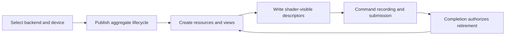

# RHI Device And Resources

**Status:** RHI feature-family index

**Scope:** route device creation and aggregate lifetime, neutral capability truth, resource memory, formats, and descriptor binding

This family answers whether a GPU service exists, what it can truthfully report, which objects are safe to expose, and how long their native storage remains valid.

**Current readiness:** **48/100** family projection — device/resource/descriptor source paths are broad; lifecycle/failure, pressure, native, and delivery proof remains open. See [Current Feature Readiness](../../../../../../Acceptance/CurrentReadiness.md#rhi-and-gpu-execution).

## At A Glance

| Stage | Owning contract | Result handed forward |
| --- | --- | --- |
| choose and create | backend selection and capabilities | one complete device aggregate plus neutral capability truth |
| remain valid or terminate | device lifecycle and recovery | active, resizing, settling, destroyed, or terminal-loss state |
| allocate and transfer | resource lifetime and memory | typed resources/views with explicit state and completion lifetime |
| make shader-visible | descriptor binding | ABI-compatible binding sets/tables retained through submission |

The family deliberately separates semantic capability truth from object mechanics. This prevents “the API supports it” from being confused with “this selected device, resource description, descriptor layout, and lifetime make it usable.”

## Choose By Problem

| Document | Open it for |
| --- | --- |
| [Backend Selection And Device Capabilities](BackendSelectionAndDeviceCapabilities.md) | compiled/requested backend selection, device/queue creation, capability truth, and partial-create rejection |
| [Device Lifecycle And Failure Recovery](DeviceLifecycleAndFailureRecovery.md) | aggregate publication, owner-thread lifetime, settlement, swapchain recovery boundary, device loss, and explicit non-recovery |
| [Resource Lifetime And Memory](ResourceLifetimeAndMemory.md) | formats, allocation, views, upload/readback, aliasing, budgets, pressure, and GPU-safe retirement |
| [Descriptor Binding](DescriptorBinding.md) | layout/set/table identity, allocation, writes, arrays, capacity, recording lifetime, and backend lowering |

The parent [RHI Feature Dossiers](../README.md) index owns capability routing. Each child retains its own D3D12/Vulkan and feature-local proof contract.

## Shared Risks

- Partial device construction must never leak a usable facade.
- Capability records, resource/view descriptions, and shader-visible layouts must describe the same selected device generation.
- CPU ownership is insufficient for destruction; every queue consumer must complete first.
- Backend implementation symmetry does not establish adapter coverage, memory-pressure behavior, or descriptor-capacity parity.
