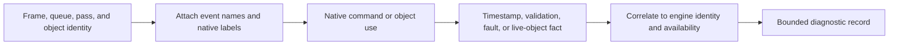

# RHI Diagnostics

**Status:** current feature dossier; source-backed, not diagnostic truthfulness, fault-handling, observer-cost, or release evidence

**Verified:** 2026-09-06 at committed `master` revision `8414b5dc`

**Scope:** `RHI-DIAG-01` through `RHI-DIAG-05`; native object identity, GPU events, timestamps, validation messages, D3D12 crash data, live-object reporting, bounded delivery, and observer configuration

**Current readiness:** **35/100** — messages, names, timestamps, memory, and backend diagnostic facts exist; joined bounded consumption, loss/observer cost, and device-failure evidence does not. See [Current Feature Readiness](../../../../../../Acceptance/CurrentReadiness.md#rhi-and-gpu-execution).

## At A Glance

| Observation | What it can establish | What it cannot establish |
| --- | --- | --- |
| object names and GPU events | which engine object/pass was lowered to named native work | that the work produced correct pixels |
| timestamps | measured interval on a supported queue after valid resolve | useful overlap, low latency, or a representative workload by itself |
| native validation messages | a native API or synchronization problem detected by the enabled layer | correctness when the stream is quiet or the layer is unavailable |
| D3D12 DRED / Vulkan fault context | best available native context for a failed device operation | recovery or continued device validity |
| live-object reporting | native objects still visible at the reporting boundary | leak ownership without correlated engine identity and lifecycle context |

## Observation Flow

The trustworthy result is an attributable observation with an explicit availability state. Zero messages, zero milliseconds, or a truncated buffer are never silently interpreted as success.

## Feature Promise

RHI diagnostic records identify the neutral request and native work that actually executed. Unsupported, disabled, unresolved, truncated, and dropped observations remain explicit; completion or a quiet validation stream never becomes a correctness claim.

## Ownership And Trust Boundary

- Neutral command/resource owners supply stable frame, queue, pass, object, and resource identity; backend adapters attach native labels and messages.
- Timestamp values require the correct queue frequency and resolve ordering. Unsupported or unresolved timing is unavailable, not zero.
- Native validation, D3D12 DRED, Vulkan messages, and live-object reporting remain backend facts linked to neutral identity where available; asymmetry is reported rather than normalized away.
- D3D12 and Vulkan expose different native facilities. The diagnostic owner reports that asymmetry and availability; it does not fabricate a common observation the backend did not produce.

## Design Decisions And Tradeoffs

| Decision | Benefit | Cost or risk |
| --- | --- | --- |
| Preserve backend-specific facts | Reports remain truthful about what the native API actually exposed | Tooling and evidence cannot assume identical D3D12/Vulkan detail |
| Correlate through neutral stable identity | A native message can be traced back to a frame/pass/resource owner | Every producer must propagate identity consistently |
| Treat unavailable and dropped data as states | Quiet output cannot masquerade as validation success | Consumers must handle partial diagnostic records explicitly |
| Bound collection and measure observer cost | Diagnostics remain usable in representative runs | Fine-grained detail may be sampled or disabled and must say so |

## Acceptance Criteria

- `AC-RHI-DIAG-01` — object/event/timestamp/validation records correlate stable engine identity, backend, queue, frame/submission, and native object/work without stale attribution.
- `AC-RHI-DIAG-02` — disabled, unsupported, truncated, dropped, or unresolved diagnostics are reported honestly and remain within documented bounds.
- `AC-RHI-DIAG-03` — injected neutral misuse fails before the API call where possible; injected native/device faults retain the best available crash/validation context and reach bounded shutdown or recovery.
- `AC-RHI-DIAG-04` — backend-specific validation, crash, and live-object facilities report their active/unavailable state without implying cross-backend equivalence.
- `AC-RHI-DIAG-05` — diagnostic observer cost and Development/Shipping availability are measured or explicitly classified.

## Controlled Failures And Checks

| Failure | Safe result | Check |
| --- | --- | --- |
| `FM-RHI-DIAG-01` unsupported timestamp or overflowed message buffer | unavailable/truncated state is explicit | `CHK-RHI-DIAG-01` support/bounds/correlation exercise |
| `FM-RHI-DIAG-02` invalid API use or device removal | exact identity/context is retained; no false completion | `CHK-RHI-DIAG-02` native fault exercise |
| `FM-RHI-DIAG-03` requested validation/crash/live-object facility unavailable | facility remains explicitly unavailable; a quiet stream is not reported as validation success | `CHK-RHI-DIAG-03` configuration/availability matrix |

Check coverage: `CHK-RHI-DIAG-01` covers `AC-RHI-DIAG-01`, `AC-RHI-DIAG-02`, `AC-RHI-DIAG-05`, and `FM-RHI-DIAG-01`; `CHK-RHI-DIAG-02` covers `AC-RHI-DIAG-01`, `AC-RHI-DIAG-03`, and `FM-RHI-DIAG-02`; `CHK-RHI-DIAG-03` covers `AC-RHI-DIAG-04` and `FM-RHI-DIAG-03`.

Definition of done: native-tool correlation, fault injection, timestamp validation, delivery bounds, observer-cost, package configuration, and both-backend availability evidence pass.

## Primary Source Routes

- `Engine/RHI/Public/Diagnostics`
- common/backend `Diagnostics` and backend debug layers
- [Renderer Diagnostics, Products, and Capture](../../../Renderer/Features/ViewportAndDiagnostics/DiagnosticsProductsAndCapture.md) and [Performance Diagnostics](../../../../../CrossModule/PerformanceDiagnostics/README.md)
