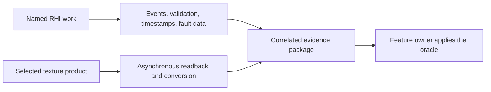

# RHI Diagnostics And Capture

**Status:** RHI feature-family index

**Scope:** route attributable backend observations and asynchronous texture readback products

This family explains what the RHI can reveal about native work and how a selected GPU texture becomes a retained inspection artifact.

**Current readiness:** **35/100** — useful instrumentation and readback foundations exist; bounded publication, attribution, observer cost, device-loss, format truth, and external handoff remain unproved. See [Current Feature Readiness](../../../../../../Acceptance/CurrentReadiness.md#rhi-and-gpu-execution).

## At A Glance

| Need | Use | Trust boundary |
| --- | --- | --- |
| understand what native work occurred or failed | [Diagnostics](Diagnostics.md) | an attributable event/message/timestamp is an observation, not correctness proof |
| inspect the bytes of a selected render product | [Texture Capture](TextureCapture.md) | copy completion and conversion prove delivery, not semantic product correctness |

Diagnostics and capture supply evidence inputs. Only the owning feature can decide whether those inputs satisfy its correctness, quality, performance, or release criteria.

## Choose By Result

| Document | Open it for |
| --- | --- |
| [Diagnostics](Diagnostics.md) | object/event identity, validation, crash facts, timestamps, live objects, bounds, cost, and availability |
| [Texture Capture](TextureCapture.md) | staging/readback lifetime, formats/layout conversion, polling, result publication, failure, and cleanup |

Diagnostics observes backend behavior. Texture capture produces a typed asynchronous product; neither is evidence that the observed or captured feature is correct. The parent [RHI Feature Dossiers](../README.md) index owns capability routing.

## Shared Risks

- Unsupported or disabled observations must remain unavailable, not zero or successful.
- Frame, queue, product, resource, and generation identity must survive asynchronous delivery.
- Buffers, messages, staging memory, and callbacks need explicit capacity and shutdown bounds.
- Enabling diagnostics can change timing and memory behavior; observer cost belongs in retained evidence.
