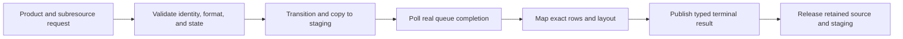

# RHI Texture Capture

**Status:** current feature dossier; source-backed, not captured-pixel, format, color, latency, or release evidence

**Verified:** original source audit 2026-09-06 at committed `master` revision `8414b5dc`; ownership reconciled 2026-09-18 against source input `df2f0c0658cbf1cbdc0355c050a496cb513709e5` plus the scoped Stage-9 working tree, without runtime capture evidence

**Scope:** `RHI-DIAG-06`; asynchronous destination-free texture readback, staging lifetime, supported-format layout, polling, result delivery, failure, and cleanup

**Current readiness:** **35/100** — asynchronous readback source paths exist; format/row/orientation, capacity, cancellation, resize/device loss, semantic interpretation, and backend evidence does not. See [Current Feature Readiness](../../../../../../Acceptance/CurrentReadiness.md#rhi-and-gpu-execution).

## At A Glance

| Request stage | Owned result | Failure boundary |
| --- | --- | --- |
| identify source | exact texture, subresource, frame/generation, dimensions, format, and intended result | stale identity, unsupported state, format, or subresource rejects |
| schedule readback | transitions, copy command, staging allocation, and queue token | allocation, transition, copy, or submit failure produces no success |
| complete readback | mapped bytes with explicit row pitch, format, and extent | mapping or layout failure becomes a terminal Failed result |
| publish or cancel | one immutable image/byte result or explicit abandonment | prior or empty output is never reused as a new capture; current cancellation has no returned terminal payload |
| retire | source and staging survive through completion, then release once | shutdown cannot outlive callbacks or destroy in-flight storage |

## End-To-End Capture

Capture is deliberately asynchronous so the frame does not require a global GPU idle. The corresponding cost is explicit queueing, staging-memory, polling, cancellation, and shutdown ownership.

## Feature Promise

A request for a supported neutral texture/subresource becomes one asynchronous readback result with explicit dimensions, row layout, format, identity, and terminal status. An empty buffer, stale prior image, unsupported conversion, or merely submitted copy is never capture success.

## Ownership And Lifetime

- Renderer selects the semantic render product and owns its color/encoding provenance; RHI capture owns native copy/readback, staging storage, polling, format mapping, and byte/image result.
- The active backend transitions/copies the exact source, retains it and staging memory through queue completion, then maps only after completion.
- Common RHI capture-format code defines the byte/layout contract used by both backends. Backend code retains only native resource/copy details.
- The requesting Application/tool workflow retains every output path and owns image encoding plus filesystem publication. RHI requests/results never carry a codec, encoded image, destination, staging path, manifest, or written-artifact identity.
- A post-submission native map failure now returns one terminal Failed result and retires its staging owner on both backends. Current cancellation retires after queue completion without publishing a terminal payload; cancellation-result and shutdown fault evidence remain open acceptance work.

## Design Decisions And Tradeoffs

| Decision | Benefit | Cost or risk |
| --- | --- | --- |
| Renderer selects semantic product; RHI reads bytes | Color/provenance meaning stays with the feature that produced the texture | A byte-perfect capture can still be semantically misidentified by its caller |
| Complete asynchronously | Avoids unconditional frame stalls | Results arrive later and need bounded queue/memory policy |
| Share layout rules above backend copies | D3D12 and Vulkan can be checked against one byte contract | Backend row pitch and native format differences still require fixtures |
| Publish exactly one terminal result | Callers cannot confuse stale or empty data with success | Every cancellation and shutdown race must converge on the same state machine |

## Acceptance Criteria

- `AC-RHI-CAP-01` — capture preserves requested resource/subresource, extent, row pitch, format, frame/generation identity, and asynchronous state progression on both backends.
- `AC-RHI-CAP-02` — canonical pixel patterns preserve the documented bytes, row layout, format, and orientation for every supported capture format; encoding correctness is proved by its Application/tool owner.
- `AC-RHI-CAP-03` — source and staging resources remain alive until copy completion and are reclaimed after result delivery, failure, cancellation, or shutdown.
- `AC-RHI-CAP-04` — unsupported format/state, allocation/copy/map/layout failure, queue failure, and stale identity produce one explicit Failed result without stale or empty success.
- `AC-RHI-CAP-05` — queue depth, latency, memory, and observer cost are bounded and reported for the evidence configuration.

## Controlled Failures And Checks

| Failure | Safe result | Check |
| --- | --- | --- |
| `FM-RHI-CAP-01` unsupported format/state or stale request | reject before copy or complete Failed with exact reason | `CHK-RHI-CAP-01` format/state/identity matrix |
| `FM-RHI-CAP-02` readback allocation/copy/map/layout failure | terminal Failed; all owned resources retire | `CHK-RHI-CAP-02` injected stage failures |
| `FM-RHI-CAP-03` cancellation/shutdown with capture in flight | no callback/use after owner teardown; cleanup waits for completion | `CHK-RHI-CAP-03` in-flight lifecycle stress |

Check coverage: `CHK-RHI-CAP-01` covers `AC-RHI-CAP-01`, `AC-RHI-CAP-02`, `AC-RHI-CAP-04`, and `FM-RHI-CAP-01`; `CHK-RHI-CAP-02` covers `AC-RHI-CAP-03`, `AC-RHI-CAP-04`, and `FM-RHI-CAP-02`; `CHK-RHI-CAP-03` covers `AC-RHI-CAP-03`, `AC-RHI-CAP-05`, and `FM-RHI-CAP-03`.

Definition of done: pattern decoding, all supported formats, fault injection, lifecycle/queue bounds, memory/cost, resize/shutdown, native validation, and both-backend evidence pass.

## Primary Source Routes

- `Engine/RHI/Public/Capture/RhiCaptureService.h`
- `Engine/RHI/Private/Capture` and backend `Capture` implementations
- [Renderer Diagnostics, Products, and Capture](../../../Renderer/Features/ViewportAndDiagnostics/DiagnosticsProductsAndCapture.md)
