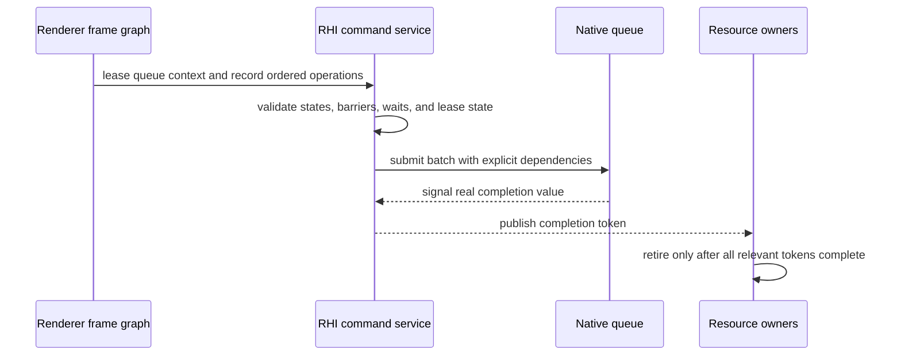

# RHI Command Submission and Synchronization

**Status:** current feature dossier; source-backed, not synchronization, overlap, deadlock, or shutdown evidence

**Verified:** 2026-09-06 at committed `master` revision `8414b5dc`

**Scope:** `RHI-CMD-*`; recording leases/lists, graphics/compute/copy/ray operations, barriers, queue batches, waits, completion tokens, frame identity, and retirement authority

**Current readiness:** **50/100** — recording, submission, waits, tokens, and retirement exist in source; ordering/state/failure/resize/shutdown/native evidence does not. See [Current Feature Readiness](../../../../../../Acceptance/CurrentReadiness.md#rhi-and-gpu-execution).

## At A Glance

| Question | Current answer |
| --- | --- |
| Who decides dependencies and queue preference? | Renderer frame-graph policy declares them; RHI validates and lowers them. |
| What is recorded? | Neutral raster, compute, copy, barrier, diagnostic, and capability-gated ray operations inside one queue-specific lease. |
| What orders queues? | Explicit batch waits plus resource/UAV/alias transitions—not CPU submission order alone. |
| What proves completion? | A real per-queue token and the aggregate token derived from every queue used by the work. |
| What remains unproved? | Cross-backend synchronization correctness, useful overlap, stall/deadlock bounds, failure settlement, and shutdown stress. |

## Submission Lifecycle

Queue assignment is a correctness decision first. A compute or copy queue in a plan says nothing about concurrent hardware execution or performance until timestamp evidence demonstrates it.

## Feature Promise

Validated recorded operations become explicit ordered submissions on capable queues. Dependencies, resource/UAV/alias state, and cross-queue waits are represented before native submission, and aggregate completion is the sole authority for reclaiming shared GPU state.

## Execution And Lifetime

- Device services issue queue-specific recording leases; a lease owns its recording context and temporary upload/descriptor/resource-use state.
- Command lists expose neutral raster, compute, copy, resource-state, diagnostic, and capability-gated ray operations.
- Submission batches carry explicit waits and produce completion tokens. Queue availability does not prove independent hardware execution or useful overlap.
- D3D12 command queues/fences and Vulkan queues/timeline synchronization lower the same ordering contract.
- Renderer frame-graph compilation owns intended dependencies and queue choice; RHI validates and executes that plan without reconstructing render policy.

## Design Decisions And Tradeoffs

| Decision | Benefit | Cost or risk |
| --- | --- | --- |
| Use queue-specific recording leases | Temporary descriptors/uploads and command state get one lifetime owner | Lease misuse must be rejected as a state-machine error |
| Make waits and barriers explicit | Dependencies remain reviewable and backend-neutral | Every producer/consumer hazard must be classified correctly |
| Retire through aggregate completion | Shared resources cannot be freed after only one queue finishes | Slow or failed queues retain state and need bounded failure handling |
| Keep scheduling policy out of RHI | RHI does not duplicate Renderer graph semantics | RHI still needs enough validation to reject impossible native work |

## Acceptance Criteria

- `AC-RHI-CMD-01` — lease acquire/record/close/submit/release has one legal state progression and rejects reuse, double submit, and wrong-queue operations.
- `AC-RHI-CMD-02` — graphics, compute, copy, and ray commands preserve parameters, resource identities, and ordering through native recording.
- `AC-RHI-CMD-03` — transitions, UAV barriers, alias barriers, and cross-queue waits exactly cover producer/consumer hazards without missing or circular dependencies.
- `AC-RHI-CMD-04` — per-queue and aggregate tokens become complete only after their native work; every resource/pipeline/descriptor owner retires from that authority.
- `AC-RHI-CMD-05` — submission failure, device loss, cancellation, stall, and shutdown publish no false completion and reach a bounded diagnosable state.

## Controlled Failures And Checks

| Failure | Safe result | Check |
| --- | --- | --- |
| `FM-RHI-CMD-01` invalid lease state or wrong queue operation | reject before native recording/submission | `CHK-RHI-CMD-01` lease state-machine exercise |
| `FM-RHI-CMD-02` removed wait/barrier or introduced cycle | graph/RHI validation rejects or native validation catches the exact hazard; no silent execution | `CHK-RHI-CMD-02` injected hazard matrix |
| `FM-RHI-CMD-03` submit/device failure or never-signaled work | no completion is fabricated; failure/shutdown path remains bounded and observable | `CHK-RHI-CMD-03` fault and timeout exercise |

Check coverage: `CHK-RHI-CMD-01` covers `AC-RHI-CMD-01`, `AC-RHI-CMD-02`, and `FM-RHI-CMD-01`; `CHK-RHI-CMD-02` covers `AC-RHI-CMD-02`, `AC-RHI-CMD-03`, and `FM-RHI-CMD-02`; `CHK-RHI-CMD-03` covers `AC-RHI-CMD-04`, `AC-RHI-CMD-05`, and `FM-RHI-CMD-03`.

Definition of done: serial/control comparison, multi-queue stress, injected hazards, token/retirement correlation, failure/shutdown, native validation, and both-backend evidence pass.

## Primary Source Routes

- `Engine/RHI/Public/Commands` and `Engine/RHI/Public/Frame`
- common/backend `Commands`, recording resource/upload tables, and device queue composition
- [Renderer Frame Graph and Scheduling](../../../Renderer/Features/FrameExecution/FrameGraphAndScheduling.md)
