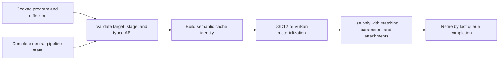

# RHI Pipeline and Shader Contracts

**Status:** current feature dossier; source-backed, not shader ABI, pipeline parity, or runtime evidence

**Verified:** 2026-09-06 at committed `master` revision `8414b5dc`

**Scope:** `RHI-PIPE-*` plus RHI shader bytecode, target, reflection, parameter-layout, and authoring contracts used to materialize graphics and compute pipelines

**Current readiness:** **50/100** — neutral graphics/compute pipeline and backend materialization paths exist; full-key/ABI/capability/native/parity/cache evidence does not. See [Current Feature Readiness](../../../../../../Acceptance/CurrentReadiness.md#rhi-and-gpu-execution).

## At A Glance

| Input | Required agreement | Produced result |
| --- | --- | --- |
| shader bytecode and stage/target identity | selected backend target and declared program stage | backend shader module/bytecode reference eligible for one pipeline |
| reflection and typed parameter layout | binding indices, kinds, arrays, visibility, sizes, and ABI signature | validated binding/pipeline layout |
| render state and attachment descriptions | formats, sample count, vertex layout, raster, depth/stencil, and blend state | complete graphics pipeline identity |
| compute program and layout | compute stage, ABI, and device limits | complete compute pipeline identity |
| shader generation | every cached identity and in-flight owner | old/new generations cannot be mixed or reclaimed early |

The active graphics surface is vertex-plus-pixel, while compute has its own complete descriptor. Geometry, hull, domain, mesh, and task shader vocabulary does not currently form an executable Renderer pipeline.

## Materialization Flow

## Feature Promise

A complete validated neutral descriptor—shader programs, reflected bindings, parameter layout, render/depth formats, geometry layout, raster/depth/stencil/blend state, and sample count—materializes one semantically equivalent native pipeline. RHI does not invent Renderer formats, stages, feature defaults, or fallback policy.

## Identity And Lowering

- `ShaderBytecode`, target/stage identity, reflection, and `PassParameterLayout` define the ABI consumed by pipeline validation.
- Graphics and compute pipeline descriptors own all exposed fixed-function and binding state. Cache identity must include every semantic field and the owning shader generation.
- D3D12 root signatures/PSOs and Vulkan layouts/modules/pipelines are lowerings, not separate feature contracts.
- The current graphics contract binds vertex and pixel programs. Geometry/hull/domain and mesh/task vocabulary is not an active pipeline route.
- Shader authoring macros/types are compile-time contract vocabulary; the ShaderCompiler owns offline compilation/publication and Renderer owns program selection/reload.

## Design Decisions And Tradeoffs

| Decision | Benefit | Cost or risk |
| --- | --- | --- |
| Require complete neutral descriptors | Cache identity and native creation are deterministic and reviewable | Callers must supply every semantic field rather than rely on backend defaults |
| Validate reflected and typed ABI before native creation | Layout defects fail close to their source | Generated metadata and C++ declarations must evolve atomically |
| Lower one contract to both APIs | Backend comparison tests semantics instead of two public designs | D3D12/Vulkan native differences remain substantial implementation work |
| Include shader generation in identity and retirement | Hot replacement cannot mix new metadata with old native pipelines | Reload retains old generations until all GPU users finish |

## Acceptance Criteria

- `AC-RHI-PIPE-01` — every descriptor field that changes semantics changes validated native pipeline identity on both backends.
- `AC-RHI-PIPE-02` — bytecode target/stage, reflection, parameter layout, descriptor layout, vertex input, attachment, and depth/sample state agree before materialization.
- `AC-RHI-PIPE-03` — invalid or unsupported stage/state/format combinations fail before native pipeline use with the exact violated contract.
- `AC-RHI-PIPE-04` — cache reuse occurs only for identical semantic descriptors and shader generations; replacement retires after last queue use.
- `AC-RHI-PIPE-05` — supported graphics/compute fixtures produce equivalent semantic results across backends; inactive stage vocabulary remains unavailable.

## Controlled Failures And Checks

| Failure | Safe result | Check |
| --- | --- | --- |
| `FM-RHI-PIPE-01` wrong shader target/stage or reflection/layout mismatch | neutral validation rejects before native creation | `CHK-RHI-PIPE-01` ABI mutation matrix |
| `FM-RHI-PIPE-02` invalid fixed-function or attachment combination | exact descriptor field is rejected | `CHK-RHI-PIPE-02` pipeline state boundary matrix |
| `FM-RHI-PIPE-03` shader generation swaps with work in flight | old pipeline survives to completion; partial generation never activates | `CHK-RHI-PIPE-03` reload/retirement stress |

Check coverage: `CHK-RHI-PIPE-01` covers `AC-RHI-PIPE-02`, `AC-RHI-PIPE-03`, and `FM-RHI-PIPE-01`; `CHK-RHI-PIPE-02` covers `AC-RHI-PIPE-01`, `AC-RHI-PIPE-03`, `AC-RHI-PIPE-05`, and `FM-RHI-PIPE-02`; `CHK-RHI-PIPE-03` covers `AC-RHI-PIPE-04` and `FM-RHI-PIPE-03`.

Definition of done: descriptor mutation, ABI, cache identity, reload lifetime, native validation, semantic output, and both-backend evidence pass.

## Primary Source Routes

- `Engine/RHI/Public/Pipeline`, `Public/Shaders`, and `Public/ShaderParameters`
- common/backend `Pipeline`, `Shaders`, `ShaderParameters`, and `Validation` implementations
- [Shader System](../../../../../CrossModule/ShaderSystem/README.md) and [Renderer Shader Program Catalog](../../../Renderer/Features/ShaderRuntime/ShaderProgramCatalog.md)
