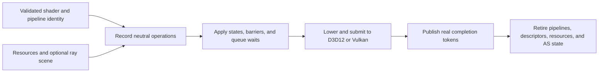

# RHI Pipeline And Execution

**Status:** RHI feature-family index

**Scope:** route immutable pipeline/shader contracts, command recording and submission, synchronization, and ray-tracing execution

This family turns validated shader and state descriptions into ordered native GPU work. It is the bridge between Renderer scheduling intent and D3D12/Vulkan execution.

**Current readiness:** **47/100** family projection — pipeline and command paths are broad while ray execution remains capability-gated; all candidate proof is open. See [Current Feature Readiness](../../../../../../Acceptance/CurrentReadiness.md#rhi-and-gpu-execution).

## At A Glance

| Boundary | Owner | Failure if it is wrong |
| --- | --- | --- |
| program, reflection, bindings, and fixed state form one pipeline identity | pipeline and shader contracts | wrong shader ABI/state or unsafe cache reuse |
| operations enter one legal recording lease and queue batch | command submission | invalid native calls, duplicate submission, or incomplete work |
| barriers and waits express producer/consumer hazards | command submission plus Renderer graph input | stale reads, races, cycles, or false overlap |
| acceleration structures, traversal, pipelines, and SBT records agree | ray tracing | wrong hit/material identity or unsupported dispatch |
| completion tokens retire all referenced generations | command/device lifetime | early destruction, leaks, or fabricated completion |

## Choose By Boundary

| Document | Open it for |
| --- | --- |
| [Pipeline And Shader Contracts](PipelineAndShaderContracts.md) | shader/reflection ABI, complete pipeline identity, validation, caching, and backend lowering |
| [Command Submission And Synchronization](CommandSubmissionAndSynchronization.md) | recording leases, queues, barriers, submits, waits, completion tokens, and shutdown settlement |
| [Ray Tracing](RayTracing.md) | acceleration structures, traversal, SBT contracts, capability gates, providers, and lifetime |

Pipeline identity, queue execution, and ray-tracing capability remain independent contracts even though they meet during command recording. The parent [RHI Feature Dossiers](../README.md) index owns capability routing.

## Shared Design Tension

The neutral contract must be rich enough to express both APIs without exposing native policy to Renderer. More neutral vocabulary improves portability and validation, but vocabulary alone can overstate usable features. Every operation therefore needs a real backend lowering, a capability gate, a current consumer, and completion-safe lifetime before it can support a feature claim.
