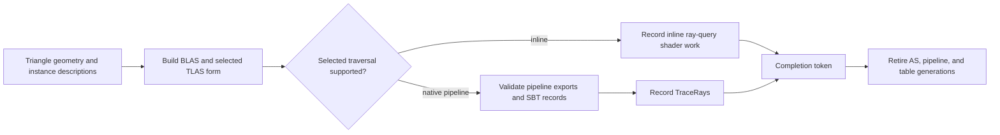

# RHI Ray Tracing

**Status:** current feature dossier; source-backed, not ray correctness, backend parity, vendor support, or performance evidence

**Verified:** 2026-09-06 at committed `master` revision `8414b5dc`

**Scope:** `RHI-RT-*` and RHI-side `RHI-RTC-*`; acceleration structures, inline queries, native pipelines, shader tables, classic TLAS, partitioned TLAS, transforms, capability gates, and native lowering

**Current readiness:** **40/100** — AS, inline, native-pipeline, shader-table, and partitioned vocabulary/routes exist but remain capability-gated and unproved across devices/backends/effects. See [Current Feature Readiness](../../../../../../Acceptance/CurrentReadiness.md#rhi-and-gpu-execution).

## At A Glance

| Capability | Current RHI contract | Does not imply |
| --- | --- | --- |
| triangle BLAS and classic TLAS | neutral geometry/instance descriptions, sizing, build, address, and completion lifetime | procedural geometry, every update/refit mode, or valid Renderer scene mapping |
| inline ray queries | capability-gated traversal from compute/pixel shader contracts | native ray-pipeline support or parity for every effect |
| native ray pipelines | exports, hit groups, pipeline creation, `TraceRays`, and shader-table regions | correct logical record mapping or inline-path equivalence |
| shader binding table (SBT) | alignment, stride, regions, and record bytes | correct Renderer material/instance semantics without the higher-level plan |
| partitioned TLAS | vendor/API/capability-gated provider vocabulary and operations | general PTLAS availability, unrestricted updates, or backend symmetry |

## Ray Work Lifecycle

RHI guarantees native mechanism validity; Renderer owns why a ray is traced and how scene/material identity maps into instances and records.

## Feature Promise

RHI exposes separable capabilities for triangle acceleration structures, inline traversal, native ray pipelines, shader tables, classic TLAS update, and optional partitioned TLAS. Each request succeeds only when its exact contract is complete; one supported ray mechanism never implies support for every Renderer effect.

## Contract Boundaries

- BLAS/TLAS descriptions own geometry, instance identity/mask/flags/transform, build/update intent, addresses, and sizing. Current public geometry is indexed triangles; procedural intersection is not a Renderer path.
- Inline queries and native pipelines are distinct capabilities. Native pipelines own exports/hit groups and raygen/miss/hit/callable SBT regions.
- Classic TLAS and partitioned TLAS are independent services. PTLAS remains vendor/API/capability gated and its public vocabulary exceeds the current Renderer-selected subset.
- RHI owns native object, layout, and command validity. Renderer owns scene mapping, SBT record semantics, effect selection, and fallback/rejection policy.

## Design Decisions And Tradeoffs

| Decision | Benefit | Cost or risk |
| --- | --- | --- |
| Model inline and native traversal separately | Devices/effects can use only the mechanism they actually support | Every shared effect needs semantic parity checks across frontends |
| Keep scene/SBT semantics in Renderer | RHI remains a reusable mechanism layer | Native layout bugs and logical mapping bugs cross an ownership boundary |
| Capability-gate every AS/traversal operation | Unsupported work fails before recording | Support matrices become multi-dimensional by API, adapter, provider, and operation |
| Retire all ray generations by queue completion | Prevents stale AS/pipeline/SBT use | Dynamic scenes can retain large overlapping generations and need bounds |

## Acceptance Criteria

- `AC-RHI-RT-01` — BLAS/TLAS build inputs, transforms, addresses, instance IDs/masks/flags, sizing, update rules, and completion lifetime match on both backends.
- `AC-RHI-RT-02` — inline and native-pipeline capability reports match native features; strict unsupported requests reject before recording.
- `AC-RHI-RT-03` — pipeline exports/hit groups and SBT region alignment/stride/record bytes map every Renderer logical record to the intended native shader record.
- `AC-RHI-RT-04` — classic TLAS update/refit and PTLAS operations activate only for their documented support and never alias unsupported BLAS-refit/procedural/callable feature claims.
- `AC-RHI-RT-05` — shared supported effect fixtures produce equivalent hit/miss/material/visibility semantics for D3D12/Vulkan and inline/native paths within declared tolerances.

## Controlled Failures And Checks

| Failure | Safe result | Check |
| --- | --- | --- |
| `FM-RHI-RT-01` missing feature/extension/export/hit group or malformed SBT | reject before build/dispatch and identify requirement | `CHK-RHI-RT-01` capability/pipeline/SBT mutation matrix |
| `FM-RHI-RT-02` stale BLAS/TLAS/SBT identity during scene change | old state remains alive only to completion; new dispatch cannot consume mismatched records | `CHK-RHI-RT-02` scene churn and retirement stress |
| `FM-RHI-RT-03` PTLAS provider unavailable or operation unsupported | feature reports unavailable; classic/neutral state is not corrupted | `CHK-RHI-RT-03` provider/capability matrix |

Check coverage: `CHK-RHI-RT-01` covers `AC-RHI-RT-02`, `AC-RHI-RT-03`, and `FM-RHI-RT-01`; `CHK-RHI-RT-02` covers `AC-RHI-RT-01`, `AC-RHI-RT-03`, `AC-RHI-RT-05`, and `FM-RHI-RT-02`; `CHK-RHI-RT-03` covers `AC-RHI-RT-04` and `FM-RHI-RT-03`.

Definition of done: AS build/update, SBT decoding, effect semantic parity, unsupported-path rejection, lifetime stress, native validation, named hardware/driver, and both-backend evidence pass.

## Primary Source Routes

- `Engine/RHI/Public/RayTracing` and common/backend `RayTracing` implementations
- backend ray-command and pipeline lowering
- [Renderer Ray Tracing](../../../Renderer/Features/RayTracing/README.md) for effect policy and scene/SBT semantics
