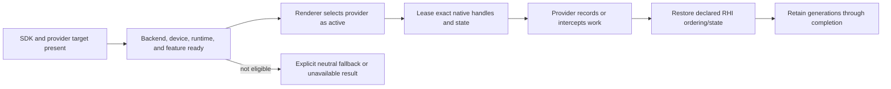

# RHI External Interop

**Status:** current feature dossier; source-backed, not provider compatibility, backend parity, native-state, or package evidence

**Verified:** 2026-09-06 at committed `master` revision `8414b5dc`

**Scope:** `RHI-DIAG-07`; narrow native device/resource/command handles, resource states, capability reporting, and interposer hooks for optional external providers

**Current readiness:** **35/100** — narrow provider/native access seams exist; provider/backend/device/package matrices, misuse rejection, lifetime, and executable evidence remain incomplete. See [Current Feature Readiness](../../../../../../Acceptance/CurrentReadiness.md#rhi-and-gpu-execution).

## At A Glance

| Question | Current answer |
| --- | --- |
| Why does interop exist? | A named optional provider sometimes needs native device, resource, command, state, or present hooks that the neutral RHI cannot express. |
| Who may request it? | A known provider integration with an explicit build/runtime capability path—not arbitrary Renderer code. |
| What is currently active? | D3D12 contains the inspected Streamline interposer/manual seams; Vulkan vocabulary does not establish an equivalent active provider. |
| What must survive the call? | Resource state, queue order, generation identity, provider/device lifetime, and completion-safe retirement. |
| What is not proved? | Provider compatibility, Vulkan parity, resize/reload/device-loss behavior, package contents, and output correctness. |

## Provider Activation And Use

The decisive state is *active provider readiness*, not SDK registration. A provider route that fails eligibility must remain observably inactive.

## Feature Promise

An active external provider receives only the native identity and hooks it requires, with explicit backend, capability, state, queue, generation, and lifetime constraints. Interop is a named escape hatch, not a general native-object API or evidence that an equivalent provider exists on every backend.

## Ownership Boundary

- `RhiInteropService`, native handles, resource-state translation, and interposer hooks are RHI-owned mechanics with named consumers.
- D3D12 currently carries active Streamline interposer/manual seams. Vulkan neutral/native interop types do not imply equivalent active provider support.
- Renderer owns provider selection, required semantic inputs, requested-versus-active fallback, and feature output. RHI owns valid native access and restoration of resource/queue invariants.
- External use cannot bypass generation identity or GPU-completion retirement.

## Design Decisions And Tradeoffs

| Decision | Benefit | Cost or risk |
| --- | --- | --- |
| Keep interop narrow and consumer-named | Native escape hatches do not spread through the Renderer/RHI boundary | Each provider requires explicit integration and evidence |
| Preserve requested-versus-active selection in Renderer | Feature fallback remains semantic and user-visible | RHI cannot decide whether provider absence is acceptable |
| Expose exact state/queue context | External work can coexist with RHI transitions and submissions | Incorrect restoration can corrupt later neutral work |
| Tie handles to device/resource/provider generations | Reload and shutdown cannot use stale native objects | More lifetime coordination across third-party code |

## Acceptance Criteria

- `AC-RHI-INT-01` — interop reports backend, capability, native object identity, resource state, queue/command context, and lifetime accurately for each supported route.
- `AC-RHI-INT-02` — unsupported backend/provider/interposer combinations reject or leave Renderer on its documented neutral fallback; partial external activation never publishes.
- `AC-RHI-INT-03` — external calls preserve RHI state, ordering, ownership, and completion invariants and do not outlive resource/device/provider generations.
- `AC-RHI-INT-04` — manual/interposer paths, reload, resize, device loss, and shutdown produce one active generation and deterministic cleanup.
- `AC-RHI-INT-05` — optional SDK/runtime absence and package contents are explicit and contain no unintended binaries, paths, or capabilities.

## Controlled Failures And Checks

| Failure | Safe result | Check |
| --- | --- | --- |
| `FM-RHI-INT-01` SDK/runtime/hook/native handle unavailable | provider stays inactive with exact prerequisite; neutral path remains valid | `CHK-RHI-INT-01` capability/package matrix |
| `FM-RHI-INT-02` stale resource/device/provider generation | call rejects before external use; old generation retires by completion | `CHK-RHI-INT-02` reload/resize/device churn |
| `FM-RHI-INT-03` external call leaves wrong state/order | integration/native validation fails before publication | `CHK-RHI-INT-03` state/queue capture matrix |

Check coverage: `CHK-RHI-INT-01` covers `AC-RHI-INT-01`, `AC-RHI-INT-02`, `AC-RHI-INT-05`, and `FM-RHI-INT-01`; `CHK-RHI-INT-02` covers `AC-RHI-INT-03`, `AC-RHI-INT-04`, and `FM-RHI-INT-02`; `CHK-RHI-INT-03` covers `AC-RHI-INT-01`, `AC-RHI-INT-03`, and `FM-RHI-INT-03`.

Definition of done: provider activation/fallback, native state capture, generation stress, device/resize/shutdown, package audit, and all applicable backend evidence pass.

## Primary Source Routes

- `Engine/RHI/Public/Interop`
- backend `Interop`, device external-feature capabilities, and D3D12 interposer hooks
- [Renderer Image Reconstruction and Upscaling](../../../Renderer/Features/PostProcessing/ReconstructionAndGeneration/ImageReconstructionAndUpscaling.md)
