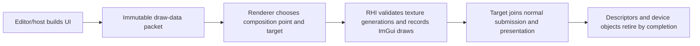

# RHI ImGui Rendering

**Status:** current feature dossier; source-backed, not UI image, clipping, DPI, lifetime, or backend-parity evidence

**Verified:** 2026-09-06 at committed `master` revision `8414b5dc`

**Scope:** `RHI-DIAG-08`; backend-specific ImGui device objects, font/texture descriptors, draw-data lowering, clip rectangles, recording, resize, and shutdown lifetime

**Current readiness:** **40/100** — both backend UI-lowering source paths exist; packet/texture/generation/color/DPI/failure/retirement and Shipping-product evidence does not. See [Current Feature Readiness](../../../../../../Acceptance/CurrentReadiness.md#rhi-and-gpu-execution).

## At A Glance

| Input or state | RHI responsibility | Outside this dossier |
| --- | --- | --- |
| immutable ImGui draw data | lower vertices, indices, draw ranges, clip rectangles, textures, blend state, and target recording | widget behavior and editor interaction |
| font and registered texture handles | own backend descriptors and completion-safe generations | which viewport/product the texture semantically represents |
| target/back-buffer generation | bind the matching native render target and viewport/scissor | scene tone mapping and presentation policy |
| resize/rebuild/shutdown | replace affected native objects and retire old ones safely | host layout, input routing, or multi-window product policy |

## Composition Flow

RHI performs draw lowering only. Keeping widgets and composition policy above this layer avoids a backend-specific UI system, but it requires immutable packets and explicit texture-generation handoff.

## Feature Promise

The active backend renders immutable ImGui draw data and registered texture handles into the intended target while preserving draw order, clipping, blending, color interpretation, descriptor lifetime, and frame completion. RHI owns backend lowering only; Editor and Renderer own UI state and composition policy.

## Ownership And Lifetime

- `RhiImGuiRenderer` is the neutral device-facing seam. D3D12 and Vulkan adapters own their native ImGui backend objects and descriptors.
- Renderer owns packet capture/replay timing and scene/UI ordering. Editor owns widgets, viewport composition requests, and texture registration intent.
- Font and registered texture descriptors survive every frame that references them and retire only after GPU completion.
- Resize, swapchain rebuild, shader/provider reload, and shutdown cannot reuse stale native descriptor or render-target identity.

## Design Decisions And Tradeoffs

| Decision | Benefit | Cost or risk |
| --- | --- | --- |
| Consume immutable draw data | Backend recording cannot race live widget mutation | Packet capture/replay consumes memory and needs strict frame identity |
| Use backend-native ImGui adapters | Proven native draw lowering stays localized | D3D12 and Vulkan descriptor/object lifetimes differ internally |
| Register textures through typed handles | UI cannot directly own arbitrary native descriptors | Stale-handle rejection and generation churn need visible behavior |
| Compose within normal frame submission | UI shares synchronization and presentation lifetime | Scene/UI color and order must be explicitly defined above RHI |

## Acceptance Criteria

- `AC-RHI-UI-01` — canonical UI fixtures preserve draw order, index/vertex offsets, clip rectangles, texture selection, blending, and color on both backends.
- `AC-RHI-UI-02` — font/device objects and registered texture bindings have explicit generations and completion-safe lifetime across frame overlap.
- `AC-RHI-UI-03` — resize, swapchain rebuild, viewport texture replacement, and shutdown invalidate only affected native objects without stale use or leaks.
- `AC-RHI-UI-04` — invalid/stale texture handles and malformed draw data reject or omit the affected draw visibly; they never sample an unrelated descriptor.
- `AC-RHI-UI-05` — UI observer/composition cost and package/runtime availability are measured or classified for the supported product routes.

## Controlled Failures And Checks

| Failure | Safe result | Check |
| --- | --- | --- |
| `FM-RHI-UI-01` invalid or stale texture descriptor | affected draw rejects/omits with diagnostics; no unrelated texture is sampled | `CHK-RHI-UI-01` descriptor churn fixture |
| `FM-RHI-UI-02` resize/rebuild while frames are in flight | old objects retire by completion and new generation renders correctly | `CHK-RHI-UI-02` resize/lifetime stress |
| `FM-RHI-UI-03` backend object creation or recording failure | frame reports failure; no partial UI success is published | `CHK-RHI-UI-03` injected backend failure |

Check coverage: `CHK-RHI-UI-01` covers `AC-RHI-UI-01`, `AC-RHI-UI-02`, `AC-RHI-UI-04`, and `FM-RHI-UI-01`; `CHK-RHI-UI-02` covers `AC-RHI-UI-02`, `AC-RHI-UI-03`, and `FM-RHI-UI-02`; `CHK-RHI-UI-03` covers `AC-RHI-UI-04`, `AC-RHI-UI-05`, and `FM-RHI-UI-03`.

Definition of done: image comparisons for order/clip/texture/blend/color, descriptor/generation stress, resize/shutdown, cost, native validation, and both-backend evidence pass.

## Primary Source Routes

- `Engine/RHI/Public/UI/RhiImGuiRenderer.h`
- `Engine/RHI/Private/D3D12/UI` and `Engine/RHI/Private/Vulkan/UI`
- [Renderer UI and Viewport Composition](../../../Renderer/Features/ViewportAndDiagnostics/UiAndViewportComposition.md)
