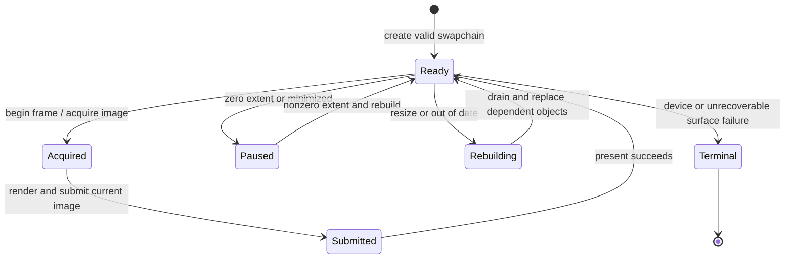

# RHI Presentation

**Status:** current SDR feature dossier plus first-release HDR10 collaboration boundary; source-backed absence is not HDR or release evidence

**Verified:** 2026-09-06 at committed `master` revision `8414b5dc`

**Scope:** `RHI-PRES-*`; swapchain construction, back-buffer identity/state, acquire, resize, frame count, pacing, VSync, submit/present, and RHI mechanics for the admitted HDR10 target

**Current readiness:** **50/100** for the current SDR scope — acquire/resize/present routes exist for both backends; executable pacing, failure, parity, format, and packaged evidence does not. HDR output is separately **0/100**, first-release admitted, and Blocked under `FCR-REN-26`. See [Current Feature Readiness](../../../../../../Acceptance/CurrentReadiness.md#rhi-and-gpu-execution).

## At A Glance

| State | Observable behavior | Important boundary |
| --- | --- | --- |
| ready window and swapchain | acquire exposes one current back buffer and generation | acquiring is not presenting; identity must reach the submitted frame |
| normal frame | submit finishes rendering, then present advances the visible surface | success requires the current frame/present result, not a prior image |
| VSync or pacing request | backend activates, rejects, or reports the effective mode | configuration intent is not proof of timing behavior |
| resize/minimize/out-of-date | pause/drain and replace swapchain-dependent objects without replacing the device | this is presentation recovery, not whole-device recovery |
| device or surface failure | exact failure reaches a recoverable presentation state or bounded terminal path | no stale back buffer may be reported as a fresh present |
| HDR request | unavailable in current source; admitted target | SDR swapchain support does not imply an HDR surface/color-space contract; the discovery-blocked target is [HDR Display Output](../../../Renderer/Features/PostProcessing/DisplayPipeline/HDRDisplayOutput/README.md) |

## Swapchain Lifecycle

## Feature Promise

For a valid native window and supported configuration, RHI owns one swapchain lifecycle that acquires a current back buffer, exposes its neutral render state, submits/presents it in order, and rebuilds safely on size changes. Current source is SDR-oriented. The admitted target extends that same owner with HDR capability discovery, compatible format/color-space activation, static metadata, transitions, and truthful fallback; Renderer retains color-transform policy.

## Ownership And Lifecycle

- Presentation defaults and runtime request determine back-buffer count, frames in flight, VSync, and related neutral configuration within documented bounds.
- Backend swapchains own native buffers, views, acquisition state, present mode/flags, and pacing primitives.
- Resize/minimize must settle or preserve in-flight ownership before replacing buffers; a zero-sized window is not a renderable surface.
- Renderer owns what color it writes and when UI composition occurs. RHI owns swapchain format/state and present mechanics, not tone mapping or output encoding policy.

## Design Decisions And Tradeoffs

| Decision | Benefit | Cost or risk |
| --- | --- | --- |
| Separate Renderer encoding from RHI presentation | Color policy does not become API-specific | End-to-end SDR/HDR evidence must join two owners |
| Treat back buffers as generated identities | Resize cannot silently leave stale views in flight | Consumers must propagate and invalidate the generation |
| Drain only the presentation-dependent boundary when possible | Resize can recover without rebuilding the whole device | Incorrectly retained swapchain resources cause stalls or stale use |
| Expose requested and active pacing modes | Unsupported configuration is visible | Backend timing policies differ and need measured evidence |

## Acceptance Criteria

- `AC-RHI-PRES-01` — create/acquire/render/submit/present preserves back-buffer index, frame identity, state, and completion ordering across supported buffer/frame counts on both backends.
- `AC-RHI-PRES-02` — resize, minimize/restore, rapid resize, surface loss, and shutdown replace or retain native buffers without stale views, use-after-free, deadlock, or fabricated presentation.
- `AC-RHI-PRES-03` — VSync and pacing requests produce the documented active mode and observable fallback/rejection; measurements record backend/device configuration.
- `AC-RHI-PRES-04` — device/present failure is surfaced with recoverable state or bounded shutdown; the prior frame is not reported as a new success.
- `AC-RHI-PRES-05` — until `FCR-REN-26` is implemented, HDR requests remain explicitly unavailable; completion requires the linked `AC-HDR-*` format/color-space/metadata, transition, fallback, Renderer-transform, backend, hardware, and display evidence.

## Controlled Failures And Checks

| Failure | Safe result | Check |
| --- | --- | --- |
| `FM-RHI-PRES-01` zero/invalid extent or lost surface | no new back-buffer work; wait/rebuild/failure is explicit | `CHK-RHI-PRES-01` resize/minimize/surface-loss loop |
| `FM-RHI-PRES-02` present/device error | exact failure propagates; no success counter/identity advances | `CHK-RHI-PRES-02` injected backend failure |
| `FM-RHI-PRES-03` unsupported pacing/VSync or HDR capability/activation failure | requested-versus-active/fallback result is explicit; HDR preserves a valid SDR presentation route | `CHK-RHI-PRES-03` mode/capability matrix plus `CHK-HDR-*` |

Check coverage: `CHK-RHI-PRES-01` covers `AC-RHI-PRES-01`, `AC-RHI-PRES-02`, and `FM-RHI-PRES-01`; `CHK-RHI-PRES-02` covers `AC-RHI-PRES-02`, `AC-RHI-PRES-04`, and `FM-RHI-PRES-02`; `CHK-RHI-PRES-03` covers `AC-RHI-PRES-03`, `AC-RHI-PRES-05`, and `FM-RHI-PRES-03`.

Definition of done: long resize/minimize/restore runs, buffer/frame-count matrices, pacing measurements, device-loss behavior, native validation, color/format checks, and both-backend evidence pass.

## Primary Source Routes

- `Engine/RHI/Public/Presentation`
- `Engine/RHI/Private/D3D12/SwapChain` and `Engine/RHI/Private/Vulkan/SwapChain`
- [Renderer Presentation and Output](../../../Renderer/Features/PostProcessing/DisplayPipeline/PresentationAndOutput.md)
