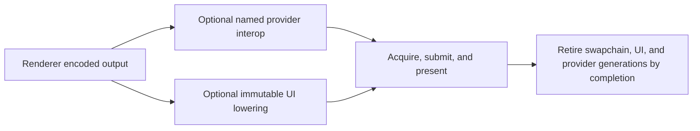

# RHI Presentation And Interop

**Status:** RHI feature-family index

**Scope:** route window presentation, immutable ImGui lowering, and deliberately narrow external-native integration

This family owns the final native boundaries around a frame: putting the encoded image on a window, adding already-built UI draw data, and temporarily exposing native objects to a named external provider.

**Current readiness:** **43/100** family projection — SDR presentation and UI lowering are integrated, while interop is narrow/capability-gated and HDR/device-recovery proof is absent. See [Current Feature Readiness](../../../../../../Acceptance/CurrentReadiness.md#rhi-and-gpu-execution).

## At A Glance

| Route | Normal input | Observable result | Principal limitation |
| --- | --- | --- | --- |
| presentation | encoded Renderer output and a valid window/swapchain | current frame is acquired, submitted, and presented | SDR only; resize/pacing/device-loss evidence remains open |
| ImGui lowering | immutable draw packet plus registered texture generations | UI draws join the intended target and frame | RHI does not own widgets, layout, input, or composition policy |
| external interop | eligible provider plus exact native device/resource/command state | provider call participates in ordered GPU work | narrow D3D12/provider path; no general Vulkan parity claim |

## Choose By Boundary

| Document | Open it for |
| --- | --- |
| [Presentation](Presentation.md) | swapchain acquisition, state, resize/minimize, pacing, VSync, present, and device-loss boundary |
| [ImGui Rendering](ImGuiRendering.md) | immutable draw-data lowering, textures/descriptors, clipping, blend/color behavior, and completion lifetime |
| [External Interop](ExternalInterop.md) | native identity/state/hooks, provider eligibility, generation, fallback, and package boundary |

Presentation owns swapchain images, ImGui owns UI command lowering, and interop owns exceptional external access. The parent [RHI Feature Dossiers](../README.md) index owns capability routing.

## Shared Risks

- Resize and minimize replace presentation identity while older frames may remain in flight.
- UI textures and provider-native handles must not outlive their resource/device generation.
- Provider availability and a successful present do not prove Renderer color correctness.
- HDR remains absent but HDR10 activation is a mandatory first-release target under Renderer-owned `FCR-REN-26`; broad native access and equivalent provider support across backends remain explicit non-capabilities.
