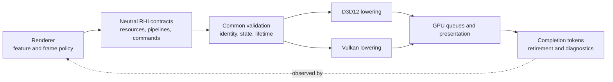
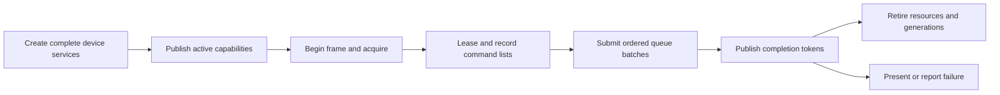

# Render Hardware Interface

**Status:** module index and current-system reading route; not executable backend or release evidence

**Scope:** route backend-neutral GPU contracts, D3D12/Vulkan lowering, and each independently reviewable RHI capability to one documentation owner

**Current-state basis:** source and build configuration inspected 2026-09-06 at committed `master` revision `8414b5dc`

**Current readiness:** **45/100** portfolio average (`I/R` present; `V/D = 0/0`); all six tracked RHI families remain Blocked. See [Current Feature Readiness](../../../../Acceptance/CurrentReadiness.md#rhi-and-gpu-execution).

The Render Hardware Interface (RHI) translates backend-neutral GPU work into one active D3D12 or Vulkan implementation. It owns GPU mechanisms; Renderer owns what those mechanisms mean for a frame.

> [!IMPORTANT]
> **Current state:** D3D12 and Vulkan source paths cover device creation, resources, descriptors, pipelines, commands, ray tracing, presentation, diagnostics, and capture.
>
> **Readiness:** **45/100** — broad source paths exist, but there is no candidate-bound backend execution, native-validation, parity, or delivery evidence.
>
> **Main limitation:** No current candidate has proved the backend matrix with builds, device runs, native validation, parity, fault injection, performance, or packaged operation.
>
> **Evidence:** Source/build configuration was inspected through 2026-09-06. This page does not claim that either backend currently passes executable acceptance.

## At A Glance

| You have | You do not have yet |
| --- | --- |
| One neutral service surface with separate D3D12 and Vulkan lowerings | Accepted D3D12/Vulkan feature parity or minimum-hardware matrix |
| Resource/view/sampler creation, upload/readback, allocation, aliasing, and retirement contracts | Proved allocation-pressure, aliasing, delayed-completion, and leak behavior |
| Descriptor layouts/writes, graphics/compute/ray pipelines, commands, queues, barriers, waits, and tokens | Complete boundary/capacity/invalid-use and native-validation results |
| BLAS/TLAS, inline ray queries, native ray pipelines and shader tables, plus partitioned-TLAS vocabulary/path | Accepted support matrix across devices, backends, traversal modes, and dynamic geometry |
| Swapchain acquire/resize/present, ImGui rendering, external interop, diagnostics, and texture capture | Implemented HDR presentation, broad external-native access, or whole-device recreation after device loss; HDR10 is an admitted target only |

## Where RHI Sits

Renderer expresses semantic work; RHI validates neutral contracts and lowers them to exactly one backend.

The binding ownership decision is [Renderer And RHI](../../../Decisions/RendererRhiBoundary.md).

## GPU Work Lifecycle

A frame is safe only when resource, descriptor, pipeline, command, and retirement identity all refer to compatible generations and actual queue completion.

## Feature Families

| Family | What it owns | Main open boundary | Read next |
| --- | --- | --- | --- |
| Device and resources | backend selection, adapter/device aggregate, capabilities, resources, memory, descriptors, creation/destruction | partial-create cleanup, pressure, capacity, delayed completion, device loss | [Device And Resources](Features/DeviceAndResources/README.md) |
| Pipeline and execution | shader/pipeline ABI, command recording, queue submission/waits/tokens, ray tracing | invalid combinations, synchronization, parity, SBT/AS capability and retirement | [Pipeline And Execution](Features/PipelineAndExecution/README.md) |
| Presentation and interop | swapchain, acquire/resize/present, pacing, UI lowering, narrow provider-native access | resize/device-loss behavior, admitted-but-absent HDR10 activation, interop/provider/package restrictions | [Presentation And Interop](Features/PresentationAndInterop/README.md) |
| Diagnostics and capture | names, events, timestamps, native validation/crash facts, live objects, asynchronous readback | attribution, delivery bounds, observer cost, format correctness, fault evidence | [Diagnostics And Capture](Features/DiagnosticsAndCapture/README.md) |

The [RHI Feature Guide](Features/README.md) maps every public service and source directory to one of these contracts.

## Backend And Capability Snapshot

| Capability | D3D12 | Vulkan | Important qualification |
| --- | --- | --- | --- |
| Device, queues, resources, views, samplers | Implemented source path | Implemented source path | Actual format/queue/capability support comes from the selected device |
| Descriptor binding | Implemented source path | Implemented source path | Capacity, recording lifetime, and semantic equivalence remain unproved |
| Graphics and compute pipelines/commands | Implemented source path | Implemented source path | Shader/reflection ABI and native validation remain open |
| Inline ray queries | Capability-gated path | Capability-gated path | Requires reported ray-query and descriptor capabilities |
| Native ray pipelines and shader tables | Capability-gated path | Capability-gated path | Native object/table layout and cross-backend semantic parity remain open |
| Partitioned TLAS | Narrow capability/provider path | Narrow capability/provider path | Renderer exercises a restricted subset; do not infer general update/refit support |
| Swapchain and SDR presentation | Implemented source path | Implemented source path | resize and pacing evidence open |
| HDR10 format/color-space/metadata activation | First-release target; not found | First-release target; not found | owned by Renderer `FCR-REN-26` with RHI backend mechanics |
| External provider interop | Narrow capability-gated path | No general equivalent claim | Native access is provider-specific and deliberately not a general escape hatch |
| Diagnostics and texture capture | Implemented source path with backend differences | Implemented source path with backend differences | Availability, format, fault correlation, and observer cost need executable proof |

Use the [Capability Inventory](CapabilityInventory.md) for exact `RHI-*` cells and limits. `Implemented source path` does not mean a backend passed.

## Ownership Boundary

RHI owns:

- device, adapter, queue, and capability truth;
- resources, formats, memory, descriptors, pipelines, commands, barriers, submission, and completion;
- native D3D12/Vulkan translation;
- acceleration structures, traversal mechanisms, shader tables, presentation, diagnostics, capture, and narrow interop.

RHI does not own:

- scene, view, material, lighting, post-processing, or debug semantics;
- which Renderer feature should activate or which fallback is acceptable;
- frame-graph feature ordering or user-facing quality policy;
- evidence that a rendered result is visually correct or shippable.

Public contracts live under `Engine/RHI/Public`. Common validation and neutral implementation live in non-backend `Engine/RHI/Private` paths. `Private/D3D12` and `Private/Vulkan` own real API differences. `Engine/RHI/CMakeLists.txt` remains executable membership authority.

## Design Decisions And Tradeoffs

| Decision | Benefit | Cost or drawback |
| --- | --- | --- |
| Keep the public surface backend-neutral | Renderer can express one semantic operation for D3D12 and Vulkan | Lowest-common-denominator pressure and explicit capability branches |
| Report capabilities instead of branching on backend names | Feature selection follows actual device support | Capability accuracy becomes a startup-critical invariant |
| Use opaque handles/generations and completion tokens | Prevent direct native-object coupling and early retirement | More identity validation and deferred lifetime bookkeeping |
| Centralize command/submission lifetime | Queue waits, batches, and retirement have one authority | Incorrect token propagation can affect many resource families |
| Keep native interop narrow and provider-specific | Optional SDKs can integrate without contaminating core contracts | Some provider features remain backend/vendor/package restricted |
| Treat device loss as terminal while swapchain resize is recoverable | Avoid pretending incomplete whole-device recreation is safe | A real device loss currently terminates the rendering session |
| Maintain two full backend lowerings | Exposes portability and API design defects | Every feature adds implementation, validation, parity, and maintenance work twice |

## Known Limitations And Failure Boundaries

- No backend, adapter, driver, or minimum-hardware matrix has accepted executable evidence.
- Device loss has diagnostics and terminal handling, but no complete whole-device recreation path.
- HDR presentation is absent but its Windows HDR10 backend mechanics are mandatory first-release work under Renderer-owned `FCR-REN-26`.
- Optional provider interop is not a general native API surface and does not imply Vulkan/provider parity.
- Public vocabulary can be broader than current Renderer consumers; unused or partial modes must remain unreachable or explicitly classified.
- Ray tracing and partitioned acceleration remain capability-gated and narrower than the neutral vocabulary may suggest.
- Allocation, descriptor, queue, readback, resize, shutdown, and delayed-completion failure behavior still needs focused evidence.

## Evidence And Reference

| Need | Document |
| --- | --- |
| Exact implementation states, limits, and backend rows | [RHI Capability Inventory](CapabilityInventory.md) |
| Cohesive feature mechanisms and local acceptance | [RHI Feature Guide](Features/README.md) |
| Cross-backend Renderer feature comparison | [Graphics Feature Coverage](../../../CrossModule/GraphicsCoverageMatrix.md) |
| Request-to-command-to-retirement traces | [Graphics Feature Execution Traces](../../../CrossModule/FeatureExecutionTraces.md) |
| Smallest missing RHI checks | [RHI Evidence Plan](../../../../Plans/CapabilityEvidence.md#rhi-capability-to-evidence-map) |
| Candidate and release disposition | [Feature Completion Reports](../../../../Acceptance/FeatureCompletionReports.md) and [First Release](../../../../Acceptance/FirstRelease.md) |
| Rules for changing an RHI contract or backend | [RHI Engineering](../../../../Engineering/Modules/RHI.md) |

Do not infer backend support from a class or enum alone. Verify the neutral declaration, common validation, backend lowering, CMake membership, real Renderer consumer, capability selection, failure path, and completion lifetime together.
