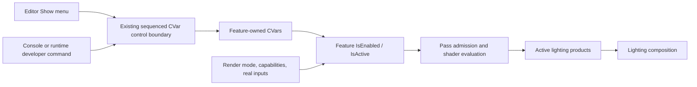

# Lighting Show Menu And Feature Execution Controls

**Status:** target execution contract; seven console controls and hierarchical Editor Show menu source-integrated; current lighting execution evidence requires reconciliation

**Current readiness:** no seven-control/menu completion score is claimed. Bounded Stage-5 results belong to [Discovery](../Discovery.md#current-candidate-evidence-and-permission); family progress remains owned by the [Renderer readiness row](../../../../../../../Acceptance/CurrentReadiness.md#renderer).

**Responsibility:** define how the Editor Show menu drives feature CVars and how feature-owned activation removes lighting and shadow work without introducing Renderer show-flag state.

**Authority boundary:** [Plan](../Plan.md#dvp-4---add-lighting-show-flags) owns delivery order; [Discovery](../Discovery.md) owns implementation authorization; [Acceptance](../Acceptance.md) owns proof contracts; the [Lighting family](../../Lighting/README.md) owns transport and lobe semantics. [Research](../Research.md#unreal-engine) is precedent, not authority for this CVar design.

**Verified:** 2026-10-05 against dirty `410d05ef`. The Stage-7 menu has bounded serial/threaded executable UI/control evidence. Changes to lighting schemas during this iteration contradict earlier selected execution snapshots; [Discovery](../Discovery.md#stage-7-ui-admission) records the remaining reconciliation. Code and build configuration remain the implementation authority.

**Non-claims:** this design does not prove compilation, shader cooking, runtime behavior, pixels, backend parity, saved GPU time, or release acceptance.

The Editor's **Show** menu is a convenient frontend for turning Renderer features on and off. Turning a lighting component off should stop its exclusive evaluation, tracing, output writes, and dependent work wherever the selected rendering path permits—not calculate the effect and multiply its finished result by zero.

## Current Gap And Delivery Scope

The following execution description records the admitted Stage-2–6 candidate contracts and selected evidence. It must not be read as proof for the subsequently changed schemas: [Stage-7 reconciliation](../Discovery.md#stage-7-ui-admission) identifies the current contradictions. Menu/control behavior below has its own bounded executable result. Repair and replay the affected execution owners before carrying their omission/guide claims to the new candidate.

The Lit direct family produces three separate products and the indirect family produces two, with runtime early evaluation/write gates. All-direct-off and all-indirect-off omit their reservoir histories, working reservoirs and exclusive evaluation/tracing/reuse/resolve chains. Both retain their actual render-extent radiance targets and current-frame zero initialization for the fixed composition/visualization ABI. Composition has one shader; visualization selects the lobe through the existing View uniform. Disabled lobes contribute zero, including in their raw diagnostic, without declining viewport execution. Active indirect resolve writes requested reconstruction guides. When every indirect lobe is disabled and Ray Reconstruction is selected, the reconstruction owner dispatches a surface-guide pass over the actual GBuffer; it writes material albedos and roughness and records no indirect specular hit. No indirect tracing, reservoir history or reuse is retained for that consumer. A Show edit never rejects the selected rendering configuration or substitutes a provider. Previous variant-based native omission results do not validate this repaired candidate.

The current non-Reference diagnostic modes still enter the real-time Lit middle before visualization. A future GBuffer-only path is not claimed here: discovery must map admission and downstream dependencies for the actual selected route rather than assume the mode label already prunes lighting.

| Editor leaf | Existing production seam | Target execution owner |
| --- | --- | --- |
| Direct / Diffuse | `DirectDiffuse` | direct-lighting evaluation and its exclusive work |
| Direct / Specular | `DirectSpecular` | direct-lighting evaluation and its exclusive work |
| Direct / Subsurface | `DirectSubsurface` | direct subsurface evaluation and its exclusive work |
| Indirect / Diffuse | `IndirectDiffuse` | Lit indirect estimator, resolve, and dependent state |
| Indirect / Specular | `IndirectSpecular` | Lit indirect estimator, resolve, and dependent state |
| Indirect / Subsurface | no admitted product or consumer | blocked on `IND-D0-02` and a real product |
| Shadows / Direct Shadows | `ShadowVisibilitySignal` and primary direct-light evaluation | direct shadow-signal production and visibility consumer |
| Shadows / Indirect Shadows | secondary-hit direct-light visibility in Lit indirect transport | indirect estimator's visibility evaluation |

The initial scope is seven real leaves. Do not add an Indirect Subsurface CVar, UI row, resource, or zero-producing placeholder before the owning [lobe-classification decision](../../Lighting/IndirectLighting/TransportAndEstimator.md#lobe-classification) admits the product. All three Direct leaves are currently implemented: their default-enabled feature CVars remove exclusive evaluation and resolve writes through the same early uniform branches, retain intentional radiance initialization for fixed consumer bindings, reset dependent histories, and leave disabled raw diagnostics displaying the initialized zero contribution. All-direct-off removes the exclusive family chain and rebuilds/retire its cached graph through the existing lifetime route. [Discovery](../Discovery.md#current-candidate-evidence-and-permission) records the bounded native result and next permitted stage; this is not menu, active-provider, later-control or measured GPU-savings completion.

Direct Shadows remains owned by Shadows. Disabling `r.Lighting.Shadows.Direct` omits the visibility tracing producer. While Direct evaluation is admitted, its single shader retains a real initialized signal binding; a uniform branch bypasses the signal load and evaluates visibility as one. Retained shadow intent stays inactive while all direct leaves are off. Re-enable restores tracing; missing allocated or produced input fails. Direct reservoirs and indirect visibility remain independent consumers. The inactive binding is initialization for the fixed ABI, not a produced diagnostic or guide.

## One Control Authority

The menu edits the same feature CVars as the console. It does not maintain a viewport-local bit set or a second gate combined with those CVars. These CVars are process-global: a Show edit affects every viewport using the relevant Lit path. Independent per-viewport feature controls are not provided by this design.



The important boundary is from control mutation to feature execution. Renderer knows its feature CVars and prerequisites, not Editor labels, menu groups, or show flags. `RenderViewMode` still travels through the ordinary viewport request and immutable View; this slice adds no `RenderShowFlag`, `RenderShowFlagSet`, `ViewportRenderRequest::ShowFlags`, or `RenderView::showFlags`.

### Feature CVars

Each implemented leaf has one feature-owned boolean CVar, defaulting to enabled:

| CVar | Work requested when enabled |
| --- | --- |
| `r.Lighting.Direct.Diffuse` | primary direct diffuse contribution |
| `r.Lighting.Direct.Specular` | primary direct specular contribution |
| `r.Lighting.Direct.Subsurface` | primary direct subsurface contribution |
| `r.Lighting.Indirect.Diffuse` | Lit indirect diffuse contribution |
| `r.Lighting.Indirect.Specular` | Lit indirect specular contribution |
| `r.Lighting.Shadows.Direct` | primary-surface direct-light shadow visibility |
| `r.Lighting.Shadows.Indirect` | direct-light shadow visibility at secondary hits in Lit indirect transport |

`r.Lighting.Indirect.Subsurface` is added only with its real product. Parent rows are bulk actions over leaves, not parent CVars or another enablement authority. Example developer commands use the existing console syntax:

```text
SetCVar r.Lighting.Direct.Specular 0
SetCVar r.Lighting.Shadows.Indirect 0
```

Editor resolves and queries registered CVars through the existing Core console/control interface; it must not include Renderer-private CVar headers or add an Application feature-translation chain. No custom feature registry or Renderer Show-menu API is required. A missing expected registration is a configuration defect, not an unchecked or fabricated-disabled leaf.

### Scene Rendering Controls

The same Show menu also edits these scene-wide controls, each defaulting to enabled:

| CVar | Prepared scene or rendering work |
| --- | --- |
| `r.Sky.Enabled` | sky background and environment illumination, including indirect bounces, reflections, and Reference Path Tracer transport |
| `r.Meshes.Static` | static primitives in raster visibility, ray geometry, and emissive light sampling |
| `r.Meshes.Skinned` | skeletal primitives and their deformation, raster visibility, ray geometry, and emissive light sampling |
| `r.Lighting.Lights.Directional` | directional light records |
| `r.Lighting.Lights.Point` | point light records |
| `r.Lighting.Lights.Spot` | spot light records |
| `r.Lighting.Lights.Rect` | rectangular area light records |

Common Show Flags contains Sky, Static Meshes, and Skinned Meshes. Light Types contains Directional Lights and the Local Lights submenu. Local Lights' All action edits Point, Spot, and Rect together through one existing control batch; it has no separate parent CVar. Use Defaults enables all fourteen implemented leaves. These controls remain editable in every mode; no configuration-support filter hides or disables them. Decal rendering is not implemented and has no fabricated menu row.

Mesh admission belongs to `Scene/Geometry/MeshRenderingControls`; light-type admission belongs to `Scene/Lighting/LightRenderingControls`. Scene preparation excludes disabled records before deformation, visibility, and ray/light payload preparation while retaining authored scene objects and stable GPU scene slots. Ray hit-payload caching includes the actual prepared work membership, so changing these controls rebuilds omitted hit data on re-enable without requiring an authored scene revision.

Sky owns `r.Sky.Enabled`. Scene preparation combines it with the authored sky enablement into the existing prepared sky state and shared global Sky shader data. The shared radiance sampler returns zero before sampling the environment when disabled. Lit omits the sky color and sky motion passes; its scene-color clear initializes black and the lighting composite writes only surface pixels. Reference transport consumes the same disabled environment state. Existing scene identities observe the filtered geometry, lights, and sky enablement to invalidate ReSTIR and Reference histories. Worker preparation, immutable frame submission, and submission-token retirement retain their existing owners.

### Publication And Observation

Live mutation must use a proved sequenced owner boundary before Renderer reads feature CVars. The inspected plain CVar storage/direct setter is not evidence of thread safety. Discover and repair the existing CVar delivery owner if needed; do not hide a race behind request/View copies or a parallel settings bag.

Apply parent/reset edits as one ordered batch before a frame's feature admission, not as separate frames with partially changed children. Feature admission, shader parameters, graph identity, and history invalidation for that frame must observe the same accepted values. Do not reread mutable policy independently partway through a frame. If application is delayed, distinguish requested from applied state through the existing control acknowledgment; do not show requested state as already executing. Console changes refresh the menu through that same authority, not through an independently retained Editor selection.

## IsEnabled And IsActive

Feature folders own their CVars and activation helpers. Extend an existing cohesive feature control/settings file when possible; add a focused activation file only when that responsibility needs an independent owner. Do not put a collection of lighting predicates in `FramePipeline`, `RendererHost`, the generic frame graph, Application, Editor, or RHI.

**Direct access, no value cache:** feature code uses ordinary `cvar.Get()` and `cvar.Set()` against one authoritative value. Read the CVar at the feature's frame boundary; do not introduce a resolved-feature settings body, persistent read model, render-thread shadow value, sink-maintained copy or cached activation boolean. Ordered live edits execute between frames, so feature admission and parameter setup can read that same accepted value directly. Temporary edit text, control replies and required GPU parameters are boundary data, not retained CVar authority. A previous topology/history identity may detect a change, but must never supply the current feature value or bypass its `Get()`.

The required distinction is:

```text
IsEnabled = the accepted feature CVar requests this work
IsActive  = IsEnabled AND this path supports the work
                      AND its real execution prerequisites are satisfied
```

`IsEnabled()` does not include capabilities or current mode. `IsActive(context)` is side-effect-free and adds the owning path/mode, backend/implementation support, active consumers, and actual prerequisite products. Both belong to the feature; the context contains only existing canonical inputs required for that decision, not a generic settings snapshot. Helper names may include the feature/lobe name where necessary to make the call unambiguous.

| Requested state | Prerequisites | Required behavior |
| --- | --- | --- |
| disabled | irrelevant | inactive by intent; omit exclusive work |
| enabled | applicable path and prerequisites satisfied | active; schedule the real producer |
| enabled | unrelated path, such as GBuffer-only inspection or Reference | inactive for that path; no claim that the feature executes there |
| enabled | required implementation/input missing on an applicable path | explicitly unavailable or broken through the existing failure owner; never success with a zero/stale/replacement product |

An activation early return is not permission to conceal a broken required producer. The admission owner must distinguish inapplicability/user disablement from a requested-but-unavailable feature. Use existing feature/capability and product failure paths; do not add a diagnostic manager for this distinction.

Optional feature entry points call their own `IsActive` and return before declaring exclusive resources or passes. High-level scene/frame composition keeps ordinary `Add...Passes` calls; it does not acquire one activation branch per leaf. Shared-work admission stays with the closest existing family owner. Its aggregate predicate is derived from actual active consumers, never stored as a parent feature gate.

## Editor Interaction

Open **Show** beside the current view-mode button. **Use Defaults** appears first and enables all implemented leaves in one batch. The menu uses section headings and semantic Editor icons: **Common Show Flags** contains Sky, Static Meshes, and Skinned Meshes; **Light Types** contains Directional Lights and Local Lights; **Lighting Components** contains Direct Lighting and Indirect Lighting submenus; **Lighting Features** contains Shadows. Each submenu has an **All** bulk toggle followed by its implemented leaves. All has a left check when every child is enabled and a dash for a partial selection; checked or mixed disables the group, unchecked enables it. Toggles keep the menu open for repeated edits. Leaf tooltips name the corresponding console variable and global scope. Checks describe acknowledged intent, not current-frame GPU completion. The grouped presentation takes inspiration from [Unreal's Viewport Show Flags](https://dev.epicgames.com/documentation/unreal-engine/viewport-show-flags-in-unreal-engine), while Sparkle lists only its implemented controls.

The Show popup is anchored below its toolbar and uses the [shared Editor menu pattern](../../../../Editor/README.md#ui-implementation-boundary). Root and child widths follow their labels and column gutters independently; no fixed popup width or enlarged menu font is imposed. Root submenu rows omit the unused check column; child toggles have separate left check and muted icon columns. `ViewportShowMenu` owns only the rendering presentation groups and CVar queries/commands. Shared `UiUtil` widgets own sizing, styling, sections, and marks; they retain native ImGui selection, keyboard navigation, and popup lifetime.

The menu queries the existing synchronous Core executor only while open. It has no retained selection; console edits appear on the next draw. Missing registrations/types suppress the editable hierarchy and show a defect; rejected edits keep the prior authoritative values and show the operation error until a successful retry. These process-global controls remain editable in every view mode; host interaction locks still disable the menu. Renderer owns whether the selected path consumes a feature and whether its diagnostic product is available. The menu does not receive a view-mode selector or decide feature admission.

`ViewportTopPanel` places the Show button; its private `ViewportShowMenu` owns labels, hierarchy, interaction, keyboard navigation, and a concise shared-scope tooltip. It reads leaf checks from CVar requested state, including console changes. It does not put selection into `EditorViewportSession` or advance viewport-request generation for a CVar edit; the existing control publication invalidates the affected rendering work.

Console and menu clients receive only the generic control request/result capability, not Renderer or execution-control implementation objects. Application binds that capability and owns simulation/UI-packet/render sequencing. The console host owns its overlay lifetime and returns presentation data; it never submits or renders frames. Client callbacks are destroyed before their implementation owner. This is the [AC-DVP-30](../Acceptance.md#completion-criteria) boundary, not a new service or forwarding layer.

Each submenu's **All** row derives checked/mixed/unchecked state from all/any/none of its implemented children being enabled. Clicking that row when checked or mixed disables all those children; clicking it when unchecked enables all. **Use Defaults** enables all implemented leaves in one batch. There is no saved mixed-selection restore, parent state, or persisted Editor mirror. Toggling Shadows does not change lighting-lobe CVars, and toggling a lighting group does not change retained shadow intent.

Lit and Lit-shaded Wireframe consume the lighting-lobe and shadow controls. Mesh, analytic light-type, and Sky controls also affect the prepared scene consumed by Reference transport. Inspection modes consume their relevant scene inputs; editing global intent can affect other viewports without making the inspected path consume an unrelated lighting feature. Never mutate CVars just because the mode changes. A lighting-lobe diagnostic observes the current execution product: a disabled lobe displays its current-frame zero contribution. There is no separate feature-support gate in the Editor, scene orchestration or product publication.

## Execution And Product Contract

The old `Show(component) * completedComponent` composition is rejected. Composition consumes only products admitted by the selected feature path. Removing a lobe takes effect before its exclusive evaluation and publication, not after producing it.

| Production shape | Disabled behavior | Cost that can remain |
| --- | --- | --- |
| dedicated pass/family | skip its producer and exclusive dependent passes/resources | work required by other active consumers |
| lobes share one dispatch | uniform branch before disabled lobe evaluation and writes | shared GBuffer loads, sampling, and dispatch overhead |
| transport/reservoir work is shared | omit exclusive lobe work; remove the shared chain only when no active consumer needs it | valid sampling, traversal, reservoir work needed by remaining lobes |

Use runtime-uniform branches for live evaluation and output policy. This slice has one registered shader per operation; no family-presence, shadow-policy or guide-write permutations are admitted. Genuine inline-query and native ray-pipeline traversal programs retain their existing stage-specific contracts. Keep control storage and parameter preparation in their feature owners; Frame consumes semantic intent/topology and must not acquire leaf switches, per-viewport flag storage or policy mirrors.

### Direct And Indirect Lighting

- Disabling a direct lobe bypasses its response math and exclusive output writes. When every direct lobe is inactive, omit direct-light evaluation and reservoir/shadow work exclusively needed by it. Preserve shared work another active consumer actually requires.
- Disabling an indirect lobe affects the estimator, resolve, dependent reconstruction work, and histories—not merely the resolve output. Primary-lobe classification, sampling probabilities, PDFs, reservoir target/weights, and reconstruction-guide meaning must remain valid for active contributions. An indirect specular leaf is not permission to remove every specular bounce on a diffuse-classified path; the [Indirect Lighting](../../Lighting/IndirectLighting/README.md) owner decides which transport work belongs exclusively to that contribution.
- When every indirect lobe is inactive, omit the Lit indirect trace/reservoir/resolve chain and its exclusive dependent work. Preserve guide production or other work only where a separately active consumer genuinely needs it; missing mandatory guides make that selected consumer unavailable, not an invitation to silently change denoiser/provider.
- The menu does not disable GBuffer generation, emissive surface evaluation, sky, exposure, tone mapping, or presentation. Their owners retain separate contracts. Never misclassify emission/sky required by an active indirect path as an optional disabled lobe.

### Shadows

- **Direct Shadows off:** omit primary direct-light shadow visibility production when no other active consumer requires it, and evaluate primary direct lighting as fully visible (`visibility = 1`) without sampling the retained initialized signal. If a shared estimator requires shadow data, discovery must prove the narrowed route before claiming removal; do not keep unnecessary tracing solely to preserve a diagnostic.
- **Indirect Shadows off:** bypass the shadow visibility trace for direct-light samples at secondary hits in the Lit estimator and use visibility `1`. Preserve continuation intersections, hit reconstruction, emitter hits, environment termination, and the active path's material transport. These intersections define the indirect path; they are not optional shadow rays.
- **Shadows parent off:** applies both leaf changes in one batch. It does not disable ambient occlusion, GBuffer occlusion data, transport intersections, or the Reference estimator.
- A shadow CVar can remain enabled while its lighting owner is inactive. `IsEnabled` preserves intent; `IsActive` is false without a relevant active lighting consumer. Re-enabling lighting activates shadows only if the shadow CVar and prerequisites allow it.

The implemented indirect shadow leaf is `r.Lighting.Shadows.Indirect` (default true), owned by Lit `IndirectLightingControls`. Ordinary pass parameters carry `RestirIndirectTraceSecondaryShadows` through initial, reuse and resolve evaluations. One explicit policy reaches the secondary direct-light accumulator before visibility tracing; it does not alter continuation or proposal PDFs. Retained intent enters the existing reservoir/provider invalidation hash. Reference uses its independent required `PathVisibility` route, not this Lit helper. Candidate-bound execution proof lives in [Discovery](../Discovery.md#current-candidate-evidence-and-permission).

Reference Path Tracer ignores these Lit execution CVars until its owner accepts a separate contribution/visibility contract. Do not alter shared tracing helpers so Lit indirect-shadow policy leaks into Reference. The policy argument belongs to the Lit caller; the Reference caller retains its required transport.

### No Stale Or Missing Reads

Prefer omitting inactive resources, UAV writes, SRV reads, and shader bindings through the feature's explicit active-product contract. Composition sums active contributions and separately owned emissive; it does not read missing resources and multiply them by zero.

If a selected fixed-output ABI genuinely requires retained targets, the feature must explicitly define an intentional disabled-zero output and initialize it for the current frame. Account for initialization/allocation cost and invalidate histories that could repopulate it. Such initialization represents a user-disabled contribution, never a replacement for an enabled feature's missing producer. It may not fabricate reconstruction guides or satisfy a raw diagnostic as if the feature ran. Simply skipping a UAV write while a later consumer reads the previous frame is invalid.

Every read still has one real scheduled producer or an explicitly declared intentional disabled-output producer. The [required-product standard](../../../../../../../Engineering/Modules/Renderer.md#required-render-products) continues to reject dummy resources, clear-as-success fixes, null-binding fallbacks, and stale-history reuse for requested features.

## Graph Lifetime And Histories

The [accepted admission ledger](../Discovery.md#accepted-admission-ledger) describes graph-generation/retirement changes and runtime-uniform early shader branches. Its historical unavailable-guide and disabled-diagnostic decisions are superseded by the 2026-10-06 correction: every flag combination remains valid, disabled diagnostic outputs are zero, and Ray Reconstruction retains genuine surface guides when indirect lighting is off. Frame execution and resource retirement remain owned by the existing frame pipeline; no flag-specific scheduler or publication veto is introduced.

Retain accepted CVar-derived values only when required by graph topology identity, a frame/pass ABI, or temporal invalidation. Such a value is a feature-owned lifecycle fact, not another editable authority. Do not add a global resolved show mask or route feature values through viewport requests/settings to trigger rebuilding. Rebuilding finishes before execution of the affected frame; old in-flight GPU resources/graphs retire through their existing fence-based lifetime.

Enabling, disabling, or changing an active lobe/shadow evaluation invalidates every dependent reservoir, reconstruction, accumulation, confidence, and guide history before reuse. Discovery names exact owners and reset scope for each control; reset only affected state unless a shared estimator requires a family reset. Do not keep disabled producers running to keep history warm. Re-enable starts with valid fresh inputs and a reset generation, never stale shadowed/unshadowed or different-lobe samples.

## Costs, Evidence, And Rejected Shapes

The target removes exclusive work and permits topology changes; it does not promise proportional GPU-time savings from shared estimators. Prove pass/dispatch omission, absent lobe evaluation/writes, shadow-ray bypass, and valid active outputs separately. Only a repeatable GPU capture/timing comparison at the same scene, path, resolution, backend, and provider configuration supports a saved-cost claim. Disclose remaining shared work and disabled-output initialization costs.

Rejected shapes include:

- Renderer show-flag enums/sets, request/View show state, or any `r.ShowFlags.*` namespace;
- per-viewport checkbox truth ANDed with global feature CVars;
- parent CVars, a generic feature manager, dynamic registry, or settings bag;
- activation branches duplicated in `FramePipeline`, host, Application, or RHI;
- finished lighting multiplied by a visibility flag as the disable mechanism;
- disabled producers kept alive for raw diagnostics or warm histories;
- skipping writes without removing reads or explicitly initializing intentional disabled outputs;
- unsupported enabled work presented as successful zero output or silently selecting another implementation/provider;
- conflating indirect continuation rays with shadow visibility or leaking Lit policy into Reference;
- premature Indirect Subsurface controls or unproved performance claims.

## Implementation And Evidence Route

[DVP-4](../Plan.md#dvp-4---add-lighting-show-flags) orders feature-owned execution slices. [Discovery](../Discovery.md) must first authorize sequenced CVar edits, frame/graph consistency, shared-estimator semantics, product admission, and history invalidation. [Acceptance](../Acceptance.md) defines negative checks, pixel oracles, advertised-backend runs, and performance evidence. No production implementation or acceptance result is added by this document.
