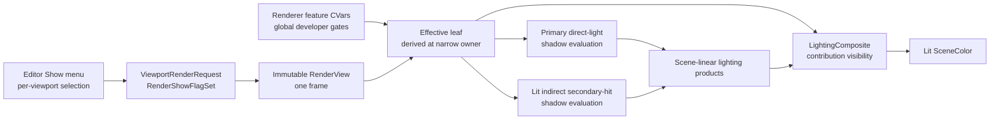

# Renderer Show Flags

**Status:** target architecture; not implemented

**Current readiness:** **0/100 — target only** for the show-flag slice. The existing Debug Views feature remains tracked separately by the [Renderer readiness row](../../../../../../../Acceptance/CurrentReadiness.md#renderer).

**Responsibility:** define the enduring semantics, ownership, lifetime, CVar interaction, Editor hierarchy, and narrow Renderer consumers of independently selectable per-view lighting contributions and shadow evaluation.

**Authority boundary:** [Plan](../Plan.md#dvp-4---add-lighting-show-flags) owns delivery order and integration ledgers; [Acceptance](../Acceptance.md) owns criteria, failures, and checks; [Research](../Research.md#unreal-engine) owns external precedent; the [Lighting family](../../Lighting/README.md) owns lobe and transport semantics.

**Verified:** 2026-10-04 against revision `26803f97` and the inspected dirty working tree. Current code and build configuration remain the implementation authority.

**Non-claims:** this page does not prove compilation, shader cooking, runtime reachability, pixels, D3D12/Vulkan behavior, performance, or release acceptance.

## Purpose And Current Gap

Show flags let an artist or developer hide one lighting contribution or bypass one class of shadow evaluation in a Lit viewport without changing the selected `RenderViewMode`. The Editor presents a compact hierarchical **Show** menu, while Renderer retains the rendering meaning and consumes immutable per-view state.

The current Lit route already produces five independently composited scene-linear products. The requested sixth product, indirect subsurface, does not exist and is not yet admitted by the Indirect Lighting transport contract.

| Group | Leaf | Current consumer | Target control |
| --- | --- | --- | --- |
| Direct Lighting | Diffuse | `LightingComposite` reads `DirectDiffuse` | first delivery slice |
| Direct Lighting | Specular | `LightingComposite` reads `DirectSpecular` | first delivery slice |
| Direct Lighting | Subsurface | `LightingComposite` reads `DirectSubsurface` | first delivery slice |
| Indirect Lighting | Diffuse | `LightingComposite` reads `IndirectDiffuse` | first delivery slice |
| Indirect Lighting | Specular | `LightingComposite` reads `IndirectSpecular` | first delivery slice |
| Indirect Lighting | Subsurface | no product or consumer found | blocked on `IND-D0-02` and a real product |
| Shadows | Direct Shadows | primary-surface direct lighting consumes `ShadowVisibilitySignal` | first delivery slice after invalidation/parameter probe |
| Shadows | Indirect Shadows | Lit indirect path lighting traces direct-light visibility from secondary hits | first delivery slice after invalidation/parameter probe |

The first delivery slice therefore targets seven real controls: five contribution leaves plus Direct Shadows and Indirect Shadows. It does not add an `IndirectSubsurface` enum value, CVar, UI row, resource, or zero-producing placeholder. The final eight-leaf target becomes valid only after the owning [lobe-classification decision](../../Lighting/IndirectLighting/TransportAndEstimator.md#lobe-classification) defines and produces that contribution.

The shadow leaves do not mean “skip all rays.” **Direct Shadows** changes only the visibility applied to primary-surface direct lighting. **Indirect Shadows** changes only direct-light visibility evaluated while shading secondary hits in the Lit indirect estimator. Continuation rays still intersect scene geometry because those intersections define the indirect path itself; treating them as optional shadow rays would change the transport domain rather than expose a show flag.

The current generic console path also mutates registered CVar storage directly. The inspected source does not prove that a live `SetCVar` write and Renderer-thread read form a sequenced, race-free publication boundary. The implementation plan treats that as a prerequisite audit and blocks live feature CVars rather than copying mutable CVar values through viewport state as a workaround.

## How The Control Fits

The important distinction is scope: the Editor selection is per viewport; each CVar is a process-global developer gate. They meet only at the narrow Renderer consumer for the selected leaf and are not copied into a second resolved settings object.



The diagram shows two intentional inputs with different scopes, not two authorities for the same state. Editor owns what its viewport requests. Each feature CVar owns a global developer gate. The named Renderer consumer derives the effective value without retaining another mutable copy:

```text
effective leaf = per-view flag enabled AND global feature CVar enabled
```

## Typed Per-View Contract

Renderer Public owns a fixed enum and compact value type because Editor and Game/runtime viewport owners submit the same rendering semantic:

```cpp
enum class RenderShowFlag : std::uint8_t
{
	DirectDiffuse = 0,
	DirectSpecular,
	DirectSubsurface,
	IndirectDiffuse,
	IndirectSpecular,
	DirectShadows,
	IndirectShadows,
	Count,
};

class RenderShowFlagSet final
{
public:
	static RenderShowFlagSet AllEnabled() noexcept;

	bool IsEnabled(RenderShowFlag flag) const noexcept;
	void SetEnabled(RenderShowFlag flag, bool enabled) noexcept;
	bool operator==(const RenderShowFlagSet&) const noexcept = default;

private:
	std::uint8_t m_bits = 0;
};
```

`IndirectSubsurface` is inserted only with its real product and consumer. No persisted or shader-visible numeric contract may depend on the interim ordering.

`ViewportRenderRequest::ShowFlags` carries the final per-viewport selection and defaults to `AllEnabled()`. `RenderViewBuilder` copies it into `RenderView::showFlags` at the existing immutable frame-publication boundary. This copy is justified by request/thread lifetime isolation; it is resolved once per frame and never written back.

The type exposes only the operations required by viewport editing, equality, View freezing, and focused lighting consumption. Do not add reflection, string lookup, a dynamic registry, serialization, a metadata table, a generic settings bag, or an RHI representation.

## Global CVar Gates

Each implemented leaf has one Renderer-private boolean CVar, defaulting to enabled. The existing console parser accepts `1/0` as well as `true/false`; examples use the compact `1/0` developer form:

| CVar | Feature behavior gated when `false` |
| --- | --- |
| `r.Lighting.Direct.Diffuse` | composite direct diffuse |
| `r.Lighting.Direct.Specular` | composite direct specular |
| `r.Lighting.Direct.Subsurface` | composite direct subsurface |
| `r.Lighting.Indirect.Diffuse` | composite indirect diffuse |
| `r.Lighting.Indirect.Specular` | composite indirect specular |
| `r.Lighting.Shadows.Direct` | primary-surface direct-light shadow visibility |
| `r.Lighting.Shadows.Indirect` | direct-light shadow visibility inside Lit indirect transport |

`r.Lighting.Indirect.Subsurface` is registered only when the corresponding product lands.

The CVars are feature-owned live developer policy, not show-flag storage, per-view transport, scalability settings, or persisted Editor rendering settings. Their names describe the Renderer feature they gate and therefore contain no `ShowFlags` namespace. A global CVar mutation must reach Renderer through a proved sequenced owner-thread boundary. Each contribution gate is read at `LightingComposite` parameter preparation; each shadow gate is read at the corresponding direct- or indirect-light parameter-preparation owner. The owner combines it with `RenderView::showFlags`. No CVar value or resolved effective mask is copied through `ViewportRenderRequest`, `RenderView`, graph settings, Application, Editor settings, or RHI merely to reach a pass.

There is no parent Direct Lighting, Indirect Lighting, or Shadows CVar. A stored parent gate would create ambiguous parent-off/child-on state. Console users set the feature CVars explicitly, for example:

```text
SetCVar r.Lighting.Direct.Specular 0
SetCVar r.Lighting.Shadows.Direct 0
```

The console's existing CVar query is the observable state for global developer gates. The Editor menu presents only its viewport-local selection and does not claim to mirror global CVar state.

## Editor Show Menu

Editor adds a dedicated **Show** dropdown beside **Viewmode**. View Mode remains the mutually exclusive rendered view; Show contains independent contribution visibility and shadow evaluation.

The final hierarchy is:

```text
Show
└─ Lighting
   ├─ [x/-] Direct Lighting
   │  ├─ [x] Diffuse
   │  ├─ [x] Specular
   │  └─ [x] Subsurface
   ├─ [x/-] Indirect Lighting
   │  ├─ [x] Diffuse
   │  ├─ [x] Specular
   │  └─ [x] Subsurface
   └─ [x/-] Shadows
      ├─ [x] Direct Shadows
      └─ [x] Indirect Shadows

   Reset Lighting Show Flags
```

The first delivery shows the three Direct Lighting rows, the two implemented Indirect Lighting rows, and both Shadows rows. It does not advertise the blocked Indirect Subsurface row.

`EditorViewportSession` owns the mutable viewport-local `RenderShowFlagSet`. `ViewportTopPanel` owns labels, indentation, checkbox state, tooltips, keyboard navigation, and the parent actions. `ViewportPanel` remains the only publisher of `ViewportRenderRequest`; one leaf or parent action updates the session and advances the request generation exactly once when the submitted set changes.

### Parent behavior

Parent state is derived from its available children:

| Children enabled | Parent state |
| --- | --- |
| none | unchecked |
| some | mixed/indeterminate |
| all | checked |

Clicking a parent when any child is enabled disables all available children. Clicking it when none are enabled enables all available children. This makes **Direct Lighting**, **Indirect Lighting**, and **Shadows** reliable one-click hide/show actions without storing parent flags. A bulk action publishes one changed set, not one request per child.

### Leaf and reset behavior

Clicking a leaf changes only that viewport's corresponding bit. **Reset Lighting Show Flags** enables every implemented per-view leaf; it does not mutate global CVars. Changing `RenderViewMode` retains the viewport selection.

The menu remains visible for discoverability, but lighting rows are interactive only when the selected mode consumes Lit lighting composition:

- `Lit` and the current Lit-shaded `Wireframe` mode consume the flags;
- GBuffer and GPU-scene diagnostic modes retain and ignore them; lighting-lobe diagnostics retain contribution-visibility bits but show the lighting products generated under the active shadow-evaluation bits;
- Reference Path Tracer retains and ignores them until it owns an explicitly separable contribution contract.

When flags do not apply, Editor disables the group and states the mode limitation. It does not alter the stored selection or imply that a diagnostic product was suppressed.

## Renderer Consumption Semantics

`LightingComposite` is the only consumer of the five contribution-visibility leaves because it is the existing point where the independent scene-linear products meet. For each contribution, it supplies the shader with the effective boolean derived from the immutable View bit and the matching global feature CVar.

The final target composition is:

```text
Lit =
    Show(DirectDiffuse) * DirectDiffuse +
    Show(DirectSpecular) * DirectSpecular +
    Show(DirectSubsurface) * DirectSubsurface +
    Show(IndirectDiffuse) * IndirectDiffuse +
    Show(IndirectSpecular) * IndirectSpecular +
    Show(IndirectSubsurface) * IndirectSubsurface +
    Emissive
```

The first delivery omits the nonexistent final term. Emissive, sky, exposure, tone mapping, denoisers, reconstruction quality, algorithm selection, and backend capability remain outside the contribution-visibility vocabulary.

Lighting producers and histories continue running when a contribution is hidden. Composition suppression therefore preserves raw lighting diagnostics, reconstruction inputs, temporal continuity, and immediate re-enable behavior. Skipping producer work would change topology and history semantics and requires a separately measured design; it is not part of this target.

The shadow leaves have different consumers because they alter lighting evaluation rather than hide completed products:

- when Direct Shadows is disabled, primary-surface direct lighting uses visibility `1` instead of the sampled `ShadowVisibilitySignal`; the signal pass remains scheduled and its raw diagnostic product remains unchanged;
- when Indirect Shadows is disabled, direct-light samples evaluated at secondary hits in the Lit indirect estimator use visibility `1`; path-continuation traces, emitter hits, environment termination, material response, and lobe classification remain unchanged;
- Reference Path Tracer always supplies enabled shadow evaluation and ignores the viewport show-flag bits until it owns a separately accepted control contract;
- any temporal reservoir, reconstruction, accumulation, or confidence state whose estimator input changes with Indirect Shadows must reset through its existing per-view invalidation owner. Stale shadowed and unshadowed histories may not mix.

Shadow toggles preserve graph topology in the first delivery. They do not justify pruning the direct shadow-signal pass or indirect trace work, and they are debugging controls rather than a performance claim.

## Owner, Producer, Consumer, And Lifetime

| Fact | Authority | Producer / mutation | Consumer | Lifetime |
| --- | --- | --- | --- | --- |
| flag vocabulary and bit semantics | Renderer Public viewport contract | compile-time definition | viewport owners, View builder, focused lighting consumers | executable generation |
| viewport-local selection | `EditorViewportSession` or equivalent runtime viewport owner | user/runtime action | `ViewportPanel` request publication | viewport session |
| submitted selection | `ViewportRenderRequest::ShowFlags` | viewport request owner | `RenderViewBuilder` | request generation |
| immutable frame selection | `RenderView::showFlags` | `RenderViewBuilder` | lighting composite and direct/indirect shadow-evaluation owners | one prepared frame/frame slot |
| global developer gate | Renderer-private feature CVar beside its consumer | sequenced console/settings control | corresponding parameter-preparation owner | process / current CVar value |
| effective contribution visibility | `LightingComposite` | derived during parameter preparation | lighting-composite shader | one pass preparation/dispatch |
| effective direct-shadow evaluation | direct-lighting owner | derived during parameter preparation | primary-surface direct-light shader | one pass preparation/dispatch |
| effective indirect-shadow evaluation | Lit indirect-lighting owner | derived during parameter preparation | secondary-hit direct-light evaluation | one indirect frame evaluation; invalidates dependent history when changed |

The request-to-View value copy is the only added state projection across the rendering path. Parent states, effective gates, and UI labels are derived and are not stored as parallel truth.

## Design Decisions And Costs

- **Fixed leaves instead of a registry:** keeps ownership and removal bounded, at the cost of editing the enum and Editor presentation when a real contribution is added.
- **Derived parent actions:** avoid contradictory group state, at the cost of not preserving a previous mixed selection after a group is re-enabled.
- **Per-view selection plus global CVar gates:** supports viewport-local investigation and console-wide developer isolation, at the cost of two intentionally visible scopes; neither pretends to mirror the other.
- **Composite suppression instead of producer pruning:** preserves diagnostics and histories, at the cost of continuing GPU work for hidden contributions.
- **Feature-named CVars instead of show-flag-named CVars:** keeps global policy with the feature it controls and allows console-only diagnosis, at the cost of documenting that CVar and viewport scopes intentionally differ.
- **Shadow bypass at the visibility consumer:** retains graph topology and the raw direct-shadow signal, at the cost of continuing visibility work and requiring explicit indirect-history invalidation.
- **No early Indirect Subsurface placeholder:** keeps the UI and API truthful, at the cost of adding that lighting row only after its transport semantics exist.

## Boundaries And Rejected Shapes

The following remain prohibited:

- parent flags or parent CVars;
- Editor writes to process-global CVars for ordinary Show-menu actions;
- CVar values copied through request/View/settings records;
- `r.ShowFlags.*` CVars or another global mirror of the per-view set;
- direct CVar reads outside the narrow feature consumer, visualization passes, or RHI;
- show flags used as `RenderViewMode`, algorithm, quality, provider, capability, or requested-product selectors;
- a dynamic flag registry, string API, generic feature manager, or shader-global settings buffer;
- producer or trace pruning in the first delivery;
- treating indirect continuation intersections as optional “shadow” tests;
- sharing the Lit indirect-shadow toggle with Reference Path Tracer by accident;
- a no-op or fabricated-zero `IndirectSubsurface` path.

## Implementation And Evidence Route

Use [DVP-4 in the delivery plan](../Plan.md#dvp-4---add-lighting-show-flags) for prerequisites, change maps, integration-hook and copy ledgers, stages, stop conditions, and non-goals. Use the [feature-local acceptance contract](../Acceptance.md) for the binary criteria, controlled failures, oracles, backend matrix, and evidence boundary. External precedent and its permitted/non-permitted transfers remain in [Research](../Research.md#unreal-engine).
