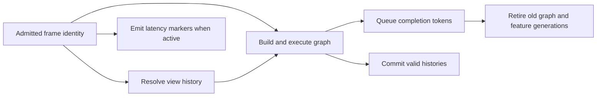

# Renderer Frame Execution

**Status:** Renderer feature-family index

**Scope:** route the independently maintained contracts that turn admitted frame state into scheduled work, coherent temporal state, and correctly ordered latency coordination

Frame execution keeps three forms of identity aligned: the work graph for this frame, the previous-frame state needed by temporal consumers, and the host/provider markers used to observe latency.

**Current readiness:** **43/100** family projection — frame admission/graph/history are broadly integrated while latency coordination is narrower; executable equivalence, failure, cost, and delivery proof is absent. See [Current Feature Readiness](../../../../../../Acceptance/CurrentReadiness.md#renderer).

## At A Glance

| Contract | Starts with | Produces | Main open risk |
| --- | --- | --- | --- |
| frame graph | resolved feature/topology settings and current bindings | ordered passes, resources, barriers, queue batches, and retirement tokens | aliasing, multi-queue, parallel-recording, and rebuild equivalence |
| temporal state | view/scene/frame/provider generations and camera/extents | one jitter/current/previous/history-validity contract | invalidation gaps and temporal consumer disagreement |
| latency coordination | one host logical frame ID and provider readiness | ordered simulation, submission, and present markers | host misuse, D3D12-only provider path, frame-ID narrowing, and unmeasured benefit |

## Choose By Problem

| Document | Open it for |
| --- | --- |
| [Frame Graph And Scheduling](FrameGraphAndScheduling.md) | graph declaration, compilation, queues, dependencies, resource lifetime, execution, and completion |
| [Temporal Sampling And History](TemporalSamplingAndHistory.md) | per-view sample identity, jitter, previous transforms, invalidation, motion, reprojection, and temporal consumers |
| [Latency Coordination](LatencyCoordination.md) | simulation/render markers, provider readiness, ordering, fallback, and measurable latency boundaries |

These contracts share frame identity and ordering but remain separate because graph topology, temporal continuity, and latency-provider coordination have different owners and proof obligations. The parent [Renderer Feature Dossiers](../README.md) index owns capability routing.

## Family Invariants

- One admitted frame identity must survive preparation, recording, submission, temporal commit, and diagnostics.
- Graph failure cannot commit history or publish partial feature products.
- Recording concurrency and queue assignment must not change semantic output.
- Optional latency-provider work must remain distinguishable from ordinary frame completion and presentation.
