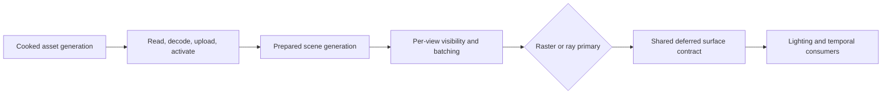

# Renderer Geometry And Resources

**Status:** Renderer feature-family index

**Scope:** route the resource-residency and surface-contract documents that carry immutable asset generations into renderable geometry and material products

This family answers three separate questions: whether the correct asset generation is resident, whether a prepared instance should draw for this view, and what deferred surface values that draw must produce.

## At A Glance

| Stage | Input | Output | Explicit boundary |
| --- | --- | --- | --- |
| residency | immutable cooked mesh/texture generation | completion-safe active GPU resources | fixed budgets; no general pressure-driven streaming policy |
| visibility and draw preparation | prepared scene plus one view | deterministic visible indices and compatible batches | CPU frustum path; no occlusion, LOD, GPU-driven, indirect, stereo, or multiview path |
| geometry/material frontend | active resources and batches plus raster/ray selection | shared GBuffer, depth, motion, and identity products | opaque/alpha-tested triangle scope; transparency and advanced lobes incomplete |

## Choose By Question

| Document | Open it for |
| --- | --- |
| [Mesh And Texture Residency](MeshAndTextureResidency.md) | admission, preparation, upload, active generations, budgets, fallback, eviction, and completion-safe retirement |
| [Visibility And Draw Preparation](VisibilityAndDrawPreparation.md) | visibility policy, culling and LOD boundaries, sorting, draw classification, batching, failure, and explicit unsupported cases |
| [Geometry, Materials, And GBuffer](GeometryMaterialsAndGBuffer.md) | geometry/frontend coverage, material semantics, GBuffer products, limits, and raster/ray agreement |

Residency owns whether a resource generation is safely active. Visibility owns which prepared instances and batches proceed. Geometry/material documentation owns how an active visible generation becomes a surface result. None may borrow another's acceptance claim. The parent [Renderer Feature Dossiers](../README.md) index owns capability routing.

## Shared Design Tension

The family tries to reuse immutable geometry/material identity across raster and ray paths while keeping view-specific rejection out of scene ownership. That reduces duplicate semantic state, but it makes generations, deformation continuity, batch compatibility, and raster/ray agreement explicit cross-stage proof obligations.
