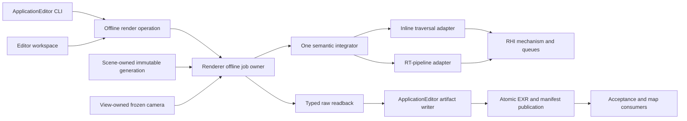
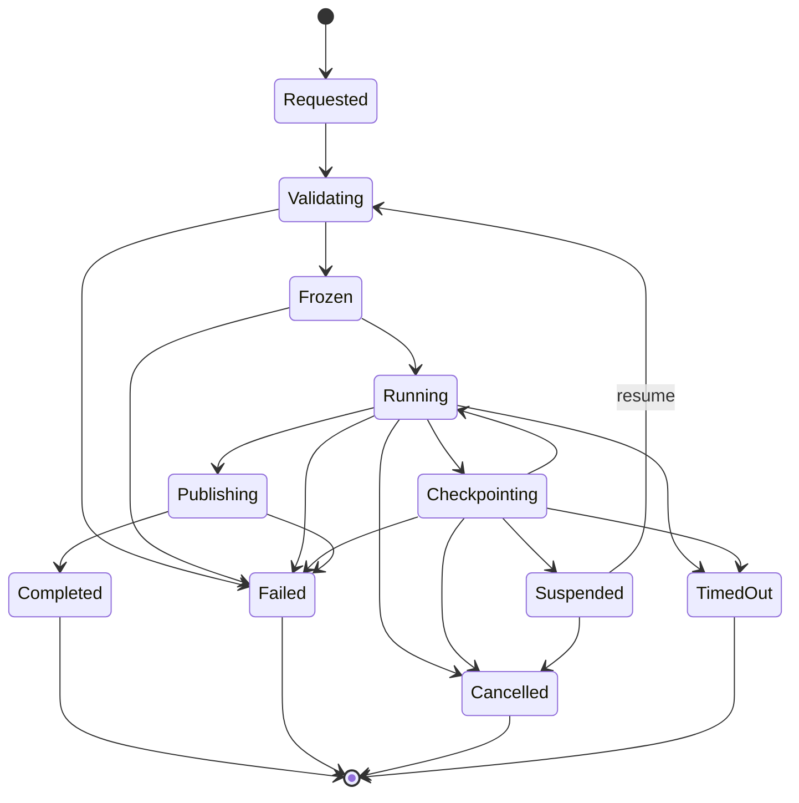

# Offline Path Tracer Execution Architecture

**Status:** proposed target architecture for `FCR-REN-08`; implementation remains blocked until `PTD-00` accepts the transport/domain decisions and the plan is reconciled to that exact report revision

**Scope:** define the owner, contracts, lifetime, execution, sampling, accumulation, artifact, workflow, and clean-break boundaries for SparkleEngine's eventual offline path-traced reference

**Authority boundary:** [Transport And Estimator](TransportAndEstimator.md) owns equations and estimator semantics, [User Experience](UserExperience.md) owns the Editor/noninteractive experience, [Discovery](Discovery.md) owns ratification, the [feature dossier](README.md) owns acceptance, and the [staged plan](Plan.md) owns delivery order

**Verified:** 2026-09-09 against committed `master` revision `a91d13c5`; current-state statements are source inspection only

**Current readiness:** **20/100** — the source tree has an interactive GBuffer-seeded candidate path, not the independent offline job described here. See [Current Feature Readiness](../../../../../../../Acceptance/CurrentReadiness.md#renderer).

**Non-claims:** no target contract is accepted, no production code was changed, and no build, shader compile, runtime, GPU, image, convergence, backend, performance, package, or release evidence was produced by this architecture document

The target is one bounded, restartable render job that traces camera paths over immutable Scene- and View-owned inputs, publishes raw scene-linear evidence atomically, and can act as an oracle only inside its accepted transport domain. It is not a quality preset layered onto the current `ReferencePathTraced` frame graph.

> [!IMPORTANT]
> **Current state:** Target architecture; not implemented or accepted.
>
> **Gate:** Stage 1 implementation may begin only after the [discovery contract](Discovery.md) records `PTD-00 PASS` and the [delivery plan](Plan.md) names that exact report revision.
>
> **Naming rule:** Until `FCR-REN-08` passes, current output remains a **candidate comparison**. Neither a UI label nor an artifact may call it unbiased, ground truth, or an accepted reference.

## At A Glance

| Target provides | Target deliberately does not provide |
| --- | --- |
| Independent camera rays; frozen Scene/View inputs; one semantic path estimator; deterministic sample identity | A second scene database, material system, render graph, or general-purpose renderer framework |
| Raw HDR beauty, AOVs, uncertainty, counters, provenance, checkpoints, and atomic completion | Denoising, exposure, tone mapping, output encoding, or screenshot pixels in the oracle value |
| Strict D3D12/Vulkan capability truth and thin Inline/RGS traversal adapters | Silent backend/frontend substitution or vendor-specific estimator forks |
| Editor workspace plus noninteractive job invocation over the same service | A second path-tracer executable or a Shipping consumer debug surface by default |
| Full supported surface-transport mode and a separately named finite-path diagnostic mode | A silently truncated “unbiased” result, contribution clamp, firefly filter, or approximate cache |

## Current Route Versus Target Route

| Concern | Current source route | Required target |
| --- | --- | --- |
| Invocation | `LightingMode::ReferencePathTraced` runs as an interactive lighting branch. | An explicit offline job with immutable request, identity, budgets, progress, cancellation, terminal result, and retained artifacts. |
| Primary visibility | `GBufferPathSurface.hlsli` starts paths from production GBuffer values. | Camera sample to primary ray to canonical scene hit; no production GBuffer or reconstruction input. |
| Estimator | Separate direct and indirect passes, analytic-light iteration, BSDF continuation, fixed bounce/distance limits, and no complete light/BSDF MIS contract. | One reviewed camera-path estimator with event, measure, probability, emission, NEE, MIS, roulette, rejection, and termination correspondence. |
| Identity | Samples are coupled to render `FrameIndex`. | Stateless job/pixel/sample/dimension identity, independent of frame time, queue order, batch size, and restart. |
| State | Temporal frame history and motion-based reuse. | Job-owned exact sample prefix, verified checkpoint, and transactional state transitions. |
| Output | Common composite, sky, exposure, reconstruction, tone map, encode, and present remain downstream. | Raw linear radiance and diagnostics publish before presentation; preview is a derivative with explicit lineage. |
| Authority | Useful source-present candidate; no numerical or runtime oracle proof. | Authority is earned only by the [feature acceptance contract](README.md#acceptance-criteria) and retained `FCR-REN-08` evidence. |

The completion change is therefore a clean break in authority. It may reuse independently testable leaf implementations, but it must not keep the old frame-history path as a second reference producer.

## Product And Mathematical Claim

`PTD-00` must accept the exact equation, notation, decision slots, and `MATH-*` correspondence in [Transport And Estimator](TransportAndEstimator.md). This architecture constrains the decision to two explicit products:

| Product | Required claim | Termination behavior | Permitted use |
| --- | --- | --- | --- |
| `SurfaceTransportReference` | For the included camera, surface, material, and light domain, the estimator targets the full supported surface-light-transport integral. | Compensated Russian roulette is the ordinary stochastic termination. An implementation safety ceiling is a detected sample/job failure, never an accepted zero contribution. | Candidate oracle after all applicable `AC-OPT-*` criteria pass. |
| `FinitePathDiagnostic` | The estimator targets an explicitly declared maximum scattering-event domain. | The deterministic maximum is part of the artifact identity and output name. | Analytic fixtures, event isolation, convergence diagnosis, and cross-renderer matching; never silently substituted for the full product. |

“Bounded job” means bounded requested samples, wall time, memory, disk, checkpoint interval, and cancellation latency. It does not authorize a hidden deterministic path cutoff in `SurfaceTransportReference`. Unsupported or unrepresentable events fail the job or keep the domain excluded; they do not disappear as black.

The first accepted domain should be the smallest complete surface domain exercised by the frozen release maps:

- frozen perspective pinhole camera and exact subpixel sampling;
- triangle meshes and instances, with frozen evaluated skin/morph state only when reachable in scope;
- opaque and alpha-tested/two-sided surfaces with the accepted UV, texture decode, filtering/LOD, normal-map, metallic-roughness, dielectric-F0, and emission rules;
- directional, point, spot, rectangle/area, emissive-triangle, and environment lights that are reachable in the release scope;
- scene-linear surface reflection and emission with declared radiometric units;
- no blended transparency, transmission/interior stack, participating media, physical BSSRDF, spectral transport, or unrestricted caustics claim unless `PTD-00` expands the equation, state, fixtures, and evidence together.

An excluded feature must be unreachable in the offline selector/job or rejected before sample zero with its exact unsupported semantic. A release map cannot exercise an excluded row and still consume the result as its reference.

## Ownership And Dependency Boundary



| Owner | Owns | Must not own |
| --- | --- | --- |
| Scene | Canonical geometry, material, texture, light, environment, instance, and acceleration-structure generations; safe retirement. | Offline job state, sample ordinal, convergence, output paths, or evidence verdicts. |
| View | Camera model, projection, transform, resolution/crop, and other accepted view semantics. | Scene data or process-global offline policy. |
| Renderer offline job | Request validation, immutable leases, input digest, state machine, estimator configuration, active frontend, sample range, accumulation/diagnostic resources, progress, checkpoint/readback requests, and terminal result. | File-dialog/editor presentation, generic RHI policy, or a copied scene/material database. |
| Integrator semantic core | Camera/sample construction, path state, material/light evaluation contracts, NEE/MIS, roulette, robust spawn use, AOV/event classification, and invalid accounting. | API-specific SBT/root-signature/descriptor vocabulary or UI policy. |
| Traversal adapters | Translate semantic trace/visibility operations into Inline RayQuery or the native ray-tracing pipeline. | Different transport equations, materials, lights, RNG, or output meanings. |
| RHI | Capability reporting, AS/pipeline/descriptors/queues, barriers, readback mechanics, completion, device/validation errors, and resource retirement. | Reference labels, estimator choices, checkpoints, file schema, or silent fallback policy. |
| ApplicationEditor operation | Submit/observe/cancel jobs, schedule nonblocking readback/export, enforce filesystem budgets, and return stable CLI results. | A second estimator or duplicate render state. |
| Editor workspace | User fields, validation feedback, progress, pause/checkpoint/resume/cancel controls, artifact navigation, and preview. | Renderer truth or Shipping-runtime exposure. |
| Evidence/release owner | Fixture manifests, thresholds, repetitions, comparisons, approval, and completion reports. | Mutating candidate output or treating source presence as a pass. |

The offline snapshot is a set of immutable leases and identities over Scene/View-owned generations. It is not a deep-copied alternative world. Mutation after validation either creates a later unrelated generation or is rejected; it cannot alter a running job.

## Intended Source Shape

The implementation extends existing modules and keeps public vocabulary narrow. Exact filenames are selected against the live tree, but ownership should converge on this shape:

| Repository surface | Intended contents |
| --- | --- |
| `Engine/Renderer/Public/OfflinePathTracing/` | Only cross-module request, handle, progress, result, product/frontend enums, and typed artifact-readback contracts that a real consumer needs. |
| `Engine/Renderer/Private/OfflinePathTracing/` | Job validation/state, input digest, immutable leases, sample ranges, accumulator, diagnostic/readback scheduling, and orchestration of the semantic integrator. |
| `Engine/Renderer/Private/RayTracing/Effects/OfflinePathTracing/` or the nearest live semantic-effect owner | Integrator bindings and thin Inline/Pipeline adapters; no application, file, or UI policy. Extend an existing owner instead when inspection shows it is already the singular authority. |
| `Engine/Assets/Shaders/RayTracing/OfflinePathTracing/` | Shared sample, path-state, BSDF/light estimator, robust-ray, diagnostic, accumulation, and frontend shader code. Do not fork by API. |
| `Engine/Renderer/ShaderRegistrations/` | Only registrations for actual passes/programs; generated metadata remains authoritative. |
| `Engine/Application/Private/OfflinePathTracing/` and `EditorOperations/` | `SparkleApplicationEditor` job submission/observation, bounded asynchronous artifact writing, CLI results, and shutdown coordination. |
| `Engine/Editor/Private/Panels/` | Offline workspace presentation over Application/Renderer contracts. |

Do not create a top-level `PathTracer` engine, a new executable, a parallel `ReferenceRenderer` module, or public per-pass classes. If the live owner already provides the required abstraction, extend it rather than manufacturing the suggested directory.

## End-To-End Job Route

```text
OfflinePathTraceSubmission
    -> ApplicationEditor validates project/level/camera locator, output path, disk/wall-time budget and rights
    -> canonical Application/content route loads Scene and resolves View
OfflinePathTraceRequest
    -> Renderer validates product/domain, capability and GPU resource budget
    -> acquire immutable SceneGeneration + ViewSnapshot + shader/asset identities
    -> canonicalize request and compute InputDigest
    -> allocate job-owned accumulator, diagnostics and traversal state
    -> execute exact SampleRange batches through one semantic integrator
    -> checkpoint verified prefix or continue
    -> typed readback of raw sums/counts/AOVs/counters
    -> ApplicationEditor writes staging directory
    -> hash every artifact and write completion manifest last
    -> atomic publish to final JobInvocationId directory
    -> expose completed artifact set to UI/CLI/evidence consumers
```

No consumer reads an in-progress directory as complete. The writer creates a uniquely named staging sibling on the destination volume, makes every required file durable and hashed, writes the manifest last, then performs the accepted same-volume atomic publication operation. A cross-volume move is never treated as atomic. Failed publication preserves the last valid completed directory and retains a separately labeled failure record when possible.

## Contract Vocabulary

Names are illustrative until implementation review, but responsibilities are fixed.

| Contract | Required content |
| --- | --- |
| `OfflinePathTraceSubmission` | ApplicationEditor-owned serializable project/level/camera locator, output destination, filesystem/disk/wall-time budget, checkpoint/pause policy, preview request, and Renderer settings. It loads through canonical project/content/scene routes and resolves to live Renderer handles; it is not a second scene format. |
| `OfflinePathTraceRequest` | Scene/view handles, resolution/crop, target product, exact target samples per pixel (SPP), seed, backend/frontend request, included domain, GPU batch/memory budget, and typed checkpoint/readback cadence. It contains no file path, codec, dialog, or preview policy. |
| `OfflinePathTraceInputDigest` | Canonical hash of every contributing scene, view, asset, shader, compiler, renderer setting, backend/frontend, sampler, transport-domain, and resolution value. No wall-clock or invocation-only field enters this digest. |
| `OfflinePathTraceJobHandle` | Stable invocation identity and observation/cancel/checkpoint capabilities without exposing mutable implementation state. |
| `OfflinePathTraceProgress` | State, exact completed/target sample prefix, elapsed time, active backend/frontend, memory/disk estimate, last checkpoint, warnings, and terminal error category. |
| `OfflinePathTraceResult` | Terminal state, input digest, completed prefix, artifact manifest location, hashes, counters, and explicit candidate/accepted authority label. |
| `OfflinePathTraceSampleRange` | Half-open, non-overlapping sample-ordinal range assigned to a batch. Completion becomes visible only when the entire range is committed. |
| `OfflinePathTraceArtifactManifest` | Product/domain, complete input identity, source/build/compiler/shader/asset hashes, camera/scene semantics, sampler, sample prefix, accumulation policy, backend/frontend, raw/AOV file metadata, counters, budgets, timing, checkpoint lineage, and completion status. |

There is no compatibility reader, legacy alias, or dual manifest representation. During alpha development, a contract change invalidates and regenerates local checkpoints/artifacts.

## State And Lifetime



State invariants:

1. `Requested` data is untrusted and cannot allocate unbounded work.
2. `Frozen` means all contributing identities and leases are fixed and capability/budget checks passed.
3. `Running` commits only complete sample ranges. A queue submission alone is not progress.
4. `Checkpointing` writes a verified exact prefix and hashes it before it becomes resumable. A pause request reaches `Suspended` only after that checkpoint is durable and job-owned GPU resources are safely retired.
5. `Publishing` has stopped estimator mutation. The final manifest is written last.
6. `Completed` is immutable. Failed, cancelled, timed-out, corrupt, or partial output cannot carry the completion marker.
7. Cancellation stops new batches, waits or safely abandons owned GPU work according to RHI guarantees, publishes no candidate result, and retires resources after their last fence.
8. Resume re-runs validation, reloads the canonical level/camera through existing Application/scene routes when the process changed, recomputes the full input digest, and imports only an exact verified checkpoint match.
9. Device loss fails the job and invalidates GPU-resident accumulation. Resume is allowed only from the last independently verified host artifact.

Only one job may own an active offline accumulator per Renderer instance initially. Queuing more work belongs to the ApplicationEditor operation, preventing unbounded simultaneous VRAM and disk use. Parallel jobs can be added only after measured need and explicit capacity policy.

## Frozen Scene And View Inputs

The job acquires generation-stable views of canonical render data:

- Scene generation and acceleration-structure identity;
- instance-to-geometry/material mapping, current evaluated transforms, visibility masks, winding, sidedness, and scene units;
- vertex/index/UV/normal/tangent and alpha-test inputs needed by the accepted hit contract;
- texture content hashes plus decode, color-space, addressing, filtering, and LOD policy;
- material parameters and callable/evaluation identity;
- analytic/emissive/environment light records, units, selection distribution, and environment texture identity;
- View camera type, transform, projection/lens fields, crop, shutter/time if included, and output resolution;
- shader source/generated metadata/compiler/configuration identities and active backend/frontend capability.

The integrator reconstructs the primary surface from the ray hit. It does not consume GBuffer depth, normal, material, motion, or reconstructed lighting. Shared material or light leaves are allowed only where one canonical implementation prevents drift and the [oracle ladder](Research.md#oracle-ladder) has an independent way to falsify that leaf.

## Sampling Contract

Sampling is stateless and order-independent:

```text
RandomValue = Sample(JobSeed, PixelCoordinate, SampleOrdinal, DimensionId)
```

- `SampleOrdinal` starts at zero and is independent of renderer frame index, batch size, queue order, pause, and resume.
- Every conceptual decision has a named dimension range: film, lens/time when included, light selection, light surface, lobe selection, BSDF sample, roulette, and later-bounce repetitions.
- The accepted `PTD-00` report selects and pins the generator plus conversion-to-float rule. A counter-based independent generator is the correctness baseline; low-discrepancy sequences may replace it only with an equally explicit dimension/prefix and correlation contract.
- Restart with the same input digest and committed prefix continues at the next ordinal. It neither replays nor skips a sample.
- Different statistical replicates use explicit independent seeds and retain them; changing the seed does not change any other input identity.
- A generator or dimension-layout change invalidates prior checkpoints. It is a clean break, not a compatibility path.

The sample stream is inspectable through a small deterministic dump used by analytic checks. It is not tied to a submitted general random-number test framework.

The exact key/counter packing, float conversion, dimension assignment, branch behavior, replicate identity, and invalidation rule are owned by [`MATH-09`](TransportAndEstimator.md#math-09--stateless-sample-identity). A stateful or frame-index-derived generator cannot satisfy this architecture even if one fixed run repeats.

## One Semantic Integrator

The estimator is one semantic contract shared by traversal frontends. The authoritative proposed event sequence and contribution formulas are [the reference algorithm and `MATH-*` ledger](TransportAndEstimator.md#reference-algorithm); this section owns only the state and architecture correspondence. A path sample owns:

- camera ray and throughput;
- current geometric and shading frame;
- event/lobe and delta classification;
- accumulated radiance and first-event AOV classification;
- previous strategy PDF information needed for MIS of emissive/environment hits;
- scattering depth and compensated roulette state;
- invalid/rejection/failure reason.

For every non-terminal surface event the reviewed code must make the following correspondence visible:

1. evaluate emission under the accepted sidedness rule and weight it against the prior sampling strategy when both strategies can generate the path;
2. select an eligible light using a frozen probability mass function, sample it in its native measure, convert to solid angle at the shading point, trace a connection ray with exact endpoints, and apply the accepted MIS rule;
3. select and sample one BSDF event, returning value, PDF in the same measure, event flags, and next direction from the same material contract used for evaluation;
4. update throughput with every selection probability and cosine/Jacobian exactly once;
5. apply shading-normal correction if accepted, finite checks, and compensated Russian roulette at the frozen rule;
6. spawn the next ray from robust geometric bounds and continue, or record the precise terminal/failure event.

Delta lights/lobes, zero PDFs, alpha rejection, miss/environment, emissive hits, and roulette survival are explicit branches in the derivation and event trace. `NaN`, infinity, invalid PDF, impossible negative radiance, safety-depth reach, and counter overflow increment retained diagnostics and invalidate the affected sample or job according to the frozen rule; they are never silently clamped away.

## Ray Robustness

Primary, continuation, and connection rays use a single Renderer-owned robust endpoint policy derived for Sparkle's vertex formats, transforms, compiler behavior, and both APIs. The policy distinguishes geometric normal from shading normal, carries reconstruction/transform error bounds, chooses the offset side from the outgoing direction, and shortens connection endpoints using receiver/emitter bounds.

The existing fixed `MinT`, normal bias, grazing multiplier, and maximum distance cannot remain hidden controls in raw reference output. They are deleted from the reference authority or confined to an explicitly named diagnostic path. Scale, large translation, nonuniform scale, shear, mirrored instances, grazing incidence, adjacent/coplanar triangles, thin gaps, and strong normal maps are acceptance fixtures, not per-scene tuning opportunities.

## Accumulation, Checkpoint, And Diagnostics

The accumulator owns a complete fixed sample prefix for every pixel. The accepted precision study chooses the concrete representation; architecture requires:

- radiance sum or an arithmetic-mean representation with compensated/pairwise error control justified at the maximum accepted SPP;
- exact integer sample count separate from radiance channels;
- second moment or equivalent data sufficient for variance and standard-error estimates;
- distinct raw beauty and required lobe/event AOVs without changing path energy;
- ray, shadow-ray, path-length, roulette, alpha-rejection, invalid-value, safety-depth, and overflow counters;
- deterministic reduction order within the declared backend tolerance, or a documented statistical rather than bitwise parity contract;
- mutation-free checkpoint data bound to the full input digest and exact committed prefix.

Adaptive per-pixel stopping is absent from the initial correctness route. It can enter only with a derivation, sampling/variance contract, mask artifact, and evidence that the stop rule does not create an undeclared target. Fixed requested SPP plus independently evaluated statistical acceptance keeps execution and proof separable.

## Artifact Contract

The completed directory contains at minimum:

| Artifact | Required semantics |
| --- | --- |
| `beauty.exr` | Raw scene-linear HDR radiance for the accepted sample prefix; no display transform or denoising. |
| `aov-*.exr` | Included albedo, geometric/shading normal, depth, direct/indirect or first-event classifications, variance/standard error, and other accepted diagnostics. AOV definitions are named in the manifest. |
| `manifest.json` | Canonical identity, scope, settings, hashes, backend/frontend, counts, counters, budgets, timing, lineage, and completed status; written last. |
| `events.json` or bounded diagnostic equivalent | Only for requested analytic/minimal cases; deterministic path-event evidence with an explicit size cap. |
| `preview.*` | Optional derivative for humans, with exposure/tone/encoding settings and the raw artifact hash. It is never a comparison source. |

OpenEXR is the required high-dynamic-range interchange container unless `PTD-00` records a stronger alternative. Existing readback mechanics should be extended rather than duplicated. The ApplicationEditor writer may use the repository's existing TinyEXR dependency only after ownership, write support, security, rights, build, and package review; TextureCooker ownership does not automatically authorize a Renderer dependency.

A progressive UI preview may read the latest completely committed prefix at a bounded cadence and pass it through a separately identified display transform. Preview work cannot delay sample-prefix commits beyond the accepted budget, mutate the accumulator, feed transport, change the stop rule, or become the saved comparison source.

Default development output is under `Saved/OfflinePathTracer/<JobInvocationId>`. An explicit output path must pass canonicalization, writable-root, free-space, overwrite, and atomic-publish checks. Packaged execution depends on the release writable-root contract; the installation directory is never assumed writable.

## Traversal And Backend Strategy

Inline and native ray-tracing-pipeline execution are thin mechanisms beneath the same semantic integrator:

| Route | Role | Acceptance boundary |
| --- | --- | --- |
| Inline RayQuery | First implementation route because the current material-hit and traversal infrastructure already reaches both APIs. | Must expose exact active capability and pass the entire semantic/robustness/backend matrix. |
| Native RGS/TraceRays | Independent traversal frontend and parity route after the estimator is stable. | Uses explicit path/visibility ray types, payloads, miss/any-hit/closest-hit programs, and `RayTracingShaderTablePlan`; no copied estimator. |
| Wavefront/compacted execution | Deferred performance option only. | Enters after captures show the megakernel violates an accepted budget and a design proves identical sample/event semantics, queue bounds, and diagnostics. |

Automatic selection may choose only between already accepted routes and records the resolved route. Strict Inline, Pipeline, D3D12, and Vulkan requests fail visibly when unavailable. No route silently switches backend, disables a feature, lowers path domain, or reuses the real-time tracer.

## Workflow And Reachability

The same ApplicationEditor operation serves two development-product surfaces. [User Experience](UserExperience.md) owns their complete setup, preflight, state/action, progress, preview, recovery, accessibility, result, and first-use behavior:

- an Editor workspace for selecting the current scene/camera, validating the exact domain, choosing resolution/crop/output/budgets/backend/frontend, starting work, viewing a separately labeled progressive preview plus progress/counters, requesting a checkpoint/pause, cancelling, resuming a verified checkpoint, and opening artifacts;
- a noninteractive `ShowcaseEditor` invocation that consumes a checked-in or generated submission manifest, loads the project/level/camera through the canonical Application route, resolves the same Renderer request, returns stable exit/result categories, and is suitable for reproducible evidence runs without UI automation.

The UI disables submission until validation succeeds and shows requested versus active backend/frontend, input digest, exact sample prefix, measured sample/ray throughput, clearly estimated time remaining, elapsed/budget state, output destination, counters/warnings, and any exclusion. ETA is convenience only and never a completion or convergence criterion. Closing the workspace does not orphan a job; application shutdown requests the configured bounded checkpoint-and-suspend or cancellation policy.

The offline tool is excluded from `ShippingGame` and the consumer first-run route by default. If release scope later makes it a packaged adopter tool, its dependencies, writable root, support contract, and selector reachability must be admitted explicitly. Developer console/CVar access is not the product workflow.

## Failure And Recovery Contract

| Failure | Required outcome |
| --- | --- |
| Unsupported material/light/camera/backend/frontend | Reject before sample zero with the exact unsupported row and no candidate artifact. |
| Scene/view/shader/asset identity changes during a job | Running job continues on held immutable generations; a new request gets a new digest. If immutability cannot be guaranteed, submission fails. |
| Invalid PDF/radiance/normal/event or safety-depth reach | Retain counters and bounded event context; fail the affected analytic case and apply the accepted production sample/job invalidation rule. Never hide it with a clamp. |
| Timeout or user cancellation | Stop new batches, reach terminal state within budget, publish no completion manifest, retain only labeled diagnostics/verified checkpoint, retire resources safely. |
| OOM or capacity refusal | Fail before unbounded allocation where predictable; otherwise preserve device/process integrity, classify the failure, and leave the prior valid output intact. |
| Device loss/TDR | Fail the job, capture available RHI diagnostics, invalidate GPU-only state, and permit resume only from a verified host checkpoint after device recovery. |
| Disk full, access denied, writer/codec error | Fail publication, delete or quarantine only the new staging directory, preserve prior completed artifacts, and report required/available space. |
| Corrupt or mismatched checkpoint | Reject without partial import, identify the first identity/hash mismatch, and offer a new job. |
| Backend disagreement or native validation output | Mark evidence `Blocked`/`Inconclusive`; do not average, threshold-tune, or silently prefer one backend. |

These behaviors refine [the runtime failure ledger](README.md#runtime-failure-modes); the ledger, not this page, owns acceptance results.

## Clean-Break Migration

The implementation retires duplicate or misleading authority in the same change that installs the replacement:

1. replace `LightingMode::ReferencePathTraced` with an honest interactive candidate label or remove it from the common lighting selector;
2. remove `ReferenceLighting` direct/indirect production and temporal-accumulation ownership once their required diagnostic value is available through the offline job or an explicitly non-authoritative real-time comparison;
3. remove frame-index sample identity, motion-history reuse, fixed reference `NormalBias`/`MaxDistance`/bounce settings, and common post-process output from the oracle route;
4. update all selectors, settings persistence, generated metadata, shader registration, CMake membership, docs, and consumers together;
5. retain shared BSDF/material/light/ray helpers only when their semantic owner is singular and an independent fixture can expose their defects;
6. regenerate local artifacts/checkpoints under the new contract; do not add migration readers, aliases, adapters, or dual representations.

Exact source deletions are frozen by the plan stage that inspects the live tree. The goal is one offline authority, not preserving filenames from this snapshot.

## Design Decisions And Rejected Shapes

| Decision | Why | Rejected default |
| --- | --- | --- |
| Separate offline job rather than frame-history mode | Makes input identity, bounded lifecycle, restart, artifacts, and failure observable. | Extending the current per-frame mode with more CVars. |
| Scene/View leases rather than copied world | Preserves canonical ownership and copy budget while freezing contributing generations. | A second scene loader/material database inside the tracer. |
| Camera-ray primary visibility | Lets the oracle detect raster/GBuffer primary-surface defects. | Seeding the accepted reference from the production GBuffer. |
| One semantic integrator with thin adapters | Keeps estimator math singular while providing traversal/backend evidence. | Separate inline, RGS, D3D12, and Vulkan estimators. |
| Megakernel first, wavefront only from evidence | Minimizes coordination before correctness is known. | Importing a split-kernel framework because AMD/NVIDIA examples use one. |
| Fixed sample prefix for production evidence | Makes accumulation, restart, and comparison exact and reviewable. | Adaptive stopping before its bias/statistics contract exists. |
| Raw EXR plus manifest, preview derivative | Prevents presentation from contaminating the oracle. | BMP/screenshot/tone-mapped golden images as truth. |
| ApplicationEditor writer | Keeps codec/filesystem/UI dependencies out of core Renderer and Shipping runtime. | Linking a development export stack into every runtime Renderer. |

## Support And Evidence Matrix

| Surface | Target | Current state |
| --- | --- | --- |
| D3D12 + Inline | Required strict route | Source infrastructure present; offline route unimplemented/unproved. |
| Vulkan + Inline | Required strict route | Source infrastructure present; offline route unimplemented/unproved. |
| D3D12 + Pipeline | Required parity route before final candidate closure unless `PTD-00` explicitly proves it unnecessary | General RGS infrastructure present; offline adapter absent. |
| Vulkan + Pipeline | Required parity route before final candidate closure unless `PTD-00` explicitly proves it unnecessary | General RGS infrastructure present; offline adapter absent. |
| Editor workspace | Required development-product route | Absent. |
| Noninteractive Editor job | Required reproducible route | Absent. |
| Shipping consumer | Excluded by default | Must remain unreachable and dependency-free. |
| Raw EXR/manifest/checkpoint | Required | Existing viewport BMP/readback and TinyEXR dependency are incomplete precedents, not implementation. |
| Numerical/statistical/runtime/package proof | Required by `FCR-REN-08` | Not produced by this architecture work. |

## Architecture Invariants

An implementation review fails if any invariant is false:

1. One Renderer owner defines the offline job and one semantic core defines path contribution.
2. Scene owns scene data and View owns view data; the job holds immutable generations rather than a duplicate world.
3. Requested and active backend/frontend/domain are distinct, recorded, and never silently substituted.
4. Sample identity depends on job/pixel/sample/dimension, never frame timing or scheduling.
5. The raw oracle consumes no GBuffer, ReSTIR, denoised, temporally reconstructed, exposed, tone-mapped, encoded, or screenshot value.
6. Every sampling probability, measure conversion, MIS weight, roulette probability, and rejection has one derivation and code correspondence.
7. A safety ceiling, invalid number, unsupported event, or failed export cannot look like a valid zero contribution or complete result.
8. Checkpoints and completed artifacts bind to the full input digest and exact committed sample prefix.
9. The completion manifest publishes last; partial/failed output cannot be mistaken for accepted evidence.
10. External renderer agreement supports but never replaces analytic, dependency-independent, statistical, backend, and controlled-failure evidence.
11. Preview quality has no authority over raw reference acceptance.
12. Replaced Sparkle-owned paths are removed in the same clean break; no compatibility layer preserves duplicate truth.

## Evidence And Current Status

This document selects a target shape, not an implementation or verdict. Its source observations have not been build-, shader-, runtime-, GPU-, visual-, convergence-, performance-, package-, or release-verified in this change. `PTD-00` must still accept exact estimator mathematics, feature dispositions, concrete algorithms, numeric tolerances, fixture manifests, resource budgets, and independent review before Stage 1.

Use:

- [Feature dossier and acceptance](README.md) for `OPT-FS-*`, `AC-OPT-*`, `FM-OPT-*`, `CHK-OPT-*`, and definition of done;
- [Discovery contract](Discovery.md) for the `PTD-00` gate and evidence package;
- [Transport And Estimator](TransportAndEstimator.md) for notation, formulas, core algorithm, PBR decisions, and mathematical failure points;
- [User Experience](UserExperience.md) for Editor/noninteractive interaction, defaults, state actions, error presentation, artifacts, accessibility, and first-use proof;
- [Completion study](Research.md) for NVIDIA/AMD/neutral precedent and current-source gaps;
- [Staged implementation plan](Plan.md) for dependency order, work packages, deletions, prompts, and exit gates;
- [Ray Tracing Execution Architecture](../../RayTracing/ExecutionArchitecture.md) for shared semantic-effect and frontend policy;
- [Validation And Evidence](../../../../../../../Engineering/Verification/ValidationAndEvidence.md) for check design and claim-driven escalation.
