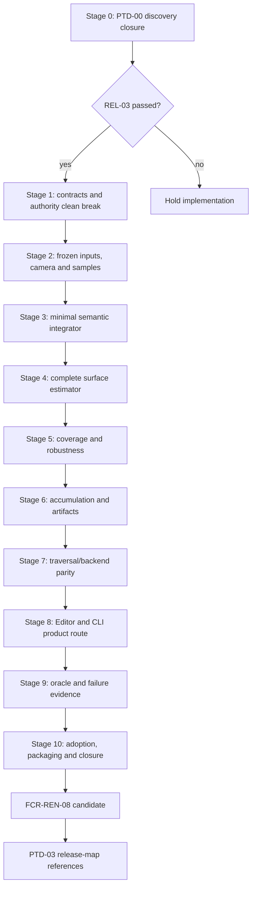

# Offline Path Tracer Staged Implementation Plan

**Status:** conditional `PTD-01` delivery plan prepared for review; Stage 0 is active, all production implementation stages remain blocked until `PTD-00 PASS` and `REL-03`

**Scope:** deliver `FCR-REN-08` end to end through one Renderer-owned offline job, one semantic path estimator, raw evidence publication, D3D12/Vulkan traversal parity, usable Editor/CLI workflows, controlled failure, and release-map adoption

**Prepared:** 2026-09-09 against committed `master` revision `a91d13c5`; estimates are planning ranges, not schedule commitments

**Authority boundary:** [Transport And Estimator](TransportAndEstimator.md) owns mathematical semantics, [Execution Architecture](ExecutionArchitecture.md) owns system ownership/lifetime, [User Experience](UserExperience.md) owns the human/automation workflow; the [feature dossier](README.md) owns `OPT-FS-*`, `AC-OPT-*`, `FM-OPT-*`, `CHK-OPT-*`, and definition of done; [Discovery](Discovery.md) owns `PTD-00`; the [completion study](Research.md) owns external precedent; this page owns delivery order, dependencies, clean breaks, estimates, prompts, and slice exit gates

**Current readiness:** **20/100** — plan presence adds no implementation, integration, verification, or delivery credit. See [Current Feature Readiness](../../../../../../../Acceptance/CurrentReadiness.md#renderer).

**Non-claims:** no plan stage has passed, no production code was changed, and no build, shader compile, runtime, GPU, image, convergence, backend, performance, package, or release evidence was produced by authoring this plan

This plan exists now because the requested implementation route needs to be concrete and reviewable before code work. Its presence does not manufacture a `PTD-00` pass. Stage 0 must replace every provisional choice and estimate with the accepted discovery result; if the result changes architecture, this plan is revised before Stage 1 rather than bending implementation around stale prose.

> [!CAUTION]
> Do not start Stage 1 because this file exists. Production implementation requires both an exact `PTD-00 PASS` report revision and the `REL-03` release gate. Until then, only Stage 0 discovery/evidence work is authorized.

## Outcome

Completion yields:

- a bounded, deterministic `SurfaceTransportReference` job over immutable Scene/View generations;
- a separately named `FinitePathDiagnostic` route for analytic and event-isolation work;
- independent camera rays, one reviewed NEE/MIS/Russian-roulette surface estimator, robust endpoints, exact sample identity, and complete invalid accounting;
- raw scene-linear EXR beauty/AOV/statistics plus hashes, provenance, checkpoints, and atomic completion;
- one semantic integrator behind strict Inline and native Pipeline adapters on D3D12 and Vulkan;
- one ApplicationEditor operation used by an Editor workspace and noninteractive `ShowcaseEditor` job invocation;
- an analytic/minimal/external/statistical/backend/failure evidence ladder sufficient for `FCR-REN-08` and later `PTD-03` release-map adoption;
- removal or honest relabeling of the current GBuffer-seeded `ReferencePathTraced` authority, without a compatibility layer or second scene/material system.

Anything less remains a candidate comparison. A cleaner image, larger sample count, passing build, or agreement with one external renderer does not close the feature.

## Gate And Dependency Graph



No stage may hide an unmet exit criterion in the next stage. A discovery-shaping unknown returns to Stage 0. A semantic defect returns to its owning estimator/input stage. A workflow, package, or failure defect returns to the owning operational stage without weakening the mathematical claim.

## Planning Envelope

| Stage | Focus | Initial effort range | Prerequisite | Primary exit checks |
| --- | --- | ---: | --- | --- |
| 0 | discovery closure and plan freeze | 40-80 h | none | `CHK-PTD-01` through `12` as applicable |
| 1 | contracts, job owner, naming clean break | 35-60 h | `PTD-00 PASS`, `REL-03` | `CHK-OPT-01`, `02`, `16` |
| 2 | immutable inputs, camera rays, sample identity | 55-90 h | Stage 1 | `CHK-OPT-02`, `03`, `07` |
| 3 | minimal reviewable integrator | 70-120 h | Stage 2 | `CHK-OPT-03`, `04`, `05` |
| 4 | complete included surface estimator | 90-150 h | Stage 3 | `CHK-OPT-04`, `05`, `11` |
| 5 | material/geometry coverage and numeric robustness | 65-110 h | Stage 4 | `CHK-OPT-03`, `04`, `08` |
| 6 | accumulation, diagnostics, checkpoints, EXR artifacts | 70-120 h | Stage 5 | `CHK-OPT-09`, `10`, `13` |
| 7 | Inline/RGS and D3D12/Vulkan parity | 60-110 h | Stage 6 | `CHK-OPT-07`, `08`, `12` |
| 8 | Editor workspace and noninteractive route | 50-90 h | Stage 7 | `CHK-OPT-02`, `13`, `15` |
| 9 | independent oracle, statistics, and failure evidence | 80-160 h | Stage 8 | `CHK-OPT-04` through `13` |
| 10 | package/adoption evidence, cleanup, completion report | 55-100 h | Stage 9 | `CHK-OPT-01`, `14`, `15`, `16` |
| **Total** | full first-release closure | **675-1,190 h** | accepted scope | all applicable `AC-OPT-01` through `20` |

The range is intentionally honest about math review, two APIs, two traversal frontends, artifact safety, and independent evidence. Stage 0 must re-estimate after feature scope, machines, release maps, tolerances, and reusable infrastructure are known. Cutting evidence, raw output, failure behavior, or a required backend is a scope decision, not an “optimization” of this estimate.

## Universal Execution Contract

Every implementation prompt below inherits these rules. The executing agent must:

1. start at the repository root; read `AGENTS.md`, `Docs/README.md`, the selected Engineering task routes, [Transport And Estimator](TransportAndEstimator.md), [Execution Architecture](ExecutionArchitecture.md), [User Experience](UserExperience.md), [feature acceptance](README.md), [Discovery](Discovery.md), and this plan in full;
2. inspect `git status --short`, preserve unrelated dirty work, and inspect live owners/producers/consumers/lifetime/build membership with `rg` before editing;
3. confirm all named prerequisite gates and prior-stage exit artifacts. If a prerequisite is absent, stale, or contradicted by code, stop and report `BLOCKED`; do not improvise around it;
4. implement only the selected stage and defects required for its exit criteria. Do not begin later UI, general framework, performance, denoising, neural, material-system, or compatibility work;
5. preserve Scene-owned scene data, View-owned view data, one Renderer job authority, one semantic integrator, thin RHI traversal adapters, and the single-truth/copy budget;
6. perform clean breaks for Sparkle-owned contracts: update all producers/consumers/build/docs together and delete the replaced path. Do not add legacy readers, aliases, version bridges, fallback selectors, or dual representations;
7. keep current code/behavior labels honest. Never use “unbiased,” “ground truth,” “converged,” or “accepted reference” beyond the exact passed scope;
8. design each check with initial state, action/injection, oracle, matrix, artifact, maximum duration/resources, cleanup, and escalation. Use the cheapest claim-falsifying check first;
9. do not add submitted test-only classes, fixtures, executables, files, or CMake targets. Temporary local probes are allowed only when necessary and must be removed before handoff; use existing validation routes and production diagnostics;
10. run `architecture_boundary_check` whenever Renderer/RHI boundaries change, focused build/shader checks required by the stage, and `git diff --check`. Do not claim unrun checks passed;
11. leave one iteration record containing gate revision, decisions, changed files, deletions, checks actually run, exact outputs/artifact links, known limitations, blockers, and the next permitted stage.

Every prompt's `NON-NEGOTIABLE` paragraph is an exit gate, not motivational prose. A handoff must quote each item and attach its proof or say `BLOCKED`. “Implemented,” a clean build, a plausible image, or a manual click-through cannot substitute for that proof.

If source reality proves a plan instruction wrong, correct the owning architecture/plan document in the same stage and explain the divergence. Do not preserve a bad plan through code contortions.

## Cross-Stage Invariants

- Raw reference transport never consumes production GBuffer, ReSTIR, temporal reconstruction, denoised, exposed, tone-mapped, encoded, or screenshot data.
- Job, pixel, sample, and dimension identity never depends on frame timing, dispatch order, batch size, or resume timing.
- `SurfaceTransportReference` contains no silent deterministic path/distance cap, firefly/contribution clamp, biased environment MIP, approximate cache, or invalid-to-black substitution.
- Unsupported semantics and missing strict capabilities reject before sample zero; they do not silently downgrade.
- Scene/View data is leased by immutable generation; no offline-owned duplicate scene truth is introduced.
- The estimator has one code/math correspondence. Inline/RGS and D3D12/Vulkan do not fork material, light, sample, or contribution semantics.
- Every discarded/invalid/capped event changes a retained counter and the accepted sample/job status.
- Preview is a derivative of raw output and carries its raw hash; it is never the numeric comparison source.
- A checkpoint is a verified exact prefix. A completion manifest is atomic, immutable, and written last.
- A phase cannot close from source inspection, compilation, one beauty image, one backend, one seed, or one external renderer alone.
- Every implemented transport term maps to one accepted `MATH-*` row and one retained defect-detecting result. No stage may silently revise a formula or decision slot.
- Every user-visible state/action/error/artifact obeys [User Experience](UserExperience.md); UI and CLI derive from the same ApplicationEditor intent and Renderer truth.

## Stage 0 - Close Discovery And Freeze The Plan

### Objective

Produce the exact `PTD-00` evidence package, independently review it, and reconcile this conditional plan to the accepted report. No production code changes occur in this stage.

### Work

1. Re-audit the live current route, selectors, source/shader/generated/CMake membership, Scene/View ownership, RHI frontends, capture/export infrastructure, ApplicationEditor operations, package roots, and release-map requirements.
2. Ratify or replace every `MATH-*` row and decision slot in [Transport And Estimator](TransportAndEstimator.md): products, equations, direction/measure notation, units/color, PBR material/normal model, light/lobe strategies, MIS, roulette, sampling, accumulation, robust rays, invalid/safety behavior, included/excluded `OPT-FS-*` rows, and permitted oracle claims.
3. Freeze camera, geometry, texture, material, light, environment, alpha/sidedness, deformation, backend/frontend, raw output, workflow, and package matrices against `ReleaseMapSet` and public reachability.
4. Complete the equation-to-code design for camera sampling, BSDF selection/eval/PDF, light PMF/native-to-solid-angle PDF, emission/environment MIS, delta cases, roulette, shading normals, alpha rejection, invalid values, and robust endpoints.
5. Select the stateless sampler, dimension ledger, accumulation representation, maximum supported SPP, checkpoint layout, OpenEXR channel/schema policy, artifact hashes, budgets, and statistical protocol.
6. Specify analytic/metamorphic fixtures, minimal event oracle, Falcor/Capsaicin/Mitsuba external interchange scenes, equivalence manifests, independent replicates, thresholds, regions, stop/escalation rules, and controlled fault injections.
7. Record adopted/rejected NVIDIA/AMD/neutral precedents and exact source/license revisions. No copied source or redistributed asset enters by inference.
8. Ratify or replace [User Experience](UserExperience.md): intended personas, recommended defaults, preflight, state/action truth, progress/preview labels, pause/resume/cancel/shutdown, error/result contract, CLI/UI equivalence, accessibility, support, first-use, and Shipping exclusion.
9. Complete `AC-PTD-*`/`FM-PTD-*`/`RISK-PTD-*`/`CHK-PTD-*` traceability, clean-break deletion ledger, owner/dependency assignments, and revised implementation estimates.
10. Obtain independent mathematical, numerical, architecture, evidence, and first-use review and record `PASS` or `BLOCKED`. On `PASS`, update this plan's status and exact prerequisite revision without claiming implementation evidence.

### Exit gate

- `AC-PTD-01` through `17` all pass at one report revision.
- Every `PTD-Q-*` is closed by a decision/evidence result, not moved into code as an ambiguity.
- Every included `OPT-FS-*` row has an owner, phase, defect-detecting check, budget, and external/shared-dependency oracle.
- Every `MATH-*` row is accepted/replaced/excluded, every formula-changing slot is filled, and all hand cases plus independent math/numeric review are retained.
- The experience contract is frozen tightly enough that Stage 8 cannot invent product labels, defaults, state actions, failure behavior, artifact precedence, accessibility, or UI/CLI equivalence.
- The Stage 1 prompt can be executed without inventing scope, math, architecture, evidence, or ownership.
- No implementation file changed and no plan presence is counted as readiness.

### Ready-to-use prompt

```text
Execute only Stage 0 of Docs/Architecture/Modules/Engine/Renderer/Features/Lighting/OfflinePathTracer/Plan.md.

Apply the plan's Universal Execution Contract. Do not change production code. Complete PTD-D0 through PTD-D4 and the full PTD-00 evidence package from the live repository, not from assumptions in the plan. Freeze the exact SurfaceTransportReference and FinitePathDiagnostic equations/domains; reconcile every OPT-FS row with release maps and public selectors; derive camera, BSDF, light, MIS, roulette, normal, alpha, robust-ray, sampling, accumulation, artifact, backend, workflow, and failure contracts; predeclare the oracle/statistical matrices and budgets; pin and classify all external source/license precedents; build a no-orphan traceability and clean-break ledger; and obtain an independent plan-readiness review.

NON-NEGOTIABLE: ratify or replace every MATH-* row and every decision slot in TransportAndEstimator.md, with hand-worked zero/unit/delta/Jacobian/MIS/emission-hit/roulette/finite-depth/invalid/variance cases and independent mathematical plus numerical review. Ratify or replace UserExperience.md with a dry-run first-use review covering recommended defaults, preflight, every state/action, raw-versus-preview truth, pause/resume/cancel/recovery, errors, artifacts, accessibility, UI/CLI equivalence, and Shipping exclusion. A remaining inferred PDF measure, probability, unit, material-normal rule, threshold, budget, user action, or failure outcome is a BLOCKER.

Use the cheapest claim-falsifying probes first. Do not build the engine or render representative maps unless a named PTD-00 criterion requires that escalation. Any unresolved item that can alter scope, estimator, architecture, ownership, evidence, or release claims keeps PTD-00 BLOCKED. End with the exact PASS/BLOCKED revision, evidence links, unrun checks, revised estimates, and whether Stage 1 is authorized. Never mark PTD-00 PASS from document completeness alone.
```

## Stage 1 - Establish Contracts, Job Ownership, And Honest Authority

### Objective

Install the minimal production job/state contracts and remove misleading public authority before transport expansion. No candidate artifact may yet be called a reference.

### Work

1. Add one Renderer-owned request/handle/progress/result/state owner with bounded validation and terminal categories. Keep public surface semantic and small; hide implementation classes in Private.
2. Add canonical input-digest construction over accepted request fields without copying Scene/View truth. Represent immutable Scene/View generation leases explicitly.
3. Add requested-versus-active backend/frontend/product fields and reject unsupported scope/capability before resource allocation.
4. Add the initial ApplicationEditor operation boundary for submit/observe/cancel; it may be non-user-facing until Stage 8.
5. Rename or remove the `ReferencePathTraced` selector and settings whose wording implies oracle authority. If retained temporarily for comparison, use an exact `InteractivePathTracedCandidate`-class label and make it unreachable as offline output.
6. Add bounded production diagnostics for state/error/input digest. Do not add a second dashboard, generic job framework, or filesystem schema yet.
7. Update CMake/generated metadata/docs/consumers and delete superseded aliases/settings in the same clean break.

### Exit gate

- State transitions and invalid request/capability/cancel behavior are observable without starting transport.
- Scene/View leases preserve ownership and retirement; no deep copy or mutable cross-thread reference exists.
- No public selector or manifest overclaims current output.
- `AC-OPT-01`, the contract/state portion of `AC-OPT-02`/`04`, and relevant `FM-OPT-01`, `14`, `18`, `19` are falsified by focused checks.
- `CHK-OPT-01`, focused `CHK-OPT-02`, and `CHK-OPT-16` evidence is retained; Renderer/RHI boundary check passes if affected.

### Ready-to-use prompt

```text
Implement only Stage 1 of Docs/Architecture/Modules/Engine/Renderer/Features/Lighting/OfflinePathTracer/Plan.md after verifying the exact PTD-00 PASS revision and REL-03 PASS. Apply the Universal Execution Contract.

From the live tree, introduce the smallest Renderer-owned offline request/handle/progress/result/state contracts, immutable Scene/View generation leases, canonical input digest, strict requested-versus-active capability fields, and ApplicationEditor submit/observe/cancel boundary. Remove or honestly rename every public ReferencePathTraced authority that can be mistaken for the accepted offline oracle; update all producers, consumers, generated metadata, build membership, and docs as one clean break. Do not implement the estimator, EXR writer, UI, generic job system, compatibility alias, or fallback.

NON-NEGOTIABLE: the contracts must represent every accepted lifecycle state and stable terminal category needed by UserExperience.md without putting strings, widgets, files, or UI truth in Renderer. Unsupported domain/capability must reject before allocation/sample zero; requested and active values must remain distinct; cancellation and destruction must settle leases/resources within the frozen bound; no selector, progress object, or result may imply reference/convergence/completion authority that evidence has not earned.

Exercise invalid scope/capability, identity mutation, state transition, cancellation, ownership/retirement, selector, and clean-break claims with focused checks; run architecture_boundary_check if the Renderer/RHI boundary changes and git diff --check. Stop on duplicate scene/job authority or any need to invent a PTD-00 decision. Handoff exact changed/deleted files, checks actually run, evidence, limitations, and Stage 2 readiness.
```

## Stage 2 - Freeze Inputs, Generate Camera Rays, And Stabilize Samples

### Objective

Create an independently traceable primary-ray and sample-identity route over frozen canonical inputs, still without the full estimator.

### Work

1. Publish the accepted immutable Scene generation inputs needed for triangle hits, material/light identity, and AS use without introducing an offline scene database.
2. Publish the accepted frozen View camera snapshot and implement center/edge/corner/subpixel primary-ray generation independent of GBuffer resources.
3. Implement the accepted stateless sample generator and named dimension ledger over job seed, pixel, sample ordinal, and dimension ID.
4. Allocate and commit non-overlapping half-open sample ranges; separate renderer frame index from sample ordinal completely.
5. Add a bounded diagnostic primary-hit/event readback route for analytic cases and sample-stream inspection.
6. Prove restart/prefix/reorder identity at the contract level. Do not implement approximate resume or accept partially committed batches.
7. Reject unsupported camera/geometry/deformation/material/light semantics before sample zero.

### Exit gate

- Analytic camera rays and triangle hit/miss/barycentric/transform/sidedness cases match predeclared expectations with the production GBuffer disconnected.
- Same input digest and sample identity repeat across frame timing, batch/reorder, and restart probes; ranges neither overlap nor skip.
- Every mutable contributing input has generation identity or is excluded.
- Focused `CHK-OPT-02`, `03`, and `07` cover `AC-OPT-03`, input portions of `04`/`05`, `AC-OPT-11`, and `FM-OPT-03`, `04`, `07`, `19`.

### Ready-to-use prompt

```text
Implement only Stage 2 of Docs/Architecture/Modules/Engine/Renderer/Features/Lighting/OfflinePathTracer/Plan.md after confirming Stage 1 evidence and unchanged PTD-00 scope. Apply the Universal Execution Contract.

Extend the existing Scene and View owners with immutable generation-stable data/views needed by the accepted offline contract; do not create an offline scene database. Implement frozen camera snapshots, independent camera/subpixel rays, the accepted stateless job/pixel/sample/dimension sampler and dimension ledger, non-overlapping committed sample ranges, and bounded analytic primary-hit/sample diagnostics. Remove all frame-index dependence from the new route and reject every unsupported reachable semantic before sample zero.

NON-NEGOTIABLE: implement accepted MATH-01 and MATH-09 exactly. Film/raster/crop/filter mapping must have known-value rays and a constant-radiance integral; generator key/counter packing, integer-to-float conversion, named dimensions, replicate identity, overflow, and branch independence must be inspectable. Same `(digest, replicate, pixel, ordinal, dimension)` means the same bits across batch sizes, scheduling, restart, and accepted backends; different complete sample ranges never overlap or skip.

Use analytic ray/hit expectations and deterministic repeat/prefix/reorder/restart probes. Inspect both API binding implications but do not add the RGS frontend, full BSDF/light estimator, accumulation, export, or UI. Run focused shader/build checks, ownership/retirement checks, architecture_boundary_check where applicable, and git diff --check. Stop if freezing requires copied scene truth or if any sample dimension/domain decision is still open.
```

## Stage 3 - Build The Minimal Reviewable Semantic Integrator

### Objective

Implement a deliberately small camera-to-emission/environment tracer whose event log can be matched to hand calculations before NEE/MIS breadth is added.

### Work

1. Define one Renderer shader semantic core for path state, surface event, BSDF result, light event, trace result, contribution, and diagnostics; keep API-specific types outside it.
2. Implement accepted material decode for the minimal opaque Lambertian/emissive domain, primary/continuation trace, environment miss, emission hit, and BSDF continuation.
3. Implement the exact finite-depth termination/event state for the minimal-domain internal slice of `FinitePathDiagnostic`. Do not expose this incomplete estimator slice as the completed finite product or as full transport.
4. Implement finite/invalid/PDF/normal/event validation with retained counters; never clamp or turn invalid values into plausible black.
5. Add minimal raw in-memory radiance output sufficient for analytic checking. Do not yet build final accumulation or file publication.
6. Maintain equation-to-code labels or a compact ledger so every throughput term maps to the accepted derivation.

### Exit gate

- Black, constant environment, emissive hit, Lambertian normalization/energy, one- and two-segment hand cases pass within frozen tolerance.
- Intentional PDF, cosine, emission, sample-selection, and invalid-value faults are detected by the named checks.
- No GBuffer, real-time lighting, post-process, temporal history, API-specific estimator fork, or hidden limit enters the semantic core.
- Focused `CHK-OPT-03`, `04`, and `05` cover the minimal portions of `AC-OPT-05` through `10` and `FM-OPT-02` through `06`.

### Ready-to-use prompt

```text
Implement only Stage 3 of Docs/Architecture/Modules/Engine/Renderer/Features/Lighting/OfflinePathTracer/Plan.md after Stage 2 passes. Apply the Universal Execution Contract.

Create one API-neutral Renderer shader semantic core for a minimal camera path over the accepted opaque Lambertian/emissive/environment domain. Include material decode, primary and continuation hits, BSDF sampling/evaluation/PDF correspondence, environment misses, emissive hits, FinitePathDiagnostic termination, exact path-event diagnostics, and explicit invalid counters. Keep traversal behind the current accepted adapter and keep output in-memory for analytic checks. Preserve equation-to-code correspondence and remove any duplicated old helper authority that the new semantic core replaces.

NON-NEGOTIABLE: implement only the accepted finite-domain portions of MATH-02, MATH-03, MATH-07, and the Reference Algorithm. Every direction convention, geometric cosine, lobe-selection mass, conditional/complete PDF, emission term, and legitimate zero termination must appear once in both the event record and equation-to-code ledger. The internal FinitePathDiagnostic(D) slice must have the frozen vertex/depth meaning, no roulette, an identity-bearing finite label, and no route by which it can be presented as the completed finite product or SurfaceTransportReference before Stage 4 adds and proves the accepted NEE/MIS strategies.

Run the predeclared black/environment/emissive/Lambertian/one-path/two-path analytic cases and controlled probability/cosine/emission/invalid injections. Do not add full NEE/MIS, material breadth, EXR/checkpoints, RGS, UI, denoising, or performance refactors. A plausible image is not an exit artifact. Stop on an unmatched derivation term or shared dependency with no independent oracle.
```

## Stage 4 - Complete The Included Surface-Transport Estimator

### Objective

Extend the semantic core to every accepted reflective material/light event with one reviewed NEE/MIS estimator and compensated Russian roulette.

### Work

1. Implement the accepted metallic-roughness diffuse/specular mixture with matching evaluation, sampling, PDF, event flags, dielectric F0, limiting cases, and shading-normal treatment.
2. Implement analytic-light, emissive-triangle, and environment selection distributions with frozen units, sidedness, attenuation, native measure, solid-angle conversion, and zero-probability behavior.
3. Implement one-light NEE and BSDF strategy composition with the accepted MIS heuristic, including emissive/environment hits and delta-event exclusions without double counting.
4. Implement compensated Russian roulette for `SurfaceTransportReference`. Treat any safety-depth reach as retained failure; keep deterministic depth only in `FinitePathDiagnostic`.
5. Preserve direct/indirect/lobe AOV classifications without changing beauty contribution.
6. Remove any current separate direct/indirect reference estimator code that becomes duplicate authority, updating consumers and shader registrations together.

### Exit gate

- Every included BSDF/light strategy passes normalization, energy/white-furnace or applicable limit, unit/PDF/Jacobian, delta/zero, emission/environment, and NEE/MIS hand cases.
- Independent replicates show the expected mean on analytic scenes; injected missing/duplicate probabilities, MIS weights, emission, and roulette compensation fail.
- `SurfaceTransportReference` contains no accepted deterministic cutoff, clamp, filter, cache, or biased environment MIP.
- `CHK-OPT-04`, `05`, and early `11` cover `AC-OPT-06` through `10`, `15`, and `FM-OPT-05`, `06`, `11`, `16`.

### Ready-to-use prompt

```text
Implement only Stage 4 of Docs/Architecture/Modules/Engine/Renderer/Features/Lighting/OfflinePathTracer/Plan.md after the minimal integrator passes. Apply the Universal Execution Contract.

Extend the one semantic core to the entire PTD-00-included reflective surface/light domain: metallic-roughness diffuse/specular sampling-evaluation-PDF correspondence, dielectric limits, analytic/emissive/environment light PMFs and measure conversions, connection visibility, NEE, the accepted MIS heuristic, emissive/environment hit weighting, delta/zero cases, compensated Russian roulette, and non-energy-changing AOV classification. SurfaceTransportReference must have no silent deterministic cap, clamp, filter, cache, biased MIP, or invalid-to-black path; a safety-depth reach is a diagnosed failure. Keep FinitePathDiagnostic separately named.

NON-NEGOTIABLE: implement accepted MATH-02 through MATH-08 exactly. Continuous lobe sampling evaluates the complete BSDF and complete unconditional mixture PDF; delta events retain complete discrete event mass. Light PDF is selection PMF times conditional solid-angle density, with reviewed area and latitude-longitude Jacobians. NEE and emissive/environment-hit MIS use comparable PDFs at the correct vertex and cannot double count; the last admitted FinitePathDiagnostic vertex evaluates emission and NEE before depth termination. Roulette observes the frozen throughput/state and divides survivors by the exact survival probability. Every factor is tagged in a bounded event trace; no epsilon, saturate, max-to-zero, firefly filter, MIP, cutoff, or preview fix may alter raw expectation.

Delete superseded separate direct/indirect reference estimator authority in the same clean break when all required diagnostics/consumers move. Run equation-to-code, hand-computable light/energy/PDF cases, white-furnace or accepted equivalents, independent-replicate means, and deliberate missing/duplicate probability/MIS/emission/roulette faults. Do not add excluded transmission/media/BSSRDF/spectral features, artifact workflow, RGS, UI, or speculative wavefront execution.
```

## Stage 5 - Close Geometry, Material, Texture, And Numeric Robustness

### Objective

Make every included content semantic and ray endpoint reliable across the accepted transform/scale matrix without per-scene tuning.

### Work

1. Complete accepted alpha-test, two-sided/winding, UV transform, texture decode/color-space/address/filter/LOD, normal-map, emission, and material parameter behavior.
2. Support frozen evaluated skin/morph snapshots only if included. Keep animation/time integration excluded unless accepted explicitly.
3. Implement one robust primary/continuation/connection-ray endpoint owner derived from Sparkle formats/transforms/compiler behavior and geometric normals.
4. Remove fixed reference `MinT`, normal-bias/grazing tuning, and maximum-distance authority from `SurfaceTransportReference`.
5. Add production counters and bounded diagnostic context for alpha rejections, self-hit prevention, invalid normals/PDF/radiance, endpoint collapse, and safety-depth reach.
6. Execute the declared scale, translation, rotation, nonuniform-scale, shear, mirror, grazing, adjacent/coplanar, thin-gap, alpha, sidedness, and normal-map matrices on the smallest supported surface.

### Exit gate

- Every included content row has analytic/CPU/metamorphic evidence and a feature-support rejection for excluded cases.
- Robustness fixtures pass without per-scene epsilon or distance tuning; both API representations are considered even if Stage 7 retains final parity.
- All invalid values and rejected events are accounted for; no visible defect is “fixed” by a contribution clamp.
- `CHK-OPT-03`, `04`, and `08` cover `AC-OPT-05` through `08`, `12`, `15` and `FM-OPT-04`, `08`, `16`, `19`.

### Ready-to-use prompt

```text
Implement only Stage 5 of Docs/Architecture/Modules/Engine/Renderer/Features/Lighting/OfflinePathTracer/Plan.md after the full included estimator passes. Apply the Universal Execution Contract.

Close every PTD-00-included geometry/material/texture semantic: alpha test, sidedness/winding, UV transforms, texture decode and color space, addressing/filter/LOD, normal maps, emission, and frozen evaluated skin/morph state when included. Derive and implement one robust primary/continuation/connection endpoint policy from Sparkle formats/transforms/compiler assumptions and geometric normals. Remove fixed MinT, normal-bias/grazing tuning, and maximum-distance authority from SurfaceTransportReference; preserve only explicitly named diagnostic controls.

NON-NEGOTIABLE: close every accepted row of the PBR Material Contract and MATH-11. Geometric normal owns sides, visibility, and ray offsets; shading normal enters only through the accepted effective BSDF/model. Roughness zero follows the accepted delta limit, alpha follows one frozen cutout rule, AO never attenuates raw physical transport, and excluded subsurface/transmission/media remain unreachable. The endpoint bound includes reconstruction, transform, and traversal error and shortens both ends of connection rays; a scene-tuned epsilon is a stage failure.

Run the accepted CPU/analytic decode cases and scale/translation/rotation/nonuniform-scale/shear/mirror/grazing/coplanar/thin-gap/alpha/sidedness/normal-map matrix. Retain counters for every invalid/rejected/endpoint failure. Do not expand into excluded transmission, media, BSSRDF, spectral, procedural, motion-blur, or generalized material-framework work. Stop if any release-reachable semantic remains unmatched or requires scene-specific tuning.
```

## Stage 6 - Make Accumulation And Artifacts Transactional

### Objective

Turn valid path samples into restart-safe raw evidence with justified precision, exact count, diagnostics, EXR output, provenance, and atomic publication.

### Work

1. Implement the accepted accumulation representation, summation algorithm, exact integer count, second moment/variance/standard error, maximum count, overflow behavior, and deterministic reduction contract.
2. Commit only complete sample ranges and implement reset/mutation/cancel/restart/checkpoint transitions bound to the full input digest.
3. Extend the existing RHI readback mechanism for typed raw HDR/AOV/counter payloads rather than creating another capture system.
4. Implement the ApplicationEditor artifact writer and staging/publish transaction. Use existing TinyEXR only after exact dependency/write/rights/security/build/package review; keep codec/filesystem policy out of core Renderer.
5. Write raw `beauty.exr`, named AOVs, bounded event data when requested, hashes, and `manifest.json` last. Generate saved/progressive preview only as a bounded separate derivative of a completely committed prefix with raw hash and display settings; it never feeds transport or acceptance.
6. Enforce output canonicalization, writable-root, free-space, path, overwrite, disk, partial, corrupt-checkpoint, and previous-valid-result behavior.

### Exit gate

- Accumulation matches the higher-precision oracle at all frozen prefix/count extremes and state transitions.
- Pause/restart/resume produces the accepted same prefix result; corrupt/mismatched checkpoints reject before import.
- Raw/preview lineage is mechanically distinguishable and every forbidden presentation/bias switch is absent or rejected.
- Disk/export interruption cannot produce a plausible completed artifact or destroy a prior valid result.
- `CHK-OPT-09`, `10`, and artifact portions of `13` cover `AC-OPT-13` through `15`, `18` and `FM-OPT-06`, `09`, `10`, `14`, `15`.

### Ready-to-use prompt

```text
Implement only Stage 6 of Docs/Architecture/Modules/Engine/Renderer/Features/Lighting/OfflinePathTracer/Plan.md after Stage 5 passes. Apply the Universal Execution Contract.

Implement the PTD-00-selected accumulation precision/summation, exact integer count, second moment/uncertainty, overflow, complete-sample-range commit, reset and checkpoint state. Extend existing RHI readback instead of adding a capture subsystem. Add an ApplicationEditor-owned transactional artifact writer for raw EXR beauty/AOVs, counters, bounded events, hashes, checkpoint data, and a manifest written last; keep preview separate and tied to the raw hash. Review existing TinyEXR write capability, ownership, license, security, CMake and package implications before reuse. Enforce writable-root/free-space/path/overwrite/failure rules and preserve prior valid output.

NON-NEGOTIABLE: implement accepted MATH-10 with the frozen numeric representation and complete-range merge order; sample count is exact integer state, and variance/standard error cannot use an unproved cancellation-prone shortcut. Raw EXR uses declared FLOAT/HALF/UINT channels, lossless policy, color metadata, finite-value validation, and unambiguous AOV units. Checkpoint and completion bind the full digest/prefix; staging cannot be discovered as complete; manifest publishes last; preview and all display transforms remain a one-way derivative of a committed raw prefix.

Run higher-precision prefix/extreme-count comparisons, mutation/reset/cancel/restart/resume/overflow cases, raw lineage inspection, provenance mutation, forbidden-switch rejection, corrupt checkpoint, disk-full/access/export interruption, and atomic-publish checks. Do not add UI, RGS, adaptive stopping, denoising, or a generic asset/capture framework. Stop on any partial artifact that can appear complete or any accumulation input missing from identity.
```

## Stage 7 - Prove Traversal Frontend And Backend Parity

### Objective

Run the same semantic estimator through strict Inline and native Pipeline frontends on D3D12 and Vulkan with explicit capability truth and no semantic fork.

### Work

1. Freeze the semantic trace/visibility adapter boundary used by the accepted Inline route.
2. Add path and visibility ray-type requirements to the existing ray-tracing pipeline/SBT plan; implement thin RGS, miss, any-hit, and closest-hit adapters without copying estimator/material/light logic.
3. Bind resources/payloads/SBT indices through current RHI owners; reject unavailable pipeline features before sample zero.
4. Implement strict requested/active Inline/Pipeline and D3D12/Vulkan selection. Automatic chooses only accepted routes and records the resolution.
5. Compare identical job/sample prefixes, event counters, analytic hits, raw values or declared statistical tolerances, compiler/settings identities, and native validation outputs.
6. Measure only enough to prove bounded progress/TDR safety and identify whether the megakernel violates a frozen budget. Do not introduce wavefront execution without that evidence and a new accepted design slice.

### Exit gate

- One semantic core is visible in the source/dependency audit; adapters contain mechanism only.
- All four required strict route combinations pass capability, native validation, robustness, deterministic/statistical parity, completion, and unsupported-route behavior, or `PTD-00` is formally narrowed before closure.
- No fallback, backend drift, payload/SBT mismatch, or unexplained native validation message remains.
- `CHK-OPT-07`, `08`, `12`, and focused `16` cover `AC-OPT-11`, `12`, `17`, `20` and `FM-OPT-07`, `08`, `13`, `18`.

### Ready-to-use prompt

```text
Implement only Stage 7 of Docs/Architecture/Modules/Engine/Renderer/Features/Lighting/OfflinePathTracer/Plan.md after transactional raw output passes. Apply the Universal Execution Contract and the repository ray-tracing execution architecture.

Keep the estimator, sampler, material/light logic, diagnostics, and output semantic in one Renderer core. Formalize its trace/visibility adapter; add the required path/visibility ray types and checked logical scene-to-SBT mapping to the existing RayTracingShaderTablePlan; implement thin RGS/miss/any-hit/closest-hit adapters and current RHI bindings; and add strict requested-versus-active Inline/Pipeline plus D3D12/Vulkan selection with visible rejection. Do not copy the estimator, create backend-specific materials, silently fall back, or add wavefront/SER/vendor optimization.

NON-NEGOTIABLE: all four accepted strict combinations execute the same Reference Algorithm, MATH-* code, sample stream, material/light data, alpha/sidedness rules, robust endpoints, accumulation semantics, counters, and artifact identity. Adapters may translate only traversal payload, binding, and command mechanism. Any backend conditional that changes contribution, PDF, random dimension, invalid disposition, or output meaning is a semantic fork and blocks the stage.

Run identical analytic jobs and sample prefixes on every accepted route, compare raw values/counters within the predeclared bitwise or statistical rule, exercise robust endpoints and unsupported capability, inspect native validation and compiler identities, run architecture_boundary_check, focused shader/build checks, and git diff --check. Any unexplained validation or backend/frontend divergence blocks the stage.
```

## Stage 8 - Deliver The Editor And Noninteractive Product Workflow

### Objective

Make the same offline operation discoverable, bounded, scriptable, and recoverable without developer-console choreography.

### Work

1. Add one Editor workspace/panel that submits through the ApplicationEditor operation and exposes exact camera/scene/domain/resolution/crop/SPP/seed/backend/frontend/output/budget/checkpoint fields.
2. Show validation, input digest, requested/active route, a separately labeled progressive preview, exact sample prefix, measured throughput, clearly non-authoritative ETA, elapsed/budget/resource state, counters/warnings, checkpoint, terminal result, and artifact navigation.
3. Implement start, request-checkpoint/pause, resume verified checkpoint, cancel, close/shutdown, and recovery behavior. No UI state becomes Renderer truth.
4. Add one noninteractive `ShowcaseEditor` manifest invocation over the same service with stable result/exit categories and bounded logs.
5. Enforce one active Renderer job initially and bounded queueing in the operation service.
6. Keep Shipping consumer and first-run path free of the tool unless release scope explicitly admits it. Do not expose developer console as the user route.

### Exit gate

- A clean user can discover/configure/run/observe/checkpoint/cancel/resume/complete/fail and locate output through both UI and noninteractive routes.
- UI and CLI produce the same canonical request/input digest and terminal result for the same job.
- Closing the panel/application, invalid inputs, paths with spaces/non-ASCII, read-only install, time/resource limits, and support diagnostics behave as declared.
- `CHK-OPT-02`, `13`, and development portion of `15` cover `AC-OPT-02`, `04`, `18`, `20` and `FM-OPT-14`, `17`.

### Ready-to-use prompt

```text
Implement only Stage 8 of Docs/Architecture/Modules/Engine/Renderer/Features/Lighting/OfflinePathTracer/Plan.md after all strict render routes pass. Apply the Universal Execution Contract.

Build one ApplicationEditor operation surface over the existing Renderer job and use it from both an Editor Offline Path Tracer workspace and a noninteractive ShowcaseEditor manifest invocation. Expose exact scope/configuration including crop/region, input digest, requested/active route, sample prefix, progress/budgets/counters, checkpoint, cancel/resume, terminal error, and artifact navigation. Keep one active Renderer job and bounded operation queue. UI/CLI state must not duplicate Renderer truth. Keep Shipping consumer and consumer first run free of this developer tool unless the accepted release scope explicitly says otherwise.

NON-NEGOTIABLE: implement UserExperience.md as a product contract, not a debug panel. The recommended path is intent-first and requires no IDE/CVar/private knowledge; Validate precedes Start; every state exposes one dominant valid action; raw candidate, preview, checkpoint, staging, completed artifact, ETA, and convergence have non-overlapping labels. Pause creates a verified exact-prefix checkpoint; panel/application close settles safely; failures show root cause, identity, why it matters, one next action, stable result category, and bounded details. Keyboard/focus/non-color/scale/locale/Unicode behavior and UI/CLI canonical-request equivalence are correctness requirements.

Exercise clean discovery, invalid inputs, UI/CLI identity equivalence, progress, checkpoint, cancellation, application close, timeout, paths with spaces/non-ASCII, read-only install, support diagnostics, and output discovery. Do not add a second executable, generic task framework, developer-console dependency, or workflow-only fallback. Run focused application/editor build checks and git diff --check; report runtime surfaces not exercised.
```

## Stage 9 - Earn Oracle Authority With Independent Evidence

### Objective

Execute the complete defect-detecting oracle and failure ladder. This is the first stage that can support the word “reference,” and only after its criteria pass.

### Work

1. Execute all included analytic camera/intersection/material/BSDF/light/estimator/robustness/accumulation fixtures with predeclared thresholds and controlled wrong implementations or fault injections.
2. Execute deterministic sample prefix/reorder/restart/backend/frontend studies and independent replicate convergence/correlation/uncertainty studies across required regions.
3. Execute the minimal event tracer and external renderer comparisons only after camera/units/geometry/material/texture/light/path/output equivalence manifests pass. Start with the smallest Falcor Minimal, Capsaicin, and Mitsuba scalar-RGB scenes that match the tested semantic; preserve disagreements as `Inconclusive` until explained.
4. Exercise raw artifact lineage, hashes, provenance mutation, accumulation extremes, and preview separation.
5. Inject unsupported input/capability, invalid values, safety depth, timeout, cancel, device loss/TDR where safely supported, OOM/capacity refusal, disk full, access/export failure, and corrupt checkpoint under bounded cleanup.
6. Run paired D3D12/Vulkan native validation and strict frontend/backend result comparison on frozen machines/configurations.
7. Produce the no-orphan `AC-OPT-*`/`FM-OPT-*`/`CHK-OPT-*` evidence matrix. Do not tune thresholds after observing candidate output.

### Exit gate

- `CHK-OPT-03` through `13` all pass for every included matrix cell, or the feature remains blocked with an exact owner and failed claim.
- The protocol detects seeded bias, correlation, shared-dependency, local-image, invalid-value, truncation, accumulation, backend, and artifact-publication defects.
- External comparisons retain exact source revisions/configurations/licenses and semantic equivalence; agreement is supporting evidence, not derivation proof.
- No unexplained native validation, crash/hang, invalid counter, statistical disagreement, or plausible partial result remains.

### Ready-to-use prompt

```text
Execute only Stage 9 of Docs/Architecture/Modules/Engine/Renderer/Features/Lighting/OfflinePathTracer/Plan.md after the UI/CLI routes pass. Apply the Universal Execution Contract. This is evidence execution and defect repair within the implemented offline path tracer; it is not permission to broaden features.

Run the predeclared CHK-OPT-03 through CHK-OPT-13 matrices: analytic and metamorphic camera/hit/material/BSDF/light/estimator cases; deliberate PDF/MIS/emission/roulette/correlation/invalid/truncation faults; sample prefix/reorder/restart studies; higher-precision accumulation; robustness transforms; raw/provenance/preview lineage; minimal event oracle; semantically equivalent pinned external renderer comparisons; independent replicate convergence and regional uncertainty; strict Inline/Pipeline and D3D12/Vulkan native validation; and bounded invalid-input/capability/timeout/cancel/device/OOM/disk/export/checkpoint failures.

NON-NEGOTIABLE: every accepted MATH-* row must have a seeded defect that the retained protocol detects, including wrong measure/Jacobian, missing or doubled PMF, lobe-mixture mismatch, delta MIS, emission-hit double count, roulette compensation, dimension alias, variance cancellation, and robust-endpoint failure. Each shared camera/material/light/traversal/output dependency must have an oracle outside that dependency. Execute the complete UserExperience failure/recovery matrix; success-path screenshots or responsive processes are not workflow evidence. No threshold, crop, seed, replicate, budget, or stop rule changes after candidate output is observed.

Use only thresholds, scenes, repetitions, seeds, regions, budgets, and stop rules frozen before execution. Record raw artifacts, hashes, manifests, source/compiler/driver identities, injected defect and detection, exact commands, outcomes, cleanup, and limitations. Treat semantic mismatch or unexplained disagreement as Inconclusive/Blocked. Fix discovered defects at their owner and rerun only invalidated evidence; never tune output or thresholds to pass. End with a no-orphan acceptance/failure/check matrix and an exact Stage 10 readiness decision.
```

## Stage 10 - Adopt References, Verify Packaging, Remove Superseded Paths, And Close

### Objective

Finish the product boundary, produce release-map references inside the accepted domain, delete old authority, and submit the candidate `FCR-REN-08` report.

### Work

1. Freeze each applicable release-map scene/camera/configuration and verify it lies wholly inside the accepted transport domain.
2. Produce raw high-sample references, independent replicates, uncertainty/convergence, full frames/crops, artifact checklist, input/output hashes, and shared-dependency oracle statements for `PTD-03`/`MAP-A` through `MAP-H`.
3. Compare real-time PBR/lighting/debug subjects only against applicable raw reference quantities. Keep display/preview comparisons separately labeled.
4. Validate the exact DevelopmentEditor/package workflow on clean supported machines, read-only install, writable output root, spaces/non-ASCII, both backends, first use, support output, resource bounds, and controlled failures. Shipping consumer remains free of the tool unless admitted.
5. Complete the deletion ledger: old reference producer/history/settings/shaders/selectors/docs/artifacts are removed or retained under an unambiguous non-authoritative role. Remove temporary probes and generated local evidence not permitted for submission.
6. Verify source/header/shader/generated/CMake/package/SBOM/license/docs membership and dependency direction.
7. Run the required focused final checks, architecture boundary check, `git diff --check`, and dirty-work audit. Escalate breadth only for claims actually affected.
8. File `FCR-REN-08` with exact results, exclusions, failures, limits, evidence links, and invalidation triggers. The acceptance owner, not the implementer or this plan, decides `PASS`, `BLOCKED`, or `EXCLUDED`.

### Exit gate

- Every applicable `AC-OPT-01` through `20` passes conjunctively; every `FM-OPT-*` has exercised detecting evidence; all `OPT-FS-*` rows match public/release reachability.
- `CHK-OPT-14`, `15`, and `16` pass in addition to retained Stage 9 evidence.
- `SurfaceTransportReference` is the single offline authority; no GBuffer-seeded or compatibility reference path competes with it.
- Package and release-map use remains inside the accepted domain and preserves raw/preview/provenance separation.
- `FCR-REN-08` records the real verdict. Only an accepted result authorizes downstream `PTD-03` ground-truth use.

### Ready-to-use prompt

```text
Execute only Stage 10 of Docs/Architecture/Modules/Engine/Renderer/Features/Lighting/OfflinePathTracer/Plan.md after Stage 9 evidence is complete. Apply the Universal Execution Contract.

Freeze every applicable release-map camera/configuration within the accepted transport domain and produce PTD-03 raw references with independent replicates, convergence/uncertainty, complete provenance, hashes, full frames/crops, artifact review, and shared-dependency oracle statements. Exercise the exact clean-machine DevelopmentEditor/package workflow, writable-root/read-only-install and spaces/non-ASCII paths, both backends, first use, support diagnostics, budgets, and controlled failures. Keep Shipping consumer free of the tool unless release scope explicitly admits it.

NON-NEGOTIABLE: ship only the scope proved by the accepted TransportAndEstimator.md revision and only the workflow proved by UserExperience.md. Every public label, preset, tooltip, CLI result, manifest, artifact action, map comparison, and support message must preserve the bounded claim and raw/preview distinction. A map outside the domain, nonzero unexplained correctness counter, unresolved MATH-* defect, inaccessible first-use step, silent capability substitution, plausible partial artifact, or surviving competing reference authority blocks FCR-REN-08.

Complete the clean break: remove or unambiguously relabel all old GBuffer-seeded reference producer/history/settings/shaders/selectors/docs and remove temporary probes; audit source/header/shader/generated/CMake/package/SBOM/license/docs membership and unrelated dirty work. Run CHK-OPT-01, 14, 15, 16 plus every invalidated prior check, architecture_boundary_check, focused builds/runs required by the claims, and git diff --check. File FCR-REN-08 with exact PASS/BLOCKED/EXCLUDED evidence and limitations. Do not call the feature accepted unless every applicable AC-OPT-01 through 20 passes conjunctively and the acceptance owner approves the report.
```

## Phase-To-Acceptance Traceability

This table assigns each feature, acceptance, failure, and check ID to one primary stage. Earlier focused probes and later invalidation reruns do not create a second owner.

| Stage | Feature rows primarily delivered | Acceptance primarily closed | Runtime failures primarily exercised | Checks primarily owned |
| --- | --- | --- | --- | --- |
| 0 | dispositions for `OPT-FS-17`, `OPT-FS-18`, `OPT-FS-19` | discovery prerequisite only | discovery `FM-PTD-*` | `CHK-PTD-01` through `CHK-PTD-12` |
| 1 | `OPT-FS-01` | none; contracts prepare later closure | `FM-OPT-01`, `FM-OPT-18` | `CHK-OPT-01` |
| 2 | `OPT-FS-02`, `OPT-FS-03`, `OPT-FS-10` | `AC-OPT-03`, `AC-OPT-04`, `AC-OPT-11` | `FM-OPT-03`, `FM-OPT-07` | `CHK-OPT-02`, `CHK-OPT-03`, `CHK-OPT-07` |
| 3 | no final feature row; minimal analytic precursor only | none; analytic precursor only | none; controlled estimator faults prepare Stage 4 | no final feature check; retain precursor evidence for Stage 5 |
| 4 | `OPT-FS-06`, `OPT-FS-07`, `OPT-FS-08`, `OPT-FS-09` | `AC-OPT-07`, `AC-OPT-08`, `AC-OPT-09`, `AC-OPT-10` | `FM-OPT-05`, `FM-OPT-06` | `CHK-OPT-05` |
| 5 | `OPT-FS-04`, `OPT-FS-05`, `OPT-FS-11` | `AC-OPT-05`, `AC-OPT-06`, `AC-OPT-12` | `FM-OPT-04`, `FM-OPT-08` | `CHK-OPT-04`, `CHK-OPT-08` |
| 6 | `OPT-FS-12`, `OPT-FS-13` | `AC-OPT-13`, `AC-OPT-14`, `AC-OPT-15` | `FM-OPT-09`, `FM-OPT-10`, `FM-OPT-15` | `CHK-OPT-09`, `CHK-OPT-10` |
| 7 | `OPT-FS-15` | `AC-OPT-17` | `FM-OPT-13` | `CHK-OPT-12` |
| 8 | no new feature row; integrate the delivered job and backend surfaces into the product workflow | `AC-OPT-02` | `FM-OPT-17` | `CHK-OPT-15` |
| 9 | `OPT-FS-14` | `AC-OPT-16`, `AC-OPT-18` | `FM-OPT-02`, `FM-OPT-11`, `FM-OPT-12`, `FM-OPT-14` | `CHK-OPT-06`, `CHK-OPT-11`, `CHK-OPT-13` |
| 10 | `OPT-FS-16` and final enforcement of Stage-0 dispositions | `AC-OPT-01`, `AC-OPT-19`, `AC-OPT-20` | `FM-OPT-16`, `FM-OPT-19` | `CHK-OPT-14`, `CHK-OPT-16` |

Conditional feature work is inserted into the owning input/integrator/evidence stages only when `PTD-00` includes it. Default exclusions remain excluded, and raw-oracle prohibitions are verified in every stage rather than implemented as features.

## Deletion And Preservation Ledger

The exact file list is frozen from the live tree in Stage 0/1. The intent is already fixed:

| Surface | Disposition |
| --- | --- |
| `LightingMode::ReferencePathTraced` public authority | Remove, or rename to an explicitly interactive candidate only if a separate supported use remains. Never alias to the offline job. |
| `ReferenceLighting` direct/indirect frame producer authority | Delete after required diagnostics migrate to the one camera-path integrator. Do not keep two reference estimators. |
| `ReferenceLightingAccumulation` temporal history | Delete as oracle state after the transactional job accumulator lands. A non-authoritative preview history must have a distinct owner/name if retained. |
| Frame-index RNG and reference bounce/bias/distance CVars | Remove from the accepted route; retain only explicitly scoped diagnostic controls with honest names. |
| Production GBuffer/composite/post-process dependency | Preserve for real-time rendering, remove from the offline transport/output dependency graph. |
| Canonical Scene/View/material/light/traversal leaves | Preserve singular ownership; extend with immutable views and independent checks where accepted. |
| Existing RHI readback and ray-tracing pipeline/SBT machinery | Extend at the current owner; do not duplicate in Renderer/ApplicationEditor. |
| TinyEXR | Reuse only at a suitable development artifact-writing owner after exact review; do not move TextureCooker ownership or link it into Shipping Renderer by convenience. |
| Temporary validation fixtures/harnesses | Local-only and removed before submission under the repository test policy. Retain manifests, summaries, and production diagnostics only. |

## Stop And Escalation Rules

Stop the active stage and report `BLOCKED` when:

- an unresolved decision can change estimator expectation, supported domain, ownership, artifact identity, backend claim, or evidence threshold;
- a release map or public selector reaches an excluded semantic;
- implementation requires a second scene/material/job/accumulation authority or compatibility layer;
- a shared dependency has no independent defect-detecting oracle;
- an invalid/capped/rejected contribution can disappear without a retained signal;
- a checkpoint or partial output can be mistaken for complete evidence;
- strict capability silently falls back, native validation remains unexplained, or backend/frontend outputs diverge beyond the frozen rule;
- an external comparison lacks semantic equivalence or rights/provenance;
- a stage would need broad framework, wavefront, denoising, neural, spectral, media, transmission, or unrelated feature work not admitted by `PTD-00`.

Escalation changes the smallest falsified surface first. It does not begin with a full engine build, full cook, all maps, or arbitrary SPP increase. The full package/map matrix belongs only to Stages 9-10 after lower-level claims pass.

## Completion Rule

This plan is complete only when the acceptance owner records `FCR-REN-08 PASS` against one immutable evidence set and every applicable `AC-OPT-01` through `20` passes. If scope, math, sampler, material/light semantics, compiler/shader identity, backend/frontend, accumulation, artifact schema, or release content changes later, the completion report names the invalidated evidence and reruns the smallest affected checks.

An implemented tracer with incomplete evidence is **not complete**. A fully evidenced finite-path diagnostic is **not the full surface reference**. A package workflow with a shared or post-processed oracle is **not trustworthy**. The plan is designed to make those substitutions impossible to hide.
