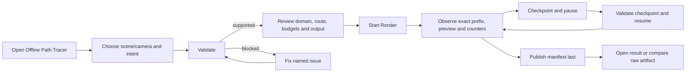

# Offline Path Tracer User Experience Contract

**Status:** proposed development-product experience for `FCR-REN-08`; implementation and acceptance remain blocked until `PTD-00` ratifies the scope, mathematical claim, budgets, workflow, and evidence protocol

**Responsibility:** define how a developer or technical artist discovers, configures, validates, runs, observes, pauses, resumes, cancels, diagnoses, and consumes one offline path-trace job through the Editor and noninteractive ApplicationEditor route

**Authority boundary:** the [feature dossier](README.md) owns binary acceptance and failure verdicts, [Transport And Estimator](TransportAndEstimator.md) owns mathematical meaning, [Execution Architecture](ExecutionArchitecture.md) owns job/state/data ownership, [Discovery](Discovery.md) owns ratification, and the [staged plan](Plan.md) owns implementation order and prompts

**Prepared:** 2026-09-09 against committed `master` revision `a91d13c5`; no UI, CLI, package, accessibility, or clean-machine workflow was implemented or exercised

> [!IMPORTANT]
> The workflow may expose expert choices, but it may never ask a user to understand renderer scheduling, descriptors, shader tables, frame graphs, or filesystem staging to obtain a correct result. The normal route expresses intent, validates the complete request before sample zero, and leaves one actionable outcome.

## Product Promise

A first-time DevelopmentEditor/source adopter can produce a trustworthy, reproducible, raw offline render without editing code, opening a developer console, or guessing which output is authoritative. The same semantic operation is available interactively and noninteractively. Both routes resolve the same canonical request, input digest, Renderer job, terminal categories, and artifact contract.

The product makes four distinctions impossible to miss:

- **requested versus active** backend/frontend/product;
- **raw candidate evidence versus display preview**;
- **completed sample prefix versus estimated progress/ETA**;
- **completed artifact versus checkpoint, partial staging data, failure, or cancellation**.

The tool is a staged `DevelopmentEditor`/source-adopter feature. It is excluded from `ShippingGame` and consumer first run unless release scope later admits that dependency and support burden explicitly.

## Intended People And Jobs

| Persona | Primary job | Completion signal |
| --- | --- | --- |
| Lighting/PBR engineer | Produce a controlled raw reference for one scene/camera/configuration and compare a real-time quantity against it. | Raw EXR, manifest, uncertainty/counters, and reviewed comparison are linked to one input digest. |
| Technical artist or content reviewer | Validate whether current content lies inside the supported domain, render a crop or full frame, inspect problems, and find a useful next action. | Preflight has no unmatched semantic; result opens with preview, raw artifacts, warnings, and support details. |
| Evidence/release owner | Reproduce a frozen request noninteractively, verify hashes and scope, and retain a result for `PTD-03`/map acceptance. | Stable terminal result and immutable artifacts match the declared request and machine/configuration identity. |
| Support/graphics investigator | Re-run or resume a failed job, identify the earliest owner/category, and collect bounded diagnostic context. | One root cause, object/setting identity, suggested action, replay command, and support record are available. |

## Information Architecture

The Editor exposes one **Offline Path Tracer** workspace with progressive disclosure:

1. **Setup** — scene, camera, intent preset, resolution/crop, sample target, output destination, and one dominant `Validate` action;
2. **Preflight** — exact claim/domain, included and rejected semantics, requested/resolved capability, identity, resource estimates, and one dominant `Start Render` action;
3. **Run** — raw-progress facts, labeled preview, counters/warnings, budgets, and state-appropriate checkpoint/pause or cancel action;
4. **Result** — terminal verdict, raw/preview separation, artifacts, uncertainty, warnings/failures, compare/open/copy/replay actions;
5. **Expert Details** — full manifest, hashes, versions, counters, event diagnostics, backend/compiler/driver data, and advanced overrides.

Advanced controls stay collapsed unless they are required to resolve a preflight problem or the user explicitly opens them. An advanced override always shows which recommended preset it departs from, validates capability, enters request identity, and offers `Reset To Recommended`.

## Happy Path



The minimum clean first-use flow is: open workspace, accept recommended preset, select a supported camera, validate, review output/resource estimate, start, observe, complete, and open the result. Documentation or tooltip text may explain terms, but the happy path cannot require this dossier.

## Setup Contract

| Group | Primary fields | UX rule |
| --- | --- | --- |
| Source | Current project/level, resolved scene generation, camera, optional named time/frozen evaluated pose. | Defaults to the current supported Editor scene/camera; shows stable names and identity, not raw pointers/indices. |
| Intent | `Surface Transport Reference` or explicitly finite diagnostic. | Recommended reference intent is first. Finite depth is impossible to mistake for full transport. |
| Frame | Width/height, whole frame or integer crop/region, approved camera filter. | Shows resulting pixel dimensions and rejects empty/out-of-range crop. |
| Sampling | Exact target SPP, seed, replicate identity when evidence mode is used. | SPP is a requested prefix, not a convergence claim. Presets state purpose, not vague quality names. |
| Execution | `Automatic (accepted routes only)` by default; strict backend/frontend under Advanced. | Preflight displays requested and resolved values. Automatic never selects an unaccepted fallback. |
| Resources | Wall-time, GPU-memory, disk, checkpoint interval/cadence, cancellation budget. | Recommended bounded values come from accepted policy; predicted peaks and available capacity are shown before start. |
| Output | Default `Saved/OfflinePathTracer/<JobInvocationId>` or explicit destination, overwrite policy, optional human preview. | Canonical path, required/free space, prior-result preservation, and publication behavior are previewed. |

There is one dominant `Validate` action until preflight succeeds. `Start Render` is disabled with the highest-priority unmet prerequisite stated beside it. Validation is deterministic and side-effect-free except for a bounded destination writability/capacity probe that cleans itself up.

## Preflight Contract

Preflight presents a compact summary before allocation or sampling:

- exact product label and bounded claim;
- scene, camera, resolution/crop, SPP, seed/replicate, and shortened input digest;
- included material/light/camera/geometry domain plus every detected exclusion or unsupported semantic;
- requested and resolved backend/frontend, device, compiler/shader identity, and validation availability;
- estimated accumulator/scratch/readback GPU memory, host memory, output size, and available disk;
- wall-time budget, cancellation bound, checkpoint policy, and output location;
- raw artifact and optional preview descriptions;
- warnings that are informational versus conditions that block start.

No warning may conceal an unsupported semantic. If the requested scene contains an excluded material, camera, light, geometry, alpha, or deformation behavior, preflight names the first object/material and the feature-matrix row, then offers a concrete next action: change content, choose a supported camera, narrow the job to a valid crop only when that truly removes the semantic, or reopen discovery. “Render anyway” is not available for the raw reference product.

## Job State, Dominant Action, And Visible Truth

| State | User sees | Dominant action | Forbidden impression |
| --- | --- | --- | --- |
| `Requested` | Queued request and queue position/capacity. | `Cancel Request` | Sampling has begun. |
| `Validating` | Current validation category and bounded elapsed time. | `Cancel` | A digest or route is final before validation completes. |
| `Frozen` | Final digest, route, budgets, and allocation summary. | `Start` or automatic transition after explicit prior confirmation. | Mutable Editor state can still alter the job. |
| `Running` | Exact committed SPP prefix, target, elapsed time, measured samples/rays per second, estimated ETA, active route, memory/disk, counters, latest committed checkpoint, and labeled preview. | `Checkpoint And Pause`; secondary `Cancel`. | ETA or a clean preview means converged/complete. |
| `Checkpointing` | Prefix being committed and cancellation behavior. | `Cancel After Checkpoint` where policy permits. | The checkpoint is usable before verification completes. |
| `Suspended` | Verified prefix, checkpoint identity/location, reason, and resources released. | `Resume` | Paused output is a completed reference. |
| `Publishing` | Completed prefix, files being staged/hashed, destination, and bounded publication progress. | `Cancel` only if the accepted publication contract can preserve atomicity. | A visible staging directory is complete. |
| `Completed` | Product label, completed prefix, digest, warnings/counters, uncertainty status, raw artifacts, preview, and next actions. | `Open Result` | `Completed` automatically means accepted oracle or converged. |
| `Failed` | One root cause, category, identity, retained safe artifacts, cleanup status, and recovery action. | Context-specific `Fix And Revalidate` or `Retry`. | Partial files are valid or the previous good result was replaced. |
| `Cancelled` | Last verified checkpoint if retained, discarded work, cleanup status, and output consequences. | `Resume Checkpoint` or `New Render`. | Cancellation completed the target prefix. |
| `TimedOut` | Budget, committed prefix, checkpoint availability, cleanup, and how to adjust a new request. | `Resume With Reviewed Budget` when safe. | Automatic continuation changed the agreed budget. |

State color is supplementary. Text, icon/glyph, accessible label, and focus order communicate the same meaning. The workspace preserves scene/camera/request context across failure, retry, details, and external artifact opening.

## Preview And Progress

The preview header always reads **Display Preview — not raw reference** and shows the committed raw-prefix count and raw artifact hash/identity from which it was derived. Exposure, tone mapper, encoding, and preview resolution are visible under preview details. The preview never becomes the default file selected by `Copy Path`, `Compare`, or acceptance tooling.

Progress separates facts from forecasts:

| Value | Meaning |
| --- | --- |
| `Committed 768 / 4096 SPP` | Exact complete per-pixel prefix available to checkpoint/readback. |
| `18.75%` | Exact prefix ratio, not convergence. |
| `2.1 Msamples/s`, `410 Mrays/s` | Measured recent throughput over a labeled interval. |
| `ETA about 23 min` | Clearly estimated convenience value with unavailable/unstable states. |
| `Wall budget 37 / 60 min` | Exact elapsed/requested operational limit. |
| `Invalid 0`, `Safety depth 0` | Retained correctness counters; nonzero severity follows the accepted rule. |

UI refresh and preview readback are bounded and coalesced. They cannot force synchronization per sample batch, steal unbounded memory, delay cancellation beyond budget, or change sample ordering.

## Pause, Resume, Cancel, Close, And Shutdown

- `Checkpoint And Pause` stops assigning new ranges, completes or rejects the in-flight range according to the commit contract, writes and verifies one exact-prefix checkpoint, then releases resources promised by the suspended state.
- `Resume` first reloads the canonical scene/project through the normal Application route and revalidates every digest field. It imports nothing when the first mismatch is found.
- `Cancel` states whether the in-flight range is discarded, whether a prior verified checkpoint remains, which staging data will be removed/quarantined, and the maximum settlement time.
- Closing the panel leaves the job owned and observable from the Editor operation surface; it does not orphan or implicitly cancel it.
- Closing the application invokes the preselected shutdown policy—bounded checkpoint-and-suspend or cancellation—and waits only within the accepted settlement budget. A late Renderer/readback/write result is rejected after its owner closes.
- Starting a second Renderer job while one is active shows the single-job capacity rule and bounded queue option. It never silently steals the active job or allocates an unbounded second accumulator.

## Result And Artifact Experience

The Completed view leads with the actual result, not a beauty image:

1. terminal `Completed` state and **Candidate Reference** authority label until `FCR-REN-08`/consumer evidence grants a narrower accepted use;
2. exact scene/camera/product/domain/digest/backend/frontend/SPP/seed/replicate identity;
3. correctness counter summary and uncertainty/convergence verdict, including `Not Evaluated` where appropriate;
4. raw `beauty.exr`, AOV/statistics EXRs, manifest, and bounded event diagnostics;
5. optional preview with explicit derivative lineage;
6. `Open Folder`, `Copy Raw Path`, `Copy Manifest Path`, `Copy Replay Command`, `Compare Raw...`, and `Reveal Support Details` actions.

The file browser and default open action never call a checkpoint, staging directory, preview, or failed partial output “result.” Existing completed output is not overwritten in place. A repeated invocation gets a new invocation directory even when the input digest matches; lineage relates the runs.

## Noninteractive Contract

The proposed route is one `ShowcaseEditor` operation, for example:

```text
ShowcaseEditor.exe --offline-path-trace <submission-manifest.json>
```

The exact flag and manifest spelling are frozen in Stage 8. The submission manifest contains only serializable ApplicationEditor intent: project/level/camera locator, product, resolution/crop, exact SPP, seed/replicate, requested backend/frontend, budgets/checkpoint policy, output destination, and preview request. It does not serialize Renderer handles, loaded scene data, descriptors, or UI state.

Stable terminal categories are:

- `Completed`;
- `InvalidRequest`;
- `UnsupportedDomain`;
- `UnsupportedCapability`;
- `Cancelled`;
- `TimedOut`;
- `CapacityExceeded`;
- `DeviceLost`;
- `PublicationFailed`;
- `CheckpointRejected`;
- `InternalFailure`.

Stage 8 assigns nonzero process exit values and a machine-readable result record to every non-completed category. Standard output remains concise; bounded details go to the result/support record. UI and noninteractive runs built from equivalent intent must resolve the same canonical Renderer request and input digest, although invocation ID and wall-clock timing differ.

## Error Message Contract

Every failure presentation contains:

```text
What failed: one root-cause category in user language
Where: scene object, camera, material, setting, backend, checkpoint, or path identity
Why it matters: which request/domain/artifact invariant cannot be satisfied
Next action: one safe and specific recovery step
Details: stable result category, support ID, digest, and copyable technical record
```

Examples of acceptable shape:

- `Cannot start reference render: material "GlassPane" uses transmission, which is outside Surface Transport Reference v0.1. Replace or exclude that content, or reopen PTD-00 scope. No samples or output were created.`
- `Checkpoint rejected: shader identity differs from the saved prefix. Start a new render with the current shaders. Existing checkpoint and completed results were not modified.`
- `Publication failed: 18.4 GB is required and 7.1 GB is available at D:\Evidence. Choose another writable destination or free space. The prior completed result is intact.`

“Failed,” “unsupported,” “invalid,” or a numeric native error without this structure is insufficient. Raw driver/compiler/RHI output remains under details and is sanitized for credentials, unrelated absolute user paths, and unbounded logs.

## Accessibility, Input, Locale, And Scale

- Every setup, state, warning, progress value, and action is keyboard reachable in deterministic order.
- Focus moves to the first invalid field after validation and to the result summary on terminal transition; background progress does not steal focus.
- State and severity are never color-only. Text remains readable at supported UI scale and high contrast.
- Narrow layouts collapse Expert Details and secondary statistics before hiding the dominant action, root cause, exact prefix, or terminal state.
- Numeric editing has explicit units, invariant serialization, locale-aware display, and round-trip-safe parsing. Pasted manifests remain locale independent.
- Long scene/material/path names elide visually but remain accessible and copyable. Paths with spaces and non-ASCII characters are exercised end to end.
- Progress announcements are rate-limited; cancellation, failure, and completion transitions remain immediately announced through the Editor's accessible status mechanism.

## Professional Defaults And Guardrails

- The recommended preset selects only the accepted full-reference domain and an accepted automatic route. It never enables firefly filtering, denoising, biased environment MIPs, path regularization, contribution clamps, adaptive stopping, or display output as raw.
- Quality presets use intent such as `Quick Diagnostic`, `Reference Candidate`, or an evidence-owner preset with exact expanded values. `Low/Medium/High/Ultra` is insufficient because it hides semantic changes.
- Presets may change sample count, crop, checkpoint cadence, and operational budgets; they may not silently change the transport target, supported domain, material model, sampler, or bias policy.
- Output replacement is explicit and previewed. The safe default creates a unique directory and preserves the last completed result.
- Dangerous or expensive expert values show predicted impact before start and remain bounded by validated hard capacity.
- A recoverable problem keeps the user's valid fields and context. Retry creates a new invocation and never mutates the provenance of a completed result.

## Common Experience Failure Points

| Failure | Why it is unacceptable | Required design response |
| --- | --- | --- |
| Tool is hidden behind a CVar or console sequence | Not discoverable, scriptable, or supportable. | One Editor workspace and one documented noninteractive operation over the same service. |
| “Reference” preset enables a biasing filter | The name overclaims the artifact. | Raw-safe defaults only; biasing options absent from the product or force a different diagnostic label. |
| `Start` is enabled before domain/capability/output validation | User pays for a doomed or misleading job. | Deterministic preflight and disabled action with the exact prerequisite. |
| One progress bar hides sample prefix, publication, or checkpoint state | A hung writer or incomplete prefix looks like rendering progress. | State-specific facts and separate sampling/checkpoint/publication progress. |
| ETA or clean preview is described as convergence | Forecast/presentation becomes evidence. | Label ETA estimated, preview derivative, and convergence separately `Not Evaluated` until its protocol runs. |
| Pause simply stops dispatching | State may be unrecoverable or ambiguous. | Pause means verified exact-prefix checkpoint plus declared resource release. |
| Closing the panel kills or orphans the job | UI lifetime incorrectly owns Renderer work. | Editor operation service retains observation; close behavior is explicit. |
| Error dialog says only “render failed” | No recovery or support path. | Root cause, identity, reason, next action, result category, and bounded details. |
| Completion opens a PNG/preview first | Users can accidentally compare post-processed data. | Result leads with authority/digest/counters and raw artifact actions. |
| UI and CLI produce different defaults | Reproduction and evidence identity fail. | Both serialize/resolve one intent contract; manifest records requested and active values. |
| Output overwrites the last accepted render | A failed retry destroys evidence. | Unique staging/invocation directory and atomic publish; preserve prior result. |
| Advanced backend choices dominate setup | Implementation mechanism replaces user intent. | Recommended automatic accepted route first; strict mechanisms under Expert Details. |
| Shipping first run exposes the tool | Developer dependencies and unsafe workflow leak into consumer product. | Explicit build/package/reachability exclusion until separately admitted. |
| Color, mouse, English path, or locale assumptions gate use | The workflow is not operationally complete. | Keyboard/non-color/scale/locale/Unicode matrix in `CHK-OPT-15`. |

## UX Review And Acceptance Handoff

The workflow is ready for `FCR-REN-08` consideration only when:

1. `CHK-OPT-15` records a clean-machine first-use transcript for discover, validate, start, observe, checkpoint/pause, resume, cancel, complete, fail, recover, and locate/copy/replay artifacts;
2. `CHK-OPT-02` proves UI and noninteractive intent resolve to the same request identity and state semantics;
3. `CHK-OPT-13` deliberately exercises timeout, cancellation, device/capacity, disk, publication, and checkpoint failures and verifies cleanup plus recovery messaging;
4. `CHK-OPT-10` proves every preview/open/compare action keeps raw and presentation lineage separate;
5. `CHK-OPT-16` proves the UI owns no Renderer truth, one operation service owns background work, and Shipping consumer/package reachability remains excluded;
6. keyboard, focus, non-color, high-scale/narrow layout, locale, spaces, non-ASCII, read-only install, and bounded-log cases pass;
7. a first-time reviewer can complete the recommended path without source edits, IDE use, console commands, private explanation, or ambiguous output.

This page defines the intended experience; the [feature dossier](README.md#acceptance-criteria) and signed `FCR-REN-08` report own the eventual pass/fail result.

## Sources And Precedent

- SparkleEngine [Editor Engineering](../../../../../../../Engineering/Modules/Editor.md) is the binding local authority for intent-first workflows, operation ownership, bounded background work, failure presentation, keyboard access, and lifecycle safety.
- The pinned [RTXPT reference controls](https://github.com/NVIDIA-RTX/RTXPT/blob/f08d1c739071e0faad0c7c274d861124c511abab/Rtxpt/SampleUI.cpp#L778-L866) and [Falcor PathTracer guide](https://github.com/NVIDIAGameWorks/Falcor/blob/eb540f6748774680ce0039aaf3ac9279266ec521/docs/usage/path-tracer.md#overview) are expert-control and progressive-rendering precedents, including negative lessons about defaults and label authority.
- AMD's pinned [Baikal workflow description](https://github.com/GPUOpen-LibrariesAndSDKs/RadeonProRender-Baikal/blob/2d5a5d0eb2092d75adf637bf6f381d7e9307e986/README.md) and [Radeon ProRender backend article](https://gpuopen.com/learn/radeon-prorender-2-02-10/) provide CLI/data-generation and final-versus-preview product precedents.
- The [OpenEXR Technical Introduction](https://openexr.com/en/latest/TechnicalIntroduction.html) informs raw channel, metadata, and lossless-format presentation; it does not define Sparkle's artifact or evidence authority.
- [Research](Research.md) owns the complete pinned NVIDIA/AMD/neutral ledger, approved uses, and non-claims.
