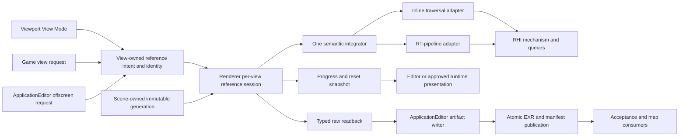

# Reference Path Tracer Execution Architecture

**Status:** proposed target architecture for `FCR-REN-08`; implementation remains blocked until `PTD-00` accepts the transport/domain decisions and the plan is reconciled to that exact report revision

**Scope:** define the owner, contracts, lifetime, execution, sampling, accumulation, viewport interaction, artifact, automation, and clean-break boundaries for SparkleEngine's eventual Reference Path Tracer

**Authority boundary:** [Transport And Estimator](TransportAndEstimator.md) owns equations and estimator semantics, [User Experience](UserExperience.md) owns the viewport/runtime/offscreen experience, [Discovery](Discovery.md) owns ratification, the [feature dossier](README.md) owns acceptance, and the [staged plan](Plan.md) owns delivery order

**Verified:** 2026-09-09 against committed `master` revision `20c7bb11`; current-state statements are source inspection only

**Naming reconciliation:** the 2026-09-09 working-tree clean break makes `ReferencePathTracer` the sole feature name; the verified baseline and all non-claims remain unchanged.

**Priority reconciliation:** 2026-09-10 makes the responsive live viewport slice the first architecture milestone and places durable artifact workflow after it; this changes no current-source or readiness claim.

**Current readiness:** **20/100** — the source tree has an interactive GBuffer-seeded candidate branch and a separate generic view-mode menu, not the independent viewport reference session described here. See [Current Feature Readiness](../../../../../../../Acceptance/CurrentReadiness.md#renderer).

**Non-claims:** no target contract is accepted, no production code was changed, and no build, shader compile, runtime, GPU, image, convergence, backend, performance, package, or release evidence was produced by this architecture document

The target is one bounded, restartable **per-view reference session** selected as `RenderViewMode::ReferencePathTracer` immediately after Lit. It traces camera paths over immutable Scene- and View-owned generations, accumulates automatically while the effective view is unchanged, invalidates before mixing changed inputs, and can publish raw scene-linear evidence atomically. A secondary offscreen run uses the same session semantics. This is not a quality preset layered onto the current GBuffer-seeded `LightingMode::ReferencePathTracer` branch.

> [!IMPORTANT]
> **Current state:** Target architecture; not implemented or accepted.
>
> **Gate:** Stage 1 implementation may begin only after the [discovery contract](Discovery.md) records `PTD-00 PASS` and the [delivery plan](Plan.md) names that exact report revision.
>
> **Naming rule:** Until `FCR-REN-08` passes, current output remains a **candidate comparison**. Neither a UI label nor an artifact may call it unbiased, ground truth, or an accepted reference.

## Delivery Priority And First Usable Slice

Architecture is delivered in the [UX priority order](UserExperience.md#product-priority-order), not in artifact order. The first usable vertical slice is one PBR-correct Renderer/RHI path feeding an in-memory per-view accumulator, a continuously refreshed viewport derivative, exact progress/reset snapshots, responsive Editor/Game navigation, automatic refinement after movement stops, and exact Lit comparison retention. It contains no required file dialog, EXR writer, checkpoint import, offscreen command, or output-path policy.

Typed readback and minimal durable publication are added after that slice to earn and retain acceptance evidence. Polished artifact workflow remains secondary. This separation is a dependency rule, not a correctness waiver: the first viewport slice is not an accepted reference until the final evidence matrix passes, while a complete artifact writer is not product progress if the viewport loop is unusable.

## At A Glance

| Target provides | Target deliberately does not provide |
| --- | --- |
| Independent camera rays; frozen Scene/View inputs; one semantic path estimator; deterministic sample identity | A second scene database, material system, render graph, or general-purpose renderer framework |
| Live raw HDR accumulation, viewport derivative, exact progress/reset truth; later evidence readback, AOVs, provenance, checkpoints, and atomic completion | Denoising, exposure, tone mapping, output encoding, or screenshot pixels in the oracle value |
| Strict D3D12/Vulkan capability truth and thin Inline/RGS traversal adapters | Silent backend/frontend substitution or vendor-specific estimator forks |
| First-class viewport view mode, truthful progress/reset feedback, Lit comparison retention, raw export, and secondary noninteractive invocation over the same session contract | A mandatory render wizard, second path-tracer executable, or Shipping consumer debug surface by default |
| Full supported surface-transport mode and a separately named finite-path diagnostic mode | A silently truncated “unbiased” result, contribution clamp, firefly filter, or approximate cache |

## Current Route Versus Target Route

| Concern | Current source route | Required target |
| --- | --- | --- |
| Invocation | `LightingMode::ReferencePathTracer` runs as a global interactive lighting branch, while `RenderViewMode` contains Lit/debug presentation choices but no Reference Path Tracer item. | `RenderViewMode::ReferencePathTracer` appears immediately after Lit. Selection automatically validates and starts one bounded per-view session; export and offscreen automation consume the same session contract. |
| Primary visibility | `GBufferPathSurface.hlsli` starts paths from production GBuffer values. | Camera sample to primary ray to canonical scene hit; no production GBuffer or reconstruction input. |
| Estimator | Separate direct and indirect passes, analytic-light iteration, BSDF continuation, fixed bounce/distance limits, and no complete light/BSDF MIS contract. | One reviewed camera-path estimator with event, measure, probability, emission, NEE, MIS, roulette, rejection, and termination correspondence. |
| Identity | Samples are coupled to render `FrameIndex`. | Stateless view-session/pixel/sample/dimension identity, independent of presentation frame time, queue order, batch size, mode switches, and restart. |
| State | Temporal frame history plus a hash of lighting state, path settings, view mode, and view/projection matrices; no target completion, reasoned reset, or view-session contract. | View-owned identity plus Renderer-owned exact prefix, reasoned invalidation, Lit-comparison suspension/resume, target completion, optional verified checkpoint, and transactional export states. |
| Output | Common composite, sky, exposure, reconstruction, tone map, encode, and present remain downstream. | Raw linear radiance and diagnostics publish before presentation; preview is a derivative with explicit lineage. |
| Authority | Useful source-present candidate; no numerical or runtime oracle proof. | Authority is earned only by the [feature acceptance contract](README.md#acceptance-criteria) and retained `FCR-REN-08` evidence. |

The completion change is therefore a clean break in selection and authority. It may reuse independently testable leaves, but it must not keep the old Lighting selector/frame-history estimator as a second reference producer. The viewport mode selects the one reference semantic directly; it does not mutate persistent Lit settings behind the user's back.

## Product And Mathematical Claim

`PTD-00` must accept the exact equation, notation, decision slots, and `MATH-*` correspondence in [Transport And Estimator](TransportAndEstimator.md). This architecture constrains the decision to two explicit products:

| Product | Required claim | Termination behavior | Permitted use |
| --- | --- | --- | --- |
| `SurfaceTransportReference` | For the included camera, surface, material, and light domain, the estimator targets the full supported surface-light-transport integral. | Compensated Russian roulette is the ordinary stochastic termination. An implementation safety ceiling is a detected sample/session failure, never an accepted zero contribution. | Candidate oracle after all applicable `AC-RPT-*` criteria pass. |
| `FinitePathDiagnostic` | The estimator targets an explicitly declared maximum scattering-event domain. | The deterministic maximum is part of the artifact identity and output name. | Analytic fixtures, event isolation, convergence diagnosis, and cross-renderer matching; never silently substituted for the full product. |

The Reference Path Tracer is not constrained to finish inside a real-time frame budget even though its primary interaction is a progressive viewport session. “Bounded session” means bounded requested samples, wall time, memory, checkpoint/export work, and cancellation latency. It does not authorize a hidden deterministic path cutoff in `SurfaceTransportReference`. Unsupported or unrepresentable events fail the session or keep the domain excluded; they do not disappear as black.

The first accepted domain should be the smallest complete surface domain exercised by the frozen release maps:

- frozen perspective pinhole camera and exact subpixel sampling;
- triangle meshes and instances, with frozen evaluated skin/morph state only when reachable in scope;
- opaque and alpha-tested/two-sided surfaces with the accepted UV, texture decode, filtering/LOD, normal-map, metallic-roughness, dielectric-F0, and emission rules;
- directional, point, spot, rectangle/area, emissive-triangle, and environment lights that are reachable in the release scope;
- scene-linear surface reflection and emission with declared radiometric units;
- no blended transparency, transmission/interior stack, participating media, physical BSSRDF, spectral transport, or unrestricted caustics claim unless `PTD-00` expands the equation, state, fixtures, and evidence together.

An excluded feature must be unreachable in the reference view/offscreen request or rejected before sample zero with its exact unsupported semantic. A release map cannot exercise an excluded row and still consume the result as its reference.

## Ownership And Dependency Boundary



| Owner | Owns | Must not own |
| --- | --- | --- |
| Scene | Canonical geometry, material, texture, light, environment, instance, and acceleration-structure generations; safe retirement. | Reference session state, sample ordinal, convergence, output paths, or evidence verdicts. |
| View | Viewport/selection identity, kind, camera model, projection, transform, resolution/crop/filter, reference-mode request, and other accepted view semantics. | Scene data, estimator internals, or process-global Reference Path Tracer policy. |
| Renderer reference session | Automatic request validation, immutable generation leases, transport digest, state machine, estimator configuration, active frontend, sample ranges, accumulation/display/diagnostic resources, exact progress, reset reasons, target completion, comparison suspension, and terminal result. Later evidence stages add checkpoint/readback requests without changing this authority. One logical session belongs to one view identity. | File-dialog/editor presentation, persistent Lit-setting mutation, generic RHI policy, or a copied scene/material database. |
| Integrator semantic core | Camera/sample construction, path state, material/light evaluation contracts, NEE/MIS, roulette, robust spawn use, AOV/event classification, and invalid accounting. | API-specific SBT/root-signature/descriptor vocabulary or UI policy. |
| Traversal adapters | Translate semantic trace/visibility operations into Inline RayQuery or the native ray-tracing pipeline. | Different transport equations, materials, lights, RNG, or output meanings. |
| RHI | Capability reporting, AS/pipeline/descriptors/queues, barriers, readback mechanics, completion, device/validation errors, and resource retirement. | Reference labels, estimator choices, checkpoints, file schema, or silent fallback policy. |
| ApplicationEditor operation | Create an offscreen view request for automation, observe/cancel it, schedule nonblocking readback/export, enforce filesystem budgets, and return stable command results. | A second estimator, duplicate render state, or the primary interactive selection authority. |
| Editor viewport UI | Place Reference Path Tracer immediately after Lit; present automatic validation, live newest-view progress, reset/completion state, pause/restart/details, and comparison behavior from Renderer snapshots. Secondary evidence stages may add save actions. | Renderer truth, a second job state machine, hidden global-setting mutations, or Shipping-runtime exposure. |
| Evidence/release owner | Fixture manifests, thresholds, repetitions, comparisons, approval, and completion reports. | Mutating candidate output or treating source presence as a pass. |

Each committed prefix is bound to immutable leases and identities over Scene/View-owned generations. It is not a deep-copied alternative world. A contributing mutation publishes a new generation, invalidates the old prefix before the next sample-range commit, and begins a new session digest at ordinal zero. If a producer cannot provide complete generation truth, that dynamic domain is rejected rather than blended.

## Intended Source Shape

The implementation extends existing modules and keeps public vocabulary narrow. Exact filenames are selected against the live tree, but ownership should converge on this shape:

| Repository surface | Intended contents |
| --- | --- |
| `Engine/Renderer/Public/ReferencePathTracer/` or the nearest live semantic owner | Only the per-view request, progress/reset snapshot, result, product/frontend enums, and typed artifact-readback contracts a real consumer needs. Do not publish private pass vocabulary. |
| `Engine/Renderer/Private/ReferencePathTracer/` or the existing per-view state owner | Session validation/state, transport digest, immutable leases, sample ranges, accumulator, invalidation classification, diagnostic/readback scheduling, and orchestration of the semantic integrator. |
| `Engine/Renderer/Private/RayTracing/Effects/ReferencePathTracer/` or the nearest live semantic-effect owner | Integrator bindings and thin Inline/Pipeline adapters; no application, file, or UI policy. Extend an existing owner instead when inspection shows it is already the singular authority. |
| `Engine/Assets/Shaders/RayTracing/ReferencePathTracer/` | Shared sample, path-state, BSDF/light estimator, robust-ray, diagnostic, accumulation, and frontend shader code. Do not fork by API. |
| `Engine/Renderer/ShaderRegistrations/` | Only registrations for actual passes/programs; generated metadata remains authoritative. |
| `Engine/Application/Private/ReferencePathTracer/` and `EditorOperations/` | Bounded asynchronous artifact writing, optional offscreen command execution, stable results, and shutdown coordination. |
| `Engine/Editor/Private/Panels/` and current viewport owners | View-mode ordering/selection, progress overlay, details/save presentation, and Lit-comparison interaction over View/Renderer contracts. |

Do not create a top-level `PathTracer` engine, a new executable, a parallel `ReferenceRenderer` module, or public per-pass classes. If the live owner already provides the required abstraction, extend it rather than manufacturing the suggested directory.

## End-To-End View Route

```text
Viewport selects RenderViewMode::ReferencePathTracer
    -> View owner preserves Lit settings and resolves canonical RenderView identity/camera/extent
    -> Renderer resolves the accepted reference preset and validates domain/capability/resource budget
    -> acquire immutable SceneGeneration + View semantic identities + shader/asset identities
    -> canonicalize transport inputs and compute InputDigest
    -> allocate or revalidate the view-session accumulator, diagnostics and traversal state
    -> execute exact SampleRange batches through one semantic integrator
    -> before each commit, reject a stale generation/digest and report the first reset reason
    -> publish exact committed/target prefix to the viewport progress snapshot
    -> stop at target, suspend on mode exit, or resume only on an exact identity match
Optional save/offscreen operation
    -> typed readback of raw sums/counts/AOVs/counters from that session
    -> ApplicationEditor writes staging directory
    -> hash every artifact and write completion manifest last
    -> atomic publish to final invocation directory
    -> expose completed artifact set to UI/command/evidence consumers
```

No consumer reads an in-progress directory as complete. The writer creates a uniquely named staging sibling on the destination volume, makes every required file durable and hashed, writes the manifest last, then performs the accepted same-volume atomic publication operation. A cross-volume move is never treated as atomic. Failed publication preserves the last valid completed directory and retains a separately labeled failure record when possible.

The primary loop ends at the progress snapshot and viewport presentation above. On every canonical camera mutation, the session stops scheduling the superseded identity, rejects late completion before commit, starts the newest accepted identity at ordinal zero, and publishes its newest completely committed display prefix at bounded cadence. UI notifications may coalesce a movement burst; semantic identities and reset accounting may not. When the camera becomes stable, sampling continues without a new user command. Readback, checkpoint, export, or preview-quality work cannot delay that response beyond the frozen budget.

## Contract Vocabulary

Names are illustrative until implementation review, but responsibilities are fixed.

| Contract | Required content |
| --- | --- |
| `ReferencePathTracerViewRequest` | View identity/handle, accepted camera/extent/crop/filter semantics, target product, exact target SPP, seed/replicate, backend/frontend request, included domain, and bounded GPU batch/memory/checkpoint/readback policy. It contains no file path, codec, dialog, or widget state. |
| `ReferencePathTracerInputDigest` | Canonical hash of every transport-affecting scene, view, asset, shader, compiler, estimator, backend/frontend, sampler, domain, and resolution value. View-mode selection, target SPP, presentation settings, wall clock, batch size, and invocation-only fields do not enter this digest. |
| `ReferencePathTracerSessionHandle` | Stable view-session identity and observation/pause/restart/checkpoint/readback capabilities without exposing mutable implementation state. |
| `ReferencePathTracerProgress` | State, exact committed/target sample prefix, elapsed time, active backend/frontend, last reset reason/discarded prefix, memory estimate, checkpoint/export status, counters/warnings, and terminal error category. |
| `ReferencePathTracerResult` | Current complete/partial/failed state, input digest, committed prefix, counters, uncertainty, and explicit candidate/accepted authority label. An artifact location appears only after successful export. |
| `ReferencePathTracerSampleRange` | Half-open, non-overlapping sample-ordinal range assigned to a batch. Completion becomes visible only when the entire range is committed. |
| `ReferencePathTracerSubmission` | Secondary ApplicationEditor-owned serializable project/level/camera locator, output destination, filesystem/disk/wall-time/checkpoint policy, and reference View request. It creates an offscreen canonical view; it is not a second scene or estimator format. |
| `ReferencePathTracerArtifactManifest` | Product/domain, complete input identity, source/build/compiler/shader/asset hashes, camera/scene semantics, sampler, sample prefix, accumulation policy, backend/frontend, raw/AOV file metadata, counters, budgets, timing, checkpoint lineage, and completion status. |

There is no compatibility reader, legacy alias, or dual manifest representation. During alpha development, a contract change invalidates and regenerates local checkpoints/artifacts.

## State And Lifetime

```mermaid
stateDiagram-v2
    [*] --> Inactive
    Inactive --> Validating: select Reference Path Tracer
    Validating --> Accumulating: supported and frozen
    Validating --> Unavailable: unsupported
    Accumulating --> Resetting: transport identity changes
    Complete --> Resetting: transport identity changes
    Resetting --> Validating: new identity
    Accumulating --> Complete: committed prefix reaches target
    Accumulating --> Paused: pause
    Paused --> Validating: resume
    Accumulating --> Suspended: leave Reference Path Tracer
    Complete --> Suspended: leave Reference Path Tracer
    Suspended --> Validating: return and revalidate
    Accumulating --> Checkpointing
    Checkpointing --> Accumulating
    Checkpointing --> Paused
    Complete --> Exporting
    Accumulating --> Exporting: save exact partial prefix
    Exporting --> Complete
    Exporting --> Accumulating
    Exporting --> ExportFailed: export failed; session preserved
    ExportFailed --> Complete: source prefix was complete
    ExportFailed --> Accumulating: source prefix is still running
    Validating --> Failed
    Accumulating --> Failed
    Inactive --> [*]
```



State invariants:

1. `Validating` treats View/Application intent as untrusted and allocates no unbounded work. Supported selection advances automatically; there is no mandatory Start action.
2. `Accumulating` means every contributing generation and semantic field is fixed for the current digest. Only complete, non-overlapping sample ranges become progress.
3. Before a range commits, its captured digest/generations are compared with the current session identity. A mismatch discards the stale range and old prefix, enters `Resetting`, records the first reason and discarded count, then begins ordinal zero under the new digest.
4. `Complete` means the exact committed prefix met the requested target. It is not a convergence or accepted-oracle verdict, and lowering the target never rewrites the actual prefix.
5. Leaving Reference Path Tracer reaches `Suspended` only after the current range settles. Returning resumes only after full-digest validation. View-mode selection itself is scheduling state, not a transport input.
6. `Paused` may retain a bounded in-memory prefix. A durable resume promise requires `Checkpointing` to hash and verify that exact prefix before promised GPU resources retire.
7. `Exporting` snapshots one complete committed prefix. Estimator progress may continue only when the readback contract guarantees that immutable prefix; the final manifest publishes last.
8. A failed export does not fail or mutate a valid in-memory session. Failed, cancelled, timed-out, corrupt, partial, or staged output cannot carry a completed-artifact marker.
9. Device loss invalidates GPU-resident accumulation and fails the affected session; resume is allowed only from a verified host checkpoint.
10. Late completion/readback/export callbacks are generation checked and cannot publish into a reset, destroyed view, or later session.

One logical session belongs to each eligible View identity, but initially only one session may own an actively accumulating GPU prefix per Renderer instance. Another viewport or offscreen request receives an explicit capacity state and transfer/cancel choice; it never silently steals or allocates a second unbounded accumulator. A suspended Lit-comparison prefix is retained only within the accepted memory policy, and an eviction is visible.

## Frozen Scene And View Inputs

The session acquires generation-stable views of canonical render data:

- Scene generation and acceleration-structure identity;
- instance-to-geometry/material mapping, current evaluated transforms, visibility masks, winding, sidedness, and scene units;
- vertex/index/UV/normal/tangent and alpha-test inputs needed by the accepted hit contract;
- texture content hashes plus decode, color-space, addressing, filtering, and LOD policy;
- material parameters and callable/evaluation identity;
- analytic/emissive/environment light records, units, selection distribution, and environment texture identity;
- View camera type, transform, projection/lens fields, crop, shutter/time if included, and output resolution;
- shader source/generated metadata/compiler/configuration identities and active backend/frontend capability.

The integrator reconstructs the primary surface from the ray hit. It does not consume GBuffer depth, normal, material, motion, or reconstructed lighting. Shared material or light leaves are allowed only where one canonical implementation prevents drift and the [oracle ladder](Research.md#oracle-ladder) has an independent way to falsify that leaf.

The camera fingerprint is built from canonical post-resolution semantic fields, not raw structure bytes: Viewport/selection identity, View kind where it changes semantics, active camera identity, position/orientation, projection kind, unjittered projection/lens values, admitted shutter/time values, crop/filter, and actual render extent. Editor input activity and Game camera cut/teleport signals improve the reason code but are not the authority. Any field that changes generated primary rays resets with no movement epsilon. Ordinary real-time TAA jitter and frame index never enter the reference fingerprint.

Every Editor and Game camera producer converges through the same `RenderViewInput.Camera` and View-state boundary. Editor free-flight, orbit, pilot/eject, focus/bookmark, and scene-camera edits are not special-cased inside the path tracer. Runtime controller motion, animation, cuts, teleports, camera replacement, and lens edits use the same comparison after their owner resolves the effective camera.

## Invalidation Classification

The Renderer computes an explicit invalidation result, not one opaque history-valid bit:

| Class | Inputs | Session response |
| --- | --- | --- |
| `TransportReset` | Any effective camera/ray-distribution field; render extent/crop/filter; contributing scene/geometry/transform/deformation/material/texture/light/environment/visibility/AS generation; product/domain; seed/replicate/sampler/dimensions; transport setting; shader/compiler; precision; strict backend/frontend | Settle/discard stale in-flight range, invalidate the old prefix, record reason and discarded count, validate the new digest, restart at ordinal zero. |
| `GoalUpdate` | Target SPP | Raising continues the same stream. Lowering to or below the prefix stops at the actual already committed count. No reset. |
| `PresentationRefresh` | Exposure, tone map, gamut/encoding, raw-derived false color, overlay/UI layout/scale, progress polling | Re-present the same raw prefix and update display lineage. No transport reset. DPI resets only when it changes actual render extent. |
| `SchedulingUpdate` | Batch size, preview cadence, ETA model, wall-time extension, queue timing | Preserve digest, prefix, and sample identity. Resource failure may explicitly suspend/fail but never silently reset. |
| `ModeSuspend` | Switching from Reference Path Tracer to Lit/another mode | Stop new work after a complete range and retain one bounded per-view prefix. The selected non-Reference-Path-Tracer mode is not hashed into transport identity. |
| `ResumeOrReset` | Returning to Reference Path Tracer | Recompute full identity. Resume the retained prefix only on an exact match; otherwise reset and report the first changed semantic. |
| `Unsupported` | Reachable dynamic/content/capability input lacks accepted semantics or complete generation publication | Reject before sample zero or fail/reset before mixing; never approximate, freeze accidentally, or accumulate streaks. |

Continuous camera/scene animation therefore produces repeated, explained resets instead of a blended image. For an accepted frozen-time workflow, the time and evaluated pose are part of the digest. If the engine cannot prove that every time-dependent contributing value is frozen or generation-observed, the view is unavailable for the reference claim.

## Sampling Contract

Sampling is stateless and order-independent:

```text
RandomValue = Sample(SessionSeed, PixelCoordinate, SampleOrdinal, DimensionId)
```

- `SampleOrdinal` starts at zero for one transport digest and is independent of renderer frame index, batch size, queue order, pause, mode suspension, and resume.
- Every conceptual decision has a named dimension range: film, lens/time when included, light selection, light surface, lobe selection, BSDF sample, roulette, and later-bounce repetitions.
- The accepted `PTD-00` report selects and pins the generator plus conversion-to-float rule. A counter-based independent generator is the correctness baseline; low-discrepancy sequences may replace it only with an equally explicit dimension/prefix and correlation contract.
- Restart with the same input digest and committed prefix continues at the next ordinal. It neither replays nor skips a sample.
- Different statistical replicates use explicit independent seeds and retain them; changing the seed does not change any other input identity.
- A generator or dimension-layout change invalidates prior checkpoints. It is a clean break, not a compatibility path.

The sample stream is inspectable through a small deterministic dump used by analytic checks. It is not tied to a submitted general random-number test framework.

The exact key/counter packing, float conversion, dimension assignment, branch behavior, replicate identity, and invalidation rule are owned by [`MATH-09`](TransportAndEstimator.md#math-09--stateless-sample-identity). A stateful or frame-index-derived generator cannot satisfy this architecture even if one fixed run repeats.

## One Semantic Integrator

The estimator is one semantic contract shared by traversal frontends. The authoritative proposed event sequence and contribution formulas are [the reference algorithm and `MATH-*` ledger](TransportAndEstimator.md#reference-algorithm); this section owns only the state and architecture correspondence. A path sample owns:

- camera ray and throughput;
- current geometric and shading frame;
- event/lobe and delta classification;
- accumulated radiance and first-event AOV classification;
- previous strategy PDF information needed for MIS of emissive/environment hits;
- scattering depth and compensated roulette state;
- invalid/rejection/failure reason.

For every non-terminal surface event the reviewed code must make the following correspondence visible:

1. evaluate emission under the accepted sidedness rule and weight it against the prior sampling strategy when both strategies can generate the path;
2. select an eligible light using a frozen probability mass function, sample it in its native measure, convert to solid angle at the shading point, trace a connection ray with exact endpoints, and apply the accepted MIS rule;
3. select and sample one BSDF event, returning value, PDF in the same measure, event flags, and next direction from the same material contract used for evaluation;
4. update throughput with every selection probability and cosine/Jacobian exactly once;
5. apply shading-normal correction if accepted, finite checks, and compensated Russian roulette at the frozen rule;
6. spawn the next ray from robust geometric bounds and continue, or record the precise terminal/failure event.

Delta lights/lobes, zero PDFs, alpha rejection, miss/environment, emissive hits, and roulette survival are explicit branches in the derivation and event trace. `NaN`, infinity, invalid PDF, impossible negative radiance, safety-depth reach, and counter overflow increment retained diagnostics and invalidate the affected sample or job according to the frozen rule; they are never silently clamped away.

## Ray Robustness

Primary, continuation, and connection rays use a single Renderer-owned robust endpoint policy derived for Sparkle's vertex formats, transforms, compiler behavior, and both APIs. The policy distinguishes geometric normal from shading normal, carries reconstruction/transform error bounds, chooses the offset side from the outgoing direction, and shortens connection endpoints using receiver/emitter bounds.

The existing fixed `MinT`, normal bias, grazing multiplier, and maximum distance cannot remain hidden controls in raw reference output. They are deleted from the reference authority or confined to an explicitly named diagnostic path. Scale, large translation, nonuniform scale, shear, mirrored instances, grazing incidence, adjacent/coplanar triangles, thin gaps, and strong normal maps are acceptance fixtures, not per-scene tuning opportunities.

## Accumulation, Checkpoint, And Diagnostics

The per-view session accumulator owns one complete fixed sample prefix for every pixel under one transport digest. The accepted precision study chooses the concrete representation; architecture requires:

- radiance sum or an arithmetic-mean representation with compensated/pairwise error control justified at the maximum accepted SPP;
- exact integer sample count separate from radiance channels;
- second moment or equivalent data sufficient for variance and standard-error estimates;
- distinct raw beauty and required lobe/event AOVs without changing path energy;
- ray, shadow-ray, path-length, roulette, alpha-rejection, invalid-value, safety-depth, and overflow counters;
- deterministic reduction order within the declared backend tolerance, or a documented statistical rather than bitwise parity contract;
- mutation-free checkpoint data bound to the full input digest and exact committed prefix.

Adaptive per-pixel stopping is absent from the initial correctness route. It can enter only with a derivation, sampling/variance contract, mask artifact, and evidence that the stop rule does not create an undeclared target. Fixed requested SPP plus independently evaluated statistical acceptance keeps execution and proof separable.

Target SPP is a scheduling/completion goal, not part of the estimator stream. Increasing it continues at the next ordinal. Decreasing it cannot erase already committed samples; the session completes at its actual prefix when that prefix meets the new goal. Progress publishes immutable snapshots containing state, exact committed/target counts, first invalidation reason, discarded prefix, active route, counters, and bounded throughput/ETA data. The UI never derives authoritative progress from frame count.

## Secondary Artifact Contract

This contract is required for final evidence but is implemented after the usable viewport slice. It must reuse the existing session and may not introduce a competing rendering, accumulation, or resolution authority.

The completed directory contains at minimum:

| Artifact | Required semantics |
| --- | --- |
| `beauty.exr` | Raw scene-linear HDR radiance for the accepted sample prefix; no display transform or denoising. |
| `aov-*.exr` | Included albedo, geometric/shading normal, depth, direct/indirect or first-event classifications, variance/standard error, and other accepted diagnostics. AOV definitions are named in the manifest. |
| `manifest.json` | Canonical identity, scope, settings, hashes, backend/frontend, counts, counters, budgets, timing, lineage, and completed status; written last. |
| `events.json` or bounded diagnostic equivalent | Only for requested analytic/minimal cases; deterministic path-event evidence with an explicit size cap. |
| `preview.*` | Optional derivative for humans, with exposure/tone/encoding settings and the raw artifact hash. It is never a comparison source. |

OpenEXR is the required high-dynamic-range interchange container unless `PTD-00` records a stronger alternative. Existing readback mechanics should be extended rather than duplicated. The ApplicationEditor writer may use the repository's existing TinyEXR dependency only after ownership, write support, security, rights, build, and package review; TextureCooker ownership does not automatically authorize a Renderer dependency.

Raw publication defaults to the exact current session render extent and numeric precision. It never reads a UI-scaled backbuffer, screenshot surface, downsampled progress preview, or thumbnail. An explicitly requested different crop or extent creates a separate identity and result; it is not a convenient lower-resolution copy mislabeled as the viewport session.

A progressive UI preview may read the latest completely committed prefix at a bounded cadence and pass it through a separately identified display transform. Preview work cannot delay sample-prefix commits beyond the accepted budget, mutate the accumulator, feed transport, change the stop rule, or become the saved comparison source.

Default development output is under `Saved/ReferencePathTracer/<ExportInvocationId>`. An explicit output path must pass canonicalization, writable-root, free-space, overwrite, and atomic-publish checks. Packaged execution depends on the release writable-root contract; the installation directory is never assumed writable.

## Traversal And Backend Strategy

Inline and native ray-tracing-pipeline execution are thin mechanisms beneath the same semantic integrator:

| Route | Role | Acceptance boundary |
| --- | --- | --- |
| Inline RayQuery | First implementation route because the current material-hit and traversal infrastructure already reaches both APIs. | Must expose exact active capability and pass the entire semantic/robustness/backend matrix. |
| Native RGS/TraceRays | Independent traversal frontend and parity route after the estimator is stable. | Uses explicit path/visibility ray types, payloads, miss/any-hit/closest-hit programs, and `RayTracingShaderTablePlan`; no copied estimator. |
| Wavefront/compacted execution | Deferred performance option only. | Enters after captures show the megakernel violates an accepted budget and a design proves identical sample/event semantics, queue bounds, and diagnostics. |

Automatic selection may choose only between already accepted routes and records the resolved route. Strict Inline, Pipeline, D3D12, and Vulkan requests fail visibly when unavailable. No route silently switches backend, disables a feature, lowers path domain, or reuses the real-time tracer.

## Workflow And Reachability

[User Experience](UserExperience.md) owns the complete interaction contract. Architecture requires three consumers in priority order:

1. **Editor viewport:** `Reference Path Tracer` is the second top-level view-mode item, immediately after Lit. Selection preserves Lit settings, performs automatic preflight, starts accumulation on success, remains responsive while the camera moves, and displays the newest accepted composition with a compact progress/reset/completion overlay. Details expose exact settings, pause/restart, and counters without becoming a prerequisite; checkpoint/save appear later under a secondary Evidence/Output group.
2. **Approved non-Editor view:** a Game-kind RenderView requests the same semantic through its ordinary view-settings owner. Its UI may differ, but canonical camera identity, invalidation, progress, target completion, raw/presentation separation, and failure states cannot.
3. **Noninteractive ApplicationEditor operation:** a submission manifest creates an offscreen canonical view, observes the same Renderer session, exports a completed prefix, returns stable categories, and enables reproducible evidence without UI automation.

The primary comparison loop is Reference Path Tracer -> Lit -> Reference Path Tracer on one unchanged View. Leaving Reference Path Tracer suspends after a complete range and restores untouched Lit state. Returning resumes only when the full digest still matches; scene/camera changes made while in Lit invalidate the retained prefix. Memory-policy eviction and single-active-view capacity are explicit events, never silent loss.

While Reference Path Tracer is selected, navigation is a first-class state transition rather than cancellation of a render job. The viewport may show low-SPP noise during movement, but not an unlabeled old composition or a frozen final frame. After the last movement update, the final identity accumulates immediately without a `Start` or `Restart` action.

The overlay displays exact committed/target prefix, target ratio, last reset reason, active route, measured throughput, clearly estimated ETA, and correctness counters. A completed compact badge remains visible until the mode changes or identity resets. ETA and target SPP are never convergence or authority criteria.

Raw export is optional and secondary. `Save Raw Result` or `Save When Complete` reads the same session prefix; `Save Current Prefix` is explicitly partial. Export failure does not destroy the live prefix or a prior result. There is no second render launched merely because the user saves.

The tool is excluded from `ShippingGame` and consumer first run by default. If release scope later exposes it, dependencies, writable roots, support contract, selector reachability, and performance expectations must be admitted explicitly. A developer console/CVar may diagnose selection but is not the product workflow.

## Failure And Recovery Contract

| Failure | Required outcome |
| --- | --- |
| Unsupported material/light/camera/backend/frontend | Keep the view unavailable before sample zero with the exact unsupported row and no plausible fallback output. |
| Effective Editor or Game camera changes | Discard the old prefix before any new-camera range commits, record the exact cause/discarded count, and restart at ordinal zero. Input flags refine the reason but canonical camera identity is authoritative. |
| Scene/view/shader/asset identity changes | Discard or reject stale in-flight work, invalidate the old prefix, and begin a new digest. If complete generation observation or immutability cannot be guaranteed, the affected domain is unavailable. |
| Continuous camera/scene animation | Show repeated reset state and recommend a frozen supported time; never blend frames into streaked reference output. |
| Switch to Lit and back | Suspend the bounded prefix and restore Lit settings; resume only on exact digest match, otherwise reset with the first changed field. |
| Presentation-only change | Refresh the viewport derivative without resetting raw accumulation. A display control entering the transport digest is an architecture defect. |
| Invalid PDF/radiance/normal/event or safety-depth reach | Retain counters and bounded event context; fail the affected analytic case and apply the accepted production sample/job invalidation rule. Never hide it with a clamp. |
| Timeout or user cancellation | Stop new batches, reach terminal state within budget, publish no completion manifest, retain only labeled diagnostics/verified checkpoint, retire resources safely. |
| OOM or capacity refusal | Fail before unbounded allocation where predictable; otherwise preserve device/process integrity, classify the failure, and leave the prior valid output intact. |
| Device loss/TDR | Fail the session, capture available RHI diagnostics, invalidate GPU-only state, and permit resume only from a verified host checkpoint after device recovery. |
| Disk full, access denied, writer/codec error | Fail publication, delete or quarantine only the new staging directory, preserve prior completed artifacts, and report required/available space. |
| Corrupt or mismatched checkpoint | Reject without partial import, identify the first identity/hash mismatch, and offer a clean session restart. |
| Backend disagreement or native validation output | Mark evidence `Blocked`/`Inconclusive`; do not average, threshold-tune, or silently prefer one backend. |

These behaviors refine [the runtime failure ledger](README.md#runtime-failure-modes); the ledger, not this page, owns acceptance results.

## Clean-Break Migration

The implementation retires duplicate or misleading authority in the same change that installs the replacement:

1. add `RenderViewMode::ReferencePathTracer` immediately after Lit and remove `LightingMode::ReferencePathTracer` as a competing public selector; the view mode directly selects the one reference session;
2. remove `ReferencePathTracer` direct/indirect production and temporal-accumulation ownership once their required diagnostic value is available through the per-view camera-path session;
3. remove frame-index sample identity, motion-history reuse, fixed reference `NormalBias`/`MaxDistance`/bounce settings, and common post-process output from the oracle route;
4. update all selectors, settings persistence, generated metadata, shader registration, CMake membership, docs, and consumers together;
5. retain shared BSDF/material/light/ray helpers only when their semantic owner is singular and an independent fixture can expose their defects;
6. regenerate local artifacts/checkpoints under the new contract; do not add migration readers, aliases, adapters, or dual representations.

Exact source deletions are frozen by the plan stage that inspects the live tree. The goal is one Reference Path Tracer authority, not preserving filenames from this snapshot.

## Design Decisions And Rejected Shapes

| Decision | Why | Rejected default |
| --- | --- | --- |
| First-class per-view session rather than a separate primary render wizard or temporal frame-history mode | Matches the daily comparison workflow while preserving exact identity, bounded lifecycle, reset reasons, target completion, export, and failure truth. | Requiring a batch workspace for normal comparison, or extending the current frame-history branch with more CVars. |
| Reference Path Tracer immediately after Lit | Makes the core lighting oracle discoverable where users already choose how the viewport is rendered. | Hiding it in global Lighting settings, Expert controls, or a console command. |
| Preserve a bounded prefix across Lit comparison | Avoids paying again for an unchanged view and makes A/B inspection practical. Full revalidation prevents stale resume. | Always destroying on mode switch, or always resuming without checking identity. |
| Semantic camera identity, not input events/tolerance | Covers Editor and Game producers and prevents different measurements from mixing. | Mouse-motion flags, approximate cut thresholds, or per-camera special cases as authority. |
| Scene/View leases rather than copied world | Preserves canonical ownership and copy budget while freezing contributing generations. | A second scene loader/material database inside the tracer. |
| Camera-ray primary visibility | Lets the oracle detect raster/GBuffer primary-surface defects. | Seeding the accepted reference from the production GBuffer. |
| One semantic integrator with thin adapters | Keeps estimator math singular while providing traversal/backend evidence. | Separate inline, RGS, D3D12, and Vulkan estimators. |
| Megakernel first, wavefront only from evidence | Minimizes coordination before correctness is known. | Importing a split-kernel framework because AMD/NVIDIA examples use one. |
| Fixed sample prefix for production evidence | Makes accumulation, restart, and comparison exact and reviewable. | Adaptive stopping before its bias/statistics contract exists. |
| Raw EXR plus manifest, preview derivative | Prevents presentation from contaminating the oracle. | BMP/screenshot/tone-mapped golden images as truth. |
| ApplicationEditor writer | Keeps codec/filesystem/UI dependencies out of core Renderer and Shipping runtime. | Linking a development export stack into every runtime Renderer. |

## Support And Evidence Matrix

| Surface | Target | Current state |
| --- | --- | --- |
| D3D12 + Inline | Required strict route | Source infrastructure present; Reference Path Tracer route unimplemented/unproved. |
| Vulkan + Inline | Required strict route | Source infrastructure present; Reference Path Tracer route unimplemented/unproved. |
| D3D12 + Pipeline | Required parity route before final candidate closure unless `PTD-00` explicitly proves it unnecessary | General RGS infrastructure present; Reference Path Tracer adapter absent. |
| Vulkan + Pipeline | Required parity route before final candidate closure unless `PTD-00` explicitly proves it unnecessary | General RGS infrastructure present; Reference Path Tracer adapter absent. |
| Editor viewport view mode and progress overlay | Required primary development-product route | Generic view-mode menu exists, but Reference Path Tracer item/session/progress UX are absent. |
| Game-kind view semantic | Required shared camera/session behavior; product exposure gated separately | Canonical Game camera submission exists, but no Reference Path Tracer view semantic. |
| Noninteractive Editor offscreen session | Required reproducible secondary route | Absent. |
| Shipping consumer | Excluded by default | Must remain unreachable and dependency-free. |
| Raw EXR/manifest/checkpoint | Required for final evidence; secondary product surface after the live viewport milestone | Existing viewport BMP/readback and TinyEXR dependency are incomplete precedents, not implementation. |
| Numerical/statistical/runtime/package proof | Required by `FCR-REN-08` | Not produced by this architecture work. |

## Architecture Invariants

An implementation review fails if any invariant is false:

1. One Renderer owner defines the per-view reference session and one semantic core defines path contribution.
2. Scene owns scene data and View owns view identity/camera data; the session holds immutable generations rather than a duplicate world.
3. Requested and active backend/frontend/domain are distinct, recorded, and never silently substituted.
4. Sample identity depends on session seed/pixel/sample/dimension, never frame timing, mode switching, or scheduling.
5. The raw oracle consumes no GBuffer, ReSTIR, denoised, temporally reconstructed, exposed, tone-mapped, encoded, or screenshot value.
6. Every sampling probability, measure conversion, MIS weight, roulette probability, and rejection has one derivation and code correspondence.
7. A safety ceiling, invalid number, unsupported event, or failed export cannot look like a valid zero contribution or complete result.
8. Checkpoints and completed artifacts bind to the full input digest and exact committed sample prefix.
9. The completion manifest publishes last; partial/failed output cannot be mistaken for accepted evidence.
10. External renderer agreement supports but never replaces analytic, dependency-independent, statistical, backend, and controlled-failure evidence.
11. Preview quality has no authority over raw reference acceptance.
12. Replaced Sparkle-owned paths are removed in the same clean break; no compatibility layer preserves duplicate truth.
13. Any canonical camera or radiance-affecting input change invalidates before mixing; presentation-only and scheduling-only changes preserve the prefix.
14. Lit comparison restores untouched Lit settings and resumes a suspended reference prefix only after full identity validation.
15. Camera navigation remains responsive, superseded work never commits, the newest accepted identity reaches viewport presentation within budget, and accumulation continues automatically when motion stops; artifact work cannot outrank this loop.

## Evidence And Current Status

This document selects a target shape, not an implementation or verdict. Its source observations have not been build-, shader-, runtime-, GPU-, visual-, convergence-, performance-, package-, or release-verified in this change. `PTD-00` must still accept exact estimator mathematics, feature dispositions, concrete algorithms, numeric tolerances, fixture manifests, resource budgets, and independent review before Stage 1.

Use:

- [Feature dossier and acceptance](README.md) for `RPT-FS-*`, `AC-RPT-*`, `FM-RPT-*`, `CHK-RPT-*`, and definition of done;
- [Discovery contract](Discovery.md) for the `PTD-00` gate and evidence package;
- [Transport And Estimator](TransportAndEstimator.md) for notation, formulas, core algorithm, PBR decisions, and mathematical failure points;
- [User Experience](UserExperience.md) for viewport/runtime/offscreen interaction, view-mode placement, camera invalidation, Lit comparison, defaults, state actions, error presentation, artifacts, accessibility, and first-use proof;
- [Completion study](Research.md) for NVIDIA/AMD/neutral precedent and current-source gaps;
- [Staged implementation plan](Plan.md) for dependency order, work packages, deletions, prompts, and exit gates;
- [Ray Tracing Execution Architecture](../../RayTracing/ExecutionArchitecture.md) for shared semantic-effect and frontend policy;
- [Validation And Evidence](../../../../../../../Engineering/Verification/ValidationAndEvidence.md) for check design and claim-driven escalation.
