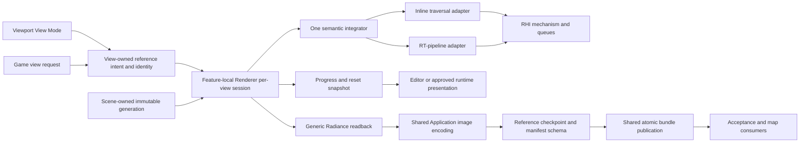
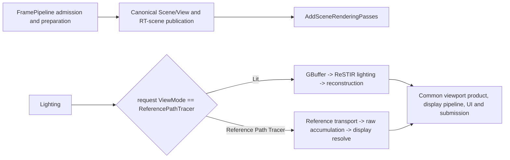
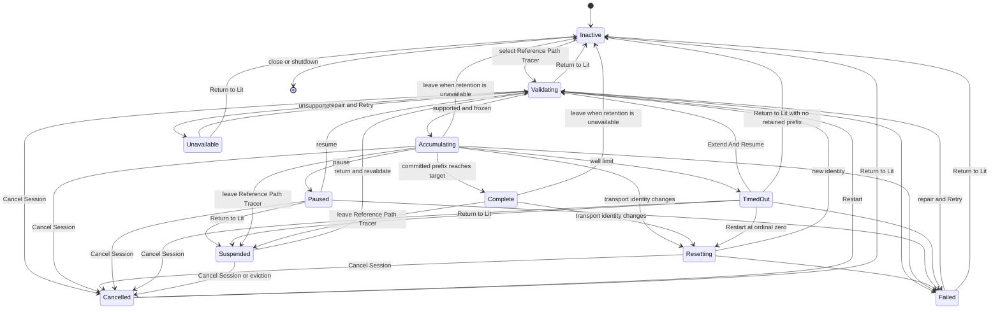

# Reference Path Tracer Execution Architecture

**Status:** Stage-0-frozen target architecture accepted by `PTD-00-R1 PASS`; Stages 1-2 pass their development gates and Stages 3-9 are **IMPLEMENTED / VALIDATION DEFERRED** with their GPU, interaction, artifact, oracle, accessibility, backend, and package evidence retained in the validation backlog; release/package acceptance remains unavailable until its evidence gates pass

**Scope:** define the owner, contracts, lifetime, execution, sampling, accumulation, viewport interaction, manual artifact, and clean-break boundaries for SparkleEngine's eventual Reference Path Tracer

**Authority boundary:** [Transport And Estimator](TransportAndEstimator.md) owns equations and estimator semantics, [User Experience](UserExperience.md) owns the viewport/runtime/manual-export experience, [Discovery](Discovery.md) owns ratification, the [feature dossier](README.md) owns acceptance, and the [staged plan](Plan.md) owns delivery order

**Verified:** re-audited 2026-09-10 against committed `master` revision `669637cf23b9748f8b94635409e74159d31d0bc2`; current-state statements are source inspection only

**Naming reconciliation:** the 2026-09-09 working-tree clean break makes `ReferencePathTracer` the sole feature name; the verified baseline and all non-claims remain unchanged.

**Priority reconciliation:** 2026-09-10 makes the responsive live viewport slice the first architecture milestone and places durable artifact workflow after it; this changes no current-source or readiness claim.

**Current readiness:** **50/100 (`45/5/0/0`)**. The original-frame alternate recipe now composes the included estimator and one feature-owned GPU session over shared camera, scene-identity, evaluated triangle, material/texture, path, light, visibility, MIS, roulette, robust endpoint, and accumulation-arithmetic owners. Stage 7 source exposes the existing mode and its operational projection. Stage 8 source adds one automatic engine-wide Inline/Pipeline resolution policy over one Reference kernel and shared scene-trace mechanics. Stage 9 source routes immutable raw prefix resources through generic capture into separately owned ApplicationEditor encoding and publication operations initiated by the viewport UI. The current tree is not cooked, GPU exercised, or artifact-round-trip tested; numeric, lifecycle, navigation, artifact, response-budget, accessibility, backend/frontend, and raw-oracle evidence remains deferred with zero executable-readiness credit. Oracle authority remains undelivered. See [Current Feature Readiness](../../../../../../../Acceptance/CurrentReadiness.md#renderer).

**Non-claims:** the current transport/material/endpoint source and predecessor builds/cooks do not prove the current shader's execution, decode correctness, endpoint conservatism, Reference-produced `Radiance` correctness, convergence, backend parity, performance, package, Shipping, or release evidence.

The target is one bounded, restartable **per-view reference session** selected by `RenderViewMode::ReferencePathTracer`, ordered immediately after Lit. The same mode travels through the ordinary view request and immutable `RenderView`; Editor owns only its label, icon, menu placement, and interaction, while RHI remains unaware. The feature is a specialized scene-rendering setup inside the existing `FramePipeline`, frame graph, Scene, View, and RHI architecture�not a separate renderer. `AddSceneRenderingPasses` is its sole graph-composition seam. It traces camera paths over immutable Scene- and View-owned generations, accumulates automatically while the effective view is unchanged, invalidates before mixing changed inputs, and can publish raw scene-linear evidence atomically. A secondary host submits the same Renderer semantic and receives the same session behavior. It is not a quality preset layered onto the retired GBuffer-seeded branch, and it does not duplicate frame ownership.

> [!IMPORTANT]
> **Current state:** `PTD-01-R2 PASS` established selector order, one stateless Private owner, a proved generic progress reader, and the obsolete-route/generated-product clean break under `CHK-RPT-17`. Stages 3-6 later established source-present GPU transport and accumulation. The 2026-09-15 one-mode clean break superseded the proposed target/show-flag split. Stage 7 exposes that single mode and its minimum operational progress/actions through the ordinary viewport boundary. Stage 8 adds source-present Inline/Pipeline adapters over one kernel, one automatic shared frontend policy, and shared scene-trace mechanics. Stage 9 adds source-present manual raw artifact capture without another renderer or RHI capture route. None of this is accepted-reference output, artifact integrity evidence, or executable parity evidence.
>
> **Gate:** Stage 1 implementation may begin only after the [discovery contract](Discovery.md) records `PTD-00 PASS` and the [delivery plan](Plan.md) names that exact report revision.
>
> **Naming rule:** Until `FCR-REN-08` passes, current output remains a **candidate comparison**. Neither a UI label nor an artifact may call it unbiased, ground truth, or an accepted reference.

## Delivery Priority And First Usable Slice

Architecture is delivered in the [UX priority order](UserExperience.md#product-priority-order), not in artifact order. The first usable vertical slice is one PBR-correct Renderer/RHI path feeding an in-memory per-view accumulator, a continuously refreshed viewport derivative, exact progress/reset snapshots, responsive Editor/Game navigation, automatic refinement after movement stops, and exact Lit comparison retention. It contains no required file dialog, EXR writer, checkpoint import, command-line render mode, or output-path policy.

Typed readback and minimal durable publication are added after that slice to earn and retain acceptance evidence. Polished artifact workflow remains secondary. This separation is a dependency rule, not a correctness waiver: the first viewport slice is not an accepted reference until the final evidence matrix passes, while a complete artifact writer is not product progress if the viewport loop is unusable.

## At A Glance

| Target provides | Target deliberately does not provide |
| --- | --- |
| Independent camera rays; frozen Scene/View inputs; one semantic path estimator; deterministic sample identity | A second scene database, material system, render graph, or general-purpose renderer framework |
| Live raw HDR accumulation, viewport derivative, exact progress/reset truth; later evidence readback, provenance, checkpoints, and atomic completion | Denoising, exposure, tone mapping, output encoding, or screenshot pixels in the oracle value |
| Strict D3D12/Vulkan capability truth and thin Inline/RGS traversal adapters | Silent backend/frontend substitution or vendor-specific estimator forks |
| First-class viewport view mode, truthful progress/reset feedback, Lit comparison retention, and manual raw export over the same session contract | A mandatory render wizard, command-line renderer, second path-tracer executable, or Shipping consumer debug surface by default |
| Full supported surface-transport mode and a separately named finite-path diagnostic mode | A silently truncated �unbiased� result, contribution clamp, firefly filter, or approximate cache |

## Current Route Versus Target Route

| Concern | Current source route | Required target |
| --- | --- | --- |
| Invocation | The current working source carries one `RenderViewMode` per view. Editor exposes `ReferencePathTracer = 1` immediately after Lit; Game/runtime can submit the same value through `RuntimeApplication::SubmitViewportRenderRequest`; `RenderViewBuilder` freezes it into View; and `AddSceneRenderingPasses` owns the Lit-versus-Reference execution branch below the generic frame composition. | Retain this one request route and prove both hosts, navigation, progress, comparison, capability, and package behavior through executable evidence. No `LightingMode`, Editor mirror enum, target/show-flag split, selector CVar, or dedicated command may return. |
| Traversal frontend | The Reference middle uses the engine-wide automatic resolver: Pipeline when complete, otherwise Inline, with no feature-specific setting. Two thin entry adapters invoke one shared estimator kernel; Pipeline reuses generic material payload/hit shaders, scene SBT, and RHI pipeline/table/dispatch mechanisms. | Prove every applicable D3D12/Vulkan automatic route, both adapters through focused evidence, and unsupported-capability refusal. Source presence is not parity evidence. |
| Primary visibility | `GBufferPathSurface.hlsli` starts paths from production GBuffer values. | Camera sample to primary ray to canonical scene hit; no production GBuffer or reconstruction input. |
| Estimator | Separate direct and indirect passes, analytic-light iteration, BSDF continuation, fixed bounce/distance limits, and no complete light/BSDF MIS contract. | One reviewed camera-path estimator with event, measure, probability, emission, NEE, MIS, roulette, rejection, and termination correspondence. |
| Identity | Samples are coupled to render `FrameIndex`. | Stateless view-session/pixel/sample/dimension identity, independent of presentation frame time, queue order, batch size, mode switches, and restart. |
| State | Temporal frame history plus a hash of lighting state, path settings, view mode, and view/projection matrices; no target completion, reasoned reset, or view-session contract. | View-owned identity plus Renderer-owned exact prefix, reasoned invalidation, Lit-comparison suspension/resume, target completion, optional verified checkpoint, and transactional export states. |
| Output | Common composite, sky, exposure, reconstruction, tone map, encode, and present remain downstream. | Scene-linear `Radiance` and exact Reference sample-prefix metadata publish before presentation; preview is a derivative with explicit lineage. |
| Authority | Useful source-present candidate; no numerical or runtime oracle proof. | Authority is earned only by the [feature acceptance contract](README.md#acceptance-criteria) and retained `FCR-REN-08` evidence. |

The completion change is therefore a clean break in selection and authority. It may reuse independently testable leaves, but it must not keep the old Lighting selector/frame-history estimator as a second reference producer. The viewport mode selects the one reference semantic directly; it does not mutate persistent Lit settings behind the user's back.

## Product And Mathematical Claim

`PTD-00` must accept the exact equation, notation, decision slots, and `MATH-*` correspondence in [Transport And Estimator](TransportAndEstimator.md). This architecture constrains the decision to two explicit products:

| Product | Required claim | Termination behavior | Permitted use |
| --- | --- | --- | --- |
| `SurfaceTransportReference` | For the included camera, surface, material, and light domain, the estimator targets the full supported surface-light-transport integral. | Compensated Russian roulette is the ordinary stochastic termination. An implementation safety ceiling is a detected sample/session failure, never an accepted zero contribution. | Candidate oracle after all applicable `AC-RPT-*` criteria pass. |
| `FinitePathDiagnostic` | The estimator targets an explicitly declared maximum scattering-event domain. | The deterministic maximum is part of the artifact identity and output name. | Analytic fixtures, event isolation, convergence diagnosis, and cross-renderer matching; never silently substituted for the full product. |

The Reference Path Tracer is not constrained to finish inside a real-time frame budget even though its primary interaction is a progressive viewport session. �Bounded session� means bounded requested samples, wall time, memory, checkpoint/export work, and cancellation latency. It does not authorize a hidden deterministic path cutoff in `SurfaceTransportReference`. Unsupported or unrepresentable events fail the session or keep the domain excluded; they do not disappear as black.

The first accepted domain should be the smallest complete surface domain exercised by the frozen release maps:

- frozen perspective pinhole camera and exact subpixel sampling;
- triangle meshes and instances, with frozen evaluated skin/morph state only when reachable in scope;
- opaque and alpha-tested/two-sided surfaces with the accepted UV, texture decode, filtering/LOD, normal-map, metallic-roughness, dielectric-F0, and emission rules;
- directional, point, spot, rectangle/area, emissive-triangle, and environment lights that are reachable in the release scope;
- scene-linear surface reflection and emission with declared radiometric units;
- no blended transparency, transmission/interior stack, participating media, physical BSSRDF, spectral transport, or unrestricted caustics claim unless `PTD-00` expands the equation, state, fixtures, and evidence together.

An excluded feature must be unreachable in the reference view or rejected before sample zero with its exact unsupported semantic. A release map cannot exercise an excluded row and still consume the result as its reference.

## Ownership And Dependency Boundary



| Owner | Owns | Must not own |
| --- | --- | --- |
| Scene | Canonical geometry, material, texture, light, environment, instance, and acceleration-structure generations; safe retirement. | Reference session state, sample ordinal, convergence, output paths, or evidence verdicts. |
| View | Viewport identity, kind, camera model, projection, transform, resolution/crop/filter, `RenderViewMode`, and other intrinsically per-view render facts. | Frontend labels/icons/menu state, Scene data, estimator internals, process-global Reference Path Tracer policy, or RHI mechanism. |
| Renderer reference session | Automatic request validation, immutable generation leases, transport digest, state machine, estimator configuration, active frontend, sample ranges, accumulation/display resources, exact progress, reset reasons, target completion, comparison suspension, and terminal result. Later evidence stages reuse generic capture/readback without changing this authority. One logical session belongs to one view identity. | File-dialog/editor presentation, persistent Lit-setting mutation, generic RHI policy, copied scene/material data, or a parallel diagnostic state owner. |
| Shared path-tracing shader family | Established `PathSurface` and `RayTracingPathSample` contracts plus API-neutral binary32 `PathTracer` state, radiance contribution, exact sample/evaluate/PDF primitives, direction-sample throughput algebra, and scene-light counting/index resolution genuinely consumed by Reference and available to optimized path-tracing consumers. The hit-surface data contract remains usable without importing material reconstruction resources. | Reference/unbiased target and labels, sampler identity, estimator selection PMF/order, admissibility, finite-depth policy, MIS/roulette choices, cache/ReSTIR/denoiser policy, API-specific SBT/root-signature/descriptor vocabulary, diagnostics, or UI. |
| Reference integrator policy | Canonical View/sample use, admitted material/light domain, exact NEE/MIS and roulette choices, robust-spawn policy, finite/full product meaning, and fail-closed invalid handling composed over the shared core. | A copy of shared path algebra, a second camera representation, optimized/cache/denoiser policy, API-specific traversal mechanism, diagnostic event streams, or UI policy. |
| Traversal adapters | Translate semantic trace/visibility operations into Inline RayQuery or the native ray-tracing pipeline. | Different transport equations, materials, lights, RNG, or output meanings. |
| RHI | Capability reporting, AS/pipeline/descriptors/queues, barriers, destination-free readback mechanics, completion, device/validation errors, and resource retirement. | Output paths, Reference labels, estimator choices, checkpoints, file schema, or silent fallback policy. |
| ApplicationEditor operation | Schedule typed nonblocking readback/export requested explicitly from the viewport UI over one private shared task mechanism. | A second estimator, duplicate render state, public callback job framework, hidden render loop, or the primary interactive selection authority. |
| ApplicationEditor capture/artifact mechanism | Own each admitted Renderer capture ticket through one private request/poll/deliver-or-discard slot, decode generic image-buffer views, encode supported image formats, and publish verified bounded file bundles atomically. | Reference prefix settlement, estimator meaning, checkpoint/manifest schema, or UI intent. |
| ApplicationEditor Reference output adapter | Translate the Editor's generic viewport-output action once into one immediate semantic artifact request. | Artifact settlement/capture/write state, Renderer truth, codecs, deferred save intents, or a second/feature-named output-action enum. |
| Editor viewport UI | Place Reference Path Tracer immediately after Lit; present automatic validation, live newest-view progress, reset/completion state, pause/restart/details, and comparison behavior from Renderer snapshots. Secondary evidence stages may add save actions. | Renderer truth, a second job state machine, hidden global-setting mutations, or Shipping-runtime exposure. |
| Evidence/release owner | Fixture manifests, thresholds, repetitions, comparisons, approval, and completion reports. | Mutating candidate output or treating source presence as a pass. |

Each committed prefix is bound to immutable leases and identities over Scene/View-owned generations. It is not a deep-copied alternative world. A contributing mutation publishes a new generation, invalidates the old prefix before the next sample-range commit, and begins a new session digest at ordinal zero. If a producer cannot provide complete generation truth, that dynamic domain is rejected rather than blended.

## Frame Integration Rule

Sparkle's live frame route is the template: `FramePipeline::OnRender` admits and prepares the frame, and `FramePipeline::BuildRenderFrameGraph` creates shared resources before calling `AddSceneRenderingPasses`. That composition function reads the accepted `RenderViewMode` once and calls either `AddRealTimePathTracerPasses` or `AddReferencePathTracerPasses`; it does not expose GBuffer, ReSTIR history, reconstruction providers, accumulation resources, or product-handle assignments. Exposure, optional scene denoising, and the selected presentation upscaler are declared in order outside both branches before the shared presentation tail. Reference bypasses the Lit denoiser but does not alter upscaler selection. `ReferencePathTracerSession` retains the persistent feature state without a forwarding feature facade. No class-shaped render stage, recipe hierarchy, graph factory, dependency aggregate, Editor mirror enum, target/flag translation, or selector CVar mediates this branch. The feature is not dispatched by a second renderer, a side job, or an unrelated post-process/debug path.

After canonical frame preparation, `FramePipeline` invokes the stateful Reference feature's narrow lifecycle operation with the prepared `RenderFrame` and focused action edge. The Reference owner updates its private session, writes generic progress plus the exact `RenderProductSamplePrefix` for its generic `Radiance` product into `ViewportFrameProducts`, and binds its persistent resources. `FramePipeline` then calls `PublishViewportRenderProducts` once to publish the prepared handles and metadata as one viewport-product snapshot. Submission has one matching feature notification. The complete mutable viewport request, session state, identity, resource owner, and product mutators remain inside the feature.

`RenderViewKind` identifies existing producer semantics�Editor-authored `Scene` or runtime `Game`�and remains independent of the selected mode. Any supported kind whose request selects `RenderViewMode::ReferencePathTracer` reaches the same branch, feature owner, estimator, session, and downstream product contract. Editor uses that Renderer semantic directly while retaining only presentation state. No feature code branches on �Editor versus Game.�

Validation follows the same layering rule. The feature preflight validates externally supplied requests, supported-domain membership, and immutable input identity once before sample zero; universal Scene/View/resource invariants are enforced by their construction/publication owners. Inner camera, sampler, BSDF, light, traversal, estimator, and accumulation functions consume those established invariants as straightforward math. They do not carry `IsValid`/`IsSupported` scans, `Try*` call chains, repeated finite/range checks, diagnostic sentinels, or validity booleans between pure operations. Only estimator branches�mathematical support, sidedness/visibility/topology, stochastic outcomes, specified safety failure�and genuinely concurrent transitions such as stale sample-range completion remain local.

`FramePipeline` owns the persistent Reference feature lifetime required across graph rebuilds and submissions. `AddSceneRenderingPasses` is the only graph-composition point allowed to choose Lit or Reference, while the feature owner retains validation, accumulation counters, reset classification, transport identity, sample state, shader binding, resource allocation, and error policy. No class-shaped graph stage, dependency record, recipe/base interface, factory, post-process stage, presentation path, View, or RHI frontend independently chooses the renderer again.

### One Frame, Two Middle Recipes

�A view mode� means a different setup of the original frame, not a different frame architecture. The selected mode changes the middle recipe while preserving the common frame shell:



The Reference Path Tracer recipe replaces the estimator-dependent GBuffer/ReSTIR/ray-reconstruction middle; it does not layer reference transport on their outputs. It still uses the same `RenderFrame`, prepared Scene/View, ray-tracing scene, `FrameGraphBuilder`, compiled graph execution, RHI queues/resources/pipelines, viewport publication, host UI packet when present, and submission/presentation machinery. Its scene-linear accumulation remains feature-owned, but publishes through the generic `Radiance` contract and bypasses display processing for evidence; only a one-way `FinalColorLdr` derivative enters the ordinary exposure/tone-map/output presentation tail.

The submitted `RenderViewMode` determines whether the independent Lit ray-reconstruction denoising stage is eligible before View construction; Reference bypasses that denoiser without changing the configured super-resolution choice. Ray Reconstruction and Super Resolution remain separate stages, so eligible Lit may execute both in sequence. Provider selection is nevertheless constrained by truthful inputs: Linear accepts the Reference display derivative, while NVIDIA DLSS SR is rejected for Reference until the independent middle publishes the required depth and motion guides. The renderer does not bind absent Lit GBuffer products, fabricate guides, or silently replace the requested provider. The resulting graph settings participate in the existing topology comparison and rebuild the matching graph at its safe boundary. `AddSceneRenderingPasses` holds the sole Lit-versus-Reference graph branch. The accepted request value is also frozen into `RenderView`, where the Private Reference Path Tracer owner observes it for the Lit suspend/revalidate policy. No mode is copied through graph settings, no built selector cache remains, and no independent value is resolved. This is one renderer with two mutually exclusive middle setups, not two renderers and not one monolithic graph that runs both estimators.

Stage 1 intentionally left this alternate setup unavailable because no correct estimator existed yet. Its deletion of the former shaders/resources removed a GBuffer-seeded approximation that violated the accepted reference integral; it did not reject shaders, resources, or frame integration as concepts. Stage 2 established the first branch and corrected the Editor View kind; Stages 3 through 6 added transport and accumulation. The final one-mode route deletes the temporary target/show-flag proposal, Stage 7 adds only the operational viewport controls consumed by that session, and Stage 8 selects one traversal adapter inside the same Reference middle. No Reference-specific camera, standalone camera utility layer, unused sampler, host-side session machinery, recipe abstraction, or per-feature graph dependency is prepaid.

The feature consumes existing immutable frame inputs: prepared Scene data and generation, canonical View/camera/extent identity, existing ray-tracing scene bindings, frame-graph construction and execution services, and generic product publication. It does not add view-mode or path-tracer fields to generic Scene, View, history, graph settings, RHI, capture, or frame-resource types merely for convenience. If a missing semantic is genuinely shared, its owner and other consumer must be proved before the shared contract is expanded.

The Reference Path Tracer is one estimator policy in a broader path-tracing family. The neutral `PathTracer` shader owner contains only operations whose mathematical meaning remains identical for an unbiased Reference estimator and an optimized or biased consumer. Existing `PathSampling`/`PathLighting`/ReSTIR routes must consume that owner when their operation is genuinely the same; where bias, clamping, frame-index sampling, reservoirs, caches, reconstruction, or denoising changes the meaning, that policy remains with the optimized consumer. Future ReSTIR PT, SHARC or another radiance cache, and denoised path tracing are mandatory interface-review scenarios, not permission to prebuild unused abstractions. Every stage records `CORE-RPT-*` and fails on either a Reference-prefixed generic primitive or a common core polluted by one estimator's policy.

This deliberate difference matters:

- `RenderViewMode` is one host-independent Renderer semantic carried by the ordinary viewport request; Editor owns its visual presentation and interaction;
- the **feature capsule** owns everything required to implement that mode;
- the **frame** selects and invokes the capsule in one place;
- the **RHI** executes generic resource, pipeline, trace, dispatch, barrier, queue, and readback operations; and
- each approved **host** may present its own view-mode affordance, but submits the same concrete per-view Renderer semantics and renders a generic progress observation; Editor and Game adapters do not define separate transport behavior.

No plugin framework, generic renderer-feature registry, new renderer module, global job system, or feature-specific settings family is introduced to achieve this. Direct composition is preferred while one concrete feature is sufficient.

### Frozen Feature Home

The steady-state implementation home is `Engine/Renderer/Private/Passes/Lighting/ReferencePathTracer/`, with shaders in one matching feature directory under `Engine/Assets/Shaders/Passes/Lighting/ReferencePathTracer/`. The feature home owns its entry point, session/accumulation lifetime, input digest, Reference estimator policy, resources, shader parameter records, traversal-to-estimator adapters, progress production, required error accounting, and cleanup. Its entry type is a narrow capsule boundary: identity construction/reset classification, the per-view lifecycle and work scheduler, persistent GPU accumulation-resource lifetime, and frame-graph pass declaration are separate private responsibilities with one authority each. The shader entry maps a dispatched pixel to the canonical camera sample and shared accumulator only; separate feature-local owners hold the frozen sample/dimension identity, admitted light-set ordering/PMF, direct-light/emission/environment MIS composition, path-loop/termination policy, and committed display derivative. Shared `Path*`, `RayTracing*`, `Lighting`, and `Common` owners retain the reusable BSDF, light primitive, visibility, endpoint, hit reconstruction, RNG permutation, and accumulation math. None may be folded into a single C++ or shader god class/file/function or fragmented into forwarding-only collaborators. The feature does not own copies or feature-prefixed variants of generic ray-query results, opaque traversal, material-hit loading, canonical camera rays, reusable path state/BSDF/radiance/throughput algebra, or RHI capability publication; those remain in the narrow existing Renderer/RayTracing, shader resource, and RHI owners and must have a current non-speculative consumer or remove a real duplicate. Reference shaders use ordinary HLSL binary32 directly and do not introduce a custom numeric layer. Private files split only on these real responsibility/lifetime/change boundaries and remain under this capsule. Feature-specific diagnostic passes, GPU readbacks, dashboards, debug panels, and parallel inspection APIs are excluded; implementation evidence uses real product outputs, existing generic capture/validation routes, or temporary probes removed before handoff.

Shader registration remains in the repository's generated/registration route because the build system owns discovery. Registration files contain registration only; the shader implementation and feature policy remain in the capsule. Later artifact work stays with ApplicationEditor and consumes a narrow immutable destination-free `Radiance` readback result without entering the interactive rendering state machine. Shared private Application owners provide generic image-buffer encoding, task launch/settlement, and verified atomic bundle publication; the Reference capsule supplies only output semantics and schema. Renderer and RHI requests/results carry resource identity, bytes, format, and immutable product sample-prefix metadata only; the requesting Application workflow retains the output destination.

### Integration-Hook Ledger

These are the only pre-authorized steady-state hooks. Every other outside-feature edit is blocked until this document accepts it with a real consumer and failure check.

| Outside surface | Allowed knowledge | Forbidden knowledge | Removal proof |
| --- | --- | --- | --- |
| Editor viewport presentation | label, icon, menu position, and interaction for `RenderViewMode::ReferencePathTracer` | Renderer session, samples, backend, product, reset, estimator, resource policy, mirror enum, preset translation, or direct CVar access | removing the UI row leaves no Editor-specific selector type or adapter |
| canonical viewport request and `RenderView` | view-intrinsic camera, identity, extent, selection, display, requested products, one `RenderViewMode`, and generic sequenced render actions needed by the current product UI | UI labels, digest, feature session, estimator configuration, accumulator resources, or RHI copies | removing the Reference enum row/actions and composition consumer leaves generic per-view mode selection coherent |
| frame topology and composition | `FramePipeline::BuildRenderFrameGraph` calls `AddSceneRenderingPasses`; that function reads the accepted request mode and directly invokes either `AddRealTimePathTracerPasses` or `AddReferencePathTracerPasses`, then declares shared exposure, optional scene denoising, and selected presentation upscaling once | class-shaped graph stages, forwarding feature facades, recipe/base interfaces, graph factories, dependency bags, UI/RHI selector fields, selector CVars, or unrelated repeated mode switches | deleting the Reference branch and persistent session owner leaves the ordinary Lit frame coherent |
| existing shared Renderer shader capability owners | canonical View camera rays, trace result/query, material-hit loading, Scene/View shader-parameter binding, the common native material pipeline composition, established path surface/direction-sample contracts, reusable `PathTracer` state/radiance/throughput/BSDF semantics, narrow `CommonRandom` counter-RNG mechanics, and accurately named hit-count constants required by current production consumers | Reference target, key/counter/dimension identity, session/resource/product/host policy; optimized ReSTIR/cache/denoiser policy; or a custom precision facade | delete a new shared mechanism if the feature was its only consumer; otherwise GBuffer/path/ReSTIR/shadow consumers retain one coherent non-feature owner |
| generic RHI shader capability and Renderer pipeline validation | publish backend shader-float64 support, encode a generic shader feature bit, and reject any future shader that declares unavailable arithmetic before pipeline materialization | any Reference Path Tracer requirement or name, estimator fallback, product selection, or UI/error presentation policy | retained by explicit repository-owner direction for future shaders; the Reference feature has zero dependency on it |
| generic viewport product/progress channel | the operational state, exact work prefix, invalidation/blocking reason, retention/capacity, throughput, and ETA consumed by the current viewport overlay | transport digest, estimator configuration, resource identity, execution frontend/backend, user-facing strings, logs, debug counters, or control ownership | consumer audit proves every field drives current product behavior or it is deleted with the feature |
| Editor view-mode menu/overlay | label/order/icon and generic progress display/action | Renderer state ownership, path-tracing settings, accumulation mutation, or fallback selection | menu row/overlay branch removes cleanly |
| build/generated/docs/evidence | membership, registration, documentation, retained checks | runtime policy | zero stale membership/name search |

`FramePipeline` directly owns one incomplete `ReferencePathTracer` member because persistent accumulation must survive graph reconstruction and frame submission. Its feature contact is limited to construction, the `AddSceneRenderingPasses` composition call, one per-frame preparation handoff, and one post-execution submission notification. Session update, resource binding, generic progress, and `RenderProductSamplePrefix` preparation are composed behind the feature handoff; the feature state machine and every transition remain inside the capsule. Graph settings, Scene, RHI, capture, and provider owners contain no Reference state; frame products carry only semantic radiance handles, exact sample-prefix metadata, and progress, while the request/View contain only the one mode shared by all view producers.

### Rejected Diffusion Shapes

- path-tracer-specific members in `RenderView`, `RenderViewState`, `FrameHistory`, `RenderFrameGraphResources`, `EngineRenderingSettings`, generic viewport contracts, or RHI interfaces;
- repeated `ReferencePathTracer` switches in frame preparation, graph build, execution, presentation, capture, settings, and UI;
- public request/session/result/backend/frontend types created before an external module consumer exists;
- separate Direct/Indirect/Accumulation owners distributed among generic lighting, ray-tracing effects, history, and settings folders;
- feature-specific validation or progress truth reconstructed in Editor;
- a generic feature manager, plugin registry, open-ended recipe registry, service locator, callback collection, or job service introduced for this mode; and
- a �thin facade� whose callers still manipulate feature internals.

Every implementation stage runs [the architecture-fitness check](README.md#required-checks-and-external-reference-use) and retains an exact outside-feature hook ledger. A successful build, small files, or a clean formatter result cannot pass feature enclosure.

## Intended Source Shape

The implementation extends existing modules and keeps public vocabulary narrow. Exact filenames are selected against the live tree, but ownership should converge on this shape:

| Repository surface | Intended contents |
| --- | --- |
| `Engine/Renderer/Private/Passes/Lighting/ReferencePathTracer/` | The complete Renderer feature capsule: entry point, private session, validation, digest, sample ranges, accumulation, estimator bindings, resources, required error accounting, progress production, and thin traversal-facing semantic adapters. |
| `Engine/Assets/Shaders/Passes/Lighting/ReferencePathTracer/` | Reference-specific sample identity, accepted-domain conversion, unbiased estimator choices, robust-ray/termination policy, session-controlled accumulation bindings, committed-display derivation, and frontend composition introduced only with passes that consume it. Generic trace results/queries, material-hit loading, camera matrices/raster mapping, path state, BSDF sample vocabulary, radiance contribution, throughput algebra, and mean/M2/uncertainty arithmetic remain canonical shared Renderer shader capabilities outside the feature folder. Reference math uses ordinary binary32 HLSL intrinsics without a custom double/precision helper. Do not fork or feature-prefix shared mechanism, fork semantic code by API, or add a parallel diagnostic renderer. |
| `Engine/Renderer/ShaderRegistrations/` | Only registrations for actual passes/programs; generated metadata remains authoritative. |
| existing `Engine/Assets/Shaders/Common`, `Resources`, and `RayTracing` owners plus matching Renderer shader-data/pass consumers | Only feature-independent numeric, canonical-camera, trace-query/result, material-hit, binding, and `PathTracer` state/surface/BSDF/radiance/throughput contracts with current production use or a removed duplicate. No Reference target/estimator/product policy and no optimized ReSTIR/cache/denoiser policy. |
| existing RHI capability owners and Renderer pipeline materialization | Generic shader-float64 discovery/enablement, shader feature metadata, and strict pre-pipeline rejection remain available for future shaders. The Reference Path Tracer declares no float64 requirement, selector, or fallback. |
| existing `ApplicationEditor` operation owner plus private capture/artifact mechanism, only in the later artifact stage | Typed bounded asynchronous work over shared task slots, generic image-buffer encoding, and atomic bundle publication over a narrow immutable readback result; no interactive session state or feature policy in shared mechanism. |
| existing Editor viewport menu/overlay owners | One ordinary view-mode row and one generic progress presentation; no feature state, transport settings, or Renderer implementation contract. |

Do not create a top-level `PathTracer` engine, a new executable, a parallel `ReferenceRenderer` module, public per-pass classes, a generic feature framework, or a second path-tracer folder. If a proposed source file cannot be placed in the feature home or one frozen hook row, the architecture must be reviewed before that file is created.

## End-To-End View Route

```text
Editor or Game/runtime viewport selects RenderViewMode::ReferencePathTracer
    -> View owner preserves Lit settings and resolves canonical RenderView identity/camera/extent
    -> Renderer resolves the accepted reference preset and validates domain/capability/resource budget
    -> acquire immutable SceneGeneration + View semantic identities + shader/asset identities
    -> canonicalize transport inputs and compute InputDigest
    -> allocate or revalidate the view-session accumulator and traversal state
    -> execute exact SampleRange batches through one semantic integrator
    -> before each commit, reject a stale generation/digest and report the first reset reason
    -> publish exact committed/target prefix to the viewport progress snapshot
    -> stop at target, retain/suspend on mode exit only within budget, otherwise release
    -> resume only a retained exact-identity prefix
Optional manual save operation
    -> typed readback of generic Radiance and exact sample-prefix identity from that session
    -> Reference schema describes files to shared Application bundle publisher
    -> hash every artifact and write completion manifest last
    -> atomic publish to final invocation directory
    -> expose completed artifact set to UI and evidence consumers
```

No consumer reads an in-progress directory as complete. The writer creates a uniquely named staging sibling on the destination volume, makes every required file durable and hashed, writes the manifest last, then performs the accepted same-volume atomic publication operation. A cross-volume move is never treated as atomic. Failed publication preserves the last valid completed directory and retains a separately labeled failure record when possible.

The primary loop ends at the progress snapshot and viewport presentation above. On every canonical camera mutation, the session stops scheduling the superseded identity, rejects late completion before commit, starts the newest accepted identity at ordinal zero, and publishes its newest completely committed display prefix at bounded cadence. UI notifications may coalesce a movement burst; semantic identities and reset accounting may not. When the camera becomes stable, sampling continues without a new user command. Readback, checkpoint, export, or preview-quality work cannot delay that response beyond the frozen budget.

## Contract Vocabulary

Names are illustrative until implementation review, but responsibilities are fixed. The one per-view `RenderViewMode`, its focused shader index, and the feature-neutral viewport progress payload are generic Renderer contracts with multiple viewport consumers. All transport/session concepts remain feature-local and must not become generic Renderer, View, Scene, RHI, settings, or Editor vocabulary. Editor owns labels/icons/menu presentation without a mirror enum, and mode identity never enters RHI.

| Contract | Required content |
| --- | --- |
| `RenderViewMode::ReferencePathTracer` | The only transport selector. Editor selection remains in `EditorViewportSession` and submits this value through the ordinary `ViewportRenderRequest`; a Game/runtime host may submit the same value. `RenderView` freezes it for pass consumption. No Editor mirror enum, selector CVar, target/flag translation, graph-settings copy, capture field, or RHI value exists. |
| `RenderFrame` | The canonical prepared-frame boundary for execution and feature integration. Reference identity/session code reads accepted View, prepared Scene, frame identity/time, and ray bindings from this object instead of receiving a parallel component list. Only the focused one-shot viewport action and its sequence may accompany it; the complete mutable request does not. |
| Feature-local configuration | Accepted camera/extent/crop/filter semantics, target product/SPP, seed/replicate, backend/frontend policy, included domain, and bounded batch/memory/checkpoint/readback policy. It remains Private until a concrete UI or command consumer requires a narrow boundary. |
| `ReferencePathTracerInputDigest` | Private canonical hash of every transport-affecting scene, view, asset, shader, compiler, estimator, backend/frontend, sampler, domain, and resolution value. View-mode selection, target SPP, presentation settings, wall clock, batch size, and invocation-only fields do not enter this digest. |
| `ReferencePathTracerSession` | Private feature owner for stable identity, accumulation, invalidation, pause/restart/checkpoint/readback, and mutable implementation state. Generic View state does not own or mirror it. |
| `ReferencePathTracerResources` | Private accumulator allocation/binding mechanism owned by `ReferencePathTracerSession`, because allocation, retention, release, committed-prefix use, and submission retirement follow the session lifetime. It is never a sibling owner or a parameter threaded through session transitions. |
| `ViewportRenderProgress` | The small renderer-agnostic product boundary used by the real Stage-7 overlay: operational state, exact committed/target/discarded work, reset or blocking reason, retention/capacity, throughput, and ETA. It carries no view-mode selector, estimator settings, execution frontend/backend, digest, resource handles, strings, logs, event stream, or debug counters. |
| Feature-local result | Complete/partial/failed state, input digest, committed prefix, uncertainty, and explicit candidate/accepted authority label. It crosses a public boundary only with the later capture/export consumer that needs it. |
| `ReferencePathTracerSampleRange` | Half-open, non-overlapping sample-ordinal range assigned to a batch. Completion becomes visible only when the entire range is committed. |
| `ReferencePathTracerArtifactManifest` | Product/domain, complete input identity, source/build/compiler/shader/asset hashes, camera/scene semantics, sampler, sample prefix, accumulation policy, backend/frontend, raw file metadata, budgets, timing, checkpoint lineage, and completion status. |

There is no compatibility reader, legacy alias, or dual manifest representation. During alpha development, a contract change invalidates and regenerates local checkpoints/artifacts.

## State And Lifetime



State invariants:

1. `Validating` treats View/Application intent as untrusted and allocates no unbounded work. Supported selection advances automatically; there is no mandatory Start action.
2. `Accumulating` means every contributing generation and semantic field is fixed for the current digest. Only complete, non-overlapping sample ranges become progress.
3. Before a range commits, its captured digest/generations are compared with the current session identity. A mismatch discards the stale range and old prefix, enters `Resetting`, records the first reason and discarded count, then begins ordinal zero under the new digest.
4. `Complete` means the exact committed prefix met the requested target. It is not a convergence or accepted-oracle verdict, and lowering the target never rewrites the actual prefix.
5. Leaving Reference Path Tracer reaches `Suspended` only after the current range settles. Returning resumes only after full-digest validation. View-mode selection itself is scheduling state, not a transport input.
6. `Paused` may retain a bounded in-memory prefix. A durable resume promise requires `Checkpointing` to hash and verify that exact prefix before promised GPU resources retire.
7. `Checkpointing` and `Exporting` are orthogonal operation substates bound to an immutable committed prefix, not mutually exclusive session states. Camera/scene changes may reset and continue live accumulation under a new digest while the old immutable export completes; `Checkpoint And Pause` alone pauses after binding the prefix. Cancellation abandons only that operation's staging unless the explicitly selected action is `Cancel After Checkpoint`.
8. A failed or cancelled export does not fail or mutate a valid in-memory session. Failed, cancelled, timed-out, corrupt, partial, or staged output cannot carry a completed-artifact marker.
9. Device loss invalidates GPU-resident accumulation and fails the affected session; resume is allowed only from a verified host checkpoint.
10. Late completion/readback/export callbacks are generation checked and cannot publish into a reset, destroyed view, or later session.

`Suspended` records the prior operational state. Revalidation returns an unchanged prefix to `Accumulating`, `Complete`, `Paused`, or `TimedOut` as recorded; a digest change enters `Resetting`, and eviction enters `Cancelled`. `Restart` always discards the current prefix with an explicit reason, enters `Resetting`, validates again, and begins ordinal zero. Mode close/shutdown settles any current state using the frozen cancel policy.

Pause is admitted only when the prefix fits the frozen retention budget; otherwise the action is disabled and the session remains active until checkpoint/cancel/mode change. Transfer first cancels every checkpoint/export staging operation bound to the old session, generation-rejects late callbacks, then settles and releases the old session within the same two-second bound. The capacity slot becomes available only after release; failure to settle leaves the transfer refused and reports the owning failure.

Exactly one logical session allocation exists process-wide, including active, paused, timed-out, or Lit-suspended prefixes. Another viewport request receives an explicit capacity state and transfer/cancel choice; it never silently steals or allocates a second accumulator. A suspended prefix is retained only within the accepted memory policy, and an eviction is visible.

## Frozen Scene And View Inputs

The session acquires generation-stable views of canonical render data:

- Scene generation and acceleration-structure identity;
- instance-to-geometry/material mapping, current evaluated transforms, visibility masks, winding, sidedness, and scene units;
- vertex/index/UV/normal/tangent and alpha-test inputs needed by the accepted hit contract;
- texture content hashes plus decode, color-space, addressing, filtering, and LOD policy;
- material parameters and callable/evaluation identity;
- analytic/emissive/environment light records, units, selection distribution, and environment texture identity;
- View camera type, transform, projection/lens fields, crop, shutter/time if included, and output resolution;
- shader source/generated metadata/compiler/configuration identities and active backend/frontend capability.

The integrator reconstructs the primary surface from the ray hit. It does not consume GBuffer depth, normal, material, motion, or reconstructed lighting. Shared material or light leaves are allowed only where one canonical implementation prevents drift and the [oracle ladder](Research.md#oracle-ladder) has an independent way to falsify that leaf.

The camera fingerprint is built from canonical post-resolution semantic fields, not raw structure bytes: Viewport/selection identity, the resolved camera semantics supplied by the View kind, active camera identity, position/orientation, projection kind, unjittered projection/lens values, admitted shutter/time values, crop/filter, and actual render extent. `RenderViewKind` does not select or fork the estimator. Editor input activity and Game camera cut/teleport signals improve the reason code but are not the authority. Any field that changes generated primary rays resets with no movement epsilon. Ordinary real-time TAA jitter and frame index never enter the reference fingerprint.

Every Editor and Game camera producer converges through the same `RenderViewInput.Camera` and View-state boundary. Editor-produced viewports use the existing `RenderViewKind::Scene`; runtime viewports use `RenderViewKind::Game`. Stage 2 updates the two former Editor `Game` submissions as a clean break rather than inventing a nonexistent `RenderViewKind::Editor`. This classification does not make Reference Path Tracer an Editor feature: either kind reaches the same Renderer composition when its request selects the mode. Editor free-flight, orbit, pilot/eject, focus/bookmark, and scene-camera edits are not special-cased inside the path tracer. Runtime controller motion, animation, cuts, teleports, camera replacement, and lens edits use the same comparison after their owner resolves the effective camera.

## Invalidation Classification

The Renderer computes an explicit invalidation result, not one opaque history-valid bit:

| Class | Inputs | Session response |
| --- | --- | --- |
| `TransportReset` | Any effective camera/ray-distribution field; render extent/crop/filter; contributing scene/geometry/transform/deformation/material/texture/light/environment/visibility/AS generation; product/domain; seed/replicate/sampler/dimensions; transport setting; shader/compiler; precision; process backend or resolved frontend | Settle/discard stale in-flight range, invalidate the old prefix, record reason and discarded count, validate the new digest, restart at ordinal zero. |
| `GoalUpdate` | Target SPP | Raising continues the same stream. Lowering to or below the prefix stops at the actual already committed count. No reset. |
| `PresentationRefresh` | Exposure, tone map, gamut/encoding, raw-derived false color, overlay/UI layout/scale, progress polling | Re-present the same raw prefix and update display lineage. No transport reset. DPI resets only when it changes actual render extent. |
| `SchedulingUpdate` | Batch size, preview cadence, ETA model, wall-time extension, queue timing | Preserve digest, prefix, and sample identity. Resource failure may explicitly suspend/fail but never silently reset. |
| `ModeSuspend` | Switching from Reference Path Tracer to Lit/another mode | Stop new work after a complete range and retain one bounded prefix only when the retention policy admits it; otherwise settle/release and record no resumable prefix. The selected non-Reference-Path-Tracer mode is not hashed into transport identity. |
| `ResumeOrReset` | Returning to Reference Path Tracer | Recompute full identity. Resume the retained prefix only on an exact match; otherwise reset and report the first changed semantic. |
| `Unsupported` | Reachable dynamic/content/capability input lacks accepted semantics or complete generation publication | Reject before sample zero or fail/reset before mixing; never approximate, freeze accidentally, or accumulate streaks. |

Continuous camera/scene animation therefore produces repeated, explained resets instead of a blended image. For an accepted frozen-time workflow, the time and evaluated pose are part of the digest. If the engine cannot prove that every time-dependent contributing value is frozen or generation-observed, the view is unavailable for the reference claim.

## Sampling Contract

Sampling is stateless and order-independent:

```text
RandomValue = Sample(SessionSeed, PixelCoordinate, SampleOrdinal, DimensionId)
```

- `SampleOrdinal` starts at zero for one transport digest and is independent of renderer frame index, batch size, queue order, pause, mode suspension, and resume.
- Every conceptual decision has a named dimension range: film, lens/time when included, light selection, light surface, lobe selection, BSDF sample, roulette, and later-bounce repetitions.
- The accepted `PTD-00` report selects and pins the generator plus conversion-to-float rule. A counter-based independent generator is the correctness baseline; low-discrepancy sequences may replace it only with an equally explicit dimension/prefix and correlation contract.
- Resume with the same input digest and retained committed prefix continues at the next ordinal. It neither replays nor skips a sample; Restart always discards and begins ordinal zero.
- Different statistical replicates use explicit independent seeds and retain them; changing the seed does not change any other input identity.
- A generator or dimension-layout change invalidates prior checkpoints. It is a clean break, not a compatibility path.

The sample stream is inspectable through a small deterministic dump used by analytic checks. It is not tied to a submitted general random-number test framework.

The exact key/counter packing, float conversion, dimension assignment, branch behavior, replicate identity, and invalidation rule are owned by [`MATH-09`](TransportAndEstimator.md#math-09--stateless-sample-identity). A stateful or frame-index-derived generator cannot satisfy this architecture even if one fixed run repeats.

## One Semantic Integrator

The estimator is one semantic contract shared by traversal frontends. The authoritative proposed event sequence and contribution formulas are [the reference algorithm and `MATH-*` ledger](TransportAndEstimator.md#reference-algorithm); this section owns only the state and architecture correspondence. A path sample owns:

- camera ray and throughput;
- current geometric and shading frame;
- event/lobe and delta classification;
- accumulated radiance;
- previous strategy PDF information needed for MIS of emissive/environment hits;
- scattering depth and compensated roulette state;
- invalid/rejection/failure reason.

For every non-terminal surface event the reviewed code must make the following correspondence visible:

1. evaluate emission under the accepted sidedness rule and weight it against the prior sampling strategy when both strategies can generate the path;
2. select an eligible light using a frozen probability mass function, sample it in its native measure, convert to solid angle at the shading point, trace a connection ray with exact endpoints, and apply the accepted MIS rule;
3. select and sample one BSDF event, returning value, PDF in the same measure, event flags, and next direction from the same material contract used for evaluation;
4. update throughput with every selection probability and cosine/Jacobian exactly once;
5. apply shading-normal correction if accepted, finite checks, and compensated Russian roulette at the frozen rule;
6. spawn the next ray from robust geometric bounds and continue, or record the precise terminal/failure event.

Delta lights/lobes, zero PDFs, alpha rejection, miss/environment, emissive hits, and roulette survival are explicit branches in the derivation and hand-worked cases. `NaN`, infinity, invalid PDF, impossible negative radiance, safety-depth reach, and sample-count overflow fail through the ordinary result contract according to the frozen rule; they are never silently clamped away.

## Ray Robustness

Primary, continuation, and connection rays use a single Renderer-owned robust endpoint policy derived for Sparkle's vertex formats, transforms, compiler behavior, and both APIs. The policy distinguishes geometric normal from shading normal, carries reconstruction/transform error bounds, chooses the offset side from the outgoing direction, and shortens connection endpoints using receiver/emitter bounds.

The existing fixed `MinT`, normal bias, grazing multiplier, and maximum distance cannot remain hidden controls in raw reference output. They are deleted from the reference authority. Scale, large translation, nonuniform scale, shear, mirrored instances, grazing incidence, adjacent/coplanar triangles, thin gaps, and strong normal maps are acceptance fixtures, not per-scene tuning opportunities.

## Accumulation And Checkpoint

The per-view session accumulator owns one complete fixed sample prefix for every pixel under one transport digest. The production representation is binary32 mean/M2 with an exact uint32 count through the maximum `1,048,576` SPP; architecture requires:

- radiance sum or an arithmetic-mean representation with compensated/pairwise error control justified at the maximum accepted SPP;
- exact integer sample count separate from radiance channels;
- second moment or equivalent data sufficient for variance and standard-error estimates;
- deterministic reduction order within the declared backend tolerance, or a documented statistical rather than bitwise parity contract;
- mutation-free checkpoint data bound to the full input digest and exact committed prefix.

Adaptive per-pixel stopping is absent from the initial correctness route. It can enter only with a derivation, sampling/variance contract, mask artifact, and evidence that the stop rule does not create an undeclared target. Fixed requested SPP plus independently evaluated statistical acceptance keeps execution and proof separable.

Target SPP is a scheduling/completion goal, not part of the estimator stream. Increasing it continues at the next ordinal. Decreasing it cannot erase already committed samples; the session completes at its actual prefix when that prefix meets the new goal. Progress publishes immutable snapshots containing state, exact committed/target counts, first invalidation reason, discarded prefix, active route, and bounded throughput/ETA data. The UI never derives authoritative progress from frame count.

## Secondary Artifact Contract

This contract is required for final evidence but is implemented after the usable viewport slice. It must reuse the existing session and may not introduce a competing rendering, accumulation, or resolution authority.

The completed directory contains at minimum:

| Artifact | Required semantics |
| --- | --- |
| `beauty.exr` | Raw scene-linear HDR radiance for the accepted sample prefix; no display transform or denoising. |
| `manifest.json` | Canonical identity, scope, settings, hashes, backend/frontend, counts, accepted statistical summary, budgets, timing, lineage, and completed status; written last. |
| `preview.*` | Optional derivative for humans, with exposure/tone/encoding settings and the raw artifact hash. It is never a comparison source. |

OpenEXR is the required high-dynamic-range interchange container unless `PTD-00` records a stronger alternative. Existing readback, image-buffer encoding, operation, and bundle-publication mechanics are extended once rather than copied per feature. The private ApplicationEditor encoder may use the repository's existing TinyEXR dependency only after ownership, write support, security, rights, build, and package review; TextureCooker ownership does not automatically authorize a Renderer dependency.

Raw publication defaults to the exact current session render extent and numeric precision. It never reads a UI-scaled backbuffer, screenshot surface, downsampled progress preview, or thumbnail. An explicitly requested different crop or extent creates a separate identity and result; it is not a convenient lower-resolution copy mislabeled as the viewport session.

A progressive UI preview may read the latest completely committed prefix at a bounded cadence and pass it through a separately identified display transform. Preview work cannot delay sample-prefix commits beyond the accepted budget, mutate the accumulator, feed transport, change the stop rule, or become the saved comparison source.

Default development output is under `Saved/ReferencePathTracer/<ExportInvocationId>`. An explicit output path must pass canonicalization, writable-root, free-space, overwrite, and atomic-publish checks. Packaged execution depends on the release writable-root contract; the installation directory is never assumed writable.

## Traversal And Backend Strategy

Inline and native ray-tracing-pipeline execution are thin mechanisms beneath the same semantic integrator:

| Route | Role | Acceptance boundary |
| --- | --- | --- |
| Inline RayQuery | First implementation route because the current material-hit and traversal infrastructure already reaches both APIs. | Must expose exact active capability and pass the entire semantic/robustness/backend matrix. |
| Native RGS/TraceRays | Independent traversal frontend and parity route after the estimator is stable. | Uses explicit path/visibility ray types, payloads, miss/any-hit/closest-hit programs, and `RayTracingShaderTablePlan`; no copied estimator. |
| Wavefront/compacted execution | Deferred performance option only. | Enters after captures show the megakernel violates an accepted budget and a design proves identical sample/event semantics, queue bounds, and diagnostics. |

The engine-wide automatic policy selects Pipeline when complete, otherwise Inline, and records the active route. Reference exposes no frontend override. An unavailable process backend or lack of both frontends fails visibly; no route silently switches backend, disables a feature, lowers path domain, or reuses the real-time tracer.

## Workflow And Reachability

[User Experience](UserExperience.md) owns the complete interaction contract. Architecture requires two interactive consumers in priority order:

1. **Editor viewport adapter:** `Reference Path Tracer` is the second top-level Editor view-mode item, immediately after Lit. It selects `RenderViewMode::ReferencePathTracer`, preserves Lit settings, performs automatic preflight, starts accumulation on success, remains responsive while the camera moves, and displays the newest accepted composition with a compact progress/reset/completion overlay. Details expose exact settings and pause/restart without becoming a prerequisite; checkpoint/save appear later under a secondary Evidence/Output group.
2. **Game/runtime adapter:** a Game-kind RenderView uses the same `RenderViewMode::ReferencePathTracer` through its approved viewport owner. Its UI may differ, but frame composition, estimator/session behavior, canonical camera identity, invalidation, progress, target completion, raw/presentation separation, and failure states cannot.
The primary comparison loop is Reference Path Tracer -> Lit -> Reference Path Tracer on one unchanged View. Leaving Reference Path Tracer restores untouched Lit state and, only when retention is admitted, suspends after a complete range. Without retention it settles/releases and return validates from ordinal zero. A retained prefix resumes only when the full digest still matches; scene/camera changes made while in Lit invalidate it. Memory-policy eviction and single-active-view capacity are explicit events, never silent loss.

While Reference Path Tracer is selected, navigation is a first-class state transition rather than cancellation of a render job. The viewport may show low-SPP noise during movement, but not an unlabeled old composition or a frozen final frame. After the last movement update, the final identity accumulates immediately without a `Start` or `Restart` action.

The overlay displays exact committed/target prefix, target ratio, last reset reason, active route, measured throughput, and clearly estimated ETA. A completed compact badge remains visible until the mode changes or identity resets. ETA and target SPP are never convergence or authority criteria.

Raw export is optional and secondary. `Save Complete`, `Save Current Prefix`, and `Save Checkpoint` read the current session prefix only after the user presses the corresponding viewport button; `Save Current Prefix` is explicitly partial. Export failure does not destroy the live prefix or a prior result. There is no deferred save intent or second render launched merely because the user saves.

The feature is excluded from `ShippingEditor`, `ShippingGame`, and consumer first run by default. Shipping profiles compile out every Reference producer/session factory and Reference mode producer/control, UI row, writer, codec/package, and documentation route; no Reference value enters RHI contracts. If release scope later exposes it, dependencies, writable roots, support contract, selector reachability, and performance expectations must be admitted explicitly. Development Editor and Game hosts submit the same per-view mode; no composition-selector CVar remains.

## Failure And Recovery Contract

| Failure | Required outcome |
| --- | --- |
| Unsupported material/light/camera/backend/frontend | Keep the view unavailable before sample zero with the exact unsupported row and no plausible fallback output. |
| Effective Editor or Game camera changes | Discard the old prefix before any new-camera range commits, record the exact cause/discarded count, and restart at ordinal zero. Input flags refine the reason but canonical camera identity is authoritative. |
| Scene/view/shader/asset identity changes | Discard or reject stale in-flight work, invalidate the old prefix, and begin a new digest. If complete generation observation or immutability cannot be guaranteed, the affected domain is unavailable. |
| Continuous camera/scene animation | Show repeated reset state and recommend a frozen supported time; never blend frames into streaked reference output. |
| Switch to Lit and back | Restore Lit settings; retain/suspend only within the budget and resume only on exact digest match. When retention is unavailable, visibly release and return through validation at ordinal zero. |
| Presentation-only change | Refresh the viewport derivative without resetting raw accumulation. A display control entering the transport digest is an architecture defect. |
| Invalid PDF/radiance/normal/event or safety-depth reach | Fail the affected analytic case and apply the accepted production sample/job invalidation rule. Never hide it with a clamp. |
| Timeout or user cancellation | Stop new batches, reach terminal state within budget, publish no completion manifest, retain only a verified checkpoint when requested, and retire resources safely. |
| OOM or capacity refusal | Fail before unbounded allocation where predictable; otherwise preserve device/process integrity, classify the failure, and leave the prior valid output intact. |
| Device loss/TDR | Fail the session with the available RHI error, invalidate GPU-only state, and permit resume only from a verified host checkpoint after device recovery. |
| Disk full, access denied, writer/codec error | Fail publication, delete or quarantine only the new staging directory, preserve prior completed artifacts, and report required/available space. |
| Corrupt or mismatched checkpoint | Reject without partial import, identify the first identity/hash mismatch, and offer a clean session restart. |
| Backend disagreement or native validation output | Mark evidence `Blocked`/`Inconclusive`; do not average, threshold-tune, or silently prefer one backend. |

These behaviors refine [the runtime failure ledger](README.md#runtime-failure-modes); the ledger, not this page, owns acceptance results.

## Clean-Break Migration

The implementation retires duplicate or misleading authority in the same change that installs the replacement:

1. add Renderer-owned `RenderViewMode::ReferencePathTracer` immediately after Lit, present it from Editor without a mirror enum, and remove `LightingMode::ReferencePathTracer`, `r.ReferencePathTracer`, visualization targets, mode-shaped flags, and any RHI selector as competing authority;
2. remove `ReferencePathTracer` direct/indirect production and temporal-accumulation ownership once their required diagnostic value is available through the per-view camera-path session;
3. remove frame-index sample identity, motion-history reuse, fixed reference `NormalBias`/`MaxDistance`/bounce settings, and common post-process output from the oracle route;
4. update all selectors, settings persistence, generated metadata, shader registration, CMake membership, docs, and consumers together;
5. retain shared BSDF/material/light/ray helpers only when their semantic owner is singular and an independent fixture can expose their defects;
6. regenerate local artifacts/checkpoints under the new contract; do not add migration readers, aliases, adapters, or dual representations.

Exact source deletions are frozen by the plan stage that inspects the live tree. The goal is one Reference Path Tracer authority, not preserving filenames from this snapshot.

## Design Decisions And Rejected Shapes

| Decision | Why | Rejected default |
| --- | --- | --- |
| First-class per-view session rather than a separate primary render wizard or temporal frame-history mode | Matches the daily comparison workflow while preserving exact identity, bounded lifecycle, reset reasons, target completion, export, and failure truth. | Requiring a batch workspace for normal comparison, or extending the current frame-history branch with more CVars. |
| Reference Path Tracer immediately after Lit | Makes the core lighting oracle discoverable where users already choose how the viewport is rendered. | Hiding it in global Lighting settings, Expert controls, or a console command. |
| Preserve a bounded prefix across Lit comparison | Avoids paying again for an unchanged view and makes A/B inspection practical. Full revalidation prevents stale resume. | Always destroying on mode switch, or always resuming without checking identity. |
| Semantic camera identity, not input events/tolerance | Covers Editor and Game producers and prevents different measurements from mixing. | Mouse-motion flags, approximate cut thresholds, or per-camera special cases as authority. |
| Scene/View leases rather than copied world | Preserves canonical ownership and copy budget while freezing contributing generations. | A second scene loader/material database inside the tracer. |
| Camera-ray primary visibility | Lets the oracle detect raster/GBuffer primary-surface defects. | Seeding the accepted reference from the production GBuffer. |
| One semantic integrator with thin adapters | Keeps estimator math singular while providing traversal/backend evidence. | Separate inline, RGS, D3D12, and Vulkan estimators. |
| Megakernel first, wavefront only from evidence | Minimizes coordination before correctness is known. | Importing a split-kernel framework because AMD/NVIDIA examples use one. |
| Fixed sample prefix for production evidence | Makes accumulation, restart, and comparison exact and reviewable. | Adaptive stopping before its bias/statistics contract exists. |
| Raw EXR plus manifest, preview derivative | Prevents presentation from contaminating the oracle. | BMP/screenshot/tone-mapped golden images as truth. |
| Shared private Application encoder/publisher with a thin Reference schema composer | Keeps codec/filesystem/UI dependencies out of core Renderer and Shipping runtime while making later capture consumers incremental. | Turning the shared mechanism into a feature-policy registry or linking a development export stack into every runtime Renderer. |

## Support And Evidence Matrix

| Surface | Target | Current state |
| --- | --- | --- |
| D3D12 + Inline | Required strict route | Reference inline route is source-present and exposed through the ordinary mode; unproved on GPU. |
| Vulkan + Inline | Required strict route | Reference inline route is source-present and exposed through the ordinary mode; unproved on GPU. |
| D3D12 + Pipeline | Required strict route | Reference Pipeline adapter and shared-kernel route are source-present; unproved on GPU. |
| Vulkan + Pipeline | Required strict route | Reference Pipeline adapter and shared-kernel route are source-present; unproved on GPU. |
| Editor viewport view mode and progress overlay | Required primary development-product route | Menu row, automatic start, progress/actions, and feature-local overlay are source-present; build and interaction evidence is deferred. |
| Game-kind view semantic | Required shared camera/session behavior; product exposure gated separately | `RuntimeApplication` accepts the same ordinary request/mode and reaches the same frame/session; a concrete host workflow has not been exercised. |
| `ShippingEditor`, `ShippingGame` | Public source-header enum value remains; all producers/session factories and user/export/package routes are excluded | Must remain unreachable and free of optional artifact dependencies. |
| Reference-produced `Radiance` EXR/manifest/checkpoint | Required for final evidence; secondary product surface after the live viewport milestone | Source-present through generic product readback and the private ApplicationEditor transaction; decoder round trip, corruption/failure injection, and publication evidence are deferred. |
| Numerical/statistical/runtime/package proof | Required by `FCR-REN-08` | Not produced by this architecture work. |

## Architecture Invariants

An implementation review fails if any invariant is false:

1. One private Reference Path Tracer capsule defines the per-view reference session and policy while one shared `PathTracer` core defines reusable path contribution semantics for Reference and optimized consumers.
2. Scene owns scene data and View owns view identity/camera data; the session holds immutable generations rather than a duplicate world.
3. Requested and active backend/frontend/domain are distinct, recorded, and never silently substituted.
4. Sample identity depends on session seed/pixel/sample/dimension, never frame timing, mode switching, or scheduling.
5. The raw oracle consumes no GBuffer, ReSTIR, denoised, temporally reconstructed, exposed, tone-mapped, encoded, or screenshot value.
6. Every sampling probability, measure conversion, MIS weight, roulette probability, and rejection has one derivation and code correspondence.
7. A safety ceiling, invalid number, unsupported event, or failed export cannot look like a valid zero contribution or complete result.
8. Checkpoints and completed artifacts bind to the full input digest and exact committed sample prefix.
9. The completion manifest publishes last; partial/failed output cannot be mistaken for accepted evidence.
10. External renderer agreement supports but never replaces analytic, dependency-independent, statistical, backend, and controlled-failure evidence.
11. Preview quality has no authority over raw reference acceptance.
12. Replaced Sparkle-owned paths are removed in the same clean break; no compatibility layer preserves duplicate truth.
13. Any canonical camera or radiance-affecting input change invalidates before mixing; presentation-only and scheduling-only changes preserve the prefix.
14. Lit comparison restores untouched Lit settings and resumes a suspended reference prefix only after full identity validation.
15. Camera navigation remains responsive, superseded work never commits, the newest accepted identity reaches viewport presentation within budget, and accumulation continues automatically when motion stops; artifact work cannot outrank this loop.

## Evidence And Current Status

This document selects a target shape, not an implementation or verdict. Its source observations have not been build-, shader-, runtime-, GPU-, visual-, convergence-, performance-, package-, or release-verified in this change. `PTD-00` must still accept exact estimator mathematics, feature dispositions, concrete algorithms, numeric tolerances, fixture manifests, resource budgets, and independent review before Stage 1.

Use:

- [Feature dossier and acceptance](README.md) for `RPT-FS-*`, `AC-RPT-*`, `FM-RPT-*`, `CHK-RPT-*`, and definition of done;
- [Discovery contract](Discovery.md) for the `PTD-00` gate and evidence package;
- [Transport And Estimator](TransportAndEstimator.md) for notation, formulas, core algorithm, PBR decisions, and mathematical failure points;
- [User Experience](UserExperience.md) for viewport/runtime interaction, view-mode placement, camera invalidation, Lit comparison, defaults, state actions, error presentation, manual artifacts, accessibility, and first-use proof;
- [Completion study](Research.md) for NVIDIA/AMD/neutral precedent and current-source gaps;
- [Staged implementation plan](Plan.md) for dependency order, work packages, deletions, prompts, and exit gates;
- [Ray Tracing Execution Architecture](../../RayTracing/ExecutionArchitecture.md) for shared semantic-effect and frontend policy;
- [Validation And Evidence](../../../../../../../Engineering/Verification/ValidationAndEvidence.md) for check design and claim-driven escalation.

