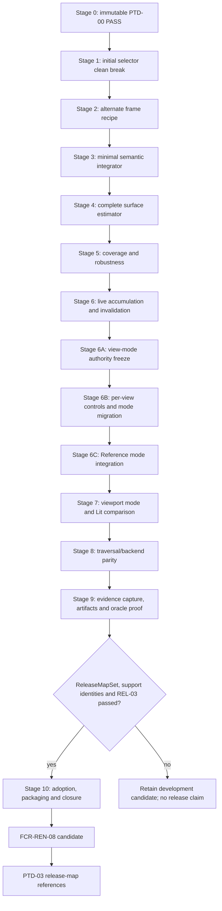

# Reference Path Tracer Staged Implementation Plan

**Status:** **`PTD-00-R1 PASS`** remains the historical immutable discovery prerequisite; the 2026-09-13 repository-owner amendment replaces its Reference-shader binary64 policy with ordinary binary32 and must be included in the next independent numeric review; Stages 1-2 retain their historical frame/clean-break results; Stages 3-9 are **IMPLEMENTED / VALIDATION DEFERRED**; the Stage-6A target/show-flag decision is **SUPERSEDED** by the 2026-09-15 one-mode amendment, Stage 6C source is committed at `3b654728db3a35b4e2c859c8bf11116f4737800a`, and the Stage-9 source result is retained in [Stage 9 Source Evidence](Stage9SourceEvidence.md); Stage 9 has not earned its evidence-candidate gate and Stage 10 is not authorized; final reference/release acceptance remains separately gated by the retained GPU validation backlog, `REL-03`, release maps, support identities, and executable evidence

**Scope:** deliver `FCR-REN-08` end to end through one feature-local Renderer per-view session, one Reference estimator policy composed over a shared path-tracing semantic core, viewport-first Lit comparison, optional manual raw evidence publication, D3D12/Vulkan traversal parity, controlled failure, and release-map adoption

**Prepared:** R0 source audit at `669637cf23b9748f8b94635409e74159d31d0bc2`; R1 gate reconciliation rebased 2026-09-10 to committed source input `30597d7d0bb70af9f2836ab01d81d47c3e20bcde`; estimates are planning ranges, not schedule commitments

**Naming reconciliation:** the 2026-09-09 working-tree clean break makes `ReferencePathTracer` the sole feature name. The 2026-09-19 refinement names the display-ready viewport product `FinalColorLdr`, the producer-neutral scene-linear products `Radiance` and optional `RadianceSecondMoment`, their optional progressive identity `RenderProductSamplePrefix`, and the sole atomic publication operation `PublishViewportRenderProducts`. Lit and Reference producers publish through the same product contract; only the Reference feature owns its estimator, committed-prefix, checkpoint, and oracle policy. This follows Epic's Scene Color versus Final Color distinction and NVIDIA/Falcor's radiance terminology; it does not authorize or complete a plan stage.

**Priority reconciliation:** 2026-09-10 moves the first usable live viewport/Lit-comparison milestone ahead of traversal-parity expansion and evidence-artifact workflow; no stage is thereby authorized or completed.

**Frame-recipe reconciliation:** `AC-RPT-22`/`FM-RPT-21`/`CHK-RPT-18` make the already accepted PTD-00 architecture executable: Reference Path Tracer is one alternate middle recipe of the original Sparkle frame, not a second renderer and not a layer over Lit. This clarification changes no frozen estimator, product, or Stage-0 scope and does not retroactively claim Stage-1 recipe evidence; Stage 2 owns the first implementation and proof.

**External-precedent reconciliation:** `CHK-RPT-20` binds every implementation stage to the pinned NVIDIA RTXPT/Falcor/self-intersection sources and current official Epic Path Tracer product documentation through the [mid-delivery alignment matrix](Research.md#nvidia-and-epic-mid-delivery-alignment--2026-09-13). A row must remain source-present, evidence-passed, assigned to an exact later stage, deliberately different, or excluded by the frozen domain. Vendor feature presence or defaults never silently expand Sparkle scope or count as local proof.

**Authority boundary:** [Transport And Estimator](TransportAndEstimator.md) owns mathematical semantics, [Execution Architecture](ExecutionArchitecture.md) owns system ownership/lifetime, [User Experience](UserExperience.md) owns the interactive workflow; the [feature dossier](README.md) owns `RPT-FS-*`, `AC-RPT-*`, `FM-RPT-*`, `CHK-RPT-*`, and definition of done; [Discovery](Discovery.md) owns `PTD-00`; the [completion study](Research.md) owns external precedent; this page owns delivery order, dependencies, clean breaks, estimates, prompts, and slice exit gates

**Current readiness:** **50/100 (`45/5/0/0`)**. Stage 7 makes the existing mode selectable immediately after Lit and adds the minimum generic request/progress fields needed for the live session. Stage 8 adds one automatic engine-wide Pipeline-then-Inline policy, one semantic `TraceSceneRay` API over thin frontend adapters, reusable material payload/hit mechanics, and the existing D3D12/Vulkan RHI path without adding RHI feature policy or a second renderer route. Game/runtime retains the same ordinary `ViewportRenderRequest` entry rather than a host fork. The current DevelopmentEditor C++ candidate compiles and links through `ShowcaseEditor`, but it remains shader-uncooked and GPU-unexercised, so no lifecycle, response-budget, camera-interaction, accessibility, backend/frontend parity, numeric, or reference-authority credit is added. See [Current Feature Readiness](../../../../../../../Acceptance/CurrentReadiness.md#renderer).

**Non-claims:** Stage-7 source inspection and predecessor builds/cooks do not prove the current GPU shader candidate's accumulation precision, ordered lifecycle, response budget, material decode, robust endpoints, radiance, estimator correctness, runtime reachability, accessibility, convergence, backend parity, performance, package, Shipping exclusion, or accepted-reference authority.

This plan exists now because the requested implementation route needs to be concrete and reviewable before code work. Its presence does not manufacture a `PTD-00` pass. Stage 0 must replace every provisional choice and estimate with the accepted discovery result; if the result changes architecture, this plan is revised before Stage 1 rather than bending implementation around stale prose.

> [!CAUTION]
> Implementation stages may advance under the development-continuation policy when their source contract is complete and validation requiring an owner-run build, shader cook, GPU execution, or interactive Editor session is explicitly deferred. Deferred work is never a `PASS`. `REL-03`, release maps, named support machines, and the accumulated GPU validation backlog remain mandatory before final release/package/oracle-adoption claims.

## Outcome

Completion yields:

- a bounded, deterministic `SurfaceTransportReference` per-view session over immutable Scene/View generations;
- a separately named `FinitePathDiagnostic` route for analytic and event-isolation work;
- independent camera rays, one reviewed NEE/MIS/Russian-roulette surface estimator, robust endpoints, exact sample identity, and complete invalid accounting;
- scene-linear `Radiance` produced by the Reference estimator as EXR beauty plus hashes, evidence provenance, checkpoints, and atomic completion;
- one Reference estimator policy over one shared path-tracing semantic core, behind automatically selected Inline and native Pipeline adapters on D3D12 and Vulkan;
- a `Reference Path Tracer` view mode immediately after Lit that validates/starts automatically, shows exact progress/reset/completion, handles Editor and Game cameras through one identity path, and preserves only exact-identity Lit comparisons;
- optional manual raw save as a secondary consumer of that same session contract;
- an analytic/minimal/external/statistical/backend/failure evidence ladder sufficient for `FCR-REN-08` and later `PTD-03` release-map adoption;
- removal of the former GBuffer-seeded `LightingMode::ReferencePathTracer`, transitional `r.ReferencePathTracer`, global visualization selection, Editor mirror enum, and target/show-flag split in favor of one per-view `RenderViewMode::ReferencePathTracer`, without a compatibility layer or second scene/material system.

Anything less remains a candidate comparison. A cleaner image, larger sample count, passing build, or agreement with one external renderer does not close the feature.

## Delivery Priority

The [User Experience product priority](UserExperience.md#product-priority-order) is binding on stage order:

1. deliver a responsive, automatically accumulating viewport mode and Lit comparison loop over a PBR-correct in-memory result;
2. prove its Renderer/RHI semantics and required backend/frontend routes;
3. reuse only the existing generic capture/readback needed for raw-result publication; and
4. polish manual save and checkpoint interaction after the primary viewport experience is usable.

Artifacts remain required for final oracle authority, but they are not the first product milestone. A completed EXR pipeline cannot advance the primary UX while the user cannot select the mode, move through the scene, see the latest view restart/refine live, read exact progress, or compare with Lit. The first usable viewport milestone is also not permission to call an unproved estimator a reference; mathematical and PBR correctness remain prerequisites.

## GPU-Only Transport Boundary

Sparkle's Reference Path Tracer is exclusively a GPU renderer. Primary-ray generation, traversal, hit interpretation, material and light evaluation, BSDF sampling/evaluation/PDFs, path integration, MIS, roulette, robust endpoints, sample generation, and accumulation execute in production GPU shaders through the existing Renderer/RHI route. Only that production GPU route may produce Reference radiance.

Ordinary application and Renderer orchestration may prepare immutable Scene/View inputs, allocate and bind resources, submit GPU work, manage the per-view lifecycle, observe progress, copy a completed GPU result through the existing readback route, and publish artifacts. None of that orchestration may trace rays, reproduce shader transport math, generate comparison radiance, or become a second correctness authority. Hand-worked equations and external-renderer results are review or comparison oracles only; every Sparkle transport claim ultimately binds to the production GPU shader route.

## Development Continuation And Deferred Validation

Stages 1 through 9 separate source delivery from executable acceptance. When the selected stage's code, ownership, build membership, generated surfaces, documentation, and static review are complete and no observed defect or unresolved design decision remains, record **IMPLEMENTED / VALIDATION DEFERRED** and continue to the next implementation stage. A build, shader cook, GPU capture, backend run, interactive Editor exercise, or other owner-operated check that is not run is entered in the validation backlog with its exact command/workflow and oracle; its absence alone is not `BLOCKED` and does not prevent further implementation.

For delivery sequencing, the implementation is presumed to satisfy its written contract until an executed check or source review falsifies it. This presumption is not evidence: deferred checks are never marked `PASS`, readiness credit is not added for them, and no result may be called unbiased, converged, accepted, release-ready, or authoritative because validation was postponed. A confirmed defect, contradictory source, unresolved formula/ownership decision, or unavailable required implementation dependency still blocks the affected work. Stage 10 and `FCR-REN-08` remain the hard evidence boundary: final acceptance requires the accumulated GPU, backend, workflow, package, and release checks to execute and pass.

## Gate And Dependency Graph



No stage may hide an unmet exit criterion: deferred owner-operated validation remains visible in the cumulative backlog while implementation continues. A discovery-shaping unknown returns to Stage 0. A confirmed semantic defect returns to its owning estimator/input stage. A confirmed workflow, package, or failure defect returns to the owning operational stage without weakening the mathematical claim.

## Planning Envelope

| Stage | Focus | Initial effort range | Prerequisite | Primary exit checks |
| --- | --- | ---: | --- | --- |
| 0 | discovery closure and plan freeze | 70-110 h | none | `CHK-PTD-01` through `12` as applicable |
| 1 | contracts, feature capsule, selector clean break | 50-85 h | immutable `PTD-00-R1 PASS` | `CHK-RPT-01`, `02`, `16`, `17`, `20` |
| 2 | original-frame recipe selection and canonical Scene/Game View route | 15-30 h | Stage 1 | `CHK-RPT-17`, `18`, `20` |
| 3 | canonical primary rays, stable samples, and minimal reviewable integrator in the Reference middle recipe | 90-150 h | Stage 2 | `CHK-RPT-03`, `04`, `05`, `07`, `17`, `18`, `19`, `20` |
| 4 | complete included surface estimator | 110-180 h | Stage 3 | `CHK-RPT-04`, `05`, `11`, `17`, `18`, `19`, `20` |
| 5 | material/geometry coverage and numeric robustness | 90-150 h | Stage 4 | `CHK-RPT-03`, `04`, `08`, `17`, `18`, `19`, `20` |
| 6 | canonical digest/invalidation, ranges, in-memory accumulation, live preview, and progress snapshots | 115-185 h | Stage 5 | `CHK-RPT-02`, `07`, `09`, focused `15`, `17`, `18`, `19`, `20` |
| 6A | per-view mode contract/source audit and clean-break freeze | 12-20 h | Stage 6 source handoff | `CHK-DVP-01`, `CHK-RPT-18` |
| 6B | existing-mode migration and global visualization-selector deletion | 24-42 h | Stage 6A | `CHK-DVP-01`, `CHK-DVP-02`, `CHK-RPT-17`, `18` |
| 6C | Reference mode topology/session integration and CVar deletion | 20-38 h | Stage 6B | `CHK-DVP-02`, `CHK-DVP-03`, `CHK-RPT-17`, `18` |
| 7 | first usable viewport mode, live navigation, progress/reset UX, and Lit comparison | 70-120 h | Stage 6C | `CHK-RPT-02`, `09`, `15`, `16`, `17`, `18`, `19`, `20` |
| 8 | Inline/RGS and D3D12/Vulkan parity | 90-150 h | Stage 7 | `CHK-RPT-07`, `08`, `12`, `17`, `18`, `19`, `20` |
| 9 | minimal manual evidence capture, EXR/checkpoint publication, independent oracle, and failure evidence | 120-220 h | Stage 8 | `CHK-RPT-04` through `13`, plus `17`, `18`, `19`, `20` |
| 10 | package/adoption evidence, cleanup, completion report | 70-125 h | Stage 9, accepted `ReleaseMapSet`, support identities, `REL-03` | `CHK-RPT-01`, `14`, `15`, `16`, `17`, `18`, `19`, `20` |
| **Total** | full first-release closure | **977-1,650 h** | accepted scope | all applicable `AC-RPT-01` through `23` plus the applicable `AC-DVP-*` prerequisites |

The range is intentionally honest about math review, two APIs, two traversal frontends, artifact safety, and independent evidence. Stage 0 must re-estimate after feature scope, machines, release maps, tolerances, and reusable infrastructure are known. Cutting evidence, raw output, failure behavior, or a required backend is a scope decision, not an “optimization” of this estimate. Ordering artifact work later protects the daily viewport use case; it does not make final evidence optional.

## Universal Execution Contract

Every implementation prompt below inherits these rules. The executing agent must:

1. start at the repository root; read `AGENTS.md`, `Docs/README.md`, the selected Engineering task routes, [Transport And Estimator](TransportAndEstimator.md), [Execution Architecture](ExecutionArchitecture.md), [User Experience](UserExperience.md), [feature acceptance](README.md), [Discovery](Discovery.md), and this plan in full;
2. inspect `git status --short`, preserve unrelated dirty work, and inspect live owners/producers/consumers/lifetime/build membership with `rg` before editing;
3. confirm all named design/scope prerequisites and prior-stage source handoffs. A deferred owner-operated build, shader cook, GPU run, or interactive workflow follows [Development Continuation And Deferred Validation](#development-continuation-and-deferred-validation) and does not by itself block the next implementation slice. Stop only when a required design/input is absent or stale, source contradicts the contract, an executed check finds a defect, or implementation cannot proceed without inventing policy;
4. implement only the selected stage and defects required for its exit criteria. Do not begin later UI, general framework, performance, denoising, neural, material-system, or compatibility work;
5. preserve Scene-owned scene data, View-owned view identity/camera data, one private Reference Path Tracer product/policy capsule, the existing small shared path-tracing/RayTracing/Lighting/Common shader owners, thin RHI traversal adapters, and the single-truth/copy budget. After preparation, pass the canonical `RenderFrame` through execution boundaries instead of unpacking parallel identity/time/Scene/View/ray-binding arguments or carrying the complete mutable viewport request beside its accepted View; pass only a focused one-shot control edge when the feature consumes one. Preserve the original Sparkle frame shell: `FramePipeline::BuildRenderFrameGraph` calls ordinary nested `Add...Passes` functions, while `AddSceneRenderingPasses` selects the accepted request's `RenderViewMode::ReferencePathTracer` and invokes either the Lit or Reference pass function directly before declaring shared exposure, optional scene denoising, and presentation-upscaling passes once. Never add a class-shaped graph stage, recipe/base interface, graph factory, dependency bag, global feature manager, Editor mirror enum, target/show-flag translation, graph-settings copy, process-global selector, RHI mode, second renderer/frame loop/submission path, or both estimator middles together;
6. apply the [GPU-Only Transport Boundary](#gpu-only-transport-boundary) and [Shared Path-Tracing Family Boundary](#shared-path-tracing-family-boundary) before adding or naming any type, function, resource, or file. Keep only Reference target/claim, selected strategy set and admissibility, sample-stream identity/dimensions, finite/reference termination, per-view session/invalidation/progress, raw-result authority, evidence, and failure policy in the feature capsule. Extend the established `Common`, `Lighting`, `RayTracingHit*`, `PathSurface`, `RayTracingPathSample`, `PathSampling`, `PathLighting`, and `PathTracer` shader owners for camera/RNG mechanics, trace/hit/material/surface conversion, environment, path state/events, BSDF/light sample-evaluate-PDF, visibility, MIS/roulette arithmetic, robust rays, and accumulation arithmetic whose semantics are reusable by unbiased, optimized/biased, cache-backed, or denoised GPU path tracers. Search current Reference, `Path*`, ReSTIR, and cache-facing shader code before adding code. No generic mechanism may retain a `ReferencePathTracer` name; no Reference-only or biased/cache/denoiser policy may enter a shared owner; no second shared vocabulary may compete with an established one; and only the production GPU shader route may produce transport results;
7. perform clean breaks for Sparkle-owned contracts: update all producers/consumers/build/docs together and delete the replaced path. Do not add legacy readers, aliases, version bridges, fallback selectors, or dual representations;
8. keep current code/behavior labels honest. Never use “unbiased,” “ground truth,” “converged,” or “accepted reference” beyond the exact passed scope;
9. design each check with initial state, action/injection, oracle, matrix, artifact, maximum duration/resources, cleanup, and escalation. Use the cheapest claim-falsifying check first;
10. do not add submitted test-only classes, fixtures, executables, files, CMake targets, feature-specific diagnostic passes/readbacks, debug panels, dashboards, or parallel inspection APIs. Use the real production route and existing generic capture/validation surfaces. A temporary focused probe is allowed only when a named criterion cannot be falsified more cheaply, and every probe must be removed before handoff;
11. execute `CHK-RPT-17` for the current stage. Retain `ARCH-RPT-<stage>` listing every touched production file outside the frozen feature and shader homes, its accepted hook category and necessity, all feature-named references outside the capsule, new public/shared types and fields, repeated selector switches, dependency direction, and bounded-removal proof. Any unlisted file or unjustified hook blocks the stage;
12. from Stage 2 onward, execute `CHK-RPT-18` and retain `FRAME-RPT-<stage>` proving the sole recipe key/decision, mutually exclusive pass/resource provenance, shared frame shell, raw/display lineage, safe Lit/Reference topology transition, and absence of a second renderer or submission path;
13. from Stage 3 onward, execute the source/ownership portion of `CHK-RPT-19` and retain `CORE-RPT-<stage>` classifying every changed GPU path-tracing operation as shared invariant, Reference policy, or optimized/cache/denoiser policy; list the owning existing file, every current consumer, likely ReSTIR PT/cache/denoiser boundary challenge, semantic-duplicate search, dependency direction, and bounded removal. A new Reference-prefixed mechanism requires a written explanation of why another GPU path tracer cannot use the same semantics. Compile affected Reference and optimized consumers before executable acceptance, or place that compilation in the explicit validation backlog when owner-operated validation is deferred;
14. execute `CHK-RPT-20` for the stage's affected concerns: recheck the pinned NVIDIA revisions and current official Epic Path Tracer documentation, update the alignment row with its local owner/stage/evidence status, and retain every intentional difference or exclusion. Then run immediately available static checks, `architecture_boundary_check` whenever Renderer/RHI boundaries change, focused build/shader/GPU/interactive checks when selected for the current execution, and `git diff --check`. Record every unrun owner-operated check as deferred with its command/workflow and oracle. Do not claim unrun checks passed and do not convert deferral alone into `BLOCKED`;
15. finish the stage with the binding [responsibility refinement](../../../../../../../Engineering/Workflow/ChangeLifecycle.md#finish-with-responsibility-refinement). Re-read the complete changed feature path and record one responsibility sentence for every substantive changed file, class, and function; split independently changing identity, lifecycle, GPU-resource, graph-pass, estimator, presentation, or artifact concerns, while keeping resources owned by the lifecycle that allocates, retains, releases, binds, and retires them rather than passing a sibling resource owner through state transitions; remove dead scaffolding, duplicate state/policy, ceremonial wrappers/helpers/namespaces, needless validation/diagnostics, and leaked implementation detail. This gate is decided by cohesion and knowledge removal, not line count or class count, and fails on either a god unit or fragmentation that merely relocates the same knowledge;
16. leave one iteration record containing gate revision, decisions, changed files grouped by responsibility, deletions, the refinement result, `ARCH-RPT-<stage>`, `FRAME-RPT-<stage>` when applicable, `CORE-RPT-<stage>` when applicable, checks actually run, exact outputs/artifact links, deferred-validation backlog, known limitations, confirmed blockers, and the next permitted implementation stage.

Every prompt's `NON-NEGOTIABLE` paragraph is a contract, not motivational prose. A source-delivery handoff must classify each item as statically established, executable evidence passed, validation deferred, or falsified. Use **IMPLEMENTED / VALIDATION DEFERRED** when the implementation is complete but owner-operated evidence remains; use `BLOCKED` only for a confirmed defect, contradiction, missing required design/input, or implementation dependency that prevents meaningful progress. “Implemented,” a clean build, a plausible image, or a manual click-through cannot substitute for final acceptance evidence.

If source reality proves a plan instruction wrong, correct the owning architecture/plan document in the same stage and explain the divergence. Do not preserve a bad plan through code contortions.

## Cross-Stage Invariants

- Raw reference transport never consumes production GBuffer, ReSTIR, temporal reconstruction, denoised, exposed, tone-mapped, encoded, or screenshot data.
- All Sparkle transport and accumulation run in production GPU shaders. Application/Renderer code may orchestrate, submit, observe, read back, and publish GPU results only; it never traces paths, reproduces the estimator or sampler, or produces Reference radiance.
- Reference Path Tracer remains the alternate middle setup of the original frame: one per-view `RenderViewMode::ReferencePathTracer`, mutually exclusive estimator pass sets, and the same surrounding FramePipeline/Scene/View/frame-graph/RHI/viewport/UI/presentation owners. Editor owns labels/icons/menu placement and uses the Renderer mode directly; no mirror enum, target/flag split, mode in RHI, selector CVar, recipe hierarchy, graph factory, dependency bag, second renderer, or both-middle graph is permitted.
- Reference Path Tracer is one policy consumer of the shared path-tracing core, not the engine's only path tracer. ReSTIR PT, radiance caches such as SHARC, denoised paths, and other optimized or biased estimators may reuse the core, but their biasing/cache/reconstruction policy never enters the raw Reference target by shared-code inference.
- “Shared core” means the existing set of focused owners, not a new god include, manager, facade, or framework. Prefer extending `CommonRandom`, `CommonSampling`, `Lighting/Sky`, `RayTracingHit*`, `PathSurface`, `RayTracingPathSample`, `PathSampling`, `PathLighting`, and `PathTracer` according to their present responsibility over creating parallel `ReferencePathTracer*` vocabulary.
- Before a Reference-named shader symbol is accepted, the stage review must prove it expresses Reference product policy rather than camera, RNG, tracing, hit reconstruction, material/surface data, emission/environment evaluation, BSDF/light sampling or PDFs, path state/events, throughput/radiance math, MIS/roulette arithmetic, ray robustness, or accumulation math that another path tracer will also need.
- High-level frame orchestration names stages and contains the readable mode branch. Lit pass composition remains a focused local stage; Reference mechanism remains in the feature owner. Both produce the same downstream product contract. Parallel selector representations, UI presentation fields, provider decisions in the shared tail, or a polymorphic recipe/factory introduced only to hide the branch fail `CHK-RPT-18`.
- Apply [Code Style's owner-local helper rule](../../../../../../../Engineering/Foundations/CodeStyle.md#owner-local-helper-placement): a namespace, wrapper, phase function, or collaborator that merely renames or forwards one operation is a stage failure. Call the operation directly until the abstraction owns real policy/state, hides nontrivial mechanism, establishes a required boundary, or has multiple meaningful consumers.
- Validate untrusted requests and the Reference product's narrower domain once at the feature preflight/state-transition boundary; enforce universal Scene/View/resource invariants at their construction/publication owner. Camera, sampling, BSDF, light, traversal, and accumulation primitives then consume established invariants as direct math. Do not introduce `IsValid`/`IsSupported` scans, `Try*` call chains, finite/range rechecks, diagnostic sentinels, or boolean validity plumbing through the inner GPU path. Runtime branches remain only for mathematical support, sidedness/visibility/topology, stochastic outcomes, specified safety failure, or state that can genuinely race after preflight such as stale-generation commit.
- Session seed, pixel, sample, and dimension identity never depends on frame timing, dispatch order, batch size, view-mode switching, or resume timing.
- `SurfaceTransportReference` contains no silent deterministic path/distance cap, firefly/contribution clamp, biased environment MIP, approximate cache, or invalid-to-black substitution.
- Unsupported semantics and missing strict capabilities reject before sample zero; they do not silently downgrade.
- Scene/View data is leased by immutable generation; no feature-owned duplicate scene truth is introduced.
- The estimator has one code/math correspondence. Inline/RGS and D3D12/Vulkan do not fork material, light, sample, or contribution semantics.
- Every discarded or invalid event changes the accepted sample/session status; it cannot disappear into plausible output.
- Preview is a derivative of raw output and carries its raw hash; it is never the numeric comparison source.
- A checkpoint is a verified exact prefix. A completion manifest is atomic, immutable, and written last.
- Final evidence acceptance cannot close from source inspection, compilation, one beauty image, one backend, one seed, or one external renderer alone. Development implementation may advance with owner-operated checks explicitly deferred under the continuation policy.
- Every implemented transport term maps to one accepted `MATH-*` row and one retained defect-detecting result. No stage may silently revise a formula or decision slot.
- `Reference Path Tracer` is the second viewport mode after Lit. Selection validates/starts automatically; the UI mirrors Renderer progress/reset/completion truth and never mutates persistent Lit settings.
- `RenderViewKind` identifies the ordinary View/camera producer (`Scene` for Editor-authored viewports, `Game` for runtime views); the request's `RenderViewMode` independently selects the Lit or Reference middle. Every supported Editor and Game view reaches the same feature entry, session semantics, estimator, and presentation path. Editor UI and Game UI select the same concrete Renderer semantic and may not fork Renderer behavior or use global CVars for normal selection.
- Canonical Editor and Game camera identity, not input-device events or approximate motion thresholds, decides camera reset. Every radiance-affecting change invalidates before commit; presentation/scheduling-only changes preserve the prefix.
- Lit comparison suspends one bounded per-view prefix and resumes only after full-digest revalidation. Manual export derives from the same Renderer session semantics.
- Camera controls remain responsive in the selected mode. Superseded camera work is abandoned before commit, the newest accepted identity is presented at bounded cadence, and accumulation continues automatically when movement stops; no save/readback/checkpoint work may outrank that loop.
- Every user-visible state/action/error/artifact obeys [User Experience](UserExperience.md); Editor and runtime surfaces do not duplicate Renderer truth.
- Reference session/estimator policy remains inside `Engine/Renderer/Private/Passes/Lighting/ReferencePathTracer/` and its matching shader home. Outside edits are limited to the frozen integration-hook ledger or `CORE-RPT-*` extensions of existing focused shared path/RayTracing/Lighting/Common owners with affected consumers updated. `FramePipeline` owns only the persistent incomplete Reference feature required across graph rebuilds and its narrow preparation/submission lifecycle calls; it does not sequence session internals. `AddSceneRenderingPasses` is the sole graph-composition owner allowed to name and select Lit or Reference. Generic Scene, View, settings, RHI, Editor host, and Application host types never acquire feature mechanism or mutable feature truth. Frame/product contracts expose producer-neutral `Radiance`, optional `RadianceSecondMoment`, optional `RenderProductSamplePrefix`, and progress semantics: Lit, Reference, and future optimized path tracers may publish them without acquiring Reference naming or policy, while only progressive producers attach a sample prefix.
- Every stage completes the immediately inspectable source/ownership portion of `CHK-RPT-17`; owner-operated execution may be deferred, but a confirmed feature-diffusion defect blocks the owning slice. A build, formatter pass, small file count, or locally clean class cannot compensate for feature diffusion.
- Every stage ends with the responsibility-refinement gate: high-level code retains only visible orchestration, each feature-local file/class/function has one cohesive reason to change, and extracted collaborators remove knowledge rather than forward calls. A god unit, numbered split, one-method wrapper layer, catch-all file/folder, or needless diagnostics/validation blocks source handoff.
- Stages 2 through 10 complete the immediately inspectable topology/resource-lineage portion of `CHK-RPT-18`; owner-operated execution may be deferred. A confirmed detached renderer, graph that also runs Lit, or display without raw lineage is an architecture failure.
- Stages 3 through 10 complete the immediately inspectable shared-core portion of `CHK-RPT-19`; owner-operated execution may be deferred. A confirmed Reference-prefixed reusable primitive, duplicated optimized-path operation, or shared core containing Reference-only/unbiased or biased/cache/denoiser policy blocks the owning slice even when outputs compile.
- Diagnostic and debug infrastructure is not a feature deliverable. No stage may add a second GPU path, readback schema, event viewer, dashboard, debug panel, or persistent inspection API merely to prove the implementation. Correctness checks exercise production algorithms through existing generic validation/capture routes or removed-before-handoff probes; only user-facing progress, errors, raw output, and release artifacts required by [User Experience](UserExperience.md) remain production scope.

## Shared Path-Tracing Family Boundary

This matrix is binding on Stages 3 through 10 and their ready-to-use prompts. Every operation it classifies is part of the GPU shader path-tracing family, and only the production GPU shader route produces transport results. It prevents the Reference implementation from becoming a second path-tracing foundation while also preventing optimized policy from contaminating the oracle.

| Concern | Shared owner direction | Reference capsule retains |
| --- | --- | --- |
| Camera and random mechanics | Canonical View camera/raster-to-ray code; reusable hash/counter-RNG permutations and numeric conversions in existing `Common`/Renderer shader owners. | Exact session/pixel/sample/dimension packing, dimension ledger, seeds/replicates, and reproducibility claim. |
| Traversal and hit data | Backend-neutral ray/result/payload vocabulary, inline/pipeline trace mechanics, hit loading, alpha candidate mechanics, geometric/material reconstruction, and path-surface adapters under `RayTracing*`/`PathSurface` owners. | Which shared adapter/domain is admitted, Reference event interpretation, and fail/unsupported disposition. |
| Environment, emission, materials, and lights | Canonical scene-light/material data, environment evaluation, emission fields, light sampling primitives, units, native/solid-angle PDF conversion, and visibility queries in existing Lighting/RayTracing owners. | Included strategy set, light-selection policy/PMF when estimator-dependent, Reference-only exclusions, and raw-oracle claim. |
| Path and BSDF semantics | One path state, surface, direction/event sample, BSDF evaluate/sample/PDF, lobe/delta vocabulary, throughput, radiance contribution, MIS heuristic arithmetic, and roulette compensation primitive usable by optimized and unbiased paths. | Exact unbiased strategy composition, termination target, event ordering, invalid-sample consequence, and estimator evidence. |
| Robust rays and numerics | Reusable endpoint/error-bound construction, finite numeric operations, prefix accumulation/merge/variance arithmetic, and raw numeric representations at narrow shared owners. | Accepted bounds/configuration, per-view range scheduling and ordered commit, digest/invalidation, session lifecycle, progress, and failure/result state. |
| Optimization families | Shared contracts above remain usable without a Reference label or claim. | No ReSTIR reservoir/reuse, SHARC/cache lookup, denoising/reconstruction, biased MIP/clamp, adaptive approximation, or optimized scheduling policy enters raw Reference transport. |

The test for placement is semantic: if an unbiased Reference path and an optimized/biased path should produce the same value for the same inputs, the operation belongs to the narrow shared owner. If the difference defines estimator expectation, approximation, cache/reuse, reconstruction, product truth, or evidence, it stays with that product. A likely future consumer is an interface challenge, not permission for unused scaffolding; shared additions must serve the current Reference implementation and either an existing consumer or delete an existing semantic duplicate.

## Stage 0 - Close Discovery And Freeze The Plan

### Objective

Produce the exact `PTD-00` evidence package, independently review it, and reconcile this conditional plan to the accepted report. No production code changes occur in this stage.

### Work

1. Re-audit the live current route, selectors, source/shader/generated/CMake membership, Scene/View ownership, RHI frontends, capture/export infrastructure, ApplicationEditor operations, package roots, and release-map requirements.
2. Ratify or replace every `MATH-*` row and decision slot in [Transport And Estimator](TransportAndEstimator.md): products, equations, direction/measure notation, units/color, PBR material/normal model, light/lobe strategies, MIS, roulette, sampling, accumulation, robust rays, invalid/safety behavior, included/excluded `RPT-FS-*` rows, and permitted oracle claims.
3. Freeze camera, geometry, texture, material, light, environment, alpha/sidedness, deformation, backend/frontend, raw output, workflow, and profile matrices against the development `RPTConformanceSet` and development selectors. Isolate future `ReleaseMapSet` and package reconciliation in Stage 10; do not let an unknown release map alter implementation by inference.
4. Complete the equation-to-code design for camera sampling, BSDF selection/eval/PDF, light PMF/native-to-solid-angle PDF, emission/environment MIS, delta cases, roulette, shading normals, alpha rejection, invalid values, and robust endpoints.
5. Select the stateless sampler, dimension ledger, accumulation representation, maximum supported SPP, checkpoint layout, OpenEXR channel/schema policy, artifact hashes, budgets, and statistical protocol.
6. Specify analytic/metamorphic fixtures, minimal event oracle, Falcor/Capsaicin/Mitsuba external interchange scenes, equivalence manifests, independent replicates, thresholds, regions, stop/escalation rules, and controlled fault injections.
7. Record adopted/rejected NVIDIA/AMD/neutral precedents and exact source/license revisions. No copied source or redistributed asset enters by inference.
8. Ratify or replace [User Experience](UserExperience.md): its P0-P3 product priority, Reference Path Tracer immediately after Lit, mode-owned defaults, automatic preflight/start, responsive live navigation, newest-view presentation, automatic post-motion refinement, exact progress/reset/completion, canonical Editor/Game camera invalidation, radiance/presentation/scheduling classification, Lit comparison retention/revalidation, pause/restart, secondary checkpoint/manual raw save, errors, accessibility, support, first-use, and Shipping exclusion.
9. Complete `AC-PTD-*`/`FM-PTD-*`/`RISK-PTD-*`/`CHK-PTD-*` traceability, clean-break deletion ledger, owner/dependency assignments, and revised implementation estimates.
10. Obtain independent mathematical, numerical, architecture, evidence, and first-use review and record `PASS` or `BLOCKED`. On `PASS`, update this plan's status and exact prerequisite revision without claiming implementation evidence.

### Exit gate

- `AC-PTD-01` through `17` all pass at one report revision.
- Every `PTD-Q-*` is closed by a decision/evidence result, not moved into code as an ambiguity.
- Every included `RPT-FS-*` row has an owner, phase, defect-detecting check, budget, and external/shared-dependency oracle.
- Every `MATH-*` row is accepted/replaced/excluded, every formula-changing slot is filled, and all hand cases plus independent math/numeric review are retained.
- The experience contract is frozen tightly enough that Stages 1, 2, 6, 7, and 9 cannot invent selector ownership/order, mode defaults, camera identity, navigation responsiveness, newest-view presentation, invalidation classes, target-SPP behavior, Lit comparison retention, state actions, failure behavior, export precedence, or accessibility.
- The Stage 1 prompt can be executed without inventing scope, math, architecture, evidence, or ownership.
- No implementation file changed and no plan presence is counted as readiness.

### Ready-to-use prompt

```text
Execute only Stage 0 of Docs/Architecture/Modules/Engine/Renderer/Features/Lighting/ReferencePathTracer/Plan.md.

Apply the plan's Universal Execution Contract. Do not change production code. Complete PTD-D0 through PTD-D4 and the full PTD-00 evidence package from the live repository, not from assumptions in the plan. Freeze the exact SurfaceTransportReference and FinitePathDiagnostic equations/domains; reconcile every RPT-FS row with `RPTConformanceSet` and development selectors; explicitly assign future release-map/package adoption to Stage 10; derive camera, BSDF, light, MIS, roulette, normal, alpha, robust-ray, sampling, accumulation, artifact, backend, viewport workflow, and failure contracts; predeclare the oracle/statistical matrices and budgets; pin and classify all external source/license precedents including REF-UE-PT-UX; build a no-orphan traceability and clean-break ledger; and obtain an independent plan-readiness review.

NON-NEGOTIABLE: ratify or replace every MATH-* row and every decision slot in TransportAndEstimator.md, with hand-worked zero/unit/delta/Jacobian/MIS/emission-hit/roulette/finite-depth/invalid/variance cases and independent mathematical plus numerical review. Ratify or replace UserExperience.md with a dry-run first-use review proving the item immediately after Lit, automatic preflight/start, responsive navigation, newest-camera reset/presentation, automatic refinement after motion stops, exact prefix progress, every Editor/Game camera and scene reset, presentation/scheduling non-reset, Lit comparison resume/reset, target-SPP changes, pause/restart, secondary checkpoint/manual raw save, errors, accessibility, and Shipping exclusion. A remaining inferred PDF measure, probability, unit, camera field, invalidation class, retention/capacity rule, responsiveness threshold, budget, user action, or failure outcome is a BLOCKER.

Use the cheapest claim-falsifying probes first. Do not build the engine or render representative maps unless a named PTD-00 criterion requires that escalation. Any unresolved item that can alter scope, estimator, architecture, ownership, evidence, or release claims keeps PTD-00 BLOCKED. End with the exact PASS/BLOCKED revision, evidence links, unrun checks, revised estimates, and whether Stage 1 is authorized. Never mark PTD-00 PASS from document completeness alone.
```

### Stage-0 execution result — 2026-09-10

`PTD-00-R0` is **BLOCKED** at source input `669637cf23b9748f8b94635409e74159d31d0bc2`. The exact report, current-route audit, decision dispositions, matrices, oracle/statistical protocol, revised estimates, independent review record, and unrun checks are retained in [Discovery](Discovery.md#historical-ptd-00-r0-stage-0-execution-report). The mathematical candidate is frozen in [Transport And Estimator](TransportAndEstimator.md#stage-0-decision-freeze), and the product defaults/budgets are frozen in [User Experience](UserExperience.md#frozen-defaults-and-operational-budgets).

The blocking facts are release-owned: no accepted `ReleaseMapSet`, support-hardware/package-root identity, or proved Shipping reachability exists, so exact map-domain reconciliation and final independent signatures cannot pass. Stage 1 is **not authorized**; repeating Stage 0 wholesale is unnecessary, but `PTD-00-R1` must rebase, reconcile the affected matrices, and repeat every independent review after those inputs exist. No production file changed and no implementation evidence is claimed.

### Stage-0 R1 gate reconciliation — 2026-09-10

R1 identifies the R0 dependency as a gate-placement error: final release maps, named support machines, and an already-proved package cannot be prerequisites for implementing the development tracer they must later exercise. [Discovery's R1 reconciliation](Discovery.md#ptd-00-r1-gate-separation-reconciliation) freezes `RPTConformanceSet`, capability-driven refusal, explicit Stage-9 output destinations, six-profile target reachability, and the development-versus-release boundary. The repository owner accepted immutable dossier revision `d3152ec28f74cc1987f1d58fb52fa7ede10fd300` as `PTD-00-R1 PASS` on 2026-09-10, authorizing Stages 1-9. Stage 10 implementation may be prepared where its inputs exist, but `FCR-REN-08`, packaged-support acceptance, and `PTD-03` authority remain unavailable until `ReleaseMapSet`, support identities, `REL-03`, and executable evidence exist.

## Stage 1 - Historical Clean Break And Feature Owner

> [!NOTE]
> This executed stage records how the duplicate Lighting authority was removed. Its CVar selector and Editor mirror enum are superseded history and must not be copied into new work; Stages 6A-6C replace them with the one per-view `RenderViewMode` route.

### Objective

This section records the completed removal of the duplicate GBuffer-seeded public authority and creation of the private feature owner. Its selector details are historical; the current selector contract is Stage 6C. No candidate artifact may yet be called an accepted reference.

### Work

1. Historical transition only: define the Reference row directly after Lit. The accepted Stage-6 amendment instead uses the one Renderer-owned `RenderViewMode` in Editor and Renderer without a mirror enum.
2. Historical transition only: Editor selection temporarily crossed an Application/CVar command route. The route is deleted by Stage 6 and must not be recreated.
3. Add one Private, feature-local owner below `Passes/Lighting/ReferencePathTracer`. `FramePipeline` owns its persistent lifetime, `AddSceneRenderingPasses` invokes its graph-construction entry at one composition point, and the frame calls only its narrow preparation/submission lifecycle operations. Do not create a second renderer, frame loop, scene database, public feature facade, class-shaped graph stage, recipe hierarchy, graph factory, global feature manager, or path-tracer mechanism on generic View state.
4. Expose only a generic viewport progress shape needed by a progress bar. Product/backend/frontend, estimator state, digests, reset classification, sample allocation, and controls stay feature-local until the stage that implements and consumes them.
5. Keep the item unavailable in the clickable menu until real shaders and live accumulation exist. A dormant unavailable selection may retain ordinary Lit pixels, but its progress state must not label those pixels as reference output.
6. Remove `LightingMode::ReferencePathTracer`, its GBuffer-seeded reference authority, and every orphan setting/selector in one clean break. Do not retain an alias, fallback selector, comparison copy, or dual representation.
7. Update generated metadata, build membership, current-state docs, and consumers and delete superseded paths in the same change.
8. Produce `ARCH-RPT-1` and remove or relocate every Stage 1 addition that exceeds the frozen hook ledger. Do not retain a generic progress contract unless its necessary Editor boundary and feature-neutral semantics are proved; do not keep feature lifecycle logic in `FramePipeline` beyond composition, update/bind, progress publication, and submission hooks.

### Exit gate

- Historical result only: an Editor mirror enum and Renderer CVar briefly selected Reference composition. Stages 6B/6C supersede both with one contiguous C++/HLSL `RenderViewMode`; no Lighting selector or settings copy remains.
- Editor presentation, the one Renderer mode, the feature-local unavailable decision, and generic progress observation have distinct owners after Stage 6 supersession.
- Generic View and settings types contain no path-tracer request, product, digest, session, backend/frontend, result, or reset vocabulary.
- The Private feature owner reports the dormant selection unavailable without allocating, dispatching, or inventing Scene/View/session identity before Stage 2.
- Focused selector/ownership/clean-break checks, Renderer and Editor builds, `architecture_boundary_check`, formatting, and `git diff --check` pass.
- `CHK-RPT-17` passes: all feature mechanism and mutable state are in the capsule, each outside edit is a frozen hook or clean-break/build/documentation site, the frame contains no feature transition logic, and deleting the capsule plus ledgered hooks leaves no framework residue.

### Ready-to-use prompt

```text
Implement only Stage 1 of Docs/Architecture/Modules/Engine/Renderer/Features/Lighting/ReferencePathTracer/Plan.md after verifying the exact immutable PTD-00-R1 PASS revision. Apply the Universal Execution Contract. Do not require or imply REL-03, release-map, support-machine, package, or Shipping proof in this development contract stage; those remain Stage-10 gates.

Historical Stage-1 prompt, **SUPERSEDED FOR SELECTOR ARCHITECTURE**: remove `LightingMode::ReferencePathTracer`, its GBuffer-seeded authority, and orphan settings in one clean break while creating only a private feature owner. Do not recreate its transitional Editor mirror enum, CVar selector, Application translation, or command route; the accepted Stage-6 route is the one `RenderViewMode` contract.

NON-NEGOTIABLE: Reference Path Tracer implementation details must not spread across Renderer View/settings, Scene, frame resources/history, capture, RHI, or Application host contracts. The current shared selector addition is only the one generic `RenderViewMode` row plus its ordinary request/View field; Editor has no mirror enum or translation. A generic progress payload is allowed only when a real viewport consumer proves that stable boundary. `AddSceneRenderingPasses` owns only the concrete graph branch and shared-pass placement; `FramePipeline` owns only persistent feature lifetime plus cohesive preparation/submission calls. Neither owns feature state transition, validation, allocation, digest, sample, shader, or error policy. No selector, progress object, retained Lit image, or result may imply authority evidence has not earned.

Retain Stage-1 evidence only as history and validate the current selector against Stage 6: exact mode order, request/View lineage, absence of Editor/Application/CVar/RHI duplicates, feature-local ownership, and focused removal claims. Execute `CHK-RPT-17` and retain `ARCH-RPT-1`; run `architecture_boundary_check` and `git diff --check`.
```

### Stage-1 execution result — 2026-09-10

`PTD-01-R0` was superseded because it exposed feature-specific session/request/result vocabulary through generic Renderer types. `PTD-01-R1` was reopened because it had no `ARCH-RPT-1` enclosure proof. **`PTD-01-R2 PASS`** retains `PTD-00-R1 PASS` at `d3152ec28f74cc1987f1d58fb52fa7ede10fd300`, removes the pseudo-session generation, proves the generic progress consumer, reduces frame integration to one feature call, regenerates stale shader products, and was independently accepted for architecture plus UX/evidence against the exact record in [Stage 1 Evidence](Stage1Evidence.md).

| Iteration field | Retained result |
| --- | --- |
| Scope | Only the ordinary per-view selector seam, generic progress-bar payload, Private feature owner, old-route clean break, and documentation reconciliation are in scope. No estimator, accumulator, EXR/checkpoint path, clickable Reference Path Tracer item, or accepted-reference result is added. |
| Architecture | The Stage-1 Editor mirror/CVar command transport is superseded. `FramePipeline` owns one persistent Private `Passes/Lighting/ReferencePathTracer` lifetime inside the existing renderer/frame architecture, while `AddSceneRenderingPasses` owns the direct graph branch. Stages 6B/6C establish one `RenderViewMode` request/View value with no Application translation, selector CVar, graph-settings copy, or RHI field. No public Reference session contract, feature-specific View mechanism, second renderer, or copied Scene/View truth remains. |
| Selector | At the Stage-1 candidate, an Editor mirror enum and `r.ReferencePathTracer` were transitional selectors. Stages 6B/6C supersede them with the contiguous `RenderViewMode`: Lit `0`, Reference `1`, Wireframe `2`, debug modes through `16`, Count `17`. The Editor menu deliberately remains unavailable before Stage 7. |
| State truth | The shared progress surface is renderer-agnostic: `None`/`Unavailable`/`Rendering`/`Complete`, completed work, and target work. `ViewportPanel` is the real consumer and Editor decides whether its Reference overlay is visible from frontend state. No UI enum is reflected back from Renderer. Stage 1 reports only generic unavailability with `0/0` work and never relabels Lit pixels as reference output. |
| Architecture fitness | The Private feature owner alone implements Reference behavior; `FramePipeline` owns one incomplete feature member and performs narrow preparation/submission handoffs, while `AddSceneRenderingPasses` reads the accepted request mode at the direct scene-rendering branch. Neither owner contains misplaced feature validation, reset classification, allocation, shader, sample, or error policy. No class-shaped graph stage, recipe/base interface, Lit wrapper class, graph factory, dependency bag, selector CVar, or selector parameter chain remains. |
| Clean-break deletions | Deleted the three old reference shaders and uniform include, three shader registrations, three shader parameter headers, direct/indirect pass pair, the six-file reference pass/history stack, and the six-file old CVar/settings/uniform stack. Removed the reference frame-history texture/hash and restored ReSTIR as the ordinary lighting graph route. No alias, fallback selector, compatibility reader, or duplicate estimator remains. |
| Focused behavior evidence | The original retained probe is historical. The accepted Stage-6 replacement proves one contiguous C++/HLSL `RenderViewMode` domain with `Lit=0` and `ReferencePathTracer=1`, one request field, one immutable View field, the direct graph branch on that accepted mode, one Editor progress reader, no selector mirror in Application/RHI, and zero legacy `LightingMode`, selector-CVar, `ReferencePathTracing`, or `OfflinePathTracer` production/configuration hits. Source inspection still finds no clickable Reference menu route before Stage 7. |
| Generated/build/boundary evidence | `SparkleRenderer` and `SparkleEditor` built in `DevelopmentEditor`; a forced follow-up Renderer build compiled both `FramePipeline.cpp` and `ReferencePathTracer.cpp`. `architecture_boundary_check` passed. `ShaderCompiler` built, then global cooks from the repository and `Projects/Showcase` contexts each published 32 shader types, 64 compile jobs/map entries, and 60 unique code records. The retired shader-symbol scan then returned zero hits in both Shared and Showcase cooked shader roots. Pinned clang-format 22.1.3 check-only formatting and `git diff --check` pass. |
| Criteria disposition | **PASS.** Independent architecture review accepted `CHK-RPT-17` and the exact 57-path `ARCH-RPT-1` ledger; independent UX/evidence review accepted the truthful unavailable/progress/settings boundary. `AC-RPT-21` passes for Stage 1, with no result promoted beyond the stated selector/ownership/clean-break contract. |
| Unrun checks and limits | No engine/editor runtime launch, GPU dispatch, representative-map render, image, statistical convergence, backend/frontend parity, accessibility interaction, Shipping/package, or release-map check is claimed. Those are not Stage-1 behavior claims. Stage 2 remains responsible for canonical Editor `Scene` versus runtime `Game` identity and the alternate frame recipe; Stage 3 introduces camera rays and sampling only with their first transport consumer; Stage 6 owns detailed feature-local invalidation. Both existing Editor `RenderViewKind::Game` producers remain unchanged here. |
| Next authorization | **Stage 2 is authorized** against `PTD-00-R1` plus this exact `PTD-01-R2` production identity/evidence record. Stage 7 remains the first clickable product route; Stage 10 and release claims remain separately gated. |

#### `ARCH-RPT-1` feature-enclosure ledger

The exact 57-path manifest, classifications, commands, generated-product hashes, and review limits are retained in [Stage 1 Evidence](Stage1Evidence.md). The table below is the bounded-removal summary, not a substitute for that exact manifest.

| Site | Allowed role | R2 result and removal bound |
| --- | --- | --- |
| `Engine/Renderer/Private/Passes/Lighting/ReferencePathTracer/` | complete Stage-1 feature capsule | Owns the only feature recognition and truthful unavailable result; no allocation, dispatch, pseudo-session generation, or copied Scene/View truth. Delete this folder to remove the feature mechanism. |
| Historical Editor mirror definition | superseded transition | The ordering lesson is retained: Reference is value `1` immediately after Lit. The duplicate Editor type and translation are deleted; Stage 6 uses one `RenderViewMode` across hosts. |
| `ViewportRenderRequest` -> `RenderViewBuilder` -> `RenderView` | existing ordinary view transport | Now carries the one view-intrinsic `RenderViewMode` beside identity, camera, extent, selection, display overrides, and requested products. The builder derives the focused shader scalar; no CVar, target/flag pair, or RHI copy remains. |
| `EditorViewportSession` -> `UI` -> `ViewportPanel`/`ViewportTopPanel` | existing viewport selection and minimal presentation | Session owns the selected Renderer mode, the panel owns request generation, and the top panel owns labels/icons/menu layout. The dormant Reference item is not listed in the combo before Stage 7. |
| `FramePipeline` plus `AddSceneRenderingPasses` | persistent feature lifetime and one concrete scene-rendering composition hook | `FramePipeline` owns one private incomplete feature member plus narrow preparation/submission calls; `AddSceneRenderingPasses` owns the direct mode branch and shared exposure/denoising/upscaling placement. Removing the Reference sites leaves ordinary Lit pass composition and the generic frame architecture unchanged. |
| `ViewportRenderProgress` and `ViewportRenderProducts` | proved feature-neutral Editor observation boundary | Contains only mode/state/completed/target and has one real Editor reader. No session generation or feature taxonomy is prepaid. If no other progressive view remains after feature deletion, the payload/getter/setter/overlay delete as one bounded hook. |
| Lighting/frame graph/history/settings/configuration edits | clean-break deletion sites | Restore ReSTIR as the ordinary Lit middle and delete the old GBuffer-seeded route, selector, settings row, CVar, persistence, history, uniforms, passes, shaders, and registrations. These are removal edits, not new feature hooks. |
| recursive CMake/generated shader products and docs | build/evidence membership | Recursive source membership picked up the capsule and discarded deleted registrations; global recooks removed retired symbols from both local cooked roots. Documentation records target versus proved behavior without becoming implementation authority. |

## Stage 2 - Historical Alternate Frame Composition

> [!NOTE]
> The one-frame/two-middle composition remains binding. The CVar transport in this executed stage is historical and is clean-break replaced by Stages 6A-6C before Stage 7.

### Objective

This section records the completed one-frame/two-middle composition and Editor View-kind correction. Its CVar transport is superseded by Stage 6C. Do not prebuild camera, sampling, session, digest, range, transport, or diagnostic machinery before a real pass consumes it.

### Work

1. Preserve the original frame shell and sole Lit-versus-Reference branch in `AddSceneRenderingPasses`; Stage 6C supplies the current `RenderViewMode` selector. `FramePipeline::BuildRenderFrameGraph` invokes the ordinary scene-rendering composition function and the Reference branch does not yet claim usable radiance.
2. Keep `BuildRenderFrameGraph` declarative: shared resource/RT-scene setup, one `AddSceneRenderingPasses` call, and one shared downstream tail. Inside `AddSceneRenderingPasses`, the sole implementation branch calls either `AddRealTimePathTracerPasses` or `AddReferencePathTracerPasses`; shared exposure, optional scene denoising, and selected presentation upscaling are declared once after the branch. GBuffer, ReSTIR history, provider selection, reconstruction, accumulation resources, product mapping, and handle-validity policy stay behind those named operations. Do not introduce `RenderFrameGraphRecipe`, a class-shaped graph stage, a forwarding feature facade, a graph factory, dependency bag, global feature manager, registry, callback, or parallel selector.
3. Clean-break both current Editor producers from their incorrect `RenderViewKind::Game` submission to canonical `RenderViewKind::Scene`; runtime remains `Game`.
4. Keep `RenderViewKind` independent of `RenderViewMode`. Editor `Scene` and runtime `Game` enter the same feature composition when Reference is selected; add no Editor check, Editor-owned transport path, or runtime fork. Stage 6C owns the one generic request field and removes all translation.
5. Keep the dormant Reference branch truthful: until Stage 3 connects real transport, it may publish only the existing generic unavailable state and a non-authoritative display product. It must not retain or relabel Lit output.
6. Do not add or generalize camera helpers, samplers, RNG frameworks, transport fingerprints, generation owners, range allocators, lifecycle state, resources, or shaders without a production consumer in this stage.
7. Validate mode topology, mutually exclusive middle ownership, generic downstream shape, Editor/runtime View-kind routing, absence of mode fields in RHI, and bounded removal with source/build checks. Do not ship a feature-specific diagnostic pass, readback, event stream, debug UI, dashboard, or inspection API.

### Exit gate

- Lit and Reference resolve mutually exclusive middle setups inside the same `AddSceneRenderingPasses` composition function reached by `FramePipeline::BuildRenderFrameGraph`; the current sole selector is `RenderViewMode::ReferencePathTracer`, and no class-shaped graph stage, recipe hierarchy, graph factory, dependency bag, global feature manager, second renderer, frame loop, submission route, or duplicated Scene/View owner exists.
- Editor submissions are `Scene`, runtime submissions remain `Game`, and both reach the same canonical View camera path.
- For the same supported intent, `Scene` and `Game` differ only in their normal View/camera producer semantics; both use the identical Reference branch and no feature implementation branches on Editor versus Game.
- The Reference feature owns its resources and pass composition; the high-level builder contains no feature-specific tail policy and neither middle consumes the other's estimator products.
- No unused camera/sampler/session/digest/range/debug infrastructure or feature mechanism has escaped the capsule. Focused `CHK-RPT-17` and `18` cover the first implemented slice of `AC-RPT-22` and `FM-RPT-20`/`21`. Camera and sample-identity acceptance remains unclaimed until Stage 3 has a real consumer.

### Ready-to-use prompt

```text
Implement only Stage 2 of Docs/Architecture/Modules/Engine/Renderer/Features/Lighting/ReferencePathTracer/Plan.md after confirming Stage 1 evidence and unchanged PTD-00 scope. Apply the Universal Execution Contract.

Historical Stage-2 prompt, **SUPERSEDED FOR SELECTOR TRANSPORT**: keep the original Renderer frame architecture and one direct Lit-versus-Reference branch; retain identical Scene/Game routing and the shared frame shell; do not introduce a recipe hierarchy, graph factory, dependency aggregate, second renderer, or Lit fallback. The transitional CVar/Application adapter is deleted by Stage 6 and must not be recreated; current selection uses `RenderViewMode::ReferencePathTracer`.

NON-NEGOTIABLE: Stage 2 adds no Reference-specific camera, camera copy, matrix-to-ray implementation, sampler, estimator mirror, RNG utility, shader, resource, digest, session, range, or state without a current production consumer. The feature consumes the canonical View camera directly when Stage 3 installs the first GPU transport pass. The Reference branch has no GBuffer/ReSTIR/reconstruction dependency, no production state that lacks a current consumer, and no Editor-only implementation branch. Editor and Game/runtime hosts select the same `RenderViewMode`; RHI remains unaware.

Retain `FRAME-RPT-2` through `CHK-RPT-18`, including the Lit/Reference/Lit topology transition, request-to-View mode lineage, RHI neutrality, and forbidden Lit-buffer dependency inspection. Do not add the RGS frontend, camera-ray code, sampler, estimator, accumulation, session, digest, range allocator, export, UI, diagnostic pass, readback path, debug panel, or persistent inspection API. Run focused build checks, `architecture_boundary_check` where applicable, and `git diff --check`.
```

### Stage-2 execution result — 2026-09-12

**`PTD-02-R0 PASS`** remains historical evidence against source input `8b650c7450f8a59fb3bcc18edbb4d217a7b11ed5`. Its transitional selector transport is superseded by Stages 6A-6C. The retained claim is one original frame with two mutually exclusive middles; the final selector is per-view `RenderViewMode::ReferencePathTracer`. This is architecture/integration history only; it does not claim runtime or accepted-reference evidence.

| Evidence field | Retained result |
| --- | --- |
| Historical topology and current replacement | The executed Stage-2 revision used `CVarReferencePathTracer` to trigger graph retirement/rebuild and the direct feature composition call. That selector is deleted, not retained as authority. The accepted replacement carries one `RenderViewMode` on `ViewportRenderRequest`, freezes it into `RenderView`, uses it to disable the independent Lit denoising stage for Reference without overriding presentation-upscaler provider or quality and for the direct Lit-versus-Reference branch, and does not copy it into feature configuration, Application commands, or RHI. |
| `FRAME-RPT-2` shared shell | Both middles share frame admission, prepared Scene/View, ray-tracing-scene publication, graph allocation/execution, RHI submission, viewport publication, and post-processing/presentation. Lit schedules GBuffer, lighting, exposure, optional ray-reconstruction denoising, and selected presentation upscaling. Reference schedules feature transport/display and exposure, bypasses Lit denoising, and reaches the same independently selected presentation upscaler. It schedules no GBuffer, ReSTIR/Lighting, or ray reconstruction and cannot retain or relabel Lit output. |
| Host and View-kind equivalence | At the Stage-2 candidate, the graph used the transitional built Reference CVar. Stages 6B/6C supersede that transport with the one per-view `RenderViewMode` while preserving the finding: no `RenderViewKind`, Editor-type, host conditional, second renderer, or runtime-specific estimator route selects the feature. DevelopmentEditor and DevelopmentGame compile the same feature owner in `SparkleRenderer`. |
| `ARCH-RPT-2` outside-feature ledger | The historical Editor-to-Application command and dual-CVar route is deleted. `EditorViewportSession` retains only the selected generic Renderer mode for presentation; `ViewportPanel` publishes it on its ordinary request and consumes generic progress solely from published products. `RenderViewBuilder` freezes that value into the View, `ShouldUseRayReconstruction` disables the independent Lit denoising stage for Reference without overriding the chosen presentation upscaler or quality, `FramePipelineGraph.cpp` owns topology reconstruction, `BuildRenderFrameGraph.cpp` invokes `AddSceneRenderingPasses`, and that ordinary composition function owns the direct Reference branch. Class-shaped graph stages, recipe, Lit wrapper class, graph factory, forwarding composition, dependency bag, global feature manager, selector mirror, target/show-flag split, settings copy, and RHI mode surface are absent. No feature session type or mutable feature state was added to public Renderer, RHI, Scene, View, settings, history, or capture contracts. |
| Speculative-machinery audit | Production search returns no `ReferencePathTracerCamera`, sampling/sampler, digest, range, session, diagnostic/debug, or readback implementation. The feature capsule contains four small Private files and no shader directory. Stage 3 owns camera/sample code only with its first transport consumer; Stage 6 owns session/digest/ranges with accumulation. |
| Focused checks | The listed DevelopmentEditor/DevelopmentGame builds and original `PTD-02-R0` checks remain bound only to the historical revision. The 2026-09-13 ownership refinement receives fresh static boundary, formatting, symbol, include, documentation, and whitespace checks; build/runtime/GPU checks remain deferred by owner instruction and are not inherited. |
| Unrun checks and limits | No Editor/Game executable launch, GPU capture, actual Lit/Reference/Lit runtime transition, representative-map render, backend/frontend comparison, camera/sample/estimator check, or Shipping/package/release-map workflow ran. The topology transition is proved here only by the graph key/equality/rebuild source route plus both configuration builds. The dormant mode remains deliberately unavailable and unlisted until later stages provide and prove real output. |
| Next authorization | **Stage 3 is authorized** against `PTD-00-R1`, `PTD-01-R2`, and this exact `PTD-02-R0` record. Stage 3 must consume the canonical View camera directly and introduce sampling only with the first real transport pass; it may not add an Editor/Game fork. |

## Stage 3 - Build The Minimal Reviewable Semantic Integrator

### Objective

Implement a deliberately small camera-to-emission/environment tracer whose real raw output can be matched to hand calculations before NEE/MIS breadth is added.

### Work

1. Consume the canonical `RenderView` camera matrices, extent, and uniforms directly and add the smallest shared shader camera extension only where the real GPU transport pass calls it. There is no Reference-specific camera object, copy, duplicate ray generator, or second camera authority.
2. Reuse a narrow GPU `CommonRandom` Philox4x32/open-interval primitive and implement the accepted session/pixel/sample/dimension packing and dimension ledger in the feature shader capsule as a direct dependency of the transport pass. Keep the generic counter permutation separate from Reference stream identity. Keep frame index, real-time TAA jitter, dispatch order, and wall-clock time out of sample identity; add no alternate sampler implementation or generic RNG framework.
3. Extend the established `PathSurface` and `RayTracingPathSample` contracts and one API-neutral `PathTracer` shader core for reusable path state, radiance contribution, exact Lambertian sample/evaluate/PDF correspondence, and direction-sample throughput update. Do not create a second surface or BSDF-sample vocabulary. Move no Reference target, product label, sample identity, depth policy, invalid-result disposition, oracle rule, backend policy, or future ReSTIR/cache/denoiser mechanism into the shared family. Update current optimized path consumers for every genuinely shared operation and delete the Reference-prefixed duplicate in the same clean break. Use ordinary HLSL binary32 operations directly; do not add a precision facade.
4. Reuse shared trace/material-hit representation, the existing path-surface contract including emission, a non-feature hit-to-path-surface adapter, and shared sky evaluation directly. Keep only the Reference choice of admitted adapter/domain, finite-diagnostic termination, stream identity, and invalid-result consequence in the feature folder. Canonical camera rays, inline trace queries/results, material-hit loading/reconstruction, environment evaluation, path surfaces/events, and reusable path algebra belong to their existing common Renderer/RayTracing/Lighting owners and must not be wrapped, copied, or feature-prefixed.
5. Implement the exact finite-depth termination/event state for the minimal-domain internal slice of `FinitePathDiagnostic`. Do not expose this incomplete estimator slice as the completed finite product or as full transport.
6. Implement finite/invalid/PDF/normal/event validation that rejects the affected sample or session with an existing result/error category; never clamp or turn invalid values into plausible black, and do not add a diagnostic stream.
7. Materialize the Reference middle recipe through one feature-local graph-composition entry. It produces minimal raw in-memory radiance directly from camera paths and bypasses the production GBuffer, ReSTIR lighting, ray reconstruction, and other estimators it will judge; it still executes through the original frame graph and RHI.
8. Add minimal raw in-memory radiance output sufficient for analytic checking. Do not yet build final accumulation or file publication.
9. Maintain equation-to-code labels or a compact ledger so every throughput term maps to the accepted derivation.

### Exit gate

- Black, constant environment, emissive hit, Lambertian normalization/energy, one- and two-segment hand cases pass within frozen tolerance.
- Canonical View center/edge/corner/subpixel rays and Philox known vectors/dimensions match accepted `MATH-01` and `MATH-09`; no camera or sample identity depends on frame timing or TAA jitter.
- Intentional PDF, cosine, emission, sample-selection, and invalid-value faults are detected by the named checks.
- No GBuffer, real-time lighting, post-process, temporal history, API-specific estimator fork, hidden limit, biased approximation, cache, or denoiser policy enters the shared path-tracing core.
- Generic traversal, trace-result, hit-data/reconstruction, path-surface/emission, sky evaluation, camera-ray, RNG permutation/conversion, path-state, radiance/throughput, BSDF-sample vocabulary, and numeric code has one focused shared semantic owner; the feature capsule contains no copied `OpaqueTraceResult`, `TraceOpaque`, `ReferencePathTracerSemantic`, surface/BSDF/radiance/environment wrapper, hit decoder, generic math implementation, or feature-prefixed replacement. Shared changes have current Reference and optimized consumers where semantics truly match and retain no Reference-only policy.
- The minimal Reference radiance is produced by the alternate middle of the ordinary Sparkle frame; it does not use a second renderer/executable/submission path and is not composed on top of Lit output.
- Scene-kind and Game-kind Views execute the same camera/transport/sample implementation; View kind never selects or forks the estimator.
- Focused `CHK-RPT-03`, `04`, `05`, `18`, and `19` cover the minimal portions of `AC-RPT-05` through `10`, retained `AC-RPT-22`/`23`, `FM-RPT-02` through `06`, and `FM-RPT-21`/`22`.

### Ready-to-use prompt

```text
Implement only Stage 3 of Docs/Architecture/Modules/Engine/Renderer/Features/Lighting/ReferencePathTracer/Plan.md after the Stage-2 source handoff is complete. Apply the Universal Execution Contract and its deferred-validation policy.

Use the established `PathSurface` and `RayTracingPathSample` contracts and one API-neutral shared GPU `PathTracer` shader core for path state, radiance contribution, exact Lambertian sampling/evaluation/PDF, and direction-sample throughput algebra used by both the Reference pass and current optimized path consumers. Do not create Reference-specific surface, radiance-event, environment-evaluation, hit-decoding, or BSDF-sample wrappers. Keep Reference-only target, sample-stream identity and dimension ledger, selected admitted-domain adapter, finite-diagnostic termination, and invalid-result policy in the `ReferencePathTracer` folder; do not create `ReferencePathTracerSemantic`. Consume the canonical View camera directly, adding only a shared shader camera helper actually called by this pass; never introduce a Reference-specific camera type, copy, duplicate ray generator, or second matrix-to-ray implementation. Reuse narrow `CommonRandom` Philox4x32/open-interval shader mechanics while keeping the accepted Reference counter/key packing and dimensions feature-local, with no frame-index/TAA-jitter dependence or alternate sampler implementation. Reuse shared path-surface construction and `SampleSkyRadiance` directly. Connect the pass as the Reference middle recipe of the original `BuildRenderFrameGraph`, invoked through one feature-local composition entry; it replaces the GBuffer/ReSTIR/reconstruction middle for that mode while retaining the shared frame shell and RHI execution. Keep traversal behind the current accepted adapter and output in GPU memory for analytic checks. Preserve equation-to-code correspondence and delete duplicated helper authority. Do not add future ReSTIR PT/SHARC/cache/denoiser implementations, a parallel diagnostic shader, event stream, readback path, or debug surface.

Before adding any shader type or function, search the existing Renderer/RayTracing shader domain for the same semantic operation. Generic trace-query results, opaque inline traversal, material-hit loading, and canonical camera rays belong to narrow shared owners with non-Reference names; the feature shader contains only sample identity and Reference estimator/event policy. Use standard binary32 HLSL arithmetic without a custom precision facade. Strengthen a shared owner only for a current consumer or to delete a real duplicate, update existing consumers atomically, and do not create a catch-all helper or speculative framework.

NON-NEGOTIABLE: implement accepted MATH-01, MATH-09, the finite-domain portions of MATH-02, MATH-03, MATH-07, and the Reference Algorithm. Every camera mapping, sample identity, direction convention, geometric cosine, lobe-selection mass, conditional/complete PDF, emission term, and legitimate zero termination must appear once in production code and the equation-to-code ledger. The internal FinitePathDiagnostic(D) slice must have the frozen vertex/depth meaning, no roulette, an identity-bearing finite label, and no route by which it can be presented as the completed finite product or SurfaceTransportReference before Stage 4 adds and proves the accepted NEE/MIS strategies.

Run the predeclared black/environment/emissive/Lambertian/one-path/two-path analytic cases and controlled probability/cosine/emission/invalid injections. Retain `FRAME-RPT-3` through `CHK-RPT-18` and `CORE-RPT-3` through `CHK-RPT-19`; compile the Reference shader and every current optimized shader transitively consuming the shared core. A minimal image produced beside Lit, from a Lit estimator product, or through another frame/submission route fails even if its numeric cases pass. Do not add full NEE/MIS, material breadth, EXR/checkpoints, RGS, UI, denoising, caches, or performance refactors. A plausible image is not an exit artifact. Stop on an unmatched derivation term, shared dependency with no independent oracle, Reference-prefixed generic operation, shared Reference-only policy, or semantic duplicate in current `Path*`/ReSTIR consumers.
```

### Stage-3 execution result — 2026-09-13

The former Stage-3 development-sequencing stop is **SUPERSEDED** by the owner-directed continuation policy. Against source input `709e04385c3d98aa3492fb3f09dc9caabe34cb3a` plus the current uncommitted Stage-3 working tree, Stage 3 is **IMPLEMENTED / VALIDATION DEFERRED**. Earlier production slices built and cooked, while the latest shared-family refactor has received only formatting/static source checks. Real GPU execution/readback of the frozen black/environment/emissive/one-/two-segment cases, controlled shader faults, and current-candidate compilation remain in the validation backlog. Their deferral grants no correctness credit but does not prevent Stage 4 implementation.

| Evidence field | Retained result |
| --- | --- |
| Implemented slice | One feature-local compute pass consumes the canonical View camera and existing prepared ray-tracing scene, emits one `R32G32B32A32_Float` in-memory sample, and implements only `FinitePathDiagnostic(2)` over the shared static opaque untextured Lambertian/emissive surface adapter plus shared directional sky evaluation on path misses. It has no light/environment NEE, MIS, roulette, accumulation, session, export, RGS frontend, denoiser, or clickable product route. Progress remains truthfully `Unavailable`. |
| Equation binding | [Stage-3 Source Correspondence](TransportAndEstimator.md#stage-3-source-correspondence) binds the implemented portions of `MATH-01`, `02`, `03`, `07`, and `09` to exact functions and states the provisional traversal and product limits. Diffuse selection has deterministic mass `1`; no random lobe word or general categorical machinery is prepaid before multiple active lobes exist. |
| Shared-capability reconciliation | The feature-local `OpaqueTraceResult`, `TraceOpaque`, `ReferencePathTracerSemantic`, surface, BSDF-sample, radiance-event, emission/environment wrappers, hit decoding, Philox permutation, and open-interval conversion duplicate owners were deleted. `RayTracingTraceResult`, opaque inline query, alpha-aware material query, material-hit loader/count uniform, canonical camera-ray transform, established path surface/direction sample, static opaque Lambertian hit-to-path adapter, shared sky evaluation, reusable GPU `PathTracer` state/radiance/throughput/Lambertian operations, and narrow GPU `CommonRandom` counter-RNG mechanics now have non-feature shared owners. Current optimized `PathSampling` and `PathLighting` consume the same path contracts and operations. `ReferencePathTracer` retains only its choice of admitted adapter, key/counter/dimension identity, finite termination, and invalid-result policy. The temporary custom double-math include was deleted. No generic framework, registry, facade, alternate estimator/sampler implementation, or public feature API was added. |
| `FRAME-RPT-3` | `BuildRenderFrameGraph` contains one ordinary `AddSceneRenderingPasses` call. That composition function contains the sole outside-feature mode decision and reads as one call to `AddRealTimePathTracerPasses` or `AddReferencePathTracerPasses`, followed by shared exposure, optional scene denoising, and selected presentation upscaling. Lit-specific GBuffer/ReSTIR details, denoising mechanics, and Reference-specific accumulation/transport details remain below their respective focused composition functions. Both routes retain the original frame admission, prepared Scene/View, RT-scene publication, graph execution, RHI submission, viewport publication, and presentation shell. No forwarding feature facade, class-shaped graph stage, second renderer, executable, frame loop, submission route, Editor/Game fork, or composition on Lit output exists. |
| `ARCH-RPT-3` | Feature mechanism remains under the two Reference capsule roots plus registration. Outside-feature production edits are limited to shared camera/ray-query/hit/path-tracing contracts and their current consumers plus the one established composition resource handoff. Generic C++/RHI shader-float64 capability publication and rejection remain backend infrastructure by explicit repository-owner decision, but the Reference shader does not request or depend on them. The old GBuffer-named hit-count uniform is clean-break renamed for both GBuffer and Reference consumers. Removing the feature deletes its capsule, registration, and selector/composition hooks; shared ray-tracing, path-tracing, and backend capability contracts remain coherent. |
| `CORE-RPT-3` | Existing `PathSurface.hlsli` and `RayTracingPathSample.hlsli` own the shared surface—including emission—and direction/BSDF sample contracts; `RayTracingHitSurface.hlsli` owns hit-surface data without pulling reconstruction resources into every consumer; `RayTracingHitPathSurface.hlsli` owns the narrow static opaque Lambertian conversion; and `Lighting/Sky.hlsli` owns environment evaluation. `PathTracer.hlsli` owns only API-neutral binary32 path state, invalid-radiance representation, finite non-negative radiance contribution, exact cosine/Lambertian sample-evaluate-PDF, and direction-sample throughput update. `CommonRandom` owns only the Philox permutation and uint-to-open-interval conversion. The current `ReferencePathTracerKernel.hlsli`, optimized `PathSampling.hlsli`, and optimized `PathLighting.hlsli` consume the shared path contracts and operations. The former Reference surface, BSDF sample, radiance event, emission/environment wrapper, hit decoder, and private Philox mechanics do not exist. Reference key/counter/dimension identity, selected admitted-domain adapter, finite-depth completion, invalid-result disposition, and oracle claims remain feature-local. ReSTIR PT, SHARC/cache, and denoiser scenarios were interface challenges only; no speculative implementation was added. |
| Arithmetic and source checks | Hand-worked expected values cover the Philox4x32-10 vector `6627E8D5,E169C58D,BC57AC4C,9B00DBD8`, open-interval bounds, center/edge/corner/subpixel camera mapping, Lambertian normalization, one-/two-segment and emissive cases, plus missing-cosine, doubled-mass, omitted-emission, and invalid-PDF/value faults. The removed custom binary64 trigonometric approximation is no longer part of production or evidence. These calculations specify GPU test oracles only; they are not an alternate renderer and do not validate compiled GPU execution. |
| Build/cook/boundary checks | `DevelopmentEditor` built `SparkleRHI`, `SparkleRenderer`, shader registrations, and `ShaderCompiler`; `DevelopmentGame` built `SparkleRenderer` and the same registration/pass sources. Before the final RNG-mechanics extraction, global cook passed 33 shader types, 66 DXIL/SPIR-V jobs and entries, and 62 unique code records; `ReferencePathTracerCS` retained 12 parameters with DXIL hash `30BDFDC04B494A9E` and SPIR-V hash `EB88E7FA0EF6BB38`, and current optimized `RestirIndirectResolveCS`, `RestirIndirectTemporalCS`, and `RestirIndirectSpatialCS` compiled for both targets through the shared path dependency. At owner direction, no build or cook was run after moving Philox/open-interval mechanics into `CommonRandom`; those predecessor hashes do not prove the current source candidate. Earlier `architecture_boundary_check`, pinned code-style, strict UTF-8/local-link checks, float64/legacy-name/shared-consumer scans, and `git diff --check` passed only for their recorded predecessor state and must not be promoted to current executable evidence. |
| Deferred validation | The existing viewport capture publishes the post-presentation product, not this transient raw radiance, and Stage 3 forbids adding a permanent diagnostic/readback route. No approved existing workflow currently exposes the raw GPU texture for the named analytic fixtures. When validation is selected, use a temporary GPU fixture/readback removed before handoff or the later generic raw-result route, execute the current-candidate build/cook and both-backend shader cases, and complete the independent maximum-SPP/binary32 numeric review. These items remain unproved and receive no readiness credit. |
| Next authorization | **Stage 4 implementation is authorized.** Carry the Stage-3 GPU build/cook/oracle/fault/numeric items in the validation backlog. If later execution falsifies Stage 3, repair the owning stage and invalidate dependent evidence without discarding unrelated later implementation. |

## Stage 4 - Complete The Included Surface-Transport Estimator

### Objective

Complete reusable PBR path-tracing, light-sampling, visibility, MIS, and roulette primitives in their shared owners, then compose the Reference-only unbiased strategy and termination policy over them for every accepted reflective event.

### Work

1. Extend the established path-surface/direction-event/BSDF owners with the accepted metallic-roughness diffuse/specular evaluate, sample, complete PDF, event flags, dielectric F0, limiting cases, and shading-normal operations. Update current optimized consumers instead of creating Reference-specific PBR types or functions.
2. Extend canonical Lighting/RayTracing owners with reusable analytic-light, emissive-triangle, and environment sampling primitives: frozen units, sidedness, attenuation, native measure, solid-angle conversion, visibility, and zero-probability behavior. Reference owns only its included light set and estimator-dependent selection policy.
3. Put reusable MIS heuristic arithmetic, comparable-PDF/event vocabulary, and roulette compensation operations in the narrow shared path owner. Keep Reference NEE/BSDF strategy composition, event ordering, selection PMFs that define its expectation, emissive/environment-hit weighting policy, and safety disposition in the feature capsule.
4. Compose one-light NEE and BSDF strategies into `SurfaceTransportReference`, including emissive/environment hits and delta-event exclusions without double counting. Treat any safety-depth reach as retained failure; keep deterministic depth only in `FinitePathDiagnostic`.
5. Remove any current separate direct/indirect Reference estimator code and every duplicated optimized-path BSDF/light/PDF/MIS/roulette operation that the accepted shared contract replaces, updating real consumers and shader registrations together.

### Exit gate

- Every included BSDF/light strategy passes normalization, energy/white-furnace or applicable limit, unit/PDF/Jacobian, delta/zero, emission/environment, and NEE/MIS hand cases.
- Independent replicates show the expected mean on analytic scenes; injected missing/duplicate probabilities, MIS weights, emission, and roulette compensation fail.
- `SurfaceTransportReference` contains no accepted deterministic cutoff, clamp, filter, cache, or biased environment MIP.
- `CORE-RPT-4` proves one shared surface/event/BSDF/light/PDF/visibility/MIS/roulette vocabulary is consumed by Reference and affected optimized paths while Reference strategy composition remains enclosed.
- `CHK-RPT-04`, `05`, early `11`, `18`, and `19` cover `AC-RPT-06` through `10`, `15`, retained `AC-RPT-22`/`23`, `FM-RPT-05`, `06`, `11`, `16`, `21`, and `22`.

### Ready-to-use prompt

```text
Implement only Stage 4 of Docs/Architecture/Modules/Engine/Renderer/Features/Lighting/ReferencePathTracer/Plan.md after the Stage-3 minimal-integrator source handoff is complete. Apply the Universal Execution Contract and carry every deferred Stage-3 GPU check forward without treating it as passed.

Extend the established `PathSurface`, `RayTracingPathSample`, `PathSampling`, `PathLighting`, `PathTracer`, and canonical Lighting/RayTracing owners with reusable metallic-roughness diffuse/specular sample-evaluate-complete-PDF, event/delta, light/environment sampling, measure conversion, visibility, MIS arithmetic, roulette compensation, radiance, and throughput operations. Update current optimized consumers and delete semantic duplicates atomically. Keep only the Reference included-strategy selection, estimator-dependent PMFs, NEE/BSDF composition and event ordering, termination/safety consequence, raw claim, and evidence policy in the feature capsule. SurfaceTransportReference must have no silent deterministic cap, clamp, filter, cache, biased MIP, or invalid-to-black path; a safety-depth reach fails the affected result. Keep FinitePathDiagnostic separately named. Run `CHK-RPT-19` before accepting any shared move; do not create a Reference wrapper around a shared call and do not force product policy into the common layer merely to maximize reuse.

NON-NEGOTIABLE: implement accepted MATH-02 through MATH-08 exactly. Continuous lobe sampling evaluates the complete BSDF and complete unconditional mixture PDF; delta events retain complete discrete event mass. Light PDF is selection PMF times conditional solid-angle density, with reviewed area and latitude-longitude Jacobians. NEE and emissive/environment-hit MIS use comparable PDFs at the correct vertex and cannot double count; the last admitted FinitePathDiagnostic vertex evaluates emission and NEE before depth termination. Roulette observes the frozen throughput/state and divides survivors by the exact survival probability. Every factor maps once into the production code and equation ledger; no epsilon, saturate, max-to-zero, firefly filter, MIP, cutoff, or preview fix may alter raw expectation.

Delete superseded separate direct/indirect Reference estimator authority and equivalent optimized-path primitives in the same clean break. Run equation-to-code, hand-computable light/energy/PDF cases, white-furnace or accepted equivalents, independent-replicate means, and temporary deliberate missing/duplicate probability/MIS/emission/roulette fault probes that are removed before handoff. Retain `FRAME-RPT-4` through `CHK-RPT-18` and `CORE-RPT-4` through `CHK-RPT-19`; estimator composition may change only the feature-local Reference middle, while reusable mechanics change only their narrow existing owners and affected consumers. Never change the shared frame shell or Lit policy. Do not add excluded transmission/media/BSSRDF/spectral features, artifact workflow, RGS, UI, diagnostic infrastructure, or speculative wavefront execution.
```

### Stage-4 execution result — 2026-09-13

Against source input `ae5bf882fe83b110ed07541a10e3435ded2c650c` plus the current uncommitted Stage-4 tree, Stage 4 is **IMPLEMENTED / VALIDATION DEFERRED**. The GPU source composes the included reflective `SurfaceTransportReference` estimator and retains the separately selected `FinitePathDiagnostic(D)`. No current-candidate build, shader cook, GPU run, Editor launch, statistical comparison, or controlled fault was executed at repository-owner request; none is reported as passed.

| Evidence field | Retained result |
| --- | --- |
| Implemented estimator slice | The existing Reference compute pass now performs metallic-roughness Lambertian/GGX continuation, exact zero-roughness mirror events, one-light analytic/emissive/environment NEE, emitter/environment hit MIS, opaque visibility, and compensated roulette. The default uniform selects the unbounded stochastic product; the separately named nonzero finite diagnostic evaluates emission and NEE at its last admitted vertex before stopping. Attempting surface vertex 4097 produces the product's non-finite safety failure rather than black. |
| Equation binding | [Stage-4 Source Correspondence](TransportAndEstimator.md#stage-4-source-correspondence) maps `MATH-02` through `MATH-08` and `CORE-RPT-4` to exact shared and feature-local owners, including complete continuous mixture PDF, discrete event mass, light-selection PMF, area Jacobian, power MIS, previous-vertex hit weighting, and exact 24-bit roulette compensation. |
| Root-invariant rule | Scene/View/resource construction and future feature preflight own input-domain validation once. Inner camera, BSDF, light, traversal, and estimator math no longer adds or propagates Stage-4 `IsValid`/`IsSupported` scans, `Try*` result chains, repeated finite/range checks, or diagnostic status fields. Local branches are limited to estimator support, selected event kind, sidedness/visibility, stochastic termination, and the specified safety failure. This rule is binding in [Code Style](../../../../../../../Engineering/Foundations/CodeStyle.md#hlslhlsli) and [Execution Architecture](ExecutionArchitecture.md). |
| `FRAME-RPT-4` static result | The scoped production diff does not touch `BuildRenderFrameGraph`, Lit composition, frame admission, Scene/View ownership, graph execution, RHI submission, viewport publication, or host routing. Reference remains one alternate middle in the original frame. This is source topology inspection only. |
| `CORE-RPT-4` static result | Shared `CommonRandom`, `LightSampling`/`Sky`/`EnvironmentSampling`, `RayTracingHitData`, and `Path*` owners contain reusable categorical, direct triangle load, PBR BSDF, physical light, event, visibility, MIS, throughput, and roulette mechanics. Scene construction publishes material emission membership once. Existing optimized `PathSampling`/`PathLighting` consume the moved BSDF/path operations and their replaced local copies are deleted. The Reference capsule contains only its sampler dimension ledger, stable list-order/PMF policy, estimator composition/order, exact 24-bit Reference roulette decision, finite/full termination, and shader binding. There is no Reference-prefixed duplicate surface, BSDF, trace, visibility, radiance, survival-compensation primitive, or diagnostic/debug infrastructure; the feature roulette policy calls the shared throughput compensation. |
| Static checks run | `git diff --check` completed with no whitespace error; focused `rg` scans found no Reference call-chain `IsAnalyticDomainSupported`, `IsAnalyticLightEligible`, `EnvironmentEligible`, `DomainSupported`, `TryFind*`, `TryLoadRayTracingHitTriangle`, `TryAddRadiance`, `IsValidIdentity`, finite/range validity scan, legacy `MaximumSurfaceVertices`/`ContinuationNormalBiasMeters`, `BuildStaticOpaqueLambertianPathSurface`, or `SampleLambertian` reference. Field-consumer scans found no stale `DirectionSample.Pdf`/`Mirror` use. Shader include targets, local documentation links, and strict UTF-8 reads passed. Line-ending conversion warnings are repository working-tree notices, not check failures. |
| Deferred evidence | Current Reference and optimized shader compilation/cook; all analytic light/PDF/Jacobian/delta/emission/environment/roulette cases; white-furnace and limit sweeps; independent replicate means; deliberate missing/duplicate probability, MIS, emission, and compensation faults; current GPU raw results; D3D12/Vulkan behavior; and interactive use remain unrun. They retain zero validation/readiness credit. |
| Remaining source boundary | Stage 5 must close canonical texture/material/alpha/normal/deformation semantics and replace the deliberately unoffset continuation/connection traversal with accepted `MATH-11` endpoints. The current correctness-first scene-metadata light enumeration must later satisfy the frozen scheduling budget; no value-validity scan, environment texel scan, cache, or importance sampler was introduced by inference. |
| Next authorization | **Stage 5 implementation is authorized** under the development-continuation policy. All deferred Stage-3/4 executable evidence remains in the validation backlog and any later falsification repairs its owning stage before authority claims. |

## Stage 5 - Close Geometry, Material, Texture, And Numeric Robustness

### Objective

Make every included content semantic and ray endpoint reliable across the accepted transform/scale matrix without per-scene tuning.

### Work

1. Complete accepted alpha-test, two-sided/winding, UV transform, texture decode/color-space/address/filter/LOD, normal-map, emission, and material parameter behavior by extending canonical material/hit/path-surface owners. The Reference capsule selects the admitted semantics; it does not decode or reconstruct them again.
2. Support frozen evaluated skin/morph snapshots only if included, through the existing evaluated geometry/hit representation shared with other ray-tracing consumers. Keep animation/time integration excluded unless accepted explicitly.
3. Implement one reusable robust primary/continuation/connection-ray endpoint owner derived from Sparkle formats/transforms/compiler behavior and geometric normals. Reference selects the accepted bound/policy but owns no private ray-offset math.
4. Remove fixed reference `MinT`, normal-bias/grazing tuning, and maximum-distance authority from `SurfaceTransportReference`.
5. Make alpha rejection an explicit candidate commit/ignore decision and ordinary legitimate zero events explicit estimator branches; do not retain sampled alpha, cutoff, candidate history, or other traversal telemetry in the generic result. Fail closed through the existing result/error contract for invalid normals/PDF/radiance, endpoint collapse, or safety-depth reach. Do not add diagnostic readback or debug context storage.
6. Execute the declared scale, translation, rotation, nonuniform-scale, shear, mirror, grazing, adjacent/coplanar, thin-gap, alpha, sidedness, and normal-map matrices on the smallest supported surface.

### Exit gate

- Every included content row has analytic/metamorphic GPU evidence and a feature-support rejection for excluded cases.
- Robustness fixtures pass without per-scene epsilon or distance tuning; both API representations are considered even if Stage 8 retains final parity.
- All invalid values and rejected events are accounted for; no visible defect is “fixed” by a contribution clamp.
- `CORE-RPT-5` proves that material decoding, hit/path-surface reconstruction, alpha/sidedness, deformation snapshots, normal handling, and robust-ray math have one shared owner with affected non-Reference consumers updated.
- `CHK-RPT-03`, `04`, `08`, `18`, and `19` cover `AC-RPT-05` through `08`, `12`, `15`, retained `AC-RPT-22`/`23`, `FM-RPT-04`, `08`, `16`, `19`, `21`, and `22`.

### Ready-to-use prompt

```text
Implement only Stage 5 of Docs/Architecture/Modules/Engine/Renderer/Features/Lighting/ReferencePathTracer/Plan.md after the Stage-4 estimator source handoff is complete. Apply the Universal Execution Contract and carry every deferred Stage-4 GPU check forward without treating it as passed.

Close every PTD-00-included geometry/material/texture semantic by extending the canonical shared geometry, material-hit, path-surface, alpha, texture, and deformation owners used by existing ray/path consumers: alpha test, sidedness/winding, UV transforms, texture decode and color space, addressing/filter/LOD, normal maps, emission, and frozen evaluated skin/morph state when included. The Reference capsule selects the admitted shared semantics and failure consequence; it must not contain a second decoder, material/surface struct, texture sampler, deformation path, or normal reconstruction. Derive and implement one reusable robust primary/continuation/connection endpoint operation from Sparkle formats/transforms/compiler assumptions and geometric normals, then make Reference select the accepted configuration. Remove fixed MinT, normal-bias/grazing tuning, and maximum-distance authority from SurfaceTransportReference; do not preserve alternate diagnostic controls.

NON-NEGOTIABLE: close every accepted row of the PBR Material Contract and MATH-11. Geometric normal owns sides, visibility, and ray offsets; shading normal enters only through the accepted effective BSDF/model. Roughness zero follows the accepted delta limit, alpha follows one frozen cutout rule, AO never attenuates raw physical transport, and excluded subsurface/transmission/media remain unreachable. The endpoint bound includes reconstruction, transform, and traversal error and shortens both ends of connection rays; a scene-tuned epsilon is a stage failure.

Run the accepted analytic decode cases and scale/translation/rotation/nonuniform-scale/shear/mirror/grazing/coplanar/thin-gap/alpha/sidedness/normal-map matrix through the production GPU transport, using temporary removed-before-handoff GPU probes only where an injected fault is required. Verify every invalid endpoint fails through the existing result/error contract and retain `FRAME-RPT-5` through `CHK-RPT-18` plus `CORE-RPT-5` through `CHK-RPT-19`; compile/exercise every current GPU consumer changed by a shared material/hit/surface/robust-ray edit. Shared canonical material/geometry leaves do not authorize a GBuffer or Lit-estimator dependency. Do not expand into excluded transmission, media, BSSRDF, spectral, procedural, motion-blur, generalized material-framework, or diagnostic work. Stop if any release-reachable semantic remains unmatched, duplicates a shared operation, or requires scene-specific tuning.
```

### Stage-5 execution result — 2026-09-13

Against committed source `3b41476f04968e5affc1f5300efaa39252d6ee4a` plus the current scoped NVIDIA/Epic alignment follow-up, Stage 5 is **IMPLEMENTED / VALIDATION DEFERRED**. The source closes the accepted GPU content route and replaces provisional path-ray tuning with the shared binary32 `MATH-11` endpoint implementation. At repository-owner direction, no build, shader cook, GPU workload, or Editor session was run; none is reported as passed.

| Evidence field | Retained result |
| --- | --- |
| Implemented content slice | glTF `KHR_texture_transform` on UV0, normal and occlusion strength, declared repeat/clamp/mirrored addressing, cooked transfer format, exact base-level bilinear reconstruction, vertex RGBA, factor/channel multiplication, deterministic alpha mask, one-/two-sided winding, tangent normal maps, emission, and current frozen skin/morph evaluation now flow through the canonical shared material/hit route. Emissive-triangle NEE invokes the same alpha operation, so rejected texels contribute zero rather than becoming fictitious emitters. The cooked-material magic is clean-break advanced with the texture-mapping record ABI, so older material products are rejected and must be recooked. Nonzero texture-coordinate sets remain rejected at import because the accepted mesh ABI exposes UV0 only. AO remains available to raster consumers but never enters raw Reference transport. |
| `MATH-11` source binding | `RayEndpoints.hlsli` owns NVIDIA's candidate binary32 constants, `precise` base-vertex-last reconstruction and translation-last transformation, scalar maximum triangle extent, reconstruction/transform/traversal bounds, inverse-transpose object-space geometric-normal offset, camera interval wrapper, infinite continuation ray, and source-dependent far-end bound for a shortened unnormalized connection interval. Using the inverse-transpose normal preserves traversal-facing semantics under negative-determinant instance transforms; rebuilding orientation from transformed world edges is forbidden. Emissive triangle samples retain the far endpoint's projected base offset and traversal sensitivity until the connection source is known; one generic precomputed scalar cannot represent the NVIDIA connection-ray bound. `MeshInstanceData` publishes one inverse matrix and its directly derived inverse transpose. No Reference file contains offset arithmetic, fixed `MinT`, normal/grazing bias, or maximum-distance policy. |
| Canonical geometry/material ownership | `RayTracingMaterialAlpha.hlsli` owns coverage from canonical undeformed UV0, vertex color, material, and texture records, so visibility-only consumers do not bind deformation or previous-frame state. `RayTracingEvaluatedTriangle.hlsli` owns current morph/skin evaluation for hit and emissive geometry; its previous-snapshot operation is invoked only by the GBuffer motion path. `RayTracingMaterialHit.hlsli` owns full texture decode, geometric-versus-shading normals, sidedness, and hit-to-surface reconstruction. `PathSurface`, `PathTrace`, `PathVisibility`, and `PathLightSampling` consume those shared products; the former static-opaque Reference adapter is deleted. |
| `CORE-RPT-5` static result | Reference owns only estimator/list/sample/product policy and invokes shared camera, hit/material, light, BSDF, visibility, and endpoint operations directly. Ray-traced GBuffer, direct-shadow alpha, and optimized ReSTIR indirect consumers use the same vertex/material ABI, but only consumers needing evaluated geometry bind its current or previous deformation state. No Reference-named generic surface, decoder, sampler, deformation path, robust-ray helper, debug pass, readback, or diagnostic store was introduced. |
| Root-invariant and failure rule | Import/cook/scene construction own admitted content and buffer validity. Inner shader code directly consumes those invariants and adds no `Try*`, finite/range validation lattice, logging, or diagnostic payload. Alpha candidates are committed or ignored without copying sampled alpha, cutoff, or candidate-history telemetry into the generic trace result. The remaining branches are content semantics (mask and sides), physical support, estimator termination, and the existing non-finite result consequence. |
| `CHK-RPT-20` NVIDIA/Epic alignment | The [mid-delivery matrix](Research.md#nvidia-and-epic-mid-delivery-alignment--2026-09-13) binds committed Stage-4/5 source through `3b41476f04968e5affc1f5300efaa39252d6ee4a` plus the current scoped follow-up to pinned RTXPT/Falcor/self-intersection sources and official Unreal Engine 5.8 Path Tracer documentation. Source-present alignment includes the pure camera route, shared path core, NEE/MIS/roulette structure, raw-reference hygiene, canonical alpha/material reuse, and robust endpoints. The correction also preserves traversal-facing normals under negative instance scale, a failure class independently named in Epic's 5.8 release notes. Live accumulation/invalidation/progress/runtime selection remain Stages 6-7; backend parity remains Stage 8; evidence/output remains Stage 9. Transmission, nested dielectrics, volumes, RayCones, guided NEE, denoisers, SER, OMM, and multi-GPU remain explicit exclusions or future scope rather than hidden omissions. |
| Static checks run | `git diff --check` passed. Focused production-source ownership scans found no `RayTracingHitPathSurface`, `BuildStaticOpaquePathSurface`, `TryLoadRayTracingHitTriangle`, Reference-local texture/deformation decoder, Reference fixed ray bias, or stale material sampler binding in the affected path. New shader include targets resolve in the source tree. Historical Stage-3/4 evidence rows retain their then-current identifiers only as superseded records. These checks prove source topology only. |
| Deferred evidence | Current C++ compilation, shader compilation/cook, every analytic texture/material case, the complete scale/translation/rotation/nonuniform-scale/shear/mirror/grazing/coplanar/thin-gap/alpha/sidedness/normal-map GPU matrix, deliberate endpoint/material faults, Inline/RGS and D3D12/Vulkan behavior, and interactive output remain unrun. They retain zero validation/readiness credit and stay in the cumulative validation backlog. |
| Next authorization | **Stage 6 implementation is authorized** under the development-continuation policy. Any later compile or GPU falsification repairs Stage 5 before authority claims; Stage 5 itself is not `PASS`. |

## Stage 6 - Make Live Per-View Accumulation And Invalidation Transactional

### Objective

Turn valid path samples into one input-identified, reset-safe in-memory per-view prefix with justified precision, exact committed/target counts, reasoned invalidation, comparison suspension, continuously refreshed display output, and nonblocking progress observation. This stage deliberately excludes file publication and introduces session machinery only with its real accumulator consumer.

### Work

1. Construct one canonical transport digest inside the feature capsule from existing immutable prepared-Scene/View data and stable generations. Cover view/selection/camera, geometry, deformation, material, texture, light, environment, shader, and transport configuration without copying Scene/View truth, hashing padding, or including ordinary TAA jitter, frame timing, presentation, or scheduling state. Perform unsupported-domain/capability validation once at preflight before allocation/sample zero.
2. Implement exact invalidation classification for every digest component and non-reset classification for target SPP, presentation, scheduling, and view-mode suspension. Editor input/cut/teleport flags may refine the displayed reason but never replace canonical identity.
3. Implement the accepted accumulation representation, summation algorithm, exact integer count, second moment/variance/standard error, maximum count, overflow behavior, and deterministic reduction arithmetic in a narrow reusable numeric/path owner. Keep per-view range scheduling, ordered commit, lifecycle, target meaning, and Reference result authority feature-local.
4. Allocate non-overlapping half-open sample ranges and commit only complete ranges in ascending ordinal order. Bound submitted GPU work quanta by the frozen camera-response/watchdog budget without changing sample identity or estimator order; tile or split dispatch work through existing frame-graph/RHI mechanisms before considering wavefront compaction, SER, or vendor scheduling. Before commit, reject stale session/View/Scene generations; implement every accepted transport-reset, target-goal, presentation-refresh, scheduling-update, mode-suspend/resume, explicit-restart, and unsupported transition with exact reason/discarded-prefix state.
5. Produce immutable, bounded feature-local progress snapshots containing only user-facing state, exact committed/target prefix, active route, last reset/discarded prefix, and clearly estimated ETA. Publish only the smallest feature-neutral projection required by the existing viewport boundary; observation never stalls sample commit or becomes a second state authority.
6. Produce a viewport-readable scene-linear display source from the newest completely committed prefix at a bounded cadence. Apply presentation only as a one-way derivative; it never mutates accumulation or enters transport identity.
7. Publish that display derivative into the same frame's ordinary display/post-process/presentation tail. Raw reference radiance remains upstream and feature-owned; no tone mapping, reconstruction, upscaler, or Lit buffer feeds the accumulator.
8. Prioritize newest-camera response: stop scheduling superseded work, reject stale completion, coalesce UI reset notifications, and begin ordinal zero for the latest identity without waiting for old high-quality preview work. When change stops, accumulation continues automatically. Every admitted dynamic geometry/material/light/environment producer must advance a digest generation; otherwise preflight rejects that domain instead of reproducing Unreal's documented viewport smearing/streaking limitation.
9. Implement bounded pause/restart, Lit suspension/revalidation, capacity/eviction, cancellation, timeout, view destruction, and resource retirement. Do not reserve speculative readback/checkpoint seams or implement codec, filesystem, EXR, manifest, or generic capture machinery.

### Exit gate

- Accumulation matches the higher-precision oracle at all frozen prefix/count extremes and state transitions.
- Every mutable contributing input is present in one canonical digest or explicitly excluded; same semantic Scene/View input reproduces the digest, while every admitted radiance/camera mutation changes its named component.
- Every Editor/Game camera and scene change resets before mixing; target-SPP, presentation, scheduling, and Lit comparison changes preserve or revalidate exactly as specified.
- Sample ranges neither overlap nor skip; stale or out-of-order completion cannot advance the committed prefix.
- Submitted GPU work meets the frozen responsiveness/watchdog quantum contract without importing wavefront, compaction, SER, or vendor-specific policy absent measured need.
- During camera movement, no stale prefix commits and the latest accepted camera identity reaches the display within the frozen responsiveness budget; after motion stops, accumulation proceeds automatically from ordinal zero.
- Pause/restart/Lit-suspend/resume, eviction, timeout, cancellation, and view destruction produce the accepted prefix/state/resource result.
- Raw accumulation and its display derivative are mechanically distinguishable; every forbidden presentation/bias switch is absent or rejected.
- `CORE-RPT-6` proves accumulation/merge/variance arithmetic is reusable and free of Reference lifecycle/product policy, while no generic session/job/history framework or second accumulator authority was introduced.
- `CHK-RPT-09`, focused `CHK-RPT-15`, `CHK-RPT-18`, and `CHK-RPT-19` cover accumulation/lifecycle portions of `AC-RPT-13`, `15`, `18`, retained `AC-RPT-22`/`23`, and `FM-RPT-06`, `09`, `10`, `14`, `15`, `21`, `22` without requiring disk output.

### Ready-to-use prompt

```text
Implement only Stage 6 of Docs/Architecture/Modules/Engine/Renderer/Features/Lighting/ReferencePathTracer/Plan.md after the Stage-5 source handoff is complete. Apply the Universal Execution Contract and carry every deferred GPU check forward without treating it as passed.

Build one canonical post-resolution transport digest from the existing immutable prepared Scene/View data and stable generations inside the feature capsule; validate unsupported input/capability once before allocation and sample zero. The digest/session contract is per View and independent of whether its ordinary producer is Editor `Scene` or runtime `Game`; View-kind-specific host state never enters the feature. Implement exact digest-component invalidation plus non-reset target/presentation/scheduling/mode-suspension classification. Put only reusable accumulation, merge, second-moment/uncertainty, exact-count, and overflow arithmetic in a narrow shared numeric/path owner, with an affected current consumer and no Reference vocabulary. Keep half-open range allocation, ordered complete-range commit, stale-generation rejection, target semantics, and every frozen lifecycle transition with reason/discarded prefix in the per-view Reference session. Produce bounded immutable feature-local progress and project only the minimum feature-neutral viewport observation, plus a viewport-readable one-way display derivative from the newest completely committed prefix. Prioritize the newest canonical camera identity: abandon superseded scheduling, reject late work, update presentation within the frozen response budget, and continue accumulation automatically when movement stops. Implement bounded pause/restart, Lit suspension/revalidation, capacity/eviction, cancellation, timeout, destruction, and resource retirement without moving the state machine into `FramePipeline`, View history, settings, or any host UI.

NON-NEGOTIABLE: materialize the frozen digest/invalidation/range design only here, beside its real session and accumulator consumer; do not add generic hash/range frameworks, duplicate camera/Scene/View representations, or validation inside pure math primitives. Implement accepted MATH-10 with the frozen numeric representation and complete-range merge order; count is exact integer state, and variance cannot use an unproved cancellation-prone shortcut. A changed canonical measurement/radiance input invalidates before commit; presentation/scheduling-only changes cannot reset; target increases continue and decreases report the actual prefix; Lit return resumes only after full identity match. The selected viewport never freezes on an old composition or requires manual restart after camera motion. Display is a one-way derivative of the exact current prefix, and its cadence cannot alter estimator/sample identity.

Run higher-precision prefix/extreme-count comparisons; the full Editor/Game camera, scene mutation, continuous animation, target-SPP, presentation, scheduling, Lit suspension/return, eviction, pause/restart/resume/overflow/cancel/timeout/destruction matrix; newest-camera response and automatic post-motion refinement checks; and raw-to-display lineage/forbidden-switch checks. Retain `FRAME-RPT-6` through `CHK-RPT-18` and `CORE-RPT-6` through `CHK-RPT-19`, proving that only the display derivative joins the shared presentation tail, no Lit resource feeds raw accumulation, shared numeric code contains no session/product policy, and the feature owns no duplicate accumulation math. Do not add UI, RGS, checkpoint persistence, EXR, filesystem output, adaptive stopping, denoising, or a generic asset/capture framework. Stop on any stale mixed prefix, frozen old-camera presentation beyond budget, needless presentation reset, manual-start requirement after motion, accumulation input missing from identity, or duplicated numeric owner.
```

### Stage-6 source handoff - 2026-09-13

Stage 6 is **IMPLEMENTED / VALIDATION DEFERRED** against source input `9689e6ba870a01ef703da723648d3837e6b20863` plus the current scoped working tree. This is a source handoff, not `PASS`, runtime readiness, or accepted-reference evidence. Its transport/session work remains the input to the next stages; its CVar-based selection seam is explicitly transitional and is superseded by Stages 6A through 6C.

| Evidence field | Retained result |
| --- | --- |
| `FRAME-RPT-6` session and composition result | The `FramePipeline`-owned `ReferencePathTracerSession` consumes the canonical `RenderFrame` after View/GPU-scene preparation and owns the exact committed/target prefix, work cursor, pending graphics submission, automatic identity invalidation, Lit suspension/retention, generic progress projection, and the persistent accumulation resource collaborator governed by that lifecycle. `ReferencePathTracerIdentity` owns digest construction; `ReferencePathTracerResources` implements allocation/binding/retention; `ReferencePathTracerTransport.cpp` and `ReferencePathTracerDisplay.cpp` define the two concrete GPU passes; and the free `AddReferencePathTracerPasses` function composes them and publishes graph products. There is no forwarding `ReferencePathTracer` class. Manual pause/restart/cancel, timeout, reset-reason, discarded-prefix, route, and ETA machinery was removed because no current product action or consumer owns it; Stage 7 must add only the controls its live UX consumes. Stage 6 originally used the transitional CVar; Stage 6C now makes `AddSceneRenderingPasses` select the one per-view `RenderViewMode` and directly schedule either focused Lit composition or the feature entry below the generic `BuildRenderFrameGraph` scene-rendering call. Only Lit declares ReSTIR reservoir histories, while Reference uses its feature-owned accumulation. No class-shaped graph stage, recipe hierarchy, Lit wrapper class, graph factory, dependency bag, global feature manager, or selector parameter chain remains. `FramePipeline` performs only focused feature preparation and submission calls; update, binding, progress, and exact `RenderProductSamplePrefix` preparation stay behind the feature calls, followed by one `PublishViewportRenderProducts` projection. No session mechanism moved into View, Scene, graph settings, RHI, capture, providers, or frame history. |
| Canonical identity | Nine field-wise components cover viewport/selection, resolved perspective camera and physical render extent, geometry plus Scene generation, current deformation, material plus texture-table generation, lights, environment, shader generation, and active backend. The current transport product has no runtime-mutable configuration; shader generation therefore owns code-change invalidation instead of a copied constant or internal semantic-version field. `RenderViewKind`, view mode, frame/time, temporal jitter/history, display controls, output extent, provider generation, target SPP, and row scheduling remain excluded. The existing lighting scene walker was split into reusable geometry/deformation/material/light/environment identities; ReSTIR-only shadow settings were moved back into the ReSTIR invalidation owner. |
| Ordered range and stale-work contract | One ordinal `[n,n+1)` is divided into non-overlapping 32-row GPU quanta. Every pixel in the ordinal reads the immutable committed mean/M2 pair; partial writes land only in the working pair. Only the last-row quantum copies the complete working pair to committed storage, and the host advances exact uint32 prefix `n+1` only after that graphics submission completes with the current execution generation. Camera/scene replacement, restart, cancel, and unsupported input abandon tracked stale completion; Lit departure stops new scheduling, lets an already submitted final quantum settle without blocking, then applies the retention policy to the acknowledged prefix. |
| `CORE-RPT-6` numeric and ownership result | `Engine/Assets/Shaders/RayTracing/PathAccumulation.hlsli` is the one reusable binary32 Welford mean/M2, sample-variance, and standard-error owner and contains no Reference/session/target/product policy. The Reference shader supplies the current sample and exact prior count; the feature capsule owns range order and resource lifetime. No CPU path tracer, generic session/job/range/hash framework, duplicate accumulator, diagnostic pass, logging surface, readback seam, or filesystem/checkpoint code was added. |
| Raw/display lineage | Four persistent full-resolution `R32G32B32A32_Float` resources hold working and committed mean/M2. The RGB channels are the named statistic; committed-M2 alpha carries the derived maximum RGB standard error without becoming another accumulation authority. Transport writes only working resources and reads only the committed baseline. A separate feature display pass publishes committed mean into ordinary transient `SceneColor`; only that derivative reaches exposure, the selected presentation upscaler, and the debug/presentation tail. The accumulator has no GBuffer, ReSTIR, reconstruction, denoiser, upscaler, exposure, tone-map, or Lit-buffer input. |
| Lifecycle and bounds | The current product has one fixed `4096`-sample target and one 32-row quantum per submitted frame. Lit suspension preserves only a fully acknowledged committed prefix and only when the existing memory monitor reports that four allocations fit `min(2 GiB, 25% budget)`; unknown budget retires resources after any submitted final quantum settles. Unsupported perspective/capability/material domain rejects before allocation/sample zero and projects `Unavailable`. No unused configurable-target, pause, restart, cancel, timeout, reset-reason, discarded-prefix, route, or ETA surface remains. The 32-row quantum is deliberately provisional until measured GPU timing proves the frozen response/watchdog budgets. |
| Responsibility refinement | The initial all-in-one C++ owner and monolithic transport entry shader were rejected during the mandatory end-of-stage source-shape pass. C++ graph pass declaration, transport identity, session scheduling/lifecycle/progress, and persistent GPU resource mechanics live in focused feature-local units, while the session owns the resource collaborator whose allocation and retention it governs. The compute entry now owns only dispatch-to-camera-sample-to-accumulator orchestration; feature-local sampler, Reference selection PMF/order, direct-light/MIS, transport-loop, and committed-display files own the independently changing Reference policies. Reusable scene-light counting/index resolution, BSDF/light/visibility/endpoint/hit/RNG/accumulation mechanics stay in existing shared path owners. The identity stores only equality components, not unused reason/diagnostic state or a redundant aggregate hash. Frame submission advances row/prefix state only after the graph actually executes. Forwarding-only feature controls, class-shaped graph stages, recipe, Lit-wrapper class, graph-factory, global feature-manager, and per-feature dependency-bag surfaces were deleted. The original `FramePipeline::BuildRenderFrameGraph` calls ordinary nested `Add...Passes` functions; `AddSceneRenderingPasses` owns the single direct branch on the accepted per-view `RenderViewMode` and declares shared exposure, optional denoising, and presentation upscaling once. Editor owns ordered view-mode presentation, the ordinary viewport request carries the same Renderer value without Application translation, and RHI capture carries no UI mode metadata. Generic viewport progress renders from product state rather than another feature check. No manager, registry, context bag, numbered fragment, helper namespace, diagnostic surface, or feature session type entered public engine contracts. |
| Static checks run | The 2026-09-13 checks are retained as historical Stage-6 evidence only; their CVar/Application-selector observations were superseded and do not describe current architecture. The Stage-6C source audit now covers exact C++/HLSL mode parity, one request/View field, removal of global selectors and Editor translation, one direct composition branch, private feature ownership, and RHI neutrality. No build, cook, runtime, GPU, visual, numerical, or performance evidence is claimed by that source audit. |
| Deferred evidence | C++ compile, shader compile/cook/reflection, higher-precision prefix/extreme-count comparisons, complete Editor/Game mutation and lifecycle matrix, newest-camera latency, post-motion automatic refinement, 32-row GPU timing/watchdog fit, memory eviction, resize, destruction/device-loss behavior, raw-to-display pixels, D3D12/Vulkan execution, and independent math/numeric/runtime review remain unrun. They retain zero validation/readiness credit and must repair this stage if they falsify it. |
| Historical next authorization | At this Stage-6 checkpoint, Stage 6A was authorized and Stage 7 was not. Stages 6A through 6C have since replaced the transitional selector with the accepted per-view `RenderViewMode` route, so the current authorization is the Stage-6C result below: Stage 7 is authorized for source continuation while manual build/GPU evidence remains deferred and unpassed. |

## Stage 6A - Freeze One Per-View Mode Authority

### Objective

Freeze one host-independent per-view rendering-mode contract before changing production selection. This is a documentation and live-source audit stage; it changes no production code.

### Work

1. Re-audit Editor and Game/runtime viewport producers, `ViewportRenderRequest`, `RenderViewBuilder`, `RenderView`, debug/raster consumers, frame-topology timing, Reference lifecycle activation, capture boundaries, and RHI contracts.
2. Ratify [Render View Modes](../../DebugViews/ViewModes.md) as the owner: `RenderViewMode` is the sole per-view rendering choice; `RenderViewKind` is producer identity; Editor owns presentation; CVars are global implementation policy; RHI owns none of these selectors.
3. Freeze the contiguous values: Lit `0`, Reference Path Tracer `1`, Wireframe `2`, existing debug modes `3` through `16`, Count `17`.
4. Freeze the exact request-to-View path and the necessary pre-View topology observation without adding a second representation.
5. Produce a no-orphan clean-break ledger for global visualization selection, `CVarReferencePathTracer`, command translation, Editor mirror enums/presets, proposed visualization targets/show flags, built selector state, direct reads, headers, and docs.
6. Reconcile Debug Views and Reference acceptance so the migration cannot pass with dual authority, cross-viewport state, UI presentation in Renderer, or RHI leakage.

### Exit gate

- Every current selector producer/consumer and topology dependency has one keep/migrate/delete disposition.
- The final request and View surface contains one concrete mode and no frontend presentation.
- No production file changes and no implementation claim is made.

### Ready-to-use prompt

```text
Execute only Stage 6A of Docs/Architecture/Modules/Engine/Renderer/Features/Lighting/ReferencePathTracer/Plan.md. Make no production-code changes. Re-audit the live viewport, request/View, frame-topology, Reference session, capture, and RHI route. Ratify RenderViewMode as the sole host-independent per-view rendering choice and freeze Lit=0, ReferencePathTracer=1, Wireframe=2, current debug modes through 16, Count=17. Reject Editor mirror enums, preset translators, visualization targets, mode-shaped show flags, selector CVars, command bridges, graph/feature settings copies, and RHI values. Reconcile the DebugViews dossier, Reference architecture/UX/acceptance, and Renderer/Editor/RHI standards. Add no diagnostics, generic settings system, registry, or production code. End with PASS/BLOCKED, evidence, unrun checks, and Stage 6B authorization.
```

### Stage-6A accepted amendment - 2026-09-15

The earlier target-plus-show-flag freeze is **SUPERSEDED**. It reproduced Unreal's high-level and low-level layers before Sparkle had independently selectable flag consumers and created multiple responsibilities for one choice. The accepted amendment freezes one `RenderViewMode` request/View value and treats lower-level show controls as deferred until a real orthogonal consumer exists. Historical source-audit facts remain useful; their proposed target/flag architecture and prompts must not be executed.

## Stage 6B - Migrate Existing Modes And Delete Global Selection

### Objective

Migrate every existing mode to the ordinary per-view request/View route and delete process-global visualization selection without introducing another taxonomy.

### Work

1. Replace the mixed `Visualization` contract with `RenderViewMode` on `ViewportRenderRequest` and immutable `RenderView`.
2. Preserve one focused HLSL numeric mirror and View-derived shader scalar for existing debug consumers.
3. Let raster GBuffer consume Wireframe and `VisualizeBuffers` consume the current buffer/lobe/instance modes.
4. Make `EditorViewportSession`, `ViewportPanel`, and `ViewportTopPanel` use `RenderViewMode` directly. Keep labels, icons, menu grouping, and interaction in Editor.
5. Clean-break `CVarVisualization`, `Renderer::SubmitVisualization`, `VisualizationCommand`, Application callback/translation, `EditorViewportViewMode`, its preset resolver, duplicate shader resolver, and orphan APIs/includes.
6. Keep Reference unavailable until Stage 7. Add no show flags, overrides, registry, settings bag, diagnostics, capture field, or RHI field.

### Exit gate

- Every current mode reaches its existing consumer through one ordinary per-view request.
- Two viewport requests may hold different modes without process-global cross-talk.
- C++ and HLSL values are contiguous and identical; Reference remains value `1`.
- No old global selector, Editor mirror, preset translator, target/flag representation, or compatibility alias remains.
- RHI contains no view-mode field.

### Ready-to-use prompt

```text
Implement only Stage 6B after Stage 6A. Put the one contiguous RenderViewMode on ViewportRenderRequest and immutable RenderView, preserve one matching HLSL constants file and View-derived shader scalar, and retarget current raster/debug consumers. Make Editor session/panel/top-panel use the same enum directly while keeping labels/icons/menu grouping in Editor. In one clean break delete CVarVisualization, Renderer::SubmitVisualization, VisualizationCommand, the Application callback/translation chain, EditorViewportViewMode and its preset resolver, duplicate shader visualization helpers, and every orphan include/API. Keep Reference unavailable. Do not add show flags, overrides, settings bags, registries, diagnostics, capture schema, or RHI fields. Run focused source checks, architecture_boundary_check, and git diff --check; report deferred builds/runtime checks honestly.
```

### Stage-6B source handoff - 2026-09-15

Stage 6B is **IMPLEMENTED / VALIDATION DEFERRED** in committed source revision `3b654728db3a35b4e2c859c8bf11116f4737800a`.

| Evidence field | Retained result |
| --- | --- |
| Per-view contract | `ViewportRenderRequest::ViewMode` is the one submitted value; `RenderViewBuilder` freezes it into `RenderView::viewMode` and derives `ViewUniformData::RenderViewModeIndex` for shader consumers. |
| Editor route | `EditorViewportSession` stores the same mode, `ViewportTopPanel` owns presentation, and `ViewportPanel::SetViewMode` alone advances request generation when it changes. |
| Consumers | Raster GBuffer reads Wireframe; `VisualizeBuffers` and instance visualization read the focused View-uniform index. |
| Clean break | Global visualization CVar/command/application translation, `Visualization`, `EditorViewportViewMode`, preset translation, and duplicate shader visualization helpers are deleted without aliases. |
| Boundary | Renderer Public adds only the generic enum and request field. RHI and Renderer settings remain unaware. |
| Deferred evidence | C++ compilation, Editor/runtime launch, shader cook, visual switching, threaded/serial execution, and two-viewport exercise remain unrun and unpassed. |

## Stage 6C - Make Reference Path Tracer An Ordinary Mode

### Objective

Connect the implemented Reference middle/session to `RenderViewMode::ReferencePathTracer` and delete the transitional Reference CVar in one clean break.

### Work

1. Add `ReferencePathTracer = 1` to the common mode domain and shift remaining values contiguously.
2. Use the accepted request value through `ShouldUseRayReconstruction` to bypass the independent Lit denoising stage while preserving the selected presentation upscaler and quality, and through the one direct Lit-versus-Reference branch in `AddSceneRenderingPasses`.
3. Let the private Reference feature read the immutable `RenderView::viewMode` for selected/suspended lifecycle behavior.
4. Clean-break `CVarReferencePathTracer`, `ReferencePathTracerCVar.h`, its definition/registration, built selector cache, boolean forwarding parameter, and every source/document consumer.
5. Preserve the original frame shell, canonical Scene/Game camera path, private transport/session/resource policy, generic progress product, shared presentation tail, and RHI neutrality.

### Exit gate

- `RenderViewMode::ReferencePathTracer` is the sole selector for Scene and Game views.
- Lit/Reference/Lit changes rebuild safely, never schedule both middles, and drive the existing suspend/revalidate contract.
- No Reference CVar, dedicated selector command, Editor mirror enum, target/flag split, graph-settings copy, built selector cache, or RHI field remains.
- Removing the enum row, the `AddSceneRenderingPasses` branch, and the private feature owner leaves the ordinary Lit frame coherent.
- Focused source checks cover numeric parity, ownership, isolation, topology, host equivalence, enclosure, and clean-break claims. Manual build/visual checks may be deferred but are never reported as passed.

### Ready-to-use prompt

```text
Implement only Stage 6C after Stage 6B. Add RenderViewMode::ReferencePathTracer as value 1 and keep all values contiguous. Use the accepted request mode only to disable the independent Lit ray-reconstruction denoising stage without overriding the chosen presentation upscaler or quality, and for the direct Lit-versus-Reference branch in `AddSceneRenderingPasses`; let the private feature read immutable RenderView::viewMode for lifecycle state. `FramePipeline` may retain the persistent Reference owner and narrow lifecycle calls, while graph construction remains the ordinary nested `Add...Passes` route. Delete CVarReferencePathTracer, ReferencePathTracerCVar.h, its registration, built selector cache, bool forwarding parameter, and every orphan source/document consumer. Keep the original FramePipeline/Scene/View/frame-graph/RHI/presentation shell, feature-local mechanism, and generic progress output. Do not add an Editor mirror enum, visualization target, mode-shaped show flag, selector alias, class-shaped graph stage, recipe hierarchy, global feature manager, settings bag, diagnostics, Show menu, capture schema, or RHI field. Run focused source checks, enclosure/generalization review, architecture_boundary_check, documentation checks, and git diff --check; record deferred executable checks honestly.
```

### Stage-6C source handoff - 2026-09-15

Stage 6C is **IMPLEMENTED / VALIDATION DEFERRED** in committed source revision `3b654728db3a35b4e2c859c8bf11116f4737800a`.

| Evidence field | Retained result |
| --- | --- |
| Per-view contract | C++ and HLSL define one contiguous mode domain with Reference value `1`; request and View contain one mode and no target/flag pair. |
| Frame and lifecycle | `ResolveFrameGraphSettings` disables Lit ray-reconstruction denoising for Reference while preserving the independently selected presentation upscaler and quality, `BuildRenderFrameGraph` schedules exactly one middle, and the private feature reads the frozen View mode for lifecycle state. |
| Clean break | `CVarReferencePathTracer`, its registration/header/cache, boolean forwarding parameter, Editor mirror/preset, global visualization route, target/flag proposal, and duplicate shader helper are absent. |
| Enclosure | Reference estimator, session, identity, resources, and passes remain private. Outside-feature source contacts are the generic enum row, `FramePipeline` lifetime/lifecycle hooks, the `AddSceneRenderingPasses` composition call, UI/output consumers, and shader registration. RHI contains no Reference feature identity. |
| UI | The Reference label remains intentionally absent from the clickable menu until Stage 7; Editor presentation code contains the label for the future row without selecting it. |
| Deferred evidence | C++ compilation, shader cook, Editor/runtime launch, Lit/Reference/Lit switching, two simultaneous viewports, session suspension/revalidation, and GPU output remain unrun and unpassed. |
| Next authorization | Stage 7 is authorized by source-complete development policy; accepted-reference, runtime, backend, and release claims remain unauthorized. |
## Stage 7 - Deliver The Reference Path Tracer View Mode And Lit Comparison

### Objective

Deliver the first usable product milestone: a first-class Reference Path Tracer view mode for ordinary Editor and Game/runtime views that remains navigable, presents progressive accumulation live, explains resets and completion truthfully, and supports reliable Lit comparison. Editor places it immediately after Lit; a Game host uses its ordinary development view-mode selector over the same semantic. Saving remains outside this stage.

### Work

1. Expose `RenderViewMode::ReferencePathTracer` immediately after Lit in the Editor viewport menu. Expose the same mode through the approved ordinary viewport control for Game/runtime. Both hosts connect through the ordinary viewport request/product boundary to the one feature-local session. Confirm no Reference choice remains in global Lighting settings, an Editor mirror enum, a visualization target/show flag, or a selector CVar.
2. On selection preserve prior Lit settings, resolve the accepted mode preset, run automatic preflight, and start accumulation without a manual Validate/Start step. Unsupported selection shows `Unavailable` with one cause/action and no silent fallback.
3. Add the compact viewport overlay and details surface for state, exact committed/target SPP, ratio, last reset/discarded prefix, estimated ETA, active route, pause, and restart. Completion retains a compact badge instead of making result identity disappear when the progress bar fills. Evidence/Output may be visibly unavailable until Stage 9. Raw and displayed output remain explicitly distinct; no denoiser toggle is invented before a separately labeled derivative exists. Do not add memory/counter dashboards or debug controls.
4. Make live navigation the scheduling priority: keep Editor and Game controls responsive, present the newest accepted camera's committed prefix at bounded cadence, visibly distinguish brief stale/resetting presentation, coalesce reset notifications without coalescing semantic identity, and refine automatically when motion stops.
5. Implement the Lit comparison contract: suspend after a complete range, restore untouched Lit state, observe changes while suspended, resume only on full-digest match, otherwise reset with the first reason. Make memory-policy eviction and second-viewport capacity explicit.
6. Exercise Editor and Game camera producers through the same canonical View path and the same Reference composition/session. No UI enum, host kind, or input-device state becomes reset authority or Renderer truth.
7. Keep `ShippingEditor`, `ShippingGame`, and consumer first-run paths free of every Reference mode producer/control, session factory, and user/export route unless accepted release scope explicitly admits them. A host without a view-mode UI submits the same per-view Renderer mode; no development selector CVar remains.

### Exit gate

- A first-time Editor user finds Reference Path Tracer immediately after Lit, while an approved Game/runtime host can select the same mode through its ordinary development view selector. Either route sees the latest composition accumulate, moves/rotates its canonical camera with responsive feedback and exact reset, stops and sees automatic refinement, completes, switches Lit/back with correct resume/reset, and pauses/restarts without private Renderer knowledge, saving, or a wizard.
- Every hard invalidation resets before mixing; every presentation/scheduling-only change preserves the prefix; continuous animation never produces accepted streaked history.
- The overlay remains truthful through validation, rapid camera motion, reset, accumulation, completion, pause, Lit suspension, eviction, unavailable, and failure states; target progress is never labeled convergence.
- Closing details/viewport/application, invalid inputs, second-view capacity, eviction, time/resource limits, accessibility, and user-facing error/support behavior match the frozen contract.
- `CORE-RPT-7` confirms the UI/session slice added no host-specific estimator path, Reference-prefixed reusable mechanism, or optimized-path duplicate.
- Focused `CHK-RPT-02`, `09`, `15`, `16`, `18`, `19`, and `20` close the primary viewport portions of `AC-RPT-02`, `04`, `13`, `18`, `20`, retained `AC-RPT-22`/`23`, and `FM-RPT-09`, `14`, `17`, `18`, `21`, `22`.

### Ready-to-use prompt

```text
Implement only Stage 7 of Docs/Architecture/Modules/Engine/Renderer/Features/Lighting/ReferencePathTracer/Plan.md after Stages 6A through 6C have completed the single-mode clean break. Apply the Universal Execution Contract and carry every deferred GPU or interactive check forward without treating it as passed.

Expose `RenderViewMode::ReferencePathTracer` immediately after Lit in the existing Editor viewport menu and connect the approved Game/runtime control to the same mode through its ordinary viewport request. Both are thin frontend presentations of the already integrated alternate middle of the original frame; do not introduce an Editor mirror enum, preset translator, Editor renderer, runtime fork, mode in RHI, new frame loop, render command, selector CVar, target/flag representation, or presentation route at the UI stage. Confirm no global Lighting or CVar Reference selector remains. Selection must preserve Lit settings, validate, and start automatically. Implement compact state/progress/reset/completion presentation as a read-only projection in each approved host, plus actions, canonical Editor and Game camera behavior, exact Lit suspension/revalidation, explicit eviction/second-view capacity, pause/restart, and unavailable/failure presentation. Keep Renderer truth in the capsule, Shipping exposure gated, and Evidence/Output unavailable or explicitly deferred rather than faking it.

NON-NEGOTIABLE: implement UserExperience.md P0/P1 as the primary product, not a debug panel or mandatory render wizard. Editor and Game/runtime controls submit the same `RenderViewMode::ReferencePathTracer` semantic. Camera controls remain responsive; the displayed composition follows the newest accepted identity within the frozen budget; exact canonical camera/radiance changes reset before commit; and refinement resumes automatically when motion stops. The mode, host kind, input hints, and display/scheduling state are not estimator identity; TAA jitter/frame count/display/scheduling changes do not reset. Lit restores untouched settings and resumes only after full identity match. Progress is exact target-prefix progress, never convergence.

Exercise menu ordering and one-click entry; unsupported automatic preflight; every Editor/Game camera field; rapid/continuous movement and post-motion refinement; scene/dynamic resets; target-SPP and presentation/scheduling non-resets; progress/completion; Lit switch/unchanged resume/changed reset; eviction and second view; pause/restart; close/shutdown/timeout; keyboard/focus/non-color/scale/DPI; accessibility and support. Retain `FRAME-RPT-7` through `CHK-RPT-18`, `CORE-RPT-7` through `CHK-RPT-19`, and the Stage-7 `CHK-RPT-20` Epic product correspondence, proving that UI selection reaches the existing recipe key and shared viewport/presentation path without another render command or host-specific estimator/core fork. Do not add save/checkpoint/file publication, a second executable/estimator, generic task framework, console dependency, wizard-only fallback, or hidden Lit-setting mutation. Run focused application/editor/build checks and git diff --check; report runtime surfaces not exercised.
```

### Stage-7 source result — 2026-09-15

Stage 7 is **IMPLEMENTED / VALIDATION DEFERRED** in the scoped working tree based on `7fa195192e81101990d7a3f31057680c07717b9d`. The Editor's ordinary view-mode menu exposes `RenderViewMode::ReferencePathTracer` immediately after Lit. The existing host-neutral viewport request now carries only generic render actions; the generic progress product carries the state, exact prefix, reset/discard, retention, throughput, and ETA needed by a real UI consumer. Execution frontend/backend identity remains private because it does not drive a product action. The private feature session owns all accumulation, identity, capability, suspension, capacity, and action policy. The Editor-specific labels and controls are enclosed in `ReferencePathTracerOverlay`, leaving `ViewportPanel` with one integration call. No selector CVar, show flag, mirror enum, Renderer settings bag, RHI selector, debug pass, event stream, logging route, export path, or detached renderer was introduced.

Static source review confirms one request mode, one original-frame branch, one feature-local session, one ordinary Game/runtime submission API, no Lit estimator dependency in the Reference middle, and no stale legacy selector symbol. Focused clang-format 22.1.3 dry-run, direct `ArchitectureBoundaryCheck.cmake`, and `git diff --check` pass. The repository-wide C++ style check remains failed by pre-existing formatting drift in files outside this Stage-7 diff; it reports no policy violations. Build, shader cook, GPU execution, interactive Editor/Game navigation, response-budget measurement, accessibility/DPI review, paired-backend behavior, and Shipping package exclusion remain deferred and are not `PASS`. Stage 8 is authorized only as source continuation; the retained checks must still execute before acceptance.

## Stage 8 - Prove Traversal Frontend And Backend Parity

### Objective

Run the same semantic estimator and already-usable viewport session through automatically selected Inline and native Pipeline frontends on D3D12 and Vulkan with explicit active-capability truth and no semantic fork.

### Work

1. Freeze the shared semantic trace/visibility boundary already used by Inline traversal: backend-neutral ray/result/payload vocabulary and logical hit/material mapping remain in their narrow `RayTracing*` owners, while Reference owns only how an accepted event affects its estimator/result.
2. Reuse the existing generic ray-tracing pipeline/SBT mechanisms and extend their backend-neutral ray, payload, hit, alpha, visibility, or binding contracts when the Pipeline frontend exposes a real missing capability. Update other current ray/path consumers and record every shared edit in `ARCH-RPT-8`/`CORE-RPT-8`; do not create Reference-prefixed copies.
3. Implement only the Reference entry/adaptation shaders that actually compose the shared traversal and path semantics into the Reference estimator. Put reusable miss/any-hit/closest-hit mechanics and payload translation in existing shared owners; bind resources/SBT indices through current generic RHI mechanisms and reject unavailable pipeline features before sample zero.
4. Use one engine-wide automatic frontend resolver for every dual-frontend ray-tracing effect: Pipeline when complete, otherwise Inline, otherwise unavailable. Do not add per-effect execution CVars, settings, plan wrappers, or fallback orders. Record only the resolved route where topology, session identity, or progress consumes it.
5. Compare identical session/sample prefixes, analytic hits, raw values or declared statistical tolerances, compiler/settings identities, native validation outputs, and live viewport state transitions through the real feature route.
6. Measure enough to prove bounded progress, camera-response, and TDR safety and identify whether the megakernel violates a frozen budget. Do not introduce wavefront execution without that evidence and a new accepted design slice.

### Exit gate

- One focused shared path/RayTracing family and one enclosed Reference policy are visible in the source/dependency audit; ray/result/payload/hit/visibility mechanics are reusable and non-Reference-named, feature entry shaders contain composition only, and optimized consumers do not fork identical operations.
- All four required strict route combinations pass capability, native validation, robustness, deterministic/statistical parity, live camera reset/refinement, completion, and unsupported-route behavior, or `PTD-00` is formally narrowed before closure.
- No fallback, backend drift, payload/SBT mismatch, viewport-state divergence, or unexplained native validation message remains.
- `CHK-RPT-07`, `08`, `12`, focused `16`, `18`, and `19` cover `AC-RPT-11`, `12`, `17`, `20`, retained `AC-RPT-22`/`23`, and `FM-RPT-07`, `08`, `13`, `18`, `21`, `22`.

### Ready-to-use prompt

```text
Implement only Stage 8 of Docs/Architecture/Modules/Engine/Renderer/Features/Lighting/ReferencePathTracer/Plan.md after the Stage-7 viewport source handoff is complete. Apply the Universal Execution Contract, its deferred-validation policy, and the repository ray-tracing execution architecture.

Keep only Reference strategy composition, sample identity, invalid-result consequence, accumulation session, live navigation behavior, and output claim in the Reference Path Tracer capsule. Reuse shared path state/surface/event/BSDF/light semantics plus backend-neutral ray/result/payload/hit/visibility/material mapping; formalize one material-alpha-aware `TraceSceneRay` boundary and extend existing shader-table/RHI/RayTracing owners for missing reusable Pipeline mechanics. Implement feature-local entry shaders only where they compose shared operations into the Reference estimator; do not create Reference-prefixed ray types, payloads, hit reconstruction, material logic, sky/light evaluation, or any-hit/closest-hit mechanism. Use the one engine-wide automatic Pipeline-then-Inline resolver with visible active-route truth; add no per-effect selector, CVar, plan wrapper, or fallback order. Do not add Reference Path Tracer policy or types to RHI. Extend `RayTracingShaderTablePlan` only for a real backend-neutral need and update affected current consumers. Do not copy the estimator, create backend-specific materials, silently substitute another product, or add wavefront/SER/vendor optimization.

NON-NEGOTIABLE: every applicable automatically selected D3D12/Vulkan frontend and both supported Editor `Scene`/Game `Game` View kinds execute the same Reference Algorithm, MATH-* code, sample stream, material/light data, alpha/sidedness rules, robust endpoints, accumulation semantics, invalid disposition, progress truth, and camera invalidation semantics. Adapters may translate only traversal payload, binding, and command mechanism; host selectors may only submit the ordinary mode. Any backend, frontend, host, or View-kind conditional that changes contribution, PDF, random dimension, invalid disposition, output meaning, live-reset behavior, or automatic post-motion refinement is a semantic fork and blocks the stage.

Run identical analytic jobs and sample prefixes on every accepted route, compare raw values within the predeclared bitwise or statistical rule, exercise robust endpoints, newest-camera response, automatic post-motion refinement, target completion, and unsupported capability, and retain `FRAME-RPT-8` through `CHK-RPT-18`, `CORE-RPT-8` through `CHK-RPT-19`, and the Stage-8 RTXPT/NVIDIA `CHK-RPT-20` correspondence. Feature entry/adaptation stays inside the Reference middle; reusable traversal and hit mechanics stay in shared owners; neither may create an RHI-owned renderer or submission route. Inspect native validation and compiler identities, run architecture_boundary_check, focused shader/build/editor checks, and git diff --check. Any Reference-prefixed generic traversal type, unexplained validation, backend/frontend divergence, or route-specific viewport behavior blocks the stage.
```

### Stage-8 source result — 2026-09-16

Stage 8 is **IMPLEMENTED / VALIDATION DEFERRED** against source revision `1bfccd778e49fc425b344c490a30c2adf9513e33` plus the scoped cleanup working tree. One shared Reference kernel is invoked by thin Inline and native Pipeline entry adapters. Generic `RayTracing*` owners now provide one material-alpha-aware `TraceSceneRay` signature, full-hit payload translation, shared miss/closest-hit/alpha-any-hit shaders, and one automatic Pipeline-then-Inline resolution policy reused by ray-traced GBuffer, direct shadows, and Reference transport. The existing pipeline composition, scene SBT, frame-graph `TraceRays`, and D3D12/Vulkan RHI mechanisms are reused without a Reference-owned RHI contract or second submission path.

If neither complete frontend is available, automatic resolution produces no active route and the existing capability state refuses work before allocation. The actual frontend and process backend are exposed without a duplicate requested value; frontend changes participate in Reference session identity and graph topology. Static source-shape, shader registration/include, focused formatting, architecture-boundary, and whitespace checks are recorded in [Stage 8 Source Evidence](Stage8SourceEvidence.md). Focused builds, shader cooking, applicable backend/frontend GPU routes, native validation, raw parity/statistical comparisons, live Editor/Game behavior, response timing, and TDR budgets remain deferred and are not `PASS`. Stage 9 is authorized only as source continuation; no backend/frontend parity or Reference-authority claim is earned.

## Stage 9 - Add Minimal Evidence Capture And Prove Oracle-Candidate Readiness

### Objective

Add the smallest manual raw capture/checkpoint publication route required for durable evidence, then execute the complete defect-detecting oracle and failure ladder through owner-operated workflows. Passing this stage produces the evidence candidate required for later reference authority; it does not itself authorize the word “reference” in an accepted-result claim. Only Stage 10 plus accepted `FCR-REN-08` can grant that bounded authority. This stage must not expand into a general render-export product or destabilize the usable viewport loop.

### Work

1. Reuse the existing destination-free RHI capture/readback mechanism for the generic `Radiance` product; Reference evidence additionally requires an immutable non-empty sample prefix. Requests/results carry no output path or publication policy, and no feature-specific readback, AOV, counter, or event-inspection infrastructure is created.
2. Implement reusable private ApplicationEditor image-buffer encoding and verified atomic bundle publication over existing Core byte/file primitives. The Reference feature contributes only its channel/schema choice, checkpoint/manifest schema, filenames, and sample-prefix intent through a thin composition owner. Use existing TinyEXR only after exact dependency/write/rights/security/build/package review; keep codec/filesystem policy out of core Renderer and RHI, and do not create a feature-prefixed copy of generic encoding, task, hashing, containment, or publication mechanics.
3. Write full-session-resolution raw `beauty.exr`, hashes, verified checkpoint data when accepted, and `manifest.json` last. Support immediate complete, checkpoint, and unmistakably `PartialPrefix` exports from the current viewport prefix; a preview is a bounded derivative with raw identity/display settings. Do not add a deferred save intent, AOV, or event-debug artifacts.
4. Enforce output canonicalization, writable-root, free-space, Unicode/path, overwrite, disk, partial, corrupt-checkpoint, and previous-valid-result behavior. Add optional save/checkpoint UI under the secondary Evidence/Output surface.
5. Execute all included analytic camera/intersection/material/BSDF/light/estimator/robustness/accumulation fixtures with predeclared thresholds and controlled wrong implementations or fault injections.
6. Execute deterministic sample prefix/reorder/restart/backend/frontend studies and independent replicate convergence/correlation/uncertainty studies across required regions.
7. Execute external renderer comparisons only after camera/units/geometry/material/texture/light/path/output equivalence manifests pass. Start with the smallest Falcor Minimal, Capsaicin, and Mitsuba scalar-RGB scenes that match the tested semantic; preserve disagreements as `Inconclusive` until explained. Include explicit analytic-visible-light, emissive-plus-analytic, and sky/environment-representation declarations so an Unreal-style double-emitter or double-sky setup cannot masquerade as an estimator mismatch. Use temporary removed-before-handoff probes for hand-event checks; do not ship an event tracer.
8. Exercise raw artifact lineage, hashes, provenance mutation, accumulation extremes, exact extent/precision, and preview separation.
9. Manually exercise unsupported input/capability, invalid values, safety depth, timeout, cancel, device loss/TDR where safely supported, OOM/capacity refusal, disk full, access/export failure, and corrupt checkpoint under bounded cleanup.
10. Run paired D3D12/Vulkan native validation, record the automatically active frontend, and compare frontend/backend results on frozen machines/configurations; exercise the non-selected adapter only through an accepted capability cell or a temporary focused harness removed before handoff.
11. Produce the no-orphan `AC-RPT-*`/`FM-RPT-*`/`CHK-RPT-*` evidence matrix. Do not tune thresholds after observing candidate output.

### Exit gate

- `CHK-RPT-03` through `13` all pass for every included matrix cell before Stage 9 may claim an evidence candidate. If owner-operated execution is deferred, Stage-9 implementation may close as **IMPLEMENTED / VALIDATION DEFERRED**, the exact matrix remains in the backlog, and no oracle/readiness credit is granted.
- The protocol detects seeded bias, correlation, shared-dependency, local-image, invalid-value, truncation, accumulation, backend, and artifact-publication defects.
- Raw save uses the exact session extent and precision, never screenshot/UI/preview resolution; checkpoint/partial/staging/completed states are mechanically distinct, and publication failure preserves the live viewport prefix and prior valid result.
- Editor and approved runtime views preserve the same canonical request/digest/sample stream; adding artifact work does not regress the Stage-7 live-navigation and Lit-comparison gates.
- `CHK-RPT-18` still proves that Editor and runtime execution enter the same original frame and mutually exclusive Reference middle recipe; artifact publication has not introduced a detached renderer, second submission route, or Lit-product dependency.
- `CORE-RPT-9` confirms evidence/export work consumes the same shared path semantics and immutable raw prefix without adding a Reference-specific capture/readback codec or forking common path-tracing operations.
- External comparisons retain exact source revisions/configurations/licenses and semantic equivalence; agreement is supporting evidence, not derivation proof. `CHK-RPT-20` confirms every NVIDIA/Epic lesson remains implemented, stage-owned, deliberately different, or excluded rather than silently omitted.
- No unexplained native validation, crash/hang, invalid-result state, statistical disagreement, or plausible partial result remains.

### Ready-to-use prompt

```text
Execute only Stage 9 of Docs/Architecture/Modules/Engine/Renderer/Features/Lighting/ReferencePathTracer/Plan.md after the Stage-8 traversal/backend source handoff is complete. Apply the Universal Execution Contract and its deferred-validation policy. This is minimal evidence publication, evidence execution when selected, and defect repair within the implemented Reference Path Tracer; it is not permission to broaden features or to treat deferred GPU results as passed.

Reuse the existing generic RHI capture/readback route for the `Radiance` product and require the Reference producer's immutable sample prefix for evidence capture. Add the smallest ApplicationEditor-owned transactional writer and optional secondary Evidence/Output UI for immediate complete, unmistakably current-prefix, and accepted checkpoint operations; write exact-session-resolution/precision EXR data, hashes, and manifest last, with preview kept separate. Then run the predeclared CHK-RPT-03 through CHK-RPT-13 matrices through real feature output and removed-before-handoff probes: analytic and metamorphic camera/hit/material/BSDF/light/estimator cases; deliberate PDF/MIS/emission/roulette/correlation/invalid/truncation faults; sample prefix/reorder/restart studies; higher-precision accumulation; robustness transforms; radiance/sample-prefix/preview lineage; hand-event checks; semantically equivalent pinned external renderer comparisons; independent replicate convergence and regional uncertainty; automatic Inline/Pipeline resolution and D3D12/Vulkan native validation; and owner-operated invalid-input/capability/timeout/cancel/device/OOM/disk/export/checkpoint failures. Do not add deferred save intents, command-line render modes, feature-specific diagnostic shaders, AOV/counter/event readbacks, dashboards, or inspection APIs.

NON-NEGOTIABLE: every accepted MATH-* row must have a seeded defect that the retained protocol detects, including wrong measure/Jacobian, missing or doubled PMF, lobe-mixture mismatch, delta MIS, emission-hit double count, roulette compensation, dimension alias, variance cancellation, and robust-endpoint failure. Each shared camera/material/light/traversal/output dependency must have an oracle outside that dependency. Raw save must never use screenshot, UI-scaled, preview, or silently reduced resolution. Manual save/checkpoint uses the viewport session semantics and cannot regress its camera response, progress, or Lit comparison. Execute the complete UserExperience failure/recovery matrix through owner-operated workflows; success-path screenshots or responsive processes are not workflow evidence. No threshold, crop, seed, replicate, budget, or stop rule changes after candidate output is observed.

Use only thresholds, scenes, repetitions, seeds, regions, budgets, and stop rules frozen before execution. Record raw artifacts, hashes, manifests, source/compiler/driver identities, injected defect and detection, exact owner-operated workflows, outcomes, cleanup, and limitations. Retain `FRAME-RPT-9` through `CHK-RPT-18`, `CORE-RPT-9` through `CHK-RPT-19`, and the Stage-9 `CHK-RPT-20` evidence/output correspondence, proving that publication reads the viewport's immutable prefix rather than launching another renderer and that artifact work neither duplicates capture infrastructure nor forks shared path semantics. Treat semantic mismatch or unexplained disagreement as Inconclusive/Blocked. Fix discovered defects at their owner and rerun only invalidated evidence; never tune output or thresholds to pass. End with a no-orphan acceptance/failure/check matrix and an exact Stage 10 readiness decision.
```

### Stage-9 source result - 2026-09-18

Stage 9 is **IMPLEMENTED / VALIDATION DEFERRED** against source input `df2f0c0658cbf1cbdc0355c050a496cb513709e5` plus the scoped Stage-9 refinement working tree and the 2026-09-19 manual-only clean break. Generic `Radiance` and optional `RadianceSecondMoment` enter the existing viewport/RHI readback route; the Reference producer attaches one exact `RenderProductSamplePrefix`, while non-progressive producers leave it empty. Current-prefix/checkpoint intents first settle the existing Reference session so copied bytes cannot outrun their recorded prefix. ApplicationEditor owns one generic image-buffer codec, one verified atomic bundle publisher, one feature-neutral private operation runtime/slot mechanism, and one `EditorViewportOutputCoordinator` below the generic host; concrete shader-recook, presentation-capture, and Reference-artifact task bodies and results remain in their feature coordinators rather than a central registry. Public Editor UI publishes one generic viewport-output action rather than a feature-specific host method. The Reference capsule retains only its channel/schema choice, checkpoint/manifest policy, prefix coordination, and optional secondary-output semantics. The command-line request, manifest parser, hidden render loop, and tool dispatcher were removed; evidence capture is an explicit viewport action. The codec is private to non-Shipping ApplicationEditor configuration, and neither Renderer nor RHI owns filesystem or EXR policy.

The exact source correspondence, TinyEXR revision/license/security/build review, checks run, and deferred evidence are retained in [Stage 9 Source Evidence](Stage9SourceEvidence.md). The focused DevelopmentEditor `ShowcaseEditor` C++ build passes; no shader cook, Editor/GPU run, artifact round trip, fault injection, statistical/oracle matrix, external comparison, or backend/frontend validation ran. Consequently Stage 9 has not produced an evidence candidate, no `CHK-RPT-03` through `CHK-RPT-13` row passes, readiness remains unchanged, and Stage 10 is not authorized.

## Stage 10 - Adopt References, Verify Packaging, Remove Superseded Paths, And Close

### Objective

Finish the product boundary, produce release-map references inside the accepted domain, delete old authority, and submit the candidate `FCR-REN-08` report.

### Work

1. Freeze each applicable release-map scene/camera/configuration and verify it lies wholly inside the accepted transport domain.
2. Produce raw high-sample references, independent replicates, uncertainty/convergence, full frames/crops, artifact checklist, input/output hashes, and shared-dependency oracle statements for `PTD-03`/`MAP-A` through `MAP-H`.
3. Compare real-time PBR and lighting subjects only against applicable raw reference quantities. Keep display/preview comparisons separately labeled.
4. Validate the exact DevelopmentEditor/package workflow on clean supported machines, read-only install, writable output root, spaces/non-ASCII, both backends, first use, support output, resource bounds, and controlled failures. Both `ShippingEditor` and `ShippingGame` remain free of every producer/session factory and user/export/package route unless admitted.
5. Complete the deletion ledger: old reference producer/history/settings/shaders/selectors/docs/artifacts are removed or retained under an unambiguous non-authoritative role. Remove temporary probes and generated local evidence not permitted for submission.
6. Verify source/header/shader/generated/CMake/package/SBOM/license/docs membership and dependency direction. Re-run `CHK-RPT-20` against the then-current pinned NVIDIA revisions and official Epic Path Tracer documentation; any newly relevant capability is explicitly adopted, assigned, deliberately different, or excluded before the completion report.
7. Run the required focused final checks, architecture boundary check, `git diff --check`, and dirty-work audit. Escalate breadth only for claims actually affected.
8. File `FCR-REN-08` with exact results, exclusions, failures, limits, evidence links, and invalidation triggers. The acceptance owner, not the implementer or this plan, decides `PASS`, `BLOCKED`, or `EXCLUDED`.

### Exit gate

- Every applicable `AC-RPT-01` through `23` passes conjunctively; every `FM-RPT-*` has exercised detecting evidence; all `RPT-FS-*` rows match public/release reachability.
- `CHK-RPT-14`, `15`, `16`, `17`, `18`, `19`, and `20` pass in addition to retained Stage 9 evidence.
- `SurfaceTransportReference` is the single reference authority; no GBuffer-seeded or compatibility reference path competes with it.
- Package and release-map use remains inside the accepted domain and preserves raw/preview/provenance separation.
- `FCR-REN-08` records the real verdict. Only an accepted result authorizes downstream `PTD-03` ground-truth use.

### Ready-to-use prompt

```text
Execute only Stage 10 of Docs/Architecture/Modules/Engine/Renderer/Features/Lighting/ReferencePathTracer/Plan.md after Stage 9 evidence is complete and the exact `ReleaseMapSet`, support-machine identities, and `REL-03 PASS` package revision are accepted. Apply the Universal Execution Contract.

Freeze every applicable release-map camera/configuration within the accepted transport domain and produce PTD-03 raw references with independent replicates, convergence/uncertainty, complete provenance, hashes, full frames/crops, artifact review, and shared-dependency oracle statements. Exercise the exact clean-machine DevelopmentEditor/package workflow, writable-root/read-only-install and spaces/non-ASCII paths, both backends, first use, user-facing error/support output, budgets, and controlled failures. Keep `ShippingEditor` and `ShippingGame` free of every producer/session factory and user/export/package route unless release scope explicitly admits them.

NON-NEGOTIABLE: ship only the scope proved by the accepted TransportAndEstimator.md revision and only the workflow proved by UserExperience.md. Every view-mode label/order, preset, overlay, reset reason, Editor/Game/runtime result, manifest, artifact action, map comparison, and support message must preserve the bounded claim, host-agnostic Renderer semantic, and raw/preview distinction. A host/View-kind estimator fork, map outside the domain, unexplained invalid-result state, unresolved MATH-* defect, inaccessible first-use step, stale/mixed prefix, silent capability substitution, plausible partial artifact, or surviving competing selector/estimator authority blocks FCR-REN-08.

Complete the clean break: remove or unambiguously relabel all old GBuffer-seeded reference producer/history/settings/shaders/selectors/docs and remove temporary probes; audit source/header/shader/generated/CMake/package/SBOM/license/docs membership and unrelated dirty work. Retain `FRAME-RPT-10` and `CORE-RPT-10`; run CHK-RPT-01, 14, 15, 16, 17, 18, 19, 20 plus every invalidated prior check, architecture_boundary_check, focused builds/runs required by the claims, and git diff --check. File FCR-REN-08 with exact PASS/BLOCKED/EXCLUDED evidence and limitations. Do not call the feature accepted unless every applicable AC-RPT-01 through 23 passes conjunctively and the acceptance owner approves the report.
```

## Phase-To-Acceptance Traceability

This table assigns each feature, acceptance, failure, and check ID to one primary stage. Earlier focused probes and later invalidation reruns do not create a second owner.

| Stage | Feature rows primarily delivered | Acceptance primarily closed | Runtime failures primarily exercised | Checks primarily owned |
| --- | --- | --- | --- | --- |
| 0 | dispositions for `RPT-FS-17`, `RPT-FS-18`, `RPT-FS-19`, and shared-family `RPT-FS-20` | discovery prerequisite plus proposed `AC-RPT-21` enclosure, `AC-RPT-22` frame-recipe freeze, and `AC-RPT-23` shared-core boundary | discovery `FM-PTD-*` plus proposed `FM-RPT-20`/`FM-RPT-21`/`FM-RPT-22` prevention | `CHK-PTD-01` through `CHK-PTD-12`; freeze `CHK-RPT-17`/`CHK-RPT-18`/`CHK-RPT-19` inputs |
| 1 | no final feature row; selector/capsule precursor | `AC-RPT-21` for the Stage 1 surface | `FM-RPT-01`, `FM-RPT-18`, `FM-RPT-20` | `CHK-RPT-01`, `CHK-RPT-17` |
| 2 | original-frame alternate recipe seam and canonical Editor/Game View kind | first implementation of `AC-RPT-22`, retained `AC-RPT-21` | `FM-RPT-20`, `FM-RPT-21` | `CHK-RPT-17`, `CHK-RPT-18` |
| 3 | camera portion of `RPT-FS-02`; sampler primitive for `RPT-FS-10`; first `RPT-FS-20` shared-core slice; minimal analytic precursor | `AC-RPT-03`, `AC-RPT-21` for the new core, retained `AC-RPT-22`, first `AC-RPT-23` proof | `FM-RPT-03`, `FM-RPT-07`, controlled estimator faults preparing Stage 4, `FM-RPT-20`, `FM-RPT-21`, `FM-RPT-22` | `CHK-RPT-03`, `CHK-RPT-07`, `CHK-RPT-17`, `CHK-RPT-18`, `CHK-RPT-19`; retain analytic precursor evidence for Stage 5 |
| 4 | `RPT-FS-06`, `RPT-FS-07`, `RPT-FS-08`, `RPT-FS-09`, retained `RPT-FS-20` | `AC-RPT-07`, `AC-RPT-08`, `AC-RPT-09`, `AC-RPT-10`, retained `AC-RPT-21` through `23` | `FM-RPT-05`, `FM-RPT-06`, `FM-RPT-20` through `22` | `CHK-RPT-05`, `CHK-RPT-17`, `CHK-RPT-18`, `CHK-RPT-19` |
| 5 | `RPT-FS-04`, `RPT-FS-05`, `RPT-FS-11`, retained `RPT-FS-20` | `AC-RPT-05`, `AC-RPT-06`, `AC-RPT-12`, retained `AC-RPT-21` through `23` | `FM-RPT-04`, `FM-RPT-08`, `FM-RPT-20` through `22` | `CHK-RPT-04`, `CHK-RPT-08`, `CHK-RPT-17`, `CHK-RPT-18`, `CHK-RPT-19` |
| 6 | session/digest/prefix portions of `RPT-FS-10`; `RPT-FS-12`; retained `RPT-FS-20` | `AC-RPT-04`, `AC-RPT-11`, `AC-RPT-13`, in-memory portions of `AC-RPT-15`, retained `AC-RPT-21` through `23` | `FM-RPT-04`, `FM-RPT-09`, `FM-RPT-10`, `FM-RPT-15`, `FM-RPT-20` through `22` | `CHK-RPT-02`, `CHK-RPT-07`, `CHK-RPT-09`, `CHK-RPT-17`, `CHK-RPT-18`, `CHK-RPT-19` |
| 7 | `RPT-FS-01` and viewport portions of `RPT-FS-15`; retained `RPT-FS-20` | primary viewport `AC-RPT-02`, workflow closure for `AC-RPT-13`, `AC-RPT-20`, retained `AC-RPT-21` through `23` | `FM-RPT-09`, `FM-RPT-17`, `FM-RPT-18`, `FM-RPT-20` through `22` | `CHK-RPT-09`, `CHK-RPT-15`, `CHK-RPT-16`, `CHK-RPT-17`, `CHK-RPT-18`, `CHK-RPT-19` |
| 8 | backend/frontend portions of `RPT-FS-15`; retained `RPT-FS-20` | `AC-RPT-17`, retained `AC-RPT-21` through `23` | `FM-RPT-13`, `FM-RPT-20` through `22` | `CHK-RPT-12`, `CHK-RPT-17`, `CHK-RPT-18`, `CHK-RPT-19` |
| 9 | `RPT-FS-13`, `RPT-FS-14` and evidence/publication portions of `RPT-FS-12`, `RPT-FS-15`; retained `RPT-FS-20` | `AC-RPT-14`, `AC-RPT-15`, `AC-RPT-16`, `AC-RPT-18`, secondary workflow closure for `AC-RPT-02`, `AC-RPT-20`, retained `AC-RPT-21` through `23` | `FM-RPT-02`, `FM-RPT-11`, `FM-RPT-12`, `FM-RPT-14`, `FM-RPT-20` through `22`, and artifact portions of `FM-RPT-10`, `FM-RPT-15`, `FM-RPT-17` | `CHK-RPT-06`, `CHK-RPT-10`, `CHK-RPT-11`, `CHK-RPT-13`, `CHK-RPT-17`, `CHK-RPT-18`, `CHK-RPT-19` |
| 10 | `RPT-FS-16` and final enforcement of Stage-0 dispositions including `RPT-FS-20` | `AC-RPT-01`, `AC-RPT-19`, `AC-RPT-20`, `AC-RPT-21`, `AC-RPT-22`, `AC-RPT-23` | `FM-RPT-16`, `FM-RPT-19`, `FM-RPT-20` through `22` | `CHK-RPT-14`, `CHK-RPT-16`, `CHK-RPT-17`, `CHK-RPT-18`, `CHK-RPT-19` |

Conditional feature work is inserted into the owning input/integrator/evidence stages only when `PTD-00` includes it. Default exclusions remain excluded, and raw-oracle prohibitions are verified in every stage rather than implemented as features.

`CHK-RPT-20` is intentionally cross-cutting rather than assigned to one owner stage. Stages 1-5 are reconciled by the 2026-09-13 mid-delivery record; every later stage updates only the affected matrix rows and Stage 10 rechecks the pinned heads/pages before acceptance.

## Deletion And Preservation Ledger

The exact audited-HEAD file list and dispositions are frozen in [Discovery](Discovery.md#ptd-d3-architecture-decision-and-clean-break-ledger); every implementation stage repeats the prescribed delta scan before editing. The intent is fixed:

| Surface | Disposition |
| --- | --- |
| `LightingMode::ReferencePathTracer` public authority | Remove with its GBuffer-seeded estimator/settings. The final execution selector is per-view `RenderViewMode::ReferencePathTracer`; Editor owns only menu presentation and interaction. Never alias old to new or copy the mode into RHI. |
| Transitional selection | Stages 6B-6C replace `r.Visualization`, `r.ReferencePathTracer`, their command/callback route, the built Reference cache, Editor mirror enum/preset, and target/show-flag proposal with one `RenderViewMode` on `ViewportRenderRequest`, without aliases. |
| `ReferencePathTracer` direct/indirect frame producer authority | Delete when the one camera-path integrator replaces it. Do not keep two reference estimators or migrate its diagnostic machinery. |
| `ReferencePathTracerAccumulation` temporal history | Delete as oracle state after the transactional per-view accumulator lands. A display derivative may have a distinct owner/name but cannot retain or mix transport truth. |
| Frame-index RNG and reference bounce/bias/distance CVars | Remove from the accepted route; do not preserve them as diagnostic controls. |
| Production GBuffer/composite/post-process dependency | Preserve for real-time rendering, remove from the Reference Path Tracer transport/output dependency graph. |
| Canonical Scene/View/material/light/traversal leaves | Preserve singular ownership; extend with immutable views and independent checks where accepted. |
| Shared path-tracing family (`CommonRandom`/`CommonSampling`, `Lighting/Sky`, `RayTracingHit*`, `PathSurface`, `RayTracingPathSample`, `PathSampling`, `PathLighting`, `PathTracer`) | Preserve one focused owner per reusable semantic. Reference removal must not delete shared behavior used elsewhere; a Reference-only extraction with no remaining consumer is removed or folded back into the actual owner. |
| Existing RHI readback and ray-tracing pipeline/SBT machinery | Extend at the current owner; do not duplicate in Renderer/ApplicationEditor. |
| TinyEXR | Reuse only at a suitable development artifact-writing owner after exact review; do not move TextureCooker ownership or link it into Shipping Renderer by convenience. |
| Temporary validation fixtures/harnesses | Local-only and removed before submission under the repository test policy. Retain only required evidence manifests/summaries and real product artifacts. |

## Stop And Escalation Rules

Stop the active stage and report `BLOCKED` only when source inspection or an executed check confirms one of the following, or when a required design/input/dependency is genuinely unavailable. An unrun build, shader cook, GPU run, backend exercise, or interactive Editor workflow is recorded as deferred validation and is not itself a blocker:

- an unresolved decision can change estimator expectation, supported domain, ownership, artifact identity, backend claim, or evidence threshold;
- a release map or public selector reaches an excluded semantic;
- implementation requires a second scene/material/session/accumulation/selector authority or compatibility layer;
- the Reference route requires a second renderer/frame loop/submission path, runs Lit and Reference estimator middles together, consumes Lit estimator products as raw reference input, duplicates recipe resolution below the topology boundary, or adds a concrete feature dependency to generic graph construction;
- Reference Path Tracer cannot live immediately after Lit, cannot preserve Lit settings, or needs a mandatory setup wizard/console route for its accepted default;
- the selected mode cannot stay responsive while navigating, cannot present the newest accepted camera identity within the frozen budget, or needs manual restart after movement stops;
- a canonical Editor/Game camera or radiance-affecting change can mix prefixes, or a presentation/scheduling-only change needlessly resets;
- a shared dependency has no independent defect-detecting oracle;
- a reusable camera/RNG/trace/hit/material/surface/environment/BSDF/light/path/ray/accumulation operation is introduced or retained under a `ReferencePathTracer` name, duplicates an established shared owner, or a shared owner absorbs Reference/optimized/cache/denoiser product policy;
- an invalid/capped/rejected contribution can disappear without a retained signal;
- artifact/checkpoint work is being used to delay or substitute for the Stage-7 viewport milestone, or a checkpoint/partial output can be mistaken for complete evidence;
- automatic capability resolution selects an incomplete route, native validation remains unexplained, or backend/frontend outputs diverge beyond the frozen rule;
- an external comparison lacks semantic equivalence or rights/provenance;
- a stage would need broad framework, wavefront, denoising, neural, spectral, media, transmission, or unrelated feature work not admitted by `PTD-00`.

Escalation changes the smallest falsified surface first. It does not begin with a full engine build, full cook, all maps, or arbitrary SPP increase. The full package/map matrix belongs only to Stages 9-10 after lower-level claims pass.

## Completion Rule

This plan is complete only when the acceptance owner records `FCR-REN-08 PASS` against one immutable evidence set and every applicable `AC-RPT-01` through `23` passes. If scope, math, sampler, material/light semantics, compiler/shader identity, backend/frontend, accumulation, artifact schema, architecture hooks, frame-recipe topology, shared path-tracing core, external precedent, or release content changes later, the completion report names the invalidated evidence and reruns the smallest affected checks, including `CHK-RPT-17` for any source-shape change, `CHK-RPT-18` for any recipe/resource-lineage change, `CHK-RPT-19` for any path-family semantic or ownership change, and `CHK-RPT-20` for any NVIDIA/Epic source or correspondence change.

An implemented tracer with incomplete evidence is **not complete**. A fully evidenced finite-path diagnostic is **not the full surface reference**. A package workflow with a shared or post-processed oracle is **not trustworthy**. The plan is designed to make those substitutions impossible to hide.
