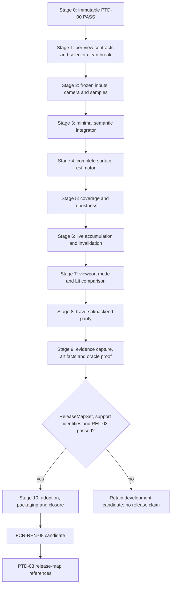

# Reference Path Tracer Staged Implementation Plan

**Status:** `PTD-01` frozen by **`PTD-00-R1 PASS`** at immutable dossier revision `d3152ec28f74cc1987f1d58fb52fa7ede10fd300`; development Stages 1-9 are authorized, while Stage 10/release closure remains gated by `REL-03`, release maps, support identities, and executable evidence

**Scope:** deliver `FCR-REN-08` end to end through one Renderer-owned per-view reference session, one semantic path estimator, viewport-first Lit comparison, optional raw evidence publication, D3D12/Vulkan traversal parity, secondary runtime/offscreen workflows, controlled failure, and release-map adoption

**Prepared:** R0 source audit at `669637cf23b9748f8b94635409e74159d31d0bc2`; R1 gate reconciliation rebased 2026-09-10 to committed source input `30597d7d0bb70af9f2836ab01d81d47c3e20bcde`; estimates are planning ranges, not schedule commitments

**Naming reconciliation:** the 2026-09-09 working-tree clean break makes `ReferencePathTracer` the sole feature name; it does not authorize or complete a plan stage.

**Priority reconciliation:** 2026-09-10 moves the first usable live viewport/Lit-comparison milestone ahead of traversal-parity expansion and evidence-artifact workflow; no stage is thereby authorized or completed.

**Authority boundary:** [Transport And Estimator](TransportAndEstimator.md) owns mathematical semantics, [Execution Architecture](ExecutionArchitecture.md) owns system ownership/lifetime, [User Experience](UserExperience.md) owns the human/automation workflow; the [feature dossier](README.md) owns `RPT-FS-*`, `AC-RPT-*`, `FM-RPT-*`, `CHK-RPT-*`, and definition of done; [Discovery](Discovery.md) owns `PTD-00`; the [completion study](Research.md) owns external precedent; this page owns delivery order, dependencies, clean breaks, estimates, prompts, and slice exit gates

**Current readiness:** **20/100** — plan presence adds no implementation, integration, verification, or delivery credit. See [Current Feature Readiness](../../../../../../../Acceptance/CurrentReadiness.md#renderer).

**Non-claims:** no plan stage has passed, no production code was changed, and no build, shader compile, runtime, GPU, image, convergence, backend, performance, package, or release evidence was produced by authoring this plan

This plan exists now because the requested implementation route needs to be concrete and reviewable before code work. Its presence does not manufacture a `PTD-00` pass. Stage 0 must replace every provisional choice and estimate with the accepted discovery result; if the result changes architecture, this plan is revised before Stage 1 rather than bending implementation around stale prose.

> [!CAUTION]
> Do not start Stage 1 because this file exists. Development implementation requires an exact immutable `PTD-00-R1 PASS` accepted by the repository owner. `REL-03`, release maps, and named support machines are not Stage-1 inputs; they remain mandatory for Stage 10 and every release/package/oracle-adoption claim.

## Outcome

Completion yields:

- a bounded, deterministic `SurfaceTransportReference` per-view session over immutable Scene/View generations;
- a separately named `FinitePathDiagnostic` route for analytic and event-isolation work;
- independent camera rays, one reviewed NEE/MIS/Russian-roulette surface estimator, robust endpoints, exact sample identity, and complete invalid accounting;
- raw scene-linear EXR beauty/AOV/statistics plus hashes, provenance, checkpoints, and atomic completion;
- one semantic integrator behind strict Inline and native Pipeline adapters on D3D12 and Vulkan;
- a `Reference Path Tracer` view mode immediately after Lit that validates/starts automatically, shows exact progress/reset/completion, handles Editor and Game cameras through one identity path, and preserves only exact-identity Lit comparisons;
- optional raw save and noninteractive `ShowcaseEditor` execution as secondary consumers of that same session contract;
- an analytic/minimal/external/statistical/backend/failure evidence ladder sufficient for `FCR-REN-08` and later `PTD-03` release-map adoption;
- removal of the current GBuffer-seeded `LightingMode::ReferencePathTracer` authority in favor of one `RenderViewMode::ReferencePathTracer` session, without a compatibility layer or second scene/material system.

Anything less remains a candidate comparison. A cleaner image, larger sample count, passing build, or agreement with one external renderer does not close the feature.

## Delivery Priority

The [User Experience product priority](UserExperience.md#product-priority-order) is binding on stage order:

1. deliver a responsive, automatically accumulating viewport mode and Lit comparison loop over a PBR-correct in-memory result;
2. prove its Renderer/RHI semantics and required backend/frontend routes;
3. add only the readback/publication needed for acceptance evidence; and
4. polish save, checkpoint, and offscreen automation after the primary viewport experience is usable.

Artifacts remain required for final oracle authority, but they are not the first product milestone. A completed EXR pipeline cannot advance the primary UX while the user cannot select the mode, move through the scene, see the latest view restart/refine live, read exact progress, or compare with Lit. The first usable viewport milestone is also not permission to call an unproved estimator a reference; mathematical and PBR correctness remain prerequisites.

## Gate And Dependency Graph



No stage may hide an unmet exit criterion in the next stage. A discovery-shaping unknown returns to Stage 0. A semantic defect returns to its owning estimator/input stage. A workflow, package, or failure defect returns to the owning operational stage without weakening the mathematical claim.

## Planning Envelope

| Stage | Focus | Initial effort range | Prerequisite | Primary exit checks |
| --- | --- | ---: | --- | --- |
| 0 | discovery closure and plan freeze | 70-110 h | none | `CHK-PTD-01` through `12` as applicable |
| 1 | contracts, per-view session owner, selector clean break | 50-85 h | immutable `PTD-00-R1 PASS` | `CHK-RPT-01`, `02`, `16` |
| 2 | immutable inputs, Scene/Game camera identity, primary rays, sample identity | 80-130 h | Stage 1 | `CHK-RPT-02`, `03`, `07` |
| 3 | minimal reviewable integrator | 75-125 h | Stage 2 | `CHK-RPT-03`, `04`, `05` |
| 4 | complete included surface estimator | 110-180 h | Stage 3 | `CHK-RPT-04`, `05`, `11` |
| 5 | material/geometry coverage and numeric robustness | 90-150 h | Stage 4 | `CHK-RPT-03`, `04`, `08` |
| 6 | in-memory per-view accumulation/invalidation, live preview, and progress snapshots | 80-135 h | Stage 5 | `CHK-RPT-09`, focused `15` |
| 7 | first usable viewport mode, live navigation, progress/reset UX, and Lit comparison | 70-120 h | Stage 6 | `CHK-RPT-02`, `09`, `15`, `16` |
| 8 | Inline/RGS and D3D12/Vulkan parity | 90-150 h | Stage 7 | `CHK-RPT-07`, `08`, `12` |
| 9 | minimal evidence capture, EXR/checkpoint/offscreen publication, independent oracle, and failure evidence | 145-250 h | Stage 8 | `CHK-RPT-04` through `13` |
| 10 | package/adoption evidence, cleanup, completion report | 70-125 h | Stage 9, accepted `ReleaseMapSet`, support identities, `REL-03` | `CHK-RPT-01`, `14`, `15`, `16` |
| **Total** | full first-release closure | **930-1,560 h** | accepted scope | all applicable `AC-RPT-01` through `20` |

The range is intentionally honest about math review, two APIs, two traversal frontends, artifact safety, and independent evidence. Stage 0 must re-estimate after feature scope, machines, release maps, tolerances, and reusable infrastructure are known. Cutting evidence, raw output, failure behavior, or a required backend is a scope decision, not an “optimization” of this estimate. Ordering artifact work later protects the daily viewport use case; it does not make final evidence optional.

## Universal Execution Contract

Every implementation prompt below inherits these rules. The executing agent must:

1. start at the repository root; read `AGENTS.md`, `Docs/README.md`, the selected Engineering task routes, [Transport And Estimator](TransportAndEstimator.md), [Execution Architecture](ExecutionArchitecture.md), [User Experience](UserExperience.md), [feature acceptance](README.md), [Discovery](Discovery.md), and this plan in full;
2. inspect `git status --short`, preserve unrelated dirty work, and inspect live owners/producers/consumers/lifetime/build membership with `rg` before editing;
3. confirm all named prerequisite gates and prior-stage exit artifacts. If a prerequisite is absent, stale, or contradicted by code, stop and report `BLOCKED`; do not improvise around it;
4. implement only the selected stage and defects required for its exit criteria. Do not begin later UI, general framework, performance, denoising, neural, material-system, or compatibility work;
5. preserve Scene-owned scene data, View-owned view identity/camera data, one Renderer per-view session authority, one semantic integrator, thin RHI traversal adapters, and the single-truth/copy budget;
6. perform clean breaks for Sparkle-owned contracts: update all producers/consumers/build/docs together and delete the replaced path. Do not add legacy readers, aliases, version bridges, fallback selectors, or dual representations;
7. keep current code/behavior labels honest. Never use “unbiased,” “ground truth,” “converged,” or “accepted reference” beyond the exact passed scope;
8. design each check with initial state, action/injection, oracle, matrix, artifact, maximum duration/resources, cleanup, and escalation. Use the cheapest claim-falsifying check first;
9. do not add submitted test-only classes, fixtures, executables, files, or CMake targets. Temporary local probes are allowed only when necessary and must be removed before handoff; use existing validation routes and production diagnostics;
10. run `architecture_boundary_check` whenever Renderer/RHI boundaries change, focused build/shader checks required by the stage, and `git diff --check`. Do not claim unrun checks passed;
11. leave one iteration record containing gate revision, decisions, changed files, deletions, checks actually run, exact outputs/artifact links, known limitations, blockers, and the next permitted stage.

Every prompt's `NON-NEGOTIABLE` paragraph is an exit gate, not motivational prose. A handoff must quote each item and attach its proof or say `BLOCKED`. “Implemented,” a clean build, a plausible image, or a manual click-through cannot substitute for that proof.

If source reality proves a plan instruction wrong, correct the owning architecture/plan document in the same stage and explain the divergence. Do not preserve a bad plan through code contortions.

## Cross-Stage Invariants

- Raw reference transport never consumes production GBuffer, ReSTIR, temporal reconstruction, denoised, exposed, tone-mapped, encoded, or screenshot data.
- Session seed, pixel, sample, and dimension identity never depends on frame timing, dispatch order, batch size, view-mode switching, or resume timing.
- `SurfaceTransportReference` contains no silent deterministic path/distance cap, firefly/contribution clamp, biased environment MIP, approximate cache, or invalid-to-black substitution.
- Unsupported semantics and missing strict capabilities reject before sample zero; they do not silently downgrade.
- Scene/View data is leased by immutable generation; no feature-owned duplicate scene truth is introduced.
- The estimator has one code/math correspondence. Inline/RGS and D3D12/Vulkan do not fork material, light, sample, or contribution semantics.
- Every discarded/invalid/capped event changes a retained counter and the accepted sample/session status.
- Preview is a derivative of raw output and carries its raw hash; it is never the numeric comparison source.
- A checkpoint is a verified exact prefix. A completion manifest is atomic, immutable, and written last.
- A phase cannot close from source inspection, compilation, one beauty image, one backend, one seed, or one external renderer alone.
- Every implemented transport term maps to one accepted `MATH-*` row and one retained defect-detecting result. No stage may silently revise a formula or decision slot.
- `Reference Path Tracer` is the second viewport mode after Lit. Selection validates/starts automatically; the UI mirrors Renderer progress/reset/completion truth and never mutates persistent Lit settings.
- Canonical Editor and Game camera identity, not input-device events or approximate motion thresholds, decides camera reset. Every radiance-affecting change invalidates before commit; presentation/scheduling-only changes preserve the prefix.
- Lit comparison suspends one bounded per-view prefix and resumes only after full-digest revalidation. Export/offscreen automation derives from the same Renderer session semantics.
- Camera controls remain responsive in the selected mode. Superseded camera work is abandoned before commit, the newest accepted identity is presented at bounded cadence, and accumulation continues automatically when movement stops; no save/readback/checkpoint work may outrank that loop.
- Every user-visible state/action/error/artifact obeys [User Experience](UserExperience.md); Editor/runtime/offscreen surfaces do not duplicate Renderer truth.

## Stage 0 - Close Discovery And Freeze The Plan

### Objective

Produce the exact `PTD-00` evidence package, independently review it, and reconcile this conditional plan to the accepted report. No production code changes occur in this stage.

### Work

1. Re-audit the live current route, selectors, source/shader/generated/CMake membership, Scene/View ownership, RHI frontends, capture/export infrastructure, ApplicationEditor operations, package roots, and release-map requirements.
2. Ratify or replace every `MATH-*` row and decision slot in [Transport And Estimator](TransportAndEstimator.md): products, equations, direction/measure notation, units/color, PBR material/normal model, light/lobe strategies, MIS, roulette, sampling, accumulation, robust rays, invalid/safety behavior, included/excluded `RPT-FS-*` rows, and permitted oracle claims.
3. Freeze camera, geometry, texture, material, light, environment, alpha/sidedness, deformation, backend/frontend, raw output, workflow, and profile matrices against the development `RPTConformanceSet` and development selectors. Isolate future `ReleaseMapSet` and package reconciliation in Stage 10; do not let an unknown release map alter implementation by inference.
4. Complete the equation-to-code design for camera sampling, BSDF selection/eval/PDF, light PMF/native-to-solid-angle PDF, emission/environment MIS, delta cases, roulette, shading normals, alpha rejection, invalid values, and robust endpoints.
5. Select the stateless sampler, dimension ledger, accumulation representation, maximum supported SPP, checkpoint layout, OpenEXR channel/schema policy, artifact hashes, budgets, and statistical protocol.
6. Specify analytic/metamorphic fixtures, minimal event oracle, Falcor/Capsaicin/Mitsuba external interchange scenes, equivalence manifests, independent replicates, thresholds, regions, stop/escalation rules, and controlled fault injections.
7. Record adopted/rejected NVIDIA/AMD/neutral precedents and exact source/license revisions. No copied source or redistributed asset enters by inference.
8. Ratify or replace [User Experience](UserExperience.md): its P0-P3 product priority, Reference Path Tracer immediately after Lit, mode-owned defaults, automatic preflight/start, responsive live navigation, newest-view presentation, automatic post-motion refinement, exact progress/reset/completion, canonical Editor/Game camera invalidation, radiance/presentation/scheduling classification, Lit comparison retention/revalidation, pause/restart, secondary checkpoint/raw save/offscreen equivalence, errors, accessibility, support, first-use, and Shipping exclusion.
9. Complete `AC-PTD-*`/`FM-PTD-*`/`RISK-PTD-*`/`CHK-PTD-*` traceability, clean-break deletion ledger, owner/dependency assignments, and revised implementation estimates.
10. Obtain independent mathematical, numerical, architecture, evidence, and first-use review and record `PASS` or `BLOCKED`. On `PASS`, update this plan's status and exact prerequisite revision without claiming implementation evidence.

### Exit gate

- `AC-PTD-01` through `17` all pass at one report revision.
- Every `PTD-Q-*` is closed by a decision/evidence result, not moved into code as an ambiguity.
- Every included `RPT-FS-*` row has an owner, phase, defect-detecting check, budget, and external/shared-dependency oracle.
- Every `MATH-*` row is accepted/replaced/excluded, every formula-changing slot is filled, and all hand cases plus independent math/numeric review are retained.
- The experience contract is frozen tightly enough that Stages 1, 2, 6, 7, and 9 cannot invent selector ownership/order, mode defaults, camera identity, navigation responsiveness, newest-view presentation, invalidation classes, target-SPP behavior, Lit comparison retention, state actions, failure behavior, export precedence, accessibility, or viewport/offscreen equivalence.
- The Stage 1 prompt can be executed without inventing scope, math, architecture, evidence, or ownership.
- No implementation file changed and no plan presence is counted as readiness.

### Ready-to-use prompt

```text
Execute only Stage 0 of Docs/Architecture/Modules/Engine/Renderer/Features/Lighting/ReferencePathTracer/Plan.md.

Apply the plan's Universal Execution Contract. Do not change production code. Complete PTD-D0 through PTD-D4 and the full PTD-00 evidence package from the live repository, not from assumptions in the plan. Freeze the exact SurfaceTransportReference and FinitePathDiagnostic equations/domains; reconcile every RPT-FS row with `RPTConformanceSet` and development selectors; explicitly assign future release-map/package adoption to Stage 10; derive camera, BSDF, light, MIS, roulette, normal, alpha, robust-ray, sampling, accumulation, artifact, backend, viewport/offscreen workflow, and failure contracts; predeclare the oracle/statistical matrices and budgets; pin and classify all external source/license precedents including REF-UE-PT-UX; build a no-orphan traceability and clean-break ledger; and obtain an independent plan-readiness review.

NON-NEGOTIABLE: ratify or replace every MATH-* row and every decision slot in TransportAndEstimator.md, with hand-worked zero/unit/delta/Jacobian/MIS/emission-hit/roulette/finite-depth/invalid/variance cases and independent mathematical plus numerical review. Ratify or replace UserExperience.md with a dry-run first-use review proving the item immediately after Lit, automatic preflight/start, responsive navigation, newest-camera reset/presentation, automatic refinement after motion stops, exact prefix progress, every Editor/Game camera and scene reset, presentation/scheduling non-reset, Lit comparison resume/reset, target-SPP changes, pause/restart, secondary checkpoint/raw save/offscreen equivalence, errors, accessibility, and Shipping exclusion. A remaining inferred PDF measure, probability, unit, camera field, invalidation class, retention/capacity rule, responsiveness threshold, budget, user action, or failure outcome is a BLOCKER.

Use the cheapest claim-falsifying probes first. Do not build the engine or render representative maps unless a named PTD-00 criterion requires that escalation. Any unresolved item that can alter scope, estimator, architecture, ownership, evidence, or release claims keeps PTD-00 BLOCKED. End with the exact PASS/BLOCKED revision, evidence links, unrun checks, revised estimates, and whether Stage 1 is authorized. Never mark PTD-00 PASS from document completeness alone.
```

### Stage-0 execution result — 2026-09-10

`PTD-00-R0` is **BLOCKED** at source input `669637cf23b9748f8b94635409e74159d31d0bc2`. The exact report, current-route audit, decision dispositions, matrices, oracle/statistical protocol, revised estimates, independent review record, and unrun checks are retained in [Discovery](Discovery.md#ptd-00-r0-stage-0-execution-report). The mathematical candidate is frozen in [Transport And Estimator](TransportAndEstimator.md#stage-0-decision-freeze), and the product defaults/budgets are frozen in [User Experience](UserExperience.md#frozen-defaults-and-operational-budgets).

The blocking facts are release-owned: no accepted `ReleaseMapSet`, support-hardware/package-root identity, or proved Shipping reachability exists, so exact map-domain reconciliation and final independent signatures cannot pass. Stage 1 is **not authorized**; repeating Stage 0 wholesale is unnecessary, but `PTD-00-R1` must rebase, reconcile the affected matrices, and repeat every independent review after those inputs exist. No production file changed and no implementation evidence is claimed.

### Stage-0 R1 gate reconciliation — 2026-09-10

R1 identifies the R0 dependency as a gate-placement error: final release maps, named support machines, and an already-proved package cannot be prerequisites for implementing the development tracer they must later exercise. [Discovery's R1 reconciliation](Discovery.md#ptd-00-r1-gate-separation-reconciliation) freezes `RPTConformanceSet`, capability-driven refusal, explicit Stage-9 output destinations, six-profile target reachability, and the development-versus-release boundary. The repository owner accepted immutable dossier revision `d3152ec28f74cc1987f1d58fb52fa7ede10fd300` as `PTD-00-R1 PASS` on 2026-09-10, authorizing Stages 1-9. Stage 10, `FCR-REN-08`, packaged support, and `PTD-03` remain blocked by `ReleaseMapSet`, support identities, `REL-03`, and executable evidence.

## Stage 1 - Establish Per-View Session Contracts And One Honest Selector

### Objective

Install the minimal production per-view session/state contracts and remove the duplicate GBuffer-seeded public authority before transport expansion. No candidate artifact may yet be called an accepted reference.

### Work

1. Add one Renderer-owned per-view request/session-handle/progress/result/state owner with bounded validation, reasoned invalidation, target completion, suspension, and terminal categories. Keep public surface semantic and small; hide implementation classes in Private.
2. Put reference intent and observation on the canonical View boundary without copying Scene/View truth. Add canonical transport-digest construction and explicit immutable Scene/View generation leases.
3. Add requested-versus-active backend/frontend/product fields and reject unsupported scope/capability before resource allocation.
4. Define `RenderViewMode::ReferencePathTracer` as the sole target selector and its per-view semantics, but do not expose a clickable product route until a real estimator and live accumulator can satisfy it in Stage 7.
5. Remove `LightingMode::ReferencePathTracer`, its GBuffer-seeded reference authority, and orphan settings/selectors in one clean break. Do not retain an alias, fallback, comparison copy, or dual representation.
6. Add bounded production diagnostics for state, reset reason/discarded prefix, error, and input digest. Do not add a second dashboard, generic job framework, or filesystem schema.
7. Update CMake/generated metadata/docs/consumers and delete superseded paths in the same change.

### Exit gate

- State transitions, target progress shape, reset categories, and invalid request/capability/pause/restart behavior are observable without starting transport.
- Scene/View leases preserve ownership and retirement; no deep copy or mutable cross-thread reference exists.
- One semantic `RenderViewMode` target exists; no Lighting selector, alias, UI, or manifest overclaims current output.
- `AC-RPT-01`, the contract/state portion of `AC-RPT-02`/`04`, and relevant `FM-RPT-01`, `14`, `18`, `19` are falsified by focused checks.
- `CHK-RPT-01`, focused `CHK-RPT-02`, and `CHK-RPT-16` evidence is retained; Renderer/RHI boundary check passes if affected.

### Ready-to-use prompt

```text
Implement only Stage 1 of Docs/Architecture/Modules/Engine/Renderer/Features/Lighting/ReferencePathTracer/Plan.md after verifying the exact immutable PTD-00-R1 PASS revision. Apply the Universal Execution Contract. Do not require or imply REL-03, release-map, support-machine, package, or Shipping proof in this development contract stage; those remain Stage-10 gates.

From the live tree, introduce the smallest Renderer-owned per-view reference request/session-handle/progress/result/state contracts, canonical View intent/observation boundary, immutable Scene/View generation leases, transport digest, strict requested-versus-active capability fields, exact prefix/target and reasoned invalidation state. Define RenderViewMode::ReferencePathTracer as the sole target semantic but keep it unavailable to users until Stage 7 can connect a real implementation. Remove LightingMode::ReferencePathTracer, the GBuffer-seeded reference authority, every producer/consumer/setting that exists only for it, and all duplicate selector authority; update generated metadata, build membership, and docs as one clean break. Do not implement the new estimator, EXR writer, UI, generic job system, compatibility alias, or fallback.

NON-NEGOTIABLE: the contracts must represent every accepted per-view lifecycle state, exact committed/target prefix, invalidation class/reason/discarded count, suspension/resume, and stable terminal category needed by UserExperience.md without putting strings, widgets, files, or UI truth in Renderer. Unsupported domain/capability must reject before allocation/sample zero; requested and active values remain distinct; destruction settles leases/resources within the frozen bound; target SPP is not convergence; no selector, progress object, or result may imply authority evidence has not earned.

Exercise invalid scope/capability, identity mutation, state transitions, pause/restart/destruction, ownership/retirement, `RenderViewMode` versus `LightingMode` selector removal, and clean-break claims with focused checks; run architecture_boundary_check if the Renderer/RHI boundary changes and git diff --check. Stop on duplicate scene/session/selector authority or any need to invent a PTD-00 decision. Handoff exact changed/deleted files, checks actually run, evidence, limitations, and Stage 2 readiness. Do not change either Editor `RenderViewKind::Game` producer in this stage; that camera-semantic clean break belongs to Stage 2.
```

## Stage 2 - Freeze Inputs, Unify Camera Invalidation, Generate Rays, And Stabilize Samples

### Objective

Create an independently traceable primary-ray and sample-identity route over frozen canonical inputs, with one exact invalidation classification for Editor and Game views, still without the full estimator.

### Work

1. Publish the accepted immutable Scene generation inputs needed for triangle hits, material/light identity, and AS use without introducing a feature-specific scene database.
2. Publish one canonical semantic View fingerprint for Editor-produced `RenderViewKind::Scene` and runtime `RenderViewKind::Game`: view/selection/camera identity, position/orientation, projection/lens, admitted shutter/time, crop/filter, and render extent. Clean-break both current Editor producers from their incorrect `Game` submission. Normalize semantic values; never hash padding or ordinary TAA jitter.
3. Implement exact transport-reset classification for every effective camera and contributing generation, plus non-reset classifications for presentation, scheduling, target SPP, and view-mode suspension. Input/cut flags refine the reason but never replace canonical identity.
4. Implement accepted center/edge/corner/subpixel primary-ray generation independent of GBuffer resources and the stateless sample generator/dimension ledger over session seed, pixel, sample ordinal, and dimension ID.
5. Allocate and commit non-overlapping half-open sample ranges; separate Renderer frame index and real-time jitter from sample ordinal completely. Reject a stale range before commit.
6. Add bounded diagnostic primary-hit/event/fingerprint/invalidation readback for analytic cases and sample-stream inspection.
7. Prove restart/prefix/reorder/mode-suspension identity at the contract level. Reject unsupported camera/geometry/deformation/material/light/dynamic semantics before sample zero.

### Exit gate

- Analytic camera rays and triangle hit/miss/barycentric/transform/sidedness cases match predeclared expectations with the production GBuffer disconnected.
- Editor and Game camera translation, rotation, selection, cut/teleport, projection/lens, resize, and continuous-motion cases produce the same semantic reset behavior; unchanged frames and ordinary TAA jitter do not reset.
- Same input digest and sample identity repeat across frame timing, batch/reorder, mode suspension, and restart probes; ranges neither overlap nor skip.
- Every mutable contributing input has generation identity or is excluded.
- Focused `CHK-RPT-02`, `03`, and `07` cover `AC-RPT-03`, input portions of `04`/`05`, `AC-RPT-11`, and `FM-RPT-03`, `04`, `07`, `19`.

### Ready-to-use prompt

```text
Implement only Stage 2 of Docs/Architecture/Modules/Engine/Renderer/Features/Lighting/ReferencePathTracer/Plan.md after confirming Stage 1 evidence and unchanged PTD-00 scope. Apply the Universal Execution Contract.

Extend the existing Scene and View owners with immutable generation-stable data/views needed by the accepted reference contract; do not create a feature-specific scene database. Build one canonical post-resolution View fingerprint for Editor and Game cameras and classify exact transport reset versus target-goal, presentation, scheduling, mode-suspension, and unsupported changes. Implement independent camera/subpixel rays, the accepted stateless session/pixel/sample/dimension sampler and dimension ledger, non-overlapping committed ranges with stale-generation rejection, and bounded analytic fingerprint/primary-hit/sample diagnostics. Remove frame-index and ordinary TAA-jitter dependence from the new route; reject every unsupported reachable dynamic semantic before sample zero.

NON-NEGOTIABLE: implement accepted MATH-01 and MATH-09 exactly. Film/raster/crop/filter mapping must have known-value rays and a constant-radiance integral. Any effective camera/ray-domain change defines a different measurement and resets with no motion epsilon; Editor input events are not authority; unchanged submissions, frame count, and TAA jitter do not reset. Generator packing/conversion/dimensions/replicate/overflow/branch independence remain inspectable. Same `(digest, replicate, pixel, ordinal, dimension)` means the same bits across batch sizes, scheduling, Lit suspension, restart, and accepted backends; stale or overlapping ranges never commit.

Use analytic ray/hit expectations and deterministic Editor/Game fingerprint, reset/non-reset, repeat/prefix/reorder/suspension/restart probes. Inspect both API binding implications but do not add the RGS frontend, full BSDF/light estimator, accumulation, export, or UI. Run focused shader/build checks, ownership/retirement checks, architecture_boundary_check where applicable, and git diff --check. Stop if freezing requires copied scene truth, if a dynamic producer lacks trustworthy generation identity, or if any sample/camera/domain decision remains open.
```

## Stage 3 - Build The Minimal Reviewable Semantic Integrator

### Objective

Implement a deliberately small camera-to-emission/environment tracer whose event log can be matched to hand calculations before NEE/MIS breadth is added.

### Work

1. Define one Renderer shader semantic core for path state, surface event, BSDF result, light event, trace result, contribution, and diagnostics; keep API-specific types outside it.
2. Implement accepted material decode for the minimal opaque Lambertian/emissive domain, primary/continuation trace, environment miss, emission hit, and BSDF continuation.
3. Implement the exact finite-depth termination/event state for the minimal-domain internal slice of `FinitePathDiagnostic`. Do not expose this incomplete estimator slice as the completed finite product or as full transport.
4. Implement finite/invalid/PDF/normal/event validation with retained counters; never clamp or turn invalid values into plausible black.
5. Add minimal raw in-memory radiance output sufficient for analytic checking. Do not yet build final accumulation or file publication.
6. Maintain equation-to-code labels or a compact ledger so every throughput term maps to the accepted derivation.

### Exit gate

- Black, constant environment, emissive hit, Lambertian normalization/energy, one- and two-segment hand cases pass within frozen tolerance.
- Intentional PDF, cosine, emission, sample-selection, and invalid-value faults are detected by the named checks.
- No GBuffer, real-time lighting, post-process, temporal history, API-specific estimator fork, or hidden limit enters the semantic core.
- Focused `CHK-RPT-03`, `04`, and `05` cover the minimal portions of `AC-RPT-05` through `10` and `FM-RPT-02` through `06`.

### Ready-to-use prompt

```text
Implement only Stage 3 of Docs/Architecture/Modules/Engine/Renderer/Features/Lighting/ReferencePathTracer/Plan.md after Stage 2 passes. Apply the Universal Execution Contract.

Create one API-neutral Renderer shader semantic core for a minimal camera path over the accepted opaque Lambertian/emissive/environment domain. Include material decode, primary and continuation hits, BSDF sampling/evaluation/PDF correspondence, environment misses, emissive hits, FinitePathDiagnostic termination, exact path-event diagnostics, and explicit invalid counters. Keep traversal behind the current accepted adapter and keep output in-memory for analytic checks. Preserve equation-to-code correspondence and remove any duplicated old helper authority that the new semantic core replaces.

NON-NEGOTIABLE: implement only the accepted finite-domain portions of MATH-02, MATH-03, MATH-07, and the Reference Algorithm. Every direction convention, geometric cosine, lobe-selection mass, conditional/complete PDF, emission term, and legitimate zero termination must appear once in both the event record and equation-to-code ledger. The internal FinitePathDiagnostic(D) slice must have the frozen vertex/depth meaning, no roulette, an identity-bearing finite label, and no route by which it can be presented as the completed finite product or SurfaceTransportReference before Stage 4 adds and proves the accepted NEE/MIS strategies.

Run the predeclared black/environment/emissive/Lambertian/one-path/two-path analytic cases and controlled probability/cosine/emission/invalid injections. Do not add full NEE/MIS, material breadth, EXR/checkpoints, RGS, UI, denoising, or performance refactors. A plausible image is not an exit artifact. Stop on an unmatched derivation term or shared dependency with no independent oracle.
```

## Stage 4 - Complete The Included Surface-Transport Estimator

### Objective

Extend the semantic core to every accepted reflective material/light event with one reviewed NEE/MIS estimator and compensated Russian roulette.

### Work

1. Implement the accepted metallic-roughness diffuse/specular mixture with matching evaluation, sampling, PDF, event flags, dielectric F0, limiting cases, and shading-normal treatment.
2. Implement analytic-light, emissive-triangle, and environment selection distributions with frozen units, sidedness, attenuation, native measure, solid-angle conversion, and zero-probability behavior.
3. Implement one-light NEE and BSDF strategy composition with the accepted MIS heuristic, including emissive/environment hits and delta-event exclusions without double counting.
4. Implement compensated Russian roulette for `SurfaceTransportReference`. Treat any safety-depth reach as retained failure; keep deterministic depth only in `FinitePathDiagnostic`.
5. Preserve direct/indirect/lobe AOV classifications without changing beauty contribution.
6. Remove any current separate direct/indirect reference estimator code that becomes duplicate authority, updating consumers and shader registrations together.

### Exit gate

- Every included BSDF/light strategy passes normalization, energy/white-furnace or applicable limit, unit/PDF/Jacobian, delta/zero, emission/environment, and NEE/MIS hand cases.
- Independent replicates show the expected mean on analytic scenes; injected missing/duplicate probabilities, MIS weights, emission, and roulette compensation fail.
- `SurfaceTransportReference` contains no accepted deterministic cutoff, clamp, filter, cache, or biased environment MIP.
- `CHK-RPT-04`, `05`, and early `11` cover `AC-RPT-06` through `10`, `15`, and `FM-RPT-05`, `06`, `11`, `16`.

### Ready-to-use prompt

```text
Implement only Stage 4 of Docs/Architecture/Modules/Engine/Renderer/Features/Lighting/ReferencePathTracer/Plan.md after the minimal integrator passes. Apply the Universal Execution Contract.

Extend the one semantic core to the entire PTD-00-included reflective surface/light domain: metallic-roughness diffuse/specular sampling-evaluation-PDF correspondence, dielectric limits, analytic/emissive/environment light PMFs and measure conversions, connection visibility, NEE, the accepted MIS heuristic, emissive/environment hit weighting, delta/zero cases, compensated Russian roulette, and non-energy-changing AOV classification. SurfaceTransportReference must have no silent deterministic cap, clamp, filter, cache, biased MIP, or invalid-to-black path; a safety-depth reach is a diagnosed failure. Keep FinitePathDiagnostic separately named.

NON-NEGOTIABLE: implement accepted MATH-02 through MATH-08 exactly. Continuous lobe sampling evaluates the complete BSDF and complete unconditional mixture PDF; delta events retain complete discrete event mass. Light PDF is selection PMF times conditional solid-angle density, with reviewed area and latitude-longitude Jacobians. NEE and emissive/environment-hit MIS use comparable PDFs at the correct vertex and cannot double count; the last admitted FinitePathDiagnostic vertex evaluates emission and NEE before depth termination. Roulette observes the frozen throughput/state and divides survivors by the exact survival probability. Every factor is tagged in a bounded event trace; no epsilon, saturate, max-to-zero, firefly filter, MIP, cutoff, or preview fix may alter raw expectation.

Delete superseded separate direct/indirect reference estimator authority in the same clean break when all required diagnostics/consumers move. Run equation-to-code, hand-computable light/energy/PDF cases, white-furnace or accepted equivalents, independent-replicate means, and deliberate missing/duplicate probability/MIS/emission/roulette faults. Do not add excluded transmission/media/BSSRDF/spectral features, artifact workflow, RGS, UI, or speculative wavefront execution.
```

## Stage 5 - Close Geometry, Material, Texture, And Numeric Robustness

### Objective

Make every included content semantic and ray endpoint reliable across the accepted transform/scale matrix without per-scene tuning.

### Work

1. Complete accepted alpha-test, two-sided/winding, UV transform, texture decode/color-space/address/filter/LOD, normal-map, emission, and material parameter behavior.
2. Support frozen evaluated skin/morph snapshots only if included. Keep animation/time integration excluded unless accepted explicitly.
3. Implement one robust primary/continuation/connection-ray endpoint owner derived from Sparkle formats/transforms/compiler behavior and geometric normals.
4. Remove fixed reference `MinT`, normal-bias/grazing tuning, and maximum-distance authority from `SurfaceTransportReference`.
5. Add production counters and bounded diagnostic context for alpha rejections, self-hit prevention, invalid normals/PDF/radiance, endpoint collapse, and safety-depth reach.
6. Execute the declared scale, translation, rotation, nonuniform-scale, shear, mirror, grazing, adjacent/coplanar, thin-gap, alpha, sidedness, and normal-map matrices on the smallest supported surface.

### Exit gate

- Every included content row has analytic/CPU/metamorphic evidence and a feature-support rejection for excluded cases.
- Robustness fixtures pass without per-scene epsilon or distance tuning; both API representations are considered even if Stage 8 retains final parity.
- All invalid values and rejected events are accounted for; no visible defect is “fixed” by a contribution clamp.
- `CHK-RPT-03`, `04`, and `08` cover `AC-RPT-05` through `08`, `12`, `15` and `FM-RPT-04`, `08`, `16`, `19`.

### Ready-to-use prompt

```text
Implement only Stage 5 of Docs/Architecture/Modules/Engine/Renderer/Features/Lighting/ReferencePathTracer/Plan.md after the full included estimator passes. Apply the Universal Execution Contract.

Close every PTD-00-included geometry/material/texture semantic: alpha test, sidedness/winding, UV transforms, texture decode and color space, addressing/filter/LOD, normal maps, emission, and frozen evaluated skin/morph state when included. Derive and implement one robust primary/continuation/connection endpoint policy from Sparkle formats/transforms/compiler assumptions and geometric normals. Remove fixed MinT, normal-bias/grazing tuning, and maximum-distance authority from SurfaceTransportReference; preserve only explicitly named diagnostic controls.

NON-NEGOTIABLE: close every accepted row of the PBR Material Contract and MATH-11. Geometric normal owns sides, visibility, and ray offsets; shading normal enters only through the accepted effective BSDF/model. Roughness zero follows the accepted delta limit, alpha follows one frozen cutout rule, AO never attenuates raw physical transport, and excluded subsurface/transmission/media remain unreachable. The endpoint bound includes reconstruction, transform, and traversal error and shortens both ends of connection rays; a scene-tuned epsilon is a stage failure.

Run the accepted CPU/analytic decode cases and scale/translation/rotation/nonuniform-scale/shear/mirror/grazing/coplanar/thin-gap/alpha/sidedness/normal-map matrix. Retain counters for every invalid/rejected/endpoint failure. Do not expand into excluded transmission, media, BSSRDF, spectral, procedural, motion-blur, or generalized material-framework work. Stop if any release-reachable semantic remains unmatched or requires scene-specific tuning.
```

## Stage 6 - Make Live Per-View Accumulation And Invalidation Transactional

### Objective

Turn valid path samples into a reset-safe in-memory per-view prefix with justified precision, exact committed/target counts, reasoned invalidation, comparison suspension, continuously refreshed display output, and nonblocking progress observation. This stage deliberately excludes file publication.

### Work

1. Implement the accepted accumulation representation, summation algorithm, exact integer count, second moment/variance/standard error, maximum count, overflow behavior, and deterministic reduction contract.
2. Commit only complete sample ranges. Before commit, reject stale View/Scene generations; implement every accepted transport-reset, target-goal, presentation-refresh, scheduling-update, mode-suspend/resume, explicit-restart, and unsupported transition with exact reason/discarded-prefix state.
3. Publish immutable, bounded progress snapshots containing state, exact committed/target prefix, active route, last reset/discarded prefix, counters, memory, measured throughput, and clearly estimated ETA. Observation never stalls sample commit or becomes a second state authority.
4. Produce a viewport-readable scene-linear display source from the newest completely committed prefix at a bounded cadence. Apply presentation only as a one-way derivative; it never mutates accumulation or enters transport identity.
5. Prioritize newest-camera response: stop scheduling superseded work, reject stale completion, coalesce UI reset notifications, and begin ordinal zero for the latest identity without waiting for old high-quality preview/readback work. When change stops, accumulation continues automatically.
6. Implement bounded pause/restart, Lit suspension/revalidation, capacity/eviction, cancellation, timeout, view destruction, and resource retirement. Reserve typed readback/checkpoint contract seams if accepted, but do not implement codec, filesystem, EXR, manifest, offscreen, or generic capture machinery.

### Exit gate

- Accumulation matches the higher-precision oracle at all frozen prefix/count extremes and state transitions.
- Every Editor/Game camera and scene change resets before mixing; target-SPP, presentation, scheduling, and Lit comparison changes preserve or revalidate exactly as specified.
- During camera movement, no stale prefix commits and the latest accepted camera identity reaches the display within the frozen responsiveness budget; after motion stops, accumulation proceeds automatically from ordinal zero.
- Pause/restart/Lit-suspend/resume, eviction, timeout, cancellation, and view destruction produce the accepted prefix/state/resource result.
- Raw accumulation and its display derivative are mechanically distinguishable; every forbidden presentation/bias switch is absent or rejected.
- `CHK-RPT-09` and focused `CHK-RPT-15` cover accumulation/lifecycle portions of `AC-RPT-13`, `15`, `18` and `FM-RPT-06`, `09`, `10`, `14`, `15` without requiring disk output.

### Ready-to-use prompt

```text
Implement only Stage 6 of Docs/Architecture/Modules/Engine/Renderer/Features/Lighting/ReferencePathTracer/Plan.md after Stage 5 passes. Apply the Universal Execution Contract.

Implement the PTD-00-selected per-view accumulation precision/summation, exact integer committed/target counts, second moment/uncertainty, overflow, complete-range commit, stale-generation rejection, and every frozen invalidation/goal/presentation/scheduling/mode-suspension/restart transition with reason and discarded prefix. Publish bounded immutable progress snapshots and a viewport-readable one-way display derivative from the newest completely committed prefix. Prioritize the newest canonical camera identity: abandon superseded scheduling, reject late work, update presentation within the frozen response budget, and continue accumulation automatically when movement stops. Implement bounded pause/restart, Lit suspension/revalidation, capacity/eviction, cancellation, timeout, destruction, and resource retirement.

NON-NEGOTIABLE: implement accepted MATH-10 with the frozen numeric representation and complete-range merge order; count is exact integer state, and variance cannot use an unproved cancellation-prone shortcut. A changed canonical measurement/radiance input invalidates before commit; presentation/scheduling-only changes cannot reset; target increases continue and decreases report the actual prefix; Lit return resumes only after full identity match. The selected viewport never freezes on an old composition or requires manual restart after camera motion. Display is a one-way derivative of the exact current prefix, and its cadence cannot alter estimator/sample identity.

Run higher-precision prefix/extreme-count comparisons; the full Editor/Game camera, scene mutation, continuous animation, target-SPP, presentation, scheduling, Lit suspension/return, eviction, pause/restart/resume/overflow/cancel/timeout/destruction matrix; newest-camera response and automatic post-motion refinement checks; and raw-to-display lineage/forbidden-switch checks. Do not add UI, RGS, checkpoint persistence, EXR, filesystem output, offscreen automation, adaptive stopping, denoising, or a generic asset/capture framework. Stop on any stale mixed prefix, frozen old-camera presentation beyond budget, needless presentation reset, manual-start requirement after motion, or accumulation input missing from identity.
```

## Stage 7 - Deliver The Reference Path Tracer View Mode And Lit Comparison

### Objective

Deliver the first usable product milestone: a first-class, one-click Reference Path Tracer viewport mode immediately after Lit that remains navigable, presents progressive accumulation live, explains resets and completion truthfully, and supports reliable Lit comparison. Saving and offscreen automation remain outside this stage.

### Work

1. Expose the Stage-1 `RenderViewMode::ReferencePathTracer` semantic in the viewport menu immediately after Lit and connect it directly to the one per-view Renderer session. Confirm no reference choice remains in global Lighting settings.
2. On selection preserve prior Lit settings, resolve the accepted mode preset, run automatic preflight, and start accumulation without a manual Validate/Start step. Unsupported selection shows `Unavailable` with one cause/action and no silent fallback.
3. Add the compact viewport overlay and details surface for state, exact committed/target SPP, ratio, last reset/discarded prefix, measured throughput, estimated ETA, requested/active route, memory/budget, counters, pause, and restart. Completion retains a compact badge; Evidence/Output may be visibly unavailable until Stage 9.
4. Make live navigation the scheduling priority: keep Editor and Game controls responsive, present the newest accepted camera's committed prefix at bounded cadence, visibly distinguish brief stale/resetting presentation, coalesce reset notifications without coalescing semantic identity, and refine automatically when motion stops.
5. Implement the Lit comparison contract: suspend after a complete range, restore untouched Lit state, observe changes while suspended, resume only on full-digest match, otherwise reset with the first reason. Make memory-policy eviction and second-viewport capacity explicit.
6. Exercise Editor and Game camera producers through the same canonical View path. No UI or input-device state becomes reset authority or Renderer truth.
7. Keep `ShippingEditor`, `ShippingGame`, and consumer first-run paths free of every feature producer/session factory and user/CLI/export route unless accepted release scope explicitly admits them. A developer CVar may diagnose selection in development profiles but is not the user route.

### Exit gate

- A first-time user finds Reference Path Tracer immediately after Lit, selects once, sees the latest composition accumulate, moves/rotates Editor and Game cameras with responsive feedback and exact reset, stops and sees automatic refinement, completes, switches Lit/back with correct resume/reset, and pauses/restarts without private knowledge, saving, or a wizard.
- Every hard invalidation resets before mixing; every presentation/scheduling-only change preserves the prefix; continuous animation never produces accepted streaked history.
- The overlay remains truthful through validation, rapid camera motion, reset, accumulation, completion, pause, Lit suspension, eviction, unavailable, and failure states; target progress is never labeled convergence.
- Closing details/viewport/application, invalid inputs, second-view capacity, eviction, time/resource limits, accessibility, and support diagnostics behave as declared.
- Focused `CHK-RPT-02`, `09`, `15`, and `16` close the primary viewport portions of `AC-RPT-02`, `04`, `13`, `18`, `20` and `FM-RPT-09`, `14`, `17`, `18`.

### Ready-to-use prompt

```text
Implement only Stage 7 of Docs/Architecture/Modules/Engine/Renderer/Features/Lighting/ReferencePathTracer/Plan.md after live in-memory accumulation passes. Apply the Universal Execution Contract.

Expose RenderViewMode::ReferencePathTracer immediately after Lit in the existing viewport menu and connect it to the one Renderer per-view session; confirm no global Lighting reference selector remains. Selection must preserve Lit settings, resolve the accepted mode preset, validate and start automatically. Implement the compact state/progress/reset/completion overlay, details/actions, canonical Editor and Game camera behavior, exact Lit suspension/revalidation, explicit eviction/second-view capacity, pause/restart, and unavailable/failure presentation. Keep Shipping exposure gated and Evidence/Output unavailable or explicitly deferred rather than faking it.

NON-NEGOTIABLE: implement UserExperience.md P0/P1 as the primary product, not a debug panel or mandatory render wizard. One selection starts a supported view. Camera controls remain responsive; the displayed composition follows the newest accepted identity within the frozen budget; exact canonical camera/radiance changes reset before commit; and refinement resumes automatically when motion stops. Input flags/tolerances are not authority; TAA jitter/frame count/display/scheduling changes do not reset. Lit restores untouched settings and resumes only after full identity match. Progress is exact target-prefix progress, never convergence.

Exercise menu ordering and one-click entry; unsupported automatic preflight; every Editor/Game camera field; rapid/continuous movement and post-motion refinement; scene/dynamic resets; target-SPP and presentation/scheduling non-resets; progress/completion; Lit switch/unchanged resume/changed reset; eviction and second view; pause/restart; close/shutdown/timeout; keyboard/focus/non-color/scale/DPI; accessibility and support. Do not add save/checkpoint/offscreen/file publication, a second executable/estimator, generic task framework, console dependency, wizard-only fallback, or hidden Lit-setting mutation. Run focused application/editor/build checks and git diff --check; report runtime surfaces not exercised.
```

## Stage 8 - Prove Traversal Frontend And Backend Parity

### Objective

Run the same semantic estimator and already-usable viewport session through strict Inline and native Pipeline frontends on D3D12 and Vulkan with explicit capability truth and no semantic fork.

### Work

1. Freeze the semantic trace/visibility adapter boundary used by the accepted Inline route.
2. Add path and visibility ray-type requirements to the existing ray-tracing pipeline/SBT plan; implement thin RGS, miss, any-hit, and closest-hit adapters without copying estimator/material/light logic.
3. Bind resources/payloads/SBT indices through current RHI owners; reject unavailable pipeline features before sample zero.
4. Implement strict requested/active Inline/Pipeline and D3D12/Vulkan selection. Automatic chooses only accepted routes and records the resolution.
5. Compare identical session/sample prefixes, event counters, analytic hits, raw values or declared statistical tolerances, compiler/settings identities, native validation outputs, and live viewport state transitions.
6. Measure enough to prove bounded progress, camera-response, and TDR safety and identify whether the megakernel violates a frozen budget. Do not introduce wavefront execution without that evidence and a new accepted design slice.

### Exit gate

- One semantic core is visible in the source/dependency audit; adapters contain mechanism only.
- All four required strict route combinations pass capability, native validation, robustness, deterministic/statistical parity, live camera reset/refinement, completion, and unsupported-route behavior, or `PTD-00` is formally narrowed before closure.
- No fallback, backend drift, payload/SBT mismatch, viewport-state divergence, or unexplained native validation message remains.
- `CHK-RPT-07`, `08`, `12`, and focused `16` cover `AC-RPT-11`, `12`, `17`, `20` and `FM-RPT-07`, `08`, `13`, `18`.

### Ready-to-use prompt

```text
Implement only Stage 8 of Docs/Architecture/Modules/Engine/Renderer/Features/Lighting/ReferencePathTracer/Plan.md after the first usable viewport milestone passes. Apply the Universal Execution Contract and the repository ray-tracing execution architecture.

Keep the estimator, sampler, material/light logic, diagnostics, accumulation, live navigation behavior, and output semantic in one Renderer core. Formalize its trace/visibility adapter; add the required path/visibility ray types and checked logical scene-to-SBT mapping to the existing RayTracingShaderTablePlan; implement thin RGS/miss/any-hit/closest-hit adapters and current RHI bindings; and add strict requested-versus-active Inline/Pipeline plus D3D12/Vulkan selection with visible rejection. Do not copy the estimator, create backend-specific materials, silently fall back, or add wavefront/SER/vendor optimization.

NON-NEGOTIABLE: all four accepted strict combinations execute the same Reference Algorithm, MATH-* code, sample stream, material/light data, alpha/sidedness rules, robust endpoints, accumulation semantics, counters, progress truth, and camera invalidation semantics. Adapters may translate only traversal payload, binding, and command mechanism. Any backend conditional that changes contribution, PDF, random dimension, invalid disposition, output meaning, live-reset behavior, or automatic post-motion refinement is a semantic fork and blocks the stage.

Run identical analytic jobs and sample prefixes on every accepted route, compare raw values/counters within the predeclared bitwise or statistical rule, exercise robust endpoints, newest-camera response, automatic post-motion refinement, target completion, and unsupported capability, inspect native validation and compiler identities, run architecture_boundary_check, focused shader/build/editor checks, and git diff --check. Any unexplained validation, backend/frontend divergence, or route-specific viewport behavior blocks the stage.
```

## Stage 9 - Add Minimal Evidence Capture And Prove Oracle-Candidate Readiness

### Objective

Add the smallest raw capture/checkpoint/offscreen publication route required for durable evidence, then execute the complete defect-detecting oracle and failure ladder. Passing this stage produces the evidence candidate required for later reference authority; it does not itself authorize the word “reference” in an accepted-result claim. Only Stage 10 plus accepted `FCR-REN-08` can grant that bounded authority. This stage must not expand into a general render-export product or destabilize the usable viewport loop.

### Work

1. Extend the existing RHI readback mechanism for typed raw HDR/AOV/counter payloads from an immutable session prefix rather than creating another capture system.
2. Implement the ApplicationEditor-owned artifact writer and staging/publish transaction. Use existing TinyEXR only after exact dependency/write/rights/security/build/package review; keep codec/filesystem policy out of core Renderer.
3. Write full-session-resolution raw `beauty.exr`, named AOVs, bounded event data when requested, hashes, verified checkpoint data when accepted, and `manifest.json` last. Support complete, save-when-complete, and unmistakably `PartialPrefix` exports from the same prefix; a preview is a bounded derivative with raw identity/display settings.
4. Enforce output canonicalization, writable-root, free-space, Unicode/path, overwrite, disk, partial, corrupt-checkpoint, and previous-valid-result behavior. Add optional save/checkpoint UI under the secondary Evidence/Output surface.
5. Add one noninteractive `ShowcaseEditor` manifest invocation that creates an offscreen Game-kind view over the same session contract, with stable result/exit categories and bounded logs. Equivalent viewport/offscreen intent resolves the same digest and sample stream.
6. Execute all included analytic camera/intersection/material/BSDF/light/estimator/robustness/accumulation fixtures with predeclared thresholds and controlled wrong implementations or fault injections.
7. Execute deterministic sample prefix/reorder/restart/backend/frontend studies and independent replicate convergence/correlation/uncertainty studies across required regions.
8. Execute the minimal event tracer and external renderer comparisons only after camera/units/geometry/material/texture/light/path/output equivalence manifests pass. Start with the smallest Falcor Minimal, Capsaicin, and Mitsuba scalar-RGB scenes that match the tested semantic; preserve disagreements as `Inconclusive` until explained.
9. Exercise raw artifact lineage, hashes, provenance mutation, accumulation extremes, exact extent/precision, and preview separation.
10. Inject unsupported input/capability, invalid values, safety depth, timeout, cancel, device loss/TDR where safely supported, OOM/capacity refusal, disk full, access/export failure, and corrupt checkpoint under bounded cleanup.
11. Run paired D3D12/Vulkan native validation and strict frontend/backend result comparison on frozen machines/configurations.
12. Produce the no-orphan `AC-RPT-*`/`FM-RPT-*`/`CHK-RPT-*` evidence matrix. Do not tune thresholds after observing candidate output.

### Exit gate

- `CHK-RPT-03` through `13` all pass for every included matrix cell, or the feature remains blocked with an exact owner and failed claim.
- The protocol detects seeded bias, correlation, shared-dependency, local-image, invalid-value, truncation, accumulation, backend, and artifact-publication defects.
- Raw save uses the exact session extent and precision, never screenshot/UI/preview resolution; checkpoint/partial/staging/completed states are mechanically distinct, and publication failure preserves the live viewport prefix and prior valid result.
- Viewport, approved runtime, and offscreen intents produce the same canonical request/digest/sample stream; adding artifact work does not regress the Stage-7 live-navigation and Lit-comparison gates.
- External comparisons retain exact source revisions/configurations/licenses and semantic equivalence; agreement is supporting evidence, not derivation proof.
- No unexplained native validation, crash/hang, invalid counter, statistical disagreement, or plausible partial result remains.

### Ready-to-use prompt

```text
Execute only Stage 9 of Docs/Architecture/Modules/Engine/Renderer/Features/Lighting/ReferencePathTracer/Plan.md after the live viewport and all strict render routes pass. Apply the Universal Execution Contract. This is minimal evidence publication, evidence execution, and defect repair within the implemented Reference Path Tracer; it is not permission to broaden features.

Extend existing RHI readback for typed immutable-prefix raw HDR/AOV/counters. Add the smallest ApplicationEditor-owned transactional writer and optional secondary Evidence/Output UI for complete, save-when-complete, unmistakably partial, and accepted checkpoint operations; write exact-session-resolution/precision EXR data, hashes, and manifest last, with preview kept separate. Add one ShowcaseEditor offscreen manifest route over the same canonical Game-kind View/session. Then run the predeclared CHK-RPT-03 through CHK-RPT-13 matrices: analytic and metamorphic camera/hit/material/BSDF/light/estimator cases; deliberate PDF/MIS/emission/roulette/correlation/invalid/truncation faults; sample prefix/reorder/restart studies; higher-precision accumulation; robustness transforms; raw/provenance/preview lineage; minimal event oracle; semantically equivalent pinned external renderer comparisons; independent replicate convergence and regional uncertainty; strict Inline/Pipeline and D3D12/Vulkan native validation; and bounded invalid-input/capability/timeout/cancel/device/OOM/disk/export/checkpoint failures.

NON-NEGOTIABLE: every accepted MATH-* row must have a seeded defect that the retained protocol detects, including wrong measure/Jacobian, missing or doubled PMF, lobe-mixture mismatch, delta MIS, emission-hit double count, roulette compensation, dimension alias, variance cancellation, and robust-endpoint failure. Each shared camera/material/light/traversal/output dependency must have an oracle outside that dependency. Raw save must never use screenshot, UI-scaled, preview, or silently reduced resolution. Save/checkpoint/offscreen share the viewport session semantics and cannot regress its camera response, progress, or Lit comparison. Execute the complete UserExperience failure/recovery matrix; success-path screenshots or responsive processes are not workflow evidence. No threshold, crop, seed, replicate, budget, or stop rule changes after candidate output is observed.

Use only thresholds, scenes, repetitions, seeds, regions, budgets, and stop rules frozen before execution. Record raw artifacts, hashes, manifests, source/compiler/driver identities, injected defect and detection, exact commands, outcomes, cleanup, and limitations. Treat semantic mismatch or unexplained disagreement as Inconclusive/Blocked. Fix discovered defects at their owner and rerun only invalidated evidence; never tune output or thresholds to pass. End with a no-orphan acceptance/failure/check matrix and an exact Stage 10 readiness decision.
```

## Stage 10 - Adopt References, Verify Packaging, Remove Superseded Paths, And Close

### Objective

Finish the product boundary, produce release-map references inside the accepted domain, delete old authority, and submit the candidate `FCR-REN-08` report.

### Work

1. Freeze each applicable release-map scene/camera/configuration and verify it lies wholly inside the accepted transport domain.
2. Produce raw high-sample references, independent replicates, uncertainty/convergence, full frames/crops, artifact checklist, input/output hashes, and shared-dependency oracle statements for `PTD-03`/`MAP-A` through `MAP-H`.
3. Compare real-time PBR/lighting/debug subjects only against applicable raw reference quantities. Keep display/preview comparisons separately labeled.
4. Validate the exact DevelopmentEditor/package workflow on clean supported machines, read-only install, writable output root, spaces/non-ASCII, both backends, first use, support output, resource bounds, and controlled failures. Both `ShippingEditor` and `ShippingGame` remain free of every producer/session factory and user/CLI/export/package route unless admitted.
5. Complete the deletion ledger: old reference producer/history/settings/shaders/selectors/docs/artifacts are removed or retained under an unambiguous non-authoritative role. Remove temporary probes and generated local evidence not permitted for submission.
6. Verify source/header/shader/generated/CMake/package/SBOM/license/docs membership and dependency direction.
7. Run the required focused final checks, architecture boundary check, `git diff --check`, and dirty-work audit. Escalate breadth only for claims actually affected.
8. File `FCR-REN-08` with exact results, exclusions, failures, limits, evidence links, and invalidation triggers. The acceptance owner, not the implementer or this plan, decides `PASS`, `BLOCKED`, or `EXCLUDED`.

### Exit gate

- Every applicable `AC-RPT-01` through `20` passes conjunctively; every `FM-RPT-*` has exercised detecting evidence; all `RPT-FS-*` rows match public/release reachability.
- `CHK-RPT-14`, `15`, and `16` pass in addition to retained Stage 9 evidence.
- `SurfaceTransportReference` is the single reference authority; no GBuffer-seeded or compatibility reference path competes with it.
- Package and release-map use remains inside the accepted domain and preserves raw/preview/provenance separation.
- `FCR-REN-08` records the real verdict. Only an accepted result authorizes downstream `PTD-03` ground-truth use.

### Ready-to-use prompt

```text
Execute only Stage 10 of Docs/Architecture/Modules/Engine/Renderer/Features/Lighting/ReferencePathTracer/Plan.md after Stage 9 evidence is complete and the exact `ReleaseMapSet`, support-machine identities, and `REL-03 PASS` package revision are accepted. Apply the Universal Execution Contract.

Freeze every applicable release-map camera/configuration within the accepted transport domain and produce PTD-03 raw references with independent replicates, convergence/uncertainty, complete provenance, hashes, full frames/crops, artifact review, and shared-dependency oracle statements. Exercise the exact clean-machine DevelopmentEditor/package workflow, writable-root/read-only-install and spaces/non-ASCII paths, both backends, first use, support diagnostics, budgets, and controlled failures. Keep `ShippingEditor` and `ShippingGame` free of every producer/session factory and user/CLI/export/package route unless release scope explicitly admits them.

NON-NEGOTIABLE: ship only the scope proved by the accepted TransportAndEstimator.md revision and only the workflow proved by UserExperience.md. Every view-mode label/order, preset, overlay, reset reason, runtime/offscreen result, manifest, artifact action, map comparison, and support message must preserve the bounded claim and raw/preview distinction. A map outside the domain, nonzero unexplained correctness counter, unresolved MATH-* defect, inaccessible first-use step, stale/mixed prefix, silent capability substitution, plausible partial artifact, or surviving competing selector/estimator authority blocks FCR-REN-08.

Complete the clean break: remove or unambiguously relabel all old GBuffer-seeded reference producer/history/settings/shaders/selectors/docs and remove temporary probes; audit source/header/shader/generated/CMake/package/SBOM/license/docs membership and unrelated dirty work. Run CHK-RPT-01, 14, 15, 16 plus every invalidated prior check, architecture_boundary_check, focused builds/runs required by the claims, and git diff --check. File FCR-REN-08 with exact PASS/BLOCKED/EXCLUDED evidence and limitations. Do not call the feature accepted unless every applicable AC-RPT-01 through 20 passes conjunctively and the acceptance owner approves the report.
```

## Phase-To-Acceptance Traceability

This table assigns each feature, acceptance, failure, and check ID to one primary stage. Earlier focused probes and later invalidation reruns do not create a second owner.

| Stage | Feature rows primarily delivered | Acceptance primarily closed | Runtime failures primarily exercised | Checks primarily owned |
| --- | --- | --- | --- | --- |
| 0 | dispositions for `RPT-FS-17`, `RPT-FS-18`, `RPT-FS-19` | discovery prerequisite only | discovery `FM-PTD-*` | `CHK-PTD-01` through `CHK-PTD-12` |
| 1 | no final feature row; selector/session contract precursor | none; contracts prepare later closure | `FM-RPT-01`, `FM-RPT-18` | `CHK-RPT-01` |
| 2 | `RPT-FS-02`, `RPT-FS-03`, `RPT-FS-10` | `AC-RPT-03`, `AC-RPT-04`, `AC-RPT-11` | `FM-RPT-03`, `FM-RPT-07` | `CHK-RPT-02`, `CHK-RPT-03`, `CHK-RPT-07` |
| 3 | no final feature row; minimal analytic precursor only | none; analytic precursor only | none; controlled estimator faults prepare Stage 4 | no final feature check; retain precursor evidence for Stage 5 |
| 4 | `RPT-FS-06`, `RPT-FS-07`, `RPT-FS-08`, `RPT-FS-09` | `AC-RPT-07`, `AC-RPT-08`, `AC-RPT-09`, `AC-RPT-10` | `FM-RPT-05`, `FM-RPT-06` | `CHK-RPT-05` |
| 5 | `RPT-FS-04`, `RPT-FS-05`, `RPT-FS-11` | `AC-RPT-05`, `AC-RPT-06`, `AC-RPT-12` | `FM-RPT-04`, `FM-RPT-08` | `CHK-RPT-04`, `CHK-RPT-08` |
| 6 | `RPT-FS-12` | `AC-RPT-13` and in-memory portions of `AC-RPT-15` | `FM-RPT-09`, `FM-RPT-10`, `FM-RPT-15` | `CHK-RPT-09` |
| 7 | `RPT-FS-01` and viewport portions of `RPT-FS-15` | primary viewport `AC-RPT-02` and workflow closure for `AC-RPT-13`, `AC-RPT-20` | `FM-RPT-09`, `FM-RPT-17`, `FM-RPT-18` | `CHK-RPT-09`, `CHK-RPT-15`, `CHK-RPT-16` |
| 8 | backend/frontend portions of `RPT-FS-15` | `AC-RPT-17` | `FM-RPT-13` | `CHK-RPT-12` |
| 9 | `RPT-FS-13`, `RPT-FS-14` and evidence/publication portions of `RPT-FS-12`, `RPT-FS-15` | `AC-RPT-14`, `AC-RPT-15`, `AC-RPT-16`, `AC-RPT-18` and secondary workflow closure for `AC-RPT-02`, `AC-RPT-20` | `FM-RPT-02`, `FM-RPT-11`, `FM-RPT-12`, `FM-RPT-14` and artifact portions of `FM-RPT-10`, `FM-RPT-15`, `FM-RPT-17` | `CHK-RPT-06`, `CHK-RPT-10`, `CHK-RPT-11`, `CHK-RPT-13` |
| 10 | `RPT-FS-16` and final enforcement of Stage-0 dispositions | `AC-RPT-01`, `AC-RPT-19`, `AC-RPT-20` | `FM-RPT-16`, `FM-RPT-19` | `CHK-RPT-14`, `CHK-RPT-16` |

Conditional feature work is inserted into the owning input/integrator/evidence stages only when `PTD-00` includes it. Default exclusions remain excluded, and raw-oracle prohibitions are verified in every stage rather than implemented as features.

## Deletion And Preservation Ledger

The exact audited-HEAD file list and dispositions are frozen in [Discovery](Discovery.md#ptd-d3-architecture-decision-and-clean-break-ledger); every implementation stage repeats the prescribed delta scan before editing. The intent is fixed:

| Surface | Disposition |
| --- | --- |
| `LightingMode::ReferencePathTracer` public authority | Remove with its GBuffer-seeded estimator/settings. `RenderViewMode::ReferencePathTracer` becomes the one selector and directly owns the per-view reference semantic; never alias old to new. |
| `ReferencePathTracer` direct/indirect frame producer authority | Delete after required diagnostics migrate to the one camera-path integrator. Do not keep two reference estimators. |
| `ReferencePathTracerAccumulation` temporal history | Delete as oracle state after the transactional per-view accumulator lands. A display derivative may have a distinct owner/name but cannot retain or mix transport truth. |
| Frame-index RNG and reference bounce/bias/distance CVars | Remove from the accepted route; retain only explicitly scoped diagnostic controls with honest names. |
| Production GBuffer/composite/post-process dependency | Preserve for real-time rendering, remove from the Reference Path Tracer transport/output dependency graph. |
| Canonical Scene/View/material/light/traversal leaves | Preserve singular ownership; extend with immutable views and independent checks where accepted. |
| Existing RHI readback and ray-tracing pipeline/SBT machinery | Extend at the current owner; do not duplicate in Renderer/ApplicationEditor. |
| TinyEXR | Reuse only at a suitable development artifact-writing owner after exact review; do not move TextureCooker ownership or link it into Shipping Renderer by convenience. |
| Temporary validation fixtures/harnesses | Local-only and removed before submission under the repository test policy. Retain manifests, summaries, and production diagnostics only. |

## Stop And Escalation Rules

Stop the active stage and report `BLOCKED` when:

- an unresolved decision can change estimator expectation, supported domain, ownership, artifact identity, backend claim, or evidence threshold;
- a release map or public selector reaches an excluded semantic;
- implementation requires a second scene/material/session/accumulation/selector authority or compatibility layer;
- Reference Path Tracer cannot live immediately after Lit, cannot preserve Lit settings, or needs a mandatory setup wizard/console route for its accepted default;
- the selected mode cannot stay responsive while navigating, cannot present the newest accepted camera identity within the frozen budget, or needs manual restart after movement stops;
- a canonical Editor/Game camera or radiance-affecting change can mix prefixes, or a presentation/scheduling-only change needlessly resets;
- a shared dependency has no independent defect-detecting oracle;
- an invalid/capped/rejected contribution can disappear without a retained signal;
- artifact/checkpoint/offscreen work is being used to delay or substitute for the Stage-7 viewport milestone, or a checkpoint/partial output can be mistaken for complete evidence;
- strict capability silently falls back, native validation remains unexplained, or backend/frontend outputs diverge beyond the frozen rule;
- an external comparison lacks semantic equivalence or rights/provenance;
- a stage would need broad framework, wavefront, denoising, neural, spectral, media, transmission, or unrelated feature work not admitted by `PTD-00`.

Escalation changes the smallest falsified surface first. It does not begin with a full engine build, full cook, all maps, or arbitrary SPP increase. The full package/map matrix belongs only to Stages 9-10 after lower-level claims pass.

## Completion Rule

This plan is complete only when the acceptance owner records `FCR-REN-08 PASS` against one immutable evidence set and every applicable `AC-RPT-01` through `20` passes. If scope, math, sampler, material/light semantics, compiler/shader identity, backend/frontend, accumulation, artifact schema, or release content changes later, the completion report names the invalidated evidence and reruns the smallest affected checks.

An implemented tracer with incomplete evidence is **not complete**. A fully evidenced finite-path diagnostic is **not the full surface reference**. A package workflow with a shared or post-processed oracle is **not trustworthy**. The plan is designed to make those substitutions impossible to hide.
