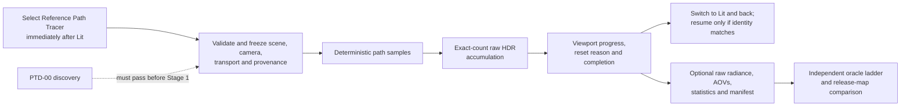

# Reference Path Tracer Feature Dossier

**Status:** feature dossier for eventual `FCR-REN-08`; its embedded acceptance contract and production implementation remain blocked until `PTD-00` ratifies the transport domain and freezes the conditional plan

**Responsibility:** keep the Reference Path Tracer's expected feature definition, acceptance criteria, runtime failure modes, evidence checks, and definition of done together under the Renderer lighting architecture

**Authority boundary:** [Research](Research.md) owns NVIDIA/AMD/Epic/neutral precedent, [`PTD-00`](Discovery.md) owns discovery and implementation authorization, [Transport And Estimator](TransportAndEstimator.md) owns the proposed mathematical contract, [Execution Architecture](ExecutionArchitecture.md) owns the proposed system boundary, [User Experience](UserExperience.md) owns the proposed human/automation workflow, the [conditional staged plan](Plan.md) owns delivery order/prompts, the [roadmap](../../../../../../../Strategy/Roadmap.md#reference-path-tracer-truth-first) owns priority, code owns implemented behavior, and the eventual [`FCR-REN-08`](../../../../../../../Acceptance/FeatureCompletionReports.md#initial-completion-report-registry) report owns results

**Current disposition:** **BLOCKED** on 2026-09-10. The target architecture and conditional delivery route are now explicit, but this document does not accept the current `ReferencePathTracer` implementation, freeze unresolved `PTD-D0` decisions, authorize Stage 1, or report executable evidence.

**Naming reconciliation:** the 2026-09-09 working-tree clean break makes `ReferencePathTracer` the sole feature name; it changes no behavior, readiness score, or evidence claim.

**Current readiness:** **20/100** — an early reference-labelled source route exists, but the transport scope, estimator, deterministic raw oracle, independence, lifecycle, parity, and executable proof are blocked. See [Current Feature Readiness](../../../../../../../Acceptance/CurrentReadiness.md#renderer).

## At A Glance

| What exists now | What completion would mean | What remains prohibited as evidence |
| --- | --- | --- |
| a GBuffer-seeded `LightingMode::ReferencePathTracer` source route, a separate generic `RenderViewMode` menu, and an external completion study | a first-class `Reference Path Tracer` viewport mode immediately after Lit, with automatic bounded accumulation, exact camera/scene invalidation, comparison retention, optional raw export, and retained proof | treating source presence, a target-SPP completion badge, converged-looking screenshot, denoised/tonemapped output, or a shared-dependency comparison as ground truth |
| feature, discovery, architecture, and conditional plan contracts | accepted `PTD-00`, a plan frozen to that report, implementation, and every conjunctive criterion passing | starting implementation or treating provisional architecture/math/coverage choices as accepted |

The product is a correctness oracle delivered primarily through a familiar viewport view mode. That interaction shape does not weaken the transport contract: raw accumulation remains independent of real-time reconstruction, denoising, display mapping, and any approximation it is intended to judge.

## Delivery Priority

The first usable milestone is the live viewport comparison loop: select Reference Path Tracer after Lit, navigate with responsive Editor or Game camera controls, see the newest camera identity restart and refine automatically, read exact sample progress, and switch to Lit and back under exact identity revalidation. The estimator beneath that loop must already satisfy the accepted PBR and transport contract; “interactive” does not excuse biased or stale output.

Raw readback and minimal provenance follow as acceptance infrastructure. Polished save, checkpoint, offscreen, and artifact-management UX are secondary and may not delay or substitute for the viewport milestone. They remain required where `AC-RPT-14`, `AC-RPT-16`, `AC-RPT-18`, `AC-RPT-19`, or final `FCR-REN-08` evidence needs them. [User Experience](UserExperience.md#product-priority-order) owns the product order; the [staged plan](Plan.md#delivery-priority) enforces it.

## Start Here

| Need | Open |
| --- | --- |
| external NVIDIA/AMD implementations, Epic viewport UX, neutral math/format foundations, and current Sparkle gaps | [Research](Research.md) |
| the blocking terminology, estimator, scope, fixture, risk, and independent-review gate | [`PTD-00` Discovery](Discovery.md) |
| exact notation, formulas, PDF measures, core algorithm, PBR material decisions, equation-to-code ledger, and mathematical failure points | [Transport And Estimator](TransportAndEstimator.md) |
| target ownership, per-view session/invalidation state, dataflow, sampler, integrator, traversal, artifact, workflow, and clean-break decisions | [Execution Architecture](ExecutionArchitecture.md) |
| viewport-first interaction, Lit comparison, Editor/Game camera reset rules, defaults, progress, state actions, export/automation, accessibility, errors, and first-use proof | [User Experience](UserExperience.md) |
| implementation order, dependencies, estimates, deletion ledger, stop rules, and ready-to-use prompts | [Staged Implementation Plan](Plan.md) |
| feature surface, binary acceptance, runtime failures, required checks, and definition of done | this dossier |

## Acceptance Identity

| Field | Required value |
| --- | --- |
| Feature | `FCR-REN-08` Reference Path Tracer |
| Discovery prerequisite | `PTD-00` `PASS` at an exact report revision |
| Planning prerequisite | [conditional `PTD-01`](Plan.md) reconciled to the exact `PTD-00 PASS` revision; no implementation starts from plan presence alone |
| North Stars | `NS-REAL`, `NS-MATH-DATA`, `NS-EVIDENCE`, `NS-OWNERSHIP`, `NS-SIMPLIFY` |
| Persona targets | `PGE-02`, `PGE-05`, `PGE-06`, `PGE-07`, `PGE-08`, `PGE-09`, `PGE-10`, `PGE-13`, `PGE-15` |
| Release dependencies | `REL-03` before implementation; `REL-04` feature closure; `PTD-03` and `REL-05` before release-map oracle use |
| Technical risks | accepted dispositions for `RISK-PTD-01` through `RISK-PTD-12` and `RISK-REL-13` |
| Result | `PASS`, `BLOCKED`, or `EXCLUDED`; no partial score or aggregate override |

## Expected First-Release Feature Set

`PTD-D0` must replace every **Expected** or **Conditional** disposition with an accepted Included/Excluded verdict. A Core row cannot be excluded while retaining an unbiased-reference claim. A Conditional row is included whenever a shipped map, public selector, or retained `v0.1.0` promise reaches it; otherwise the feature and its dependent claims must be unreachable and unadvertised. Excluded behavior may not silently fall back to an approximation inside the raw oracle.

| ID | Initial disposition | Required surface | External precedents to challenge the design |
| --- | --- | --- | --- |
| `RPT-FS-01` | Core | `RenderViewMode::ReferencePathTracer` is a first-class viewport mode immediately after Lit. Selection automatically validates and starts one bounded per-view session over canonical Scene/View generations; export and offscreen automation use the same session semantics. | `REF-UE-PT-UX`, `NV-RTX-REF`, `NV-FAL-ACC`, `AMD-CAP-PT`, `AMD-RPR-PRODUCT` |
| `RPT-FS-02` | Core | Deterministic camera rays and subpixel sampling originate from the accepted camera model without consuming a production GBuffer. Pinhole perspective is the expected minimum. | `NV-RTX-CORE`, `AMD-CAP-PT`; `NV-FAL-PT` as dependency counterexample |
| `RPT-FS-03` | Core | Frozen triangle geometry, instance transforms, barycentrics, geometric normals, UVs, winding, sidedness, visibility masks, and scene units have one documented meaning. | `NV-RAY-OFFSET`, `NV-FAL-MIN` |
| `RPT-FS-04` | Expected | Static meshes plus alpha-tested/two-sided/normal-mapped surfaces used by the release maps. Skinned and morphed meshes are sampled as immutable evaluated snapshots when retained release claims require them. | `NV-FAL-TEST`, `NV-FAL-PT` |
| `RPT-FS-05` | Core | Texture decode, color space, UV transform, filtering/LOD policy, and material parameters are identical to the accepted scene manifest and independently testable. | `NV-FAL-TEST`, `NV-RTX-CORE` |
| `RPT-FS-06` | Expected | Opaque metallic-roughness surface reflection includes diffuse, rough/specular reflection, dielectric F0, normal mapping, and emission with derived BSDF evaluation/sampling/PDF correspondence. | `NV-FAL-PT`, `NV-FAL-MIN`, `NV-OPTIX-PT` |
| `RPT-FS-07` | Expected | Environment, emissive triangles, directional, point, spot, and rectangle/area lights used by the release have frozen radiometric units, sidedness, geometry, attenuation, selection probabilities, PDFs, and visibility. | `NV-FAL-PT`, `NV-OPTIX-PT` |
| `RPT-FS-08` | Core | One derivable estimator accounts for BSDF and light strategy selection, NEE, emission/environment hits, MIS or an explicitly disjoint alternative, delta events if included, rejected samples, and zero-probability cases without double counting. | `NV-FAL-PT`, `NV-FAL-MIN`, `NV-RTG2-REF`, `AMD-CAP-PT`, `REF-VEACH`, `REF-PBRT-PT` |
| `RPT-FS-09` | Core | Full-integral or finite-path target is named exactly. Russian roulette is compensated. Deterministic bounce/distance limits, clamps, filters, biased MIP choices, and approximate caches are absent from raw full-integral output or explicitly bound a differently named target. | `NV-RTX-REF`, `NV-FAL-PT`, `NV-OPTIX-PT` |
| `RPT-FS-10` | Core | Stable session/pixel/sample/dimension identity is independent of presentation frame timing, scheduling, and view-mode switches; Lit comparison suspension, restart, and accepted checkpoint/resume preserve an exact prefix only when the full digest matches. | `REF-UE-PT-UX`, `NV-RTX-REF`, `NV-FAL-PT` |
| `RPT-FS-11` | Core | Robust primary, continuation, and connection-ray endpoints use justified reconstruction/transform/traversal error bounds; geometric and shading-normal roles are explicit. | `NV-RAY-OFFSET`, `NV-FAL-TEST` |
| `RPT-FS-12` | Core | Raw per-view accumulation has a justified precision/summation policy, exact committed/target counts, explicit reset reason, complete Editor/Game camera and radiance-input invalidation, presentation/scheduling non-invalidation, comparison suspension, overflow/checkpoint/partial semantics, and atomic completion. | `REF-UE-PT-UX`, `NV-FAL-ACC`, `NV-RTX-REF` |
| `RPT-FS-13` | Core | Scene-linear HDR radiance, required AOVs, per-pixel/sample statistics, ray/path counts, invalid/rejection/cap counters, and immutable provenance are exported separately from previews at the exact session extent/precision. This is required for oracle evidence, not the primary daily viewport route. | `NV-FAL-PT`, `NV-FAL-ERR`, `AMD-RPR-PRODUCT`, `REF-OPENEXR` |
| `RPT-FS-14` | Core | Analytic, metamorphic, minimal-reviewable, independent-renderer, statistical, lifecycle, backend, and controlled-failure evidence form one oracle ladder. | `NV-FAL-MIN`, `NV-FAL-ERR`, `NV-FAL-TEST`, `NV-RTX-REG` |
| `RPT-FS-15` | Core | Strict requested-versus-active D3D12/Vulkan behavior, capability rejection, native validation, deterministic target completion, viewport progress/reset/unavailable states, pause/restart/cancellation, timeout, cleanup, single-active-view capacity, and bounded CPU/GPU memory/disk/time are proven. | `REF-UE-PT-UX`, `NV-RTX-CORE`, `NV-RTX-REF`, `AMD-CAP-PT`, `AMD-RR`, `AMD-BAIKAL` |
| `RPT-FS-16` | Expected | Accepted raw references, convergence/uncertainty, provenance, and dependency-independence statements exist for every applicable release-map camera before the tracer judges real-time PBR or artifacts. | `NV-FAL-ERR`, `NV-FAL-TEST`; NVIDIA images are not Sparkle thresholds |
| `RPT-FS-17` | Conditional | Depth of field, motion blur, orthographic/panoramic cameras, animated-time integration, extra geometry classes, or procedural materials are included only when `PTD-D0` and release scope retain them. | `NV-FAL-PT`, `NV-RTX-CORE` as feature precedents only |
| `RPT-FS-18` | Excluded by default | Physical transmission, nested dielectrics, participating media, physical BSSRDF/subsurface transport, spectral transport, and an unrestricted caustics claim remain outside the first oracle unless discovery expands the domain and all associated criteria/checks. | `NV-FAL-PT`, `NV-FAL-TEST`, `NV-RTX-CORE`, `NV-OPTIX-PT` as future scope checklists |
| `RPT-FS-19` | Prohibited in raw oracle | ReSTIR/RTXDI, stable planes, denoising, neural reconstruction, temporal reconstruction, contribution/firefly clamps, tone mapping, exposure, gamut/output encoding, and screenshot quantization may produce separately labeled diagnostics or previews but never raw truth. | `NV-RTX-REF`, `NV-RTX-REG` |

## Acceptance Criteria

Every row is binary and must retain its named evidence. Exact numeric tolerances, matrices, sample counts, and resource budgets are frozen by accepted `PTD-00` artifacts before the conditional plan is accepted or Stage 1 begins; an unset or post-hoc value keeps the criterion blocked.

| ID | Pass criterion | Required evidence | Failure condition |
| --- | --- | --- | --- |
| `AC-RPT-01` | The public name and manifest state the exact Reference Path Tracer, unbiased, finite/full, and convergence claims plus every included/excluded `RPT-FS-*` row. | signed scope/terminology/transport-domain manifest and selector audit | A reachable behavior or comparison can exceed the stated domain. |
| `AC-RPT-02` | An intended user finds `Reference Path Tracer` immediately after Lit, selects it to validate/start automatically, observes the newest view accumulating live with exact progress/reset/completion, moves both Editor and Game cameras responsively, stops and sees automatic refinement, compares by switching Lit and back, and pauses/restarts without an IDE, CVar choreography, save step, or mandatory wizard. | clean first-use transcript; view-mode order; Editor/Game camera-motion, post-motion refinement, and Lit-switch state traces; frozen camera-response budget; progress/accessibility matrix; budgets and support diagnostics | The normal workflow requires private setup/manual Start, freezes or retains a stale composition while navigating beyond budget, requires manual restart after motion, loses or wrongly preserves a prefix, hides a reset/blocker, exposes the tool in Shipping consumer first run, or treats target SPP/preview as convergence or accepted evidence. |
| `AC-RPT-03` | Primary camera rays reproduce the accepted camera and sampling model independently of production GBuffer data. | analytic ray fixtures, subpixel sequence record, edge/corner/center rays, and camera-transform cases | A GBuffer/raster defect can enter the oracle before the first trace or camera samples repeat/shift unexpectedly. |
| `AC-RPT-04` | Every committed prefix has complete immutable identity for camera, geometry, transforms, deformation, materials, textures, lights, environment, units, shaders, and backend inputs; any contributing mutation invalidates before new samples mix. | hashed manifest plus Editor/Game camera, scene mutation, continuous animation, reload, mode-switch, and invalidation-reason matrix | Any contributing input is absent from identity, can change inside a prefix, or creates blended/streaked history. |
| `AC-RPT-05` | Primary/secondary intersection, barycentrics, transforms, sidedness, alpha, visibility, and geometric-normal behavior match analytic fixtures for every included geometry row. | analytic hit/visibility records and adversarial transform matrix | A miss/hit, interpolation, orientation, or alpha result lacks a defect-detecting oracle. |
| `AC-RPT-06` | Texture and material decoding matches the frozen color-space, UV, filtering/LOD, normal-map, metallic-roughness, F0, and emission contract. | CPU/analytic decode cases, raw AOVs, and independent scene comparisons | Display-space data, inconsistent LOD, or production-only decode can mask a material defect. |
| `AC-RPT-07` | Each included BSDF lobe has matching evaluation, sampling, PDF measure, event classification, energy behavior, and limiting-case evidence. | reviewed derivation, normalization/reciprocity/white-furnace or applicable energy cases, and per-event logs | Sample/eval/PDF disagree, invalid values are hidden, or an included lobe has no mathematical contract. |
| `AC-RPT-08` | Every included light/environment/emissive path has frozen units, geometry, sidedness, attenuation, selection/PDF conversion, visibility endpoints, and analytic energy evidence. | per-light analytic fixtures and hand-computable results | A light is counted twice, unreachable, sampled with the wrong measure, or only visually plausible. |
| `AC-RPT-09` | The implemented estimator has a one-to-one reviewed correspondence with every accepted `MATH-*` row in [Transport And Estimator](TransportAndEstimator.md), including NEE/MIS, emission, environment, selection probabilities, measures, rejection, and zero/delta cases. | completed equation-to-code ledger, independent math/numeric review, path-event traces, hand cases, and fault injections | Any code term lacks a derivation term, any derivation term lacks code, or an injected mismatch survives. |
| `AC-RPT-10` | Termination preserves the named target: compensated Russian roulette behaves statistically, and every deterministic cutoff/biasing option is absent, disabled, or changes the output label/domain. | termination derivation, tail/path-length statistics, switch audit, and bias injection cases | Raw full-integral output uses an undeclared cap, clamp, biased MIP/filter, cache, or approximate stop. |
| `AC-RPT-11` | Sample identity is reproducible and non-overlapping across frames, scheduling, backend execution order, cancellation, restart, and accepted resume. | sequence specification, dimension ledger, repeat/prefix/resume/correlation results, and stream version | Samples repeat, skip, alias dimensions, or silently change identity. |
| `AC-RPT-12` | Ray spawn and connection endpoints remain correct across the declared scale, translation, rotation, nonuniform scale, shear, mirror, grazing, adjacent/coplanar, thin-gap, and normal-map matrix. | numeric derivation plus D3D12/Vulkan analytic visibility results | Acne, detached shadows, missed nearby geometry, leaks, or per-scene epsilon tuning occurs. |
| `AC-RPT-13` | Accumulation equals a higher-precision oracle within predeclared error at all required counts and after every camera/scene/configuration reset, target-SPP update, presentation-only change, Lit suspension/return, resize, overflow, pause, restart, and accepted checkpoint/resume transition. | precision study, classified invalidation matrix, Editor/Game and view-switch state traces, exact committed/target counts, reset reasons, and partial/atomic artifact checks | Stale, mixed, needlessly discarded, rounded, overflowed, duplicated, skipped, or partial samples can appear complete. |
| `AC-RPT-14` | Raw scene-linear HDR and diagnostics are exported atomically with hashes and complete provenance before exposure, filtering, denoising, tone mapping, encoding, or screenshot conversion. | raw artifact/schema inspection, provenance mutation checks, and separately labeled preview | A presentation operation changes the comparison source or identity is incomplete. |
| `AC-RPT-15` | Minimal diagnostics expose enough evidence to detect estimator/numeric failure without adding a second diagnostics subsystem. | variance/standard-error, ray/path-length, invalid/negative/rejection/cap counters and event/AOV samples | A discarded or invalid contribution can disappear without affecting a retained counter or diagnostic. |
| `AC-RPT-16` | Analytic, metamorphic, minimal, external, and statistical evidence agree within predeclared uncertainty for every included feature; each shared dependency has another oracle. | oracle/dependency matrix, equivalence manifests, independent replicates, regional metrics, convergence curves, and disagreements | One implementation, one seed, one SPP, one image average, or one shared dependency is the sole authority. |
| `AC-RPT-17` | D3D12 and Vulkan strict routes report requested/active capability truth, pass native validation, and agree within declared numeric/statistical tolerance for the same session identity. | paired manifests/raw outputs/diagnostics and native validation records | Silent fallback, unexplained validation output, or unexplained backend divergence remains. |
| `AC-RPT-18` | Every controlled invalid input, unsupported capability, timeout, cancellation, device loss, OOM, disk-full, corrupt checkpoint, and export failure reaches the declared safe state and support-visible result within budget. | injected-failure matrix with cleanup, exit/result codes, retained diagnostics, and recovery | The process hangs/crashes unsafely, emits a plausible complete artifact, leaks state, or destroys the last valid result. |
| `AC-RPT-19` | Every applicable release-map camera passes raw reference convergence and uncertainty gates; PBR/material/light/debug comparisons name an independent defect-detecting oracle and reviewed artifact crops. | `PTD-03`, `MAP-A` through `MAP-H` evidence, full frames, crops, statistics, and failure gallery | Any visible artifact is unexplained, any oracle is outside its domain, or the map verdict rests on a preview/denoised image. |
| `AC-RPT-20` | One Renderer-owned per-view session, one sample/accumulation authority, one `RenderViewMode::ReferencePathTracer` selector, one raw export contract, complete build/package membership, and clean removal of the duplicate `LightingMode::ReferencePathTracer` authority remain. | ownership/copy/deletion/build/package/menu-order audit and `FCR-REN-08` review | Old/new estimators, duplicate selectors/session truth, hidden Lit-setting mutation, compatibility adapters, orphan settings, or misleading public authority remains. |

## Runtime Failure Modes

| ID | Cause or controlled injection | Required detection and safe behavior | Covering check |
| --- | --- | --- | --- |
| `FM-RPT-01` | Ambiguous or overbroad “unbiased/reference/ground truth” label. | Manifest/selector review blocks the session/export or narrows the label before evidence use. | `CHK-RPT-01` |
| `FM-RPT-02` | Subject and oracle share a faulty camera, hit, material, BSDF, light, traversal, accumulation, or display dependency. | Dependency fault injection survives neither the analytic/minimal nor external layer; otherwise the claim narrows. | `CHK-RPT-06`, `CHK-RPT-11` |
| `FM-RPT-03` | Production GBuffer, temporal history, or reconstructed signal enters primary transport. | Graph/resource trace rejects the route; no candidate artifact is emitted as raw reference. | `CHK-RPT-03`, `CHK-RPT-10` |
| `FM-RPT-04` | Included geometry/material/texture/alpha/sidedness/deformation semantics differ from the frozen manifest. | Focused fixtures identify the exact row; unsupported content is rejected or the feature remains blocked. | `CHK-RPT-03`, `CHK-RPT-04` |
| `FM-RPT-05` | Missing/duplicated selection probability, PDF/Jacobian, MIS weight, emission/environment term, NEE contribution, delta handling, or roulette compensation. | Equation-to-code and analytic fault checks fail the estimator; no beauty image can override them. | `CHK-RPT-04`, `CHK-RPT-05` |
| `FM-RPT-06` | Bounce/distance truncation, firefly/contribution clamp, biased environment MIP, denoiser, cache, or approximate stop contaminates raw output. | Configuration/provenance detects the switch and rejects or relabels the artifact. | `CHK-RPT-05`, `CHK-RPT-10` |
| `FM-RPT-07` | Frame timing, queue ordering, backend, interruption, or resume repeats/skips samples or aliases dimensions. | Sample protocol reports the first divergent/duplicate identity and invalidates the session prefix. | `CHK-RPT-07` |
| `FM-RPT-08` | Fixed or incorrect ray offset causes self-hit acne, peter-panning, missed thin geometry, or light leaks. | Analytic robustness fixtures fail on the exact transform/scale case; per-scene tuning is rejected. | `CHK-RPT-08` |
| `FM-RPT-09` | Editor/Game camera change, scene/configuration mutation, continuous animation, resize, mode switch, reload, overflow, or precision loss leaves stale/mixed accumulation; or display/scheduling-only changes discard valid work. | Canonical identity classifies reset/resume/non-reset before commit, exposes the first reason and discarded prefix, and preserves exact count/error. | `CHK-RPT-09` |
| `FM-RPT-10` | Exposure, filtering, denoising, tone mapping, gamut/encoding, screenshot conversion, or lossy format enters comparison data. | Raw/preview lineage audit rejects the artifact before comparison. | `CHK-RPT-10` |
| `FM-RPT-11` | Noise falls while the mean is wrong, correlation mimics stability, or an average hides a local defect. | Replicate/region/convergence/fault protocol returns `FAIL` or `Inconclusive`; thresholds are never tuned post hoc. | `CHK-RPT-11` |
| `FM-RPT-12` | Falcor/RTXPT/OptiX/Capsaicin or another external comparison differs in camera, units, light shape, material model, texture decode, path domain, or output transform. | Equivalence manifest blocks the comparison as `Inconclusive`; no side is declared correct from the image alone. | `CHK-RPT-06` |
| `FM-RPT-13` | D3D12/Vulkan capability, compiler, validation, or numeric behavior diverges or silently falls back. | Requested/active result and native diagnostics identify the affected backend; it is repaired or excluded explicitly. | `CHK-RPT-12` |
| `FM-RPT-14` | Timeout, cancellation, TDR/device removal, OOM, disk full, invalid input, or corrupt checkpoint. | The affected session/export reaches its declared bounded terminal state, keeps actionable diagnostics, cleans owned resources, and preserves prior valid evidence. | `CHK-RPT-13` |
| `FM-RPT-15` | Export interruption or process failure leaves a plausible partial/corrupt artifact. | Atomic publish with completion marker/hash prevents candidate discovery; cleanup/recovery is deterministic. | `CHK-RPT-09`, `CHK-RPT-10`, `CHK-RPT-13` |
| `FM-RPT-16` | A release map shows persistent noise, fireflies, acne, leaks, missing/double light, wrong energy/color/normal/roughness, banding, NaN/Inf, or a temporal seam. | Frozen camera/region evidence fails and maps the symptom to an estimator/material/light/numeric/accumulation owner. | `CHK-RPT-14` |
| `FM-RPT-17` | Intended user cannot find Reference Path Tracer immediately after Lit, selection needs setup ceremony, navigation freezes or shows a stale composition, post-motion refinement needs manual restart, progress/reset/completion is ambiguous, Lit comparison loses or wrongly resumes work, secondary save/support is undiscoverable, or the tool leaks into Shipping consumer first run. | First-use workflow fails with an actionable result rather than private setup or silent no-op; menu, live camera, comparison, accessibility, secondary export, and Shipping reachability audits reject the defect. | `CHK-RPT-15` |
| `FM-RPT-18` | Current GBuffer-seeded `LightingMode` reference and new `RenderViewMode` session remain competing authorities, or compatibility/fallback code hides selection. | Ownership/build/selector audit blocks completion until the view mode directly selects one camera-ray estimator/session and all duplicate authority is removed. | `CHK-RPT-16` |
| `FM-RPT-19` | An excluded camera/material/light/geometry behavior remains reachable in a release map or public selector. | Scope and map audit rejects the content/selector or reopens discovery; unsupported output is never treated as reference. | `CHK-RPT-01`, `CHK-RPT-14` |

## Required Checks And External-Reference Use

Each executed check follows the [check and test design contract](../../../../../../../Engineering/Verification/ValidationAndEvidence.md#check-and-test-design-contract). NVIDIA, AMD, and neutral sources provide precedent or an external comparison, never the expected value by name alone.

| Check | Claims and failures falsified | Minimum oracle/action and retained artifact | External precedents used |
| --- | --- | --- | --- |
| `CHK-RPT-01` scope/claim audit | `AC-RPT-01`; `FM-RPT-01`, `FM-RPT-19` | Reconcile manifest, every `RPT-FS-*` verdict, public selectors, release maps, docs, and output labels; retain unmatched search and signed decision. | `NV-RTX-REF` negative-control vocabulary |
| `CHK-RPT-02` view-session identity | `AC-RPT-02`, `AC-RPT-04`; `FM-RPT-17` | First select the viewport mode and exercise equivalent Editor/Game identities, live camera movement, post-motion refinement, every identity mutation, Lit switch/back, and pause/restart/resume while verifying automatic start, exact digest/prefix, reset reason, response budgets, and visible state. Later prove an equivalent offscreen intent without changing the viewport contract. | `REF-UE-PT-UX`, `NV-RTX-REF`, `NV-FAL-ACC` |
| `CHK-RPT-03` camera/geometry route | `AC-RPT-03`, `AC-RPT-05`; `FM-RPT-03`, `FM-RPT-04` | Analytic center/edge/corner camera rays and triangle hit/miss/barycentric/sidedness/alpha/transform cases, with production GBuffer disconnected. | `NV-RTX-CORE`, `NV-FAL-MIN`, `NV-RAY-OFFSET` |
| `CHK-RPT-04` material/BSDF contract | `AC-RPT-06`, `AC-RPT-07`; `FM-RPT-04`, `FM-RPT-05` | CPU/hand decode, sample/eval/PDF, normalization, limiting, normal-map, alpha, furnace/energy, and per-event comparisons for every included material row. | `NV-FAL-PT`, `NV-FAL-MIN`, `NV-FAL-TEST`, `NV-OPTIX-PT` |
| `CHK-RPT-05` light/estimator derivation | `AC-RPT-08`, `AC-RPT-09`, `AC-RPT-10`; `FM-RPT-05`, `FM-RPT-06` | Hand-computable light/unit/PDF/visibility cases plus equation-to-code tracing and injected selection/MIS/emission/roulette/cutoff errors. | `NV-FAL-PT`, `NV-FAL-MIN`, `NV-RTX-REF`, `NV-OPTIX-PT` |
| `CHK-RPT-06` independent-oracle comparison | `AC-RPT-16`; `FM-RPT-02`, `FM-RPT-12` | Render tiny interchange scenes in Sparkle, pinned Falcor Minimal, then Falcor PathTracer/Capsaicin and Mitsuba scalar RGB as applicable after camera/material/light/output equivalence; retain raw files, hashes, manifests, and disagreements. | `NV-FAL-MIN`, `NV-FAL-PT`, `AMD-CAP-PT`, `REF-MITSUBA`, `NV-LICENSE`, `AMD-LICENSE` |
| `CHK-RPT-07` sample-stream protocol | `AC-RPT-11`, `AC-RPT-16`; `FM-RPT-07` | Repeat, prefix, distribution, dimension, correlation, reorder, interruption, backend, and resume tests with stable sample IDs and predeclared statistics. | `NV-RTX-REF`, `NV-FAL-PT` |
| `CHK-RPT-08` ray-robustness matrix | `AC-RPT-12`; `FM-RPT-08` | Re-derive the spawn/end-point bound and exercise scale/translation/rotation/shear/mirror/grazing/coplanar/thin-gap/normal-map cases on both APIs. | `NV-RAY-OFFSET`, `NV-FAL-TEST` |
| `CHK-RPT-09` accumulation and invalidation lifecycle | `AC-RPT-13`; `FM-RPT-09`, `FM-RPT-15` | Compare required sample-prefix sums/means to a higher-precision oracle through every Editor/Game camera field, scene generation, continuous animation, target-SPP, presentation/scheduling-only change, Lit switch/return, resize, overflow, pause, restart, checkpoint, and atomic-completion transition. | `REF-UE-PT-UX`, `NV-FAL-ACC`, `NV-RTX-REF` |
| `CHK-RPT-10` raw artifact/provenance | `AC-RPT-14`, `AC-RPT-15`; `FM-RPT-03`, `FM-RPT-06`, `FM-RPT-10`, `FM-RPT-15` | Trace radiance and diagnostics to immutable linear-HDR artifacts, mutate provenance, enable every forbidden presentation/bias switch, and require separation or rejection. | `NV-FAL-PT`, `NV-FAL-ERR`, `NV-RTX-REF`, `NV-RTX-REG` |
| `CHK-RPT-11` statistical convergence | `AC-RPT-16`; `FM-RPT-02`, `FM-RPT-11` | Independent replicates, analytic means, sequence prefixes, regional error/uncertainty and injected bias/correlation/local-defect cases under predeclared stop rules. | `NV-FAL-ERR`, `NV-FAL-TEST`; extend beyond their simple image averages |
| `CHK-RPT-12` backend/native validation | `AC-RPT-17`; `FM-RPT-13` | Identical D3D12/Vulkan manifests, strict capability requests, native validation, compiler/settings identity, raw numeric/statistical comparison, and unsupported-route check. | `NV-RTX-CORE` |
| `CHK-RPT-13` controlled failure/resources | `AC-RPT-18`; `FM-RPT-14`, `FM-RPT-15` | Inject invalid input, unsupported capability, timeout, cancel, device loss/TDR, OOM, disk-full, corrupt checkpoint, and export failure; retain bounded state/cleanup/recovery evidence. | `NV-FAL-ACC`, `NV-RTX-REF` lifecycle precedent only |
| `CHK-RPT-14` release-map truth | `AC-RPT-19`; `FM-RPT-16`, `FM-RPT-19` | For every applicable frozen camera, retain converged raw HDR, uncertainty, full frame/crops, artifact checklist, dependency oracle, and subject comparison under `MAP-A` through `MAP-H`. | `NV-FAL-TEST` decomposition; no NVIDIA image threshold reuse |
| `CHK-RPT-15` staged adopter workflow | `AC-RPT-02`, `AC-RPT-18`, `AC-RPT-20`; `FM-RPT-17` | First prove the clean DevelopmentEditor path from the item immediately after Lit through automatic start, live newest-camera presentation, rapid/continuous navigation, automatic post-motion refinement, exact progress/reset/completion, Lit comparison/resume, pause/restart, accessibility, support, and Shipping exclusion without requiring save. Then extend the retained workflow evidence to secondary save, approved Game/offscreen, read-only-install, and Unicode-path routes. | `REF-UE-PT-UX` interaction precedent only; no external result is the product oracle |
| `CHK-RPT-16` ownership/clean-break review | `AC-RPT-20`; `FM-RPT-18` | Inspect View/Renderer owners, producers/consumers, lifetime, build/package membership, exact menu order, `RenderViewMode` versus `LightingMode` selectors, Lit-setting preservation, copies, old route, aliases/fallbacks, docs, and generated artifacts; retain deletion/preservation ledger. | `NV-RTX-CORE` separation precedent only |

## Definition Of Done

`FCR-REN-08` is **Done** only when all statements below are simultaneously true at the exact release-candidate revision:

1. `PTD-00` is `PASS`, the transport/domain/feature matrix is frozen, and the accepted `PTD-01` plan has been completed without unresolved architecture-shaping work.
2. Every Core row and every row ratified Included by `PTD-D0` has a separate `PASS`; every row ratified Excluded is unreachable, unadvertised, and absent from release-map oracle claims.
3. `AC-RPT-01` through `AC-RPT-20` pass with retained revision-, backend-, configuration-, scene-, camera-, shader-, asset-, seed-, sample-, and artifact-identifiable evidence.
4. Every applicable `FM-RPT-01` through `FM-RPT-19` has been deliberately exercised and reaches the required detection boundary, safe state, cleanup, user-visible result, and recovery.
5. Every `RISK-PTD-*` treatment and `RISK-REL-13` has an owner and observable retirement evidence; no Critical/High exposure is waived by visual plausibility.
6. The estimator derivation and implementation correspond; raw output contains no undeclared deterministic truncation, clamp, biased environment MIP/filter, denoiser, temporal reconstruction, exposure, tone map, encoding, or screenshot conversion.
7. Analytic/minimal/independent/statistical evidence supports the bounded oracle claim. All disagreements are resolved or explicitly `Inconclusive`; no shared dependency or external renderer label is treated as universal ground truth.
8. D3D12 and Vulkan pass their advertised strict matrices or the unsupported backend is explicitly excluded from the release claim and selector. There is no silent fallback.
9. The staged DevelopmentEditor/source-adopter workflow first proves the primary viewport loop: Reference Path Tracer appears immediately after Lit, starts automatically, stays responsive during Editor/Game camera navigation, presents the newest accepted identity within budget, refines automatically when motion stops, reports exact progress/reset/completion, invalidates every camera/radiance change before mixing, and preserves only exact-identity Lit comparisons. Separately, its evidence workflow saves exact-session-resolution atomic raw artifacts. Shipping consumer first run remains free of the tool unless scope explicitly admits it. Reference accumulation has declared camera-response/time/VRAM/disk/cancellation budgets; it is not required to meet the interactive 30 FPS target.
10. `PTD-03` supplies accepted raw references and uncertainty for every applicable shipped example-map camera, and `MAP-A` through `MAP-H` have no unexplained artifact or PBR discrepancy within the oracle's domain.
11. One per-view production authority remains, `RenderViewMode::ReferencePathTracer` directly selects it, the duplicate `LightingMode::ReferencePathTracer`/frame-history authority is removed, Lit settings remain untouched, and implementation/header/CMake/package/selector/documentation membership agree.
12. The signed `FCR-REN-08` report records exact commands/results, unavailable evidence, residual limitations, invalidation triggers, and a final `PASS`. Source presence, a clean image, high SPP, or an aggregate score cannot substitute for any row.

Until then the feature state is **BLOCKED**, or **EXCLUDED** if release scope removes the route and every dependent oracle claim.
