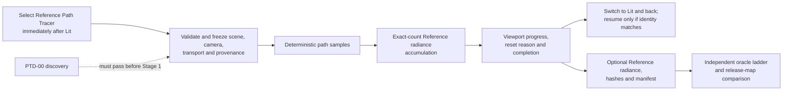

# Reference Path Tracer Feature Dossier

**Status:** feature dossier for eventual `FCR-REN-08`; `PTD-00-R1 PASS` freezes discovery, Stages 1-2 pass their selector/frame gates, and Stages 3-9 are **IMPLEMENTED / VALIDATION DEFERRED** with their current-candidate GPU, interaction, artifact, and oracle evidence retained for later execution

**Responsibility:** keep the Reference Path Tracer's expected feature definition, acceptance criteria, runtime failure modes, evidence checks, and definition of done together under the Renderer lighting architecture

**Authority boundary:** [Research](Research.md) owns NVIDIA/AMD/Epic/neutral precedent, [`PTD-00`](Discovery.md) owns discovery and implementation authorization, [Transport And Estimator](TransportAndEstimator.md) owns the proposed mathematical contract, [Execution Architecture](ExecutionArchitecture.md) owns the proposed system boundary, [User Experience](UserExperience.md) owns the proposed interactive/manual-output workflow, the [conditional staged plan](Plan.md) owns delivery order/prompts, the [roadmap](../../../../../../../Strategy/Roadmap.md#reference-path-tracer-truth-first) owns priority, code owns implemented behavior, and the eventual [`FCR-REN-08`](../../../../../../../Acceptance/FeatureCompletionReports.md#initial-completion-report-registry) report owns results

**Current disposition:** Stage 9 is **IMPLEMENTED / VALIDATION DEFERRED** against source input `df2f0c0658cbf1cbdc0355c050a496cb513709e5` plus the scoped Stage-9 refinement working tree and manual-only clean break. `PTD-00-R1 PASS` remains the accepted development contract; `PTD-01-R2 PASS` and `PTD-02-R0 PASS` retain the selector/ownership and host-agnostic alternate-frame gates. The ordinary request selects one mode for Editor `Scene` and runtime `Game` views. The private feature owns transport, exact prefix accumulation, identity invalidation, Lit suspension/retention, capability/capacity policy, and operational actions. Inline and native Pipeline entry adapters invoke one shared Reference kernel through one semantic scene-trace API. Stage 9 publishes generic `Radiance` plus exact Reference sample-prefix metadata through the existing capture route; ApplicationEditor shares image encoding, atomic bundle publication, and task mechanics while the feature retains EXR channel choice, checkpoint/manifest schema, and prefix intent. Capture and publication are initiated explicitly from the viewport UI; no command-line or hidden-render route remains. The current `DevelopmentEditor` C++ candidate compiled and linked before this clean break; no post-clean-break build, shader cook, GPU run, interactive camera workflow, artifact round trip, accessibility pass, lifecycle matrix, response-budget measurement, raw GPU analytic/statistical/robustness comparison, controlled shader-fault result, backend/frontend comparison, or Shipping exclusion proof has occurred. Those checks retain zero executable-readiness credit, and Reference-authority claims remain unavailable until real evidence passes.

**Naming reconciliation:** the 2026-09-09 working-tree clean break makes `ReferencePathTracer` the sole feature name. The 2026-09-19 product pass names the display-ready output `FinalColorLdr`, the producer-neutral scene-linear outputs `Radiance` and optional `RadianceSecondMoment`, and optional progressive identity/count metadata `RenderProductSamplePrefix`. Lit and Reference publish through the same contract; Reference-specific estimator, checkpoint, and oracle policy stays in this feature. This changes no readiness score or evidence claim.

**Current readiness:** **50/100 (`45/5/0/0`)**. The original-frame alternate recipe has canonical camera rays, stateless Philox identity, the included reflective estimator, accepted content semantics, robust endpoints, the Stage-6 GPU session/transactional accumulator, the Stage-7 selectable viewport/control projection, the Stage-8 shared Inline/Pipeline source routes, and the Stage-9 manual radiance-publication route. It has not been shader-cooked or exercised on a GPU; measured runtime transitions, artifact integrity, interaction/accessibility, backend/frontend parity, performance, packaging, and accepted-reference authority remain absent. The earlier focused build does not change the readiness score. See [Current Feature Readiness](../../../../../../../Acceptance/CurrentReadiness.md#renderer).

## At A Glance

| What exists now | What completion would mean | What remains prohibited as evidence |
| --- | --- | --- |
| one per-view `RenderViewMode::ReferencePathTracer` selector, one alternate middle-frame setup, one internal GPU implementation of the included reflective estimator and transactional accumulation, and a selectable Editor menu/overlay with exact operational progress/actions; the former GBuffer-seeded `LightingMode`, global selector CVar/cache, Editor mirror enum, and target/show-flag split are removed | proven automatic bounded accumulation for Editor and Game/runtime hosts, exact camera/scene invalidation, comparison retention, optional raw export, and retained evidence | spreading path-tracer contracts through generic engine state, retaining duplicate selector authority, forking behavior by host/View kind, treating source presence, an unmeasured row quantum, compiled transport, a separate arithmetic reconstruction, target-SPP completion badge, converged-looking screenshot, denoised/tonemapped output, or a shared-dependency comparison as ground truth |
| feature, discovery, architecture, and conditional plan contracts | accepted `PTD-00`, a plan frozen to that report, implementation, and every conjunctive criterion passing | starting implementation or treating provisional architecture/math/coverage choices as accepted |

The product is a correctness oracle delivered primarily through a familiar viewport view mode. That interaction shape does not weaken the transport contract: raw accumulation remains independent of real-time reconstruction, denoising, display mapping, and any approximation it is intended to judge.

The implementation remains part of the original Sparkle frame. `FramePipeline::BuildRenderFrameGraph` calls the ordinary `AddSceneRenderingPasses` composition function; it selects `RenderViewMode::ReferencePathTracer` and invokes either `AddRealTimePathTracerPasses` or the feature-local `AddReferencePathTracerPasses`. Shared exposure, optional scene denoising, and selected presentation upscaling are declared in order after that branch; Reference bypasses the Lit denoiser without changing the upscaler. `ReferencePathTracerSession` is the persistent accumulation/lifecycle owner; there is no forwarding `ReferencePathTracer` facade, class-shaped graph stage, recipe hierarchy, graph factory, feature dependency bag, selector CVar, Editor mirror enum, or target/show-flag translation. Everything around the middle—frame admission, Scene/View ownership, ray-tracing-scene publication, frame-graph execution, RHI, viewport publication, host UI when present, and presentation—is shared. Editor `Scene` and runtime `Game` identify ordinary View producers; either submits the same Renderer mode and neither creates a separate estimator. The Stage-1 deletion removed the old GBuffer-seeded approximation so the correct independent middle could be built in Stages 2 through 6; the one-mode clean break removed transitional selectors, and Stage 7 adds the ordinary Editor selection and operational overlay without changing the frame architecture.

## Delivery Priority

The first usable milestone is the live viewport comparison loop: select Reference Path Tracer after Lit, navigate with responsive Editor or Game camera controls, see the newest camera identity restart and refine automatically, read exact sample progress, and switch to Lit and back under exact identity revalidation. The estimator beneath that loop must already satisfy the accepted PBR and transport contract; “interactive” does not excuse biased or stale output.

Generic `Radiance` readback with the Reference producer's exact sample-prefix metadata follows as acceptance infrastructure. Polished manual save, checkpoint, and artifact-management UX are secondary and may not delay or substitute for the viewport milestone. They remain required where `AC-RPT-14`, `AC-RPT-16`, `AC-RPT-18`, `AC-RPT-19`, or final `FCR-REN-08` evidence needs them. [User Experience](UserExperience.md#product-priority-order) owns the product order; the [staged plan](Plan.md#delivery-priority) enforces it.

## Start Here

| Need | Open |
| --- | --- |
| external NVIDIA/AMD implementations, Epic viewport UX, neutral math/format foundations, and current Sparkle gaps | [Research](Research.md) |
| the blocking terminology, estimator, scope, fixture, risk, and independent-review gate | [`PTD-00` Discovery](Discovery.md) |
| exact notation, formulas, PDF measures, core algorithm, PBR material decisions, equation-to-code ledger, and mathematical failure points | [Transport And Estimator](TransportAndEstimator.md) |
| target ownership, per-view session/invalidation state, dataflow, sampler, integrator, traversal, artifact, workflow, and clean-break decisions | [Execution Architecture](ExecutionArchitecture.md) |
| viewport-first interaction, Lit comparison, Editor/Game camera reset rules, defaults, progress, state actions, manual export, accessibility, errors, and first-use proof | [User Experience](UserExperience.md) |
| exact Stage-1 production-file hook ledger, executed commands, generated-product identities, independent reviews, and evidence limits | [Stage 1 Evidence](Stage1Evidence.md) |
| Stage-8 shared traversal ownership, one-kernel route, frame trace, and deferred backend/frontend evidence | [Stage 8 Source Evidence](Stage8SourceEvidence.md) |
| Stage-9 raw publication ownership, TinyEXR decision, manual-only clean break, and deferred oracle/artifact evidence | [Stage 9 Source Evidence](Stage9SourceEvidence.md) |
| implementation order, dependencies, estimates, deletion ledger, stop rules, and ready-to-use prompts | [Staged Implementation Plan](Plan.md) |
| feature surface, binary acceptance, runtime failures, required checks, and definition of done | this dossier |

## Acceptance Identity

| Field | Required value |
| --- | --- |
| Feature | `FCR-REN-08` Reference Path Tracer |
| Discovery prerequisite | `PTD-00` `PASS` at an exact report revision |
| Planning prerequisite | [conditional `PTD-01`](Plan.md) reconciled to the exact `PTD-00 PASS` revision; no implementation starts from plan presence alone |
| North Stars | `NS-REAL`, `NS-MATH-DATA`, `NS-EVIDENCE`, `NS-OWNERSHIP`, `NS-SIMPLIFY` |
| Persona targets | `PGE-02`, `PGE-05`, `PGE-06`, `PGE-07`, `PGE-08`, `PGE-09`, `PGE-10`, `PGE-13`, `PGE-15` |
| Release dependencies | none for development Stages 1-9 after immutable `PTD-00-R1 PASS`; `REL-03` plus release/support inputs before Stage 10 and `FCR-REN-08` release closure; `PTD-03`/`REL-05` before release-map oracle use |
| Technical risks | accepted dispositions for `RISK-PTD-01` through `RISK-PTD-12` and `RISK-REL-13` |
| Result | `PASS`, `BLOCKED`, or `EXCLUDED`; no partial score or aggregate override |

## Expected First-Release Feature Set

`PTD-D0` must replace every **Expected** or **Conditional** disposition with an accepted Included/Excluded verdict. A Core row cannot be excluded while retaining an unbiased-reference claim. A Conditional row is included whenever a shipped map, public selector, or retained `v0.1.0` promise reaches it; otherwise the feature and its dependent claims must be unreachable and unadvertised. Excluded behavior may not silently fall back to an approximation inside the raw oracle.

| ID | Initial disposition | Required surface | External precedents to challenge the design |
| --- | --- | --- | --- |
| `RPT-FS-01` | Core | `RenderViewMode::ReferencePathTracer` is the host-independent per-view execution selector and appears immediately after Lit in ordered hosts. Editor `Scene` and Game/runtime `Game` use that same frame composition and automatically validate/start one bounded per-view session over canonical Scene/View generations; manual export uses the same session semantics. | `REF-UE-PT-UX`, `REF-UE-FRAME`, `NV-RTX-REF`, `NV-FAL-ACC`, `AMD-CAP-PT`, `AMD-RPR-PRODUCT` |
| `RPT-FS-02` | Core | Deterministic camera rays and subpixel sampling originate from the accepted camera model without consuming a production GBuffer. Pinhole perspective is the expected minimum. | `NV-RTX-CORE`, `AMD-CAP-PT`; `NV-FAL-PT` as dependency counterexample |
| `RPT-FS-03` | Core | Frozen triangle geometry, instance transforms, barycentrics, geometric normals, UVs, winding, sidedness, visibility masks, and scene units have one documented meaning. | `NV-RAY-OFFSET`, `NV-FAL-MIN` |
| `RPT-FS-04` | Expected | Static meshes plus alpha-tested/two-sided/normal-mapped surfaces used by the release maps. Skinned and morphed meshes are sampled as immutable evaluated snapshots when retained release claims require them. | `NV-FAL-TEST`, `NV-FAL-PT` |
| `RPT-FS-05` | Core | Texture decode, color space, UV transform, filtering/LOD policy, and material parameters are identical to the accepted scene manifest and independently testable. | `NV-FAL-TEST`, `NV-RTX-CORE` |
| `RPT-FS-06` | Expected | Opaque metallic-roughness surface reflection includes diffuse, rough/specular reflection, dielectric F0, normal mapping, and emission with derived BSDF evaluation/sampling/PDF correspondence. | `NV-FAL-PT`, `NV-FAL-MIN`, `NV-OPTIX-PT` |
| `RPT-FS-07` | Expected | Environment, emissive triangles, directional, point, spot, and rectangle/area lights used by the release have frozen radiometric units, sidedness, geometry, attenuation, selection probabilities, PDFs, and visibility. | `NV-FAL-PT`, `NV-OPTIX-PT` |
| `RPT-FS-08` | Core | One derivable estimator accounts for BSDF and light strategy selection, NEE, emission/environment hits, MIS or an explicitly disjoint alternative, delta events if included, rejected samples, and zero-probability cases without double counting. | `NV-FAL-PT`, `NV-FAL-MIN`, `NV-RTG2-REF`, `AMD-CAP-PT`, `REF-VEACH`, `REF-PBRT-PT` |
| `RPT-FS-09` | Core | Full-integral or finite-path target is named exactly. Russian roulette is compensated. Deterministic bounce/distance limits, clamps, filters, biased MIP choices, and approximate caches are absent from raw full-integral output or explicitly bound a differently named target. | `NV-RTX-REF`, `NV-FAL-PT`, `NV-OPTIX-PT` |
| `RPT-FS-10` | Core | Stable session/pixel/sample/dimension identity is independent of presentation frame timing, scheduling, and view-mode switches; Lit comparison suspension, restart, and accepted checkpoint/resume preserve an exact prefix only when the full digest matches. | `REF-UE-PT-UX`, `NV-RTX-REF`, `NV-FAL-PT` |
| `RPT-FS-11` | Core | Robust primary, continuation, and connection-ray endpoints use justified reconstruction/transform/traversal error bounds; geometric and shading-normal roles are explicit. | `NV-RAY-OFFSET`, `NV-FAL-TEST` |
| `RPT-FS-12` | Core | Raw per-view accumulation has a justified precision/summation policy, exact committed/target counts, explicit reset reason, complete Editor/Game camera and radiance-input invalidation, presentation/scheduling non-invalidation, comparison suspension, overflow/checkpoint/partial semantics, and atomic completion. | `REF-UE-PT-UX`, `NV-FAL-ACC`, `NV-RTX-REF` |
| `RPT-FS-13` | Core | Scene-linear HDR beauty, the statistical summary required by the accepted oracle protocol, hashes, and immutable provenance are exported separately from previews at the exact session extent/precision. This is required for oracle evidence, not the primary daily viewport route. | `NV-FAL-PT`, `NV-FAL-ERR`, `AMD-RPR-PRODUCT`, `REF-OPENEXR` |
| `RPT-FS-14` | Core | Analytic, metamorphic, minimal-reviewable, independent-renderer, statistical, lifecycle, backend, and controlled-failure evidence form one oracle ladder. | `NV-FAL-MIN`, `NV-FAL-ERR`, `NV-FAL-TEST`, `NV-RTX-REG` |
| `RPT-FS-15` | Core | Automatic D3D12/Vulkan frontend resolution, capability rejection, native validation, deterministic target completion, viewport progress/reset/unavailable states, pause/restart/cancellation, timeout, cleanup, single-active-view capacity, and bounded host/GPU memory, disk, and time are proven. | `REF-UE-PT-UX`, `NV-RTX-CORE`, `NV-RTX-REF`, `AMD-CAP-PT`, `AMD-RR`, `AMD-BAIKAL` |
| `RPT-FS-16` | Expected | Accepted raw references, convergence/uncertainty, provenance, and dependency-independence statements exist for every applicable release-map camera before the tracer judges real-time PBR or artifacts. | `NV-FAL-ERR`, `NV-FAL-TEST`; NVIDIA images are not Sparkle thresholds |
| `RPT-FS-17` | Conditional | Depth of field, motion blur, orthographic/panoramic cameras, animated-time integration, extra geometry classes, or procedural materials are included only when `PTD-D0` and release scope retain them. | `NV-FAL-PT`, `NV-RTX-CORE` as feature precedents only |
| `RPT-FS-18` | Excluded by default | Physical transmission, nested dielectrics, participating media, physical BSSRDF/subsurface transport, spectral transport, and an unrestricted caustics claim remain outside the first oracle unless discovery expands the domain and all associated criteria/checks. | `NV-FAL-PT`, `NV-FAL-TEST`, `NV-RTX-CORE`, `NV-OPTIX-PT` as future scope checklists |
| `RPT-FS-19` | Prohibited in raw oracle | ReSTIR/RTXDI, stable planes, denoising, neural reconstruction, temporal reconstruction, contribution/firefly clamps, tone mapping, exposure, gamut/output encoding, and screenshot quantization may produce separately labeled previews but never raw truth. | `NV-RTX-REF`, `NV-RTX-REG` |
| `RPT-FS-20` | Core architecture | The established `PathSurface` and `RayTracingPathSample` contracts plus API-neutral `PathTracer` state, exact sample/evaluate/PDF primitives, radiance contribution, and throughput updates form one shared shader family usable by both the Reference estimator and optimized/possibly biased path-tracing consumers. Reference-only target, sampling identity, admissibility, termination, MIS, invalid-result, and oracle policy remain in the Reference capsule. ReSTIR PT, SHARC or another radiance cache, denoising, and future optimized tracers may consume the shared family and publish the same generic `Radiance` product, but cannot claim Reference-estimator semantics or evidence. | Sparkle current `PathSampling`/`PathLighting`/ReSTIR consumers; `NV-FAL-PT`, `NV-RTX-CORE`, `AMD-CAP-PT` as separation precedents only |

## Acceptance Criteria

Every row is binary and must retain its named evidence. Exact numeric tolerances, matrices, sample counts, and resource budgets are frozen by accepted `PTD-00` artifacts before the conditional plan is accepted or Stage 1 begins; an unset or post-hoc value keeps the criterion blocked.

| ID | Pass criterion | Required evidence | Failure condition |
| --- | --- | --- | --- |
| `AC-RPT-01` | The public name and manifest state the exact Reference Path Tracer, unbiased, finite/full, and convergence claims plus every included/excluded `RPT-FS-*` row. | signed scope/terminology/transport-domain manifest and selector audit | A reachable behavior or comparison can exceed the stated domain. |
| `AC-RPT-02` | An intended user selects `Reference Path Tracer` through the ordinary Editor or Game/runtime development view-mode owner, finds it immediately after Lit where the host has an ordered menu, observes the newest view accumulating live with exact progress/reset/completion, moves the canonical camera responsively, stops and sees automatic refinement, compares by switching Lit and back, and pauses/restarts without an IDE, CVar choreography, save step, or mandatory wizard. Both host kinds reach identical Renderer semantics. | clean Editor and Game first-use transcripts; view-mode order where applicable; camera-motion, post-motion refinement, and Lit-switch state observations; recipe/session equivalence; frozen camera-response budget; progress/accessibility matrix; budgets and actionable failure text | The normal workflow requires private setup/manual Start, forks Renderer behavior by host/View kind, freezes or retains a stale composition while navigating beyond budget, requires manual restart after motion, loses or wrongly preserves a prefix, hides a reset/blocker, exposes the tool in Shipping consumer first run, or treats target SPP/preview as convergence or accepted evidence. |
| `AC-RPT-03` | Primary camera rays reproduce the accepted camera and sampling model independently of production GBuffer data. | analytic ray fixtures, subpixel sequence record, edge/corner/center rays, and camera-transform cases | A GBuffer/raster defect can enter the oracle before the first trace or camera samples repeat/shift unexpectedly. |
| `AC-RPT-04` | Every committed prefix has complete immutable identity for camera, geometry, transforms, deformation, materials, textures, lights, environment, units, shaders, and backend inputs; any contributing mutation invalidates before new samples mix. | hashed manifest plus Editor/Game camera, scene mutation, continuous animation, reload, mode-switch, and invalidation-reason matrix | Any contributing input is absent from identity, can change inside a prefix, or creates blended/streaked history. |
| `AC-RPT-05` | Primary/secondary intersection, barycentrics, transforms, sidedness, alpha, visibility, and geometric-normal behavior match analytic fixtures for every included geometry row. | analytic hit/visibility records and adversarial transform matrix | A miss/hit, interpolation, orientation, or alpha result lacks a defect-detecting oracle. |
| `AC-RPT-06` | Texture and material decoding matches the frozen color-space, UV, filtering/LOD, normal-map, metallic-roughness, F0, and emission contract. | hand-worked expected values, production-GPU decode cases, raw beauty comparisons, and independent scene comparisons | Display-space data, inconsistent LOD, or an unchallenged production decode can mask a material defect. |
| `AC-RPT-07` | Each included BSDF lobe has matching evaluation, sampling, PDF measure, event classification, energy behavior, and limiting-case evidence. | reviewed derivation, normalization/reciprocity/white-furnace or applicable energy cases, and hand-worked cases | Sample/eval/PDF disagree, invalid values are hidden, or an included lobe has no mathematical contract. |
| `AC-RPT-08` | Every included light/environment/emissive path has frozen units, geometry, sidedness, attenuation, selection/PDF conversion, visibility endpoints, and analytic energy evidence. | per-light analytic fixtures and hand-computable results | A light is counted twice, unreachable, sampled with the wrong measure, or only visually plausible. |
| `AC-RPT-09` | The implemented estimator has a one-to-one reviewed correspondence with every accepted `MATH-*` row in [Transport And Estimator](TransportAndEstimator.md), including NEE/MIS, emission, environment, selection probabilities, measures, rejection, and zero/delta cases. | completed equation-to-code ledger, independent math/numeric review, hand cases, and temporary removed-before-handoff fault injections | Any code term lacks a derivation term, any derivation term lacks code, or an injected mismatch survives. |
| `AC-RPT-10` | Termination preserves the named target: compensated Russian roulette behaves statistically, and every deterministic cutoff/biasing option is absent, disabled, or changes the output label/domain. | termination derivation, tail/path-length statistics, switch audit, and bias injection cases | Raw full-integral output uses an undeclared cap, clamp, biased MIP/filter, cache, or approximate stop. |
| `AC-RPT-11` | Sample identity is reproducible and non-overlapping across frames, scheduling, backend execution order, cancellation, restart, and accepted resume. | sequence specification, dimension ledger, repeat/prefix/resume/correlation results, and stream version | Samples repeat, skip, alias dimensions, or silently change identity. |
| `AC-RPT-12` | Ray spawn and connection endpoints remain correct across the declared scale, translation, rotation, nonuniform scale, shear, mirror, grazing, adjacent/coplanar, thin-gap, and normal-map matrix. | numeric derivation plus D3D12/Vulkan analytic visibility results | Acne, detached shadows, missed nearby geometry, leaks, or per-scene epsilon tuning occurs. |
| `AC-RPT-13` | Accumulation equals a higher-precision oracle within predeclared error at all required counts and after every camera/scene/configuration reset, target-SPP update, presentation-only change, Lit suspension/return, resize, overflow, pause, restart, and accepted checkpoint/resume transition. | precision study, classified invalidation matrix, Editor/Game and view-switch state traces, exact committed/target counts, reset reasons, and partial/atomic artifact checks | Stale, mixed, needlessly discarded, rounded, overflowed, duplicated, skipped, or partial samples can appear complete. |
| `AC-RPT-14` | Scene-linear `Radiance` produced by the Reference estimator is exported atomically with hashes, exact sample-prefix identity, and complete evidence provenance before exposure, filtering, denoising, tone mapping, encoding, or screenshot conversion. | artifact/schema inspection, sample-prefix mutation checks, and separately labeled preview | A presentation operation changes the comparison source or identity is incomplete. |
| `AC-RPT-15` | Invalid estimator/numeric states fail visibly through the ordinary result contract and cannot become plausible radiance or completion. | hand cases, temporary removed-before-handoff fault injections, and resulting state/error evidence | A discarded or invalid contribution disappears into a plausible result or requires a shipped inspection subsystem to detect. |
| `AC-RPT-16` | Analytic, metamorphic, minimal, external, and statistical evidence agree within predeclared uncertainty for every included feature; each shared dependency has another oracle. | oracle/dependency matrix, equivalence manifests, independent replicates, regional metrics, convergence curves, and disagreements | One implementation, one seed, one SPP, one image average, or one shared dependency is the sole authority. |
| `AC-RPT-17` | D3D12 and Vulkan report the automatically resolved active frontend, pass native validation, and agree within declared numeric/statistical tolerance for the same session identity. | paired manifests/raw outputs, focused adapter evidence, and native validation records | Effect-local selection, unexplained validation output, or unexplained backend/frontend divergence remains. |
| `AC-RPT-18` | Every controlled invalid input, unsupported capability, timeout, cancellation, device loss, OOM, disk-full, corrupt checkpoint, and export failure reaches the declared safe state and support-visible result within budget. | injected-failure matrix with cleanup, exit/result codes, explicit reason, and recovery | The process hangs/crashes unsafely, emits a plausible complete artifact, leaks state, or destroys the last valid result. |
| `AC-RPT-19` | Every applicable release-map camera passes raw reference convergence and uncertainty gates; PBR/material/light comparisons name an independent defect-detecting oracle and reviewed artifact crops. | `PTD-03`, `MAP-A` through `MAP-H` evidence, full frames, crops, statistics, and failure gallery | Any visible artifact is unexplained, any oracle is outside its domain, or the map verdict rests on a preview/denoised image. |
| `AC-RPT-20` | One feature-local Renderer per-view session, one sample/accumulation authority, one `RenderViewMode::ReferencePathTracer` selector, one raw export contract, complete build/package membership, and clean removal of `LightingMode::ReferencePathTracer`, `r.ReferencePathTracer`, global visualization selection, Editor mirror modes, and target/show-flag authorities remain. | ownership/copy/deletion/build/package/menu-order audit and `FCR-REN-08` review | Old/new estimators, duplicate selectors, duplicate session truth, hidden Lit-setting mutation, compatibility adapters, orphan settings, or misleading public authority remains. |
| `AC-RPT-21` | Reference Path Tracer remains an enclosed private lighting feature invoked through frozen hooks: one generic `RenderViewMode` row, one direct `AddSceneRenderingPasses` branch below the generic frame, existing Scene/View/frame-graph/RHI mechanisms, one Editor presentation row/progress presentation, and build/generated/evidence membership. | per-stage `ARCH-RPT-*` hook ledger; feature-symbol and repeated-switch searches; outside-feature diff classification; public-surface/dependency/removal audit; independent architecture review | Feature-specific mechanism spreads into generic Scene, View, history, graph settings, RHI, capture, Editor host, or Application host beyond the generic mode/request/View, focused FramePipeline lifetime hooks, and scene-rendering composition; UI labels/icons enter Renderer/RHI; a stage/recipe/factory/dependency abstraction exists only to forward selection; or any stage changes an unledgered outside file. |
| `AC-RPT-22` | Reference Path Tracer is an alternate lighting setup of the original Sparkle frame, independent of host and `RenderViewKind`. `FramePipeline::BuildRenderFrameGraph` calls `AddSceneRenderingPasses`; that function selects `RenderViewMode::ReferencePathTracer` and schedules either Lit GBuffer/ReSTIR or Reference camera transport/accumulation/display resolve, followed by shared exposure, optional Lit denoising, and selected presentation-upscaling declarations. Editor `Scene` and Game/runtime `Game` reach that same decision, feature owner, and shared frame admission, Scene/View, RT-scene, frame-graph execution, RHI submission, viewport, host UI, and presentation owners. | `FRAME-RPT-*` composition ledger; Scene/Game route equivalence; per-view topology-transition traces; mutually exclusive pass/resource provenance; selector-leak audit; radiance-versus-display lineage; bounded-removal and shared-shell audit | A second renderer/frame loop/submission route appears; host/View kind forks the estimator; Lit and Reference estimators execute or mix; Reference consumes GBuffer/ReSTIR/reconstruction output; selection is process-global or duplicated; mode identity reaches RHI; or UI execution bypasses the original frame. |
| `AC-RPT-23` | Every implementation stage preserves one modular path-tracing family: reusable, estimator-neutral operations have one shared `PathTracer`/RayTracing owner and at least one current consumer or remove a real duplicate; Reference-specific unbiased-target policy remains enclosed; optimized or biased consumers such as ReSTIR PT, caches, and denoised paths can compose the shared core without inheriting a Reference claim. | per-stage `CORE-RPT-*` shared-core ledger, semantic-duplicate search, current Reference plus optimized-consumer shader compilation, dependency-direction review, and independent architecture verdict | A reusable path primitive remains Reference-prefixed; Reference-only sampling/termination/oracle policy leaks into the common core; an optimized consumer forks equivalent state/event/BSDF/throughput code; or speculative abstractions are added for a named future technique with no current need. |

## Runtime Failure Modes

| ID | Cause or controlled injection | Required detection and safe behavior | Covering check |
| --- | --- | --- | --- |
| `FM-RPT-01` | Ambiguous or overbroad “unbiased/reference/ground truth” label. | Manifest/selector review blocks the session/export or narrows the label before evidence use. | `CHK-RPT-01` |
| `FM-RPT-02` | Subject and oracle share a faulty camera, hit, material, BSDF, light, traversal, accumulation, or display dependency. | Dependency fault injection survives neither the analytic/minimal nor external layer; otherwise the claim narrows. | `CHK-RPT-06`, `CHK-RPT-11` |
| `FM-RPT-03` | Production GBuffer, temporal history, or reconstructed signal enters primary transport. | Graph/resource trace rejects the route; no candidate artifact is emitted as raw reference. | `CHK-RPT-03`, `CHK-RPT-10` |
| `FM-RPT-04` | Included geometry/material/texture/alpha/sidedness/deformation semantics differ from the frozen manifest. | Focused fixtures identify the exact row; unsupported content is rejected or the feature remains blocked. | `CHK-RPT-03`, `CHK-RPT-04` |
| `FM-RPT-05` | Missing/duplicated selection probability, PDF/Jacobian, MIS weight, emission/environment term, NEE contribution, delta handling, or roulette compensation. | Equation-to-code and analytic fault checks fail the estimator; no beauty image can override them. | `CHK-RPT-04`, `CHK-RPT-05` |
| `FM-RPT-06` | Bounce/distance truncation, firefly/contribution clamp, biased environment MIP, denoiser, cache, or approximate stop contaminates raw output. | Configuration/provenance detects the switch and rejects or relabels the artifact. | `CHK-RPT-05`, `CHK-RPT-10` |
| `FM-RPT-07` | Frame timing, queue ordering, backend, interruption, or resume repeats/skips samples or aliases dimensions. | Sample protocol reports the first divergent/duplicate identity and invalidates the session prefix. | `CHK-RPT-07` |
| `FM-RPT-08` | Fixed or incorrect ray offset causes self-hit acne, peter-panning, missed thin geometry, or light leaks. | Analytic robustness fixtures fail on the exact transform/scale case; per-scene tuning is rejected. | `CHK-RPT-08` |
| `FM-RPT-09` | Editor/Game camera change, scene/configuration mutation, continuous animation, resize, mode switch, reload, overflow, or precision loss leaves stale/mixed accumulation; or display/scheduling-only changes discard valid work. | Canonical identity classifies reset/resume/non-reset before commit, exposes the first reason and discarded prefix, and preserves exact count/error. | `CHK-RPT-09` |
| `FM-RPT-10` | Exposure, filtering, denoising, tone mapping, gamut/encoding, screenshot conversion, or lossy format enters comparison data. | Raw/preview lineage audit rejects the artifact before comparison. | `CHK-RPT-10` |
| `FM-RPT-11` | Noise falls while the mean is wrong, correlation mimics stability, or an average hides a local defect. | Replicate/region/convergence/fault protocol returns `FAIL` or `Inconclusive`; thresholds are never tuned post hoc. | `CHK-RPT-11` |
| `FM-RPT-12` | Falcor/RTXPT/OptiX/Capsaicin or another external comparison differs in camera, units, light shape, material model, texture decode, path domain, or output transform. | Equivalence manifest blocks the comparison as `Inconclusive`; no side is declared correct from the image alone. | `CHK-RPT-06` |
| `FM-RPT-13` | D3D12/Vulkan capability, compiler, validation, or numeric behavior diverges or silently falls back. | Requested/active result and native diagnostics identify the affected backend; it is repaired or excluded explicitly. | `CHK-RPT-12` |
| `FM-RPT-14` | Timeout, cancellation, TDR/device removal, OOM, disk full, invalid input, or corrupt checkpoint. | The affected session/export reaches its declared bounded terminal state, keeps actionable diagnostics, cleans owned resources, and preserves prior valid evidence. | `CHK-RPT-13` |
| `FM-RPT-15` | Export interruption or process failure leaves a plausible partial/corrupt artifact. | Atomic publish with completion marker/hash prevents candidate discovery; cleanup/recovery is deterministic. | `CHK-RPT-09`, `CHK-RPT-10`, `CHK-RPT-13` |
| `FM-RPT-16` | A release map shows persistent noise, fireflies, acne, leaks, missing/double light, wrong energy/color/normal/roughness, banding, NaN/Inf, or a temporal seam. | Frozen camera/region evidence fails and maps the symptom to an estimator/material/light/numeric/accumulation owner. | `CHK-RPT-14` |
| `FM-RPT-17` | Intended user cannot find Reference Path Tracer immediately after Lit, selection needs setup ceremony, navigation freezes or shows a stale composition, post-motion refinement needs manual restart, progress/reset/completion is ambiguous, Lit comparison loses or wrongly resumes work, secondary save/support is undiscoverable, or the tool leaks into Shipping consumer first run. | First-use workflow fails with an actionable result rather than private setup or silent no-op; menu, live camera, comparison, accessibility, secondary export, and Shipping reachability audits reject the defect. | `CHK-RPT-15` |
| `FM-RPT-18` | GBuffer-seeded `LightingMode`, selector CVars, Editor mirror enums, visualization targets, or mode-shaped flags remain competing authorities, or compatibility/fallback code hides selection. | Ownership/build/selector audit blocks completion until the one per-view mode directly selects one camera-ray estimator/session and all duplicate authority is removed. | `CHK-RPT-16` |
| `FM-RPT-19` | An excluded camera/material/light/geometry behavior remains reachable in a release map or public selector. | Scope and map audit rejects the content/selector or reopens discovery; unsupported output is never treated as reference. | `CHK-RPT-01`, `CHK-RPT-14` |
| `FM-RPT-20` | Feature diffusion makes the Reference Path Tracer understandable only by tracing scattered state, switches, settings, history, UI, and RHI code; an orchestrator or generic owner acquires feature mechanism or duplicate truth. | The current stage is `BLOCKED`; move the mechanism and state into the feature capsule, reduce outside sites to accepted semantic hooks, delete speculative public/framework vocabulary, and repeat the architecture review. | `CHK-RPT-17` |
| `FM-RPT-21` | Reference Path Tracer becomes a detached renderer/job/presentation route, forks by Editor/Game host or `RenderViewKind`, runs beside Lit instead of replacing its estimator middle, or consumes Lit GBuffer/ReSTIR/reconstruction data as reference transport. | Graph-recipe audit blocks the stage; restore the single original frame shell, one host-agnostic mutually exclusive recipe decision, independent Reference inputs/raw accumulation, and shared display/submission tail. | `CHK-RPT-18` |
| `FM-RPT-22` | Reference implementation creates a feature-prefixed copy of reusable path state/event/BSDF/throughput logic, or the shared core absorbs unbiased-only target, sampler, termination, MIS, evidence, cache, denoiser, or ReSTIR policy. | Shared-core review blocks the stage; move only identical path-tracing semantics to the narrow common owner, retain policy in its estimator capsule, update real consumers, and delete the duplicate. | `CHK-RPT-19` |

## Required Checks And External-Reference Use

Each executed check follows the [check and test design contract](../../../../../../../Engineering/Verification/ValidationAndEvidence.md#check-and-test-design-contract). NVIDIA, AMD, Epic, and neutral sources provide precedent or an external comparison, never the expected value by name alone.

| Check | Claims and failures falsified | Minimum oracle/action and retained artifact | External precedents used |
| --- | --- | --- | --- |
| `CHK-RPT-01` scope/claim audit | `AC-RPT-01`; `FM-RPT-01`, `FM-RPT-19` | Reconcile manifest, every `RPT-FS-*` verdict, public selectors, release maps, docs, and output labels; retain unmatched search and signed decision. | `NV-RTX-REF` negative-control vocabulary |
| `CHK-RPT-02` view-session identity | `AC-RPT-02`, `AC-RPT-04`; `FM-RPT-17` | Select the viewport mode and exercise equivalent Editor/Game identities, live camera movement, post-motion refinement, every identity mutation, Lit switch/back, and pause/restart/resume while verifying automatic start, exact digest/prefix, reset reason, response budgets, and visible state. | `REF-UE-PT-UX`, `NV-RTX-REF`, `NV-FAL-ACC` |
| `CHK-RPT-03` camera/geometry route | `AC-RPT-03`, `AC-RPT-05`; `FM-RPT-03`, `FM-RPT-04` | Analytic center/edge/corner camera rays and triangle hit/miss/barycentric/sidedness/alpha/transform cases, with production GBuffer disconnected. | `NV-RTX-CORE`, `NV-FAL-MIN`, `NV-RAY-OFFSET` |
| `CHK-RPT-04` material/BSDF contract | `AC-RPT-06`, `AC-RPT-07`; `FM-RPT-04`, `FM-RPT-05` | Hand-worked expected values plus production-GPU decode, sample/eval/PDF, normalization, limiting, normal-map, alpha, furnace/energy, and per-event comparisons for every included material row. | `NV-FAL-PT`, `NV-FAL-MIN`, `NV-FAL-TEST`, `NV-OPTIX-PT` |
| `CHK-RPT-05` light/estimator derivation | `AC-RPT-08`, `AC-RPT-09`, `AC-RPT-10`; `FM-RPT-05`, `FM-RPT-06` | Hand-computable light/unit/PDF/visibility cases plus equation-to-code tracing and injected selection/MIS/emission/roulette/cutoff errors. | `NV-FAL-PT`, `NV-FAL-MIN`, `NV-RTX-REF`, `NV-OPTIX-PT` |
| `CHK-RPT-06` independent-oracle comparison | `AC-RPT-16`; `FM-RPT-02`, `FM-RPT-12` | Render tiny interchange scenes in Sparkle, pinned Falcor Minimal, then Falcor PathTracer/Capsaicin and Mitsuba scalar RGB as applicable after camera/material/light/output equivalence; retain raw files, hashes, manifests, and disagreements. | `NV-FAL-MIN`, `NV-FAL-PT`, `AMD-CAP-PT`, `REF-MITSUBA`, `NV-LICENSE`, `AMD-LICENSE` |
| `CHK-RPT-07` sample-stream protocol | `AC-RPT-11`, `AC-RPT-16`; `FM-RPT-07` | Repeat, prefix, distribution, dimension, correlation, reorder, interruption, backend, and resume tests with stable sample IDs and predeclared statistics. | `NV-RTX-REF`, `NV-FAL-PT` |
| `CHK-RPT-08` ray-robustness matrix | `AC-RPT-12`; `FM-RPT-08` | Re-derive the spawn/end-point bound and exercise scale/translation/rotation/shear/mirror/grazing/coplanar/thin-gap/normal-map cases on both APIs. | `NV-RAY-OFFSET`, `NV-FAL-TEST` |
| `CHK-RPT-09` accumulation and invalidation lifecycle | `AC-RPT-13`; `FM-RPT-09`, `FM-RPT-15` | Compare required sample-prefix sums/means to a higher-precision oracle through every Editor/Game camera field, scene generation, continuous animation, target-SPP, presentation/scheduling-only change, Lit switch/return, resize, overflow, pause, restart, checkpoint, and atomic-completion transition. | `REF-UE-PT-UX`, `NV-FAL-ACC`, `NV-RTX-REF` |
| `CHK-RPT-10` raw artifact/provenance | `AC-RPT-14`, `AC-RPT-15`; `FM-RPT-03`, `FM-RPT-06`, `FM-RPT-10`, `FM-RPT-15` | Trace radiance and explicit failure results to immutable linear-HDR artifacts, mutate provenance, enable every forbidden presentation/bias switch, and require separation or rejection. | `NV-FAL-PT`, `NV-FAL-ERR`, `NV-RTX-REF`, `NV-RTX-REG` |
| `CHK-RPT-11` statistical convergence | `AC-RPT-16`; `FM-RPT-02`, `FM-RPT-11` | Independent replicates, analytic means, sequence prefixes, regional error/uncertainty and injected bias/correlation/local-defect cases under predeclared stop rules. | `NV-FAL-ERR`, `NV-FAL-TEST`; extend beyond their simple image averages |
| `CHK-RPT-12` backend/native validation | `AC-RPT-17`; `FM-RPT-13` | Identical D3D12/Vulkan manifests, strict capability requests, native validation, compiler/settings identity, raw numeric/statistical comparison, and unsupported-route check. | `NV-RTX-CORE` |
| `CHK-RPT-13` controlled failure/resources | `AC-RPT-18`; `FM-RPT-14`, `FM-RPT-15` | Inject invalid input, unsupported capability, timeout, cancel, device loss/TDR, OOM, disk-full, corrupt checkpoint, and export failure; retain bounded state/cleanup/recovery evidence. | `NV-FAL-ACC`, `NV-RTX-REF` lifecycle precedent only |
| `CHK-RPT-14` release-map truth | `AC-RPT-19`; `FM-RPT-16`, `FM-RPT-19` | For every applicable frozen camera, retain converged raw HDR, uncertainty, full frame/crops, artifact checklist, dependency oracle, and subject comparison under `MAP-A` through `MAP-H`. | `NV-FAL-TEST` decomposition; no NVIDIA image threshold reuse |
| `CHK-RPT-15` staged adopter workflow | `AC-RPT-02`, `AC-RPT-18`, `AC-RPT-20`; `FM-RPT-17` | Prove the same primary loop through DevelopmentEditor `Scene` and DevelopmentGame `Game` views: ordinary mode selection, automatic start, live newest-camera presentation, rapid/continuous navigation, automatic post-motion refinement, exact progress/reset/completion, Lit comparison/resume, pause/restart, accessibility, support, and Shipping exclusion without requiring save. Then extend the retained workflow evidence to secondary manual save, read-only-install, and Unicode-path routes. | `REF-UE-PT-UX` interaction precedent only; no external result is the product oracle |
| `CHK-RPT-16` ownership/clean-break review | `AC-RPT-20`; `FM-RPT-18` | Inspect the one `RenderViewMode` definition, View/Renderer owners, producers/consumers, lifetime, build/package membership, exact menu order, global CVar/`LightingMode`/Editor-enum/target/flag competitors, RHI/capture leakage, Lit-setting preservation, copies, old route, aliases/fallbacks, docs, and generated artifacts; retain deletion/preservation ledger. | `NV-RTX-CORE` separation precedent only |
| `CHK-RPT-17` feature-enclosure and integration-hook audit | `AC-RPT-21`; `FM-RPT-20` | At every stage, enumerate all touched production files outside `Engine/Renderer/Private/Passes/Lighting/ReferencePathTracer/` and the matching shader home; classify each as frozen selector, one composition point, existing generic mechanism, viewport presentation, build/generated membership, clean-break deletion, or reject it. Search feature symbols and semantic equivalents outside the capsule, repeated view-mode switches, public/shared type and field additions, owner members, settings/history/RHI growth, and dependency direction. Verify the frame only selects/invokes/publishes, the feature owns all mechanism/state, and deleting the capsule plus ledgered hooks leaves no framework residue. Retain `ARCH-RPT-<stage>` and independent architecture verdict; build/format results are supporting evidence only. | Sparkle `GBuffer`/`RestirLighting`/`Exposure` composition precedent; `REF-UE-FRAME`, `REF-UE-PT-UX`, `NV-RTX-CORE`, `NV-FAL-PT` as separation challenges only |
| `CHK-RPT-18` one-frame/two-middle audit | `AC-RPT-22`; `FM-RPT-03`, `FM-RPT-10`, `FM-RPT-21` | Retain `FRAME-RPT-<stage>` showing the selected mode through the ordinary request, the `RenderViewMode::ReferencePathTracer` branch in `AddSceneRenderingPasses`, the ordinary scene-rendering call in `FramePipeline::BuildRenderFrameGraph`, identical Reference routing for Editor `Scene` and Game/runtime `Game`, pass/resource sets for each mutually exclusive middle, shared pass declarations before/after it, Reference accumulator lineage, display-derivative handoff, topology-switch retirement, and absence of mode fields in RHI and of any second frame loop/renderer/submission bypass. Inject two-viewport and Scene/Game Lit/Reference/Lit transitions plus a forbidden Lit-buffer dependency; fail on host-kind branching, mixed passes, stale topology, duplicate selector leakage, radiance contamination, or duplicated submission. | Sparkle `BuildRenderFrameGraph`, `AddSceneRenderingPasses`, `GBuffer`, `RestirLighting`, `Exposure`; `REF-UE-FRAME` as composition precedent only |
| `CHK-RPT-19` shared path-tracing core audit | `AC-RPT-23`; `FM-RPT-22` | At every implementation stage, inventory each added or changed path-state, surface/event, BSDF, radiance, throughput, sampling, traversal, accumulation, cache, reconstruction, and denoising operation. Classify it as shared invariant or estimator policy; search current Reference, `Path*`, ReSTIR, and cache-facing code for semantic duplicates; require a current consumer or deleted duplicate for shared additions; compile the affected Reference and optimized consumers; retain `CORE-RPT-<stage>` with dependency direction and bounded removal. Named future ReSTIR PT/SHARC/cache/denoiser scenarios challenge the interface but do not justify speculative code. | Sparkle current `PathSampling`, `PathLighting`, and ReSTIR consumers; `NV-FAL-PT`, `NV-RTX-CORE`, `AMD-CAP-PT` as modularity challenges only |
| `CHK-RPT-20` pinned-precedent alignment | `AC-RPT-01` through `04`, `AC-RPT-06` through `18`, `AC-RPT-20` through `23`; `FM-RPT-01` through `14`, `FM-RPT-17`, `FM-RPT-20` through `22` | At every implementation stage, re-inspect the pinned NVIDIA heads and current official Epic product documentation for the concern being changed, then update the [mid-delivery alignment matrix](Research.md#nvidia-and-epic-mid-delivery-alignment--2026-09-13). Classify each relevant lesson as source-present, executable evidence passed, planned by an exact later stage, deliberately different, or excluded by the frozen domain. Record source revision/page and local owner/check. Fail on an undisclosed vendor-default import, stale source claim, silent scope omission, copied architecture, or wording that turns precedent into proof. | `NV-FAL-PT`, `NV-RTX-CORE`, `NV-RTX-REF`, `NV-RAY-OFFSET`, `REF-UE-PT-UX`, `REF-UE-PT-RAW`, `REF-UE-PT-CONTENT`, `REF-UE-PT-OPS`, `REF-UE-PT-MIRROR`, `REF-UE-FRAME` |

## Definition Of Done

`FCR-REN-08` is **Done** only when all statements below are simultaneously true at the exact release-candidate revision:

1. `PTD-00` is `PASS`, the transport/domain/feature matrix is frozen, and the accepted `PTD-01` plan has been completed without unresolved architecture-shaping work.
2. Every Core row and every row ratified Included by `PTD-D0` has a separate `PASS`; every row ratified Excluded is unreachable, unadvertised, and absent from release-map oracle claims.
3. `AC-RPT-01` through `AC-RPT-23` pass with retained revision-, backend-, configuration-, scene-, camera-, shader-, asset-, seed-, sample-, architecture-ledger-, frame-recipe-, shared-core-, precedent-alignment-, and artifact-identifiable evidence.
4. Every applicable `FM-RPT-01` through `FM-RPT-22` has been deliberately exercised and reaches the required detection boundary, safe state, cleanup, user-visible result, and recovery.
5. Every `RISK-PTD-*` treatment and `RISK-REL-13` has an owner and observable retirement evidence; no Critical/High exposure is waived by visual plausibility.
6. The estimator derivation and implementation correspond; raw output contains no undeclared deterministic truncation, clamp, biased environment MIP/filter, denoiser, temporal reconstruction, exposure, tone map, encoding, or screenshot conversion.
7. Analytic/minimal/independent/statistical evidence supports the bounded oracle claim. All disagreements are resolved or explicitly `Inconclusive`; no shared dependency or external renderer label is treated as universal ground truth.
8. D3D12 and Vulkan pass their advertised automatic capability matrices or the unsupported backend is explicitly excluded from the release claim. There is no effect-local selector or silent product fallback.
9. The staged DevelopmentEditor and DevelopmentGame workflows prove the same primary viewport loop through their ordinary View producers and selectors: Reference Path Tracer appears immediately after Lit where the host has an ordered menu, starts automatically, stays responsive during camera navigation, presents the newest accepted identity within budget, refines automatically when motion stops, reports exact progress/reset/completion, invalidates every camera/radiance change before mixing, and preserves only exact-identity Lit comparisons. Separately, its evidence workflow saves exact-session-resolution atomic raw artifacts. Shipping consumer first run remains free of the tool unless scope explicitly admits it. Reference accumulation has declared camera-response/time/VRAM/disk/cancellation budgets; it is not required to meet the interactive 30 FPS target.
10. `PTD-03` supplies accepted raw references and uncertainty for every applicable shipped example-map camera, and `MAP-A` through `MAP-H` have no unexplained artifact or PBR discrepancy within the oracle's domain.
11. One per-view production authority remains, `RenderViewMode::ReferencePathTracer = 1` directly selects it, Editor owns only its ordered menu presentation, the duplicate `LightingMode::ReferencePathTracer`/selector-CVar/Editor-mirror/target/flag/frame-history authorities are removed, Lit settings remain untouched, and implementation/header/CMake/package/selector/documentation membership agree.
12. The signed `FCR-REN-08` report records exact commands/results, unavailable evidence, residual limitations, invalidation triggers, and a final `PASS`. Source presence, a clean image, high SPP, or an aggregate score cannot substitute for any row.

Until then the feature state is **BLOCKED**, or **EXCLUDED** if release scope removes the route and every dependent oracle claim.
