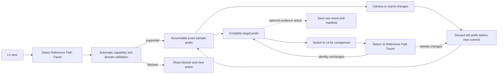

# Reference Path Tracer User Experience Contract

**Status:** Stage-0-frozen development-product experience accepted by `PTD-00-R1 PASS` at immutable dossier revision `d3152ec28f74cc1987f1d58fb52fa7ede10fd300`; product implementation remains absent

**Responsibility:** define how a developer, lighting engineer, or technical artist discovers, enters, navigates, observes, compares, resets, pauses, diagnoses, and secondarily exports or automates the Reference Path Tracer

**Authority boundary:** the [feature dossier](README.md) owns binary acceptance and failure verdicts, [Transport And Estimator](TransportAndEstimator.md) owns mathematical meaning, [Execution Architecture](ExecutionArchitecture.md) owns per-view session/state/data ownership, [Discovery](Discovery.md) owns ratification, and the [staged plan](Plan.md) owns implementation order and prompts

**Prepared:** re-audited 2026-09-10 against committed `master` revision `669637cf23b9748f8b94635409e74159d31d0bc2`; no UI, command, package, accessibility, or clean-machine workflow was implemented or exercised

**Naming reconciliation:** the 2026-09-09 working-tree clean break makes `ReferencePathTracer` the sole feature name; no UX capability or acceptance result is thereby implied.

**Priority reconciliation:** 2026-09-10 makes the live viewport comparison loop the first usable milestone and moves polished save/checkpoint/offscreen workflow behind it; this is a planning decision, not implementation evidence.

> [!IMPORTANT]
> The primary product is a first-class viewport view mode, not a separate render wizard. Selecting **Reference Path Tracer** must put the current view into a correct, bounded reference configuration and begin accumulation automatically. Export and noninteractive execution are secondary consumers of the same Renderer session semantics.

## Product Priority Order

Delivery and review follow this strict order:

1. **P0 — live viewport comparison loop:** the mode is immediately after Lit, starts automatically, continuously presents the newest completely committed prefix, remains navigable, visibly resets on camera/radiance changes, settles into uninterrupted accumulation when change stops, reports exact progress, and supports fast Lit-to-reference comparison.
2. **P1 — trustworthy Renderer/RHI reference semantics:** independent camera rays, one PBR-correct estimator, immutable Scene/View identity, deterministic samples, raw scene-linear accumulation, strict capability truth, and no stale-prefix mixing make the viewport result dependable.
3. **P2 — minimum acceptance evidence:** raw readback, immutable identity/provenance, statistical comparison, and explicit failure results exist only as needed to falsify correctness and retain completion evidence.
4. **P3 — secondary artifact workflows:** polished save, checkpoint, offscreen, path-management, and automation conveniences follow the usable viewport slice. They reuse its session and never become a prerequisite for ordinary comparison.

P0 does not lower the mathematical bar: a responsive but physically wrong view is not usable. Conversely, artifact plumbing cannot be counted as progress toward the primary product while the live view is hidden, frozen during navigation, slow to reflect a new camera, unable to explain resets, or unsafe to compare with Lit. Final oracle authority still requires the evidence gates in the [feature dossier](README.md); this ordering controls implementation priority, not acceptance dilution.

## Frozen Defaults And Operational Budgets

These are Stage-0 design inputs, not claims about the current implementation. A future change to one of them changes the session identity or reopens `PTD-00`; an implementation may fail more strictly but may not silently relax a bound.

| Concern | Frozen value or rule |
| --- | --- |
| Default product | `SurfaceTransportReference`; `FinitePathDiagnostic(D)` is Expert/evidence-only and always displays `D`. |
| View | Current physical Renderer extent, no dynamic resolution, full crop, pinhole perspective, uniform box reconstruction, target `4096` SPP, seed `0`, replicate `0`; maximum target `1,048,576` SPP. |
| Route | The process-selected RHI backend is fixed. `Automatic` chooses the first accepted/capable frontend in the fixed order `Inline`, then `Pipeline`, and reports the resolution before sample zero; choosing the second accepted route is policy resolution, not a failure fallback. An explicit frontend request is strict and never substitutes. |
| Session capacity | Exactly one session allocation process-wide, whether active, paused, timed out, or suspended in Lit; a retained prefix consumes that slot. A second request reports the owner and offers `Transfer (cancel and release current)`. Transfer cancels any checkpoint/export staging bound to the old session, rejects late callbacks, waits at most the normal `2 s` settlement bound, and exposes the slot only after the old allocation is released; prior verified artifacts remain. A settlement failure reports the device/operation failure and does not grant the slot. |
| Selection/preflight | State acknowledgement in the next UI update and within `100 ms`; preflight completes or reports its current blocking category within `2 s`. Longer validation becomes an explicit cancellable operation. |
| Camera response | Input/UI processing p95 `<= 50 ms`, hard `<= 100 ms`; a superseded identity cannot commit. The stale composition is marked within `100 ms`; the newest identity is submitted in the next render opportunity. |
| Work quantum | Reference batches are dynamically sized/partitioned so a submitted non-preemptible quantum targets `<= 100 ms` and must be `<= 500 ms` on the accepted support/map matrix. Failure to meet the hard bound blocks that matrix row rather than freezing navigation. |
| Preview/progress | Present the newest completely committed current-identity prefix at least every `250 ms` while work completes; publish progress at `10 Hz` maximum and accessible announcements at `1 Hz` maximum. First current-identity prefix must appear within `2 s` on the accepted support/map matrix. |
| Pause/cancel/close | Stop assigning work immediately. Late results are generation-rejected. Reach `Paused`, `Cancelled`, or a named device failure within `2 s` after the current quantum. Closing a viewport and normal application shutdown default to cancel-without-checkpoint; verified earlier results remain intact. |
| Retention | Suspension retains the one prefix while its reference allocations remain within `min(2 GiB, 25% of reported local GPU budget)`. On UMA use reported local/available device memory. If budget is zero/unknown or the session exceeds it, `Pause` is disabled with `Retention unavailable` and offers available `Checkpoint And Pause` or `Cancel Session`; switching to Lit cancels/releases the prefix after settlement and creates no `Suspended` state, so returning starts validation at ordinal zero. Pressure eviction of an already suspended prefix enters `Cancelled`, announces the release, and leaves no implied resume. |
| Duration | Interactive and offscreen sessions default to an `8 h` wall-time limit; reaching it enters `TimedOut` and never publishes completion. If retention is available, it preserves the prefix and `Extend And Resume` continues it; otherwise it releases the prefix after settlement, labels `No resumable prefix`, and both `Extend And Resume` and `Restart` revalidate and begin ordinal zero. |
| Disk | Preflight requires predicted staging plus final output plus `10%`, and refuses a single invocation predicted above `64 GiB`. No partial result is promoted on exhaustion. |
| Evidence actions | `Pause` is memory-only. `Checkpoint And Pause`, `Save Current Prefix`, and `Save When Complete` are P3 Expert actions. An identity change cancels a pending save intent; it never retargets it automatically. `Cancel After Checkpoint` means finish and verify the current checkpoint transaction, then stop; ordinary `Cancel` abandons staging. |
| Shipping | `ShippingEditor` and `ShippingGame` retain the `ReferencePathTracer` enumerator unconditionally in the existing public Renderer `RenderViewMode` source header for source/ABI symmetry. Both compile out every producer, session factory, selector, CVar/command-line adapter, overlay, request parser, ApplicationEditor operation, writer, optional codec dependency, package entry, and public documentation route; an injected/corrupt value deterministically reports `UnsupportedCapability` before allocation. Enum source presence is not consumer reachability. |

The numerical bounds are implementation contracts immediately. A development machine either meets the capability/resource predicates and reports measured behavior or returns the frozen unavailable/capacity result; it does not invent different limits. Naming minimum/reference release machines and claiming those bounds as supported-product performance remains a Stage-10 release gate.

## Product Pillar

A user opens the viewport View Mode menu, selects **Reference Path Tracer** immediately after **Lit**, and receives a progressively refined image with truthful sample progress. Any effective camera or radiance-affecting scene change invalidates the old prefix before it can mix with the new view. Switching back to Lit enables immediate comparison; returning resumes only a retained exact-identity prefix, while a disclosed no-retention exit restarts at ordinal zero.

The normal route requires no IDE, developer console, CVar sequence, mandatory setup workspace, or manual `Validate`/`Start` ceremony. Correct defaults, capability validation, accumulation, reset, and preview presentation are consequences of selecting the view mode. A details surface exists for exact settings, actionable errors, pause/restart, and export, but is not a prerequisite for first use.

Four distinctions remain impossible to miss:

- **committed sample prefix versus target-SPP progress or estimated ETA**;
- **raw scene-linear accumulation versus the viewport display transform**;
- **complete current-view result versus partial prefix, checkpoint, export staging, failure, or accepted oracle evidence**;
- **viewport comparison session versus a durable exported artifact**.

The Renderer semantic supports both Editor and Game render views. The Editor exposes the selector in DevelopmentEditor. A non-Editor application may request the same semantic through its normal view configuration, but Shipping exposure remains excluded until release scope explicitly admits its product, dependency, and support obligations.

## Intended People And Jobs

| Persona | Primary job | Completion signal |
| --- | --- | --- |
| Lighting/PBR engineer | Switch Lit and Reference Path Tracer on one unchanged view to inspect a real-time lighting difference. | An admitted retained prefix remains valid across the comparison switch; a no-retention exit is disclosed and restarts at zero. Both modes use the same canonical scene and camera identity. |
| Technical artist or content reviewer | Enter the mode without renderer setup, observe progress, move to another composition, and understand why accumulation restarted or cannot proceed. | The viewport always names the current state, exact prefix/target, and most recent invalidation or blocking semantic. |
| Evidence/release owner | Export a completed current-view result or reproduce it noninteractively with exact identity. | Raw EXR, manifest, uncertainty summary, and comparison are linked to one input digest and exact prefix. |
| Support/graphics investigator | Reproduce a reset loop, unsupported scene, failed export, or backend problem. | One root cause, view/scene/setting identity, next action, replay manifest, and bounded support record are available. |

## View Mode Placement And One-Click Entry

The viewport menu order is stable:

1. **Lit**
2. **Reference Path Tracer**
3. the remaining diagnostic and wireframe modes under their existing organization

The Reference Path Tracer is a `RenderViewMode` semantic. It is not another value in a global real-time lighting-quality selector. On selection, the Renderer resolves one accepted mode preset:

- `SurfaceTransportReference` product;
- independent camera-ray primary visibility;
- fixed current render extent and accepted reconstruction filter;
- accepted automatic traversal/backend route, with requested and active values visible in details;
- stateless seed/sample/dimension stream and exact target SPP;
- raw scene-linear HDR accumulation with no ReSTIR, temporal reconstruction, denoiser, contribution clamp, exposure, tone map, gamut transform, encoder, or screenshot value in transport;
- separately applied viewport display transform for human inspection.

These values are mode-owned resolved semantics, not a batch of hidden mutations to persistent Lit settings. Leaving the mode restores the user's prior Lit configuration exactly. Expert overrides must be explicit, validated, identity-bearing, and resettable to the accepted mode preset.

If the mode is unsupported, the viewport retains its last valid presentation and shows **Reference Path Tracer unavailable** with the first failed capability/domain condition and one next action. It never silently falls back to Lit, ReSTIR, a GBuffer-seeded candidate, another backend, or black output while leaving the reference label selected.

## Primary Happy Path



The minimum clean first-use flow is select, observe accumulation, navigate freely and see the displayed view follow with named resets, stop moving and watch the same view build samples automatically, then switch to Lit and back with a valid retained prefix when the disclosed retention budget admits it; otherwise exit visibly releases and return starts at ordinal zero. Saving is an optional evidence action outside that primary loop. Documentation may explain the physics and evidence model, but the happy path cannot require this dossier.

## View Session State And Dominant Action

One logical, feature-local Reference Path Tracer session belongs to one Renderer view identity. The state and action names below are frozen user-facing development-product vocabulary, not a requirement to expose matching path-tracer-specific C++ types through generic Renderer, View, settings, RHI, or Editor contracts.

| State | User sees | Dominant action | Forbidden impression |
| --- | --- | --- | --- |
| `Inactive` | Normal non-reference view. | Select `Reference Path Tracer`. | Reference work is running in an unrelated view. |
| `Validating` | Current validation category and bounded elapsed time. | `Return to Lit`. | Sampling or a final digest already exists. |
| `Resetting` | A concrete reason such as `Reset — Camera rotated`, the discarded prefix, and new view identity. | Continue using the view. | Old and new samples are being blended. |
| `Accumulating` | Exact committed SPP, target, ratio, measured throughput, estimated ETA, active route, and last reset reason. | Continue inspecting/navigating; secondary `Pause` and `Restart`. | A clean image or ETA means convergence/acceptance. |
| `Complete` | Persistent `Complete — N SPP` badge, identity, uncertainty status, and comparison state. | Inspect or switch to Lit; secondary `Save Raw Result`. | Target SPP proves convergence or oracle authority. |
| `Suspended` | Retained prefix, identity, suspension reason, and whether GPU memory is retained. | Return to the mode or `Resume`. | Lit is still accumulating reference samples. |
| `Paused` | Exact retained prefix and resource/checkpoint status. | `Resume`. | Paused means complete. |
| `Checkpointing` *(orthogonal P3 operation substate)* | Immutable bound prefix being made durable and cancellation behavior; live sampling may continue independently unless this is `Checkpoint And Pause`. | `Cancel Checkpoint` abandons staging; `Cancel After Checkpoint` completes verification then cancels the session. | A checkpoint is usable before verification. |
| `Exporting` *(orthogonal P3 operation substate)* | Immutable source prefix, raw/manifest staging progress, destination, and atomic-publication state; later camera resets do not mutate that export identity. | `Cancel Export` abandons staging without changing the live session. | A visible staging path is a completed result. |
| `TimedOut` | Exact retained/released prefix outcome and elapsed limit. | `Extend And Resume`, `Restart`, `Cancel Session`, or `Return to Lit`. | Timeout means complete. |
| `Cancelled` | No active allocation; last digest and discarded prefix count. The view mode remains selected but stopped. | `Restart` or `Return to Lit`. | Cancellation silently switched modes or preserved resumable work. |
| `Unavailable` | Preflight blocker, no committed sample, and one safe repair. | `Return to Lit`, `Copy Details`, or the named repair action. | A fallback is active. |
| `Failed` | Terminal reason for the current digest, preserved prior results, and cleanup status. | `Retry` after revalidation, `Return to Lit`, or `Copy Details`. | A partial result is valid reference output. |

State color is supplementary. Text, icon/glyph, accessible label, and focus order communicate the same meaning. A transition becomes visible only when its underlying Renderer state is true; queue submission and GPU responsiveness are not progress.

`Cancel Session` is always available in Details during `Validating`, `Resetting`, `Accumulating`, `Suspended`, `Paused`, or `TimedOut`. It releases the in-memory prefix after the bounded settlement rule and enters `Cancelled` while the mode remains selected; it never deletes a prior checkpoint or completed artifact. These states and actions may not be merged in implementation merely because they share presentation styling.

## Viewport Progress Overlay

During validation, reset, accumulation, or failure, a compact non-modal overlay appears inside the viewport. It must not cover the view-mode selector or primary composition area and can collapse to a one-line status without hiding state.

The accumulating form contains:

```text
Reference Path Tracer
Accumulating 768 / 4096 SPP  [18.75%]
2.1 Msamples/s  ETA about 23 min
Last reset: Camera rotated
[Pause] [Restart] [Details]
```

Rules:

- `768 / 4096 SPP` is the exact completely committed per-pixel prefix; the bar is that ratio and never a convergence estimate. If the target is lowered below an already committed prefix, the bar stays complete and text reports both truths, for example `Complete — 1024 committed / target 512`; it never clamps or rewrites the prefix to fabricate `512 / 512`.
- ETA is visibly estimated and may show `Calculating`, `Unstable`, or `Unavailable`.
- Completion stops new sampling and replaces the bar with a persistent compact completion badge; the user does not have to infer completion from a hidden bar.
- Reset briefly names the cause and prior discarded prefix, then remains available in Details.
- During continuous camera or scene change, the overlay says why the prefix repeatedly restarts instead of suggesting that slow progress is a performance bug.
- Preview/display refresh and progress polling are bounded and coalesced. They do not synchronize every sample batch, change sample ordering, or delay camera feedback/cancellation beyond budget.

## Live Navigation Contract

Reference Path Tracer remains a live viewport mode while selected; it is not a still-image dialog that captures one camera and blocks interaction until completion.

- Editor and Game camera controls remain responsive while validation, reset, or accumulation is active. The last valid presentation may remain visible during a short transition, but it must be visibly stale/resetting and must not masquerade as the current camera result.
- Each effective camera change invalidates the prior measurement before commit. The Renderer may coalesce UI notifications and abandon superseded in-flight work, but it may never merge samples from two camera identities or weaken identity with a motion tolerance.
- During continuous movement, the viewport presents the newest available completely committed prefix for the newest accepted camera identity at the bounded preview cadence. A low-prefix noisy image is expected; a frozen old composition, black flicker used as a reset mechanism, or hidden stale image is not.
- When movement or rotation stops, accumulation continues automatically from ordinal zero for that final identity. The user never clicks `Restart`, `Validate`, or `Start` to make a moved view refine.
- Camera responsiveness takes scheduling priority over filling a now-stale batch, readback, checkpoint, export, or high-quality preview. This changes batch scheduling and presentation cadence only; it does not change sample identity, the estimator, or accepted prefix semantics.
- The overlay may coalesce a burst into `Camera moving — restarting for latest view`, then retain the final exact reset cause and discarded prefix in Details. Progress shown for the current identity remains exact.
- A continuously changing camera is not expected to converge. The useful contract is immediate visual orientation while moving and automatic progressive refinement once stable, with no stale-sample mixing.

## Accumulation Identity And Reset Contract

The session compares canonical semantic identity before committing every complete sample range. It never relies only on mouse/keyboard activity, approximate motion thresholds, a generic temporal-history-valid bit, or raw structure bytes. Path-tracer film jitter is generated from `MATH-09`; ordinary TAA jitter is excluded from the canonical camera identity.

| Change | Required response | Example visible reason |
| --- | --- | --- |
| Position, orientation, camera selection, pilot/eject, camera cut/teleport, projection type, FOV, aspect, near/far plane, orthographic height, admitted lens/aperture/focus/shutter/time field, crop, filter, or render extent changes | Atomically invalidate the old prefix before any new-view sample commits; start ordinal zero for the new digest. | `Camera moved`, `Projection changed`, `Viewport resized` |
| Geometry/instance transform/visibility/deformation, material/texture/alpha, light/emissive/environment, units, AS, shader/compiler, or any other contributing scene generation changes | Invalidate before mixing. If the producer cannot publish a trustworthy generation, block the affected domain rather than accumulating through it. | `Material changed: Brass`, `Scene geometry changed` |
| Product/domain, seed/replicate, sampler/dimension layout, transport-affecting setting, strict backend/frontend, or precision policy changes | Validate the new request, then reset to ordinal zero. | `Sampling configuration changed` |
| Target SPP increases | Continue the same exact stream from the committed prefix. | `Target raised to 4096 SPP` |
| Target SPP decreases to or below the committed prefix | Stop at the already committed prefix and report that exact count; never discard or pretend fewer samples were accumulated. | `Target met at 1024 committed SPP` |
| Exposure, tone mapper, gamut/output transform, false-color display derived from raw data, overlay layout, UI scale, or progress polling changes | Re-present the same raw prefix; no transport reset. | No reset; display lineage updates |
| Batch size, preview cadence, ETA model, wall-time budget extension, or scheduling changes | Preserve the sample stream and prefix unless a separately named resource failure forces safe suspension. | `Schedule updated` |
| Switch from Reference Path Tracer to Lit or another non-reference view mode | After the last complete range, retain and suspend only within the retention budget; otherwise settle/release with no resumable prefix. View-mode selection itself is not part of the transport digest. | `Suspended for Lit comparison` or `Released — retention unavailable` |
| Return to Reference Path Tracer | Resume only if the complete digest still matches. Otherwise discard the retained prefix and name the first changed field. | `Resumed 1024 SPP` or `Reset — Light changed` |
| Explicit `Restart` | Discard the current prefix, preserve settings, and restart at ordinal zero with an explicit reason/event. | `Manual restart` |

There is no epsilon for reference-camera movement: if canonical ray-generation input changes, the measurement changed. Canonicalization normalizes valid semantic values and rejects non-finite/invalid camera data; it does not hide small movement. A camera-input flag may improve the reason string but cannot be the invalidation authority.

## Editor And Non-Editor Cameras

Editor free-fly navigation, an Editor-piloted scene camera, and a Game/runtime camera are producers of one canonical `RenderViewInput.Camera` contract. The Reference Path Tracer observes the resolved View identity and camera fields after their normal owner has updated them. It does not poll Editor widgets, gameplay objects, or input devices independently.

- Editor translation, orbit, rotation, focus, bookmark recall, pilot/eject, projection edit, and scene-camera property edit all reset when they change the effective camera.
- Runtime camera animation, controller movement, camera cuts, teleports, active-camera replacement, projection/lens edits, and viewport resize follow the same rule.
- A producer's explicit cut/teleport/generation signal is retained as a precise reason, but exact canonical camera identity still catches unflagged changes.
- A frame counter, world tick, UI animation, or unchanged camera submission does not reset by itself.
- A continuously animated camera, material, light, transform, skin/morph state, or time-dependent shader continually creates new identities. The overlay explains the reset loop and recommends pausing simulation or choosing a frozen supported time. It never accumulates streaked/blended history and calls it reference.

The acceptance matrix exercises Editor-produced `RenderViewKind::Scene` and runtime `RenderViewKind::Game` through the same Renderer state path. The live Editor currently submits `Game`; Stage 2 performs a clean break to `Scene` and updates both Editor producers. No nonexistent `RenderViewKind::Editor` is introduced. Shipping reachability is a separate product gate, not a reason to fork camera semantics.

## Lit Comparison And Session Retention

Fast comparison is a first-class requirement:

- switching to Lit restores the user's prior Lit settings; it suspends after a complete range only when retention is admitted, otherwise it visibly cancels/releases and later returns at ordinal zero;
- the view retains at most one bounded reference session/prefix under the accepted memory policy;
- returning revalidates and resumes without reset when scene, camera, extent, transport, shader, and sampler identity remain exact;
- changes made while viewing Lit invalidate the retained prefix through canonical generation observation, even though reference work is suspended;
- eviction under explicit memory pressure is visible as `Reference prefix released — memory policy`; returning starts clean and never implies a resume;
- a second viewport cannot silently steal the active accumulator. Initial single-active-session capacity reports the owning viewport and offers an explicit transfer/cancel action.

This retention is an interaction optimization only. It does not create a second accumulator authority, durable checkpoint, or evidence artifact.

## Settings And Automatic Preflight

Reference details are available from the progress overlay and rendering details surface:

| Group | Fields | UX rule |
| --- | --- | --- |
| Intent | Product/domain and exact authority label. | Accepted full-reference intent is first; finite diagnostic can never be mistaken for it. |
| Sampling | Exact target SPP, seed, replicate, sampler identity. | Target controls the requested prefix, not convergence. Seed/sampler changes reset; target changes follow the reset table. |
| View | View identity, camera, render extent/crop/filter, frozen time where admitted. | Read from the current canonical view; no second camera picker is required for the main path. |
| Execution | `Automatic (accepted routes only)`; strict backend/frontend under Expert. | Requested and active values are separate. Automatic never selects an unaccepted fallback. |
| Resources | GPU memory, wall-time, cancellation bounds, overlay/preview cadence; checkpoint policy under Evidence. | Predicted and active usage are visible; values are bounded. Camera response outranks secondary readback/export work. |
| Evidence/Output *(secondary, collapsed by default)* | Raw readback status, optional checkpoint, `Save When Complete`, destination, raw beauty/manifest selection, optional display preview. | Ordinary viewport comparison requires none of these fields; prior completed output is preserved. |

Selecting the mode runs deterministic automatic preflight before sample zero. Supported defaults proceed without confirmation. A blocker names the first unsupported camera, scene object, material, light, feature-matrix row, capability, or capacity condition and offers a concrete next action. There is no `Render Anyway` for the raw reference product.

When several blockers exist, the first cause is deterministic: request/schema, build-profile reachability, existing-session capacity, product/domain, camera/extent, geometry/deformation, material/texture/alpha, lights/emission/environment, backend/frontend capability, accumulator memory, then artifact destination/disk. Within a category use canonical manifest identity order. Stable reason codes are the terminal/category name plus the relevant matrix row and canonical object identity.

## Pause, Restart, Close, And Shutdown

- `Pause` stops assigning new ranges and retains a bounded in-memory exact prefix. The secondary `Checkpoint And Pause` action additionally writes and verifies a durable prefix before releasing promised resources.
- `Resume` revalidates the complete digest. It imports or retains nothing after the first mismatch.
- `Restart` is explicit and immediate after the current range settles; it cannot be triggered by a display-only setting.
- Closing a details panel does not affect the view session. Leaving the view mode suspends it only when retention is admitted; otherwise it settles, releases, and leaves no resumable session.
- Closing the viewport and normal application shutdown default to cancel-without-checkpoint after the `2 s` settlement bound; late GPU/readback/write results are rejected by generation.
- The only override is Expert `Checkpoint on close/shutdown`, available only after checkpoint support is present and preflight proves a writable destination. It enters `Checkpointing`, waits at most `30 s`, verifies and publishes the checkpoint, then cancels. Timeout/hash/write failure abandons staging, records the failure, and cancels; it never blocks shutdown indefinitely or publishes partial data.

## Secondary Saving And Evidence Artifact Experience

Saving exists to retain evidence and exchange raw results; it is not the expected daily interaction and must not delay delivery or responsiveness of the live viewport comparison loop. The first usable milestone may omit polished saving, checkpoint, and offscreen UX. When these secondary surfaces land, they obey the same session identity:

- `Save Raw Result` is enabled for a complete current prefix and writes raw `beauty.exr`, the accepted statistical summary, hashes, and `manifest.json` last.
- `Save When Complete` registers an export intent against the current digest and target. Any identity reset cancels the intent with a visible reason; it never retargets or exports the discarded view under a new identity.
- `Save Current Prefix` is an expert action. Its manifest says `PartialPrefix`, records the exact committed SPP, and cannot be discovered or labeled as a completed candidate reference.
- The optional viewport-looking image is labeled `Display Preview — not raw reference` and records exposure/tone/gamut/encoding plus the raw hash.
- Export consumes the same session accumulation through typed readback. It does not launch a second estimator or retrace an already complete matching view.
- Publication uses a unique staging sibling, hashes all artifacts, writes the completion manifest last, and atomically publishes on one volume. Failure preserves the in-memory prefix and all prior valid results.
- A save defaults to the exact current session render extent and raw precision. It never silently substitutes a thumbnail, viewport screenshot, UI-scaled backbuffer, preview texture, or lower default export resolution. Any explicit crop or extent change is identity-bearing and therefore starts a distinct measurement.
- `Render At Resolution...` is the only high-resolution override: it displays width, height, predicted accumulator memory/disk, and the fact that accepting creates a new measurement at ordinal zero. It is capped at `16384 x 16384`, the resource budgets above, and the accepted hardware matrix. The ordinary mode remains at the current physical Renderer extent; export never upscales it.

The Completed details lead with state, exact prefix/digest, authority label, and uncertainty status, then `Open Folder`, `Copy Raw Path`, `Copy Manifest Path`, `Compare Raw...`, and `Copy Replay Command`. A screenshot, preview, checkpoint, staging directory, or failed partial output is never the default result.

## Noninteractive And Runtime Contract

Automation remains a secondary evidence surface and is not part of the first usable viewport milestone. One `ShowcaseEditor` operation may create an offscreen Game-kind RenderView and run the same Reference Path Tracer session, for example:

```text
ShowcaseEditor.exe --reference-path-tracer-request Saved/ReferencePathTracer/request.json
```

The exact development-only invocation is `ShowcaseEditor.exe --reference-path-tracer-request <request.json>`. The request is strict UTF-8 JSON with no BOM, duplicate keys, comments, NaN/Inf, fractional integer fields, or unknown fields. Relative `project`, `level`, and `outputDirectory` paths resolve against the request file's canonical parent; canonicalization failure, traversal outside the declared project for `level`, an existing nonempty invocation directory, or a destination below an immutable install root is `InvalidRequest`. The operation creates one unique child named from the digest and invocation UUID and never overwrites an existing artifact.

| JSON member | Requirement and default |
| --- | --- |
| `schema` | Required exact string `sparkle.reference-path-tracer.request/1`. |
| `project`, `level`, `camera` | `project` is a required filesystem path to the project descriptor. `level` is a required filesystem path below that project's content root. `camera` is either exact `ActiveGameCamera` or `uuid:<lowercase RFC-4122 UUID>` naming one serialized scene-camera object. Missing/duplicate UUID identity is `InvalidRequest`; display names are forbidden as identity. |
| `product` | Optional enum, default `SurfaceTransportReference`; alternative `FinitePathDiagnostic` requires `finiteSurfaceVertices` in `[1,4096]`, which is otherwise forbidden. |
| `width`, `height` | Required integers in `[1,16384]`; crop is optional four-integer half-open `[x0,y0,x1,y1]` inside the extent and defaults to the full extent. Filter is optional exact enum `Box` and defaults to `Box`. |
| `targetSpp` | Required integer in `[1,1048576]`. `seed` and `replicate` are optional uint32 and default to `0`. |
| `backend` | Required exact enum `D3D12` or `Vulkan` and must equal the process backend. |
| `frontend` | Optional exact enum `Automatic`, `Inline`, or `Pipeline`; default `Automatic` uses the frozen priority order. |
| `timeoutSeconds` | Optional integer `[1,28800]`, default `28800`. `maxOutputGiB` is optional integer `[1,64]`, default `64`, and can only narrow the global cap. |
| `checkpointPolicy` | Optional exact enum `None` or `OnTimeout`; default `None`. `OnTimeout` requires the checkpoint feature and writable destination at preflight. |
| `outputDirectory` | Required path. Raw beauty, the accepted statistical summary, hashes, and manifest are written according to the fixed artifact schema. |

The submission contains serializable Application intent only. It never serializes Renderer handles, UI state, loaded scene data, descriptors, or a second estimator configuration. Standard output is UTF-8 JSON Lines: zero or more progress objects with exact `schema:"sparkle.reference-path-tracer.event/1"`, `type:"progress"`, `state`, `committedSpp`, `targetSpp`, `digest`, and monotonic `sequence`, followed by exactly one terminal object with the same exact schema, `type:"terminal"`, `status`, `exitCode`, `digest` or `null`, `manifestPath` or `null`, `checkpointPath` or `null`, and one stable `reasonCode`. Standard error contains bounded sanitized human-readable errors only. A crash or missing/multiple terminal records is `InternalFailure` to the caller. Stable process exits are `0 Completed`, `2 InvalidRequest`, `3 UnsupportedDomain` or `UnsupportedCapability`, `4 Cancelled`, `5 TimedOut`, `6 CapacityExceeded`, `7 DeviceLost`, `8 PublicationFailed` or `CheckpointRejected`, and `9 InternalFailure`.

Stable noninteractive terminal categories are `Completed`, `InvalidRequest`, `UnsupportedDomain`, `UnsupportedCapability`, `Cancelled`, `TimedOut`, `CapacityExceeded`, `DeviceLost`, `PublicationFailed`, `CheckpointRejected`, and `InternalFailure`. Equivalent viewport/offscreen intent resolves the same canonical Renderer digest and sample stream; invocation identity and wall-clock timing may differ.

A non-Editor interactive application requests `RenderViewMode::ReferencePathTracer` through its ordinary view-settings owner and presents progress through its own approved UI. A developer CVar may remain an internal selection adapter, but is not the product contract.

## Error Message Contract

Every unavailable, reset, or failure presentation can expand to:

```text
What happened: one root-cause category in user language
Where: viewport, camera, scene object, material, light, setting, backend, checkpoint, or path identity
Why it matters: which accumulation, domain, or artifact invariant cannot be satisfied
What was preserved/discarded: exact prefix, checkpoint, in-flight range, prior result
Next action: one safe and specific recovery step
Details: stable category, reason code, digest, and copyable bounded support record
```

Examples:

- `Accumulation reset at 768 SPP: the viewport camera rotated. The discarded prefix will not be mixed with the new view; accumulation restarted at sample 0.`
- `Reference Path Tracer unavailable: material "GlassPane" uses transmission, outside Surface Transport Reference v0.1. Replace or exclude that content, or reopen PTD-00 scope. No samples were committed.`
- `Export failed: 18.4 GB is required and 7.1 GB is available at D:\Evidence. Choose another writable destination or free space. The completed viewport prefix and prior results are intact.`

Raw driver/compiler/RHI output stays in Details and is bounded and sanitized. A numeric native error, `Failed`, or `Reset` without the cause and consequence is insufficient.

## Accessibility, Input, Locale, And Scale

- The view-mode item, progress state, exact prefix, failure reason, and every action are keyboard reachable in deterministic order.
- State and severity are never color-only. Progress exposes a textual accessible value such as `768 of 4096 samples per pixel, accumulating`.
- Background sample updates do not steal focus. Unavailable/failure transitions focus the concise cause only when the user's initiating action requires it.
- Narrow viewports collapse ETA and secondary throughput before hiding state, prefix/target, reset reason, or primary action.
- UI scale and DPI changes do not reset transport unless the actual render extent changes.
- Numeric editing has explicit units, invariant serialization, locale-aware display, and round-trip-safe parsing. Manifests remain locale independent.
- Long names elide visually but stay accessible/copyable. Paths with spaces and non-ASCII characters are exercised end to end.
- Progress announcements are rate-limited; reset, failure, and completion remain promptly announced.

The frozen dry-run matrix is keyboard-only selection/actions/focus order; non-color state recognition; accessible progress/reset/failure announcements; `100%`, `150%`, and `200%` DPI; widths `320`, `640`, and `1280` logical pixels; `en-US` and one comma-decimal locale; and writable/read-only paths containing spaces plus non-ASCII characters. Each profile must complete select, automatic start, move/reset/refine, Lit return/resume-or-reset, pause/resume, cancel, failure recovery, and optional raw-save discovery without clipped required text, focus loss, color-only meaning, or locale-dependent manifest bytes.

## Build And Reachability Matrix

| Profile | Frozen reachability |
| --- | --- |
| `DebugEditor`, `DevelopmentEditor` | View-mode selector, overlay/details, semantic Renderer API, exact request CLI, ApplicationEditor operation, raw writer, and support details included. |
| `DebugGame`, `DevelopmentGame` | Semantic Renderer view mode included; product UI may expose it only through an approved non-console development view selector. Offscreen writer remains ApplicationEditor-owned. |
| `ShippingEditor`, `ShippingGame` | The `ReferencePathTracer` enumerator remains unconditionally in the existing public Renderer `RenderViewMode` source header, but every producer and session factory plus selector, CVar, generic command-line reachability, request CLI, writer/operation, support promise, optional artifact dependency, package entry, and public documentation route is compiled out. An injected value returns `UnsupportedCapability` before allocation; no session can start. |

The current repository does not meet this matrix: the global Lighting CVar is generically reachable and Renderer links into editor/runtime profiles. `PTD-00-R0` therefore cannot use this frozen target as Shipping proof.

## Stage-0 First-Use Dry Run

An independent read-only reviewer attempted to reconstruct first use from source and this contract at `669637cf23b9748f8b94635409e74159d31d0bc2`. Executable result: **BLOCKED before interaction**. The live view-mode menu has no Reference Path Tracer item, the feature is a global Lighting setting, Editor views submit `RenderViewKind::Game`, progress/session actions do not exist, and capture produces LDR BMP. Iterative contract re-review first found state, cancellation, capacity, Shipping, CLI, retention, and restart/resume invention points; after reconciliation the reviewer returned **PASS for the Stage-0 UX/evidence design candidate**. The intended flow is Lit -> Reference Path Tracer -> automatic preflight/start -> current-identity progress -> camera reset/refine -> Lit comparison with retained-or-released truth -> exact return revalidation -> pause/resume or cancel -> optional raw save. This is design evidence only; a clean executable first-use transcript remains required in Stages 7/9.

## Professional Defaults And Guardrails

- The default view-mode preset is accepted, full-reference, fixed-extent, raw-safe, and automatic-only-among-accepted-routes.
- It never enables firefly filtering, denoising, biased environment MIPs, path regularization, contribution clamps, adaptive stopping, or display output as raw.
- `Quick Diagnostic`, `Reference Candidate`, and evidence-owner presets expand to exact values. `Low/Medium/High/Ultra` is insufficient.
- Presets may change target SPP, crop, checkpoint cadence, and operational budgets; they may not silently change transport target, feature domain, material model, sampler, or bias policy.
- Resource limits fail or suspend explicitly before unsafe allocation. TDR-safe batching may change schedule, never the sample stream.
- Completed output is never overwritten in place. A retry/export gets a new invocation directory and lineage.

## Common Experience Failure Points

| Failure | Why it is unacceptable | Required design response |
| --- | --- | --- |
| Reference remains only a Lighting setting, CVar, or separate wizard | The main comparison route is hidden and disconnected from the viewport mental model. | One `RenderViewMode::ReferencePathTracer` item immediately after Lit; details/export are secondary. |
| Selecting the mode mutates persistent Lit settings | Returning to Lit is surprising and comparison is no longer controlled. | Resolve mode-internal reference semantics; restore untouched Lit state on exit. |
| User must click Validate and Start for the supported default | Routine comparison carries batch-tool ceremony. | Automatic preflight and start on view-mode selection; block only with an actionable reason. |
| Viewport freezes, displays the old composition, or turns black throughout camera movement | The feature behaves like an offline dialog instead of a view mode and makes composition search impractical. | Prioritize the newest camera identity, visibly mark transition state, present its newest committed prefix at bounded cadence, and refine automatically when motion stops. |
| Camera input is detected but effective camera changes are not, or vice versa | Editor/runtime producers can leave stale history or reset needlessly. | Canonical post-resolution camera identity is authority; producer cut/motion signals refine reasons only. |
| Small camera changes use an epsilon | Samples from different measurements mix. | Any canonical ray-generation change resets; no movement tolerance. |
| TAA jitter or frame index resets reference history | A stationary view never converges. | Path-tracer film samples own jitter; ordinary temporal jitter/frame count stay outside identity. |
| Animated content does not invalidate | Blurring or streaking is presented as reference. | Generation-complete dynamic-content invalidation or explicit unsupported/frozen-time rejection. |
| Switching to Lit destroys a valid prefix | The primary comparison loop is frustrating and expensive. | Bounded per-view suspension and exact-identity resume. |
| Switching modes always preserves a prefix | Scene/camera edits made in Lit can return stale output. | Revalidate the full digest on return and name the first mismatch. |
| One progress bar hides reset, sample commit, checkpoint, or export state | Stale or partial work can appear complete. | Exact state/prefix text plus separate checkpoint/export progress. |
| Progress percentage is called convergence | Fixed target SPP is mistaken for statistical proof. | Label it target-prefix progress; uncertainty/convergence remains separately evaluated. |
| Exposure or tone mapping resets transport | Comparison iteration wastes valid samples. | Presentation-only lineage refresh with no raw reset. |
| Display changes contaminate raw output | The oracle becomes presentation-dependent. | One-way raw-to-preview transform and raw-first save/compare actions. |
| A second viewport silently takes capacity | Work and memory disappear without an owner transition. | Explicit active-view capacity and transfer action. |
| Export launches another renderer | View and saved output can disagree. | Typed readback from the same exact session/prefix. |
| Shipping first run exposes the tool accidentally | Developer dependencies and unsupported workflow leak into the consumer product. | Explicit build/package/reachability gate; Renderer semantics do not imply product exposure. |

## UX Review And Acceptance Handoff

The implementation sequence has two non-interchangeable gates. The primary viewport usability gate passes before artifact polish can be used to claim product progress:

1. `CHK-RPT-15` records a clean first-use transcript for finding the mode after Lit, automatic validation/start, live progressive display, responsive camera translation/rotation, named reset, automatic post-motion refinement, exact progress/completion, Lit comparison, exact resume/reset on return, pause/restart, failure, and recovery;
2. both Editor and Game camera producers pass translation, rotation, camera selection, cut/teleport, projection/lens, resize, unchanged-frame, and continuous-motion matrices through one canonical View route;
3. `CHK-RPT-09` proves no stale sample survives any hard invalidation, the displayed composition follows the newest camera within its frozen responsiveness budget, and no presentation/scheduling-only change loses a valid prefix;
4. `CHK-RPT-16` proves one per-view Renderer session owns accumulation, no duplicate Lighting selector or estimator authority remains, and Shipping reachability matches accepted scope;
5. `CHK-RPT-17` proves the UI is only the ordinary view-mode selector and generic progress consumer: it owns no Renderer session, transport settings, reset policy, or duplicate feature truth;
6. `CHK-RPT-18` proves the viewport selects the Reference middle recipe of the original frame, Lit and Reference passes/resources remain mutually exclusive, raw accumulation is independent of Lit estimator products, and both modes reach the same viewport/presentation tail;
7. keyboard, focus, non-color, scale/DPI, narrow layout, and bounded-log cases pass; and
8. a first-time reviewer completes the primary loop without saving, source edits, IDE use, console commands, private explanation, or a setup wizard.

The complete workflow is ready for `FCR-REN-08` consideration only when the primary gate remains passing and:

9. `CHK-RPT-02` proves viewport, runtime, and noninteractive equivalent intents resolve to the same semantic digest and sample stream;
10. `CHK-RPT-13` exercises capability, capacity, timeout, cancellation, device, checkpoint, disk, and publication failures with bounded cleanup/recovery;
11. `CHK-RPT-10` proves every display/save/open/compare action keeps raw and presentation lineage separate; and
12. full-resolution raw save, locale, spaces, non-ASCII, read-only install, offscreen automation, support, and output discovery pass their declared evidence matrices.

This page defines the intended experience; the [feature dossier](README.md#acceptance-criteria) and signed `FCR-REN-08` report own the eventual verdict.

## Sources And Precedent

- Epic's official [Path Tracer documentation](https://dev.epicgames.com/documentation/en-us/unreal-engine/path-tracer-in-unreal-engine) is the direct interaction precedent: viewport View Mode selection, progressive accumulation for a still view, invalidation on camera/view/material/object change, target-SPP progress display, and runtime enablement. Its documented dynamic-animation invalidation gaps are a negative precedent, not behavior to reproduce.
- SparkleEngine [Editor Engineering](../../../../../../../Engineering/Modules/Editor.md) is the binding local authority for intent-first workflows, operation ownership, bounded background work, failure presentation, keyboard access, and lifecycle safety.
- The pinned [RTXPT reference controls](https://github.com/NVIDIA-RTX/RTXPT/blob/f08d1c739071e0faad0c7c274d861124c511abab/Rtxpt/SampleUI.cpp#L778-L866) and [Falcor PathTracer guide](https://github.com/NVIDIAGameWorks/Falcor/blob/eb540f6748774680ce0039aaf3ac9279266ec521/docs/usage/path-tracer.md#overview) are expert-control, reset, and progressive-rendering precedents, including negative lessons about defaults and label authority.
- AMD's pinned [Baikal workflow description](https://github.com/GPUOpen-LibrariesAndSDKs/RadeonProRender-Baikal/blob/2d5a5d0eb2092d75adf637bf6f381d7e9307e986/README.md) and [Radeon ProRender backend article](https://gpuopen.com/learn/radeon-prorender-2-02-10/) provide automation/data-generation and final-versus-preview precedents.
- The [OpenEXR Technical Introduction](https://openexr.com/en/latest/TechnicalIntroduction.html) informs raw channel, metadata, and lossless-format presentation; it does not define Sparkle's artifact or evidence authority.
- [Research](Research.md) owns the complete pinned implementation/source ledger, approved uses, and non-claims.
