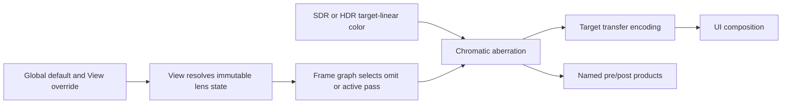

# Chromatic Aberration Execution Architecture

**Status:** proposed target architecture; blocked until `CHRD-00`, not implementation proof

**Responsibility:** define per-view state, frame-graph placement, resource and shader ownership, active-state truth, debug/UI/capture joins, failure, and cost for the first-release lens pass

**Authority boundary:** [Semantics](Semantics.md) owns the model; [User Experience](UserExperience.md) owns observable workflow/state behavior; [README](README.md) owns scope/acceptance; [Plan](Plan.md) owns delivery order; RHI owns command/resource mechanics only

**Current readiness:** **0/100 — target only**.

## Delivery Priority And First Usable Slice

The first usable slice is an inactive, serializable per-view state that proves exact neutral omission and truthful invalid-state reporting without changing pixels. The second slice is the distinct three-read pass with raw pre/post artifacts and an independent coordinate/filter oracle. Editor polish and packaging follow the stable state/result contract.

Preserving the current display path has priority over showing an effect. Any invalid, unsupported, missing-program, or incoherent frame state omits the lens pass and reports why; it never distorts UI, mutates alpha, or silently turns unrelated color fringes into a claimed feature.

## Product And Architectural Claim

One existing settings route resolves global/default and per-view lens intent into an immutable per-frame value. One Renderer graph pass, when non-neutral and valid, reads target-linear color and writes a same-domain product before encoding/UI. The pass is stateless, asset-free, backend-neutral in semantics, and omitted at zero. Diagnostics/captures derive from the same prepared result.

No lens manager, post-process volume system, spectral asset, temporal history, async worker, persistent GPU allocation, quality framework, or RHI effect policy is created.

## Current Route Versus Target Route

| Concern | Current source at `ca55e7d8` | Target delta | Preserved owner |
| --- | --- | --- | --- |
| settings/View | no aberration values/result | one narrow serializable request and immutable View result | existing display settings and View preparation |
| graph | tone/encoding/presentation path; no lens product | optional target-linear lens product at accepted edge | Renderer frame graph/post path |
| shader/program | no lens shader/program | one typed backend-neutral semantic program | shader catalog/generation/runtime |
| resources | no effect-owned data/history | active transient output only; source read | frame graph and RHI resource mechanics |
| debug/UI/capture | no intentional-effect identity | explicit bypass/composition/product lineage | existing Debug Views/UI/capture owners |
| editor/automation/package | no control/field/claim | extend admitted display workflow and product config | current settings/editor/package owners |

## Target Flow



One View-owned immutable state decides whether the pass exists. There is no asset, history, persistent GPU resource, background work, or renderer-global mutable effect owner in the first release.

## Intended Source Shape

Final names must follow the audited codebase; this is an ownership sketch, not a request for one file/type per row.

```text
Renderer/Public/Settings
  ChromaticAberrationSettings          strength, center, start; neutral predicate

Renderer/Private/View
  ResolveChromaticAberration(...)      default/override/validation
  PreparedChromaticAberration          immutable semantic and frame geometry

Renderer/Private/Passes/PostProcessing
  AddChromaticAberrationPass(...)      omission, typed reads/write, product identity
  ChromaticAberration.hlsl             one accepted model/filter contract

Diagnostics/Capture
  ChromaticAberrationResultSummary     requested/resolved/active/reason and lineage

ApplicationEditor / manifests
  adapters over the same settings/result owners
```

If an existing value/result owner already fits, extend it rather than add a synonym. Public types contain numeric intent and stable status vocabulary only. Graph resources, native pipelines, descriptors, editor callbacks, and window handles remain private to their owners.

## Ownership

| Owner | Responsibility |
| --- | --- |
| Renderer public display types | narrow serializable strength/center/start values and requested state |
| settings and View preparation | defaults, per-view override, validation, immutable resolved state and active reason |
| post-processing/display graph | exact target-linear input edge, optional output resource, encoding/UI ordering, debug bypass |
| shader runtime | one registered typed program and backend-neutral bindings |
| diagnostics/capture | requested/resolved/active values, domain, extent, pre/post identity |
| editor settings surface | labeled controls, neutral reset, unavailable reason; no duplicate runtime state |

## Contract Vocabulary

| Value | Required content | Lifetime/identity rule |
| --- | --- | --- |
| `ChromaticAberrationSettings` | model revision, strength, center, start offset | serializable pure value; one centralized exact-neutral predicate |
| `ChromaticAberrationRequestId` | View-local committed generation | changes on commit/reset/default-resolution change; never process-global authority |
| `ChromaticAberrationDigest` | canonical settings plus semantic revision | stable across processes; excludes pointers, frame extent, backend handles |
| `PreparedChromaticAberration` | digest, effective/sanitized-or-rejected state, active rectangle/resource identity, target domain, status/reason | immutable for one View/frame; no callback mutation |
| `ChromaticAberrationProgramGeneration` | shader/program semantic/build/backend/device generation | owned by existing shader/runtime path; required for active scheduling |
| `ChromaticAberrationResult` | requested/resolved/active digests, status/reason, frame/product identity | read-only diagnostic projection; never another settings store |

Closed status values are `Off`, `Active`, `Rejected`, and `Unavailable`. `Pending` is not needed for numeric-only state unless the existing program/pipeline owner exposes asynchronous materialization; if admitted, discovery freezes its trigger and dominant action. Sanitization is allowed only if `CHRD-07` defines the exact effective value and exposes authored/effective difference.

## State And Selection

```text
Requested: authored values and provenance
Resolved: finite/range-checked values plus semantic revision and output extent
Active: pass scheduled for this View/frame, with exact reason
```

Neutral strength resolves to `Off` and pass omission. Invalid values resolve to `Unavailable` or an explicitly documented sanitized state chosen by `CHRD-07`; they never become active with hidden defaults. Resize changes derived pixel displacement but does not own history or require a stale resource generation.

## End-To-End View And Frame Sequence

```mermaid
sequenceDiagram
    participant UI as Editor/Manifest
    participant Settings as Display Settings
    participant View as View Preparation
    participant Graph as Frame Graph
    participant Programs as Shader Runtime
    participant Capture as Capture/Diagnostics

    UI->>Settings: commit settings request R
    Settings->>View: defaults + override + R
    View->>View: validate, canonicalize, bind semantic/domain/extent
    Programs-->>View: eligible program/device generation or reason
    View->>Graph: immutable prepared value
    alt exact neutral or zero/minimized frame
        Graph->>Graph: omit pass and transient output
    else valid non-neutral
        Graph->>Graph: read TargetLinear, write AberratedTargetLinear
    else rejected/unavailable
        Graph->>Graph: omit effect; preserve normal display route
    end
    Graph-->>Capture: frame/product plus requested/active lineage
```

Each admitted frame uses one immutable extent/subrect, settings digest, domain, program/device generation, and source product. Resize or setting changes become a later frame; they cannot alter an already recorded dispatch.

## State And Lifetime

| Object | Created/published by | Invalidated by | Retired by |
| --- | --- | --- | --- |
| authored/default/override settings | existing settings owner | user commit/reset, default/override change, clean-break schema change | settings/View lifetime |
| prepared effect state | View preparation | next frame, View destroy, extent/domain/program/request change | frame/View lifetime |
| program/native pipeline generation | shader/runtime/RHI owners | shader/build/backend/device generation change | existing program/RHI completion owner |
| source/input graph resource | prior display stage | frame graph dependency/generation | frame graph/RHI completion |
| active transient output | graph pass | frame completion/abort | graph/RHI completion |
| result/capture summary | diagnostics/capture from prepared/graph owners | new frame/request/candidate | bounded artifact/support lifetime |

There is no feature-owned persistent GPU resource or history to restore. Device recovery re-establishes ordinary shader/pipeline generations; until eligible, the effect is explicitly unavailable and the normal display path remains coherent.

## Invalidation Classification

| Change | Re-resolve View | Reschedule/rebuild graph | Rebuild native pipeline | Reset unrelated histories |
| --- | --- | --- | --- | --- |
| strength/center/start | yes | next frame, omit/active as resolved | no | no |
| global default or per-view override | affected Views only | next frame | no | no |
| output extent/subrect | yes, recompute derived constants | next admitted frame | no | only each history owner's normal resize policy |
| SDR/HDR target domain/profile | yes, domain identity changes | new edge/product selection | only if existing program variant requires | no effect-owned history exists |
| semantic/shader program revision | yes | yes | yes | no unrelated history |
| debug/view mode/UI composition | yes per owning classification | yes | no unless variant changes | no |
| backend/device generation | yes | yes | yes | existing device-recovery policy |

An artistic settings change is not permission to reset TAA, upscaler, exposure, path-tracer, or other View histories. Those owners must declare any dependency explicitly.

## Graph And Product Contract

The pass reads one target-linear color resource at `OutputExtent`, writes one same-format/same-extent color resource, and declares no other persistent state. The output replaces the encoding input; UI remains downstream. Exact debug modes bypass the lens pass, while display-intent debug modes follow the classification owned by Debug Views.

The initial implementation remains a distinct pass to preserve raw pre/post capture and fault localization. A later fusion into another post shader may be considered only with measured benefit and unchanged graph-visible semantic/product identities.

## Resource, Binding, And Dispatch Contract

The pass declares one sampled target-linear source and one same-format/same-extent target-linear write over the active rectangle. It carries resource extent, active origin/extent, View/frame/product/domain identities, settings digest, and alpha contract. Dispatch bounds derive from the active extent and must safely cover odd sizes without accessing outside the declared rectangle. No undeclared in-place read/write or persistent descriptor state is allowed.

The sampler/filter/address choice is fixed by [Semantics](Semantics.md), not inherited from a convenient neighboring pass. Bindings use the existing typed/generated shader path. Missing program/reflection/binding identity prevents scheduling and becomes `Unavailable`; it cannot select a different model or approximate identity.

Compute versus graphics execution is a Stage-0 owner/cost decision. Either adapter implements the same semantic pass contract. Backend-specific coordinate flips, channel swizzles, or sampler behavior are defects unless they are explicit general RHI mechanism beneath identical Renderer output.

## Secondary Artifact Contract

Raw pre/post artifacts identify candidate/build, backend/adapter/driver, View/camera/frame, resource/active extent and subrect, target domain/format, settings/semantic/program/device generation, stage/product, capture tool/version, check ID, and tolerance manifest. Reference patterns identify their generator/version/content hash. The post artifact retains enough precision to test filtering; final encoded/UI screenshots are secondary.

An intentional-fringe artifact is valid only when the active result digest matches its requested settings and source frame. An `Off` baseline is captured for artifact classification. Support output is one bounded snapshot, not a per-frame diagnostic stream.

## Failure Matrix

| Failure | Detection | Safe result |
| --- | --- | --- |
| invalid/non-finite controls | View resolution | feature unavailable or explicitly sanitized; never partial state |
| zero/minimized extent | frame admission/graph | no dispatch; preserve normal minimized-frame behavior |
| missing/stale input | graph validation | fail the frame/feature boundary visibly; never sample arbitrary data |
| shader/pipeline/binding failure | materialization | active request fails visibly; no mislabeled identity substitute |
| resize during frame sequence | immutable frame extent and generation | each admitted frame uses one coherent extent |
| device loss | existing RHI recovery | no feature-owned state to restore; program/pipeline follows normal generation |

## Failure And Recovery Contract

Validation and scheduling are transactional per frame. A bad request never overwrites a prior settings record invisibly; it produces the accepted `Rejected` or sanitized result. A missing program/pipeline/device generation produces `Unavailable` and omits only the effect. Recovery is a later request/frame generation after values or dependencies become valid.

Reset/disable immediately publishes a neutral request whose older non-neutral prepared values cannot become eligible for later frames. Resize/minimize drops incoherent frames through existing admission rules. A graph failure is not recovered by reusing stale output; the frame follows the existing renderer failure boundary and the effect result remains truthful.

## Support And Exclusions

| Cell | Target |
| --- | --- |
| D3D12 / Vulkan | identical math and typed binding; native validation and raw comparison |
| SDR / HDR10 | same model over explicitly named target-linear domain; separate acceptance cells |
| Editor / packaged Runtime | same resolved values and shader; editor authoring is development-only unless product scope says otherwise |
| viewport/capture | output extent and product generation remain coherent; metadata names active state |
| local volumes, spectral LUT, quality tiers, history | excluded and not selectable |

## Cost Model

The material costs are one output-resolution resource when active, one dispatch, three filtered color reads and one write per pixel for the preferred model, state/binding bytes, and graph barriers. Stage 0 freezes GPU time and transient-memory budgets at representative 1080p and 4K. Zero state must have zero pass/resource cost.

No permanent instrumentation, effect manager, generic lens framework, async job, or per-frame logging is justified.

Stage 0 freezes numeric budgets for shader/program variants, constant bytes, descriptors, active transient bytes at representative extents, filtered reads/writes, dispatches, GPU time, capture bytes/time, live-edit convergence, and package size. Neutral has zero effect pass/resource/dispatch cost. There is no effect-owned CPU worker, persistent allocation, or retirement backlog.

If the cost or artifact quality requires a multi-sample path, quality tier, guard band, or temporal solution, that is a product-scope change and returns to Discovery rather than appearing as an optimization in Stage 2.

## Design Decisions And Rejected Shapes

| Decision | Target | Rejected shape and reason |
| --- | --- | --- |
| state | existing settings to immutable per-View prepared value | global lens singleton or UI-owned cache duplicates truth and couples Views |
| model | one Stage-0-selected fixed three-channel contract | hidden fast/high modes or spectral LUT expand feature/cost/evidence surface |
| resources | transient active output only | persistent history/profile/LUT has no first-release need |
| neutral | exact pass/resource omission | approximate neutral pass wastes cost and weakens artifact classification |
| stage | distinct target-linear pre-encode/pre-UI product initially | early Uber fusion obscures raw boundary and stage defects |
| failure | explicit rejected/unavailable result and effect omission | silent disable lets incidental artifacts masquerade as active output |
| backend | one Renderer semantic shader, thin native mechanisms | backend-specific effect math creates two authorities |
| validation | analytic CPU coordinate/filter oracle and synthetic patterns | natural-image screenshot/self-comparison cannot isolate defects |

## Clean Break

Extend the current display settings, View resolution, post-processing graph, shader program catalog, capture metadata, and existing editor controls. Do not create a separate post-process settings store. Any experimental names or model variants introduced while deciding `CHRD-00` are deleted before Stage 1 rather than retained as aliases.

## Architecture Invariants

1. Settings and per-View preparation are the only selection authorities.
2. One semantic model/revision serves all admitted domains/backends/products.
3. Frame state is immutable and contains active output extent/subrect and product identity.
4. Zero/invalid/minimized/unavailable states schedule no effect pass or output resource.
5. Active execution reads/writes only declared same-domain frame-graph products and preserves alpha.
6. UI and exact debug products are never accidentally distorted.
7. The feature owns no asset, async job, persistent resource, history, observer registry, or per-frame log.
8. Settings changes never reset unrelated temporal histories by generic policy.
9. Backend adapters cannot change coordinates, filter, channel, edge, or precision contract silently.
10. Captures/status derive from prepared/graph owners and carry requested/active lineage.
11. Excluded spectral/profile/volume/history/quality/player surfaces remain absent.
12. Fusion is allowed only after equivalent semantics, omission, product/capture identity, failures, and cost are independently proved.

## Support And Evidence Matrix

| Cell | Required target evidence | Current state |
| --- | --- | --- |
| DevelopmentEditor D3D12 SDR | first use, CPU/GPU patterns, state/failure, capture, cost | absent |
| DevelopmentEditor Vulkan SDR | same plus raw parity/native validation | absent |
| admitted HDR target-linear D3D12/Vulkan | named domain and matched coordinate/filter/stage evidence | HDR output and effect absent |
| packaged Runtime cells | cooked/configured values, program reachability, clean-machine operation | absent |
| neutral/invalid/minimized | graph omission and truthful result | absent |
| two views/resize/subrect/DPI | isolation and immutable frame geometry | absent |
| exact debug/UI/capture | bypass/composition/alpha/product lineage | absent |
| excluded models/assets/history/controls | selector/source/build/package absence | must remain absent |

## Evidence And Current Status

This architecture is target-only. It earns no source, build, runtime, GPU, visual, performance, package, or release proof at committed revision `ca55e7d8`.
