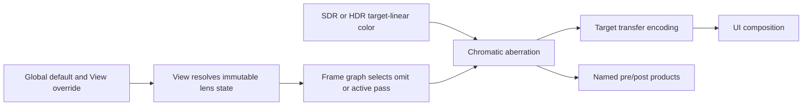

# Chromatic Aberration Execution Architecture

**Status:** proposed target architecture; blocked until `CHRD-00`, not implementation proof

**Responsibility:** define per-view state, frame-graph placement, resource and shader ownership, active-state truth, debug/UI/capture joins, failure, and cost for the first-release lens pass

**Authority boundary:** [Semantics](Semantics.md) owns the model; [README](README.md) owns scope/acceptance; [Plan](Plan.md) owns delivery order; RHI owns command/resource mechanics only

**Current readiness:** **0/100 — target only**.

## Target Flow



One View-owned immutable state decides whether the pass exists. There is no asset, history, persistent GPU resource, background work, or renderer-global mutable effect owner in the first release.

## Ownership

| Owner | Responsibility |
| --- | --- |
| Renderer public display types | narrow serializable strength/center/start values and requested state |
| settings and View preparation | defaults, per-view override, validation, immutable resolved state and active reason |
| post-processing/display graph | exact target-linear input edge, optional output resource, encoding/UI ordering, debug bypass |
| shader runtime | one registered typed program and backend-neutral bindings |
| diagnostics/capture | requested/resolved/active values, domain, extent, pre/post identity |
| editor settings surface | labeled controls, neutral reset, unavailable reason; no duplicate runtime state |

## State And Selection

```text
Requested: authored values and provenance
Resolved: finite/range-checked values plus semantic revision and output extent
Active: pass scheduled for this View/frame, with exact reason
```

Neutral strength resolves to `Off` and pass omission. Invalid values resolve to `Unavailable` or an explicitly documented sanitized state chosen by `CHRD-07`; they never become active with hidden defaults. Resize changes derived pixel displacement but does not own history or require a stale resource generation.

## Graph And Product Contract

The pass reads one target-linear color resource at `OutputExtent`, writes one same-format/same-extent color resource, and declares no other persistent state. The output replaces the encoding input; UI remains downstream. Exact debug modes bypass the lens pass, while display-intent debug modes follow the classification owned by Debug Views.

The initial implementation remains a distinct pass to preserve raw pre/post capture and fault localization. A later fusion into another post shader may be considered only with measured benefit and unchanged graph-visible semantic/product identities.

## Failure Matrix

| Failure | Detection | Safe result |
| --- | --- | --- |
| invalid/non-finite controls | View resolution | feature unavailable or explicitly sanitized; never partial state |
| zero/minimized extent | frame admission/graph | no dispatch; preserve normal minimized-frame behavior |
| missing/stale input | graph validation | fail the frame/feature boundary visibly; never sample arbitrary data |
| shader/pipeline/binding failure | materialization | active request fails visibly; no mislabeled identity substitute |
| resize during frame sequence | immutable frame extent and generation | each admitted frame uses one coherent extent |
| device loss | existing RHI recovery | no feature-owned state to restore; program/pipeline follows normal generation |

## Support And Exclusions

| Cell | Target |
| --- | --- |
| D3D12 / Vulkan | identical math and typed binding; native validation and raw comparison |
| SDR / HDR10 | same model over explicitly named target-linear domain; separate acceptance cells |
| Editor / packaged Runtime | same resolved values and shader; editor authoring is development-only unless product scope says otherwise |
| viewport/capture | output extent and product generation remain coherent; metadata names active state |
| local volumes, spectral LUT, quality tiers, history | excluded and not selectable |

## Cost Model

The material costs are one output-resolution resource when active, one dispatch, three filtered color reads and one write per pixel for the preferred model, state/binding bytes, and graph barriers. Stage 0 freezes GPU time and transient-memory budgets at representative 1080p and 4K. Zero state must have zero pass/resource cost.

No permanent instrumentation, effect manager, generic lens framework, async job, or per-frame logging is justified.

## Clean Break

Extend the current display settings, View resolution, post-processing graph, shader program catalog, capture metadata, and existing editor controls. Do not create a separate post-process settings store. Any experimental names or model variants introduced while deciding `CHRD-00` are deleted before Stage 1 rather than retained as aliases.

